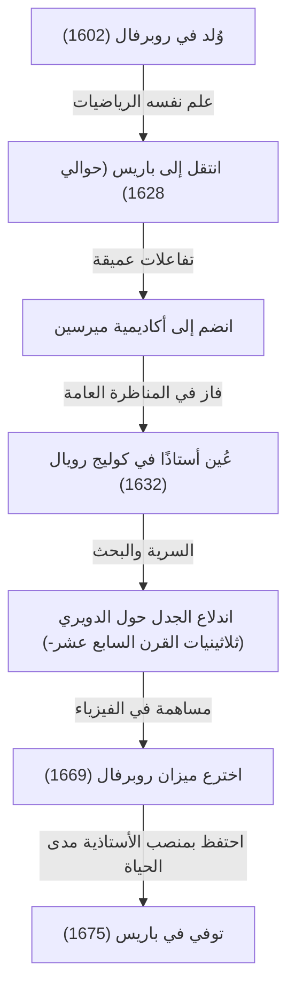
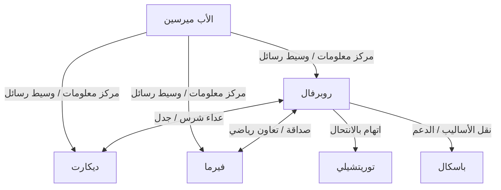

## 1. مقدمة: عمالقة عشية حساب التفاضل والتكامل ورياضيات القرن السابع عشر

كانت أوروبا في القرن السابع عشر حقبة من الانفجار المعرفي الدراماتيكي، والذي عُرف لاحقًا باسم "الثورة العلمية". وعلى وجه الخصوص في مجال الرياضيات، كانت الاستعدادات السريعة جارية لولادة رياضيات جديدة تتجاوز إطار الهندسة الإقليدية الموروثة من اليونان القديمة للتعامل مع الكميات المتغيرة، والمتناهية في الصغر، واللانهائية - أي "حساب التفاضل والتكامل". إن الصرح التاريخي المتمثل في إكمال حساب التفاضل والتكامل من قبل [إسحاق نيوتن](https://kenji.blog/p/newton/) وغوتفريد فيلهلم لايبنيز لم يتحقق بأي حال من الأحوال بفضل عبقريتهما وحدهما. بل كان وراء ذلك نضالات العديد من علماء الرياضيات الذين صارعوا مفاهيم اللانهاية والنهايات قبلهما.

كان أحد أهم علماء الرياضيات في فرنسا في "عشية حساب التفاضل والتكامل" هذه هو [جيل بيرسون دي روبرفال](https://kenji.blog/p/roberval/) (1602-1675). أدخل روبرفال إلى فرنسا "طريقة المتناهيات في الصغر" التي اقترحها العالم الإيطالي بونافنتورا كافالييري، ومن خلال تنقيحها بشكل مستقل، ابتكر طرقًا قوية لحساب مساحة الأشكال المحدودة بالمنحنيات وحجم مجسمات الدوران. كما أظهر موهبة بارزة في مجالي الفيزياء والميكانيكا، تاركًا وراءه اختراعًا رائدًا يُعرف باسم "ميزان روبرفال"، والذي لا يزال من الممكن رؤيته في الأسواق ومختبرات العلوم حتى اليوم.

في هذا المقال، سوف نتعمق في حياة هذا العالم الرياضي المنعزل الذي عاش حقبة مضطربة، وخلافاته الشرسة مع معاصريه، والإنجازات الرياضية والميكانيكية العميقة التي تركها وراءه، مع استكمالها بالرسومات التوضيحية الغنية والصيغ الرياضية.

## 2. حياة روبرفال والخلفية التاريخية

### 2.1. النهوض من طبقة الفلاحين والانتقال إلى باريس

ولد جيل بيرسون في 10 أغسطس 1602، في قرية صغيرة تسمى روبرفال بالقرب من بوفيه في شمال فرنسا. يُعتقد أن عائلته كانت من الفلاحين، وهو ما لم يكن بأي حال من الأحوال خلفية مفيدة للتعليم في المجتمع الطبقي الصارم في ذلك الوقت. ومع ذلك، منذ صغره، أظهر ذكاءً استثنائيًا واهتمامًا قويًا بالرياضيات. في وقت لاحق، اتخذ اسم قريته الأصلية وبدأ يطلق على نفسه اسم "دي روبرفال". يمكن اعتبار هذا تعبيرًا عن فخره بأصوله بالإضافة إلى كونه محاولة لإثبات هويته كعالم.

بعد أن علم نفسه الرياضيات واللغات الكلاسيكية (اللاتينية واليونانية) في سن مبكرة، هدف روبرفال إلى بلوغ آفاق أكاديمية أعلى وانتقل إلى العاصمة، باريس، في حوالي عام 1628. كانت باريس في ذلك الوقت بوتقة تنصهر فيها العلوم، حيث جمعت المفكرين من جميع أنحاء أوروبا. هناك، بدأ يتردد على تجمع المفكرين المتمركز حول الأب [مارين ميرسين](https://kenji.blog/p/mersenne/)، والمعروف باسم "أكاديمية ميرسين". كان ميرسين، الذي يُطلق عليه غالبًا "مدير مكتب بريد العلوم الأوروبية"، يعمل كوسيط للمراسلات بين العلماء في جميع أنحاء أوروبا، ويلعب دورًا في مشاركة أحدث الاكتشافات العلمية.

من خلال صالون ميرسين، عمّق روبرفال تفاعلاته مع أبرز العقول في فرنسا في ذلك الوقت، مثل [رينيه ديكارت](https://kenji.blog/p/descartes/)، و[بيير دي فيرما](https://kenji.blog/p/fermat/)، و[بليز باسكال](https://kenji.blog/p/pascal/)، وإتيان باسكال (والد بليز)، مما سمح لمواهبه الرياضية بالازدهار.

### 2.2. أستاذية كوليج رويال ومعارك الدفاع المرهقة

في عام 1632، حدثت نقطة تحول كبرى بالنسبة لروبرفال. فُتح شاغر لمنصب أستاذ الرياضيات (كرسي راموس) الذي أنشأه بيير دي لا رامي، عالم المنطق والرياضيات الشهير، في كوليج دي فرانس (المعروف آنذاك باسم كوليج رويال) في باريس.

كانت طريقة الاختيار لهذا المنصب الأستاذي غير عادية ومرهقة للغاية. كان المرشحون يشاركون في مناظرات رياضية علنًا، والفائز يحصل على المنصب. علاوة على ذلك، ومما يثير الرعب، أن هذا المنصب لم يكن مدى الحياة؛ بل تطلب قبول منافسين كل ثلاث سنوات للمشاركة في مناظرات عامة، وكان على المرء أن يستمر في الفوز للدفاع عنه. الهزيمة تعني الفقدان الفوري لمنصب الأستاذ وراتبه.

فاز روبرفال ببراعة في هذه المنافسة القاسية وتولى مقعد الأستاذ. ومما يثير الدهشة أنه دافع بنجاح عن هذا المنصب دون هزيمة واحدة لأكثر من 40 عامًا، حتى وفاته عن عمر يناهز 73 عامًا في عام 1675.

أحد الأسباب التي جعلته مترددًا في نشر اكتشافاته الرياضية بسرعة في شكل أوراق بحثية أو كتب يكمن تحديدًا في "معارك الدفاع كل ثلاث سنوات" هذه. من أجل هزيمة المتنافسين في الأماكن العامة، كان من الضروري إبقاء أحدث النتائج الرياضية وطرق الحل القوية مخفية كـ "أسلحة سرية". تسببت هذه السرية الشديدة لاحقًا في نزاعات خطيرة حول الأولوية (نقاشات حول من اكتشف شيئًا ما أولاً) مع معاصريه.

## 3. الإنجازات الرياضية: المتناهيات في الصغر وفجر التكامل

### 3.1. إدخال وتنقيح طريقة المتناهيات في الصغر

كان أعظم إنجاز رياضي لروبرفال هو كونه أول من أدخل إلى فرنسا **طريقة المتناهيات في الصغر**، التي بدأها عالم الرياضيات الإيطالي بونافنتورا كافالييري، وتطويرها وتنقيحها بشكل مستقل. كانت هذه الطريقة سلفًا مباشرًا رائدًا لحساب التفاضل والتكامل الحديث.

متناهيات كافالييري في الصغر هي مفهوم أن "السطح هو مجموعة من عدد لا نهائي من القطع المستقيمة المتوازية (كميات غير قابلة للتجزئة)، والمجسم هو مجموعة من عدد لا نهائي من المستويات المتوازية". بعبارات حديثة، هذه هي الفكرة الأساسية الدقيقة للتكامل المحدود: تقطيع الشكل إلى شرائح رقيقة بشكل لا نهائي وجمعها معًا لإيجاد المساحة أو الحجم.

قام روبرفال بتنقيح هذا المفهوم بشكل أكثر رياضية. عند حساب مساحة منحنى معين، قام بتمثيله كمجموع مستطيلات رقيقة لانهائية تشكل هذا المنحنى. جعلت طريقته "طريقة الاستنفاد" التي استخدمها العالم اليوناني القديم أرخميدس أكثر بديهية وأسهل في الحساب، لتصبح أداة قوية لحل العديد من المسائل الهندسية الصعبة.

### 3.2. تكامل القوى والاكتشاف الموازي مع فيرما

باستخدام طريقة المتناهيات في الصغر، نجح روبرفال في إثبات الحساب المكافئ للتكامل المحدود $ \int_{0}^{a} x^n dx $ هندسيًا للحالات التي يكون فيها $ n $ عددًا صحيحًا موجبًا. من خلال التعامل مع المساحة الواقعة أسفل المنحنى كمجموع متتالية لا نهائية واستخدام صيغة مجموع قوى الأعداد الطبيعية، توصل إلى الاستنتاج التالي:

$$
\int_{0}^{a} x^n dx = \frac{a^{n+1}}{n+1} \quad \left( \text{حيث } n \text{ عدد صحيح موجب} \right)
$$

على سبيل المثال، عندما $ n = 2 $، تكون المساحة الواقعة أسفل القطع المكافئ $ y = x^2 $ هي $ \frac{a^3}{3} $. كان هذا هو نفس النتيجة التي اكتشفها [بيير دي فيرما](https://kenji.blog/p/fermat/) بشكل مستقل في نفس الوقت تقريبًا. احترم روبرفال وفيرما أساليب بعضهما البعض وتشاركا هذا الاكتشاف من خلال الرسائل. أصبحت إنجازاتهم نقطة انطلاق مهمة نحو صياغة لايبنيز اللاحقة للتكامل.

## 4. دراسة الدويري والنزاعات الشرسة حول الأولوية

### 4.1. هندسة هيلين: سحر الدويري

في المجتمع الرياضي في القرن السابع عشر، كان هناك منحنى أسر العلماء وأصبح في الوقت نفسه بذرة جدل شرس، سُمي بـ "هندسة هيلين". كان ذلك هو **الدويري** (Cycloid). الدويري هو المسار الذي ترسمه نقطة على محيط دائرة تتدحرج دون انزلاق على طول خط مستقيم.

انجذب جاليليو جاليلي إلى جمال هذا المنحنى وأطلق عليه اسم "الدويري". باستخدام المعلمة $ t $ (زاوية الدوران) ونصف قطر $ r $ للدائرة المولدة، يتم التعبير عن إحداثيات $ (x, y) $ لنقطة على الدويري على النحو التالي:

$$
\begin{cases}
x = r(t - \sin t) \\
y = r(1 - \cos t)
\end{cases}
$$

من خلال تجارب فيزيائية تتمثل في قطع صفيحة معدنية على شكل دويري ووزنها، افترض جاليليو أن "مساحة قوس الدويري تعادل بالضبط ثلاثة أضعاف مساحة دائرته المولدة". ومع ذلك، لم يتمكن من إثبات ذلك رياضيًا.

### 4.2. إثبات المساحة الصارم لروبرفال

في عام 1634، وباستخدام طريقة المتناهيات في الصغر بالكامل، أثبت روبرفال رياضيًا وبشكل صارم أن حدس جاليليو كان صحيحًا. لقد قارن بذكاء منحنى الدويري بالمنحنى الناتج عند إزاحة الدائرة المولدة، مستخدمًا طريقة هندسية رائعة لتقسيم المساحة وإعادة بنائها.

باستخدام حساب التفاضل والتكامل الحديث، يمكن حساب المساحة $ A $ المحدودة بقوس واحد من الدويري ($ 0 \le t \le 2\pi $) والقاعدة (المحور السيني) بسهولة على النحو التالي:

$$
\begin{aligned}
A &= \int_{0}^{2\pi r} y \, dx \\
  &= \int_{0}^{2\pi} r(1 - \cos t) \cdot r(1 - \cos t) \, dt \\
  &= r^2 \int_{0}^{2\pi} (1 - 2\cos t + \cos^2 t) \, dt \\
  &= r^2 \left[ t - 2\sin t + \frac{t}{2} + \frac{\sin 2t}{4} \right]_{0}^{2\pi} \\
  &= r^2 \left( 2\pi + \pi \right) = 3\pi r^2
\end{aligned}
$$

حقق روبرفال هذا الاكتشاف العظيم، لكنه، كعادته، أرجأ نشره للدفاع عن منصبه كأستاذ، وقام بنقله فقط عبر رسائل إلى عدد قليل من علماء الرياضيات المقربين (مثل ميرسين).

### 4.3. الجدل مع توريتشيلي

بعد عدة سنوات، في عام 1644، اكتشف العالم الإيطالي إيفانجليستا توريتشيلي (تلميذ جاليليو، المشهور بـ "فراغ توريتشيلي") بشكل مستقل أن مساحة الدويري تساوي ثلاثة أضعاف مساحة دائرته، ونشر ذلك في كتاب.

عندما علم روبرفال بهذا، استشاط غضبًا. واتهم توريتشيلي، مدعيًا: "اختلس توريتشيلي النظر إلى نتائجي من خلال رسائل ميرسين ونشرها على أنها اكتشافه الخاص." أصبح هذا الجدل حول الانتحال شرسًا للغاية، وتضررت العلاقة بين الاثنين بشكل لا يمكن إصلاحه. واليوم، يُعتقد أن اكتشاف توريتشيلي تم بشكل مستقل ولم يكن انتحالًا، ولكن تُذكر هذه الحادثة كحكاية توضح مزاج روبرفال الناري وحدود نقل المعلومات في ذلك الوقت.

## 5. البناء الكينماتيكي للمماسات: مسار آخر نحو المشتقات

ابتكر روبرفال نهجًا رائدًا ليس فقط في مجال التكامل بل وأيضًا في مجال التفاضل (مسألة رسم المماسات). كان ذلك يتمثل في إعادة النظر في المسائل الهندسية على أنها "كينماتيكا" (علم حركة المجرد) فيزيائية.

في ذلك الوقت، كان إيجاد مماس لمنحنى أحد أهم المسائل في الهندسة. كان [رينيه ديكارت](https://kenji.blog/p/descartes/) يحاول إيجاد المماسات باستخدام نهج هندسي جبري مع المعادلات الجبرية، لكن كان له عيب يتمثل في حسابات مرهقة للغاية.

في المقابل، فكر روبرفال على النحو التالي: "إذا كان المنحنى مسارًا ترسمه نقطة متحركة، فإن الاتجاه الذي تتحرك فيه تلك النقطة في أي لحظة معينة (متجه السرعة) هو بالضبط المماس للمنحنى."

قام بتحليل حركة نقطة تولد منحنى معقدًا إلى مكوني حركة بسيطين. ثم، من خلال إيجاد متجهات السرعة في كل مكون حركة ودمجها هندسيًا (مجموع المتجهات)، حدد المماس على أنه اتجاه متجه السرعة المحصل.

أظهر "طريقة المماس الكينماتيكي" هذه قوة هائلة في إيجاد المماسات للمنحنيات المتسامية (المنحنيات التي لا يمكن التعبير عنها بالمعادلات الجبرية) مثل الدويري. كان نهج روبرفال المتمثل في إدخال هذا المفهوم الفيزيائي للحركة في الرياضيات خطوة بالغة الأهمية أدت بشكل مباشر إلى الأيديولوجية الأساسية لـ "طريقة التدفقات" (حساب التفاضل والتكامل الكينماتيكي) التي أسسها [إسحاق نيوتن](https://kenji.blog/p/newton/) لاحقًا.

## 6. مساهمات في الميكانيكا: ميزان روبرفال

بينما استكشف روبرفال اللانهاية المجردة والحركة في الرياضيات، كان يمتلك أيضًا موهبة بارزة في فيزياء العالم الحقيقي، والميكانيكا، وحتى التصميم الهندسي للآلات. المثال الأبرز، والمعروف على نطاق واسع اليوم باسمه، هو **"ميزان روبرفال"**.

### 6.1. عيوب الموازين التقليدية

كانت الموازين المستخدمة منذ العصور القديمة تحتوي على آلية "القبّان" حيث تُدعم العارضة عند نقطة ارتكاز مركزية مع كفتين تتدليان من كلا الطرفين. في هذه الطريقة، كان لابد أن تكون المسافة من نقطة الارتكاز إلى الكفتين (ذراع العزم) ثابتة بدقة من أجل وزن دقيق. بالإضافة إلى ذلك، كان به عيب قاتل: إذا انحرف الموضع الذي توضع فيه الأوزان أو الأشياء على الكفة عن المركز، فإن العزم يتغير بسبب مبدأ الرافعة، مما يجعل القياس الدقيق مستحيلاً.

### 6.2. اعتماد آلية وصلة متوازي الأضلاع

في عام 1669، قدم روبرفال آلية رائدة للأكاديمية الملكية الفرنسية للعلوم والتي حلت هذه المشكلة تمامًا. واعتمد "آلية وصلة متوازي الأضلاع" (هيكل مشابه للبانتوجراف) التي تربط قضيبين متوازيين علوي وسفلي مع قضبان عمودية يسرى ويمنى باستخدام دبابيس.

مع هذا الهيكل، تتحرك الكفتان اليسرى واليمنى لأعلى ولأسفل في انتقال متوازٍ مع الحفاظ باستمرار على الوضع الأفقي دون إمالة. حقيقة أن الكفتين تتحركان أفقيًا تعني، من مبدأ الشغل الافتراضي، أنه بغض النظر عن المكان الذي يوضع فيه الوزن على الكفة، فإن المسافة التي يتحركها الوزن لأعلى ولأسفل (مقدار الشغل) لا تتغير.

ونتيجة لذلك، تم تحقيق ميزان ذو خصائص عملية ممتازة للغاية: "بغض النظر عن مكان وضع الوزن على الكفة، فإن نتيجة الوزن لا تتغير على الإطلاق." يستمر استخدام هذا المبدأ المبتكر كما هو حتى اليوم، كأساس للموازين المستخدمة في مكاتب البريد لوزن الرسائل، وموازين التحميل العلوي المستخدمة في الأسواق لوزن المكونات، وحتى الموازين الموجودة في مختبرات العلوم المدرسية. حقيقة أن الآلية الميكانيكية التي ابتكرت منذ أكثر من 350 عامًا لا تزال مستخدمة حتى اليوم دون تغيير مبدأها الأساسي تتحدث مجلدات عن الحس الهندسي الهائل لروبرفال.

## 7. التفاعلات مع المعاصرين وحياة مليئة بالخلافات

إلى جانب موهبته البارزة، يُقال إن روبرفال كان يتمتع بمزاج ناري للغاية وشخصية عنيدة ترفض التنازل عن نظرياتها. ونتيجة لذلك، انخرط في خلافات شرسة مع العديد من العلماء البارزين في عصره.

- **الصراع مع [رينيه ديكارت](https://kenji.blog/p/descartes/)**:
  بينما روج ديكارت لـ "الهندسة التحليلية"، التي حلت المسائل الهندسية باستخدام الجبر، قدر روبرفال الأساليب الهندسية والكينماتيكية البحتة. انتقد روبرفال طريقة ديكارت لكونها مصطنعة للغاية وكثيرًا ما هاجم العيوب في نظريات ديكارت. في المقابل، نظر ديكارت باحتقار إلى روبرفال ووصفه بأنه "فظ وغير متعلم"، وظلت علاقتهما عدائية طوال حياتهما.
- **الصداقة مع [بيير دي فيرما](https://kenji.blog/p/fermat/)**:
  على النقيض من ديكارت، بنى روبرفال علاقة جيدة جدًا مع فيرما، الذي عاش في تولوز. على الرغم من أن شخصياتهما كانت متناقضة، إلا أنهما تشاركا الأفكار الرياضية من خلال الرسائل بوساطة ميرسين، مكملين أبحاث بعضهما البعض حول قضايا مثل المتناهيات في الصغر.
- **التأثير على [بليز باسكال](https://kenji.blog/p/pascal/)**:
  تأثر العبقري الشاب باسكال أيضًا بشكل كبير بروبرفال. نشر باسكال لاحقًا أوراقًا بحثية حول الدويري باستخدام الاسم المستعار "أ. ديتونفيل" (A. Dettonville)، وكانت العديد من الأساليب المستخدمة فيها عبارة عن نسخ منقحة من أفكار روبرفال حول المتناهيات في الصغر. قدر روبرفال موهبة باسكال كثيرًا ودعمه.

## 8. الخاتمة: العبقري المنعزل الذي سد الفجوة نحو حساب التفاضل والتكامل

استخدم [جيل بيرسون دي روبرفال](https://kenji.blog/p/roberval/)، في الحقبة التي سبقت ولادة حساب التفاضل والتكامل رسميًا، سلاحين قويين - طريقة المتناهيات في الصغر والنهج الكينماتيكي - لحل أصعب المشكلات الرياضية في عصره بشكل تسلسلي.

نتيجة لتأخيره المفرط في نشر اكتشافاته بسبب ضغط الدفاع عن منصبه كأستاذ كل ثلاث سنوات، لم يتم تقييم بعض إنجازاته بشكل عادل من قبل معاصريه، وكان يُجر أحيانًا إلى نزاعات أولويات غير راغب فيها. ومع ذلك، فإن بذور الأفكار الرياضية التي زرعها انتشرت بالتأكيد عبر شبكة ميرسين والمعارف مثل فيرما وباسكال، لتصبح جسرًا قويًا يؤدي إلى تأسيس حساب التفاضل والتكامل من قبل نيوتن ولايبنيز لاحقًا.

علاوة على ذلك، وكما رأينا في اختراعه "ميزان روبرفال" في الميكانيكا، فبدلاً من الرياضيات المجردة فقط، كان تفكيره النظري دائمًا مرتبطًا ارتباطًا وثيقًا بالعالم المادي الحقيقي. روبرفال، الذي كان نشطًا في المنطقة الحدودية بين الرياضيات والفيزياء، محفور حقًا في تاريخ الرياضيات إلى الأبد باعتباره "لاعبًا رئيسيًا خلف الكواليس" دعم ودفع الثورة العلمية في القرن السابع عشر بشكل أساسي.
