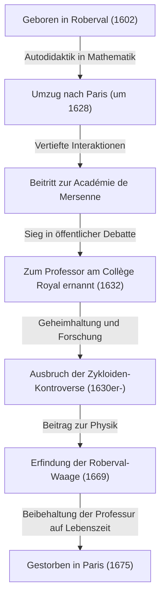
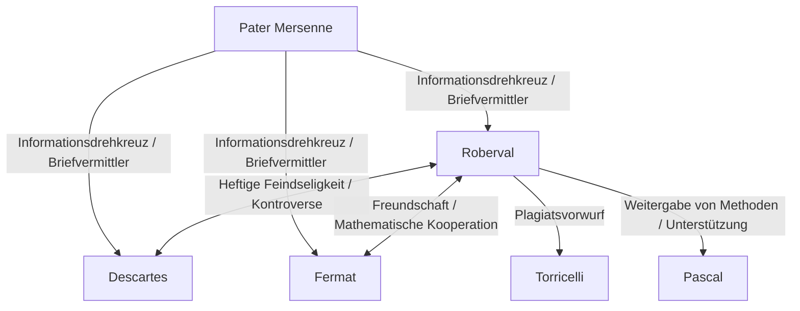

## 1. Einleitung: Giganten am Vorabend der Infinitesimalrechnung und die Mathematik des 17. Jahrhunderts

Das Europa des 17. Jahrhunderts war eine Zeit einer dramatischen Wissensexplosion, die später als „Wissenschaftliche Revolution“ bekannt wurde. Insbesondere auf dem Gebiet der Mathematik wurden hastig Vorbereitungen für die Geburt einer neuen Mathematik getroffen, die über den aus dem antiken Griechenland überlieferten Rahmen der euklidischen Geometrie hinausging, um mit veränderlichen Größen, dem Unendlichkleinen und dem Unendlichen umzugehen – nämlich der „Infinitesimalrechnung“. Das historische Monument der Vollendung der Infinitesimalrechnung durch [Isaac Newton](https://kenji.blog/de/p/newton/) und Gottfried Wilhelm Leibniz wurde keineswegs durch das Genie dieser beiden allein erreicht. Dahinter standen die Kämpfe zahlreicher Mathematiker, die sich vor ihnen mit den Konzepten von Unendlichkeit und Grenzwerten auseinandergesetzt hatten.

Einer der wichtigsten Mathematiker in Frankreich an diesem „Vorabend der Infinitesimalrechnung“ war [Gilles Personne de Roberval](https://kenji.blog/de/p/roberval/) (1602–1675). Roberval führte die von dem Italiener Bonaventura Cavalieri vorgeschlagene „Methode der Indivisiblen“ (Unteilbaren) in Frankreich ein und schuf durch ihre eigenständige Verfeinerung leistungsstarke Methoden zur Berechnung der Fläche von durch Kurven begrenzten Figuren und des Volumens von Rotationskörpern. Er zeigte auch herausragendes Talent in den Bereichen Physik und Mechanik und hinterließ eine bahnbrechende Erfindung, die als „Roberval-Waage“ (Tafelwaage) bekannt ist und noch heute auf Märkten und in naturwissenschaftlichen Labors zu sehen ist.

In diesem Artikel werden wir tief in das Leben dieses einsamen Mathematikers, der eine turbulente Zeit durchlebte, in seine heftigen Kontroversen mit Zeitgenossen und in die tiefgreifenden mathematischen und mechanischen Errungenschaften, die er hinterließ, eintauchen – komplett mit reichhaltigen Illustrationen und mathematischen Formeln.

## 2. Robervals Leben und historischer Hintergrund

### 2.1. Aufstieg aus dem Bauernstand und Umzug nach Paris

Gilles Personne wurde am 10. August 1602 in einem kleinen Dorf namens Roberval in der Nähe von Beauvais im Norden Frankreichs geboren. Es wird angenommen, dass seine Familie Bauern waren, was in der strengen Klassengesellschaft der damaligen Zeit keineswegs ein vorteilhafter Hintergrund für Gelehrsamkeit war. Schon in jungen Jahren zeigte er jedoch einen außergewöhnlichen Intellekt und ein starkes Interesse an Mathematik. Später nahm er den Namen seines Heimatdorfes an und begann, sich „de Roberval“ zu nennen. Dies kann sowohl als Ausdruck seines Stolzes auf seine Herkunft als auch als Versuch gesehen werden, seine Identität als Gelehrter zu etablieren.

Nachdem er sich in jungen Jahren Mathematik und klassische Sprachen (Latein und Griechisch) selbst beigebracht hatte, strebte Roberval nach höheren akademischen Weihen und zog um 1628 in die Hauptstadt Paris. Paris war zu dieser Zeit ein Schmelztiegel der Gelehrsamkeit und versammelte Intellektuelle aus ganz Europa. Dort begann er, die Versammlung von Intellektuellen rund um Pater [Marin Mersenne](https://kenji.blog/de/p/mersenne/), bekannt als die „Académie de [Mersenne](https://kenji.blog/de/p/mersenne/)“, zu besuchen. [Mersenne](https://kenji.blog/de/p/mersenne/), der oft als „der Postmeister der europäischen Gelehrsamkeit“ bezeichnet wird, fungierte als Vermittler für die Korrespondenz zwischen Gelehrten in ganz Europa und spielte eine Rolle beim Austausch der neuesten wissenschaftlichen Entdeckungen.

Durch [Mersenne](https://kenji.blog/de/p/mersenne/)s Salon vertiefte Roberval seine Interaktionen mit den führenden Köpfen Frankreichs der damaligen Zeit, wie [René Descartes](https://kenji.blog/de/p/descartes/), [Pierre de Fermat](https://kenji.blog/de/p/fermat/), [Blaise Pascal](https://kenji.blog/de/p/pascal/) und Étienne Pascal (Blaises Vater), wodurch seine mathematischen Talente aufblühen konnten.

### 2.2. Die Professur am Collège Royal und aufreibende Verteidigungskämpfe

Im Jahr 1632 kam es zu einem wichtigen Wendepunkt für Roberval. Am Collège de France (damals bekannt als Collège Royal) in Paris wurde eine von Pierre de la Ramée, einem berühmten Logiker und Mathematiker, gestiftete Professur für Mathematik (der Ramus-Lehrstuhl) vakant.

Die Auswahlmethode für diese Professorenstelle war höchst ungewöhnlich und aufreibend. Die Kandidaten lieferten sich öffentlich mathematische Debatten, und der Gewinner erhielt die Position. Darüber hinaus war diese Position erschreckenderweise nicht auf Lebenszeit angelegt; sie erforderte, alle drei Jahre Herausforderer zu akzeptieren, um sich an öffentlichen Debatten zu beteiligen, und man musste weiterhin gewinnen, um sie zu verteidigen. Eine Niederlage bedeutete den sofortigen Verlust der Professur und des damit verbundenen Gehalts.

Roberval gewann diesen zermürbenden Wettbewerb auf großartige Weise und übernahm den Lehrstuhl. Erstaunlicherweise verteidigte er diese Position mehr als 40 Jahre lang ohne eine einzige Niederlage erfolgreich, bis er 1675 im Alter von 73 Jahren verstarb.

Einer der Gründe, warum er zögerte, seine mathematischen Entdeckungen schnell als Aufsätze oder Bücher zu veröffentlichen, lag genau in diesen „Verteidigungskämpfen alle drei Jahre“. Um Herausforderer in der Öffentlichkeit zu besiegen, war es notwendig, die neuesten mathematischen Ergebnisse und leistungsstarken Lösungsmethoden als „Geheimwaffen“ verborgen zu halten. Diese extreme Geheimhaltung führte später zu ernsthaften Prioritätsstreitigkeiten (Debatten darüber, wer etwas zuerst entdeckt hatte) mit seinen Zeitgenossen.

## 3. Mathematische Errungenschaften: Indivisible und der Beginn der Integration

### 3.1. Einführung und Verfeinerung der Methode der Indivisiblen

Robervals größte mathematische Errungenschaft war es, als Erster die vom Italiener Bonaventura Cavalieri initiierte **Methode der Indivisiblen** in Frankreich einzuführen und sie unabhängig weiterzuentwickeln und zu verfeinern. Diese Methode war ein direkter, bahnbrechender Vorläufer der modernen Integralrechnung.

Cavalieris Indivisible (Unteilbare) ist das Konzept, dass „eine Fläche eine Ansammlung unendlich vieler paralleler Liniensegmente (unteilbarer Größen) ist und ein Körper eine Ansammlung unendlich vieler paralleler Ebenen ist“. In modernen Begriffen ausgedrückt ist dies genau die Grundidee der bestimmten Integration: eine Figur in unendlich dünne Scheiben zu schneiden und diese zu addieren, um die Fläche oder das Volumen zu ermitteln.

Roberval verfeinerte dieses Konzept mathematischer. Bei der Berechnung der Fläche einer bestimmten Kurve stellte er sie als die Summe unendlich dünner Rechtecke dar, aus denen diese Kurve besteht. Seine Methode machte die vom antiken Griechen [Archimedes](https://kenji.blog/de/p/archimedes/) angewandte „Exhaustionsmethode“ (Ausschöpfungsmethode) intuitiver und leichter zu berechnen und wurde zu einem mächtigen Werkzeug zur Lösung zahlreicher schwieriger Geometrieprobleme.

### 3.2. Integration von Potenzen und parallele Entdeckung mit Fermat

Unter Verwendung der Methode der Indivisiblen gelang es Roberval, die äquivalente Berechnung des bestimmten Integrals $ \int_{0}^{a} x^n dx $ für Fälle, in denen $ n $ eine positive ganze Zahl ist, geometrisch zu beweisen. Indem er die Fläche unter einer Kurve als die Summe einer unendlichen Reihe behandelte und die Formel für die Summe von Potenzen natürlicher Zahlen nutzte, leitete er folgende Schlussfolgerung ab:

$$
\int_{0}^{a} x^n dx = \frac{a^{n+1}}{n+1} \quad \left( \text{wobei } n \text{ eine positive ganze Zahl ist} \right)
$$

Wenn beispielsweise $ n = 2 $ ist, beträgt die Fläche unter der Parabel $ y = x^2 $ $ \frac{a^3}{3} $. Dies war dasselbe Ergebnis, das [Pierre de Fermat](https://kenji.blog/de/p/fermat/) etwa zur gleichen Zeit unabhängig voneinander entdeckt hatte. Roberval und Fermat respektierten die Methoden des jeweils anderen und teilten diese Entdeckung durch Briefe. Ihre Errungenschaften wurden zu einem wichtigen Sprungbrett für Leibnizens spätere Formulierung der Integration.

## 4. Untersuchung der Zykloide und heftige Prioritätsstreitigkeiten

### 4.1. Die Geometrie der Helena: Der Charme der Zykloide

In der mathematischen Gemeinschaft des 17. Jahrhunderts gab es eine Kurve, die Gelehrte in ihren Bann zog und gleichzeitig zum Keim heftiger Kontroversen wurde, die sogenannte „Geometrie der Helena“. Das war die **Zykloide** (Radlinie). Eine Zykloide ist die Bahnkurve, die von einem Punkt auf dem Umfang eines Kreises beschrieben wird, wenn dieser ohne zu gleiten entlang einer geraden Linie rollt.

Galileo Galilei war von der Schönheit dieser Kurve fasziniert und nannte sie „Zykloide“. Unter Verwendung des Parameters $ t $ (Drehwinkel) und des Radius $ r $ des erzeugenden Kreises werden die Koordinaten $ (x, y) $ eines Punktes auf der Zykloiden wie folgt ausgedrückt:

$$
\begin{cases}
x = r(t - \sin t) \\
y = r(1 - \cos t)
\end{cases}
$$

Durch physikalische Experimente, bei denen er eine Metallplatte in Form einer Zykloide ausschnitt und wog, vermutete Galilei, dass „die Fläche eines Zykloidenbogens genau dreimal so groß ist wie die Fläche ihres erzeugenden Kreises“. Er konnte dies jedoch nicht mathematisch beweisen.

### 4.2. Robervals strenger Beweis der Fläche

Im Jahr 1634 bewies Roberval unter voller Ausschöpfung der Methode der Indivisiblen mathematisch und streng, dass Galileis Vermutung richtig war. Er verglich geschickt die Kurve der Zykloide mit der Kurve, die entsteht, wenn der erzeugende Kreis verschoben wird, und wandte eine brillante geometrische Methode der Teilung und Rekonstruktion der Fläche an.

Mit Hilfe der modernen Integralrechnung lässt sich die Fläche $ A $, die von einem Bogen der Zykloide ($ 0 \le t \le 2\pi $) und der Basis (x-Achse) eingeschlossen wird, leicht wie folgt berechnen:

$$
\begin{aligned}
A &= \int_{0}^{2\pi r} y \, dx \\
  &= \int_{0}^{2\pi} r(1 - \cos t) \cdot r(1 - \cos t) \, dt \\
  &= r^2 \int_{0}^{2\pi} (1 - 2\cos t + \cos^2 t) \, dt \\
  &= r^2 \left[ t - 2\sin t + \frac{t}{2} + \frac{\sin 2t}{4} \right]_{0}^{2\pi} \\
  &= r^2 \left( 2\pi + \pi \right) = 3\pi r^2
\end{aligned}
$$

Roberval vollbrachte diese großartige Entdeckung, zögerte die Veröffentlichung jedoch, wie so oft, hinaus, um seine Professur zu verteidigen, und teilte sie nur einigen wenigen ihm nahestehenden Mathematikern (wie [Mersenne](https://kenji.blog/de/p/mersenne/)) in Briefen mit.

### 4.3. Kontroverse mit Torricelli

Einige Jahre später, 1644, entdeckte der Italiener Evangelista Torricelli (ein Schüler von Galilei, berühmt für das „Torricelli-Vakuum“) unabhängig davon, dass die Fläche einer Zykloide dreimal so groß ist wie die ihres Kreises, und veröffentlichte dies in einem Buch.

Als Roberval davon erfuhr, war er wütend. Er beschuldigte Torricelli und behauptete: „Torricelli hat meine Ergebnisse durch Briefe von [Mersenne](https://kenji.blog/de/p/mersenne/) eingesehen und sie als seine eigene Entdeckung veröffentlicht.“ Diese Kontroverse über ein Plagiat wurde äußerst heftig, und die Beziehung zwischen den beiden wurde irreparabel beschädigt. Heute geht man davon aus, dass Torricellis Entdeckung unabhängig gemacht wurde und kein Plagiat war, aber dieser Vorfall ist als Anekdote in Erinnerung geblieben, die Robervals feuriges Temperament und die Grenzen der Informationsübertragung zu jener Zeit veranschaulicht.

## 5. Kinematische Konstruktion von Tangenten: Ein weiterer Weg zu Ableitungen

Roberval entwickelte einen bahnbrechenden Ansatz nicht nur auf dem Gebiet der Integration, sondern auch auf dem Gebiet der Differenziation (dem Problem des Ziehens von Tangenten). Es bestand darin, geometrische Probleme als physikalische „Kinematik“ (Bewegungslehre) neu zu betrachten.

Damals war das Finden der Tangente an eine Kurve eines der wichtigsten Probleme in der Geometrie. [René Descartes](https://kenji.blog/de/p/descartes/) versuchte, Tangenten mit einem algebraisch-geometrischen Ansatz mit algebraischen Gleichungen zu finden, aber dies hatte den Nachteil extrem umständlicher Berechnungen.

Im Gegensatz dazu dachte Roberval wie folgt: „Wenn eine Kurve eine Bahn ist, die von einem sich bewegenden Punkt beschrieben wird, dann ist die Richtung, in die sich dieser Punkt zu einem bestimmten Zeitpunkt bewegt (der Geschwindigkeitsvektor), genau die Tangente an die Kurve.“

Er zerlegte die Bewegung eines Punktes, der eine komplexe Kurve erzeugt, in zwei einfache Bewegungskomponenten. Dann bestimmte er, indem er die Geschwindigkeitsvektoren in jeder Bewegungskomponente fand und sie geometrisch kombinierte (Vektorsumme), die Tangente als die Richtung des resultierenden Geschwindigkeitsvektors.

Diese „kinematische Tangentenmethode“ erwies sich beim Finden von Tangenten für transzendente Kurven (Kurven, die nicht durch algebraische Gleichungen ausgedrückt werden können) wie die Zykloide als enorm wirkungsvoll. Robervals Ansatz, dieses physikalische Konzept der Bewegung in die Mathematik einzubringen, war ein äußerst wichtiger Schritt, der direkt zur grundlegenden Ideologie der später von [Isaac Newton](https://kenji.blog/de/p/newton/) begründeten „Fluxionsmethode“ (kinematische Infinitesimalrechnung) führte.

## 6. Beiträge zur Mechanik: Die Roberval-Waage

Während Roberval in der Mathematik das abstrakte Unendliche und die Bewegung erforschte, besaß er auch herausragendes Talent im Bereich der realen Physik, der Mechanik und sogar des technischen Designs von Maschinen. Das prominenteste Beispiel, das heute weithin unter seinem Namen bekannt ist, ist die **„Roberval-Waage“** (Tafelwaage).

### 6.1. Fehler herkömmlicher Waagen

Die seit der Antike verwendeten Waagen besaßen einen „Schnellwaagen“-Mechanismus, bei dem ein Balken an einem zentralen Drehpunkt gestützt wurde, an dessen beiden Enden Schalen hingen. Bei dieser Methode musste der Abstand vom Drehpunkt zu den Schalen (Hebelarm) für ein genaues Wiegen strikt konstant sein. Darüber hinaus hatte sie einen fatalen Fehler: Wenn die Position, an der Gewichte oder Gegenstände auf die Schale gelegt wurden, von der Mitte abwich, änderte sich das Moment aufgrund des Hebelprinzips, was eine genaue Messung unmöglich machte.

### 6.2. Übernahme des Parallelogramm-Koppelgetriebes

Im Jahr 1669 präsentierte Roberval der französischen Königlichen Akademie der Wissenschaften einen bahnbrechenden Mechanismus, der dieses Problem vollständig löste. Er übernahm ein „Parallelogramm-Koppelgetriebe“ (eine Struktur ähnlich einem Pantografen), das zwei obere und untere parallele Stangen mit linken und rechten vertikalen Stangen durch Bolzen verband.

Mit dieser Struktur bewegen sich die linke und rechte Schale in paralleler Verschiebung nach oben und unten, wobei sie ständig die Horizontalität beibehalten, ohne zu kippen. Die Tatsache, dass sich die Schalen horizontal bewegen, bedeutet gemäß dem Prinzip der virtuellen Arbeit, dass sich die Strecke, die sich das Gewicht auf und ab bewegt (Arbeitsaufwand), unabhängig davon, wo das Gewicht auf die Schale gelegt wird, nicht ändert.

Infolgedessen wurde eine Waage mit äußerst hervorragenden praktischen Eigenschaften realisiert: „Egal, wo das Gewicht auf die Schale gelegt wird, das Wiegeergebnis ändert sich überhaupt nicht.“ Dieses innovative Prinzip wird bis heute unverändert als Grundlage für Waagen verwendet, die in Postämtern zum Wiegen von Briefen benutzt werden, für Tafelwaagen (Oberschalige Waagen), die auf Märkten zum Wiegen von Zutaten benutzt werden, und sogar für die Waagen, die in den naturwissenschaftlichen Räumen von Schulen zu finden sind. Die Tatsache, dass ein vor über 350 Jahren erdachter mechanischer Mechanismus noch heute verwendet wird, ohne sein Grundprinzip zu ändern, spricht Bände über Robervals enormen technischen Sinn.

## 7. Interaktionen mit Zeitgenossen und ein Leben voller Kontroversen

Neben seinem herausragenden Talent soll Roberval ein sehr feuriges Temperament und eine sture Persönlichkeit gehabt haben, die sich weigerte, bei seinen Theorien nachzugeben. Folglich lieferte er sich heftige Kontroversen mit vielen berühmten Gelehrten seiner Zeit.

- **Konflikt mit [René Descartes](https://kenji.blog/de/p/descartes/)**:
  Während [Descartes](https://kenji.blog/de/p/descartes/) die „analytische Geometrie“ förderte, die die Geometrie mithilfe der Algebra löste, schätzte Roberval rein geometrische und kinematische Methoden. Roberval kritisierte [Descartes](https://kenji.blog/de/p/descartes/)' Methode als zu künstlich und griff oft Fehler in [Descartes](https://kenji.blog/de/p/descartes/)' Theorien an. [Descartes](https://kenji.blog/de/p/descartes/) wiederum blickte auf Roberval als „grob und ungebildet“ herab, und ihre Beziehung blieb ihr Leben lang feindselig.
- **Freundschaft mit [Pierre de Fermat](https://kenji.blog/de/p/fermat/)**:
  Im Gegensatz zu [Descartes](https://kenji.blog/de/p/descartes/) baute Roberval eine sehr gute Beziehung zu Fermat auf, der in Toulouse lebte. Obwohl sie gegensätzliche Persönlichkeiten hatten, teilten sie mathematische Ideen durch Briefe, die von [Mersenne](https://kenji.blog/de/p/mersenne/) vermittelt wurden, und ergänzten so die Forschung des anderen zu Themen wie den Indivisiblen.
- **Einfluss auf [Blaise Pascal](https://kenji.blog/de/p/pascal/)**:
  Auch das junge Genie Pascal wurde stark von Roberval beeinflusst. Pascal veröffentlichte später Arbeiten über die Zykloide unter dem Pseudonym „A. Dettonville“, und viele der darin verwendeten Methoden waren verfeinerte Versionen von Robervals Ideen über Indivisible. Roberval schätzte Pascals Talent sehr und unterstützte ihn.

## 8. Fazit: Das einsame Genie, das die Brücke zur Infinitesimalrechnung schlug

[Gilles Personne de Roberval](https://kenji.blog/de/p/roberval/) schöpfte in der Zeit kurz vor der formellen Geburt der Infinitesimalrechnung zwei mächtige Waffen – die Methode der Indivisiblen und den kinematischen Ansatz – voll aus, um nacheinander die schwierigsten mathematischen Probleme seiner Zeit zu lösen.

Als Folge davon, dass er die Veröffentlichung seiner Entdeckungen aus Druck, seine Professur alle drei Jahre verteidigen zu müssen, übermäßig verzögerte, wurden einige seiner Errungenschaften von seinen Zeitgenossen nicht gerecht bewertet, und er wurde manchmal in ungewollte Prioritätsstreitigkeiten verwickelt. Die Saat der mathematischen Ideen, die er säte, verbreitete sich jedoch mit Sicherheit durch [Mersenne](https://kenji.blog/de/p/mersenne/)s Netzwerk und Bekannte wie Fermat und Pascal und wurde zu einer starken Brücke, die später zur Gründung der Infinitesimalrechnung durch Newton und Leibniz führte.

Darüber hinaus war sein theoretisches Denken, wie an seiner Erfindung der „Roberval-Waage“ in der Mechanik zu sehen ist, stets tief mit der realen physikalischen Welt verbunden und nicht nur mit abstrakter Mathematik. Roberval, der im Grenzgebiet zwischen Mathematik und Physik tätig war, ist wahrlich für immer in die Geschichte der Mathematik als „Schlüsselfigur hinter den Kulissen“ eingraviert, die die wissenschaftliche Revolution des 17. Jahrhunderts grundlegend stützte und vorantrieb.
