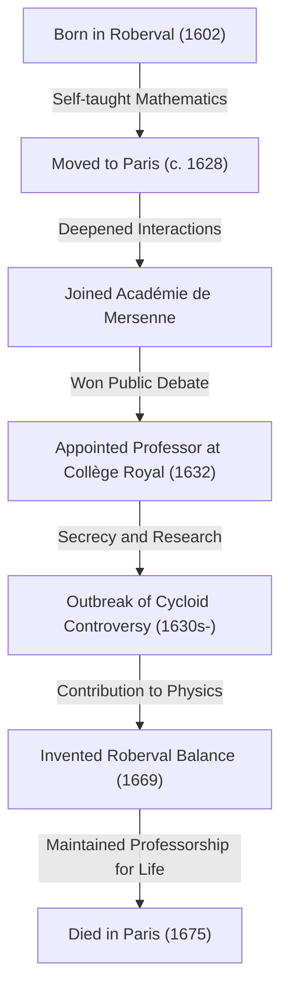
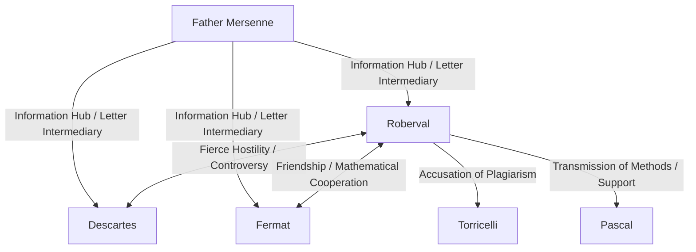

## 1. Introduction: Giants on the Eve of Calculus and 17th-Century Mathematics

Europe in the 17th century was a time of dramatic knowledge explosion, later known as the "Scientific Revolution." Particularly in mathematics, rapid preparations were underway for the birth of a new mathematics that moved beyond the framework of [[Euclid](https://kenji.blog/p/euclid/)e](https://kenji.blog/p/euclid/)an geometry inherited from ancient Greece to handle changing quantities, the infinitesimal, and the infinite—namely, "calculus." The historical monument of completing calculus by [Isaac Newton](https://kenji.blog/p/newton/) and Gottfried Wilhelm Leibniz was by no means achieved by the genius of those two alone. Behind it lay the struggles of many mathematicians who wrestled with the concepts of infinity and limits before them.

One of the most important mathematicians in France on this "eve of calculus" was [Gilles Personne de Roberval](https://kenji.blog/p/roberval/) (1602–1675). Roberval introduced to France the "method of indivisibles" proposed by the Italian Bonaventura Cavalieri, and by refining it independently, he created powerful methods for calculating the area of figures enclosed by curves and the volume of solids of revolution. He also demonstrated outstanding talent in the fields of physics and mechanics, leaving behind a groundbreaking invention known as the "Roberval balance," which can still be seen in markets and science labs today.

In this article, we will delve deeply into the life of this solitary mathematician who lived through a turbulent era, his fierce controversies with contemporaries, and the profound mathematical and mechanical achievements he left behind, complete with rich illustrations and mathematical formulas.

## 2. Roberval's Life and Historical Background

### 2.1. Rise from Peasantry and Moving to Paris

Gilles Personne was born on August 10, 1602, in a small village called Roberval near Beauvais in northern France. His family is thought to have been peasants, which was by no means an advantageous background for scholarship in the strict class society of the time. However, from a young age, he showed extraordinary intellect and a strong interest in mathematics. He later took the name of his home village and began calling himself "de Roberval." This can be seen as an expression of his pride in his origins as well as an attempt to establish his identity as a scholar.

Having taught himself mathematics and classical languages (Latin and Greek) at a young age, Roberval aimed for higher scholarly heights and moved to the capital, Paris, around 1628. Paris at that time was a melting pot of scholarship, gathering intellectuals from all over Europe. There, he began frequenting the gathering of intellectuals centered around Father [Marin Mersenne](https://kenji.blog/p/mersenne/), known as the "Académie de Mersenne." Mersenne, often called "the postmaster of European scholarship," acted as an intermediary for correspondence among scholars across Europe, playing a role in sharing the latest scientific discoveries.

Through Mersenne's salon, Roberval deepened his interactions with leading minds of France at the time, such as [René Descartes](https://kenji.blog/p/descartes/), [Pierre de Fermat](https://kenji.blog/p/fermat/), [Blaise Pascal](https://kenji.blog/p/pascal/), and Étienne Pascal (Blaise's father), allowing his mathematical talents to blossom.

### 2.2. The Collège Royal Professorship and Grueling Defense Battles

In 1632, a major turning point came for Roberval. A vacancy opened for the mathematics professorship (the Ramus chair) established by Pierre de la Ramée, a famous logician and mathematician, at the Collège de France (then known as the Collège Royal) in Paris.

The selection method for this professorial post was highly unusual and grueling. Candidates engaged in mathematical debates in public, and the winner obtained the position. Furthermore, terrifyingly, this position was not for life; it required accepting challengers every three years to engage in public debates, and one had to continue winning to defend it. Defeat meant an immediate loss of the professorship and its salary.

Roberval magnificently won this grueling competition and took the professor's seat. Astonishingly, he successfully defended this position without a single defeat for over 40 years, until he passed away at the age of 73 in 1675.

One of the reasons he was reluctant to quickly publish his mathematical discoveries as papers or books lay precisely in these "defense battles every three years." In order to defeat challengers in public, it was necessary to keep the latest mathematical results and powerful solving methods hidden as "secret weapons." This extreme secrecy later caused serious priority disputes (debates over who discovered something first) with his contemporaries.

## 3. Mathematical Achievements: Indivisibles and the Dawn of Integration

### 3.1. Introduction and Refinement of the Method of Indivisibles

Roberval's greatest mathematical achievement was being the first to introduce to France the **method of indivisibles**, initiated by the Italian mathematician Bonaventura Cavalieri, and developing and refining it independently. This method was a groundbreaking direct precursor to modern integral calculus.

Cavalieri's indivisibles is the concept that "a surface is a collection of infinitely many parallel line segments (indivisible quantities), and a solid is a collection of infinitely many parallel planes." In modern terms, it is the exact fundamental idea of definite integration: slicing a figure into infinitely thin slices and adding them up to find the area or volume.

Roberval refined this concept more mathematically. When calculating the area of a certain curve, he represented it as the sum of infinitely thin rectangles constituting that curve. His method made the "method of exhaustion" used by the ancient Greek Archimedes more intuitive and easier to calculate, becoming a powerful tool for solving numerous difficult geometry problems.

### 3.2. Integration of Powers and Parallel Discovery with Fermat

Using the method of indivisibles, Roberval succeeded in geometrically proving the equivalent calculation of the definite integral $ \int_{0}^{a} x^n dx $ for cases where $ n $ is a positive integer. By treating the area under a curve as the sum of an infinite sequence and utilizing the formula for the sum of powers of natural numbers, he derived the following conclusion:

$$
\int_{0}^{a} x^n dx = \frac{a^{n+1}}{n+1} \quad \left( \text{where } n \text{ is a positive integer} \right)
$$

For example, when $ n = 2 $, the area under the parabola $ y = x^2 $ is $ \frac{a^3}{3} $. This was the same result that [Pierre de Fermat](https://kenji.blog/p/fermat/) had discovered independently around the same time. Roberval and Fermat mutually respected each other's methods and shared this discovery through letters. Their achievements became an important stepping stone toward Leibniz's later formulation of integration.

## 4. Study of the Cycloid and Fierce Priority Disputes

### 4.1. The Geometry of Helen: The Charm of the Cycloid

In the 17th-century mathematical community, there was a curve that captivated scholars and simultaneously became the seed of fierce controversy, called the "Geometry of Helen." That was the **cycloid**. A cycloid is the trajectory traced by a point on the circumference of a circle as it rolls without slipping along a straight line.

Galileo Galilei was attracted to the beauty of this curve and named it the "cycloid." Using the parameter $ t $ (angle of rotation) and the radius $ r $ of the generating circle, the coordinates $ (x, y) $ of a point on the cycloid are expressed as follows:

$$
\begin{cases}
x = r(t - \sin t) \\
y = r(1 - \cos t)
\end{cases}
$$

Through physical experiments of cutting out a metal plate in the shape of a cycloid and weighing it, Galileo conjectured that "the area of a cycloid arch is exactly three times the area of its generating circle." However, he could not prove this mathematically.

### 4.2. Roberval's Rigorous Proof of the Area

In 1634, fully utilizing the method of indivisibles, Roberval mathematically and rigorously proved that Galileo's conjecture was correct. He cleverly compared the curve of the cycloid with the curve created when the generating circle is translated, using a brilliant geometric method of dividing and reconstructing the area.

Using modern integral calculus, the area $ A $ enclosed by one arch of the cycloid ($ 0 \le t \le 2\pi $) and the base (x-axis) can be easily calculated as follows:

$$
\begin{aligned}
A &= \int_{0}^{2\pi r} y \, dx \\
  &= \int_{0}^{2\pi} r(1 - \cos t) \cdot r(1 - \cos t) \, dt \\
  &= r^2 \int_{0}^{2\pi} (1 - 2\cos t + \cos^2 t) \, dt \\
  &= r^2 \left[ t - 2\sin t + \frac{t}{2} + \frac{\sin 2t}{4} \right]_{0}^{2\pi} \\
  &= r^2 \left( 2\pi + \pi \right) = 3\pi r^2
\end{aligned}
$$

Roberval achieved this great discovery, but, true to form, delayed publication to defend his professorship, communicating it only through letters to a few close mathematicians (like Mersenne).

### 4.3. Controversy with Torricelli

Several years later, in 1644, the Italian Evangelista Torricelli (a pupil of Galileo, famous for "Torricelli's vacuum") independently discovered that the area of a cycloid is three times that of its circle, and published it in a book.

Upon learning this, Roberval was furious. He accused Torricelli, claiming, "Torricelli stole a look at my results through letters from Mersenne and published them as his own discovery." This controversy over plagiarism became extremely fierce, and the relationship between the two became irreparably damaged. Today, it is believed that Torricelli's discovery was made independently and was not plagiarism, but this incident is remembered as an anecdote illustrating Roberval's fiery temper and the limitations of information transmission at the time.

## 5. Kinematic Construction of Tangents: Another Path to Derivatives

Roberval devised a groundbreaking approach not only in the field of integration but also in the field of differentiation (the problem of drawing tangents). It was to re-examine geometric problems as physical "kinematics."

At the time, finding the tangent of a curve was one of the most important issues in geometry. [René Descartes](https://kenji.blog/p/descartes/) was trying to find tangents using an algebraic geometric approach with algebraic equations, but it had the drawback of extremely cumbersome calculations.

In contrast, Roberval thought as follows: "If a curve is a trajectory traced by a moving point, then the direction in which that point is moving at any given instant (the velocity vector) is precisely the tangent to the curve."

He decomposed the motion of a point generating a complex curve into two simple motion components. Then, by finding the velocity vectors in each motion component and geometrically combining them (vector sum), he determined the tangent as the direction of the resultant velocity vector.

This "kinematic tangent method" demonstrated tremendous power in finding tangents for transcendental curves (curves that cannot be expressed by algebraic equations) like the cycloid. Roberval's approach of bringing this physical concept of motion into mathematics was an extremely important step that directly led to the fundamental ideology of the "Method of Fluxions" (kinematic calculus) later founded by [Isaac Newton](https://kenji.blog/p/newton/).

## 6. Contributions to Mechanics: The Roberval Balance

While Roberval explored the abstract infinite and motion in mathematics, he also possessed outstanding talent in real-world physics, mechanics, and even the engineering design of machines. The most prominent example, widely known today bearing his name, is the **"Roberval Balance"**.

### 6.1. Flaws of Conventional Scales

Scales (balances) used since ancient times had a "steelyard" mechanism where a beam was supported at a central fulcrum with pans hanging from both ends. In this method, the distance from the fulcrum to the pans (moment arm) had to be strictly constant for accurate weighing. Additionally, it had a fatal flaw: if the position where weights or objects were placed on the pan deviated from the center, the moment would change due to the principle of leverage, making accurate measurement impossible.

### 6.2. Adoption of the Parallelogram Linkage Mechanism

In 1669, Roberval presented a groundbreaking mechanism to the French Royal Academy of Sciences that completely solved this problem. He adopted a "parallelogram linkage mechanism" (a structure similar to a pantograph) that connected two upper and lower parallel bars with left and right vertical bars using pins.

With this structure, the left and right pans move up and down in parallel translation while constantly maintaining horizontality without tilting. The fact that the pans move horizontally means, from the Principle of Virtual Work, that no matter where the weight is placed on the pan, the distance the weight moves up and down (amount of work) does not change.

As a result, a balance was realized with extremely excellent practical characteristics: "No matter where the weight is placed on the pan, the weighing result does not change at all." This innovative principle continues to be used as it is today, as the foundation for scales used in post offices to weigh letters, top-loading balances used in markets to weigh ingredients, and even the balances found in school science labs. The fact that a mechanical mechanism devised over 350 years ago is still used today without changing its basic principle speaks volumes about Roberval's tremendous engineering sense.

## 7. Interactions with Contemporaries and a Life of Controversy

Alongside his outstanding talent, Roberval is said to have had a very fiery temper and a stubborn personality that refused to yield his theories. Consequently, he engaged in fierce controversies with many famous scholars of his time.

- **Conflict with [René Descartes](https://kenji.blog/p/descartes/)**:
  While Descartes promoted "analytic geometry," which solved geometry using algebra, Roberval valued purely geometric and kinematic methods. Roberval criticized Descartes' method as too artificial and often attacked flaws in Descartes' theories. Descartes, in turn, looked down on Roberval as "coarse and uneducated," and their relationship remained hostile throughout their lives.
- **Friendship with [Pierre de Fermat](https://kenji.blog/p/fermat/)**:
  In contrast to Descartes, Roberval built a very good relationship with Fermat, who lived in Toulouse. Although they had contrasting personalities, they shared mathematical ideas through letters mediated by Mersenne, complementing each other's research on issues like indivisibles.
- **Influence on [Blaise Pascal](https://kenji.blog/p/pascal/)**:
  The young genius Pascal was also greatly influenced by Roberval. Pascal later published papers on the cycloid using the pseudonym "A. Dettonville," and many of the methods used therein were refined versions of Roberval's ideas on indivisibles. Roberval highly valued Pascal's talent and supported him.

## 8. Conclusion: The Solitary Genius Who Bridged the Gap to Calculus

[Gilles Personne de Roberval](https://kenji.blog/p/roberval/), in the era just before the formal birth of calculus, fully utilized two powerful weapons—the method of indivisibles and the kinematic approach—to sequentially solve mathematical problems of the highest difficulty of his time.

As a result of excessively delaying the publication of his discoveries due to the pressure of defending his professorship every three years, some of his achievements were not justly evaluated by his contemporaries, and he was sometimes drawn into unwilling priority disputes. However, the seeds of mathematical ideas he sowed surely spread through Mersenne's network and acquaintances like Fermat and Pascal, becoming a strong bridge leading to the foundation of calculus by Newton and Leibniz later on.

Furthermore, as seen in his invention of the "Roberval balance" in mechanics, rather than just abstract mathematics, his theoretical thinking was always deeply connected to the real physical world. Roberval, who was active in the boundary area between mathematics and physics, is truly etched in the history of mathematics forever as a "behind-the-scenes key player" who fundamentally supported and drove the 17th-century Scientific Revolution.
