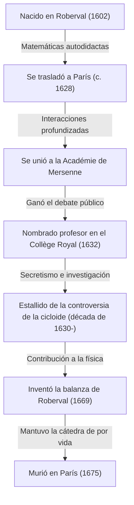
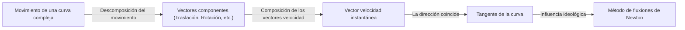
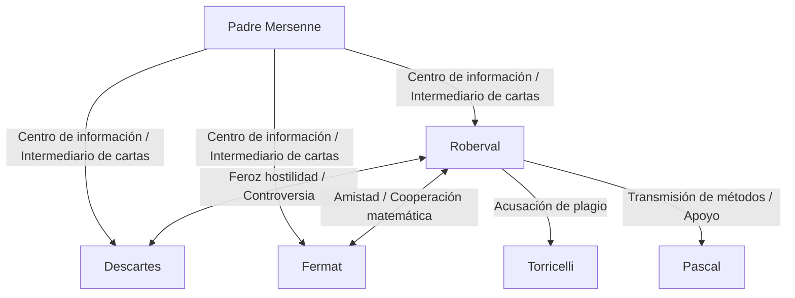

## 1. Introducción: Gigantes en vísperas del cálculo y las matemáticas del siglo XVII

La Europa del siglo XVII fue una época de espectacular explosión del conocimiento, más tarde conocida como la "Revolución Científica". Particularmente en el campo de las matemáticas, se estaban realizando rápidos preparativos para el nacimiento de unas nuevas matemáticas que iban más allá del marco de la geometría euclidiana heredada de la antigua Grecia para manejar cantidades cambiantes, lo infinitesimal y lo infinito: a saber, el "cálculo". El monumento histórico que supuso la culminación del cálculo por [Isaac Newton](https://kenji.blog/es/p/newton/) y Gottfried Wilhelm Leibniz no fue en absoluto un logro exclusivo del genio de ellos dos. Detrás de él estaban las luchas de muchos matemáticos que lidiaron con los conceptos del infinito y los límites antes que ellos.

Uno de los matemáticos más importantes de Francia en esta "víspera del cálculo" fue [Gilles Personne de Roberval](https://kenji.blog/es/p/roberval/) (1602-1675). Roberval introdujo en Francia el "método de los indivisibles" propuesto por el italiano Bonaventura Cavalieri, y al perfeccionarlo de forma independiente, creó métodos poderosos para calcular el área de figuras delimitadas por curvas y el volumen de sólidos de revolución. También demostró un talento excepcional en los campos de la física y la mecánica, dejando tras de sí un invento revolucionario conocido como la "balanza de [Roberval](https://kenji.blog/es/p/roberval/)", que aún hoy puede verse en mercados y laboratorios de ciencias.

En este artículo, profundizaremos en la vida de este matemático solitario que vivió una época turbulenta, sus feroces controversias con sus contemporáneos y los profundos logros matemáticos y mecánicos que dejó como legado, con abundantes ilustraciones y fórmulas matemáticas.

## 2. La vida de [Roberval](https://kenji.blog/es/p/roberval/) y el contexto histórico

### 2.1. Ascenso del campesinado y traslado a París

Gilles Personne nació el 10 de agosto de 1602 en un pequeño pueblo llamado [Roberval](https://kenji.blog/es/p/roberval/), cerca de Beauvais, en el norte de Francia. Se cree que su familia era campesina, lo que de ninguna manera era un origen ventajoso para la erudición en la estricta sociedad de clases de la época. Sin embargo, desde una edad temprana, mostró un intelecto extraordinario y un gran interés por las matemáticas. Más tarde, tomó el nombre de su pueblo natal y comenzó a llamarse a sí mismo "de [Roberval](https://kenji.blog/es/p/roberval/)". Esto puede verse como una expresión de su orgullo por sus orígenes, así como un intento de establecer su identidad como erudito.

Habiendo aprendido por sí mismo matemáticas y lenguas clásicas (latín y griego) a una edad temprana, [Roberval](https://kenji.blog/es/p/roberval/) aspiró a metas académicas más altas y se trasladó a la capital, París, alrededor de 1628. París en ese momento era un crisol de erudición que reunía a intelectuales de toda Europa. Allí, comenzó a frecuentar la reunión de intelectuales centrada en torno al padre Marin Mersenne, conocida como la "Académie de Mersenne". [Mersenne](https://kenji.blog/es/p/mersenne/), a menudo llamado "el administrador de correos de la erudición europea", actuaba como intermediario de correspondencia entre los eruditos de toda Europa, desempeñando un papel clave en el intercambio de los últimos descubrimientos científicos.

A través del salón de [Mersenne](https://kenji.blog/es/p/mersenne/), Roberval profundizó en sus interacciones con las mentes más brillantes de Francia de la época, como René Descartes, Pierre de Fermat, Blaise Pascal y Étienne [Pascal](https://kenji.blog/es/p/pascal/) (el padre de Blaise), lo que permitió que sus talentos matemáticos florecieran.

### 2.2. La cátedra del Collège Royal y las extenuantes batallas de defensa

En 1632, llegó un punto de inflexión importante para [Roberval](https://kenji.blog/es/p/roberval/). Quedó vacante un puesto de profesor de matemáticas (la cátedra de Ramus), creada por Pierre de la Ramée, un famoso lógico y matemático, en el Collège de France (entonces conocido como Collège Royal) en París.

El método de selección para este puesto de profesorado era muy inusual y agotador. Los candidatos participaban en debates matemáticos en público, y el ganador obtenía el puesto. Además, sorprendentemente, este puesto no era vitalicio; requería aceptar a retadores cada tres años para participar en debates públicos, y había que seguir ganando para defenderlo. La derrota significaba la pérdida inmediata del puesto de profesor y de su salario.

[Roberval](https://kenji.blog/es/p/roberval/) ganó de forma espléndida esta agotadora competición y ocupó el puesto de profesor. Sorprendentemente, defendió con éxito esta posición sin una sola derrota durante más de 40 años, hasta su fallecimiento a los 73 años en 1675.

Una de las razones por las que era reacio a publicar rápidamente sus descubrimientos matemáticos en forma de artículos o libros residía precisamente en estas "batallas de defensa cada tres años". Para derrotar a los retadores en público, era necesario mantener en secreto los últimos resultados matemáticos y los potentes métodos de resolución como si fueran "armas secretas". Este secretismo extremo provocó más tarde serias disputas de prioridad (debates sobre quién descubrió algo primero) con sus contemporáneos.

## 3. Logros matemáticos: Indivisibles y los albores de la integración

### 3.1. Introducción y perfeccionamiento del método de los indivisibles

El mayor logro matemático de [Roberval](https://kenji.blog/es/p/roberval/) fue ser el primero en introducir en Francia el **método de los indivisibles**, iniciado por el matemático italiano Bonaventura Cavalieri, y desarrollarlo y perfeccionarlo de manera independiente. Este método fue un precursor directo y revolucionario del cálculo integral moderno.

Los indivisibles de Cavalieri parten del concepto de que "una superficie es una colección de infinitos segmentos de línea paralelos (cantidades indivisibles) y un sólido es una colección de infinitos planos paralelos". En términos modernos, es la idea fundamental exacta de la integración definida: cortar una figura en rodajas infinitamente finas y sumarlas para encontrar el área o el volumen.

[Roberval](https://kenji.blog/es/p/roberval/) perfeccionó este concepto de forma más matemática. Al calcular el área de una determinada curva, la representaba como la suma de rectángulos infinitamente finos que constituían esa curva. Su método hizo que el "método de exhaución" utilizado por el antiguo griego Arquímedes fuera más intuitivo y fácil de calcular, convirtiéndose en una herramienta poderosa para resolver numerosos problemas difíciles de geometría.

### 3.2. Integración de potencias y descubrimiento paralelo con [Fermat](https://kenji.blog/es/p/fermat/)

Utilizando el método de los indivisibles, [Roberval](https://kenji.blog/es/p/roberval/) logró demostrar geométricamente el cálculo equivalente de la integral definida $ \int_{0}^{a} x^n dx $ para los casos en que $ n $ es un número entero positivo. Al tratar el área bajo una curva como la suma de una secuencia infinita y utilizar la fórmula para la suma de las potencias de los números naturales, llegó a la siguiente conclusión:

$$
\int_{0}^{a} x^n dx = \frac{a^{n+1}}{n+1} \quad \left( \text{donde } n \text{ es un número entero positivo} \right)
$$

Por ejemplo, cuando $ n = 2 $, el área bajo la parábola $ y = x^2 $ es $ \frac{a^3}{3} $. Este fue el mismo resultado que [Pierre de Fermat](https://kenji.blog/es/p/fermat/) había descubierto de forma independiente por la misma época. Roberval y [Fermat](https://kenji.blog/es/p/fermat/) respetaban mutuamente sus métodos y compartieron este descubrimiento por carta. Sus logros se convirtieron en un importante trampolín hacia la posterior formulación de la integración por parte de Leibniz.

## 4. Estudio de la cicloide y feroces disputas de prioridad

### 4.1. La geometría de Helena: El encanto de la cicloide

En la comunidad matemática del siglo XVII, había una curva que cautivó a los eruditos y se convirtió simultáneamente en el germen de una feroz controversia, llamada la "Geometría de Helena". Esa era la **cicloide**. Una cicloide es la trayectoria trazada por un punto en la circunferencia de un círculo mientras rueda sin deslizarse a lo largo de una línea recta.

Galileo Galilei se sintió atraído por la belleza de esta curva y la llamó "cicloide". Utilizando el parámetro $ t $ (ángulo de rotación) y el radio $ r $ del círculo generatriz, las coordenadas $ (x, y) $ de un punto de la cicloide se expresan de la siguiente manera:

$$
\begin{cases}
x = r(t - \sin t) \\
y = r(1 - \cos t)
\end{cases}
$$

A través de experimentos físicos de recortar una placa de metal con la forma de una cicloide y pesarla, Galileo conjeturó que "el área de un arco de cicloide es exactamente tres veces el área de su círculo generatriz". Sin embargo, no pudo demostrarlo matemáticamente.

### 4.2. La demostración rigurosa del área por [Roberval](https://kenji.blog/es/p/roberval/)

En 1634, aprovechando al máximo el método de los indivisibles, [Roberval](https://kenji.blog/es/p/roberval/) demostró matemáticamente y con rigor que la conjetura de Galileo era correcta. Comparó inteligentemente la curva de la cicloide con la curva creada cuando el círculo generatriz se traslada, utilizando un brillante método geométrico de dividir y reconstruir el área.

Usando el cálculo integral moderno, el área $ A $ delimitada por un arco de la cicloide ($ 0 \le t \le 2\pi $) y la base (eje x) se puede calcular fácilmente de la siguiente manera:

$$
\begin{aligned}
A &= \int_{0}^{2\pi r} y \, dx \\
  &= \int_{0}^{2\pi} r(1 - \cos t) \cdot r(1 - \cos t) \, dt \\
  &= r^2 \int_{0}^{2\pi} (1 - 2\cos t + \cos^2 t) \, dt \\
  &= r^2 \left[ t - 2\sin t + \frac{t}{2} + \frac{\sin 2t}{4} \right]_{0}^{2\pi} \\
  &= r^2 \left( 2\pi + \pi \right) = 3\pi r^2
\end{aligned}
$$

[Roberval](https://kenji.blog/es/p/roberval/) logró este gran descubrimiento, pero, fiel a su estilo, retrasó la publicación para defender su cátedra, comunicándolo solo por carta a unos pocos matemáticos cercanos (como [Mersenne](https://kenji.blog/es/p/mersenne/)).

### 4.3. Controversia con Torricelli

Varios años después, en 1644, el italiano Evangelista Torricelli (discípulo de Galileo, famoso por el "vacío de Torricelli") descubrió de forma independiente que el área de una cicloide es tres veces la de su círculo, y lo publicó en un libro.

Al enterarse de esto, [Roberval](https://kenji.blog/es/p/roberval/) se puso furioso. Acusó a Torricelli, afirmando: "Torricelli robó una mirada a mis resultados a través de las cartas de Mersenne y los publicó como si fueran su propio descubrimiento". Esta controversia sobre el plagio se volvió extremadamente feroz y la relación entre los dos se vio irreparablemente dañada. Hoy en día, se cree que el descubrimiento de Torricelli se realizó de forma independiente y no fue un plagio, pero este incidente se recuerda como una anécdota que ilustra el fuerte temperamento de [Roberval](https://kenji.blog/es/p/roberval/) y las limitaciones de la transmisión de información en la época.

## 5. Construcción cinemática de tangentes: Otro camino hacia las derivadas

[Roberval](https://kenji.blog/es/p/roberval/) ideó un enfoque revolucionario no solo en el campo de la integración, sino también en el campo de la derivación (el problema de trazar tangentes). Consistió en reexaminar los problemas geométricos como "cinemática" física.

En aquel momento, hallar la tangente a una curva era uno de los problemas más importantes de la geometría. [René Descartes](https://kenji.blog/es/p/descartes/) estaba tratando de hallar las tangentes usando un enfoque geométrico algebraico con ecuaciones algebraicas, pero tenía el inconveniente de unos cálculos extremadamente engorrosos.

En contraste, [Roberval](https://kenji.blog/es/p/roberval/) pensó de la siguiente manera: "Si una curva es una trayectoria trazada por un punto en movimiento, entonces la dirección en la que ese punto se mueve en cualquier instante dado (el vector velocidad) es precisamente la tangente a la curva".

Descompuso el movimiento de un punto que generaba una curva compleja en dos componentes simples de movimiento. Luego, al encontrar los vectores de velocidad en cada componente de movimiento y combinarlos geométricamente (suma de vectores), determinó la tangente como la dirección del vector de velocidad resultante.

Este "método de la tangente cinemática" demostró un tremendo poder para hallar tangentes de curvas trascendentales (curvas que no se pueden expresar mediante ecuaciones algebraicas) como la cicloide. El enfoque de [Roberval](https://kenji.blog/es/p/roberval/) de introducir este concepto físico del movimiento en las matemáticas fue un paso extremadamente importante que condujo directamente a la ideología fundamental del "Método de las fluxiones" (cálculo cinemático) fundado posteriormente por [Isaac Newton](https://kenji.blog/es/p/newton/).

## 6. Contribuciones a la mecánica: La balanza de [Roberval](https://kenji.blog/es/p/roberval/)

Si bien [Roberval](https://kenji.blog/es/p/roberval/) exploró lo infinito abstracto y el movimiento en matemáticas, también poseía un talento excepcional en la física del mundo real, la mecánica e incluso en el diseño ingenieril de máquinas. El ejemplo más destacado, ampliamente conocido hoy en día bajo su nombre, es la **"Balanza de [Roberval](https://kenji.blog/es/p/roberval/)"**.

### 6.1. Defectos de las balanzas convencionales

Las balanzas utilizadas desde la antigüedad tenían un mecanismo de "romana" en el que una barra se apoyaba en un punto de apoyo central con platillos colgando de ambos extremos. En este método, la distancia desde el fulcro a los platillos (brazo de momento) tenía que ser estrictamente constante para un pesaje preciso. Además, tenía un defecto fatal: si la posición donde se colocaban las pesas u objetos en el platillo se desviaba del centro, el momento cambiaba debido al principio de la palanca, haciendo imposible una medición precisa.

### 6.2. Adopción del mecanismo de enlace de paralelogramo

En 1669, [Roberval](https://kenji.blog/es/p/roberval/) presentó a la Real Academia de Ciencias de Francia un mecanismo revolucionario que resolvía por completo este problema. Adoptó un "mecanismo de enlace de paralelogramo" (una estructura similar a un pantógrafo) que conectaba dos barras paralelas superior e inferior con barras verticales izquierda y derecha usando pasadores.

Con esta estructura, los platillos izquierdo y derecho suben y bajan en una traslación paralela mientras mantienen constantemente la horizontalidad sin inclinarse. El hecho de que los platillos se muevan horizontalmente significa, a partir del Principio del Trabajo Virtual, que no importa dónde se coloque el peso en el platillo, la distancia que el peso se mueve hacia arriba y hacia abajo (cantidad de trabajo) no cambia.

Como resultado, se creó una balanza con características prácticas sumamente excelentes: "No importa dónde se coloque el peso en el platillo, el resultado del pesaje no cambia en absoluto". Este principio innovador sigue utilizándose hoy en día tal cual, como base de las básculas que se utilizan en las oficinas de correos para pesar cartas, las balanzas de platillo superior que se usan en los mercados para pesar ingredientes e incluso las balanzas que se encuentran en los laboratorios de ciencias de las escuelas. El hecho de que un mecanismo mecánico ideado hace más de 350 años se siga utilizando hoy en día sin cambiar su principio básico dice mucho del tremendo talento como ingeniero de [Roberval](https://kenji.blog/es/p/roberval/).

## 7. Interacciones con contemporáneos y una vida de controversias

Junto a su extraordinario talento, se dice que [Roberval](https://kenji.blog/es/p/roberval/) tenía un temperamento muy irascible y una personalidad obstinada que se negaba a ceder en sus teorías. Como consecuencia, se vio envuelto en feroces controversias con muchos eruditos famosos de su época.

- **Conflicto con [René Descartes](https://kenji.blog/es/p/descartes/)**:
  Mientras [Descartes](https://kenji.blog/es/p/descartes/) promovía la "geometría analítica", que resolvía la geometría usando el álgebra, Roberval valoraba los métodos puramente geométricos y cinemáticos. Roberval criticaba el método de Descartes por ser demasiado artificial y a menudo atacaba los defectos en las teorías de Descartes. Descartes, a su vez, menospreciaba a [Roberval](https://kenji.blog/es/p/roberval/) llamándolo "tosco y sin educación", y su relación se mantuvo hostil a lo largo de sus vidas.
- **Amistad con [Pierre de Fermat](https://kenji.blog/es/p/fermat/)**:
  En contraste con [Descartes](https://kenji.blog/es/p/descartes/), Roberval entabló una muy buena relación con Fermat, que vivía en Toulouse. Aunque tenían personalidades contrapuestas, compartían ideas matemáticas a través de cartas mediadas por [Mersenne](https://kenji.blog/es/p/mersenne/), complementando mutuamente sus investigaciones en temas como los indivisibles.
- **Influencia sobre [Blaise Pascal](https://kenji.blog/es/p/pascal/)**:
  El joven genio [Pascal](https://kenji.blog/es/p/pascal/) también recibió una gran influencia de Roberval. Pascal publicaría más tarde trabajos sobre la cicloide utilizando el seudónimo "A. Dettonville", y muchos de los métodos empleados en ellos eran versiones perfeccionadas de las ideas de Roberval sobre los indivisibles. Roberval valoraba enormemente el talento de [Pascal](https://kenji.blog/es/p/pascal/) y le apoyó.

## 8. Conclusión: El genio solitario que tendió el puente hacia el cálculo

[Gilles Personne de Roberval](https://kenji.blog/es/p/roberval/), en la época inmediatamente anterior al nacimiento formal del cálculo, utilizó a fondo dos potentes armas —el método de los indivisibles y el enfoque cinemático— para resolver secuencialmente los problemas matemáticos más difíciles de su tiempo.

Como resultado de retrasar excesivamente la publicación de sus descubrimientos debido a la presión de defender su cátedra cada tres años, algunos de sus logros no fueron valorados de manera justa por sus contemporáneos, y a veces se vio arrastrado a disputas de prioridad indeseadas. Sin embargo, las semillas de las ideas matemáticas que sembró se propagaron sin duda a través de la red de [Mersenne](https://kenji.blog/es/p/mersenne/) y conocidos como Fermat y [Pascal](https://kenji.blog/es/p/pascal/), convirtiéndose en un sólido puente que conduciría más tarde a la fundación del cálculo por parte de Newton y Leibniz.

Además, como se observa en su invención de la "balanza de [Roberval](https://kenji.blog/es/p/roberval/)" en mecánica, más que unas matemáticas abstractas, su pensamiento teórico siempre estuvo profundamente conectado con el mundo físico real. [Roberval](https://kenji.blog/es/p/roberval/), que estuvo activo en la frontera entre las matemáticas y la física, quedará verdaderamente grabado en la historia de las matemáticas para siempre como un "actor clave entre bastidores" que apoyó e impulsó fundamentalmente la Revolución Científica del siglo XVII.
