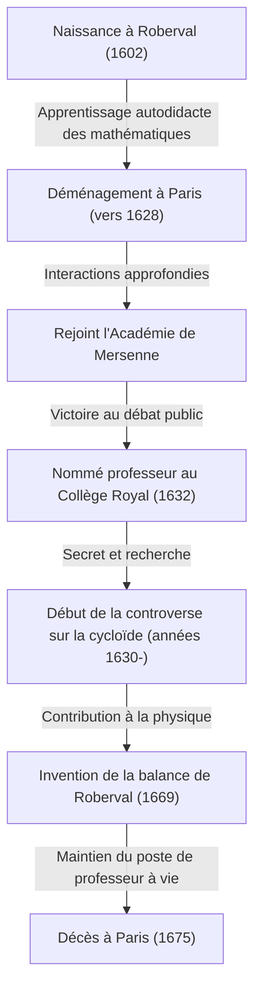
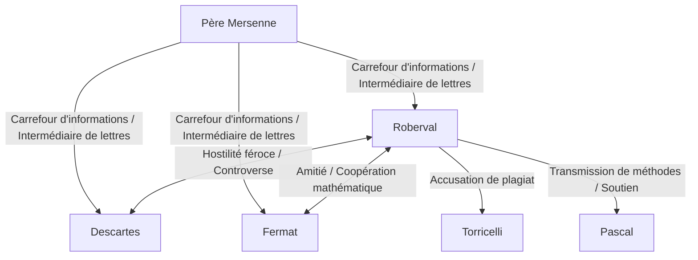

## 1. Introduction : Les géants à l'aube du calcul infinitésimal et les mathématiques du 17ème siècle

L'Europe du 17ème siècle fut une époque d'explosion dramatique des connaissances, plus tard connue sous le nom de "Révolution scientifique". Particulièrement dans le domaine des mathématiques, des préparations rapides étaient en cours pour la naissance d'une nouvelle mathématique, qui dépassait le cadre de la géométrie euclidienne héritée de la Grèce antique pour traiter des quantités changeantes, de l'infiniment petit et de l'infini : à savoir, le "calcul infinitésimal". Le monument historique que représente l'achèvement du calcul par [Isaac Newton](https://kenji.blog/fr/p/newton/) et Gottfried Wilhelm Leibniz ne fut en aucun cas accompli par le seul génie de ces deux hommes. Derrière eux se cachaient les luttes de nombreux mathématiciens qui avaient combattu avec les concepts d'infini et de limites avant eux.

L'un des mathématiciens les plus importants en France à cette "veille du calcul" fut [Gilles Personne de Roberval](https://kenji.blog/fr/p/roberval/) (1602-1675). Roberval introduisit en France la "méthode des indivisibles" proposée par l'Italien Bonaventura Cavalieri, et en l'affinant de manière indépendante, il créa des méthodes puissantes pour calculer l'aire des figures délimitées par des courbes et le volume des solides de révolution. Il fit également preuve d'un talent exceptionnel dans les domaines de la physique et de la mécanique, laissant derrière lui une invention révolutionnaire connue sous le nom de "balance de Roberval", que l'on peut encore voir aujourd'hui sur les marchés et dans les laboratoires de sciences.

Dans cet article, nous explorerons en profondeur la vie de ce mathématicien solitaire qui a vécu une époque mouvementée, ses féroces controverses avec ses contemporains, et les profondes réalisations mathématiques et mécaniques qu'il a laissées derrière lui, le tout accompagné de riches illustrations et de formules mathématiques.

## 2. La vie de Roberval et le contexte historique

### 2.1. De paysan à Paris

Gilles Personne est né le 10 août 1602 dans un petit village appelé Roberval, près de Beauvais, dans le nord de la France. On pense que sa famille était d'origine paysanne, ce qui n'était en aucun cas un milieu favorable à l'érudition dans la stricte société de classes de l'époque. Cependant, dès son plus jeune âge, il montra un intellect extraordinaire et un fort intérêt pour les mathématiques. Plus tard, il prit le nom de son village natal et commença à se faire appeler "de Roberval". Cela peut être considéré comme une expression de sa fierté quant à ses origines, ainsi qu'une tentative d'établir son identité en tant qu'érudit.

Ayant appris les mathématiques et les langues classiques (latin et grec) en autodidacte dans sa jeunesse, Roberval visa des sommets académiques plus élevés et s'installa dans la capitale, Paris, vers 1628. Paris, à cette époque, était un creuset de l'érudition, rassemblant des intellectuels de toute l'Europe. Là, il commença à fréquenter le rassemblement d'intellectuels centré autour du père [Marin Mersenne](https://kenji.blog/fr/p/mersenne/), connu sous le nom d'"Académie de Mersenne". Mersenne, souvent appelé "le maître de poste de l'érudition européenne", agissait comme intermédiaire pour la correspondance entre les érudits de toute l'Europe, jouant un rôle dans le partage des dernières découvertes scientifiques.

Grâce au salon de Mersenne, Roberval approfondit ses interactions avec les plus grands esprits de la France de l'époque, tels que [René Descartes](https://kenji.blog/fr/p/descartes/), [Pierre de Fermat](https://kenji.blog/fr/p/fermat/), [Blaise Pascal](https://kenji.blog/fr/p/pascal/) et Étienne Pascal (le père de Blaise), ce qui permit à ses talents mathématiques de s'épanouir.

### 2.2. La chaire au Collège Royal et les batailles de défense épuisantes

En 1632, un tournant majeur se produisit pour Roberval. Un poste de professeur de mathématiques (la chaire Ramus), créé par Pierre de la Ramée, célèbre logicien et mathématicien, devint vacant au Collège de France (alors connu sous le nom de Collège Royal) à Paris.

La méthode de sélection pour ce poste de professeur était très inhabituelle et exténuante. Les candidats participaient à des débats mathématiques en public, et le gagnant obtenait le poste. De plus, fait terrifiant, ce poste n'était pas à vie ; il fallait accepter des challengers tous les trois ans pour s'engager dans des débats publics, et il fallait continuer à gagner pour le défendre. La défaite signifiait la perte immédiate du poste de professeur et de son salaire.

Roberval remporta magnifiquement cette compétition épuisante et prit le siège de professeur. Étonnamment, il a défendu avec succès cette position sans une seule défaite pendant plus de 40 ans, jusqu'à sa mort à l'âge de 73 ans en 1675.

L'une des raisons pour lesquelles il hésitait à publier rapidement ses découvertes mathématiques sous forme d'articles ou de livres résidait précisément dans ces "batailles de défense tous les trois ans". Afin de vaincre les challengers en public, il était nécessaire de garder les derniers résultats mathématiques et les méthodes de résolution puissantes cachés comme des "armes secrètes". Ce secret extrême provoqua plus tard de graves querelles de priorité (débats sur qui a découvert quelque chose en premier) avec ses contemporains.

## 3. Réalisations mathématiques : Les indivisibles et l'aube de l'intégration

### 3.1. Introduction et raffinement de la méthode des indivisibles

La plus grande réalisation mathématique de Roberval fut d'être le premier à introduire en France la **méthode des indivisibles**, initiée par le mathématicien italien Bonaventura Cavalieri, et de la développer et de l'affiner indépendamment. Cette méthode était un précurseur direct et révolutionnaire du calcul intégral moderne.

Les indivisibles de Cavalieri sont le concept selon lequel "une surface est une collection d'une infinité de segments de droite parallèles (quantités indivisibles), et un solide est une collection d'une infinité de plans parallèles". En termes modernes, il s'agit de l'idée fondamentale exacte de l'intégration définie : découper une figure en tranches infiniment fines et les additionner pour trouver l'aire ou le volume.

Roberval a affiné ce concept de manière plus mathématique. Lors du calcul de l'aire d'une certaine courbe, il l'a représentée comme la somme de rectangles infiniment fins constituant cette courbe. Sa méthode a rendu la "méthode d'exhaustion" utilisée par le Grec de l'Antiquité Archimède plus intuitive et plus facile à calculer, devenant un outil puissant pour résoudre de nombreux problèmes de géométrie difficiles.

### 3.2. Intégration des puissances et découverte parallèle avec Fermat

En utilisant la méthode des indivisibles, Roberval a réussi à prouver géométriquement le calcul équivalent de l'intégrale définie $ \int_{0}^{a} x^n dx $ pour les cas où $ n $ est un entier positif. En traitant l'aire sous une courbe comme la somme d'une suite infinie et en utilisant la formule de la somme des puissances des nombres naturels, il a déduit la conclusion suivante :

$$
\int_{0}^{a} x^n dx = \frac{a^{n+1}}{n+1} \quad \left( \text{où } n \text{ est un entier positif} \right)
$$

Par exemple, lorsque $ n = 2 $, l'aire sous la parabole $ y = x^2 $ est $ \frac{a^3}{3} $. C'était le même résultat que [Pierre de Fermat](https://kenji.blog/fr/p/fermat/) avait découvert indépendamment à peu près à la même époque. Roberval et Fermat se respectaient mutuellement et partageaient cette découverte par le biais de lettres. Leurs réalisations sont devenues un tremplin important vers la formulation ultérieure de l'intégration par Leibniz.

## 4. Étude de la cycloïde et féroces querelles de priorité

### 4.1. La géométrie d'Hélène : Le charme de la cycloïde

Dans la communauté mathématique du 17ème siècle, il y avait une courbe qui captivait les érudits et devenait simultanément le germe d'une féroce controverse, appelée "Géométrie d'Hélène". C'était la **cycloïde**. Une cycloïde est la trajectoire tracée par un point sur la circonférence d'un cercle lorsqu'il roule sans glisser le long d'une ligne droite.

Galilée fut attiré par la beauté de cette courbe et la nomma "cycloïde". En utilisant le paramètre $ t $ (angle de rotation) et le rayon $ r $ du cercle générateur, les coordonnées $ (x, y) $ d'un point sur la cycloïde s'expriment comme suit :

$$
\begin{cases}
x = r(t - \sin t) \\
y = r(1 - \cos t)
\end{cases}
$$

Grâce à des expériences physiques consistant à découper une plaque de métal en forme de cycloïde et à la peser, Galilée a conjecturé que "l'aire d'une arche de cycloïde est exactement trois fois l'aire de son cercle générateur". Cependant, il ne put le prouver mathématiquement.

### 4.2. La preuve rigoureuse de l'aire par Roberval

En 1634, utilisant pleinement la méthode des indivisibles, Roberval a prouvé mathématiquement et rigoureusement que la conjecture de Galilée était correcte. Il a habilement comparé la courbe de la cycloïde avec la courbe créée lorsque le cercle générateur est translaté, en utilisant une brillante méthode géométrique de division et de reconstruction de l'aire.

En utilisant le calcul intégral moderne, l'aire $ A $ délimitée par une arche de la cycloïde ($ 0 \le t \le 2\pi $) et la base (axe des abscisses) peut être facilement calculée comme suit :

$$
\begin{aligned}
A &= \int_{0}^{2\pi r} y \, dx \\
  &= \int_{0}^{2\pi} r(1 - \cos t) \cdot r(1 - \cos t) \, dt \\
  &= r^2 \int_{0}^{2\pi} (1 - 2\cos t + \cos^2 t) \, dt \\
  &= r^2 \left[ t - 2\sin t + \frac{t}{2} + \frac{\sin 2t}{4} \right]_{0}^{2\pi} \\
  &= r^2 \left( 2\pi + \pi \right) = 3\pi r^2
\end{aligned}
$$

Roberval a réalisé cette grande découverte, mais, fidèle à lui-même, a retardé sa publication pour défendre son poste de professeur, ne la communiquant que par lettres à quelques mathématiciens proches (comme Mersenne).

### 4.3. Controverse avec Torricelli

Plusieurs années plus tard, en 1644, l'Italien Evangelista Torricelli (un élève de Galilée, célèbre pour le "vide de Torricelli") a découvert indépendamment que l'aire d'une cycloïde est trois fois celle de son cercle, et l'a publiée dans un livre.

En apprenant cela, Roberval fut furieux. Il a accusé Torricelli, affirmant : "Torricelli a jeté un œil à mes résultats par le biais de lettres de Mersenne et les a publiés comme sa propre découverte." Cette controverse sur le plagiat est devenue extrêmement féroce, et la relation entre les deux hommes a été irrémédiablement endommagée. Aujourd'hui, on pense que la découverte de Torricelli a été faite de manière indépendante et n'était pas un plagiat, mais cet incident reste dans les mémoires comme une anecdote illustrant le tempérament de feu de Roberval et les limites de la transmission de l'information à l'époque.

## 5. Construction cinématique des tangentes : Une autre voie vers les dérivées

Roberval a conçu une approche révolutionnaire non seulement dans le domaine de l'intégration, mais aussi dans le domaine de la différenciation (le problème du tracé des tangentes). Il s'agissait de réexaminer les problèmes géométriques en tant que "cinématique" physique.

À l'époque, trouver la tangente d'une courbe était l'une des questions les plus importantes en géométrie. [René Descartes](https://kenji.blog/fr/p/descartes/) essayait de trouver des tangentes en utilisant une approche géométrique algébrique avec des équations algébriques, mais elle présentait l'inconvénient de calculs extrêmement lourds.

En revanche, Roberval pensait ainsi : "Si une courbe est une trajectoire tracée par un point en mouvement, alors la direction dans laquelle ce point se déplace à un instant donné (le vecteur vitesse) est précisément la tangente à la courbe."

Il a décomposé le mouvement d'un point générant une courbe complexe en deux composantes de mouvement simples. Ensuite, en trouvant les vecteurs vitesse dans chaque composante de mouvement et en les combinant géométriquement (somme vectorielle), il a déterminé la tangente comme étant la direction du vecteur vitesse résultant.

Cette "méthode des tangentes cinématiques" a démontré une puissance extraordinaire pour trouver des tangentes à des courbes transcendantes (des courbes qui ne peuvent pas être exprimées par des équations algébriques) comme la cycloïde. L'approche de Roberval, qui consistait à introduire ce concept physique de mouvement dans les mathématiques, a été une étape extrêmement importante qui a conduit directement à l'idéologie fondamentale de la "Méthode des fluxions" (calcul cinématique) fondée plus tard par [Isaac Newton](https://kenji.blog/fr/p/newton/).

## 6. Contributions à la mécanique : La balance de Roberval

Alors que Roberval explorait l'infini abstrait et le mouvement dans les mathématiques, il possédait également un talent exceptionnel dans le domaine de la physique du monde réel, de la mécanique, et même dans la conception technique de machines. L'exemple le plus marquant, largement connu aujourd'hui sous son nom, est la **"Balance de Roberval"**.

### 6.1. Défauts des balances conventionnelles

Les balances utilisées depuis l'Antiquité possédaient un mécanisme de "romaine" où un fléau était soutenu au niveau d'un point d'appui central, avec des plateaux suspendus aux deux extrémités. Dans cette méthode, la distance entre le point d'appui et les plateaux (bras de levier) devait être strictement constante pour une pesée précise. De plus, elle présentait un défaut fatal : si la position où les poids ou les objets étaient placés sur le plateau s'écartait du centre, le moment changeait en raison du principe de levier, rendant une mesure précise impossible.

### 6.2. Adoption du mécanisme à parallélogramme déformable

En 1669, Roberval a présenté un mécanisme révolutionnaire à l'Académie royale des sciences de France qui résolvait complètement ce problème. Il a adopté un "mécanisme de liaison en parallélogramme" (une structure similaire à un pantographe) qui reliait deux barres parallèles supérieure et inférieure avec des barres verticales gauche et droite à l'aide d'axes.

Avec cette structure, les plateaux gauche et droit montent et descendent en translation parallèle tout en maintenant constamment l'horizontalité sans basculer. Le fait que les plateaux se déplacent horizontalement signifie, d'après le principe des travaux virtuels, que peu importe où le poids est placé sur le plateau, la distance que le poids parcourt de haut en bas (quantité de travail) ne change pas.

En conséquence, une balance a été réalisée avec des caractéristiques pratiques extrêmement excellentes : "Peu importe où le poids est placé sur le plateau, le résultat de la pesée ne change pas du tout." Ce principe innovant continue d'être utilisé tel quel aujourd'hui, comme base pour les balances utilisées dans les bureaux de poste pour peser les lettres, les balances à plateaux utilisées sur les marchés pour peser les ingrédients, et même les balances que l'on trouve dans les laboratoires de sciences des écoles. Le fait qu'un mécanisme mécanique conçu il y a plus de 350 ans soit toujours utilisé aujourd'hui sans changer son principe de base en dit long sur l'incroyable sens de l'ingénierie de Roberval.

## 7. Interactions avec les contemporains et une vie de controverses

Parallèlement à son talent exceptionnel, on dit que Roberval avait un tempérament très sanguin et une personnalité têtue qui refusait de céder sur ses théories. Par conséquent, il s'est engagé dans de féroces controverses avec de nombreux érudits célèbres de son temps.

- **Conflit avec [René Descartes](https://kenji.blog/fr/p/descartes/)** :
  Alors que Descartes promouvait la "géométrie analytique", qui résolvait la géométrie à l'aide de l'algèbre, Roberval valorisait les méthodes purement géométriques et cinématiques. Roberval critiquait la méthode de Descartes comme étant trop artificielle et attaquait souvent les failles des théories de Descartes. Descartes, à son tour, méprisait Roberval en le qualifiant de "grossier et sans éducation", et leur relation resta hostile tout au long de leur vie.
- **Amitié avec [Pierre de Fermat](https://kenji.blog/fr/p/fermat/)** :
  Contrairement à Descartes, Roberval a noué d'excellentes relations avec Fermat, qui vivait à Toulouse. Bien qu'ils eussent des personnalités contrastées, ils ont partagé des idées mathématiques par le biais de lettres médiées par Mersenne, complétant leurs recherches mutuelles sur des questions telles que les indivisibles.
- **Influence sur [Blaise Pascal](https://kenji.blog/fr/p/pascal/)** :
  Le jeune génie Pascal a également été grandement influencé par Roberval. Pascal publia plus tard des articles sur la cycloïde sous le pseudonyme d'"A. Dettonville", et nombre des méthodes utilisées étaient des versions affinées des idées de Roberval sur les indivisibles. Roberval appréciait grandement le talent de Pascal et le soutenait.

## 8. Conclusion : Le génie solitaire qui a jeté un pont vers le calcul infinitésimal

[Gilles Personne de Roberval](https://kenji.blog/fr/p/roberval/), à l'époque juste avant la naissance formelle du calcul infinitésimal, a pleinement utilisé deux armes puissantes — la méthode des indivisibles et l'approche cinématique — pour résoudre séquentiellement les problèmes mathématiques les plus difficiles de son temps.

En raison de son retard excessif à publier ses découvertes en raison de la pression de devoir défendre son poste de professeur tous les trois ans, certaines de ses réalisations n'ont pas été évaluées à leur juste valeur par ses contemporains, et il a parfois été entraîné dans des querelles de priorité malheureuses. Cependant, les graines d'idées mathématiques qu'il a semées se sont sûrement propagées grâce au réseau de Mersenne et à des connaissances comme Fermat et Pascal, devenant un pont solide menant plus tard à la fondation du calcul par Newton et Leibniz.

De plus, comme le montre son invention de la "balance de Roberval" en mécanique, plutôt que de se limiter aux mathématiques abstraites, sa pensée théorique était toujours profondément connectée au monde physique réel. Roberval, qui était actif à la frontière entre les mathématiques et la physique, est véritablement gravé dans l'histoire des mathématiques pour toujours en tant qu'"acteur clé de l'ombre" qui a fondamentalement soutenu et conduit la Révolution scientifique du 17ème siècle.
