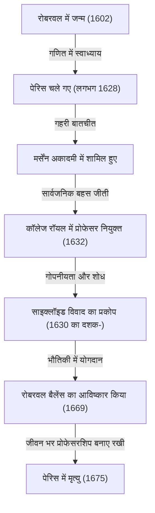
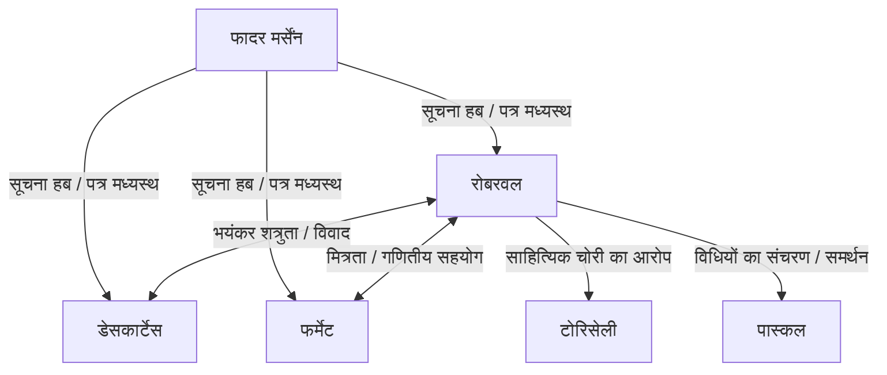

## 1. परिचय: कलन की पूर्व संध्या पर दिग्गज और 17वीं सदी का गणित

17वीं शताब्दी में यूरोप ज्ञान के नाटकीय विस्फोट का काल था, जिसे बाद में "वैज्ञानिक क्रांति" के रूप में जाना गया। विशेष रूप से गणित के क्षेत्र में, एक नए गणित के जन्म की तीव्र तैयारी चल रही थी, जो प्राचीन यूनान से विरासत में मिली [यूक्लिड](https://kenji.blog/hi/p/euclid/)ियन ज्यामिति के ढांचे से परे जाकर परिवर्तनशील मात्राओं, अत्यंत सूक्ष्म और अनंत को संभाल सके—अर्थात, "कलन (Calculus)"। [आइजैक न्यूटन](https://kenji.blog/hi/p/newton/) और गॉटफ्रीड विल्हेम लाइबनिज द्वारा कलन को पूरा करने का ऐतिहासिक कीर्तिमान किसी भी तरह से केवल उन दोनों की प्रतिभा से हासिल नहीं हुआ था। इसके पीछे कई गणितज्ञों के संघर्ष छिपे थे, जिन्होंने उनसे पहले अनंत और सीमा के अवधारणाओं से जूझते हुए काम किया था।

इस "कलन की पूर्व संध्या" पर फ्रांस में सबसे महत्वपूर्ण गणितज्ञों में से एक [गिल्स पर्सोन डी रोबरवल](https://kenji.blog/hi/p/roberval/) ([Gilles Personne de Roberval](https://kenji.blog/hi/p/roberval/), 1602–1675) थे। रोबरवल ने इतालवी बोनावेंचुरा कैवलियरी द्वारा प्रस्तावित "अविभाज्य की विधि (Method of Indivisibles)" को फ्रांस में पेश किया, और स्वतंत्र रूप से इसे परिष्कृत करके वक्रों द्वारा परिबद्ध आकृतियों के क्षेत्रफल और घूर्णन पिंडों के आयतन की गणना करने के शक्तिशाली तरीके बनाए। उन्होंने भौतिकी और यांत्रिकी के क्षेत्र में भी उत्कृष्ट प्रतिभा का प्रदर्शन किया, और अपने पीछे एक अभूतपूर्व आविष्कार छोड़ा जिसे "रोबरवल बैलेंस" के रूप में जाना जाता है, जिसे आज भी बाजारों और विज्ञान प्रयोगशालाओं में देखा जा सकता है।

इस लेख में, हम एक अशांत युग में जीने वाले इस एकांतप्रिय गणितज्ञ के जीवन, उनके समकालीनों के साथ उनके भयंकर विवादों, और उनके द्वारा छोड़े गए गहरे गणितीय और यांत्रिक उपलब्धियों पर समृद्ध चित्रों और गणितीय सूत्रों के साथ गहराई से विचार करेंगे।

## 2. रोबरवल का जीवन और ऐतिहासिक पृष्ठभूमि

### 2.1. किसान परिवार से उठना और पेरिस जाना

गिल्स पर्सोन का जन्म 10 अगस्त 1602 को उत्तरी फ्रांस में ब्यूवैस के पास रोबरवल (Roberval) नामक एक छोटे से गाँव में हुआ था। माना जाता है कि उनका परिवार किसान था, जो उस समय के कठोर वर्ग समाज में छात्रवृत्ति के लिए किसी भी तरह से एक लाभप्रद पृष्ठभूमि नहीं थी। हालाँकि, कम उम्र से ही, उन्होंने असाधारण बुद्धि और गणित में गहरी रुचि दिखाई। बाद में, उन्होंने अपने मूल गाँव का नाम अपना लिया और खुद को "डी रोबरवल" कहने लगे। इसे उनके मूल पर उनके गर्व की अभिव्यक्ति के साथ-साथ एक विद्वान के रूप में अपनी पहचान स्थापित करने के प्रयास के रूप में भी देखा जा सकता है।

कम उम्र में स्वाध्याय के माध्यम से गणित और शास्त्रीय भाषाओं (लैटिन और ग्रीक) को सीखने के बाद, रोबरवल ने उच्च शैक्षणिक ऊंचाइयों का लक्ष्य रखा और 1628 के आसपास राजधानी पेरिस चले गए। उस समय पेरिस विद्वता का एक मिश्रण था, जहाँ पूरे यूरोप से बुद्धिजीवी इकट्ठा होते थे। वहाँ, उन्होंने फादर मारिन मर्सेंन के इर्द-गिर्द केंद्रित बुद्धिजीवियों की सभा में भाग लेना शुरू किया, जिसे "मर्सेंन अकादमी" के रूप में जाना जाता था। मर्सेंन, जिन्हें अक्सर "यूरोपीय विद्वता का पोस्टमास्टर" कहा जाता था, पूरे यूरोप में विद्वानों के बीच पत्राचार के लिए मध्यस्थ के रूप में कार्य करते थे, और नवीनतम वैज्ञानिक खोजों को साझा करने में भूमिका निभाते थे।

मर्सेंन के सैलून के माध्यम से, रोबरवल ने उस समय फ्रांस के प्रमुख दिमागों, जैसे [रेने डेसकार्टेस](https://kenji.blog/hi/p/descartes/), पियरे डी फर्मेट, [ब्लेज़ पास्कल](https://kenji.blog/hi/p/pascal/), और एटिने पास्कल (ब्लेज़ के पिता) के साथ अपनी बातचीत को गहरा किया, जिससे उनकी गणितीय प्रतिभा को खिलने का मौका मिला।

### 2.2. कॉलेज रॉयल की प्रोफेसरशिप और भीषण रक्षात्मक लड़ाई

1632 में, रोबरवल के लिए एक बड़ा मोड़ आया। पेरिस के कॉलेज डी फ्रांस (जिसे तब कॉलेज रॉयल के नाम से जाना जाता था) में गणित के प्रोफेसर के पद (रेमस चेयर) के लिए एक रिक्ति खुली, जिसे प्रसिद्ध तर्कशास्त्री और गणितज्ञ पियरे डी ला रामी ने स्थापित किया था।

इस प्रोफेसनल पद के लिए चयन विधि अत्यधिक असामान्य और थकाऊ थी। उम्मीदवार सार्वजनिक रूप से गणितीय बहस में शामिल होते थे, और विजेता को वह स्थान मिलता था। इसके अलावा, भयानक रूप से, यह पद जीवन भर के लिए नहीं था; इसमें हर तीन साल में सार्वजनिक बहस में शामिल होने के लिए चुनौती देने वालों को स्वीकार करना पड़ता था, और इसे बनाए रखने के लिए जीतना जारी रखना पड़ता था। हार का मतलब था कि तुरंत प्रोफेसर का पद और उसका वेतन खो देना।

रोबरवल ने इस भीषण प्रतियोगिता को शानदार ढंग से जीता और प्रोफेसर की कुर्सी सँभाली। आश्चर्यजनक रूप से, उन्होंने 1675 में 73 वर्ष की आयु में निधन होने तक, 40 से अधिक वर्षों तक बिना किसी हार के इस पद का सफलतापूर्वक बचाव किया।

उनके द्वारा अपनी गणितीय खोजों को जल्दी से शोध पत्रों या पुस्तकों के रूप में प्रकाशित करने में संकोच करने का एक कारण "हर तीन साल में होने वाली रक्षात्मक लड़ाइयाँ" थीं। सार्वजनिक रूप से चुनौती देने वालों को हराने के लिए, नवीनतम गणितीय परिणामों और शक्तिशाली समाधान विधियों को "गुप्त हथियारों" के रूप में छिपाए रखना आवश्यक था। इस अत्यधिक गोपनीयता के कारण बाद में उनके समकालीनों के साथ गंभीर प्राथमिकता विवाद (यह बहस कि पहले किसी चीज़ की खोज किसने की) पैदा हुए।

## 3. गणितीय उपलब्धियां: अविभाज्य और एकीकरण की भोर

### 3.1. अविभाज्य की विधि का परिचय और परिष्कार

रोबरवल की सबसे बड़ी गणितीय उपलब्धि इतालवी गणितज्ञ बोनावेंचुरा कैवलियरी द्वारा शुरू की गई **अविभाज्य की विधि** को फ्रांस में पेश करने वाले पहले व्यक्ति होना और इसे स्वतंत्र रूप से विकसित और परिष्कृत करना था। यह विधि आधुनिक समाकलन (integral calculus) का एक सीधा, अभूतपूर्व अग्रदूत थी।

कैवलियरी के अविभाज्य की अवधारणा यह है कि "एक सतह अनंत समानांतर रेखाखंडों (अविभाज्य मात्राओं) का संग्रह है, और एक ठोस अनंत समानांतर समतलों का संग्रह है"। आधुनिक शब्दों में, यह निश्चित समाकलन (definite integration) का सटीक मूल विचार है: किसी आकृति को असीम रूप से पतले स्लाइस में काटना और क्षेत्रफल या आयतन खोजने के लिए उन्हें जोड़ना।

रोबरवल ने इस अवधारणा को अधिक गणितीय रूप से परिष्कृत किया। किसी निश्चित वक्र के क्षेत्रफल की गणना करते समय, उन्होंने इसे उस वक्र को बनाने वाले असीम रूप से पतले आयतों के योग के रूप में दर्शाया। उनकी विधि ने प्राचीन यूनानी आर्किमिडीज द्वारा उपयोग की जाने वाली "थकावट की विधि" को अधिक सहज और गणना करने में आसान बना दिया, जिससे यह कई कठिन ज्यामिति समस्याओं को हल करने का एक शक्तिशाली उपकरण बन गया।

### 3.2. घातों का समाकलन और फर्मेट के साथ समानांतर खोज

अविभाज्य की विधि का उपयोग करते हुए, रोबरवल निश्चित समाकलन $ \int_{0}^{a} x^n dx $ की समतुल्य गणना को ज्यामितीय रूप से साबित करने में सफल रहे, जहाँ $ n $ एक धनात्मक पूर्णांक है। एक वक्र के नीचे के क्षेत्रफल को एक अनंत अनुक्रम के योग के रूप में मानकर और प्राकृतिक संख्याओं के घातों के योग के सूत्र का उपयोग करके, उन्होंने निम्नलिखित निष्कर्ष निकाला:

$$
\int_{0}^{a} x^n dx = \frac{a^{n+1}}{n+1} \quad \left( \text{जहाँ } n \text{ एक धनात्मक पूर्णांक है} \right)
$$

उदाहरण के लिए, जब $ n = 2 $ होता है, तो परवलय $ y = x^2 $ के नीचे का क्षेत्रफल $ \frac{a^3}{3} $ होता है। यह वही परिणाम था जिसे पियरे डी फर्मेट ने लगभग उसी समय स्वतंत्र रूप से खोजा था। रोबरवल और फर्मेट एक-दूसरे के तरीकों का परस्पर सम्मान करते थे और पत्रों के माध्यम से इस खोज को साझा करते थे। उनकी उपलब्धियाँ बाद में लाइबनिज द्वारा समाकलन के निर्माण की दिशा में एक महत्वपूर्ण कदम बन गईं।

## 4. साइक्लॉइड का अध्ययन और भयंकर प्राथमिकता विवाद

### 4.1. हेलेन की ज्यामिति: साइक्लॉइड का आकर्षण

17वीं सदी के गणितीय समुदाय में, एक ऐसा वक्र था जिसने विद्वानों को मोहित किया और साथ ही "हेलेन की ज्यामिति" कहे जाने वाले भयंकर विवाद का बीज बन गया। वह **साइक्लॉइड (Cycloid)** था। साइक्लॉइड वह प्रक्षेपवक्र है जो एक वृत्त की परिधि पर एक बिंदु द्वारा तब खोजा जाता है जब वह एक सीधी रेखा के साथ फिसले बिना लुढ़कता है।

गैलीलियो गैलीली इस वक्र की सुंदरता से आकर्षित हुए और उन्होंने इसे "साइक्लॉइड" नाम दिया। पैरामीटर $ t $ (रोटेशन कोण) और जनरेटिंग वृत्त के त्रिज्या $ r $ का उपयोग करते हुए, साइक्लॉइड पर एक बिंदु के निर्देशांक $ (x, y) $ निम्नानुसार व्यक्त किए जाते हैं:

$$
\begin{cases}
x = r(t - \sin t) \\
y = r(1 - \cos t)
\end{cases}
$$

साइक्लॉइड के आकार में एक धातु की प्लेट को काटने और उसका वजन करने के भौतिक प्रयोगों के माध्यम से, गैलीलियो ने अनुमान लगाया कि "एक साइक्लॉइड आर्क का क्षेत्रफल उसके जनरेटिंग वृत्त के क्षेत्रफल का ठीक तीन गुना है"। हालाँकि, वह इसे गणितीय रूप से साबित नहीं कर सके।

### 4.2. रोबरवल का क्षेत्रफल का कठोर प्रमाण

1634 में, अविभाज्य की विधि का पूरा उपयोग करते हुए, रोबरवल ने गणितीय और कठोरता से साबित कर दिया कि गैलीलियो का अनुमान सही था। उन्होंने चतुराई से साइक्लॉइड के वक्र की तुलना उस वक्र से की जो जनरेटिंग वृत्त के अनुवादित होने पर बनता है, और क्षेत्रफल को विभाजित और फिर से बनाने की एक शानदार ज्यामितीय विधि का उपयोग किया।

आधुनिक समाकलन का उपयोग करते हुए, साइक्लॉइड ($ 0 \le t \le 2\pi $) के एक आर्क और आधार (x-अक्ष) से घिरे क्षेत्रफल $ A $ की गणना आसानी से निम्नानुसार की जा सकती है:

$$
\begin{aligned}
A &= \int_{0}^{2\pi r} y \, dx \\
  &= \int_{0}^{2\pi} r(1 - \cos t) \cdot r(1 - \cos t) \, dt \\
  &= r^2 \int_{0}^{2\pi} (1 - 2\cos t + \cos^2 t) \, dt \\
  &= r^2 \left[ t - 2\sin t + \frac{t}{2} + \frac{\sin 2t}{4} \right]_{0}^{2\pi} \\
  &= r^2 \left( 2\pi + \pi \right) = 3\pi r^2
\end{aligned}
$$

रोबरवल ने यह महान खोज की, लेकिन, हमेशा की तरह, अपनी प्रोफेसरशिप की रक्षा करने के लिए प्रकाशन में देरी की, और इसे केवल कुछ करीबी गणितज्ञों (जैसे मर्सेंन) को पत्रों के माध्यम से संप्रेषित किया।

### 4.3. टोरिसेली के साथ विवाद

कई वर्षों बाद, 1644 में, इतालवी इवेंजेलिस्टा टोरिसेली (गैलीलियो के एक शिष्य, "टोरिसेली के वैक्यूम" के लिए प्रसिद्ध) ने स्वतंत्र रूप से खोजा कि साइक्लॉइड का क्षेत्रफल उसके वृत्त से तीन गुना है, और इसे एक पुस्तक में प्रकाशित किया।

यह जानकर, रोबरवल क्रोधित हो गए। उन्होंने टोरिसेली पर आरोप लगाते हुए दावा किया, "टोरिसेली ने मर्सेंन के पत्रों के माध्यम से मेरे परिणामों पर एक नज़र डाली और उन्हें अपनी खोज के रूप में प्रकाशित किया।" साहित्यिक चोरी पर यह विवाद अत्यंत भयंकर हो गया, और दोनों के बीच संबंध अपूरणीय रूप से क्षतिग्रस्त हो गए। आज, ऐसा माना जाता है कि टोरिसेली की खोज स्वतंत्र रूप से की गई थी और साहित्यिक चोरी नहीं थी, लेकिन इस घटना को एक ऐसे किस्से के रूप में याद किया जाता है जो रोबरवल के उग्र स्वभाव और उस समय सूचना संचरण की सीमाओं को दर्शाता है।

## 5. स्पर्श रेखाओं का काइनेमेटिक निर्माण: डेरिवेटिव का एक और मार्ग

रोबरवल ने न केवल समाकलन के क्षेत्र में बल्कि अवकलन (स्पर्श रेखाएँ खींचने की समस्या) के क्षेत्र में भी एक अभूतपूर्व दृष्टिकोण तैयार किया। ज्यामितीय समस्याओं को भौतिक "काइनेमैटिक्स" के रूप में फिर से जांचना था।

उस समय, एक वक्र की स्पर्श रेखा खोजना ज्यामिति में सबसे महत्वपूर्ण मुद्दों में से एक था। [रेने डेसकार्टेस](https://kenji.blog/hi/p/descartes/) बीजगणितीय समीकरणों के साथ बीजगणितीय ज्यामितीय दृष्टिकोण का उपयोग करके स्पर्श रेखाओं को खोजने का प्रयास कर रहे थे, लेकिन इसमें बेहद बोझिल गणनाओं की कमी थी।

इसके विपरीत, रोबरवल ने इस तरह से सोचा: "यदि एक वक्र एक चलते हुए बिंदु द्वारा खोजा गया प्रक्षेपवक्र है, तो वह दिशा जिसमें वह बिंदु किसी भी क्षण चलता है (वेग वेक्टर) ठीक वक्र की स्पर्श रेखा है।"

उन्होंने एक जटिल वक्र उत्पन्न करने वाले बिंदु की गति को दो सरल गति घटकों में तोड़ दिया। फिर, प्रत्येक गति घटक में वेग वैक्टर ढूंढकर और उन्हें ज्यामितीय रूप से संयोजित करके (वेक्टर योग), उन्होंने परिणामी वेग वेक्टर की दिशा के रूप में स्पर्श रेखा का निर्धारण किया।

इस "काइनेमेटिक स्पर्श रेखा विधि" ने साइक्लॉइड जैसे अनुवांशिक वक्रों (वे वक्र जिन्हें बीजगणितीय समीकरणों द्वारा व्यक्त नहीं किया जा सकता है) के लिए स्पर्श रेखाएं खोजने में जबरदस्त शक्ति का प्रदर्शन किया। रोबरवल का गति की इस भौतिक अवधारणा को गणित में लाने का दृष्टिकोण एक अत्यंत महत्वपूर्ण कदम था जो सीधे बाद में [आइजैक न्यूटन](https://kenji.blog/hi/p/newton/) द्वारा स्थापित "फ्लक्सियन्स की विधि" (काइनेमेटिक कलन) की मूलभूत विचारधारा का कारण बना।

## 6. यांत्रिकी में योगदान: रोबरवल बैलेंस

जबकि रोबरवल ने गणित में अमूर्त अनंत और गति का पता लगाया, उन्होंने वास्तविक दुनिया की भौतिकी, यांत्रिकी, और यहाँ तक कि मशीनों के इंजीनियरिंग डिजाइन में भी उत्कृष्ट प्रतिभा प्राप्त की। सबसे प्रमुख उदाहरण, जिसे आज व्यापक रूप से उनके नाम से जाना जाता है, वह **"रोबरवल बैलेंस"** है।

### 6.1. पारंपरिक तौल पैमानों की खामियां

प्राचीन काल से उपयोग किए जाने वाले तौल पैमानों में "स्टीलयार्ड" तंत्र था जहाँ एक बीम को दोनों सिरों पर लटकने वाले पैन के साथ एक केंद्रीय फुलक्रम पर समर्थित किया गया था। इस पद्धति में, सटीक वजन के लिए फुलक्रम से पैन (मोमेंट आर्म) की दूरी सख्त रूप से स्थिर होनी चाहिए थी। इसके अलावा, इसमें एक घातक दोष था: यदि पैन पर वजन या वस्तुएं रखे जाने की स्थिति केंद्र से विचलित हो जाती है, तो लीवर के सिद्धांत के कारण क्षण बदल जाएगा, जिससे सटीक माप असंभव हो जाएगा।

### 6.2. समांतर चतुर्भुज लिंकेज तंत्र को अपनाना

1669 में, रोबरवल ने फ्रांसीसी रॉयल एकेडमी ऑफ साइंसेज के सामने एक अभूतपूर्व तंत्र प्रस्तुत किया जिसने इस समस्या को पूरी तरह से हल कर दिया। उन्होंने एक "समांतर चतुर्भुज लिंकेज तंत्र" (पेंटोग्राफ के समान एक संरचना) को अपनाया, जो पिन का उपयोग करके दो ऊपरी और निचले समानांतर पट्टियों को बाएं और दाएं ऊर्ध्वाधर पट्टियों के साथ जोड़ता था।

इस संरचना के साथ, बाएं और दाएं पैन बिना झुके लगातार क्षैतिजता बनाए रखते हुए समानांतर अनुवाद में ऊपर और नीचे चलते हैं। पैन क्षैतिज रूप से चलते हैं, इसका मतलब है कि, वर्चुअल वर्क के सिद्धांत से, पैन पर वजन कहाँ रखा गया है, यह मायने नहीं रखता, वजन जितना ऊपर और नीचे जाता है (काम की मात्रा) वह नहीं बदलता है।

नतीजतन, अत्यंत उत्कृष्ट व्यावहारिक विशेषताओं वाला एक संतुलन प्राप्त हुआ: "पैन पर वजन कहाँ रखा गया है, यह मायने नहीं रखता, वजन का परिणाम बिल्कुल नहीं बदलता है।" यह अभिनव सिद्धांत आज भी जस का तस उपयोग किया जाता है, पोस्ट ऑफिस में पत्र तोलने के लिए उपयोग किए जाने वाले स्केल के आधार के रूप में, बाज़ारों में सामग्री तोलने के लिए उपयोग किए जाने वाले टॉप-लोडिंग बैलेंस, और यहाँ तक कि स्कूलों की विज्ञान प्रयोगशालाओं में पाए जाने वाले बैलेंस के लिए भी। तथ्य यह है कि 350 साल पहले तैयार किया गया एक यांत्रिक तंत्र आज भी अपने मूल सिद्धांत को बदले बिना उपयोग किया जा रहा है, यह रोबरवल की जबरदस्त इंजीनियरिंग समझ के बारे में बहुत कुछ कहता है।

## 7. समकालीनों के साथ बातचीत और विवादों का जीवन

अपनी उत्कृष्ट प्रतिभा के साथ-साथ, कहा जाता है कि रोबरवल का स्वभाव बहुत उग्र था और उनका जिद्दी व्यक्तित्व था जो अपने सिद्धांतों को छोड़ने से इनकार करता था। नतीजतन, वह अपने समय के कई प्रसिद्ध विद्वानों के साथ भयंकर विवादों में उलझ गए।

- **[रेने डेसकार्टेस](https://kenji.blog/hi/p/descartes/) के साथ संघर्ष**:
  जहाँ डेसकार्टेस "विश्लेषणात्मक ज्यामिति" को बढ़ावा दे रहे थे, जो बीजगणित का उपयोग करके ज्यामिति को हल करता था, रोबरवल शुद्ध ज्यामितीय और काइनेमेटिक विधियों को महत्व देते थे। रोबरवल ने डेसकार्टेस की विधि को बहुत कृत्रिम बताते हुए उसकी आलोचना की और अक्सर डेसकार्टेस के सिद्धांतों की खामियों पर हमला किया। बदले में, डेसकार्टेस ने रोबरवल को "भद्दा और अशिक्षित" मानकर नीचा दिखाया, और उनका रिश्ता जीवन भर शत्रुतापूर्ण बना रहा।
- **पियरे डी फर्मेट के साथ मित्रता**:
  डेसकार्टेस के विपरीत, रोबरवल ने टूलूज़ में रहने वाले फर्मेट के साथ बहुत अच्छे संबंध बनाए। हालाँकि उनके व्यक्तित्व अलग-अलग थे, उन्होंने मर्सेंन द्वारा मध्यस्थता वाले पत्रों के माध्यम से गणितीय विचारों को साझा किया, और अविभाज्य जैसे मुद्दों पर एक-दूसरे के शोध को पूरक बनाया।
- **[ब्लेज़ पास्कल](https://kenji.blog/hi/p/pascal/) पर प्रभाव**:
  युवा प्रतिभाशाली पास्कल भी रोबरवल से बहुत प्रभावित थे। पास्कल ने बाद में छद्म नाम "A. Dettonville" के तहत साइक्लॉइड पर शोध पत्र प्रकाशित किए, और उनमें इस्तेमाल की गई कई विधियां अविभाज्य पर रोबरवल के विचारों के परिष्कृत संस्करण थीं। रोबरवल पास्कल की प्रतिभा को बहुत महत्व देते थे और उनका समर्थन करते थे।

## 8. निष्कर्ष: एकान्तप्रिय प्रतिभाशाली व्यक्ति जिसने कलन का मार्ग प्रशस्त किया

[गिल्स पर्सोन डी रोबरवल](https://kenji.blog/hi/p/roberval/) ने, कलन के औपचारिक जन्म से ठीक पहले के युग में, अपने समय की सर्वोच्च कठिनाई वाली गणितीय समस्याओं को क्रमिक रूप से हल करने के लिए दो शक्तिशाली हथियारों—अविभाज्य की विधि और काइनेमेटिक दृष्टिकोण—का पूरी तरह से उपयोग किया।

हर तीन साल में अपनी प्रोफेसरशिप की रक्षा करने के दबाव के कारण अपनी खोजों के प्रकाशन में अत्यधिक देरी के परिणामस्वरूप, उनकी कुछ उपलब्धियों का उनके समकालीनों द्वारा उचित मूल्यांकन नहीं किया गया, और उन्हें कभी-कभी अनचाहे प्राथमिकता विवादों में घसीटा गया। हालाँकि, उनके द्वारा बोए गए गणितीय विचारों के बीज निश्चित रूप से मर्सेंन के नेटवर्क और फर्मेट और पास्कल जैसे परिचितों के माध्यम से फैल गए, जो बाद में न्यूटन और लाइबनिज द्वारा कलन की नींव की ओर ले जाने वाला एक मजबूत पुल बन गया।

इसके अलावा, जैसा कि यांत्रिकी में उनके आविष्कार "रोबरवल बैलेंस" में देखा गया है, केवल अमूर्त गणित के बजाय, उनकी सैद्धांतिक सोच हमेशा वास्तविक भौतिक दुनिया से गहराई से जुड़ी हुई थी। रोबरवल, जो गणित और भौतिकी के बीच की सीमा रेखा में सक्रिय थे, सही मायने में 17वीं सदी की वैज्ञानिक क्रांति का मौलिक समर्थन करने वाले और उसे आगे बढ़ाने वाले "पर्दे के पीछे के प्रमुख खिलाड़ी" के रूप में गणित के इतिहास में हमेशा के लिए उकेरे गए हैं।
