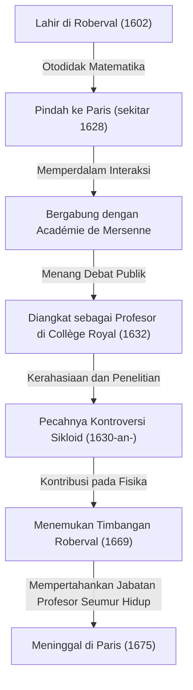
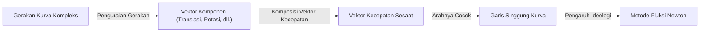
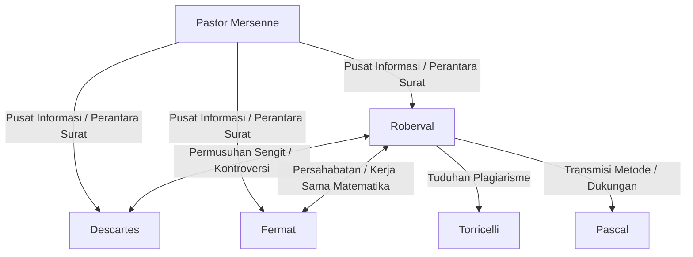

## 1. Pendahuluan: Para Raksasa Menjelang Penemuan Kalkulus dan Matematika Abad Ke-17

Eropa pada abad ke-17 adalah masa ledakan pengetahuan yang dramatis, yang kemudian dikenal sebagai "Revolusi Ilmiah". Khususnya dalam bidang matematika, persiapan yang cepat sedang berlangsung untuk kelahiran matematika baru yang melampaui kerangka kerja geometri [Euclide](https://kenji.blog/id/p/euclid/)an yang diwarisi dari Yunani kuno untuk menangani besaran yang berubah, yang sangat kecil, dan yang tak terhingga—yaitu, "kalkulus". Monumen bersejarah penyelesaian kalkulus oleh [Isaac Newton](https://kenji.blog/id/p/newton/) dan Gottfried Wilhelm Leibniz sama sekali bukan dicapai oleh kejeniusan mereka berdua saja. Di baliknya terdapat perjuangan banyak matematikawan yang bergulat dengan konsep ketakterhinggaan dan limit sebelum mereka.

Salah satu matematikawan terpenting di Prancis pada "malam sebelum kalkulus" ini adalah [Gilles Personne de Roberval](https://kenji.blog/id/p/roberval/) (1602–1675). Roberval memperkenalkan "metode indivisibles" ke Prancis yang diusulkan oleh ilmuwan Italia Bonaventura Cavalieri, dan dengan menyempurnakannya secara independen, ia menciptakan metode yang kuat untuk menghitung luas bangun yang dibatasi oleh kurva dan volume benda putar. Ia juga menunjukkan bakat luar biasa dalam bidang fisika dan mekanika, meninggalkan penemuan terobosan yang dikenal sebagai "timbangan [Roberval](https://kenji.blog/id/p/roberval/)", yang masih dapat dilihat di pasar dan laboratorium sains saat ini.

Dalam artikel ini, kita akan mendalami kehidupan matematikawan yang menyendiri ini yang hidup melalui era yang penuh pergolakan, kontroversi sengitnya dengan orang-orang sezamannya, dan pencapaian matematika dan mekanika yang mendalam yang ia tinggalkan, lengkap dengan ilustrasi dan rumus matematika yang kaya.

## 2. Kehidupan [Roberval](https://kenji.blog/id/p/roberval/) dan Latar Belakang Sejarah

### 2.1. Bangkit dari Kalangan Petani dan Pindah ke Paris

Gilles Personne lahir pada 10 Agustus 1602, di sebuah desa kecil bernama [Roberval](https://kenji.blog/id/p/roberval/) dekat Beauvais di Prancis utara. Keluarganya diyakini sebagai petani, yang sama sekali bukan latar belakang yang menguntungkan untuk bersekolah dalam masyarakat kelas yang ketat pada masa itu. Namun, sejak usia muda, ia menunjukkan kecerdasan luar biasa dan minat yang kuat pada matematika. Kemudian, ia mengambil nama desa asalnya dan mulai menyebut dirinya "de [Roberval](https://kenji.blog/id/p/roberval/)". Hal ini dapat dilihat sebagai ekspresi kebanggaannya terhadap asal-usulnya serta upaya untuk membangun identitasnya sebagai seorang sarjana.

Setelah belajar matematika dan bahasa klasik (Latin dan Yunani) secara otodidak pada usia muda, [Roberval](https://kenji.blog/id/p/roberval/) membidik tingkat akademis yang lebih tinggi dan pindah ke ibu kota, Paris, sekitar tahun 1628. Paris pada saat itu merupakan tempat berkumpulnya para ilmuwan, mengumpulkan para cendekiawan dari seluruh Eropa. Di sana, ia mulai sering menghadiri pertemuan para cendekiawan yang berpusat di sekitar Pastor [Marin Mersenne](/id/p/mersenne/), yang dikenal sebagai "Académie de Mersenne". [Mersenne](https://kenji.blog/id/p/mersenne/), yang sering disebut "kepala kantor pos keilmuan Eropa", bertindak sebagai perantara korespondensi antar ilmuwan di seluruh Eropa, memainkan peran dalam berbagi penemuan ilmiah terbaru.

Melalui salon [Mersenne](https://kenji.blog/id/p/mersenne/), Roberval memperdalam interaksinya dengan para pemikir terkemuka Prancis pada saat itu, seperti [René Descartes](/id/p/descartes/), [Pierre de Fermat](/id/p/fermat/), [Blaise Pascal](/id/p/pascal/), dan Étienne [Pascal](https://kenji.blog/id/p/pascal/) (ayah Blaise), yang memungkinkan bakat matematikanya berkembang.

### 2.2. Jabatan Profesor Collège Royal dan Pertempuran Bertahan yang Melelahkan

Pada tahun 1632, titik balik besar datang bagi [Roberval](https://kenji.blog/id/p/roberval/). Sebuah lowongan terbuka untuk jabatan profesor matematika (kursi Ramus) yang didirikan oleh Pierre de la Ramée, seorang ahli logika dan matematikawan terkenal, di Collège de France (kemudian dikenal sebagai Collège Royal) di Paris.

Metode pemilihan jabatan profesor ini sangat tidak biasa dan melelahkan. Para kandidat terlibat dalam debat matematika di depan umum, dan pemenangnya mendapatkan posisi tersebut. Selain itu, yang mengerikan, posisi ini bukan untuk seumur hidup; ini mengharuskan menerima penantang setiap tiga tahun untuk terlibat dalam debat publik, dan seseorang harus terus menang untuk mempertahankannya. Kekalahan berarti kehilangan jabatan profesor dan gajinya dengan segera.

[Roberval](https://kenji.blog/id/p/roberval/) dengan luar biasa memenangkan kompetisi yang melelahkan ini dan mengambil kursi profesor. Hebatnya, ia berhasil mempertahankan posisi ini tanpa satu kekalahan pun selama lebih dari 40 tahun, sampai ia meninggal dunia pada usia 73 tahun pada 1675.

Salah satu alasan mengapa ia enggan menerbitkan penemuan matematikanya dengan cepat sebagai makalah atau buku justru terletak pada "pertempuran bertahan setiap tiga tahun" ini. Untuk mengalahkan penantang di depan umum, penting untuk merahasiakan hasil matematika terbaru dan metode pemecahan yang kuat sebagai "senjata rahasia". Kerahasiaan yang ekstrem ini kemudian menyebabkan perselisihan prioritas yang serius (perdebatan tentang siapa yang menemukan sesuatu lebih dulu) dengan orang-orang sezamannya.

## 3. Pencapaian Matematika: Indivisibles dan Awal Mula Integral

### 3.1. Pengenalan dan Penyempurnaan Metode Indivisibles

Pencapaian matematika terbesar [Roberval](https://kenji.blog/id/p/roberval/) adalah menjadi orang pertama yang memperkenalkan **metode indivisibles** ke Prancis, yang dirintis oleh matematikawan Italia Bonaventura Cavalieri, dan mengembangkan serta menyempurnakannya secara independen. Metode ini adalah pelopor langsung yang inovatif untuk kalkulus integral modern.

Indivisibles (yang tak dapat dibagi) Cavalieri adalah konsep bahwa "suatu permukaan adalah kumpulan segmen garis sejajar (besaran indivisibles) yang tak terhingga banyaknya, dan suatu benda padat adalah kumpulan bidang sejajar yang tak terhingga banyaknya". Dalam istilah modern, ini adalah ide dasar yang persis dari integral tentu: mengiris suatu bangun menjadi irisan yang sangat tipis dan menjumlahkannya untuk menemukan luas atau volume.

[Roberval](https://kenji.blog/id/p/roberval/) menyempurnakan konsep ini secara lebih matematis. Ketika menghitung luas kurva tertentu, ia menyatakannya sebagai jumlah persegi panjang yang sangat tipis yang membentuk kurva tersebut. Metodenya membuat "metode penghabis" yang digunakan oleh ilmuwan Yunani kuno [Archimedes](https://kenji.blog/id/p/archimedes/) menjadi lebih intuitif dan lebih mudah dihitung, menjadi alat yang ampuh untuk memecahkan banyak masalah geometri yang sulit.

### 3.2. Integrasi Pangkat dan Penemuan Paralel bersama [Fermat](https://kenji.blog/id/p/fermat/)

Dengan menggunakan metode indivisibles, [Roberval](https://kenji.blog/id/p/roberval/) berhasil membuktikan secara geometris perhitungan yang setara dengan integral tentu $ \int_{0}^{a} x^n dx $ untuk kasus-kasus di mana $ n $ adalah bilangan bulat positif. Dengan memperlakukan luas di bawah kurva sebagai jumlah dari barisan tak terhingga dan memanfaatkan rumus untuk jumlah pangkat bilangan asli, ia menurunkan kesimpulan berikut:

$$
\int_{0}^{a} x^n dx = \frac{a^{n+1}}{n+1} \quad \left( \text{di mana } n \text{ adalah bilangan bulat positif} \right)
$$

Misalnya, ketika $ n = 2 $, luas di bawah parabola $ y = x^2 $ adalah $ \frac{a^3}{3} $. Ini adalah hasil yang sama yang ditemukan [Pierre de Fermat](https://kenji.blog/id/p/fermat/) secara independen pada waktu yang hampir bersamaan. Roberval dan [Fermat](https://kenji.blog/id/p/fermat/) saling menghormati metode satu sama lain dan membagikan penemuan ini melalui surat. Pencapaian mereka menjadi batu loncatan penting menuju perumusan integral oleh Leibniz di kemudian hari.

## 4. Studi tentang Sikloid dan Perselisihan Prioritas yang Sengit

### 4.1. Geometri Helen: Pesona Sikloid

Dalam komunitas matematika abad ke-17, ada sebuah kurva yang memikat para ilmuwan dan secara bersamaan menjadi benih kontroversi yang sengit, yang disebut "Geometri Helen". Itu adalah **sikloid**. Sikloid adalah lintasan yang ditelusuri oleh sebuah titik pada keliling lingkaran saat lingkaran itu menggelinding tanpa selip di sepanjang garis lurus.

Galileo Galilei tertarik pada keindahan kurva ini dan menamainya "sikloid". Menggunakan parameter $ t $ (sudut rotasi) dan jari-jari $ r $ dari lingkaran pembentuknya, koordinat $ (x, y) $ dari suatu titik pada sikloid dinyatakan sebagai berikut:

$$
\begin{cases}
x = r(t - \sin t) \\
y = r(1 - \cos t)
\end{cases}
$$

Melalui eksperimen fisik dengan memotong pelat logam berbentuk sikloid dan menimbangnya, Galileo menduga bahwa "luas lengkungan sikloid tepat tiga kali luas lingkaran pembentuknya". Namun, ia tidak dapat membuktikannya secara matematis.

### 4.2. Pembuktian Luas [Roberval](https://kenji.blog/id/p/roberval/) yang Ketat

Pada tahun 1634, dengan memanfaatkan metode indivisibles sepenuhnya, [Roberval](https://kenji.blog/id/p/roberval/) membuktikan secara matematis dan ketat bahwa dugaan Galileo adalah benar. Ia dengan cerdik membandingkan kurva sikloid dengan kurva yang tercipta ketika lingkaran pembentuknya digeser, menggunakan metode geometris yang brilian untuk membagi dan merekonstruksi luas.

Menggunakan kalkulus integral modern, luas $ A $ yang dibatasi oleh satu lengkungan sikloid ($ 0 \le t \le 2\pi $) dan alasnya (sumbu x) dapat dihitung dengan mudah sebagai berikut:

$$
\begin{aligned}
A &= \int_{0}^{2\pi r} y \, dx \\
  &= \int_{0}^{2\pi} r(1 - \cos t) \cdot r(1 - \cos t) \, dt \\
  &= r^2 \int_{0}^{2\pi} (1 - 2\cos t + \cos^2 t) \, dt \\
  &= r^2 \left[ t - 2\sin t + \frac{t}{2} + \frac{\sin 2t}{4} \right]_{0}^{2\pi} \\
  &= r^2 \left( 2\pi + \pi \right) = 3\pi r^2
\end{aligned}
$$

[Roberval](https://kenji.blog/id/p/roberval/) mencapai penemuan besar ini, namun, seperti biasa, menunda publikasinya untuk mempertahankan jabatan profesornya, hanya mengomunikasikannya melalui surat kepada beberapa matematikawan dekat (seperti [Mersenne](https://kenji.blog/id/p/mersenne/)).

### 4.3. Kontroversi dengan Torricelli

Beberapa tahun kemudian, pada 1644, orang Italia Evangelista Torricelli (murid Galileo, yang terkenal dengan "hampa Torricelli") secara independen menemukan bahwa luas sikloid adalah tiga kali luas lingkarannya, dan menerbitkannya dalam sebuah buku.

Setelah mengetahui hal ini, [Roberval](https://kenji.blog/id/p/roberval/) sangat marah. Ia menuduh Torricelli, dengan mengklaim, "Torricelli mengintip hasil temuan saya melalui surat-surat dari Mersenne dan menerbitkannya sebagai penemuannya sendiri." Kontroversi mengenai plagiarisme ini menjadi sangat sengit, dan hubungan antara keduanya menjadi rusak tak dapat diperbaiki. Saat ini, diyakini bahwa penemuan Torricelli dilakukan secara independen dan bukan plagiarisme, tetapi insiden ini dikenang sebagai anekdot yang menggambarkan sifat pemarah [Roberval](https://kenji.blog/id/p/roberval/) dan keterbatasan transmisi informasi pada waktu itu.

## 5. Konstruksi Kinematika Garis Singgung: Jalan Lain Menuju Turunan

[Roberval](https://kenji.blog/id/p/roberval/) merancang pendekatan inovatif tidak hanya di bidang integral tetapi juga di bidang diferensial (masalah menggambar garis singgung). Ia memeriksa kembali masalah geometris sebagai "kinematika" fisik.

Pada masa itu, menemukan garis singgung suatu kurva adalah salah satu masalah paling penting dalam geometri. [René Descartes](https://kenji.blog/id/p/descartes/) mencoba mencari garis singgung menggunakan pendekatan geometris aljabar dengan persamaan aljabar, namun pendekatan ini memiliki kelemahan yaitu perhitungannya sangat rumit.

Sebaliknya, [Roberval](https://kenji.blog/id/p/roberval/) berpikir sebagai berikut: "Jika suatu kurva adalah lintasan yang ditelusuri oleh sebuah titik yang bergerak, maka arah pergerakan titik tersebut pada suatu waktu tertentu (vektor kecepatan) adalah tepat merupakan garis singgung pada kurva tersebut."

Ia menguraikan gerakan titik yang menghasilkan kurva kompleks menjadi dua komponen gerakan sederhana. Kemudian, dengan mencari vektor kecepatan pada setiap komponen gerakan dan menggabungkannya secara geometris (jumlah vektor), ia menentukan garis singgung sebagai arah vektor kecepatan resultan.

"Metode garis singgung kinematika" ini menunjukkan kekuatan yang luar biasa dalam menemukan garis singgung untuk kurva transendental (kurva yang tidak dapat dinyatakan dengan persamaan aljabar) seperti sikloid. Pendekatan [Roberval](https://kenji.blog/id/p/roberval/) dalam membawa konsep fisik gerak ini ke dalam matematika merupakan langkah yang sangat penting yang secara langsung mengarah pada ideologi mendasar "Metode Fluksi" (kalkulus kinematika) yang kemudian didirikan oleh [Isaac Newton](https://kenji.blog/id/p/newton/).

## 6. Kontribusi pada Mekanika: Timbangan [Roberval](https://kenji.blog/id/p/roberval/)

Meskipun [Roberval](https://kenji.blog/id/p/roberval/) mengeksplorasi ketakterhinggaan abstrak dan gerak dalam matematika, ia juga memiliki bakat luar biasa dalam fisika dunia nyata, mekanika, dan bahkan desain teknik mesin. Contoh yang paling menonjol, yang dikenal luas saat ini dengan menggunakan namanya, adalah **"Timbangan [Roberval](https://kenji.blog/id/p/roberval/)"**.

### 6.1. Kekurangan Timbangan Konvensional

Timbangan yang digunakan sejak zaman kuno memiliki mekanisme "dacin" di mana balok ditopang pada titik tumpu tengah dengan piringan yang tergantung di kedua ujungnya. Dalam metode ini, jarak dari titik tumpu ke piringan (lengan momen) harus konstan secara ketat agar penimbangannya akurat. Selain itu, ini memiliki kelemahan fatal: jika posisi meletakkan beban atau benda di atas piringan menyimpang dari tengah, momennya akan berubah karena prinsip pengungkit, sehingga mustahil melakukan pengukuran yang akurat.

### 6.2. Adopsi Mekanisme Penghubung Jajar Genjang

Pada tahun 1669, [Roberval](https://kenji.blog/id/p/roberval/) mempresentasikan sebuah mekanisme inovatif kepada Akademi Sains Kerajaan Prancis yang sepenuhnya memecahkan masalah ini. Ia mengadopsi "mekanisme penghubung jajar genjang" (struktur yang mirip pantograf) yang menghubungkan dua batang sejajar atas dan bawah dengan batang vertikal kiri dan kanan menggunakan pasak.

Dengan struktur ini, piringan kiri dan kanan bergerak naik turun secara paralel sekaligus secara konstan menjaga posisi horizontal tanpa miring. Fakta bahwa piringan bergerak secara horizontal berarti, dari Prinsip Kerja Virtual, bahwa di mana pun beban diletakkan pada piringan, jarak pergerakan beban ke atas dan ke bawah (jumlah kerja) tidak berubah.

Sebagai hasilnya, timbangan dengan karakteristik praktis yang sangat baik terwujud: "Di mana pun beban diletakkan di atas piringan, hasil penimbangannya sama sekali tidak berubah." Prinsip inovatif ini terus digunakan apa adanya hingga saat ini, sebagai dasar timbangan yang digunakan di kantor pos untuk menimbang surat, timbangan yang digunakan di pasar untuk menimbang bahan-bahan, dan bahkan neraca yang ditemukan di laboratorium sains sekolah. Fakta bahwa mekanisme mekanis yang dirancang lebih dari 350 tahun yang lalu masih digunakan sampai sekarang tanpa mengubah prinsip dasarnya, membuktikan kehebatan insting teknik [Roberval](https://kenji.blog/id/p/roberval/).

## 7. Interaksi dengan Sesama Ilmuwan dan Kehidupan yang Penuh Kontroversi

Selain bakatnya yang luar biasa, [Roberval](https://kenji.blog/id/p/roberval/) dikatakan memiliki sifat yang sangat pemarah dan keras kepala yang menolak untuk menyerah pada teori-teorinya. Akibatnya, ia terlibat dalam kontroversi sengit dengan banyak cendekiawan terkenal pada masanya.

- **Konflik dengan [René Descartes](https://kenji.blog/id/p/descartes/)**:
  Sementara [Descartes](https://kenji.blog/id/p/descartes/) mempromosikan "geometri analitik", yang memecahkan masalah geometri menggunakan aljabar, Roberval menghargai metode geometris dan kinematika murni. Roberval mengkritik metode Descartes karena terlalu dibuat-buat dan sering menyerang kelemahan dalam teori Descartes. Descartes, sebaliknya, memandang rendah [Roberval](https://kenji.blog/id/p/roberval/) sebagai orang yang "kasar dan tidak berpendidikan", dan hubungan mereka tetap bermusuhan sepanjang hidup mereka.
- **Persahabatan dengan [Pierre de Fermat](https://kenji.blog/id/p/fermat/)**:
  Berbeda dengan [Descartes](https://kenji.blog/id/p/descartes/), Roberval membangun hubungan yang sangat baik dengan Fermat, yang tinggal di Toulouse. Meskipun memiliki kepribadian yang bertolak belakang, mereka berbagi ide-ide matematika melalui surat yang diperantarai oleh [Mersenne](https://kenji.blog/id/p/mersenne/), saling melengkapi penelitian satu sama lain tentang masalah-masalah seperti indivisibles.
- **Pengaruh pada [Blaise Pascal](https://kenji.blog/id/p/pascal/)**:
  Jenius muda [Pascal](https://kenji.blog/id/p/pascal/) juga sangat dipengaruhi oleh Roberval. Pascal kemudian menerbitkan makalah tentang sikloid menggunakan nama samaran "A. Dettonville", dan banyak metode yang digunakan di dalamnya adalah versi yang telah disempurnakan dari ide Roberval tentang indivisibles. Roberval sangat menghargai bakat [Pascal](https://kenji.blog/id/p/pascal/) dan mendukungnya.

## 8. Kesimpulan: Sang Jenius Penyendiri yang Menjembatani Jalan Menuju Kalkulus

[Gilles Personne de Roberval](https://kenji.blog/id/p/roberval/), pada era tepat sebelum lahirnya kalkulus secara formal, sepenuhnya memanfaatkan dua senjata ampuh—metode indivisibles dan pendekatan kinematika—untuk secara berurutan memecahkan masalah matematika dengan tingkat kesulitan tertinggi pada masanya.

Sebagai akibat dari penundaannya yang berlebihan dalam menerbitkan penemuan-penemuannya karena tekanan untuk mempertahankan jabatan profesornya setiap tiga tahun, beberapa pencapaiannya tidak dinilai secara adil oleh orang-orang sezamannya, dan ia terkadang terseret ke dalam perselisihan prioritas yang tidak diinginkan. Namun, benih-benih ide matematika yang ia tabur pastinya menyebar melalui jaringan [Mersenne](https://kenji.blog/id/p/mersenne/) dan kenalan-kenalan seperti Fermat dan [Pascal](https://kenji.blog/id/p/pascal/), menjadi jembatan kuat yang mengarah ke fondasi kalkulus oleh Newton dan Leibniz di kemudian hari.

Selanjutnya, sebagaimana terlihat dalam penemuannya, "timbangan [Roberval](https://kenji.blog/id/p/roberval/)", dalam mekanika, alih-alih hanya sekadar matematika abstrak, pemikiran teoretisnya selalu terhubung secara mendalam dengan dunia fisik nyata. [Roberval](https://kenji.blog/id/p/roberval/), yang aktif di wilayah batas antara matematika dan fisika, benar-benar terukir selamanya dalam sejarah matematika sebagai "pemain kunci di balik layar" yang secara fundamental mendukung dan mendorong Revolusi Ilmiah abad ke-17.
