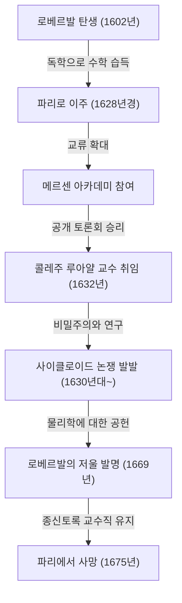
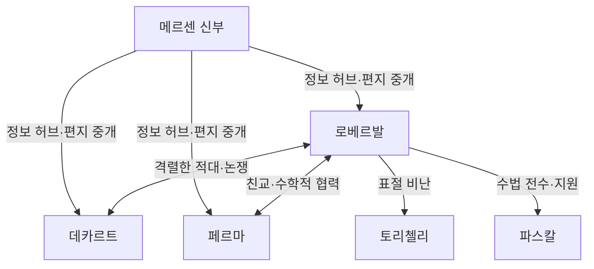

## 1. 서론: 미적분 전야의 거인들과 17세기 수학

17세기 유럽은 훗날 '과학 혁명'이라 불리게 되는 극적인 지식의 폭발이 일어난 시대였습니다. 특히 수학 분야에서는 고대 그리스에서 물려받은 [유클리드](https://kenji.blog/ko/p/euclid/) 기하학의 틀을 넘어, 변화하는 양과 무한소 및 무한대를 다루는 새로운 수학, 즉 '미적분학'의 탄생을 위한 준비가 빠르게 진행되고 있었습니다. [아이작 뉴턴](https://kenji.blog/ko/p/newton/)과 고트프리트 빌헬름 라이프니츠에 의한 미적분학의 완성이라는 역사적인 금자탑은 결코 이 두 천재만의 힘으로 이루어진 것이 아닙니다. 그 이면에는 그들보다 앞서 무한과 극한의 개념과 씨름했던 수많은 수학자들의 고군분투가 있었습니다.

이 '미적분 전야'의 프랑스에서 가장 중요한 역할을 했던 수학자 중 한 명이 바로 질 페르손 드 로베르발([Gilles Personne de Roberval](https://kenji.blog/ko/p/roberval/), 1602–1675)입니다. 로베르발은 이탈리아의 보나벤투라 카발리에리가 제창한 '불가분량의 방법(Method of Indivisibles)'을 프랑스에 도입하고, 이를 독자적으로 세련되게 다듬어 곡선으로 둘러싸인 도형의 면적이나 회전체의 부피를 계산하는 강력한 기법을 만들어냈습니다. 또한 물리학 및 역학 분야에서도 탁월한 재능을 발휘하여 오늘날에도 시장이나 과학실에서 흔히 볼 수 있는 '로베르발의 저울(윗접시저울)'이라는 획기적인 발명품을 남겼습니다.

본 기사에서는 이 고독하고 격동적인 시대를 살았던 수학자 로베르발의 생애, 동시대인들과의 격렬한 논쟁, 그리고 그가 남긴 심오한 수학적·역학적 업적에 대해 풍부한 도해 및 수식과 함께 깊이 있게 파헤쳐 보겠습니다.

## 2. 로베르발의 생애와 시대 배경

### 2.1. 농민 출신의 입신양명과 파리 상경

질 페르손은 1602년 8월 10일, 프랑스 북부 보베(Beauvais) 근처의 로베르발([Roberval](https://kenji.blog/ko/p/roberval/))이라는 작은 마을에서 태어났습니다. 그의 가문은 농민이었던 것으로 추정되며, 당시의 엄격한 신분제 사회에서는 결코 학문을 하기에 유리한 출신이 아니었습니다. 하지만 그는 어린 시절부터 비범한 지성과 수학에 대한 강한 흥미를 보였습니다. 훗날 그는 자신의 출신 마을 이름을 따서 스스로를 '드 로베르발'이라고 부르게 되었습니다. 이는 그가 자신의 출신에 대한 자부심을 드러냄과 동시에 학자로서의 정체성을 확립하려 한 노력으로 볼 수 있습니다.

젊은 시절 독학으로 수학과 고전어(라틴어, 그리스어)를 익힌 로베르발은 더 높은 학문의 경지를 목표로 1628년경 수도 파리로 상경했습니다. 당시의 파리는 유럽 전역의 지식인들이 모여드는 학문의 용광로였습니다. 그곳에서 그는 [마랭 메르센](https://kenji.blog/ko/p/mersenne/) 신부를 중심으로 한 지식인 모임, 이른바 '메르센 아카데미(Académie de [Mersenne](https://kenji.blog/ko/p/mersenne/))'에 출입하게 되었습니다. 메르센은 '유럽 학계의 우체국장'이라고도 불리며 유럽 전역 학자들의 서신 교환을 중개하고 최신 과학적 발견을 공유하는 역할을 담당했습니다.

이 메르센의 살롱을 통해 로베르발은 [르네 데카르트](https://kenji.blog/ko/p/descartes/), [피에르 드 페르마](https://kenji.blog/ko/p/fermat/), [블레즈 파스칼](https://kenji.blog/ko/p/pascal/), 에티엔 파스칼(블레즈의 아버지) 등 당시 프랑스를 대표하는 일류 지성들과 교류를 넓히며 자신의 수학적 재능을 꽃피웠습니다.

### 2.2. 콜레주 루아얄 교수직과 가혹한 방어전

1632년, 로베르발에게 큰 전기가 찾아왔습니다. 파리의 콜레주 드 프랑스(당시 명칭은 콜레주 루아얄)에서 유명한 논리학자이자 수학자인 피에르 드 라뮈(라무스)가 창설한 수학 교수직(라무스 기념 강좌) 자리에 공석이 생긴 것입니다.

이 교수직의 선출 방식은 매우 특이하고 가혹했습니다. 후보자들은 공개 석상에서 수학적인 토론을 벌여 승자가 교수직을 얻는 시스템이었습니다. 더욱 무서운 것은 이 자리가 종신직이 아니라 3년마다 도전자를 받아들여 공개 토론회를 열고, 거기서 계속 승리하여 방어해야만 유지할 수 있었다는 점입니다. 패배하면 즉시 교수직과 급여를 잃게 됩니다.

로베르발은 이 가혹한 콩쿠르에서 훌륭하게 승리하여 교수 자리에 올랐습니다. 놀랍게도 그는 그 후 1675년 73세의 나이로 세상을 떠날 때까지 40년 이상 단 한 번도 패하지 않고 이 지위를 계속 유지했습니다.

그가 자신의 수학적 발견을 논문이나 서적으로 즉시 출판하려 하지 않았던 이유 중 하나는 바로 이 '3년마다 치러지는 방어전'에 있었습니다. 공개 석상에서 도전자를 물리치기 위해서는 다른 누구도 알지 못하는 최신 수학적 성과나 강력한 해법을 '비장의 무기'로 감춰둘 필요가 있었던 것입니다. 이러한 극단적인 비밀주의는 훗날 동시대인들과의 심각한 우선권 분쟁(누가 먼저 발견했는가를 둘러싼 논쟁)을 일으키는 원인이 되기도 했습니다.

## 3. 수학적 업적: 불가분량과 적분의 여명

### 3.1. 불가분량의 방법 도입과 세련화

로베르발의 가장 큰 수학적 업적은 이탈리아의 수학자 보나벤투라 카발리에리가 창시한 **불가분량의 방법(Method of Indivisibles)** 을 프랑스에 가장 먼저 도입하고, 이를 독자적으로 발전 및 세련화시킨 것입니다. 이 방법은 현대 적분학의 직접적인 선구가 되는 획기적인 것이었습니다.

카발리에리의 불가분량이란 "면은 무수히 많은 평행한 선분(분할할 수 없는 양)들의 모임이며, 입체는 무수히 많은 평행한 평면들의 모임이다"라고 간주하는 생각입니다. 현대의 언어로 말하자면, 도형을 무한히 얇은 조각으로 잘라내어 그것들을 합쳐서 면적이나 부피를 구하는, 즉 정적분의 기본적인 아이디어 그 자체입니다.

로베르발은 이 개념을 보다 수학적으로 정교하게 다듬었습니다. 그는 어떤 곡선의 면적을 구할 때, 그 곡선을 구성하는 무한히 얇은 직사각형들의 합으로 면적을 표현했습니다. 그의 방법은 고대 그리스의 아르키메데스가 사용했던 '실진법(Method of Exhaustion)'을 보다 직관적이고 계산하기 쉽게 만든 것으로, 수많은 난해한 기하학 문제를 푸는 강력한 도구가 되었습니다.

### 3.2. 거듭제곱의 적분과 페르마와의 동시 발견

불가분량의 방법을 사용하여, 로베르발은 정적분 $ \int_{0}^{a} x^n dx $ 에 해당하는 계산을 $ n $ 이 양의 정수인 경우에 대해 기하학적으로 증명하는 데 성공했습니다. 그는 곡선의 면적을 무한한 수열의 합으로 파악하고 자연수의 거듭제곱의 합 공식을 활용하여 다음과 같은 결론을 도출했습니다.

$$
\int_{0}^{a} x^n dx = \frac{a^{n+1}}{n+1} \quad \left( \text{여기서 } n \text{ 은 양의 정수} \right)
$$

예를 들어, $ n = 2 $ 인 경우 포물선 $ y = x^2 $ 아래의 면적은 $ \frac{a^3}{3} $ 이 됩니다. 이는 [피에르 드 페르마](https://kenji.blog/ko/p/fermat/)가 거의 같은 시기에 독립적으로 발견한 성과와 동일한 것이었습니다. 로베르발과 페르마는 서로의 기법을 존중하며 서신을 통해 이 발견을 공유했습니다. 그들의 성과는 훗날 라이프니츠에 의한 적분법의 정식화를 향한 중요한 발판이 되었습니다.

## 4. 사이클로이드 연구와 격렬한 우선권 분쟁

### 4.1. 헬레네의 기하학: 사이클로이드의 매력

17세기 수학계에서 '헬레네의 기하학(Geometry of Helen)'이라 불리며 학자들을 매료시키는 동시에 격렬한 논쟁의 씨앗이 된 곡선이 있었습니다. 바로 **사이클로이드(Cycloid)** 입니다. 사이클로이드란, 직선 위를 원이 미끄러지지 않고 굴러갈 때 원주 상의 한 점이 그리는 자취를 말합니다.

갈릴레오 갈릴레이는 이 곡선의 아름다움에 매료되어 '사이클로이드'라는 이름을 붙였습니다. 매개변수 $ t $ (회전각)와 생성원(굴러가는 원)의 반지름 $ r $ 을 사용하면, 사이클로이드 위 점의 좌표 $ (x, y) $ 는 다음과 같이 표현됩니다.

$$
\begin{cases}
x = r(t - \sin t) \\
y = r(1 - \cos t)
\end{cases}
$$

갈릴레오는 금속판을 사이클로이드 모양으로 오려내어 그 무게를 재는 물리적 실험을 통해 "사이클로이드 아치 하나의 면적은 생성원의 면적의 정확히 3배이다"라고 예상했습니다. 하지만 그는 이를 수학적으로 증명하지는 못했습니다.

### 4.2. 로베르발에 의한 면적의 엄밀한 증명

1634년, 로베르발은 불가분량의 방법을 자유자재로 구사하여 갈릴레오의 예상이 옳다는 것을 수학적으로 엄밀하게 증명했습니다. 그는 사이클로이드 곡선과, 생성원을 평행 이동시켰을 때 생기는 곡선을 교묘하게 비교하고, 면적을 분할하여 재구성하는 기발한 기하학적 수법을 사용했습니다.

현대의 적분 계산을 사용하면 사이클로이드 한 아치($ 0 \le t \le 2\pi $)와 밑변(x축)으로 둘러싸인 부분의 면적 $ A $ 는 다음과 같이 쉽게 계산할 수 있습니다.

$$
\begin{aligned}
A &= \int_{0}^{2\pi r} y \, dx \\
  &= \int_{0}^{2\pi} r(1 - \cos t) \cdot r(1 - \cos t) \, dt \\
  &= r^2 \int_{0}^{2\pi} (1 - 2\cos t + \cos^2 t) \, dt \\
  &= r^2 \left[ t - 2\sin t + \frac{t}{2} + \frac{\sin 2t}{4} \right]_{0}^{2\pi} \\
  &= r^2 \left( 2\pi + \pi \right) = 3\pi r^2
\end{aligned}
$$

로베르발은 이 위대한 발견을 이루어냈지만, 늘 그렇듯 교수직 방어를 위해 출판을 늦추었고, 소수의 친한 수학자(메르센 등)에게 서신으로 전하는 데 그쳤습니다.

### 4.3. 토리첼리와의 논쟁

몇 년 후인 1644년, 이탈리아의 에반젤리스타 토리첼리(갈릴레오의 제자이자 '토리첼리의 진공'으로 유명함)가 독자적으로 사이클로이드의 면적이 원의 3배라는 사실을 발견하고 이를 저서로 출판해 버렸습니다.

이 사실을 알게 된 로베르발은 격노했습니다. 그는 "토리첼리가 메르센의 편지를 통해 내 성과를 훔쳐보고 그것을 자신의 발견인 양 발표했다"고 비난했습니다. 이 표절을 둘러싼 논쟁은 매우 격렬해졌고 두 사람의 관계는 회복 불가능해졌습니다. 현재는 토리첼리의 발견이 독립적으로 이루어진 것이며 표절이 아니었던 것으로 여겨지고 있지만, 이 사건은 로베르발의 불같은 성격과 당시 정보 전달의 한계를 보여주는 일화로 전해지고 있습니다.

## 5. 운동학적인 접선 작도법: 미분을 향한 또 다른 길

로베르발은 적분 분야뿐만 아니라 미분 분야(접선을 긋는 문제)에서도 획기적인 접근법을 고안했습니다. 그것은 기하학적인 문제를 물리학적인 '운동(Kinematics)'으로 다시 파악하는 것이었습니다.

당시 곡선의 접선을 구하는 것은 기하학의 가장 중요한 과제 중 하나였습니다. [르네 데카르트](https://kenji.blog/ko/p/descartes/)는 대수 방정식을 이용한 대수 기하학적 수법으로 접선을 구하려 했지만, 계산이 매우 번잡해지는 단점이 있었습니다.

이에 반해 로베르발은 다음과 같이 생각했습니다. "곡선이 움직이는 점에 의해 그려지는 궤적이라면, 임의의 순간에 그 점이 움직이는 방향(속도 벡터)이야말로 곡선의 접선이다."

그는 복잡한 곡선을 생성하는 점의 운동을 두 개의 단순한 운동 성분으로 분해했습니다. 그리고 각각의 운동 성분에서의 속도 벡터를 구하고, 이를 기하학적으로 합성(벡터의 합)함으로써 합성된 속도 벡터의 방향을 접선으로 결정한 것입니다.

이 '운동학적 접선법'은 사이클로이드와 같은 초월 곡선(대수 방정식으로 나타낼 수 없는 곡선)의 접선을 구하는 데 막강한 위력을 발휘했습니다. 물리적인 운동의 개념을 수학에 도입한 로베르발의 접근은 훗날 [아이작 뉴턴](https://kenji.blog/ko/p/newton/)이 창시하는 '유율법(Method of Fluxions, 운동학적 미적분)'의 근본 사상으로 직접 이어지는 매우 중요한 단계였습니다.

## 6. 역학에 대한 공헌: 로베르발의 저울([Roberval](https://kenji.blog/ko/p/roberval/) Balance)

수학에서 추상적인 무한이나 운동을 탐구했던 로베르발이지만, 그는 현실 세계의 물리학이나 역학, 더 나아가 공학적인 기계 설계에 있어서도 탁월한 재능을 가지고 있었습니다. 그 가장 두드러진 예이자 오늘날에도 그의 이름을 따서 널리 알려져 있는 것이 **'로베르발의 저울([Roberval](https://kenji.blog/ko/p/roberval/) Balance, 윗접시저울)'** 입니다.

### 6.1. 기존 저울의 단점

고대부터 사용되어 온 저울은 중앙의 받침점으로 막대를 받치고 양쪽 끝에 접시를 매달아 놓는 '대저울' 방식이었습니다. 이 방식에서는 받침점부터 접시까지의 거리(모멘트 암)가 엄밀하게 일정해야만 정확한 무게를 잴 수 있습니다. 또한 접시 위에서 분동이나 재고자 하는 물체를 놓는 위치가 중심에서 벗어나면 지레의 원리에 의해 모멘트가 변화하여 정확한 계량이 불가능하다는 치명적인 단점이 있었습니다.

### 6.2. 평행사변형 링크 기구의 채택

1669년, 로베르발은 이 문제를 완전히 해결하는 획기적인 기구를 프랑스 왕립 과학 아카데미에 발표했습니다. 그는 위아래 2개의 평행한 막대와 좌우의 수직인 막대를 핀으로 결합한 '평행사변형 링크 기구(팬터그래프와 같은 구조)'를 채택했습니다.

이 구조 덕분에 좌우의 접시는 기울어지지 않고 항상 수평을 유지한 채 위아래로 평행 이동하게 됩니다. 접시가 수평으로 움직인다는 것은 '가상 일의 원리(Principle of Virtual Work)'의 관점에서 볼 때, 접시 위 어디에 무거운 것을 놓더라도 추가 위아래로 움직이는 거리(일의 양)는 변하지 않음을 의미합니다.

결과적으로 "접시 위 어디에 무게 추를 놓더라도 계량 결과가 전혀 변하지 않는" 실용적으로 매우 뛰어난 특성을 가진 저울이 실현되었습니다. 이 혁신적인 원리는 현재도 우체국에서 편지의 무게를 재는 저울이나 시장에서 식재료를 재는 윗접시저울, 나아가 학교 과학실에 있는 윗접시저울의 기초로 그대로 계속 사용되고 있습니다. 350년도 더 전에 고안된 기계 기구가 기본 원리를 바꾸지 않고 현대에도 사용되고 있다는 사실은 로베르발의 공학적 센스가 얼마나 대단했는지를 말해줍니다.

## 7. 동시대인들과의 관계와 논쟁의 생애

로베르발은 탁월한 재능과 함께 기질이 매우 불같고 자신의 주장을 굽히지 않는 고집스러운 성격이었다고 전해집니다. 그 때문에 동시대의 많은 저명한 학자들과 격렬한 논쟁을 벌였습니다.

- **[르네 데카르트](https://kenji.blog/ko/p/descartes/)와의 대립**:
  데카르트는 대수학을 이용하여 기하학을 푸는 '해석 기하학'을 추진하고 있었지만, 로베르발은 순수한 기하학적·운동학적인 수법을 중시했습니다. 로베르발은 데카르트의 수법이 너무 인위적이라고 비판하며 종종 데카르트 이론의 결함을 공격했습니다. 데카르트 역시 로베르발을 "거칠고 교양이 없다"며 깔보았고, 두 사람의 관계는 평생 험악한 상태로 남았습니다.
- **[피에르 드 페르마](https://kenji.blog/ko/p/fermat/)와의 우정**:
  데카르트와는 대조적으로, 로베르발은 툴루즈에 사는 페르마와는 매우 좋은 관계를 구축했습니다. 성격적으로는 대조적인 두 사람이었지만, 그들은 메르센을 통한 편지 교환으로 수학적인 아이디어를 공유하며 불가분량 문제 등에서 서로의 연구를 보완했습니다.
- **[블레즈 파스칼](https://kenji.blog/ko/p/pascal/)에게 미친 영향**:
  젊은 천재 파스칼 또한 로베르발로부터 큰 영향을 받았습니다. 파스칼은 훗날 'A. 데통빌(A. Dettonville)'이라는 가명을 사용하여 사이클로이드에 관한 논문을 발표하는데, 그 안에서 사용된 수법의 상당수는 로베르발의 불가분량 아이디어를 세련되게 다듬은 것이었습니다. 로베르발은 파스칼의 재능을 높이 평가하고 그를 지원했습니다.

## 8. 결론: 미적분을 향한 징검다리가 된 고독한 천재

질 페르손 드 로베르발은 미분 적분학이 정식으로 탄생하기 직전의 시대에 불가분량의 방법과 운동학적 접근이라는 두 가지 강력한 무기를 구사하여 당시 최고 난이도의 수학 문제들을 차례로 해결했습니다.

3년마다 치러지는 교수직 방어라는 중압감 때문에 자신의 발견을 출판하는 것을 지나치게 꺼린 결과, 그의 업적 중 일부는 동시대 사람들에게 정당하게 평가받지 못했고 원치 않는 우선권 분쟁에 휘말리기도 했습니다. 하지만 그가 뿌린 수학적 아이디어의 씨앗은 메르센의 네트워크나 페르마, 파스칼과 같은 지인들을 통해 확실하게 퍼져나갔고, 훗날 뉴턴과 라이프니츠에 의한 미적분학 창시로 이어지는 견고한 징검다리가 되었습니다.

또한 추상적인 수학뿐만 아니라 역학에서의 '로베르발의 저울' 발명에서 볼 수 있듯이, 그의 이론적인 사고는 항상 현실의 물리 세계와 깊이 연결되어 있었습니다. 수학과 물리학의 경계 영역에서 활약한 로베르발은 그야말로 17세기 과학 혁명을 밑바탕에서 지탱하고 이끈 '숨은 주역'으로서 수학사에 그 이름을 영원히 새기고 있습니다.
