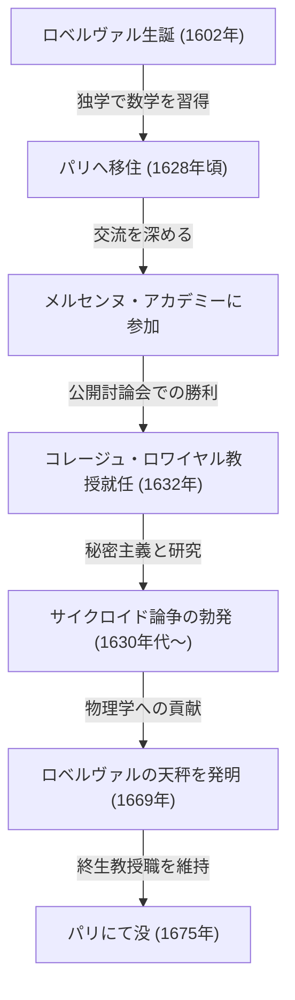
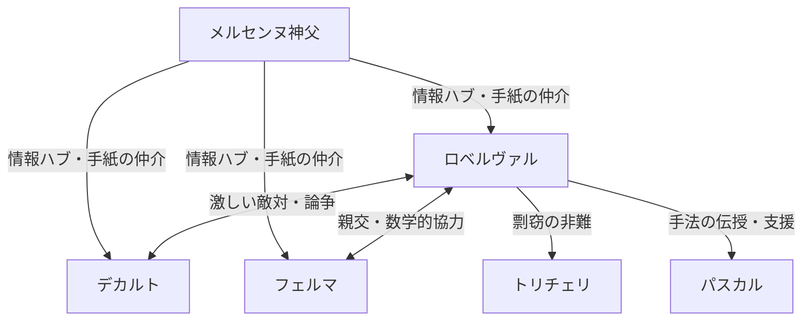

## 1. はじめに：微積分前夜の巨人たちと17世紀の数学

17世紀のヨーロッパは、後の「科学革命」と呼ばれる劇的な知識の爆発が起きた時代でした。特に数学の分野においては、古代ギリシャから受け継がれた[ユークリッド](https://kenji.blog/p/euclid/)幾何学の枠組みを超え、変化する量や無限小・無限大を扱う新しい数学、すなわち「微積分学」の誕生に向けた準備が急速に進められていました。アイザック・[ニュートン](https://kenji.blog/p/newton/)とゴットフリート・ヴィルヘルム・[ライプニッツ](https://kenji.blog/p/leibniz/)による微積分の完成という歴史的偉業は、決して彼ら二人の天才のみによって成し遂げられたものではありません。その背後には、彼らに先立って無限や極限の概念と格闘した数多くの数学者たちの苦闘がありました。

その「微積分前夜」のフランスにおいて、最も重要な役割を果たした数学者の一人が、[ジル・ペルソンヌ・ド・ロベルヴァル](https://kenji.blog/p/roberval/)（[Gilles Personne de Roberval](https://kenji.blog/p/roberval/), 1602–1675）です。ロベルヴァルは、イタリアのボナヴェントゥーラ・カヴァリエリが提唱した「不可分量の方法」をフランスに導入し、それを独自に洗練させることで、曲線で囲まれた図形の面積や、回転体の体積を計算する強力な手法を生み出しました。また、物理学や力学の分野でも卓越した才能を発揮し、今日でも市場や理科室で見かけることのある「ロベルヴァルの天秤」という画期的な発明を残しています。

本記事では、この孤高にして激動の時代を生きた数学者ロベルヴァルの生涯、同時代人との激しい論争、そして彼が遺した深遠な数学的・力学的業績について、豊富な図解と数式とともに深く掘り下げていきます。

## 2. ロベルヴァルの生涯と時代背景

### 2.1. 農民からの立身出世とパリへの上京

ジル・ペルソンヌは1602年8月10日、フランスのボーヴェ（Beauvais）近郊にある小さな村、ロベルヴァル（Roberval）で生まれました。彼の家系は農民であったと考えられており、当時の厳格な身分制社会においては、決して学問に恵まれた出自ではありませんでした。しかし、彼は幼少期から並外れた知性と数学への強い関心を示していました。後に彼は、自身の出身地である村の名前をとり、自らを「ド・ロベルヴァル」と名乗るようになります。これは、彼が自身の出自に対する誇りと同時に、学者としてのアイデンティティを確立しようとした表れとも言えます。

若くして独学で数学と古典語（ラテン語やギリシャ語）を修めたロベルヴァルは、さらなる学問の高みを目指して1628年頃に首都パリへと上京しました。当時のパリは、ヨーロッパ中の知識人が集まる学問の坩堝（るつぼ）でした。そこで彼は、[マラン・メルセンヌ](https://kenji.blog/p/mersenne/)神父を中心とする知識人の集まり、いわゆる「メルセンヌ・アカデミー（Académie de Mersenne）」に出入りするようになります。メルセンヌは「ヨーロッパの学問の郵便局長」とも呼ばれ、ヨーロッパ中の学者たちの文通を仲介し、最新の科学的発見を共有する役割を担っていました。

このメルセンヌのサロンを通じて、ロベルヴァルは[ルネ・デカルト](https://kenji.blog/p/descartes/)、ピエール・ド・フェルマ、[ブレーズ・パスカル](https://kenji.blog/p/pascal/)、エティエンヌ・パスカル（ブレーズの父）といった、当時のフランスを代表する一流の頭脳たちと交流を深め、自身の数学的才能を開花させていきました。

### 2.2. コレージュ・ロワイヤル教授職と過酷な防衛戦

1632年、ロベルヴァルにとって大きな転機が訪れます。パリのコレージュ・ド・フランス（当時の名称はコレージュ・ロワイヤル）において、有名な論理学者であり数学者であったピエール・ド・ラムスが創設した数学教授職（ラムス記念講座）のポストに空きが出たのです。

この教授職の選出方法は非常に特殊で過酷なものでした。候補者たちは公開の場で数学的な討論を行い、その勝者が教授職を得るという仕組みでした。さらに恐ろしいことに、この地位は終身ではなく、3年ごとに挑戦者を受け入れて公開討論会を行い、それに勝利して防衛し続けなければなりませんでした。敗北すれば、即座に教授職と給与を失うことになります。

ロベルヴァルはこの過酷なコンクールに見事勝利し、教授の座に就きました。そして驚くべきことに、彼はその後、1675年に73歳でこの世を去るまで、40年以上にわたって一度も敗れることなくこの地位を保持し続けたのです。

彼が自身の数学的発見を論文や書籍としてすぐに出版しようとしなかった理由の一つは、まさにこの「3年ごとの防衛戦」にありました。挑戦者を公開の場で打ち負かすためには、他の誰も知らない最新の数学的成果や強力な解法を「秘中の武器」として手元に隠し持っておく必要があったのです。この極端な秘密主義は、後に同時代人との深刻な優先権争い（誰が最初に発見したかという論争）を引き起こす原因ともなりました。

## 3. 数学的業績：不可分量と積分の黎明

### 3.1. 不可分量の方法の導入と洗練

ロベルヴァルの最大の数学的業績は、イタリアの数学者ボナヴェントゥーラ・カヴァリエリが創始した **不可分量の方法（Method of Indivisibles）** をフランスにいち早く導入し、それを独自に発展・洗練させたことです。この方法は、現代の積分学の直接的な先駆けとなる画期的なものでした。

カヴァリエリの不可分量とは、「面は無数の平行な線分（不可分な量）の集まりであり、立体は無数の平行な平面の集まりである」とみなす考え方です。現代の言葉で言えば、図形を無限に細いスライスに分割し、それを足し合わせることで面積や体積を求めるという、定積分の基本的なアイデアそのものです。

ロベルヴァルはこの概念をより数学的に洗練させました。彼は、ある曲線の面積を求める際、その曲線を構成する無限に細い長方形の和として面積を表現しました。彼の方法は、古代ギリシャのアルキメデスが用いた「取り尽くし法（Method of Exhaustion）」をより直感的かつ計算しやすくしたものであり、数々の難解な幾何学問題を解き明かすための強力な道具となりました。

### 3.2. べき乗の積分とフェルマとの並行発見

不可分量の方法を用いて、ロベルヴァルは定積分 $ \int_{0}^{a} x^n dx $ に相当する計算を、$ n $ が正の整数の場合について幾何学的に証明することに成功しました。彼は、曲線の面積を無限個の数列の和として捉え、自然数のべき乗の和の公式を利用することで、以下の結論を導き出しました。

$$
\int_{0}^{a} x^n dx = \frac{a^{n+1}}{n+1} \quad \left( \text{where } n \text{ is a positive integer} \right)
$$

例えば、$ n = 2 $ の場合、放物線 $ y = x^2 $ の下の面積は $ \frac{a^3}{3} $ となります。これは、ピエール・ド・フェルマがほぼ同時期に独立して発見した成果と同じものでした。ロベルヴァルとフェルマは、互いの手法を尊重し合い、手紙を通じてこの発見を分かち合いました。彼らの成果は、後の[ライプニッツ](https://kenji.blog/p/leibniz/)による積分法の定式化に向けた重要な足場となりました。

## 4. サイクロイドの研究と激しい優先権争い

### 4.1. ヘレネの幾何学：サイクロイドの魅力

17世紀の数学界において、「ヘレネの幾何学（Geometry of Helen）」と呼ばれ、学者たちを魅了し、同時に激しい論争の種となった曲線がありました。それが **サイクロイド（Cycloid）** です。サイクロイドとは、直線上を円が滑らずに転がるとき、円周上の1点が描く軌跡のことです。

ガリレオ・ガリレイはこの曲線の美しさに惹かれ、「サイクロイド」と名付けました。媒介変数 $ t $ （回転角）と生成円の半径 $ r $ を用いると、サイクロイド上の点の座標 $ (x, y) $ は次のように表されます。

$$
\begin{cases}
x = r(t - \sin t) \\
y = r(1 - \cos t)
\end{cases}
$$

ガリレオは、金属板をサイクロイドの形に切り抜き、その重さを量るという物理的な実験を通して、「サイクロイドのアーチの面積は、生成円の面積のちょうど3倍である」と予想しました。しかし、彼はこれを数学的に証明することはできませんでした。

### 4.2. ロベルヴァルによる面積の厳密な証明

1634年、ロベルヴァルは不可分量の方法を駆使して、ガリレオの予想が正しいことを数学的に厳密に証明しました。彼は、サイクロイドの曲線と、生成円を平行移動させたときにできる曲線とを巧みに比較し、面積を分割して再構築するという見事な幾何学的手法を用いました。

現代の積分計算を用いれば、サイクロイド一連なり（ $ 0 \le t \le 2\pi $ ）と底辺（x軸）に囲まれた部分の面積 $ A $ は、次のように簡単に計算できます。

$$
\begin{aligned}
A &= \int_{0}^{2\pi r} y \, dx \\
  &= \int_{0}^{2\pi} r(1 - \cos t) \cdot r(1 - \cos t) \, dt \\
  &= r^2 \int_{0}^{2\pi} (1 - 2\cos t + \cos^2 t) \, dt \\
  &= r^2 \left[ t - 2\sin t + \frac{t}{2} + \frac{\sin 2t}{4} \right]_{0}^{2\pi} \\
  &= r^2 \left( 2\pi + \pi \right) = 3\pi r^2
\end{aligned}
$$

ロベルヴァルはこの偉大な発見を成し遂げましたが、例のごとく教授職の防衛のために出版を遅らせ、少数の親しい数学者（メルセンヌなど）に手紙で伝えるのみに留めました。

### 4.3. トリチェリとの論争

数年後の1644年、イタリアのエヴァンジェリスタ・トリチェリ（ガリレオの弟子であり、「トリチェリの真空」で有名）が、独自にサイクロイドの面積が円の3倍であることを発見し、それを著書として出版してしまいました。

これを知ったロベルヴァルは激怒しました。彼は「トリチェリはメルセンヌから手紙を通じて自分の成果を盗み見し、それを自分の発見として発表したのだ」と非難しました。この剽窃をめぐる論争は非常に激しくなり、両者の関係は修復不可能となりました。現在では、トリチェリの発見は独立して行われたものであり、剽窃ではなかったと考えられていますが、この事件はロベルヴァルの気性の激しさと、当時の情報伝達の限界を示すエピソードとして語り継がれています。

## 5. 運動学的な接線の作図法：微分へのもう一つの道

ロベルヴァルは積分の分野だけでなく、微分の分野（接線を引く問題）においても画期的なアプローチを考案しました。それは、幾何学的な問題を物理学的な「運動（Kinematics）」として捉え直すというものでした。

当時、曲線の接線を求めることは幾何学の最重要課題の一つでした。[ルネ・デカルト](https://kenji.blog/p/descartes/)は代数方程式を用いた代数幾何学的な手法で接線を求めようとしていましたが、計算が非常に煩雑になるという欠点がありました。

これに対し、ロベルヴァルは次のように考えました。「曲線が、動く点によって描かれる軌跡であるならば、任意の瞬間においてその点が動く方向（速度ベクトル）こそが、曲線の接線である」と。

彼は、複雑な曲線を生成する点の運動を、2つの単純な運動成分に分解しました。そして、それぞれの運動成分における速度ベクトルを求め、幾何学的に合成（ベクトル和）することで、合成された速度ベクトルの方向として接線を決定したのです。

この「運動学的接線法」は、サイクロイドのような超越曲線（代数方程式で表せない曲線）の接線を求めるのに絶大な威力を発揮しました。この物理的な運動の概念を数学に持ち込むというロベルヴァルのアプローチは、後にアイザック・[ニュートン](https://kenji.blog/p/newton/)が創始する「流率法（Method of Fluxions、運動学的微積分）」の根本思想へと直接繋がる、極めて重要なステップでした。

## 6. 力学への貢献：ロベルヴァルの天秤（Roberval Balance）

数学において抽象的な無限や運動を探求したロベルヴァルですが、彼は現実世界の物理学や力学、さらには工学的な機械の設計においても卓越した才能を持っていました。その最も顕著な例であり、今日でも彼の名を冠して広く知られているのが **「ロベルヴァルの天秤（Roberval Balance）」** です。

### 6.1. 従来のはかりの欠点

古代から使われていた天秤（てんびん）は、中央の支点で棒を支え、両端に皿をぶら下げる「竿秤（さおばかり）」の仕組みでした。この方式では、支点から皿までの距離（モーメントアーム）が厳密に一定でなければ正確な重さが量れません。また、皿の上で分銅や量りたい物体を置く位置が中心からずれると、テコの原理によってモーメントが変化し、正確な計量ができないという致命的な欠点がありました。

### 6.2. 平行四辺形リンク機構の採用

1669年、ロベルヴァルはこの問題を完全に解決する画期的な機構をフランス王立科学アカデミーに発表しました。彼は、上下2本の平行な棒と、左右の垂直な棒をピンで結合した「平行四辺形リンク機構（パンタグラフのような構造）」を採用しました。

この構造により、左右の皿は傾くことなく、常に水平を保ったまま上下に平行移動するようになります。皿が水平に動くということは、仮想仕事の原理（Principle of Virtual Work）から考えると、皿の上のどこに重りを置いても、重りが上下する距離（仕事量）は変わらないことを意味します。

結果として、「皿の上のどこにおもりを置いても、計量結果が一切変わらない」という、実用上極めて優れた特性を持つ天秤が実現しました。この革新的な原理は、現在でも郵便局で手紙の重さを量るはかりや、市場で食材を量る上皿天秤、さらには学校の理科室にある上皿天秤の基礎として、そのまま利用され続けています。350年以上前に考案された機械機構が、基本原理を変えずに現代でも使われているという事実は、ロベルヴァルの工学的センスの凄まじさを物語っています。

## 7. 同時代人との関わりと論争の生涯

ロベルヴァルは、その卓越した才能とともに、非常に気性が激しく、自説を曲げない頑固な性格であったと伝えられています。そのため、同時代の多くの著名な学者たちと激しい論争を繰り広げました。

- **[ルネ・デカルト](https://kenji.blog/p/descartes/)との対立**:
  デカルトは代数学を用いて幾何学を解く「解析幾何学」を推進していましたが、ロベルヴァルは純粋な幾何学的・運動学的な手法を重んじていました。ロベルヴァルはデカルトの手法が人工的すぎると批判し、しばしばデカルトの理論の欠陥を攻撃しました。デカルトもまたロベルヴァルを「粗野で教養がない」と見下しており、両者の関係は終生険悪なままでした。
- **ピエール・ド・フェルマとの友情**:
  デカルトとは対照的に、ロベルヴァルはトゥールーズに住むフェルマとは非常に良好な関係を築いていました。性格的には対照的な二人でしたが、彼らはメルセンヌを介した手紙のやり取りを通じて数学的なアイデアを共有し、不可分量の問題などで互いの研究を補完し合いました。
- **[ブレーズ・パスカル](https://kenji.blog/p/pascal/)への影響**:
  若き天才パスカルもまた、ロベルヴァルから大きな影響を受けました。パスカルは後に「アメトンヴィル（A. Dettonville）」という偽名を用いてサイクロイドに関する論文を発表しますが、その中で用いられている手法の多くは、ロベルヴァルの不可分量の考え方を洗練させたものでした。ロベルヴァルはパスカルの才能を高く評価し、彼を支援しました。

## 8. 結論：微積分への架け橋となった孤高の天才

[ジル・ペルソンヌ・ド・ロベルヴァル](https://kenji.blog/p/roberval/)は、微分積分学が正式に誕生する直前の時代において、不可分量の方法と運動学的アプローチという2つの強力な武器を駆使し、当時の最高難易度の数学的問題を次々と解決しました。

3年ごとの教授職防衛という重圧から、自身の発見を出版することを過度に渋った結果、彼の業績の一部は同時代の人々に正当に評価されず、不本意な優先権争いに巻き込まれることもありました。しかし、彼が蒔いた数学的アイデアの種は、メルセンヌのネットワークやフェルマ、パスカルといった知己を通じて確実に広まり、後の[ニュートン](https://kenji.blog/p/newton/)や[ライプニッツ](https://kenji.blog/p/leibniz/)による微積分学の創始へと繋がる強固な架け橋となりました。

また、抽象的な数学だけでなく、力学における「ロベルヴァルの天秤」の発明に見られるように、彼の理論的な思考は常に現実の物理世界と深く結びついていました。数学と物理学の境界領域で活躍したロベルヴァルは、まさに17世紀の科学革命を根底から支え、牽引した「影の立役者」として、数学史にその名を永遠に刻んでいます。
