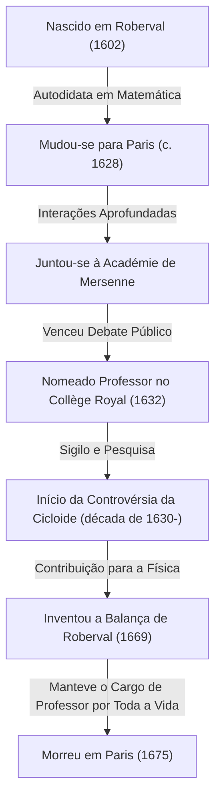
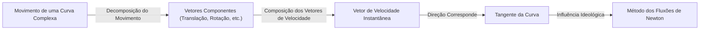
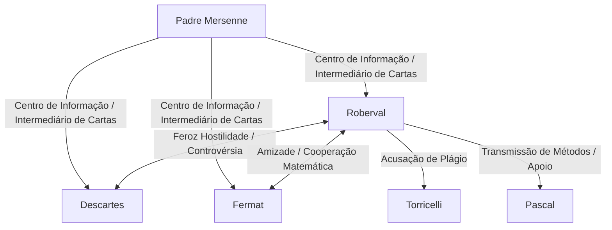

## 1. Introdução: Gigantes às Vésperas do Cálculo e a Matemática do Século XVII

A Europa no século XVII foi uma época de dramática explosão de conhecimento, mais tarde conhecida como a "Revolução Científica". Particularmente no campo da matemática, preparações rápidas estavam em andamento para o nascimento de uma nova matemática que ia além da estrutura da geometria euclidiana herdada da Grécia antiga para lidar com quantidades mutáveis, o infinitesimal e o infinito — a saber, o "cálculo". O monumento histórico da conclusão do cálculo por [Isaac Newton](https://kenji.blog/pt/p/newton/) e Gottfried Wilhelm Leibniz não foi de forma alguma alcançado apenas pela genialidade dos dois. Por trás disso estavam as lutas de muitos matemáticos que lutaram com os conceitos de infinito e limites antes deles.

Um dos matemáticos mais importantes na França nesta "véspera do cálculo" foi [Gilles Personne de Roberval](https://kenji.blog/pt/p/roberval/) (1602–1675). [Roberval](https://kenji.blog/pt/p/roberval/) introduziu na França o "método dos indivisíveis" proposto pelo italiano Bonaventura Cavalieri e, ao refiná-lo independentemente, criou métodos poderosos para calcular a área de figuras delimitadas por curvas e o volume de sólidos de revolução. Ele também demonstrou excelente talento nos campos da física e da mecânica, deixando para trás uma invenção inovadora conhecida como a "balança de [Roberval](https://kenji.blog/pt/p/roberval/)", que ainda hoje pode ser vista em mercados e laboratórios de ciências.

Neste artigo, aprofundar-nos-emos na vida deste matemático solitário que viveu numa época turbulenta, nas suas ferozes controvérsias com os seus contemporâneos e nas profundas conquistas matemáticas e mecânicas que ele deixou para trás, completas com ricas ilustrações e fórmulas matemáticas.

## 2. A Vida de [Roberval](https://kenji.blog/pt/p/roberval/) e o Contexto Histórico

### 2.1. Ascensão do Campesinato e Mudança para Paris

Gilles Personne nasceu em 10 de agosto de 1602, em uma pequena vila chamada [Roberval](https://kenji.blog/pt/p/roberval/) perto de Beauvais no norte da França. Acredita-se que sua família tenha sido de camponeses, o que não era de forma alguma um histórico vantajoso para os estudos na estrita sociedade de classes da época. No entanto, desde tenra idade, ele demonstrou intelecto extraordinário e um forte interesse em matemática. Mais tarde, ele adotou o nome de sua vila natal e começou a se chamar "de [Roberval](https://kenji.blog/pt/p/roberval/)". Isso pode ser visto como uma expressão de seu orgulho de suas origens, bem como uma tentativa de estabelecer sua identidade como um estudioso.

Tendo aprendido matemática e línguas clássicas (latim e grego) como autodidata em uma idade jovem, [Roberval](https://kenji.blog/pt/p/roberval/) almejou patamares acadêmicos mais elevados e mudou-se para a capital, Paris, por volta de 1628. Paris naquela época era um caldeirão de estudos, reunindo intelectuais de toda a Europa. Lá, ele começou a frequentar o encontro de intelectuais centrado em torno do Padre [Marin Mersenne](https://kenji.blog/pt/p/mersenne/), conhecido como a "Académie de [Mersenne](https://kenji.blog/pt/p/mersenne/)". [Mersenne](https://kenji.blog/pt/p/mersenne/), muitas vezes chamado de "o chefe dos correios da erudição europeia", agia como um intermediário para a correspondência entre os estudiosos de toda a Europa, desempenhando um papel no compartilhamento das mais recentes descobertas científicas.

Através do salão de [Mersenne](https://kenji.blog/pt/p/mersenne/), [Roberval](https://kenji.blog/pt/p/roberval/) aprofundou suas interações com as mentes mais brilhantes da França na época, como [René Descartes](https://kenji.blog/pt/p/descartes/), [Pierre de Fermat](https://kenji.blog/pt/p/fermat/), [Blaise Pascal](https://kenji.blog/pt/p/pascal/) e Étienne [Pascal](https://kenji.blog/pt/p/pascal/) (pai de Blaise), permitindo que seus talentos matemáticos florescessem.

### 2.2. A Cátedra do Collège Royal e as Exaustivas Batalhas de Defesa

Em 1632, ocorreu um grande ponto de virada para [Roberval](https://kenji.blog/pt/p/roberval/). Uma vaga se abriu para o cargo de professor de matemática (a cátedra Ramus) estabelecida por Pierre de la Ramée, um famoso lógico e matemático, no Collège de France (então conhecido como Collège Royal) em Paris.

O método de seleção para este cargo professoral era altamente incomum e extenuante. Os candidatos participavam em debates matemáticos em público, e o vencedor obtinha o cargo. Além disso, aterrorizantemente, esta posição não era vitalícia; exigia aceitar desafiantes a cada três anos para se envolver em debates públicos, e a pessoa tinha que continuar vencendo para defendê-la. A derrota significava uma perda imediata do cargo de professor e de seu salário.

[Roberval](https://kenji.blog/pt/p/roberval/) venceu de forma magnífica esta extenuante competição e assumiu a cadeira de professor. Surpreendentemente, ele defendeu com sucesso esta posição sem uma única derrota por mais de 40 anos, até falecer aos 73 anos de idade em 1675.

Uma das razões pelas quais ele relutava em publicar rapidamente suas descobertas matemáticas na forma de artigos ou livros residia precisamente nessas "batalhas de defesa a cada três anos". A fim de derrotar os desafiantes em público, era necessário manter os resultados matemáticos mais recentes e os métodos de resolução poderosos ocultos como "armas secretas". Esse extremo sigilo causou mais tarde sérias disputas de prioridade (debates sobre quem descobriu algo primeiro) com seus contemporâneos.

## 3. Conquistas Matemáticas: Indivisíveis e o Alvorecer da Integração

### 3.1. Introdução e Refinamento do Método dos Indivisíveis

A maior conquista matemática de [Roberval](https://kenji.blog/pt/p/roberval/) foi ser o primeiro a introduzir na França o **método dos indivisíveis**, iniciado pelo matemático italiano Bonaventura Cavalieri, e desenvolvê-lo e refiná-lo independentemente. Este método foi um precursor direto e inovador do cálculo integral moderno.

Os indivisíveis de Cavalieri baseiam-se no conceito de que "uma superfície é uma coleção de infinitos segmentos de linha paralelos (quantidades indivisíveis) e um sólido é uma coleção de infinitos planos paralelos". Em termos modernos, é a ideia fundamental exata da integração definida: cortar uma figura em fatias infinitamente finas e somá-las para encontrar a área ou o volume.

[Roberval](https://kenji.blog/pt/p/roberval/) refinou esse conceito de forma mais matemática. Ao calcular a área de uma determinada curva, ele a representou como a soma de retângulos infinitamente finos constituindo essa curva. O seu método tornou o "método da exaustão" usado pelo antigo grego Arquimedes mais intuitivo e mais fácil de calcular, tornando-se uma ferramenta poderosa para resolver numerosos e difíceis problemas de geometria.

### 3.2. Integração de Potências e Descoberta Paralela com [Fermat](https://kenji.blog/pt/p/fermat/)

Usando o método dos indivisíveis, [Roberval](https://kenji.blog/pt/p/roberval/) conseguiu provar geometricamente o cálculo equivalente da integral definida $ \int_{0}^{a} x^n dx $ para os casos em que $ n $ é um número inteiro positivo. Tratando a área sob uma curva como a soma de uma sequência infinita e utilizando a fórmula da soma das potências dos números naturais, ele derivou a seguinte conclusão:

$$
\int_{0}^{a} x^n dx = \frac{a^{n+1}}{n+1} \quad \left( \text{onde } n \text{ é um número inteiro positivo} \right)
$$

Por exemplo, quando $ n = 2 $, a área sob a parábola $ y = x^2 $ é $ \frac{a^3}{3} $. Este foi o mesmo resultado que [Pierre de Fermat](https://kenji.blog/pt/p/fermat/) havia descoberto de forma independente quase ao mesmo tempo. [Roberval](https://kenji.blog/pt/p/roberval/) e [Fermat](https://kenji.blog/pt/p/fermat/) respeitavam os métodos um do outro e compartilharam esta descoberta através de cartas. Suas realizações tornaram-se um importante trampolim para a posterior formulação da integração por Leibniz.

## 4. Estudo da Cicloide e Ferozes Disputas de Prioridade

### 4.1. A Geometria de Helena: O Charme da Cicloide

Na comunidade matemática do século XVII, havia uma curva que cativava os estudiosos e ao mesmo tempo se tornava a semente de uma feroz controvérsia, chamada a "Geometria de Helena". Essa era a **cicloide**. Uma cicloide é a trajetória descrita por um ponto na circunferência de um círculo enquanto ele rola sem escorregar ao longo de uma linha reta.

Galileo Galilei foi atraído pela beleza dessa curva e a nomeou "cicloide". Usando o parâmetro $ t $ (ângulo de rotação) e o raio $ r $ do círculo gerador, as coordenadas $ (x, y) $ de um ponto na cicloide são expressas da seguinte forma:

$$
\begin{cases}
x = r(t - \sin t) \\
y = r(1 - \cos t)
\end{cases}
$$

Através de experiências físicas de recortar uma placa de metal na forma de uma cicloide e pesá-la, Galileu conjeturou que "a área de um arco da cicloide é exatamente três vezes a área do seu círculo gerador". No entanto, ele não pôde provar isso matematicamente.

### 4.2. A Prova Rigorosa da Área por [Roberval](https://kenji.blog/pt/p/roberval/)

Em 1634, utilizando ao máximo o método dos indivisíveis, [Roberval](https://kenji.blog/pt/p/roberval/) provou matemática e rigorosamente que a conjectura de Galileu estava correta. Ele comparou habilmente a curva da cicloide com a curva criada quando o círculo gerador é transladado, usando um método geométrico brilhante de divisão e reconstrução da área.

Usando o cálculo integral moderno, a área $ A $ delimitada por um arco da cicloide ($ 0 \le t \le 2\pi $) e a base (eixo x) pode ser facilmente calculada da seguinte forma:

$$
\begin{aligned}
A &= \int_{0}^{2\pi r} y \, dx \\
  &= \int_{0}^{2\pi} r(1 - \cos t) \cdot r(1 - \cos t) \, dt \\
  &= r^2 \int_{0}^{2\pi} (1 - 2\cos t + \cos^2 t) \, dt \\
  &= r^2 \left[ t - 2\sin t + \frac{t}{2} + \frac{\sin 2t}{4} \right]_{0}^{2\pi} \\
  &= r^2 \left( 2\pi + \pi \right) = 3\pi r^2
\end{aligned}
$$

[Roberval](https://kenji.blog/pt/p/roberval/) alcançou esta grande descoberta, mas, fiel ao seu estilo, adiou a publicação para defender a sua cátedra, comunicando-a apenas por carta a alguns poucos matemáticos próximos (como [Mersenne](https://kenji.blog/pt/p/mersenne/)).

### 4.3. Controvérsia com Torricelli

Vários anos depois, em 1644, o italiano Evangelista Torricelli (um aluno de Galileu, famoso pelo "vácuo de Torricelli") descobriu independentemente que a área de uma cicloide é três vezes a do seu círculo e publicou o fato em um livro.

Ao saber disso, [Roberval](https://kenji.blog/pt/p/roberval/) ficou furioso. Ele acusou Torricelli, alegando: "Torricelli deu uma olhada nos meus resultados através de cartas de [Mersenne](https://kenji.blog/pt/p/mersenne/) e os publicou como sua própria descoberta." Esta controvérsia sobre o plágio tornou-se extremamente feroz, e a relação entre os dois ficou irreparavelmente danificada. Hoje, acredita-se que a descoberta de Torricelli foi feita de forma independente e não foi um plágio, mas este incidente é lembrado como uma anedota que ilustra o temperamento explosivo de [Roberval](https://kenji.blog/pt/p/roberval/) e as limitações da transmissão de informações na época.

## 5. Construção Cinemática de Tangentes: Outro Caminho para as Derivadas

[Roberval](https://kenji.blog/pt/p/roberval/) concebeu uma abordagem inovadora não apenas no campo da integração, mas também no campo da diferenciação (o problema do traçado de tangentes). Consistia em reexaminar os problemas geométricos como uma "cinemática" física.

Naquela época, encontrar a tangente de uma curva era uma das questões mais importantes da geometria. [René Descartes](https://kenji.blog/pt/p/descartes/) tentava encontrar tangentes usando uma abordagem geométrica algébrica com equações algébricas, mas apresentava a desvantagem de exigir cálculos extremamente pesados.

Em contraste, [Roberval](https://kenji.blog/pt/p/roberval/) pensou da seguinte forma: "Se uma curva é uma trajetória descrita por um ponto em movimento, então a direção na qual esse ponto se move em qualquer instante (o vetor velocidade) é precisamente a tangente à curva."

Ele decompôs o movimento de um ponto gerando uma curva complexa em dois componentes de movimento simples. Em seguida, ao encontrar os vetores de velocidade em cada componente de movimento e combiná-los geometricamente (soma de vetores), ele determinou a tangente como a direção do vetor de velocidade resultante.

Esse "método da tangente cinemática" demonstrou enorme poder em encontrar tangentes para curvas transcendentais (curvas que não podem ser expressas por equações algébricas) como a cicloide. A abordagem de [Roberval](https://kenji.blog/pt/p/roberval/) de trazer esse conceito físico de movimento para a matemática foi um passo extremamente importante que levou diretamente à ideologia fundamental do "Método dos [Flux](https://kenji.blog/pt/p/state-management-history-redux-context-recoil-zustand/)ões" (cálculo cinemático) fundado mais tarde por [Isaac Newton](https://kenji.blog/pt/p/newton/).

## 6. Contribuições para a Mecânica: A Balança de [Roberval](https://kenji.blog/pt/p/roberval/)

Enquanto [Roberval](https://kenji.blog/pt/p/roberval/) explorava o infinito abstrato e o movimento na matemática, ele também possuía um talento notável na física do mundo real, mecânica e até mesmo no projeto de engenharia de máquinas. O exemplo mais proeminente, amplamente conhecido hoje sob o seu nome, é a **"Balanza de [Roberval](https://kenji.blog/pt/p/roberval/)"**.

### 6.1. Falhas das Balanças Convencionais

As balanças usadas desde a antiguidade tinham um mecanismo de "est Romana" onde uma haste era apoiada em um fulcro central com pratos pendurados em ambas as extremidades. Neste método, a distância do fulcro aos pratos (braço de alavanca) tinha que ser estritamente constante para uma pesagem precisa. Além disso, tinha uma falha fatal: se a posição em que os pesos ou objetos eram colocados no prato desviasse do centro, o momento mudaria devido ao princípio da alavanca, tornando impossível a medição precisa.

### 6.2. Adoção do Mecanismo de Articulação Paralelogramo

Em 1669, [Roberval](https://kenji.blog/pt/p/roberval/) apresentou um mecanismo revolucionário à Academia Real das Ciências da França que resolveu completamente este problema. Ele adotou um "mecanismo de articulação paralelogramo" (uma estrutura semelhante a um pantógrafo) que conectava duas barras paralelas superiores e inferiores com barras verticais esquerdas e direitas usando pinos.

Com essa estrutura, os pratos esquerdo e direito sobem e descem em translação paralela, mantendo constantemente a horizontalidade sem inclinar. O fato de os pratos se moverem horizontalmente significa, de acordo com o Princípio dos Trabalhos Virtuais, que não importa onde o peso seja colocado no prato, a distância que o peso sobe e desce (quantidade de trabalho) não muda.

Como resultado, foi criada uma balança com características práticas extremamente excelentes: "Não importa onde o peso é colocado no prato, o resultado da pesagem não muda em nada." Este princípio inovador continua a ser usado como está hoje, como a base para balanças usadas nos correios para pesar cartas, balanças de pratos de carga superior usadas em mercados para pesar ingredientes e até as balanças encontradas nos laboratórios de ciências das escolas. O fato de que um mecanismo mecânico idealizado há mais de 350 anos ainda seja usado hoje sem mudar seu princípio básico diz muito sobre o tremendo senso de engenharia de [Roberval](https://kenji.blog/pt/p/roberval/).

## 7. Interações com Contemporâneos e uma Vida de Controvérsias

Paralelamente ao seu notável talento, diz-se que [Roberval](https://kenji.blog/pt/p/roberval/) tinha um temperamento muito impetuoso e uma personalidade teimosa que se recusava a ceder em suas teorias. Consequentemente, ele se envolveu em controvérsias ferozes com muitos estudiosos famosos de sua época.

- **Conflito com [René Descartes](https://kenji.blog/pt/p/descartes/)**:
  Enquanto [Descartes](https://kenji.blog/pt/p/descartes/) promovia a "geometria analítica", que resolvia a geometria usando a álgebra, [Roberval](https://kenji.blog/pt/p/roberval/) valorizava métodos puramente geométricos e cinemáticos. [Roberval](https://kenji.blog/pt/p/roberval/) criticava o método de [Descartes](https://kenji.blog/pt/p/descartes/) como muito artificial e muitas vezes atacava as falhas nas teorias de [Descartes](https://kenji.blog/pt/p/descartes/). [Descartes](https://kenji.blog/pt/p/descartes/), por sua vez, menosprezava [Roberval](https://kenji.blog/pt/p/roberval/) chamando-o de "grosseiro e sem instrução", e sua relação permaneceu hostil ao longo de suas vidas.
- **Amizade com [Pierre de Fermat](https://kenji.blog/pt/p/fermat/)**:
  Em contraste com [Descartes](https://kenji.blog/pt/p/descartes/), [Roberval](https://kenji.blog/pt/p/roberval/) construiu uma relação muito boa com [Fermat](https://kenji.blog/pt/p/fermat/), que vivia em Toulouse. Embora tivessem personalidades opostas, eles compartilharam ideias matemáticas por meio de cartas intermediadas por [Mersenne](https://kenji.blog/pt/p/mersenne/), complementando a pesquisa um do outro em questões como os indivisíveis.
- **Influência sobre [Blaise Pascal](https://kenji.blog/pt/p/pascal/)**:
  O jovem gênio [Pascal](https://kenji.blog/pt/p/pascal/) também foi muito influenciado por [Roberval](https://kenji.blog/pt/p/roberval/). [Pascal](https://kenji.blog/pt/p/pascal/) publicou mais tarde trabalhos sobre a cicloide sob o pseudônimo "A. Dettonville", e muitos dos métodos usados neles eram versões refinadas das ideias de [Roberval](https://kenji.blog/pt/p/roberval/) sobre os indivisíveis. [Roberval](https://kenji.blog/pt/p/roberval/) valorizava muito o talento de [Pascal](https://kenji.blog/pt/p/pascal/) e o apoiava.

## 8. Conclusão: O Gênio Solitário Que Construiu a Ponte para o Cálculo

[Gilles Personne de Roberval](https://kenji.blog/pt/p/roberval/), na época logo antes do nascimento formal do cálculo, utilizou totalmente duas armas poderosas — o método dos indivisíveis e a abordagem cinemática — para resolver de maneira sequencial os problemas matemáticos da mais alta dificuldade de sua época.

Como resultado do atraso excessivo na publicação de suas descobertas devido à pressão de defender a sua cátedra a cada três anos, algumas das suas realizações não foram justamente avaliadas pelos seus contemporâneos, e ele foi por vezes arrastado para disputas indesejáveis de prioridades. No entanto, as sementes de ideias matemáticas que ele semeou certamente se espalharam pela rede de [Mersenne](https://kenji.blog/pt/p/mersenne/) e por conhecidos como [Fermat](https://kenji.blog/pt/p/fermat/) e [Pascal](https://kenji.blog/pt/p/pascal/), tornando-se uma ponte sólida que levaria à fundação do cálculo por Newton e Leibniz mais tarde.

Além disso, como se vê na invenção da "balança de [Roberval](https://kenji.blog/pt/p/roberval/)" na mecânica, em vez de apenas a matemática abstrata, o seu pensamento teórico esteve sempre profundamente conectado com o mundo físico real. [Roberval](https://kenji.blog/pt/p/roberval/), que esteve ativo na fronteira entre a matemática e a física, está verdadeiramente gravado na história da matemática para sempre como um "ator fundamental nos bastidores" que apoiou e impulsionou fundamentalmente a Revolução Científica do século XVII.
