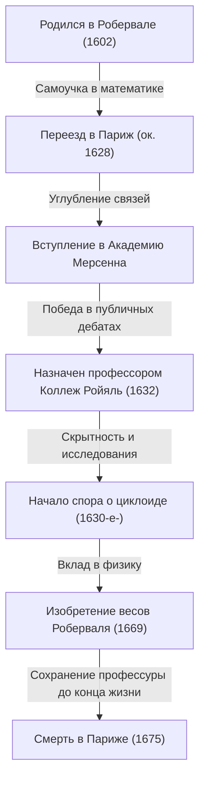
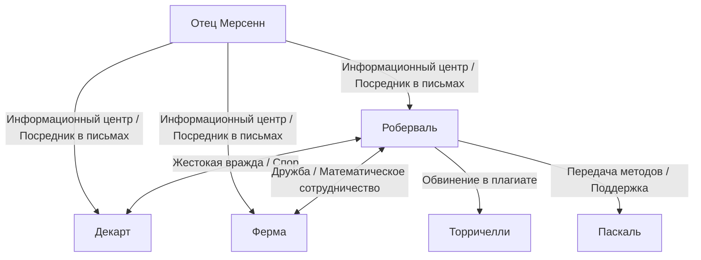

## 1. Введение: Гиганты в преддверии математического анализа и математика 17-го века

Европа в 17 веке была временем драматического взрыва знаний, позже названного «Научной революцией». В частности, в области математики шла быстрая подготовка к рождению новой математики, которая выходила бы за рамки евклидовой геометрии, унаследованной от Древней Греции, для работы с изменяющимися величинами, бесконечно малым и бесконечным — а именно, «математического анализа». Исторический памятник завершения математического анализа Исааком Ньютоном и Готфридом Вильгельмом Лейбницем отнюдь не был достигнут только гением их двоих. За этим стояла борьба многих математиков, которые боролись с концепциями бесконечности и пределов до них.

Одним из важнейших математиков во Франции в этот «канун анализа» был Жиль Персонн де Роберваль (1602–1675). Роберваль представил во Франции «метод неделимых», предложенный итальянцем Бонавентурой Кавальери, и, самостоятельно доработав его, создал мощные методы для вычисления площади фигур, ограниченных кривыми, и объема тел вращения. Он также продемонстрировал выдающийся талант в области физики и механики, оставив после себя новаторское изобретение, известное как «весы Роберваля», которое и сегодня можно увидеть на рынках и в научных лабораториях.

В этой статье мы глубоко погрузимся в жизнь этого одинокого математика, жившего в бурную эпоху, в его ожесточенные споры с современниками и в глубокие математические и механические достижения, которые он оставил после себя, сопровождая их богатыми иллюстрациями и математическими формулами.

## 2. Жизнь Роберваля и исторический фон

### 2.1. Выход из крестьянства и переезд в Париж

Жиль Персонн родился 10 августа 1602 года в небольшой деревне под названием Роберваль недалеко от Бове на севере Франции. Считается, что его семья была крестьянской, что отнюдь не было выгодным происхождением для получения образования в строгом классовом обществе того времени. Однако с ранних лет он демонстрировал необычайный интеллект и сильный интерес к математике. Позже он взял имя своей родной деревни и стал называть себя «де Роберваль». Это можно рассматривать как выражение его гордости за свое происхождение, а также попытку утвердить свою личность как ученого.

Самостоятельно изучив математику и классические языки (латынь и греческий) в юном возрасте, Роберваль устремился к более высоким академическим вершинам и переехал в столицу, Париж, около 1628 года. Париж в то время был плавильным котлом науки, собиравшим интеллектуалов со всей Европы. Там он начал посещать собрания интеллектуалов, центром которых был отец Марен Мерсенн, известные как «Академия Мерсенна». Мерсенн, которого часто называют «почтмейстером европейской науки», выступал посредником в переписке ученых по всей Европе, играя роль в обмене последними научными открытиями.

Благодаря салону Мерсенна Роберваль углубил свое общение с ведущими умами Франции того времени, такими как Рене Декарт, Пьер де Ферма, Блез Паскаль и Этьен Паскаль (отец Блеза), что позволило его математическим талантам расцвести.

### 2.2. Профессура в Коллеж Ройяль и изнурительные битвы за защиту

В 1632 году для Роберваля наступил важный поворотный момент. Открылась вакансия на должность профессора математики (кафедра Рамуса), учрежденную Пьером де ла Раме, известным логиком и математиком, в Коллеж де Франс (тогда известном как Коллеж Ройяль) в Париже.

Метод отбора на эту должность профессора был крайне необычным и изнурительным. Кандидаты участвовали в публичных математических дебатах, и победитель получал должность. Более того, как это ни пугает, эта должность не была пожизненной; она требовала принимать претендентов каждые три года для участия в публичных дебатах, и чтобы сохранить ее, нужно было продолжать побеждать. Поражение означало немедленную потерю должности профессора и жалования.

Роберваль с блеском выиграл это изнурительное соревнование и занял кресло профессора. Удивительно, но он успешно защищал эту должность без единого поражения более 40 лет, вплоть до своей кончины в возрасте 73 лет в 1675 году.

Одна из причин, по которой он неохотно спешил публиковать свои математические открытия в виде статей или книг, заключалась именно в этих «битвах за защиту каждые три года». Чтобы победить претендентов на публике, необходимо было держать новейшие математические результаты и мощные методы решения скрытыми в качестве «секретного оружия». Эта крайняя скрытность позже привела к серьезным спорам о приоритете (дебатам о том, кто что открыл первым) с его современниками.

## 3. Математические достижения: Неделимые и заря интегрирования

### 3.1. Введение и усовершенствование метода неделимых

Величайшим математическим достижением Роберваля стало то, что он первым ввел во Франции **метод неделимых**, инициированный итальянским математиком Бонавентурой Кавальери, и самостоятельно развил и усовершенствовал его. Этот метод стал прямым, новаторским предшественником современного интегрального исчисления.

Неделимые Кавальери — это концепция, согласно которой «поверхность представляет собой совокупность бесконечного числа параллельных отрезков (неделимых величин), а твердое тело — совокупность бесконечного числа параллельных плоскостей». В современных терминах это точная фундаментальная идея определенного интегрирования: разрезание фигуры на бесконечно тонкие слои и их суммирование для нахождения площади или объема.

Роберваль усовершенствовал эту концепцию более математически. При вычислении площади определенной кривой он представлял ее как сумму бесконечно тонких прямоугольников, образующих эту кривую. Его метод сделал «метод исчерпывания», использовавшийся древним греком Архимедом, более интуитивным и простым в вычислениях, став мощным инструментом для решения многочисленных сложных геометрических задач.

### 3.2. Интегрирование степеней и параллельное открытие с Ферма

Используя метод неделимых, Роберваль преуспел в геометрическом доказательстве эквивалентного вычисления определенного интеграла $ \int_{0}^{a} x^n dx $ для случаев, когда $ n $ является целым положительным числом. Рассматривая площадь под кривой как сумму бесконечной последовательности и используя формулу суммы степеней натуральных чисел, он вывел следующее заключение:

$$
\int_{0}^{a} x^n dx = \frac{a^{n+1}}{n+1} \quad \left( \text{где } n \text{ - целое положительное число} \right)
$$

Например, когда $ n = 2 $, площадь под параболой $ y = x^2 $ равна $ \frac{a^3}{3} $. Этот же результат независимо открыл Пьер де Ферма примерно в то же время. Роберваль и Ферма взаимно уважали методы друг друга и поделились этим открытием через письма. Их достижения стали важным трамплином к последующей формулировке интегрирования Лейбницем.

## 4. Изучение циклоиды и ожесточенные споры о приоритете

### 4.1. Геометрия Елены: Очарование циклоиды

В математическом сообществе 17-го века существовала кривая, которая очаровывала ученых и одновременно становилась семенем ожесточенных споров, названная «Геометрией Елены». Это была **циклоида**. Циклоида — это траектория, описываемая точкой на окружности круга, когда он катится без скольжения по прямой линии.

Галилео Галилея привлекла красота этой кривой, и он назвал ее «циклоидой». Используя параметр $ t $ (угол поворота) и радиус $ r $ порождающего круга, координаты $ (x, y) $ точки на циклоиде выражаются следующим образом:

$$
\begin{cases}
x = r(t - \sin t) \\
y = r(1 - \cos t)
\end{cases}
$$

Посредством физических экспериментов по вырезанию металлической пластины в форме циклоиды и ее взвешиванию Галилей предположил, что «площадь арки циклоиды ровно в три раза превышает площадь порождающего ее круга». Однако он не смог доказать это математически.

### 4.2. Строгое доказательство площади Робервалем

В 1634 году, в полной мере используя метод неделимых, Роберваль математически и строго доказал, что гипотеза Галилея была верна. Он ловко сравнил кривую циклоиды с кривой, созданной при переносе порождающего круга, используя блестящий геометрический метод деления и реконструкции площади.

Используя современное интегральное исчисление, площадь $ A $, ограниченную одной аркой циклоиды ($ 0 \le t \le 2\pi $) и основанием (ось x), можно легко вычислить следующим образом:

$$
\begin{aligned}
A &= \int_{0}^{2\pi r} y \, dx \\
  &= \int_{0}^{2\pi} r(1 - \cos t) \cdot r(1 - \cos t) \, dt \\
  &= r^2 \int_{0}^{2\pi} (1 - 2\cos t + \cos^2 t) \, dt \\
  &= r^2 \left[ t - 2\sin t + \frac{t}{2} + \frac{\sin 2t}{4} \right]_{0}^{2\pi} \\
  &= r^2 \left( 2\pi + \pi \right) = 3\pi r^2
\end{aligned}
$$

Роберваль совершил это великое открытие, но, как всегда, задержал публикацию, чтобы защитить свою профессуру, сообщив о нем только в письмах нескольким близким математикам (таким как Мерсенн).

### 4.3. Спор с Торричелли

Спустя несколько лет, в 1644 году, итальянец Эванджелиста Торричелли (ученик Галилея, известный по «торричеллиевой пустоте») независимо обнаружил, что площадь циклоиды в три раза больше площади ее круга, и опубликовал это в книге.

Узнав об этом, Роберваль пришел в ярость. Он обвинил Торричелли, заявив: «Торричелли подсмотрел мои результаты в письмах Мерсенна и опубликовал их как свое собственное открытие». Этот спор о плагиате стал крайне ожесточенным, и отношения между ними были безвозвратно испорчены. Сегодня считается, что открытие Торричелли было сделано независимо и не было плагиатом, но этот инцидент помнят как анекдот, иллюстрирующий вспыльчивый темперамент Роберваля и ограничения передачи информации в то время.

## 5. Кинематическое построение касательных: Еще один путь к производным

Роберваль разработал новаторский подход не только в области интегрирования, но и в области дифференцирования (проблема проведения касательных). Он состоял в том, чтобы пересмотреть геометрические проблемы как физическую «кинематику».

В то время нахождение касательной к кривой было одной из важнейших проблем геометрии. Рене Декарт пытался найти касательные, используя алгебро-геометрический подход с алгебраическими уравнениями, но он имел недостаток в виде чрезвычайно громоздких вычислений.

Напротив, Роберваль рассуждал следующим образом: «Если кривая — это траектория, описываемая движущейся точкой, то направление, в котором эта точка движется в любой заданный момент (вектор скорости), и есть в точности касательная к кривой».

Он разложил движение точки, генерирующей сложную кривую, на два простых компонента движения. Затем, найдя векторы скорости в каждом компоненте движения и геометрически сложив их (векторная сумма), он определил касательную как направление результирующего вектора скорости.

Этот «кинематический метод касательных» продемонстрировал огромную мощь при нахождении касательных для трансцендентных кривых (кривых, которые нельзя выразить алгебраическими уравнениями), таких как циклоида. Подход Роберваля по привнесению этой физической концепции движения в математику стал чрезвычайно важным шагом, который прямо привел к фундаментальной идеологии «Метода флюксий» (кинематического исчисления), основанного позже Исааком Ньютоном.

## 6. Вклад в механику: Весы Роберваля

Хотя Роберваль исследовал абстрактную бесконечность и движение в математике, он также обладал выдающимся талантом в области физики реального мира, механики и даже инженерного проектирования машин. Самый яркий пример, широко известный сегодня под его именем, — это **«Весы Роберваля»**.

### 6.1. Недостатки обычных весов

Весы, использовавшиеся с древних времен, имели механизм «безмена», где коромысло опиралось на центральную точку опоры, а чаши свисали с обоих концов. В этом методе расстояние от точки опоры до чаш (плечо момента) должно было быть строго постоянным для точного взвешивания. Кроме того, у него был фатальный недостаток: если положение, куда помещались гири или предметы на чаше, отклонялось от центра, момент изменялся из-за принципа рычага, что делало точное измерение невозможным.

### 6.2. Использование механизма параллелограммной связи

В 1669 году Роберваль представил Французской королевской академии наук новаторский механизм, который полностью решил эту проблему. Он применил «механизм параллелограммной связи» (конструкция, похожая на пантограф), который соединял два верхних и нижних параллельных стержня с левыми и правыми вертикальными стержнями с помощью штифтов.

При такой конструкции левая и правая чаши перемещаются вверх и вниз в параллельном переносе, постоянно сохраняя горизонтальность и не наклоняясь. Тот факт, что чаши перемещаются горизонтально, означает, исходя из принципа возможных перемещений, что независимо от того, куда на чашу помещен груз, расстояние, на которое груз перемещается вверх и вниз (величина работы), не изменяется.

В результате были созданы весы с исключительно превосходными практическими характеристиками: «Независимо от того, куда на чашу положен груз, результат взвешивания совершенно не меняется». Этот новаторский принцип продолжает использоваться в первозданном виде и сегодня как основа для весов, используемых в почтовых отделениях для взвешивания писем, весов с верхней чашей, используемых на рынках для взвешивания ингредиентов, и даже весов, встречающихся в школьных научных лабораториях. Тот факт, что механический механизм, изобретенный более 350 лет назад, до сих пор используется без изменения его основного принципа, красноречиво свидетельствует об огромном инженерном чутье Роберваля.

## 7. Взаимодействие с современниками и жизнь, полная споров

Наряду со своим выдающимся талантом, Роберваль, как говорят, обладал очень вспыльчивым темпераментом и упрямым характером, отказываясь уступать в своих теориях. Следовательно, он вступал в ожесточенные споры со многими известными учеными своего времени.

- **Конфликт с Рене Декартом**:
  В то время как Декарт продвигал «аналитическую геометрию», решавшую геометрию с помощью алгебры, Роберваль ценил чисто геометрические и кинематические методы. Роберваль критиковал метод Декарта как слишком искусственный и часто нападал на недостатки в теориях Декарта. Декарт, в свою очередь, смотрел на Роберваля свысока как на «грубого и необразованного», и их отношения оставались враждебными на протяжении всей жизни.
- **Дружба с Пьером де Ферма**:
  В отличие от Декарта, Роберваль построил очень хорошие отношения с Ферма, жившим в Тулузе. Хотя у них были противоположные характеры, они делились математическими идеями через письма при посредничестве Мерсенна, дополняя исследования друг друга по таким вопросам, как неделимые.
- **Влияние на Блеза Паскаля**:
  Молодой гений Паскаль также находился под сильным влиянием Роберваля. Позже Паскаль опубликовал статьи о циклоиде под псевдонимом «А. Деттонвиль», и многие из использованных там методов были усовершенствованными версиями идей Роберваля о неделимых. Роберваль высоко ценил талант Паскаля и поддерживал его.

## 8. Заключение: Одинокий гений, проложивший мост к математическому анализу

Жиль Персонн де Роберваль в эпоху непосредственно перед формальным зарождением математического анализа в полной мере использовал два мощных оружия — метод неделимых и кинематический подход — для последовательного решения математических задач наивысшей сложности своего времени.

Из-за того, что он слишком долго откладывал публикацию своих открытий из-за давления необходимости защищать свою профессуру каждые три года, некоторые из его достижений не были справедливо оценены современниками, и иногда он втягивался в нежелательные споры о приоритете. Тем не менее, семена математических идей, которые он посеял, несомненно распространились через сеть Мерсенна и знакомых, таких как Ферма и Паскаль, став прочным мостом, ведущим к основанию математического анализа Ньютоном и Лейбницем позже.

Более того, как видно на примере его изобретения «весов Роберваля» в механике, а не только абстрактной математики, его теоретическое мышление всегда было глубоко связано с реальным физическим миром. Роберваль, который был активен в пограничной области между математикой и физикой, поистине навсегда вписан в историю математики как «ключевая фигура за кулисами», фундаментально поддержавшая и двигавшая Научную революцию 17-го века.
