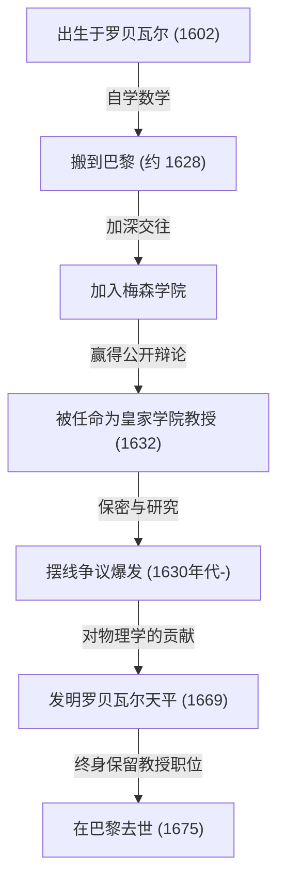
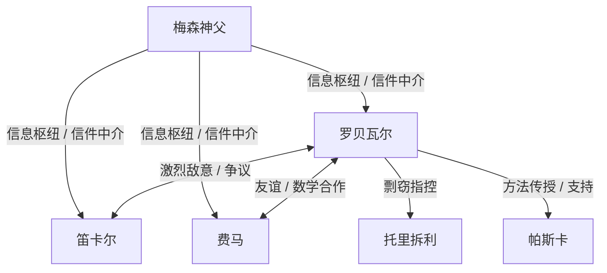

## 1. 引言：微积分前夕的巨人与17世纪数学

17世纪的欧洲是一个知识发生戏剧性爆炸的时代，后来被称为“科学革命”。特别是在数学领域，正在为一门新数学的诞生进行快速的准备。这门新数学超越了从古希腊继承的[欧几里得](https://kenji.blog/zh-cn/p/euclid/)几何的框架，旨在处理变化的量、无穷小和无穷大——即“微积分”。[艾萨克·牛顿](https://kenji.blog/zh-cn/p/newton/)和戈特弗里德·威廉·莱布尼茨完成微积分这一历史丰碑，绝非仅仅依靠他们两人的天才。其背后隐藏着许多在他们之前与无穷和极限概念搏斗的数学家们的奋斗。

在这个“微积分前夕”的法国，最重要的数学家之一就是[吉尔·佩尔索纳·德·罗贝瓦尔](https://kenji.blog/zh-cn/p/roberval/)（[Gilles Personne de Roberval](https://kenji.blog/zh-cn/p/roberval/)，1602–1675）。罗贝瓦尔将意大利人卡瓦列里提出的“不可分量法”引入法国，并通过独立改进它，创造了计算由曲线围成的图形面积和旋转体体积的强大方法。他还在物理和力学领域展现了杰出的才华，留下了一项被称为“罗贝瓦尔天平”的突破性发明，这种天平至今仍可在市场和科学实验室中见到。

在本文中，我们将深入探讨这位生活在动荡时代的孤独数学家的生平，他与同时代人的激烈争论，以及他留下的深远数学和力学成就，并配以丰富的图解和数学公式。

## 2. 罗贝瓦尔的生平与时代背景

### 2.1. 农家出身与进军巴黎

吉尔·佩尔索纳于1602年8月10日出生在法国北部博韦附近一个叫罗贝瓦尔（[Roberval](https://kenji.blog/zh-cn/p/roberval/)）的小村庄。人们认为他的家族是农民，在当时森严的阶级社会中，这绝非是有利于做学问的出身。然而，他从小就展现出了非凡的智慧和对数学的浓厚兴趣。后来，他用家乡的村名，开始自称为“德·罗贝瓦尔”。这既可以看作是他对自己出身感到自豪的表达，也是确立其学者身份的一种尝试。

在年轻时自学了数学和古典语言（拉丁语和希腊语）后，罗贝瓦尔渴望达到更高的学术境界，并于1628年左右搬到了首都巴黎。当时的巴黎是学术的大熔炉，聚集了来自全欧洲的知识分子。在那里，他开始频繁参加以[马兰·梅森](https://kenji.blog/zh-cn/p/mersenne/)神父为中心的知识分子聚会，即著名的“梅森学院”。梅森常被称为“欧洲学术界的邮政局长”，他充当了全欧洲学者通信的中间人，在分享最新科学发现方面发挥了作用。

通过梅森的沙龙，罗贝瓦尔加深了与当时法国顶尖头脑的交往，如[勒内·笛卡尔](https://kenji.blog/zh-cn/p/descartes/)、皮埃尔·德·费马、[布莱兹·帕斯卡](https://kenji.blog/zh-cn/p/pascal/)和埃蒂安·帕斯卡（布莱兹的父亲），这使得他的数学才华得以绽放。

### 2.2. 皇家学院的教授职位与残酷的卫冕战

1632年，罗贝瓦尔迎来了一个重要的转折点。巴黎的法兰西公学院（当时称为皇家学院）有一个数学教授职位（拉米讲席）空缺，该职位由著名的逻辑学家和数学家皮埃尔·德·拉米创立。

这个教授职位的选拔方法非常不寻常且残酷。候选人在公开场合进行数学辩论，获胜者获得该职位。更可怕的是，这个职位不是终身的；它要求每三年接受挑战者参与公开辩论，并且必须不断获胜才能保住它。一旦失败，意味着立即失去教授职位及其薪水。

罗贝瓦尔漂亮地赢得了这场残酷的竞争，并坐上了教授的席位。令人惊讶的是，他成功地保住了这个职位，在40多年的时间里没有失败过一次，直到1675年他以73岁高龄去世。

他不愿以论文或书籍的形式迅速发表他的数学发现，其原因之一正是这些“每三年的卫冕战”。为了在公开场合击败挑战者，必须将最新的数学成果和强大的解法作为“秘密武器”隐藏起来。这种极端的保密性后来导致了他与同时代人的严重优先权争议（争论谁先发现了某事）。

## 3. 数学成就：不可分量与积分的黎明

### 3.1. 引入与改进不可分量法

罗贝瓦尔最大的数学成就是成为第一个将意大利数学家博纳文图拉·卡瓦列里首创的 **不可分量法** 引入法国，并独立发展和改进了它。这种方法是现代积分学的直接、突破性的先驱。

卡瓦列里的不可分量是指“面是无限条平行线段（不可分的量）的集合，体是无限个平行平面的集合”这一概念。用现代的话来说，这正是定积分的确切基本思想：将图形切成无限薄的切片并把它们加起来以求得面积或体积。

罗贝瓦尔在数学上进一步改进了这个概念。在计算特定曲线的面积时，他将其表示为构成该曲线的无限薄矩形之和。他的方法使古希腊阿基米德使用的“穷竭法”变得更加直观、更容易计算，成为解决众多困难几何问题的有力工具。

### 3.2. 幂的积分与费马的平行发现

利用不可分量法，罗贝瓦尔成功地几何证明了定积分 $ \int_{0}^{a} x^n dx $ 在 $ n $ 为正整数时的等价计算。通过将曲线下的面积视为无穷数列之和，并利用自然数幂和的公式，他得出了以下结论：

$$
\int_{0}^{a} x^n dx = \frac{a^{n+1}}{n+1} \quad \left( \text{其中 } n \text{ 为正整数} \right)
$$

例如，当 $ n = 2 $ 时，抛物线 $ y = x^2 $ 下的面积为 $ \frac{a^3}{3} $。这与[皮埃尔·德·费马](https://kenji.blog/zh-cn/p/fermat/)大约在同一时间独立发现的结果相同。罗贝瓦尔和费马互相尊重对方的方法，并通过信件分享了这一发现。他们的成就成为了后来莱布尼茨公式化积分法的重要垫脚石。

## 4. 摆线的研究与激烈的优先权争议

### 4.1. 海伦的几何学：摆线的魅力

在17世纪的数学界，有一条曲线让学者们着迷，同时也成为激烈争论的种子，被称为“海伦的几何学”。那就是 **摆线** (Cycloid)。摆线是一个圆沿一直线滚动且无滑动时，圆周上的一点所画出的轨迹。

伽利略·伽利莱被这条曲线的美丽所吸引，并将其命名为“摆线”。利用参数 $ t $（旋转角）和生成圆的半径 $ r $，摆线上一点的坐标 $ (x, y) $ 可表示如下：

$$
\begin{cases}
x = r(t - \sin t) \\
y = r(1 - \cos t)
\end{cases}
$$

通过切出摆线形状的金属板并称重这种物理实验，伽利略猜想“摆线一拱的面积正好是其生成圆面积的三倍”。然而，他无法在数学上证明这一点。

### 4.2. 罗贝瓦尔严格的面积证明

1634年，罗贝瓦尔充分利用不可分量法，数学上严格地证明了伽利略的猜想是正确的。他巧妙地比较了摆线曲线和生成圆平移时产生的曲线，使用了一种绝妙的分割和重建面积的几何方法。

利用现代积分学，由摆线一拱（$ 0 \le t \le 2\pi $）和底边（x轴）围成的面积 $ A $ 可以很容易地计算如下：

$$
\begin{aligned}
A &= \int_{0}^{2\pi r} y \, dx \\
  &= \int_{0}^{2\pi} r(1 - \cos t) \cdot r(1 - \cos t) \, dt \\
  &= r^2 \int_{0}^{2\pi} (1 - 2\cos t + \cos^2 t) \, dt \\
  &= r^2 \left[ t - 2\sin t + \frac{t}{2} + \frac{\sin 2t}{4} \right]_{0}^{2\pi} \\
  &= r^2 \left( 2\pi + \pi \right) = 3\pi r^2
\end{aligned}
$$

罗贝瓦尔取得了这一伟大发现，但一如既往，为了保住教授职位，他推迟了发表，只通过信件传达给了少数亲密的数学家（如梅森）。

### 4.3. 与托里拆利的争议

几年后，在1644年，意大利人埃万杰利斯塔·托里拆利（伽利略的学生，以“托里拆利真空”闻名）独立发现了摆线的面积是其圆面积的三倍，并将其发表在书中。

得知此事后，罗贝瓦尔大发雷霆。他指责托里拆利说：“托里拆利通过梅森的信件偷看了我的结果，并作为他自己的发现发表了。” 这场关于剽窃的争论变得极其激烈，两人的关系受到了不可挽回的破坏。今天，人们相信托里拆利的发现是独立做出的，并非剽窃，但这一事件作为轶事被人们记住，它说明了罗贝瓦尔火爆的脾气以及当时信息传播的局限性。

## 5. 运动学切线作图法：通向导数的另一条道路

罗贝瓦尔不仅在积分领域设计了一种突破性的方法，在微分领域（画切线的问题）也同样如此。那就是将几何问题重新视为物理上的“运动学”。

当时，求曲线的切线是几何学中最重要的问题之一。[勒内·笛卡尔](https://kenji.blog/zh-cn/p/descartes/)正试图用代数方程的代数几何方法来寻找切线，但它有计算极其繁琐的缺点。

相比之下，罗贝瓦尔是这样想的：“如果曲线是运动的点画出的轨迹，那么该点在任何给定瞬间的运动方向（速度向量）正是曲线的切线。”

他将生成复杂曲线的点的运动分解为两个简单的运动分量。然后，通过找到每个运动分量中的速度向量，并将其几何组合（向量和），他将合成速度向量的方向确定为切线。

这种“运动学切线法”在寻找像摆线这样的超越曲线（不能用代数方程表示的曲线）的切线时，展示了巨大的威力。罗贝瓦尔将这种运动的物理概念引入数学的方法，是极其重要的一步，它直接导向了后来由[艾萨克·牛顿](https://kenji.blog/zh-cn/p/newton/)创立的“流数法”（运动学微积分）的基本思想。

## 6. 对力学的贡献：罗贝瓦尔天平

虽然罗贝瓦尔在数学中探索了抽象的无限和运动，但他还在现实世界的物理学、力学甚至机器的工程设计中展现了杰出的才华。当今以他的名字广为人知的最突出的例子就是 **“罗贝瓦尔天平”**。

### 6.1. 传统秤的缺陷

自古以来使用的秤都有一种“杆秤”机制，即将横梁支撑在中央支点上，两端挂着秤盘。在这种方法中，从支点到秤盘的距离（力臂）必须严格恒定，才能进行精确称量。此外，它还有一个致命的缺陷：如果把重物或物体放在秤盘上的位置偏离了中心，力矩就会由于杠杆原理而改变，从而无法进行精确测量。

### 6.2. 采用平行四边形连杆机构

1669年，罗贝瓦尔向法国皇家科学院展示了一种突破性的机制，完全解决了这个问题。他采用了一种“平行四边形连杆机构”（一种类似于受电弓的结构），该机构使用销子将上下两根平行杆与左右垂直杆连接起来。

有了这种结构，左右秤盘在平移中上下移动，同时始终保持水平而不会倾斜。秤盘水平移动这一事实意味着，根据虚功原理，无论把重物放在秤盘的哪个位置，重物上下移动的距离（做功量）都不会改变。

结果，实现了一种具有极佳实用特性的天平：“无论将重物放在秤盘的哪个位置，称量结果都完全不变。” 这种创新的原理直到今天仍在原封不动地使用，作为邮局称信件的天平、市场上称食材的托盘天平、甚至是学校科学实验室中天平的基础。一个在350多年前设计出来的机械机构，在没有改变其基本原理的情况下至今仍在使用，这一事实充分说明了罗贝瓦尔巨大的工程学直觉。

## 7. 与同时代人的交往和充满争议的一生

除了他杰出的才华之外，据说罗贝瓦尔性情十分火爆，性格固执，拒绝在自己的理论上让步。因此，他与他那个时代的许多著名学者陷入了激烈的争论。

- **与[勒内·笛卡尔](https://kenji.blog/zh-cn/p/descartes/)的冲突**：
  当笛卡尔推广使用代数解决几何问题的“解析几何”时，罗贝瓦尔则看重纯几何和运动学的方法。罗贝瓦尔批评笛卡尔的方法过于造作，并经常攻击笛卡尔理论中的缺陷。而笛卡尔反过来又轻视罗贝瓦尔，称其“粗鄙无教养”，他们两人的关系终生敌对。
- **与[皮埃尔·德·费马](https://kenji.blog/zh-cn/p/fermat/)的友谊**：
  与笛卡尔相反，罗贝瓦尔与住在图卢兹的费马建立了非常好的关系。尽管两人性格迥异，但他们通过梅森作为中间人的信件分享了数学思想，在诸如不可分量等问题上互补了彼此的研究。
- **对[布莱兹·帕斯卡](https://kenji.blog/zh-cn/p/pascal/)的影响**：
  年轻的天才帕斯卡也深受罗贝瓦尔的影响。帕斯卡后来以“A. Dettonville”为笔名发表了关于摆线的论文，其中使用的许多方法都是罗贝瓦尔关于不可分量思想的改良版。罗贝瓦尔非常赏识帕斯卡的才华，并支持他。

## 8. 结论：架起通往微积分桥梁的孤独天才

[吉尔·佩尔索纳·德·罗贝瓦尔](https://kenji.blog/zh-cn/p/roberval/)在微积分正式诞生之前的时代，充分利用了两种强大的武器——不可分量法和运动学方法——接连解决了当时最高难度的数学问题。

由于他为了每三年捍卫教授职位的压力而过度推迟发表他的发现，他的一些成就没有得到同时代人的公正评价，有时甚至被卷入不情愿的优先权争议中。然而，他播下的数学思想的种子无疑通过梅森的网络以及费马和帕斯卡等熟人传播开来，成为一座坚固的桥梁，导向了后来牛顿和莱布尼茨建立的微积分。

此外，正如他在力学领域发明的“罗贝瓦尔天平”所见，他的理论思考并不局限于抽象的数学，而是始终与现实的物理世界深刻相连。活跃在数学和物理学交界领域的罗贝瓦尔，真正作为从根本上支持和推动了17世纪科学革命的“幕后关键人物”，永远铭刻在数学史册上。
