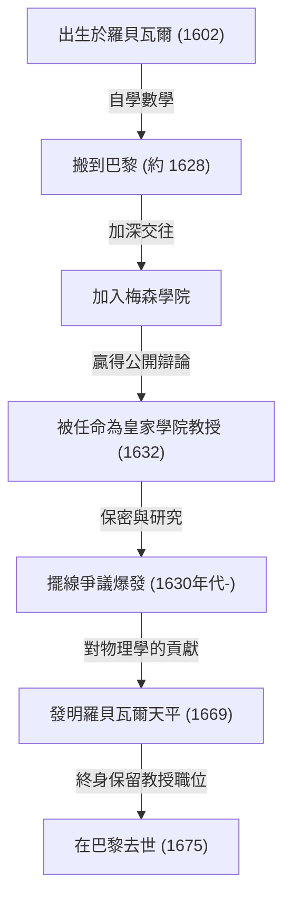
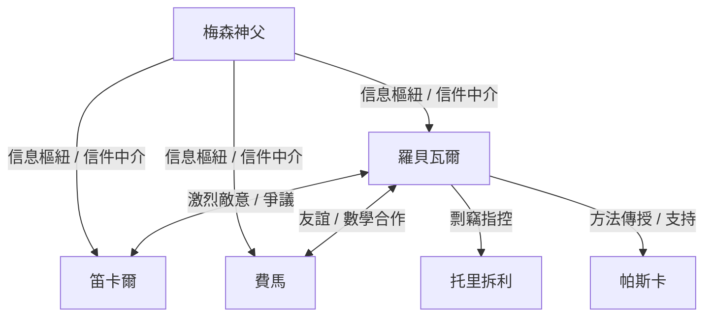

## 1. 引言：微積分前夕的巨人與17世紀數學

17世紀的歐洲是一個知識發生戲劇性爆炸的時代，後來被稱為「科學革命」。特別是在數學領域，正在為一門新數學的誕生進行快速的準備。這門新數學超越了從古希臘繼承的[歐幾里得](https://kenji.blog/zh-tw/p/euclid/)幾何的框架，旨在處理變化的量、無窮小和無窮大——即「微積分」。[艾薩克·牛頓](https://kenji.blog/zh-tw/p/newton/)和戈特弗里德·威廉·萊布尼茨完成微積分這一歷史豐碑，絕非僅僅依靠他們兩人的天才。其背後隱藏著許多在他們之前與無窮和極限概念搏鬥的數學家們的奮鬥。

在這個「微積分前夕」的法國，最重要的數學家之一就是[吉爾·佩爾索納·德·羅貝瓦爾](https://kenji.blog/zh-tw/p/roberval/)（[Gilles Personne de Roberval](https://kenji.blog/zh-tw/p/roberval/)，1602–1675）。羅貝瓦爾將義大利人卡瓦列里提出的「不可分量法」引入法國，並通過獨立改進它，創造了計算由曲線圍成的圖形面積和旋轉體體積的強大方法。他還在物理和力學領域展現了傑出的才華，留下了一項被稱為「羅貝瓦爾天平」的突破性發明，這種天平至今仍可在市場和科學實驗室中見到。

在本文中，我們將深入探討這位生活在動盪時代的孤獨數學家的生平，他與同時代人的激烈爭論，以及他留下的深遠數學和力學成就，並配以豐富的圖解和數學公式。

## 2. 羅貝瓦爾的生平與時代背景

### 2.1. 農家出身與進軍巴黎

吉爾·佩爾索納於1602年8月10日出生在法國北部博韋附近一個叫羅貝瓦爾（Roberval）的小村莊。人們認為他的家族是農民，在當時森嚴的階級社會中，這絕非是有利於做學問的出身。然而，他從小就展現出了非凡的智慧和對數學的濃厚興趣。後來，他用家鄉的村名，開始自稱為「德·羅貝瓦爾」。這既可以看作是他對自己出身感到自豪的表達，也是確立其學者身分的一種嘗試。

在年輕時自學了數學和古典語言（拉丁語和希臘語）後，羅貝瓦爾渴望達到更高的學術境界，並於1628年左右搬到了首都巴黎。當時的巴黎是學術的大熔爐，聚集了來自全歐洲的知識分子。在那裡，他開始頻繁參加以[馬蘭·梅森](https://kenji.blog/zh-tw/p/mersenne/)神父為中心的知識分子聚會，即著名的「梅森學院」。梅森常被稱為「歐洲學術界的郵政局長」，他充當了全歐洲學者通信的中間人，在分享最新科學發現方面發揮了作用。

通過梅森的沙龍，羅貝瓦爾加深了與當時法國頂尖頭腦的交往，如勒內·笛卡爾、[皮埃爾·德·費馬](https://kenji.blog/zh-tw/p/fermat/)、[布萊茲·帕斯卡](https://kenji.blog/zh-tw/p/pascal/)和埃蒂安·帕斯卡（布萊茲的父親），這使得他的數學才華得以綻放。

### 2.2. 皇家學院的教授職位與殘酷的衛冕戰

1632年，羅貝瓦爾迎來了一個重要的轉折點。巴黎的法蘭西公學院（當時稱為皇家學院）有一個數學教授職位（拉米講席）空缺，該職位由著名的邏輯學家和數學家皮埃爾·德·拉米創立。

這個教授職位的選拔方法非常不尋常且殘酷。候選人在公開場合進行數學辯論，獲勝者獲得該職位。更可怕的是，這個職位不是終身的；它要求每三年接受挑戰者參與公開辯論，並且必須不斷獲勝才能保住它。一旦失敗，意味著立即失去教授職位及其薪水。

羅貝瓦爾漂亮地贏得了這場殘酷的競爭，並坐上了教授的席位。令人驚訝的是，他成功地保住了這個職位，在40多年的時間裡沒有失敗過一次，直到1675年他以73歲高齡去世。

他不願以論文或書籍的形式迅速發表他的數學發現，其原因之一正是這些「每三年的衛冕戰」。為了在公開場合擊敗挑戰者，必須將最新的數學成果和強大的解法作為「秘密武器」隱藏起來。這種極端的保密性後來導致了他與同時代人的嚴重優先權爭議（爭論誰先發現了某事）。

## 3. 數學成就：不可分量與積分的黎明

### 3.1. 引入與改進不可分量法

羅貝瓦爾最大的數學成就是成為第一個將義大利數學家博納文圖拉·卡瓦列里首創的 **不可分量法** 引入法國，並獨立發展和改進了它。這種方法是現代積分學的直接、突破性的先驅。

卡瓦列里的不可分量是指「面是無限條平行線段（不可分的量）的集合，體是無限個平行平面的集合」這一概念。用現代的話來說，這正是定積分的確切基本思想：將圖形切成無限薄的切片並把它們加起來以求得面積或體積。

羅貝瓦爾在數學上進一步改進了這個概念。在計算特定曲線的面積時，他將其表示為構成該曲線的無限薄矩形之和。他的方法使古希臘阿基米德使用的「窮竭法」變得更加直觀、更容易計算，成為解決眾多困難幾何問題的有力工具。

### 3.2. 冪的積分與費馬的平行發現

利用不可分量法，羅貝瓦爾成功地幾何證明了定積分 $ \int_{0}^{a} x^n dx $ 在 $ n $ 為正整數時的等價計算。通過將曲線下的面積視為無窮數列之和，並利用自然數冪和的公式，他得出了以下結論：

$$
\int_{0}^{a} x^n dx = \frac{a^{n+1}}{n+1} \quad \left( \text{其中 } n \text{ 為正整數} \right)
$$

例如，當 $ n = 2 $ 時，拋物線 $ y = x^2 $ 下的面積為 $ \frac{a^3}{3} $。這與[皮埃爾·德·費馬](https://kenji.blog/zh-tw/p/fermat/)大約在同一時間獨立發現的結果相同。羅貝瓦爾和費馬互相尊重對方的方法，並通過信件分享了這一發現。他們的成就成為了後來萊布尼茨公式化積分法的重要墊腳石。

## 4. 擺線的研究與激烈的優先權爭議

### 4.1. 海倫的幾何學：擺線的魅力

在17世紀的數學界，有一條曲線讓學者們著迷，同時也成為激烈爭論的種子，被稱為「海倫的幾何學」。那就是 **擺線** (Cycloid)。擺線是一個圓沿一直線滾動且無滑動時，圓周上的一點所畫出的軌跡。

伽利略·伽利萊被這條曲線的美麗所吸引，並將其命名為「擺線」。利用參數 $ t $（旋轉角）和生成圓的半徑 $ r $，擺線上一點的座標 $ (x, y) $ 可表示如下：

$$
\begin{cases}
x = r(t - \sin t) \\
y = r(1 - \cos t)
\end{cases}
$$

通過切出擺線形狀的金屬板並稱重這種物理實驗，伽利略猜想「擺線一拱的面積正好是其生成圓面積的三倍」。然而，他無法在數學上證明這一點。

### 4.2. 羅貝瓦爾嚴格的面積證明

1634年，羅貝瓦爾充分利用不可分量法，數學上嚴格地證明了伽利略的猜想是正確的。他巧妙地比較了擺線曲線和生成圓平移時產生的曲線，使用了一種絕妙的分割和重建面積的幾何方法。

利用現代積分學，由擺線一拱（$ 0 \le t \le 2\pi $）和底邊（x軸）圍成的面積 $ A $ 可以很容易地計算如下：

$$
\begin{aligned}
A &= \int_{0}^{2\pi r} y \, dx \\
  &= \int_{0}^{2\pi} r(1 - \cos t) \cdot r(1 - \cos t) \, dt \\
  &= r^2 \int_{0}^{2\pi} (1 - 2\cos t + \cos^2 t) \, dt \\
  &= r^2 \left[ t - 2\sin t + \frac{t}{2} + \frac{\sin 2t}{4} \right]_{0}^{2\pi} \\
  &= r^2 \left( 2\pi + \pi \right) = 3\pi r^2
\end{aligned}
$$

羅貝瓦爾取得了這一偉大發現，但一如既往，為了保住教授職位，他推遲了發表，只通過信件傳達給了少數親密的數學家（如梅森）。

### 4.3. 與托里拆利的爭議

幾年後，在1644年，義大利人埃萬傑利斯塔·托里拆利（伽利略的學生，以「托里拆利真空」聞名）獨立發現了擺線的面積是其圓面積的三倍，並將其發表在書中。

得知此事後，羅貝瓦爾大發雷霆。他指責托里拆利說：「托里拆利通過梅森的信件偷看了我的結果，並作為他自己的發現發表了。」 這場關於剽竊的爭論變得極其激烈，兩人的關係受到了不可挽回的破壞。今天，人們相信托里拆利的發現是獨立做出的，並非剽竊，但這一事件作為軼事被人們記住，它說明了羅貝瓦爾火爆的脾氣以及當時信息傳播的侷限性。

## 5. 運動學切線作圖法：通向導數的另一條道路

羅貝瓦爾不僅在積分領域設計了一種突破性的方法，在微分領域（畫切線的問題）也同樣如此。那就是將幾何問題重新視為物理上的「運動學」。

當時，求曲線的切線是幾何學中最重要的問題之一。勒內·笛卡爾正試圖用代數方程的代數幾何方法來尋找切線，但它有計算極其繁瑣的缺點。

相比之下，羅貝瓦爾是這樣想的：「如果曲線是運動的點畫出的軌跡，那麼該點在任何給定瞬間的運動方向（速度向量）正是曲線的切線。」

他將生成複雜曲線的點的運動分解為兩個簡單的運動分量。然後，通過找到每個運動分量中的速度向量，並將其幾何組合（向量和），他將合成速度向量的方向確定為切線。

這種「運動學切線法」在尋找像擺線這樣的超越曲線（不能用代數方程表示的曲線）的切線時，展示了巨大的威力。羅貝瓦爾將這種運動的物理概念引入數學的方法，是極其重要的一步，它直接導向了後來由[艾薩克·牛頓](https://kenji.blog/zh-tw/p/newton/)創立的「流數法」（運動學微積分）的基本思想。

## 6. 對力學的貢獻：羅貝瓦爾天平

雖然羅貝瓦爾在數學中探索了抽象的無限和運動，但他還在現實世界的物理學、力學甚至機器的工程設計中展現了傑出的才華。當今以他的名字廣為人知的最突出的例子就是 **「羅貝瓦爾天平」**。

### 6.1. 傳統秤的缺陷

自古以來使用的秤都有一種「桿秤」機制，即將橫梁支撐在中央支點上，兩端掛著秤盤。在這種方法中，從支點到秤盤的距離（力臂）必須嚴格恆定，才能進行精確稱量。此外，它還有一個致命的缺陷：如果把重物或物體放在秤盤上的位置偏離了中心，力矩就會由於槓桿原理而改變，從而無法進行精確測量。

### 6.2. 採用平行四邊形連桿機構

1669年，羅貝瓦爾向法國皇家科學院展示了一種突破性的機制，完全解決了這個問題。他採用了一種「平行四邊形連杆機構」（一種類似於受電弓的結構），該機構使用銷子將上下兩根平行桿與左右垂直桿連接起來。

有了這種結構，左右秤盤在平移中上下移動，同時始終保持水平而不會傾斜。秤盤水平移動這一事實意味著，根據虛功原理，無論把重物放在秤盤的哪個位置，重物上下移動的距離（做功量）都不會改變。

結果，實現了一種具有極佳實用特性的天平：「無論將重物放在秤盤的哪個位置，稱量結果都完全不變。」 這種創新的原理直到今天仍在原封不動地使用，作為郵局稱信件的天平、市場上稱食材的托盤天平、甚至是學校科學實驗室中天平的基礎。一個在350多年前設計出來的機械機構，在沒有改變其基本原理的情況下至今仍在使用，這一事實充分說明了羅貝瓦尔巨大的工程學直覺。

## 7. 與同時代人的交往和充滿爭議的一生

除了他傑出的才華之外，據說羅貝瓦爾性情十分火爆，性格固執，拒絕在自己的理論上讓步。因此，他與他那個時代的許多著名學者陷入了激烈的爭論。

- **與勒內·笛卡爾的衝突**：
  當笛卡爾推廣使用代數解決幾何問題的「解析幾何」時，羅貝瓦爾則看重純幾何和運動學的方法。羅貝瓦爾批評笛卡爾的方法過於造作，並經常攻擊笛卡爾理論中的缺陷。而笛卡爾反過來又輕視羅貝瓦爾，稱其「粗鄙無教養」，他們兩人的關係終生敵對。
- **與[皮埃爾·德·費馬](https://kenji.blog/zh-tw/p/fermat/)的友誼**：
  與笛卡爾相反，羅貝瓦爾與住在圖盧茲的費馬建立了非常好的關係。儘管兩人性格迥異，但他們通過梅森作為中間人的信件分享了數學思想，在諸如不可分量等問題上互補了彼此的研究。
- **對[布萊茲·帕斯卡](https://kenji.blog/zh-tw/p/pascal/)的影響**：
  年輕的天才帕斯卡也深受羅貝瓦爾的影響。帕斯卡後來以「A. Dettonville」為筆名發表了關於擺線的論文，其中使用的許多方法都是羅貝瓦爾關於不可分量思想的改良版。羅貝瓦爾非常賞識帕斯卡的才華，並支持他。

## 8. 結論：架起通向微積分橋樑的孤獨天才

[吉爾·佩爾索納·德·羅貝瓦爾](https://kenji.blog/zh-tw/p/roberval/)在微積分正式誕生之前的時代，充分利用了兩種強大的武器——不可分量法和運動學方法——接連解決了當時最高難度的數學問題。

由於他為了每三年捍衛教授職位的壓力而過度推遲發表他的發現，他的一些成就沒有得到同時代人的公正評價，有時甚至被捲入不情願的優先權爭議中。然而，他播下的數學思想的種子無疑通過梅森的網絡以及費馬和帕斯卡等熟人傳播開來，成為一座堅固的橋樑，導向了後來牛頓和萊布尼茨建立的微積分。

此外，正如他在力學領域發明的「羅貝瓦爾天平」所見，他的理論思考並不局限於抽象的數學，而是始終與現實的物理世界深刻相連。活躍在數學和物理學交界領域的羅貝瓦爾，真正作為從根本上支持和推動了17世紀科學革命的「幕後關鍵人物」，永遠銘刻在數學史冊上。
