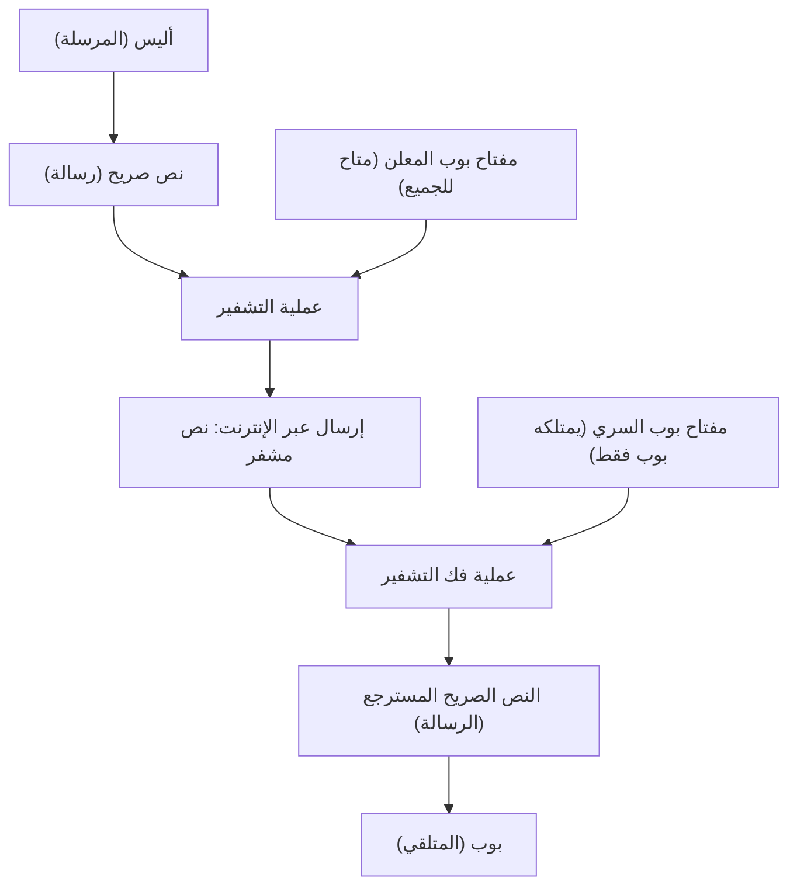
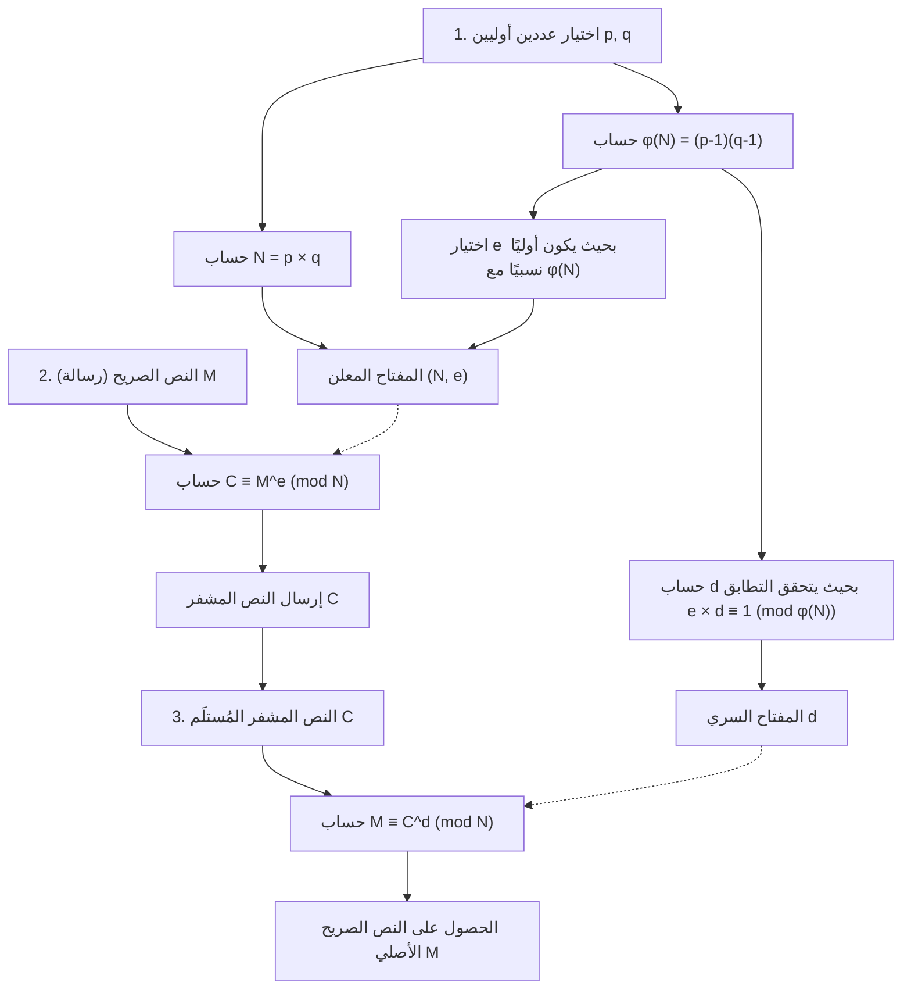
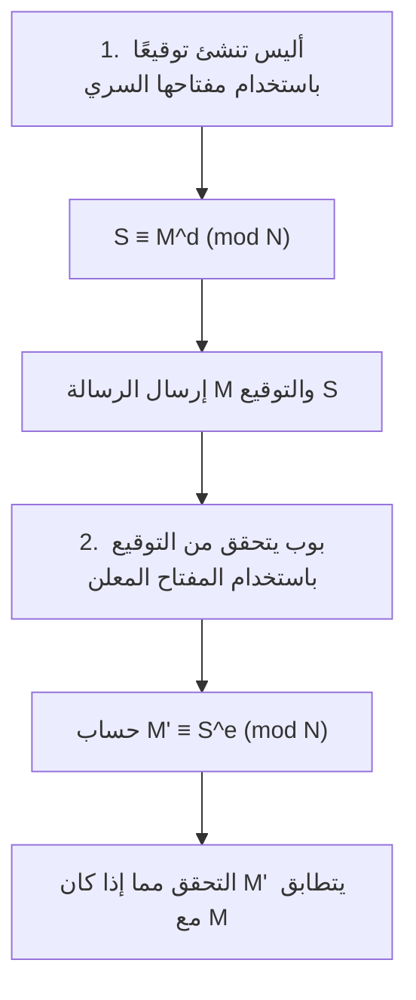

إحدى التقنيات التي تدعم أمن مجتمع الإنترنت من جذوره هي "تشفير RSA". العديد من الاتصالات التي نستخدمها يوميًا دون تفكير، مثل مدفوعات بطاقات الائتمان في التسوق عبر الإنترنت، والتواصل مع الأصدقاء على شبكات التواصل الاجتماعي، وإرسال واستقبال المعلومات السرية للشركات، محمية بواسطة تشفير RSA أو التقنيات التي خلفته.

ولكن عندما تسمع كلمة "تشفير"، قد تتخيل آلات تشفير معقدة كتلك التي تظهر في أفلام الجواسيس، أو رياضيات متقدمة للغاية لا يفهمها سوى بعض العباقرة. صحيح أن نظرية التشفير الحديثة تعتمد على رياضيات متقدمة، إلا أن **الآلية الأساسية لتشفير RSA يمكن فهمها تمامًا إذا كان لديك معرفة برياضيات المرحلة الثانوية (خصائص الأعداد الصحيحة، الأعداد الأولية، التطابق وغيرها)**.

في هذا المقال، ومن منطلق المعرفة برياضيات المرحلة الثانوية، سنشرح خطوة بخطوة وبشكل شامل المبادئ الرياضية التي يعمل بها تشفير RSA، ولماذا يصعب فك تشفيره. سنشرح بعناية مع استخدام أمثلة ملموسة حتى يتمكن حتى من يجدون صعوبة قليلة في الرياضيات من الفهم.

---

## 1. التشفير بالمفتاح المتماثل والتشفير بالمفتاح المعلن

قبل الخوض في الآلية الرياضية لتشفير RSA، دعونا أولاً ننظم الفكرة الأساسية للتشفير. تنقسم طرق التشفير بشكل عام إلى نوعين: "التشفير بالمفتاح المتماثل (المشترك)" و"التشفير بالمفتاح المعلن (العام)".

### 1.1 حدود طريقة التشفير بالمفتاح المتماثل

العديد من الشفرات المستخدمة منذ القدم تسمى "طريقة التشفير بالمفتاح المتماثل". وهي طريقة **تستخدم نفس المفتاح في "التشفير (تحويل الرسالة إلى نص مشفر سري)" و"فك التشفير (إعادة النص المشفر إلى الرسالة الأصلية)"**.

على سبيل المثال، لنفترض أن أليس تريد إرسال رسالة سرية إلى بوب. تضع أليس الرسالة في صندوق وتغلقه باستخدام قفل (مفتاح متماثل). لكي يفتح بوب ذلك الصندوق، يحتاج إلى امتلاك نفس المفتاح الذي استخدمته أليس.

هذه الطريقة بها مشكلة كبيرة، وهي "مشكلة توزيع المفاتيح". عندما تتواصل أليس وبوب، اللذان تفصل بينهما مسافة كبيرة، لأول مرة، كيف يمكنهما مشاركة المفتاح دون أن يتم التنصت عليهما؟ إذا سُرق المفتاح من قبل طرف ثالث أثناء إرساله بالبريد، فإن جميع الاتصالات المشفرة اللاحقة ستكون مكشوفة تمامًا.

### 1.2 الاختراع الثوري "طريقة التشفير بالمفتاح المعلن"

تم ابتكار "طريقة التشفير بالمفتاح المعلن" لحل مشكلة توزيع المفاتيح هذه. وتشفير RSA هو نوع من هذا التشفير.

في طريقة التشفير بالمفتاح المعلن، يتم استخدام **مفتاحين مختلفين: "مفتاح للتشفير (المفتاح المعلن/العام)" و"مفتاح لفك التشفير (المفتاح السري/الخاص)"**.

1. يقوم المتلقي بوب بإنشاء زوج من "المفتاح المعلن" و"المفتاح السري".
2. ينشر بوب "المفتاح المعلن" للعالم أجمع (لا يهم من يحصل عليه).
3. تستخدم المرسلة أليس "المفتاح المعلن" الخاص ببوب لتشفير رسالتها وإرسالها.
4. لا يمكن فك تشفير الرسالة المشفرة إلا بواسطة "المفتاح السري" الذي يمتلكه بوب فقط.

إذا شبهنا ذلك بالقفل، فإن بوب يصنع الكثير من "الأقفال المفتوحة (المفاتيح المعلنة)" وينثرها في جميع أنحاء العالم. تضع أليس رسالتها الموجهة لبوب في صندوق وتغلقه باستخدام أحد أقفال بوب التي وجدتها. بمجرد إغلاق القفل، لا يمكن فتحه إلا باستخدام "المفتاح الرئيسي (المفتاح السري)" الذي يمتلكه بوب. حتى لو سرق شخص ما الصندوق في الطريق، فلا يمكنه فتحه لأنه لا يمتلك المفتاح الرئيسي.



لتحقيق هذا النظام الثوري، نحتاج إلى نوع من **"الدوال أحادية الاتجاه (لغز رياضي في اتجاه واحد)"**، حيث "يمكن التشفير بسهولة باستخدام المفتاح المعلن، ولكن من المستحيل مطلقًا فك التشفير بدون المفتاح السري". القطعة التي تم التركيز عليها لحل هذا اللغز هي "الأعداد الأولية" التي نعرفها جيدًا.

---

## 2. الأساس الرياضي الذي يدعم تشفير RSA 1: الأعداد الأولية والتحليل إلى العوامل الأولية

يعتمد أمان تشفير RSA على حقيقة رياضية مفادها أن **"تحليل الأعداد الضخمة إلى عواملها الأولية أمر صعب للغاية"**.

### 2.1 ما هو العدد الأولي

العدد الأولي هو "عدد طبيعي أكبر من 1، لا يقبل القسمة إلا على 1 وعلى نفسه".
مثال: $2, 3, 5, 7, 11, 13, 17, 19, 23...$

الأعداد الأولية تشبه "الذرات" لجميع الأعداد الصحيحة. يمكن تحليل أي عدد طبيعي إلى شكل ضرب أعداد أولية. وهذا ما يسمى **التحليل إلى العوامل الأولية**. على سبيل المثال، إمكانية التحليل إلى عوامل أولية بطريقة واحدة فقط (إذا تجاهلنا الترتيب) كما في $60 = 2^2 \times 3 \times 5$ تُعرف باسم "المبرهنة الأساسية في الحساب".

### 2.2 صعوبة التحليل إلى العوامل الأولية (الدالة أحادية الاتجاه)

المهم هنا هو عدم التماثل حيث أن **"عملية الضرب سهلة، لكن التحليل إلى العوامل الأولية صعب"**.

على سبيل المثال، حاول حساب حاصل ضرب العددين الأوليين التاليين ذهنيًا:
$11 \times 13 = ?$
هذا سهل، أليس كذلك؟ الجواب هو $143$.

إذًا، ماذا عن العدد التالي؟
حلل العدد $323$ إلى عوامله الأولية.
ما رأيك؟ سيستغرق الأمر بعض الوقت. (الجواب هو $17 \times 19$).

إذا كانت الأعداد صغيرة، فيمكن للإنسان حسابها بطريقة ما، ولكن عندما تصبح الأعداد كبيرة، يصبح الحساب صعبًا بشكل هائل حتى باستخدام أجهزة الكمبيوتر. في تشفير RSA السائد حاليًا، يتم استخدام عدد $N = p \times q$ ناتج عن ضرب عددين أوليين ضخمين بشكل لا يصدق $p$ و $q$ بحجم 2048 بت (حوالي 600 رقم بالنظام العشري).

عند إعطاء عددين أوليين ضخمين $p$ و $q$، فإن حساب $N$ يستغرق جزءًا من الثانية بالنسبة للكمبيوتر (أقل من مللي ثانية). ولكن على العكس من ذلك، إذا تم إعطاء $N$ فقط لإيجاد $p$ و $q$ الأصليين، فسيستغرق الأمر وقتًا طويلاً لا يمكن لأسرع حاسوب عملاق حالي حله حتى لو استمر في العمل لترليونات السنين.

هذا **"عدم التماثل في الحساب (طريق الذهاب سهل، وطريق العودة صعب)"** هو الأساس الذي يخلق العلاقة بين المفتاح المعلن والمفتاح السري.

---

## 3. الأساس الرياضي الذي يدعم تشفير RSA 2: التطابق (حساب المقياس)

لا تتم حسابات تشفير RSA بالجمع والضرب حيث تكبر الأعداد بشكل لا نهائي كما نستخدمها عادة، بل تتم في عالم "البواقي" بعد القسمة على عدد معين. وهذا ما يسمى **التطابق (حساب المقياس أو الحساب المعياري)**.

### 3.1 رياضيات الساعة

غالبًا ما يُشبه حساب المقياس بـ "رياضيات الساعة". إذا كانت الساعة الآن 10، فكم ستكون الساعة بعد 5 ساعات؟ إنها $10 + 5 = 15$، ولكن في نظام الساعة المعتاد المكون من 12 ساعة، نجيب "الساعة 3". هذا لأن باقي قسمة 15 على 12 هو 3.

في عالم الرياضيات، يُكتب هذا على النحو التالي:
$$ 15 \equiv 3 \pmod{12} $$
ويُقرأ: "15 و 3 متطابقان بمقياس 12 (باقي قسمتهما على 12 متساوٍ)".

### 3.2 الخصائص الأساسية للتطابق

للتطابق خصائص مفيدة جدًا تشبه إلى حد كبير خصائص المعادلة ($=$). لنفترض أن المقياس (القاسم) هو $N$.
عندما يكون $a \equiv b \pmod N$ و $c \equiv d \pmod N$، يتحقق ما يلي:

1. **الجمع:** $a + c \equiv b + d \pmod N$
2. **الطرح:** $a - c \equiv b - d \pmod N$
3. **الضرب:** $a \times c \equiv b \times d \pmod N$
4. **الرفع لأس:** $a^k \equiv b^k \pmod N$ (حيث $k$ عدد طبيعي)

الخاصية الأكثر أهمية هي "الرفع لأس". هذا يعني أن **"أس الباقي يساوي باقي الأس"**.
على سبيل المثال، لنفترض أننا نريد إيجاد باقي قسمة $7^{100}$ على $5$. سيكون من الصعب جدًا ضرب $7$ في نفسها 100 مرة ثم القسمة على $5$، ولكن باستخدام خصائص التطابق، نظرًا لأن $7 \equiv 2 \pmod 5$، فإن $7^{100} \equiv 2^{100} \pmod 5$، مما يبسط الحساب بشكل هائل. هذه الخاصية لا غنى عنها في عالم التشفير لأننا نتعامل مع أسس لأعداد كبيرة جدًا.

---

## 4. الأساس الرياضي الذي يدعم تشفير RSA 3: مؤشر أويلر ومبرهنة أويلر

من هنا تبدأ الرياضيات السحرية التي تشكل جوهر تشفير RSA. ستظهر "مبرهنة أويلر"، وهي تعميم لـ "مبرهنة فيرما الصغرى".

### 4.1 دالة مؤشر أويلر (دالة توتنت) $\phi(N)$

دالة مؤشر أويلر (دالة $\phi$) هي دالة تعيد، بالنسبة لعدد طبيعي معين $N$، **"عدد الأعداد الطبيعية من 1 إلى $N$ التي تكون أولية نسبيًا مع $N$ (أي القاسم المشترك الأكبر بينهما هو 1)"**.

دعونا نلقي نظرة على بعض الأمثلة:
- $\phi(5)$: من بين الأعداد 1, 2, 3, 4, 5، الأعداد الأولية نسبيًا مع 5 هي 1, 2, 3, 4 (عددها 4). إذن $\phi(5) = 4$.
- $\phi(6)$: من بين الأعداد 1, 2, 3, 4, 5, 6، الأعداد الأولية نسبيًا مع 6 هي 1, 5 (عددها 2). إذن $\phi(6) = 2$.

**【خاصية مميزة في حالة العدد الأولي】**
إذا كان $p$ عددًا أوليًا، فإن جميع الأعداد من 1 إلى $p-1$ تكون أولية نسبيًا مع $p$. وبالتالي:
$$ \phi(p) = p - 1 $$

**【خاصية مميزة في حالة حاصل ضرب عددين أوليين】**
بالنسبة لعددين أوليين مختلفين $p$ و $q$، إذا كان $N = p \times q$، فيمكن حساب $\phi(N)$ بسهولة كالتالي:
$$ \phi(N) = \phi(p) \times \phi(q) = (p - 1)(q - 1) $$
هذه الخاصية تعمل كـ "باب خلفي سري (Trapdoor)" لتشفير RSA. فالشخص الذي يعرف $p$ و $q$ (منشئ المفتاح) يمكنه حساب $\phi(N)$ في لحظة، لكن الطرف الثالث الذي يعرف $N$ فقط لا يمكنه حساب $\phi(N)$ ما لم يقم بتحليل $N$ إلى عوامله الأولية.

### 4.2 مبرهنة أويلر

أثبت ليونهارد أويلر هذه المبرهنة الجميلة باستخدام $\phi(N)$:

**مبرهنة أويلر:**
عندما يكون العددان الصحيحان $a$ و $N$ أوليين نسبيًا، يتحقق التطابق التالي:
$$ a^{\phi(N)} \equiv 1 \pmod N $$

هذه خاصية مذهلة تعني أن "حاصل ضرب أي عدد $a$ في نفسه $\phi(N)$ مرة ثم قسمته على $N$، سيعطي باقيًا يساوي $1$ دائمًا". (إذا كان $N$ عددًا أوليًا $p$، فإنها تصبح $a^{p-1} \equiv 1 \pmod p$، وتُعرف باسم مبرهنة فيرما الصغرى).

دعونا نعدل مبرهنة أويلر هذه. سنضرب كلا الطرفين في $a$ مرة أخرى:
$$ a^{\phi(N) + 1} \equiv a \pmod N $$

علاوة على ذلك، بالنسبة لأي عدد صحيح $k$، فإن $a^{k \cdot \phi(N)}$ سيكون أيضًا $1^k = 1$، وبالتالي تتحقق المعادلة التالية:
$$ a^{k \cdot \phi(N) + 1} \equiv a \pmod N $$

هذه المعادلة بالذات هي المبدأ الأساسي الذي يجعل سحر تشفير RSA **"العودة إلى الحالة الأصلية بعد التشفير وفك التشفير"** ممكنًا.

---

## 5. خوارزمية تشفير RSA: خطوات إنشاء المفتاح، التشفير، وفك التشفير

بعد أن اكتملت المعرفة الأساسية، دعونا أخيرًا نلقي نظرة على الخطوات المحددة لتشفير RSA. ينقسم تشفير RSA بشكل رئيسي إلى ثلاث مراحل: "1. إنشاء المفتاح"، "2. التشفير"، و"3. فك التشفير".



### 5.1 إنشاء المفتاح (Key Generation)

يقوم المتلقي بوب بإنشاء "مفتاح معلن" و"مفتاح سري" خاص به.

1. **اختيار الأعداد الأولية:** يختار عشوائيًا عددين أوليين كبيرين $p$ و $q$.
2. **حساب المقياس $N$:** يحسب $N = p \times q$. هذا الـ $N$ سيتم إعلانه للجميع.
3. **حساب $\phi(N)$:** يحسب دالة أويلر $\phi(N) = (p - 1)(q - 1)$. هذا هو رقم بوب السري.
4. **اختيار المفتاح المعلن $e$:** يختار عددًا صحيحًا $e$ بحيث $1 < e < \phi(N)$ ويكون أوليًا نسبيًا مع $\phi(N)$.
5. **حساب المفتاح السري $d$:** يجد عددًا صحيحًا $d$ يحقق الشرط التالي:
   $$ e \times d \equiv 1 \pmod{\phi(N)} $$
   وهذا يعني، "العدد $d$ الذي يجعل باقي قسمة $e \times d$ على $\phi(N)$ يساوي $1$".

وبهذا تكتمل تجهيزات المفاتيح.
- **المفتاح المعلن:** الزوج $(N, e)$. يتم نشره للعالم أجمع.
- **المفتاح السري:** $d$. لا يخبر به أحداً على الإطلاق.

### 5.2 التشفير (Encryption)

لنفترض أن أليس تريد إرسال رسالة سرية $M$ إلى بوب. ($M$ هي أحرف تم تحويلها إلى أرقام، بحيث يكون $0 \le M < N$). تستخدم أليس المفتاح المعلن لبوب $(N, e)$ للحساب كما يلي:

$$ C \equiv M^e \pmod N $$

تحسب "باقي قسمة رسالة $M$ مرفوعة للأس $e$ على $N$، وهو $C$". هذا الـ $C$ هو النص المشفر.

### 5.3 فك التشفير (Decryption)

يتلقى بوب النص المشفر $C$. يستخدم بوب المفتاح السري $d$ للحساب كما يلي:

$$ M \equiv C^d \pmod N $$

عندما يحسب "باقي قسمة النص المشفر $C$ مرفوع للأس $d$ على $N$"، فإنه بشكل مذهل يسترجع الرسالة الأصلية $M$!

---

## 6. لماذا يعود إلى حالته الأصلية عند فك التشفير؟ (إثبات رياضي)

قد تتساءل: "كيف يمكن مجرد رفع $C$ للأس $d$ أن يعيده إلى $M$ الأصلي؟". هنا تأتي قوة "مبرهنة أويلر" التي ذكرناها سابقًا.

دعونا نعوض معادلة التشفير $C = M^e$ في معادلة فك التشفير $C^d \pmod N$:
$$ C^d \equiv (M^e)^d \equiv M^{ed} \pmod N $$

هنا، تذكر الخطوة 5 من عملية إنشاء المفتاح. اختار بوب $d$ بحيث يكون $e \times d \equiv 1 \pmod{\phi(N)}$. هذا يعني أن "$ed$ هو من مضاعفات $\phi(N)$ مضافًا إليه $1$". باستخدام عدد صحيح $k$، يمكن كتابتها على النحو التالي:
$$ ed = k \cdot \phi(N) + 1 $$

نعوض هذا في جزء الأس ونفككه باستخدام قوانين الأسس:
$$ M^{ed} = M^{k \cdot \phi(N) + 1} = M^{k \cdot \phi(N)} \times M^1 = (M^{\phi(N)})^k \times M $$

هنا، بافتراض أن الرسالة $M$ و $N$ أوليان نسبيًا، فإنه وفقًا لـ **مبرهنة أويلر**، يكون $M^{\phi(N)} \equiv 1 \pmod N$.
$$ (M^{\phi(N)})^k \times M \equiv 1^k \times M \equiv M \pmod N $$

وبالتالي، تتحقق المعادلة التالية بنجاح تام:
$$ C^d \equiv M \pmod N $$

أليس لا تعرف $d$، والمتنصت أيضًا لا يعرف $d$، لذا فإن الوحيد الذي يمكنه استخراج $M$ من $C$ هو بوب الذي يمتلك $d$.

---

## 7. مثال تطبيقي: دعونا نجرب تشفير RSA بالحساب اليدوي باستخدام أعداد أولية صغيرة

دعونا نقوم بتجربة تواصل مشفر من أليس إلى بوب باستخدام أرقام صغيرة (أعداد أولية) في الواقع.

**【مرحلة إنشاء المفتاح لبوب】**
1. يختار عددين أوليين $p=11$, $q=13$.
2. يحسب $N = 11 \times 13 = 143$.
3. يحسب $\phi(N) = (11 - 1) \times (13 - 1) = 10 \times 12 = 120$.
4. يختار مفتاحًا معلنًا $e$ يكون أوليًا نسبيًا مع $\phi(N)=120$. لنختر هنا $e=7$.
5. يجد المفتاح السري $d$. يبحث عن $d$ الذي يحقق $7 \times d \equiv 1 \pmod{120}$.
   في المعادلة $7d = 120k + 1$، عندما يكون $k=6$ يصبح الناتج $721$، و $721 \div 7 = 103$.
   وبالتالي، $d = 103$.

- المفتاح المعلن: $(N=143, e=7)$
- المفتاح السري: $d=103$

**【مرحلة التشفير لأليس】**
لنفترض أنها تريد إرسال الرسالة $M = 9$.
المعادلة: $C \equiv 9^7 \pmod{143}$
$9^7 = 4,782,969$. بقسمة هذا العدد على 143 نحصل على $33447$ والباقي $48$.
أصبح النص المشفر $C = 48$.

**【مرحلة فك التشفير لبوب】**
يتلقى بوب النص المشفر $C = 48$، ويستخدم المفتاح السري $d = 103$ لفك التشفير.
المعادلة: $M \equiv 48^{103} \pmod{143}$
عند تنفيذ `(48 ** 103) % 143` على الآلة الحاسبة، ستجد أن النتيجة بشكل رائع هي "**9**"! لقد تمكن من استلام الرسالة الأصلية بنجاح.

---

## 8. كيفية إيجاد المفتاح السري $d$: خوارزمية إقليدس الممتدة

في مثال الحساب اليدوي، اعتمدنا على التخمين للبحث عن $k$ وإيجاد $d=103$، لكن هذه الطريقة مستحيلة عندما تتكون الأعداد من مئات الأرقام. في البرامج الحقيقية، تُستخدم خوارزمية تسمى **"خوارزمية إقليدس الممتدة"**.

حل التطابق $7d \equiv 1 \pmod{120}$ هو نفسه إيجاد الأعداد الصحيحة $d, y$ التي تحقق المعادلة $7d + 120y = 1$. من خلال الحساب العكسي لخوارزمية إقليدس، يمكن إيجاد ذلك ميكانيكيًا.

1. $120 \div 7 = 17$ والباقي $1$ 
2. بتعديل هذه المعادلة نحصل على: $1 = 120 - 17 \times 7$
3. بمعنى آخر، $-17 \times 7 \equiv 1 \pmod{120}$

الرقم $-17$ يحمل نفس المعنى مثل $120 - 17 = 103$ في عالم المقياس $120$. وبالتالي، يمكن إيجاد $d = 103$ في لحظة. تتيح هذه الطريقة إجراء حسابات سريعة جدًا بغض النظر عن مدى ضخامة الأعداد.

---

## 9. الوجه الآخر لتشفير RSA: التوقيع الرقمي

من الميزات الرائعة لتشفير RSA أنه يمكن استخدامه أيضًا كـ **"توقيع رقمي"** عن طريق عكس أدوار المفتاح المعلن والمفتاح السري.

في التشفير كان الإجراء "التشفير بالمفتاح المعلن $\Rightarrow$ فك التشفير بالمفتاح السري"،
أما في التوقيع الرقمي، نتبع خطوات "التشفير بالمفتاح السري $\Rightarrow$ فك التشفير بالمفتاح المعلن".



تستخدم أليس مفتاحها السري $d$ لتحويل الرسالة (وهذا هو التوقيع $S$)، وترسله إلى بوب. يستخدم بوب المفتاح المعلن لأليس $e$ لإجراء عملية التحقق. إذا كانت نتيجة الحساب تتطابق مع الرسالة الأصلية، فإن ذلك يثبت في نفس الوقت أن "هذه البيانات لا يمكن إنشاؤها إلا بواسطة المفتاح السري لأليس"، و"لم يتم التلاعب بالرسالة في الطريق".

---

## 10. تجربة تشفير RSA من خلال البرمجة

حسابات الأسس التي تعتبر صعبة في الحساب اليدوي، يمكن تنفيذها بسهولة بالغة باستخدام بايثون (Python). وفيما يلي كود بايثون يمكنك من خلاله تجربة المنطق الأساسي لتشفير RSA.

```python
def gcd(a, b):
    """إيجاد القاسم المشترك الأكبر"""
    while b != 0:
        a, b = b, a % b
    return a

def mod_inverse(e, phi):
    """إيجاد المفتاح السري d (باستخدام الدالة المدمجة في بايثون 3.8 وما بعده)"""
    return pow(e, -1, phi)

# 1. إنشاء المفتاح
p, q = 11, 13
N = p * q
phi = (p - 1) * (q - 1)
e = 7
d = mod_inverse(e, phi)

print(f"المفتاح المعلن: (N={N}, e={e}), المفتاح السري: d={d}")

# 2. التشفير
message = 9
ciphertext = pow(message, e, N)
print(f"النص المشفر: {ciphertext}")

# 3. فك التشفير
decrypted_message = pow(ciphertext, d, N)
print(f"الرسالة بعد فك التشفير: {decrypted_message}")
```

تستخدم دالة `pow(base, exp, mod)` في بايثون خوارزمية سريعة تسمى "التربيع المتكرر (Exponentiation by squaring)" داخليًا، لذلك حتى بالنسبة للأعداد المكونة من مئات الأرقام، ينتهي الحساب في لحظة.

---

## 11. الخلاصة وتقنيات التشفير المستقبلية

لقد قمنا بتوضيح آلية عمل تشفير RSA بناءً على المعرفة برياضيات المرحلة الثانوية.

1. **صعوبة التحليل إلى العوامل الأولية:** حساب $p \times q = N$ سهل، لكن إيجاد $p, q$ من $N$ صعب للغاية.
2. **التطابق ومبرهنة أويلر:** بفضل القاعدة $a^{\phi(N)} \equiv 1 \pmod N$، يكتمل "الباب الخلفي" السحري الذي يسمح بـ "العودة إلى الحالة الأصلية عند الرفع لأس عدد معين".
3. **المفتاح المعلن والمفتاح السري:** يمكن لأي شخص التشفير، ولكن المستلم الشرعي فقط هو من يمكنه فك التشفير.

الـ $N$ المستخدم في تشفير RSA الحالي يتكون من أكثر من 600 رقم، وحتى لو تم حشد جميع الحواسيب العملاقة في العالم، فإن التحليل إلى العوامل الأولية سيستغرق وقتًا أطول من عمر الكون. ومع ذلك، عندما تصبح "الحواسيب الكمومية"، التي تتقدم الأبحاث بشأنها في السنوات الأخيرة، قابلة للتطبيق العملي في المستقبل، فهناك احتمال أن يتم حل هذا التحليل إلى العوامل الأولية في لحظة بواسطة "خوارزمية شور". لذلك، يجري حاليًا تطوير "تشفير مقاوم للحواسيب الكمومية"، والذي لا يمكن حتى للحواسيب الكمومية فك تشفيره، بوتيرة سريعة في جميع أنحاء العالم.

الرياضيات المتقدمة التي غالبًا ما يُعتقد أنها "غير مفيدة"، تحمي في الواقع حياتنا اليومية من جذورها. يعتبر تشفير RSA من أفضل المواد التعليمية التي توضح لنا عمق وجمال هذه الرياضيات. نأمل أن تكون قد شعرت ولو قليلاً بمتعة التشفير والرياضيات من خلال هذا المقال.
