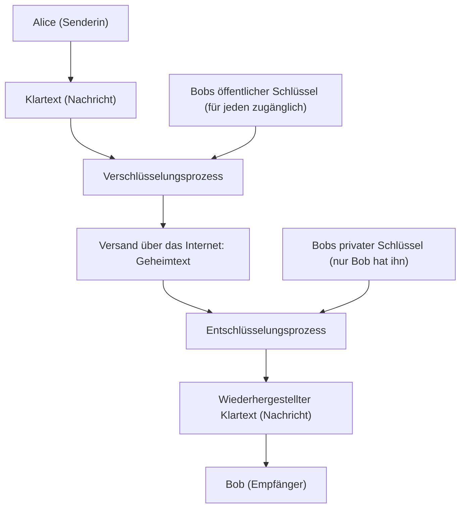
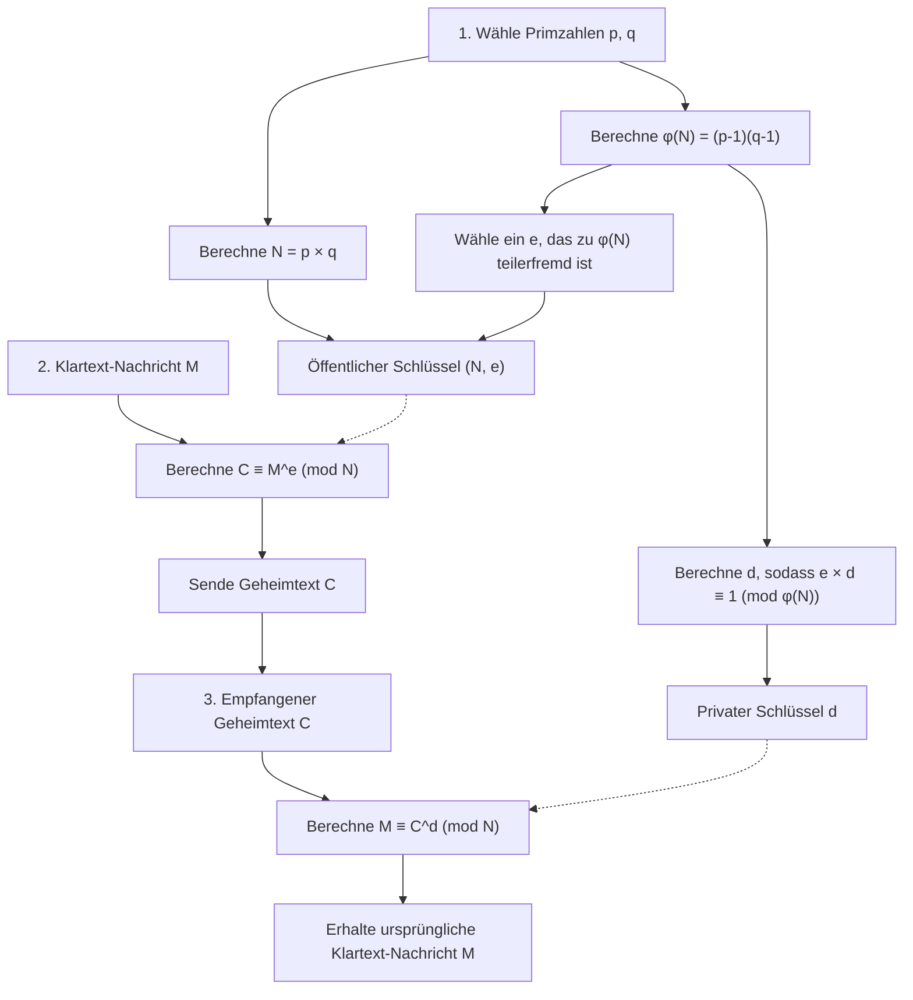
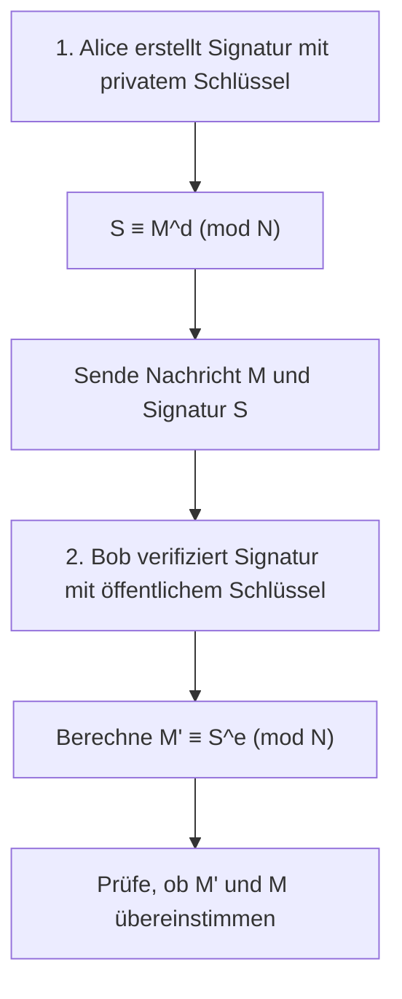

Eine der Technologien, die die Sicherheit der Internetgesellschaft grundlegend unterstützt, ist die „RSA-Verschlüsselung“. Viele der Kommunikationen, die wir jeden Tag beiläufig nutzen, wie Kreditkartenzahlungen beim Online-Shopping, der Austausch mit Freunden auf sozialen Netzwerken und das Senden und Empfangen vertraulicher Unternehmensinformationen, werden durch diese RSA-Verschlüsselung und ihre Nachfolgetechnologien geschützt.

Wenn man jedoch das Wort „Verschlüsselung“ hört, stellt man sich vielleicht komplexe Chiffriermaschinen wie in Spionagefilmen vor oder extrem fortgeschrittene Mathematik, die nur einige wenige Genies verstehen können. Es stimmt zwar, dass die moderne Kryptographie auf fortgeschrittener Mathematik basiert, aber **die grundlegende Funktionsweise der RSA-Verschlüsselung kann mit dem Wissen aus der Schulmathematik (Eigenschaften von ganzen Zahlen, Primzahlen, Kongruenzen usw.) gut verstanden werden**.

In diesem Artikel erklären wir ausgehend vom Wissen der Schulmathematik Schritt für Schritt, nach welchen mathematischen Prinzipien die RSA-Verschlüsselung funktioniert und warum sie so schwer zu knacken ist. Wir werden es anhand konkreter Beispiele sorgfältig erklären, so dass auch diejenigen es verstehen können, die in Mathematik vielleicht nicht so stark sind.

---

## 1. Symmetrische Verschlüsselung und asymmetrische Verschlüsselung (Public-Key-Verschlüsselung)

Bevor wir uns mit den mathematischen Mechanismen der RSA-Verschlüsselung befassen, lassen Sie uns zunächst die Grundkonzepte der Kryptographie klären. Verschlüsselungsverfahren lassen sich grob in zwei Arten unterteilen: die „symmetrische Verschlüsselung“ und die „asymmetrische Verschlüsselung“ (Public-Key-Kryptographie).

### 1.1 Die Grenzen der symmetrischen Verschlüsselung

Viele der seit langem verwendeten Verschlüsselungen sind sogenannte „symmetrische Verschlüsselungsverfahren“. Bei dieser Methode wird **für die „Verschlüsselung“ (die Umwandlung einer Nachricht in einen geheimen Geheimtext) und die „Entschlüsselung“ (die Wiederherstellung der ursprünglichen Nachricht aus dem Geheimtext) derselbe Schlüssel verwendet**.

Nehmen wir zum Beispiel an, Alice möchte Bob einen geheimen Brief schicken. Alice legt den Brief in eine Kiste und verschließt diese mit einem Vorhängeschloss (dem symmetrischen Schlüssel). Damit Bob diese Kiste öffnen kann, muss er denselben Schlüssel besitzen, den auch Alice benutzt hat.

Dieses System hat ein großes Problem: das „Schlüsselaustauschproblem“. Wenn Alice und Bob, die weit voneinander entfernt sind, zum ersten Mal kommunizieren, wie können sie dann einen Schlüssel teilen, ohne abgehört zu werden? Wenn der Schlüssel auf dem Postweg von einem Dritten gestohlen wird, ist die gesamte nachfolgende verschlüsselte Kommunikation für diesen einsehbar.

### 1.2 Die bahnbrechende Erfindung der „asymmetrischen Verschlüsselung“

Um dieses Schlüsselaustauschproblem zu lösen, wurde die „asymmetrische Verschlüsselung“ erfunden. Die RSA-Verschlüsselung ist eine Form davon.

Bei der asymmetrischen Verschlüsselung werden **zwei unterschiedliche Schlüssel verwendet: ein „Schlüssel zum Verschlüsseln (öffentlicher Schlüssel)“ und ein „Schlüssel zum Entschlüsseln (privater Schlüssel)“**.

1. Der Empfänger Bob erstellt ein Paar aus „öffentlichem Schlüssel“ und „privatem Schlüssel“.
2. Bob veröffentlicht den „öffentlichen Schlüssel“ für die ganze Welt (es spielt keine Rolle, wer ihn bekommt).
3. Die Senderin Alice verschlüsselt ihre Nachricht mit Bobs „öffentlichem Schlüssel“ und sendet sie ab.
4. Die verschlüsselte Nachricht kann nur mit dem „privaten Schlüssel“, den nur Bob besitzt, entschlüsselt werden.

Um dies mit einem Vorhängeschloss zu vergleichen: Bob stellt viele „offene Vorhängeschlösser (öffentliche Schlüssel)“ her und verteilt sie in der ganzen Welt. Alice legt eine Nachricht für Bob in eine Kiste und verschließt sie mit einem gefundenen Vorhängeschloss von Bob. Sobald das Vorhängeschloss geschlossen ist, kann es nur noch mit dem „Generalschlüssel (privater Schlüssel)“ geöffnet werden, den Bob besitzt. Selbst wenn jemand unterwegs die Kiste stiehlt, kann er sie ohne den Generalschlüssel nicht öffnen.



Um dieses revolutionäre System zu realisieren, ist eine Art **„Einwegfunktion (ein mathematisches Einbahnstraßen-Rätsel)“** erforderlich, die es erlaubt, „mit dem öffentlichen Schlüssel leicht zu verschlüsseln, aber ohne den privaten Schlüssel absolut nicht zu entschlüsseln“. Als Bestandteil dieses Rätsels richtete man die Aufmerksamkeit auf etwas, das wir gut kennen: „Primzahlen“.

---

## 2. Mathematische Grundlagen der RSA-Verschlüsselung Teil 1: Primzahlen und Primfaktorzerlegung

Die Sicherheit der RSA-Verschlüsselung basiert auf der mathematischen Tatsache, dass **„die Primfaktorzerlegung riesiger Zahlen extrem schwierig ist“**.

### 2.1 Was sind Primzahlen?

Eine Primzahl ist „eine natürliche Zahl größer als 1, die nur durch 1 und durch sich selbst teilbar ist“.
Beispiel: $2, 3, 5, 7, 11, 13, 17, 19, 23...$

Primzahlen sind wie die „Atome“ aller ganzen Zahlen. Jede natürliche Zahl kann in eine Multiplikation von Primzahlen zerlegt werden. Dies nennt man **Primfaktorzerlegung**. Dass sich eine Zahl, abgesehen von der Reihenfolge der Faktoren, auf genau eine Weise in Primfaktoren zerlegen lässt (wie z. B. $60 = 2^2 \times 3 \times 5$), ist als der „Fundamentalsatz der Arithmetik“ bekannt.

### 2.2 Die Schwierigkeit der Primfaktorzerlegung (Einwegfunktion)

Wichtig ist hier die Asymmetrie: **„Multiplizieren ist einfach, aber die Primfaktorzerlegung ist schwierig.“**

Versuchen Sie beispielsweise, die Multiplikation der folgenden zwei Primzahlen im Kopf zu berechnen:
$11 \times 13 = ?$
Das ist einfach. Die Antwort ist $143$.

Aber wie steht es mit der nächsten Zahl?
Bitte zerlegen Sie $323$ in ihre Primfaktoren.
Wie sieht es aus? Das dürfte ein wenig Zeit in Anspruch nehmen. (Die Antwort ist $17 \times 19$).

Wenn die Zahlen klein sind, kann ein Mensch sie irgendwie noch berechnen, aber wenn die Zahlen größer werden, wird die Berechnung selbst für Computer explosiv schwierig. Die derzeit vorherrschende RSA-Verschlüsselung verwendet eine Zahl $N = p \times q$, die das Produkt aus zwei unfassbar riesigen Primzahlen $p$ und $q$ von 2048 Bit (etwa 600 Dezimalstellen) ist.

Wenn zwei riesige Primzahlen $p$ und $q$ gegeben sind, ist die Berechnung von $N$ für einen Computer eine Sache von Millisekunden. Wenn man jedoch nur $N$ hat und die ursprünglichen $p$ und $q$ finden möchte, würde dies so lange dauern, dass selbst der derzeit schnellste Supercomputer das Problem in Billionen von Jahren nicht lösen könnte.

Diese **„Asymmetrie der Berechnung (in eine Richtung einfach, in die andere extrem schwer)“** bildet die Grundlage für die Beziehung zwischen dem öffentlichen und dem privaten Schlüssel.

---

## 3. Mathematische Grundlagen der RSA-Verschlüsselung Teil 2: Kongruenzen (Modulo-Arithmetik)

Die Berechnungen bei der RSA-Verschlüsselung erfolgen nicht wie bei der gewöhnlichen Addition oder Multiplikation, bei der die Zahlen unendlich groß werden, sondern in einer Welt der „Reste“, die entstehen, wenn man durch eine bestimmte Zahl teilt. Dies wird als **Kongruenz (Modulo-Arithmetik)** bezeichnet.

### 3.1 Die Mathematik der Uhr

Die Modulo-Arithmetik wird oft mit der „Mathematik der Uhr“ verglichen. Angenommen, es ist jetzt 10 Uhr, wie spät ist es in 5 Stunden? $10 + 5 = 15$ Uhr, aber auf einer normalen 12-Stunden-Uhr würden wir „3 Uhr“ sagen. Das liegt daran, dass der Rest von 15 geteilt durch 12 gleich 3 ist.

In der Welt der Mathematik wird dies wie folgt geschrieben:
$$ 15 \equiv 3 \pmod{12} $$
Man liest dies als: „15 und 3 sind kongruent modulo 12 (sie haben denselben Rest, wenn man sie durch 12 teilt).“

### 3.2 Grundlegende Eigenschaften von Kongruenzen

Kongruenzen haben sehr nützliche Eigenschaften, die denen einer Gleichung ($=$) sehr ähnlich sind. Sei das Modul (die Zahl, durch die geteilt wird) $N$.
Wenn $a \equiv b \pmod N$ und $c \equiv d \pmod N$, dann gilt Folgendes:

1. **Addition:** $a + c \equiv b + d \pmod N$
2. **Subtraktion:** $a - c \equiv b - d \pmod N$
3. **Multiplikation:** $a \times c \equiv b \times d \pmod N$
4. **Potenzieren:** $a^k \equiv b^k \pmod N$ (wobei $k$ eine natürliche Zahl ist)

Besonders wichtig ist die Eigenschaft des „Potenzierens“. Das bedeutet: **„Die Potenz eines Restes ist kongruent zum Rest der Potenz.“**
Angenommen, wir wollen den Rest ermitteln, wenn $7^{100}$ durch $5$ geteilt wird. Es wäre mühsam, $7$ ernsthaft 100 Mal mit sich selbst zu multiplizieren und dann durch $5$ zu teilen. Wenn wir jedoch die Eigenschaften von Kongruenzen nutzen, wissen wir, dass $7 \equiv 2 \pmod 5$ ist, also gilt $7^{100} \equiv 2^{100} \pmod 5$. Dadurch lässt sich die Berechnung drastisch vereinfachen. Da in der Welt der Kryptographie mit sehr großen Potenzen gerechnet wird, ist diese Eigenschaft unverzichtbar.

---

## 4. Mathematische Grundlagen der RSA-Verschlüsselung Teil 3: Eulersche Phi-Funktion und der Satz von Euler

Hier beginnt nun die magische Mathematik, die den Kern der RSA-Verschlüsselung ausmacht. Hier kommt der „Satz von Euler“ ins Spiel, der eine Verallgemeinerung des „kleinen fermatschen Satzes“ ist.

### 4.1 Die Eulersche Totient-Funktion $\phi(N)$

Die Eulersche Totient-Funktion (auch $\phi$-Funktion genannt) gibt für eine natürliche Zahl $N$ **„die Anzahl der natürlichen Zahlen von 1 bis $N$, die teilerfremd zu $N$ sind (deren größter gemeinsamer Teiler 1 ist)“**, zurück.

Schauen wir uns einige Beispiele an.
- $\phi(5)$: Unter 1, 2, 3, 4 und 5 sind 1, 2, 3 und 4 teilerfremd zu 5 (also 4 Zahlen). Daher ist $\phi(5) = 4$.
- $\phi(6)$: Unter 1, 2, 3, 4, 5 und 6 sind 1 und 5 teilerfremd zu 6 (also 2 Zahlen). Daher ist $\phi(6) = 2$.

**[Spezielle Eigenschaft bei Primzahlen]**
Wenn $p$ eine Primzahl ist, sind alle Zahlen von 1 bis $p-1$ teilerfremd zu $p$. Daher gilt:
$$ \phi(p) = p - 1 $$

**[Spezielle Eigenschaft beim Produkt von Primzahlen]**
Für zwei verschiedene Primzahlen $p$ und $q$ und $N = p \times q$ kann $\phi(N)$ einfach durch folgende Berechnung ermittelt werden:
$$ \phi(N) = \phi(p) \times \phi(q) = (p - 1)(q - 1) $$
Diese Eigenschaft fungiert als „geheime Hintertür (Trapdoor)“ der RSA-Verschlüsselung. Wer $p$ und $q$ kennt (der Ersteller des Schlüssels), kann $\phi(N)$ augenblicklich berechnen, aber ein Dritter, der nur $N$ kennt, kann $\phi(N)$ nicht bestimmen, ohne $N$ vorher in seine Primfaktoren zu zerlegen.

### 4.2 Der Satz von Euler

Leonhard Euler bewies mit Hilfe dieser Funktion $\phi(N)$ den folgenden schönen Satz.

**Der Satz von Euler:**
Wenn eine ganze Zahl $a$ und $N$ teilerfremd sind, gilt die folgende Kongruenz:
$$ a^{\phi(N)} \equiv 1 \pmod N $$

Das ist die bemerkenswerte Eigenschaft, dass „wenn man eine bestimmte Zahl $a$ insgesamt $\phi(N)$ Mal mit sich selbst multipliziert und durch $N$ teilt, der Rest immer $1$ ist“. (Wenn $N$ eine Primzahl $p$ ist, ergibt sich $a^{p-1} \equiv 1 \pmod p$, was als der kleine fermatsche Satz bekannt ist).

Lassen Sie uns diesen Satz von Euler umformen. Wir multiplizieren beide Seiten noch einmal mit $a$.
$$ a^{\phi(N) + 1} \equiv a \pmod N $$

Darüber hinaus ergibt $a^{k \cdot \phi(N)}$ für eine beliebige ganze Zahl $k$ ebenfalls $1^k = 1$, sodass die folgende Gleichung gilt:
$$ a^{k \cdot \phi(N) + 1} \equiv a \pmod N $$

Genau diese Gleichung ist das Grundprinzip, das die Magie der RSA-Verschlüsselung – **„nach dem Verschlüsseln und Entschlüsseln erhält man wieder das Original“** – möglich macht.

---

## 5. Der Algorithmus der RSA-Verschlüsselung: Schritte zur Schlüsselerzeugung, Verschlüsselung und Entschlüsselung

Da wir nun über das Grundlagenwissen verfügen, schauen wir uns endlich die konkreten Schritte der RSA-Verschlüsselung an. Die RSA-Verschlüsselung ist grob in drei Phasen unterteilt: „1. Schlüsselerzeugung“, „2. Verschlüsselung“ und „3. Entschlüsselung“.



### 5.1 Schlüsselerzeugung (Key Generation)

Bob, der Empfänger, generiert für sich selbst einen „öffentlichen Schlüssel“ und einen „privaten Schlüssel“.

1. **Wahl der Primzahlen:** Es werden zwei große Primzahlen $p$ und $q$ zufällig gewählt.
2. **Berechnung des Moduls $N$:** Es wird $N = p \times q$ berechnet. Dieses $N$ wird veröffentlicht.
3. **Berechnung von $\phi(N)$:** Die Eulersche Funktion $\phi(N) = (p - 1)(q - 1)$ wird berechnet. Diese Zahl ist Bobs Geheimnis.
4. **Wahl des öffentlichen Schlüssels $e$:** Es wird eine ganze Zahl $e$ gewählt, für die $1 < e < \phi(N)$ gilt und die teilerfremd zu $\phi(N)$ ist.
5. **Berechnung des privaten Schlüssels $d$:** Es wird eine ganze Zahl $d$ gefunden, die folgende Bedingung erfüllt:
   $$ e \times d \equiv 1 \pmod{\phi(N)} $$
   Das bedeutet: „Eine Zahl $d$, bei der $e \times d$ geteilt durch $\phi(N)$ einen Rest von $1$ ergibt.“

Damit sind die Schlüssel vorbereitet.
- **Öffentlicher Schlüssel:** Das Paar $(N, e)$. Es wird für die ganze Welt veröffentlicht.
- **Privater Schlüssel:** $d$. Er wird absolut niemandem verraten.

### 5.2 Verschlüsselung (Encryption)

Angenommen, Alice möchte Bob eine geheime Nachricht $M$ senden. ($M$ ist ein in Zahlen umgewandelter Text, wobei $0 \le M < N$ gilt). Alice berechnet mithilfe von Bobs öffentlichem Schlüssel $(N, e)$ Folgendes:

$$ C \equiv M^e \pmod N $$

Sie berechnet „den Rest $C$, der entsteht, wenn man die Nachricht $M$ mit $e$ potenziert und durch $N$ teilt“. Dieses $C$ ist der Geheimtext.

### 5.3 Entschlüsselung (Decryption)

Bob empfängt den Geheimtext $C$. Bob rechnet mit seinem privaten Schlüssel $d$ wie folgt:

$$ M \equiv C^d \pmod N $$

Wenn man „den Rest berechnet, der entsteht, wenn der Geheimtext $C$ mit $d$ potenziert und durch $N$ geteilt wird“, wird erstaunlicherweise die ursprüngliche Nachricht $M$ wiederhergestellt!

---

## 6. Warum erhält man durch Entschlüsselung das Original zurück? (Mathematischer Beweis)

Vielleicht fragen Sie sich: „Wie kann es sein, dass $C$ hoch $d$ uns einfach unser ursprüngliches $M$ zurückgibt?“ Hier kommt nun der zuvor erwähnte „Satz von Euler“ ins Spiel.

Setzen wir die Formel für die Verschlüsselung, $C = M^e$, in die Berechnungsformel für die Entschlüsselung, $C^d \pmod N$, ein.
$$ C^d \equiv (M^e)^d \equiv M^{ed} \pmod N $$

Erinnern wir uns nun an Schritt 5 der Schlüsselerzeugung. Als Bob $d$ generierte, wählte er es so, dass $e \times d \equiv 1 \pmod{\phi(N)}$ gilt. Das bedeutet, dass „$ed$ ein Vielfaches von $\phi(N)$ plus $1$ ist“. Mit einer ganzen Zahl $k$ lässt sich dies wie folgt schreiben:
$$ ed = k \cdot \phi(N) + 1 $$

Wir setzen dies in den Exponenten ein und zerlegen ihn mithilfe der Potenzgesetze.
$$ M^{ed} = M^{k \cdot \phi(N) + 1} = M^{k \cdot \phi(N)} \times M^1 = (M^{\phi(N)})^k \times M $$

Wenn wir hier annehmen, dass die Nachricht $M$ und $N$ teilerfremd sind, gilt nach dem **Satz von Euler** $M^{\phi(N)} \equiv 1 \pmod N$.
$$ (M^{\phi(N)})^k \times M \equiv 1^k \times M \equiv M \pmod N $$

Folglich ergibt sich auf wunderbare Weise diese Gleichung:
$$ C^d \equiv M \pmod N $$

Da Alice $d$ nicht kennt und auch ein Abhörer $d$ nicht kennt, ist Bob mit seinem $d$ der Einzige, der $M$ aus $C$ extrahieren kann.

---

## 7. Ein konkretes Beispiel: RSA mit kleinen Primzahlen per Hand ausprobieren

Lassen Sie uns tatsächlich eine verschlüsselte Kommunikation von Alice an Bob unter Verwendung kleiner Zahlen (Primzahlen) durchführen.

**[Bobs Schlüsselerzeugungsphase]**
1. Er wählt zwei Primzahlen: $p=11$, $q=13$.
2. Er berechnet $N = 11 \times 13 = 143$.
3. Er berechnet $\phi(N) = (11 - 1) \times (13 - 1) = 10 \times 12 = 120$.
4. Er wählt einen öffentlichen Schlüssel $e$, der teilerfremd zu $\phi(N)=120$ ist. Hier wählen wir $e=7$.
5. Er ermittelt den privaten Schlüssel $d$. Er sucht ein $d$, für das $7 \times d \equiv 1 \pmod{120}$ gilt.
   In der Gleichung $7d = 120k + 1$ ergibt sich für $k=6$ die Zahl $721$, und $721 \div 7 = 103$.
   Daher ist $d = 103$.

- Öffentlicher Schlüssel: $(N=143, e=7)$
- Privater Schlüssel: $d=103$

**[Alices Verschlüsselungsphase]**
Nehmen wir an, sie möchte die Nachricht $M = 9$ senden.
Formel: $C \equiv 9^7 \pmod{143}$
$9^7 = 4.782.969$. Teilt man dies durch 143, erhält man $33447$ mit dem Rest $48$.
Der Geheimtext $C$ ist also $48$.

**[Bobs Entschlüsselungsphase]**
Bob empfängt den Geheimtext $C = 48$ und entschlüsselt ihn mit dem privaten Schlüssel $d = 103$.
Formel: $M \equiv 48^{103} \pmod{143}$
Wenn man `(48 ** 103) % 143` in einen Computer eingibt, ist das großartige Ergebnis tatsächlich „**9**“! Er hat die ursprüngliche Nachricht sicher erhalten.

---

## 8. Wie man den privaten Schlüssel $d$ findet: Der erweiterte euklidische Algorithmus

Im per Hand berechneten Beispiel haben wir $k$ durch Ausprobieren gesucht, um $d=103$ zu finden, aber wenn die Zahlen Hunderte von Ziffern haben, ist diese Methode unmöglich. In echten Programmen wird ein Algorithmus namens **„erweiterter euklidischer Algorithmus“** verwendet.

Die Lösung von $7d \equiv 1 \pmod{120}$ ist gleichbedeutend mit dem Finden der ganzen Zahlen $d$ und $y$, die $7d + 120y = 1$ erfüllen. Durch die Rückwärtsrechnung des euklidischen Algorithmus lässt sich dies maschinell ermitteln.

1. $120 \div 7 = 17$ Rest $1$
2. Durch Umformen ergibt sich: $1 = 120 - 17 \times 7$
3. Das heißt: $-17 \times 7 \equiv 1 \pmod{120}$

$-17$ bedeutet in der Welt von Modulo $120$ dasselbe wie $120 - 17 = 103$. So lässt sich $d = 103$ augenblicklich ermitteln. Diese Methode erlaubt sehr schnelle Berechnungen, egal wie riesig die Zahlen sind.

---

## 9. Ein weiteres Gesicht der RSA-Verschlüsselung: Digitale Signaturen

Das Tolle an der RSA-Verschlüsselung ist, dass sie auch als **„digitale Signatur“** verwendet werden kann, indem man die Rollen des öffentlichen und privaten Schlüssels vertauscht.

Während bei der Verschlüsselung das Prinzip „Verschlüsseln mit dem öffentlichen Schlüssel $\Rightarrow$ Entschlüsseln mit dem privaten Schlüssel“ galt,
ist der Ablauf bei der digitalen Signatur „Verschlüsseln mit dem privaten Schlüssel $\Rightarrow$ Entschlüsseln mit dem öffentlichen Schlüssel“.



Alice wandelt die Nachricht mit ihrem eigenen privaten Schlüssel $d$ um (das ist die Signatur $S$) und sendet sie an Bob. Bob führt mit Alices öffentlichem Schlüssel $e$ die Verifizierungsberechnung durch. Wenn das Ergebnis der Berechnung mit der ursprünglichen Nachricht übereinstimmt, beweist dies gleichzeitig, dass „die Daten nur mit Alices privatem Schlüssel erstellt werden konnten“ und dass „die Nachricht unterwegs nicht manipuliert wurde“.

---

## 10. Die RSA-Verschlüsselung durch Programmierung erfahren

Potenzberechnungen, die per Hand extrem mühsam sind, lassen sich in Python sehr einfach implementieren. Im Folgenden finden Sie einen Python-Code, mit dem Sie die Kernlogik der RSA-Verschlüsselung erleben können.

```python
def gcd(a, b):
    """Den größten gemeinsamen Teiler finden"""
    while b != 0:
        a, b = b, a % b
    return a

def mod_inverse(e, phi):
    """Den privaten Schlüssel d finden (nutzt die eingebaute Funktion ab Python 3.8)"""
    return pow(e, -1, phi)

# 1. Schlüsselerzeugung
p, q = 11, 13
N = p * q
phi = (p - 1) * (q - 1)
e = 7
d = mod_inverse(e, phi)

print(f"Öffentlicher Schlüssel: (N={N}, e={e}), Privater Schlüssel: d={d}")

# 2. Verschlüsselung
message = 9
ciphertext = pow(message, e, N)
print(f"Geheimtext: {ciphertext}")

# 3. Entschlüsselung
decrypted_message = pow(ciphertext, d, N)
print(f"Entschlüsselte Nachricht: {decrypted_message}")
```

Die Python-Funktion `pow(base, exp, mod)` verwendet intern einen schnellen Algorithmus, der sich „binäre Exponentiation (Square-and-Multiply)“ nennt. Dadurch wird die Berechnung auch bei Zahlen mit Hunderten von Ziffern in einem Augenblick abgeschlossen.

---

## 11. Zusammenfassung und zukünftige Kryptographietechnologien

Basierend auf dem Wissen der Schulmathematik haben wir die Funktionsweise der RSA-Verschlüsselung aufgedeckt.

1. **Die Schwierigkeit der Primfaktorzerlegung:** $p \times q = N$ ist einfach, aber es ist sehr schwer, $p$ und $q$ aus $N$ zu finden.
2. **Kongruenzen und der Satz von Euler:** Das Gesetz $a^{\phi(N)} \equiv 1 \pmod N$ vervollständigt die magische Trapdoor, bei der man „durch Potenzieren mit einer bestimmten Zahl zum Ursprung zurückkehrt“.
3. **Öffentlicher und privater Schlüssel:** Jeder kann verschlüsseln, aber nur der rechtmäßige Empfänger kann entschlüsseln.

Das $N$ der heute verwendeten RSA-Verschlüsselung hat mehr als 600 Ziffern. Selbst wenn alle Supercomputer der Welt zusammenarbeiten würden, würde die Primfaktorzerlegung länger dauern als das Alter des Universums. Wenn jedoch in Zukunft die derzeit in Entwicklung befindlichen „Quantencomputer“ in die Praxis umgesetzt werden, besteht die Möglichkeit, dass diese Primfaktorzerlegung durch den „Shor-Algorithmus“ augenblicklich geknackt wird. Aus diesem Grund wird derzeit weltweit mit Hochdruck an der Entwicklung der „Post-Quanten-Kryptographie“ gearbeitet, die selbst von Quantencomputern nicht entschlüsselt werden kann.

Fortgeschrittene Mathematik, die oft als „nutzlos“ abgetan wird, schützt in Wirklichkeit unseren Alltag grundlegend. Die RSA-Verschlüsselung ist das beste Lehrmaterial, um uns diese Tiefe und Schönheit der Mathematik zu zeigen. Ich hoffe, dass Sie durch diesen Artikel ein wenig von der Faszination für Kryptographie und Mathematik spüren konnten.
