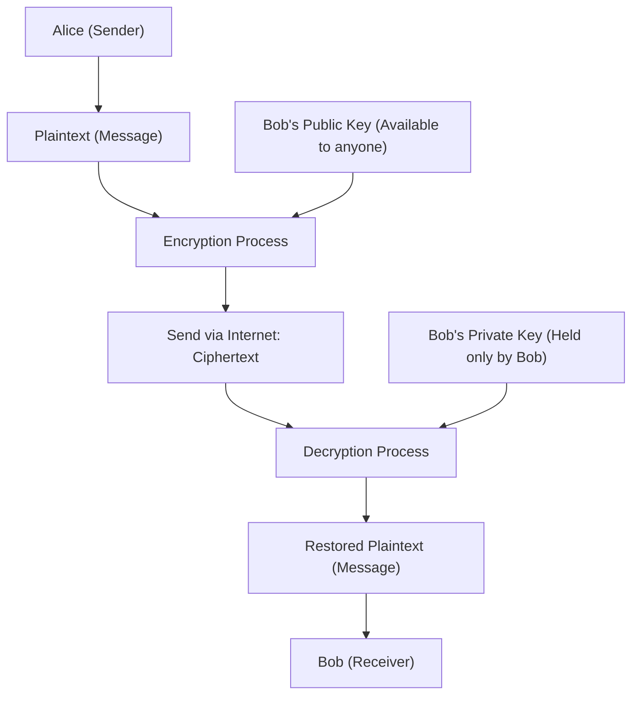
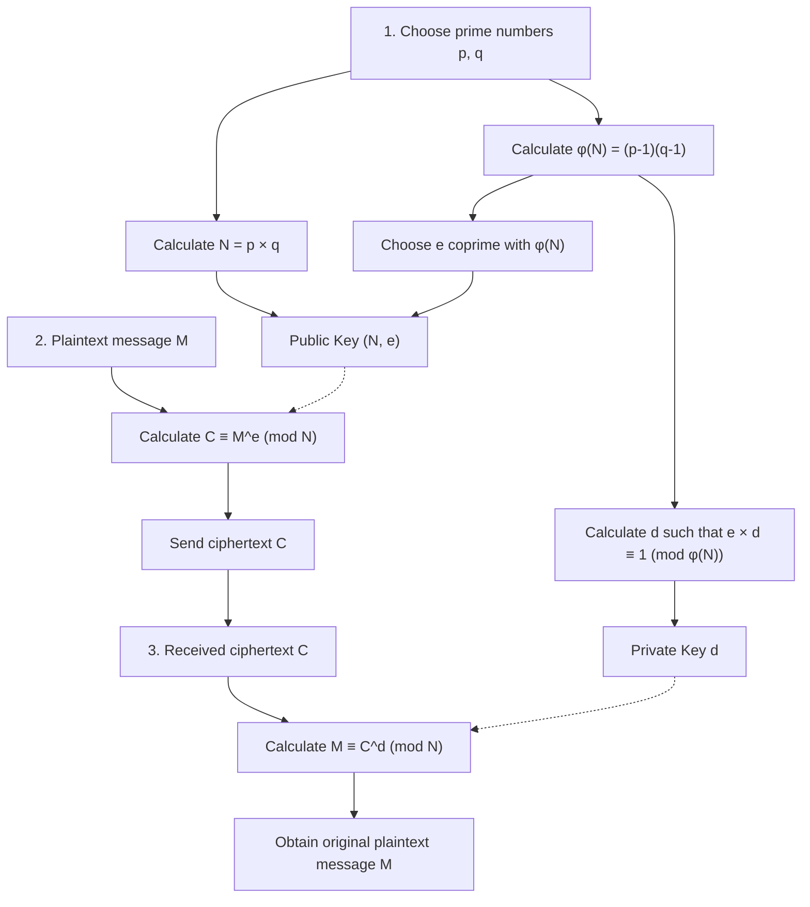
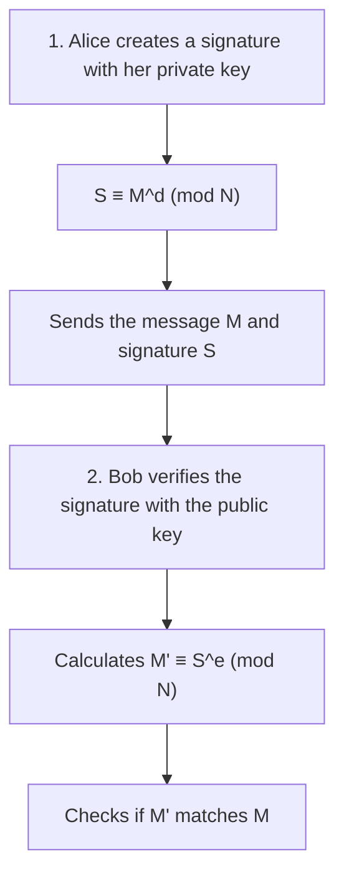

One of the technologies supporting the safety of our internet society from the ground up is "RSA Encryption". Many of the communications we casually use every day, such as credit card payments in online shopping, SNS exchanges with friends, and the transmission/reception of company confidential information, are protected by this RSA encryption and its successor technologies.

However, when you hear the word "cryptography", you might imagine complex cipher machines like those in spy movies, or super advanced mathematics that only a few geniuses can understand. It is true that modern cryptographic theory is based on advanced mathematics, but **the fundamental mechanism of RSA encryption can be fully understood if you have the knowledge of high school mathematics (properties of integers, prime numbers, congruences, etc.)**.

In this article, taking high school math knowledge as a starting point, I will thoroughly explain step-by-step the mathematical principles by which RSA encryption operates and why it is so difficult to crack. I will explain carefully with concrete examples so that even those who are not very good at math can understand.

---

## 1. Symmetric-key and Public-key Cryptography

Before getting into the mathematical mechanisms of RSA encryption, let's first organize the basic ideas of cryptography. Cryptographic methods can be broadly divided into two types: "Symmetric-key Cryptography" and "Public-key Cryptography".

### 1.1 Limitations of Symmetric-key Cryptography

Many of the traditionally used ciphers are what is called the "Symmetric-key Cryptography" method. This is a method that uses **the same key for both "encryption (converting a message into secret ciphertext)" and "decryption (restoring the ciphertext back to the original message)"**.

For example, suppose Alice sends a secret letter to Bob. Alice uses a padlock (symmetric key) to put the letter in a box and lock it. In order for Bob to open that box, he needs to have the exact same key that Alice used.

There is a major problem with this method. It is the "key distribution problem". When Alice and Bob, who are far apart, communicate for the first time, how should they share the key without it being eavesdropped on? If the key is stolen by a third party while being mailed, all subsequent encrypted communications will be completely leaked.

### 1.2 The Breakthrough Invention: "Public-key Cryptography"

"Public-key Cryptography" was invented to solve this key distribution problem. RSA encryption is also one of this kind.

In public-key cryptography, we use **two different keys: a "key for encryption (public key)" and a "key for decryption (private key)"**.

1. The receiver, Bob, creates a pair of "public key" and "private key".
2. Bob publishes the "public key" to the world (it doesn't matter who gets it).
3. The sender, Alice, encrypts her message using Bob's "public key" and sends it.
4. The encrypted message can only be decrypted with the "private key" that only Bob possesses.

Comparing this to padlocks, Bob makes many "open padlocks (public keys)" and scatters them all over the world. Alice puts her message addressed to Bob into a box and snaps it shut using a padlock of Bob's that she picked up. Once the padlock is closed, it can only be opened with the "master key (private key)" that Bob holds. Even if someone steals the box on the way, they cannot open it because they don't have the master key.



In order to realize this epoch-making system, a kind of **"one-way function (a one-way mathematical puzzle)"** is necessary, one where "encryption with the public key is easy, but decryption without the private key is absolutely impossible." What was focused on as a component of that puzzle was the "prime numbers" we all know so well.

---

## 2. The Mathematical Foundation Supporting RSA 1: Prime Numbers and Prime Factorization

The security of RSA encryption is based on the mathematical fact that **"prime factorization of huge numbers is extremely difficult."**

### 2.1 What are Prime Numbers?

A prime number is "a natural number greater than 1 that can only be divided by 1 and itself."
Example: $2, 3, 5, 7, 11, 13, 17, 19, 23...$

Prime numbers are like the "atoms" of all integers. Any natural number can be broken down into the product of prime numbers. This is called **prime factorization**. For example, it is known as the "Fundamental Theorem of Arithmetic" that a number can be uniquely factorized into primes (ignoring order), such as $60 = 2^2 \times 3 \times 5$.

### 2.2 The Difficulty of Prime Factorization (One-way Function)

What's important here is the asymmetry that **"multiplication is easy, but prime factorization is difficult."**

For example, try doing mental arithmetic for the multiplication of the following two prime numbers.
$11 \times 13 = ?$
This is easy. The answer is $143$.

Then, how about the following number?
Please prime factorize $323$.
How is it? It should take a little time. (The answer is $17 \times 19$).

If the numbers are small, humans can manage to calculate them, but as the numbers get larger, it becomes explosively difficult to calculate even using computers. In mainstream RSA encryption today, we use a number $N = p \times q$, which is the product of two incredibly huge prime numbers $p$ and $q$ of 2048 bits (about 600 digits in decimal).

Given two huge prime numbers $p$ and $q$, it takes an instant (less than a millisecond) for a computer to calculate $N$. However, conversely, given only $N$, finding the original $p$ and $q$ takes so much time that even the current fastest supercomputer could not solve it if it ran for trillions of years.

This **"computational asymmetry (one way is easy, the reverse is difficult)"** is the foundation that creates the relationship between the public key and the private key.

---

## 3. The Mathematical Foundation Supporting RSA 2: Congruence (Modulo Arithmetic)

The calculations for RSA encryption are not done with addition or multiplication where numbers grow infinitely like we normally use, but rather in a world of "remainders" after dividing by a certain number. This is called **congruence (modulo arithmetic)**.

### 3.1 Clock Math

Modulo arithmetic is often compared to "clock math". If it is currently 10 o'clock, what time will it be 5 hours from now? $10 + 5 = 15$ o'clock, but on a normal 12-hour clock, we answer "3 o'clock". This is because the remainder of 15 divided by 12 is 3.

In the world of mathematics, this is written as follows:
$$ 15 \equiv 3 \pmod{12} $$
You read this as "15 is congruent to 3 modulo 12 (the remainder when divided by 12 is equal)."

### 3.2 Basic Properties of Congruences

Congruences have very convenient properties very similar to equalities ($=$). Let the modulus (the divisor) be $N$.
When $a \equiv b \pmod N$ and $c \equiv d \pmod N$, the following hold true:

1. **Addition:** $a + c \equiv b + d \pmod N$
2. **Subtraction:** $a - c \equiv b - d \pmod N$
3. **Multiplication:** $a \times c \equiv b \times d \pmod N$
4. **Exponentiation:** $a^k \equiv b^k \pmod N$ ($k$ is a natural number)

Particularly important is the property of "exponentiation". This means that **"the power of a remainder is equal to the remainder of the power"**.
For example, suppose you want to find the remainder of $7^{100}$ divided by $5$. Multiplying $7$ a hundred times and then dividing by $5$ in earnest is very hard, but if you use the properties of congruences, since $7 \equiv 2 \pmod 5$, it becomes $7^{100} \equiv 2^{100} \pmod 5$, and you can drastically simplify the calculation. This property is indispensable in the world of cryptography because we deal with exponentiations of very large numbers.

---

## 4. The Mathematical Foundation Supporting RSA 3: Euler's Totient Function and Euler's Theorem

From here on is the magic mathematics that forms the core of RSA encryption. "Euler's Theorem", a generalization of "Fermat's Little Theorem", makes its appearance.

### 4.1 Euler's Totient Function $\phi(N)$

For a given natural number $N$, Euler's totient function (the $\phi$ function) is a function that returns **"the number of natural numbers from 1 to $N$ that are coprime with $N$ (meaning their greatest common divisor is 1)."**

Let's look at some examples.
- $\phi(5)$: Among 1, 2, 3, 4, 5, the numbers coprime with 5 are 1, 2, 3, 4, which is 4 numbers. Therefore, $\phi(5) = 4$.
- $\phi(6)$: Among 1, 2, 3, 4, 5, 6, the numbers coprime with 6 are 1, 5, which is 2 numbers. Therefore, $\phi(6) = 2$.

**[Special Property in the Case of Prime Numbers]**
If $p$ is a prime number, all numbers from 1 to $p-1$ are coprime with $p$. Therefore,
$$ \phi(p) = p - 1 $$

**[Special Property in the Case of the Product of Prime Numbers]**
For two distinct prime numbers $p$ and $q$, if $N = p \times q$, $\phi(N)$ can be easily calculated as follows.
$$ \phi(N) = \phi(p) \times \phi(q) = (p - 1)(q - 1) $$
This property functions as the "secret backdoor (trapdoor)" in RSA encryption. The person who knows $p$ and $q$ (the creator of the key) can calculate $\phi(N)$ instantly, but a third party who only knows $N$ cannot determine $\phi(N)$ unless they prime factorize $N$.

### 4.2 Euler's Theorem

Leonhard Euler used this $\phi(N)$ to prove the following beautiful theorem.

**Euler's Theorem:**
When the integer $a$ and $N$ are coprime, the following congruence holds.
$$ a^{\phi(N)} \equiv 1 \pmod N $$

This is an amazing property that says, "If you multiply a number $a$ by itself $\phi(N)$ times and divide by $N$, the remainder will always be $1$." (When $N$ is a prime number $p$, it becomes $a^{p-1} \equiv 1 \pmod p$, which is called Fermat's Little Theorem).

Let's modify this Euler's Theorem. Multiply both sides by $a$ one more time.
$$ a^{\phi(N) + 1} \equiv a \pmod N $$

Furthermore, for any integer $k$, since $a^{k \cdot \phi(N)}$ also becomes $1^k = 1$, the following equation holds.
$$ a^{k \cdot \phi(N) + 1} \equiv a \pmod N $$

This very equation is the fundamental principle that makes the magic of RSA encryption work: **"If you encrypt and then decrypt, it returns to the original."**

---

## 5. The RSA Algorithm: Steps for Key Generation, Encryption, and Decryption

Now that we have the basic knowledge, let's finally look at the specific steps of RSA encryption. RSA encryption is roughly divided into three phases: "1. Key Generation," "2. Encryption," and "3. Decryption."



### 5.1 Key Generation

The receiver, Bob, generates a "public key" and a "private key" for himself.

1. **Choice of Primes:** Randomly choose two large prime numbers $p$ and $q$.
2. **Calculation of Modulus $N$:** Calculate $N = p \times q$. This $N$ is made public.
3. **Calculation of $\phi(N)$:** Calculate Euler's function $\phi(N) = (p - 1)(q - 1)$. This is a secret number only Bob knows.
4. **Choice of Public Key $e$:** Choose an integer $e$ such that $1 < e < \phi(N)$ and $e$ is coprime with $\phi(N)$.
5. **Calculation of Private Key $d$:** Find an integer $d$ that satisfies the following condition.
   $$ e \times d \equiv 1 \pmod{\phi(N)} $$
   In other words, this is "a number $d$ such that the remainder is $1$ when $e \times d$ is divided by $\phi(N)$."

Now the key preparation is complete.
- **Public Key:** The pair $(N, e)$. It is published to the whole world.
- **Private Key:** $d$. Never tell anyone under any circumstances.

### 5.2 Encryption

Suppose Alice wants to send a secret message $M$ to Bob. (Let $M$ be a number formed by digitizing characters, and assume $0 \le M < N$). Alice calculates as follows using Bob's public key $(N, e)$.

$$ C \equiv M^e \pmod N $$

She calculates "the remainder $C$ when message $M$ is raised to the power of $e$, divided by $N$". This $C$ is the ciphertext.

### 5.3 Decryption

Bob receives the ciphertext $C$. Bob calculates as follows using his private key $d$.

$$ M \equiv C^d \pmod N $$

By calculating "the remainder when ciphertext $C$ is raised to the power of $d$, divided by $N$", amazingly, the original message $M$ is restored!

---

## 6. Why Does Decryption Revert it to the Original? (Mathematical Proof)

You might be wondering, "Why does simply raising $C$ to the power of $d$ return it to the original $M$?" This is where the aforementioned "Euler's Theorem" demonstrates its power.

Let's substitute the encryption formula $C = M^e$ into the decryption calculation formula $C^d \pmod N$.
$$ C^d \equiv (M^e)^d \equiv M^{ed} \pmod N $$

Here, recall Step 5 of the key generation. When Bob made $d$, he chose it so that $e \times d \equiv 1 \pmod{\phi(N)}$. This means "the number $ed$ is a multiple of $\phi(N)$ plus $1$." Using an integer $k$, it can be written as follows:
$$ ed = k \cdot \phi(N) + 1 $$

Substitute this into the exponent part, and decompose it using exponent rules.
$$ M^{ed} = M^{k \cdot \phi(N) + 1} = M^{k \cdot \phi(N)} \times M^1 = (M^{\phi(N)})^k \times M $$

Here, assuming that the message $M$ and $N$ are coprime, from **Euler's Theorem**, we get $M^{\phi(N)} \equiv 1 \pmod N$.
$$ (M^{\phi(N)})^k \times M \equiv 1^k \times M \equiv M \pmod N $$

Therefore, the following formula beautifully holds true.
$$ C^d \equiv M \pmod N $$

Alice does not know $d$, and an eavesdropper does not know $d$ either, so only Bob, who has $d$, can extract $M$ from $C$.

---

## 7. Concrete Example: Experiencing RSA by Hand Calculation Using Small Primes

Let's actually try encrypted communication from Alice to Bob using small numbers (prime numbers).

**[Bob's Key Generation Phase]**
1. Choose two prime numbers $p=11$, $q=13$.
2. Calculate $N = 11 \times 13 = 143$.
3. Calculate $\phi(N) = (11 - 1) \times (13 - 1) = 10 \times 12 = 120$.
4. Choose a public key $e$ that is coprime with $\phi(N)=120$. Here we will use $e=7$.
5. Find the private key $d$. Look for $d$ such that $7 \times d \equiv 1 \pmod{120}$.
   In the equation $7d = 120k + 1$, when $k=6$, it becomes $721$, and $721 \div 7 = 103$.
   Therefore, $d = 103$.

- Public Key: $(N=143, e=7)$
- Private Key: $d=103$

**[Alice's Encryption Phase]**
Suppose she wants to send the message $M = 9$.
Formula: $C \equiv 9^7 \pmod{143}$
$9^7 = 4,782,969$. Dividing this by 143 gives $33447$ with a remainder of $48$.
The ciphertext became $C = 48$.

**[Bob's Decryption Phase]**
Bob receives the ciphertext $C = 48$ and decrypts it using his private key $d = 103$.
Formula: $M \equiv 48^{103} \pmod{143}$
If you run `(48 ** 103) % 143` on a calculator, the result wonderfully turns out to be "**9**"! The original message was successfully received.

---

## 8. How to Find the Private Key $d$: Extended Euclidean Algorithm

In the hand calculation example, we found $d=103$ by guessing to find $k$, but this method is impossible when the numbers are hundreds of digits long. In actual programs, an algorithm called the **"Extended Euclidean Algorithm"** is used.

Solving $7d \equiv 1 \pmod{120}$ is the same as finding integers $d, y$ that satisfy $7d + 120y = 1$. By working backwards through the Euclidean Algorithm, this can be calculated mechanically.

1. $120 \div 7 = 17$ remainder $1$ 
2. Transforming this, $1 = 120 - 17 \times 7$
3. In other words, $-17 \times 7 \equiv 1 \pmod{120}$

In the world of modulo $120$, $-17$ has the same meaning as $120 - 17 = 103$. Therefore, $d = 103$ is found in an instant. This method can calculate very quickly no matter how huge the numbers are.

---

## 9. Another Face of RSA Encryption: Digital Signatures

The wonderful thing about RSA encryption is that it can also be used as a **"digital signature"** by reversing the roles of the public and private keys.

When encrypting, it was "Encrypt with public key $\Rightarrow$ Decrypt with private key", but
for digital signatures, it takes the steps "Encrypt with private key $\Rightarrow$ Decrypt with public key".



Alice transforms the message using her own private key $d$ (this is the signature $S$), and sends it to Bob. Bob performs the verification calculation using Alice's public key $e$. If the calculation result matches the original message, it simultaneously proves that "it is data that could only be created with Alice's private key" and that "the message has not been tampered with along the way".

---

## 10. Experiencing RSA Encryption with Programming

Exponentiation calculations that are tough by hand can be implemented very easily using Python. Below is a Python code that lets you experience the core logic of RSA encryption.

```python
def gcd(a, b):
    """Find the greatest common divisor"""
    while b != 0:
        a, b = b, a % b
    return a

def mod_inverse(e, phi):
    """Find the private key d (using built-in feature in Python 3.8+)"""
    return pow(e, -1, phi)

# 1. Key Generation
p, q = 11, 13
N = p * q
phi = (p - 1) * (q - 1)
e = 7
d = mod_inverse(e, phi)

print(f"Public Key: (N={N}, e={e}), Private Key: d={d}")

# 2. Encryption
message = 9
ciphertext = pow(message, e, N)
print(f"Ciphertext: {ciphertext}")

# 3. Decryption
decrypted_message = pow(ciphertext, d, N)
print(f"Decrypted Message: {decrypted_message}")
```

Python's `pow(base, exp, mod)` function internally uses a fast algorithm called "Exponentiation by squaring", so calculations finish in an instant even for numbers with hundreds of digits.

---

## 11. Conclusion and Future Cryptographic Technology

Based on the knowledge of high school mathematics, we have uncovered how RSA encryption works.

1. **Difficulty of Prime Factorization:** $p \times q = N$ is easy, but finding $p, q$ from $N$ is extremely difficult.
2. **Congruence and Euler's Theorem:** With the rule $a^{\phi(N)} \equiv 1 \pmod N$, the magic trapdoor "raising to a certain power brings it back to the original" is completed.
3. **Public and Private Keys:** Anyone can encrypt, but only the legitimate receiver can decrypt.

The $N$ in currently used RSA encryption has over 600 digits, and even mobilizing all the supercomputers in the world, prime factorization would take more time than the age of the universe. However, when the "quantum computers" currently being researched become practical in the future, there is a possibility that this prime factorization will be solved in an instant by "Shor's algorithm". For this reason, the development of "Post-quantum cryptography" that cannot be cracked even by quantum computers is progressing rapidly worldwide.

Advanced mathematics, which is often thought of as "useless," is actually protecting our daily lives from the ground up. RSA encryption is the best teaching material to show us the depth and beauty of such mathematics. I hope this article has helped you feel the fascination of cryptography and mathematics, even just a little.
