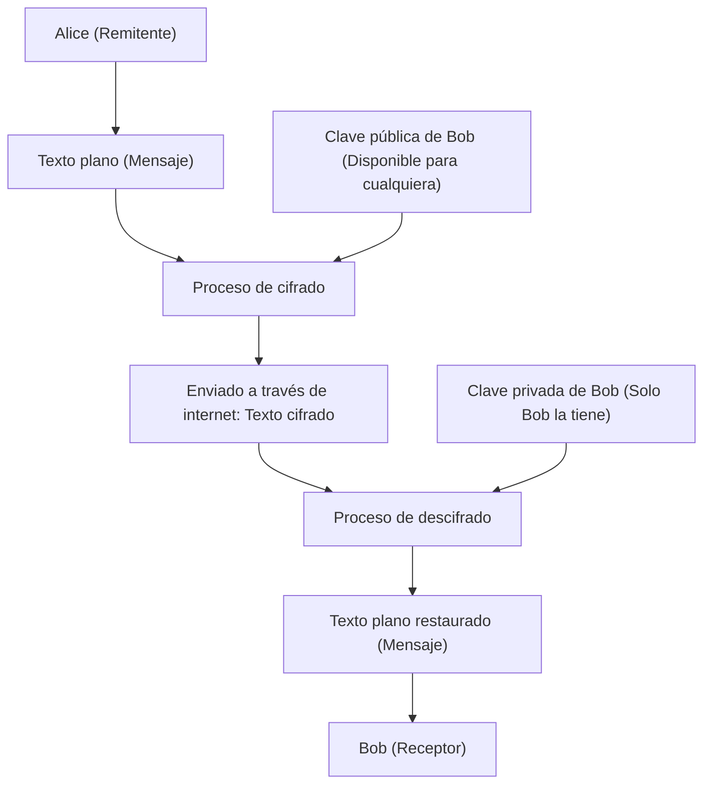
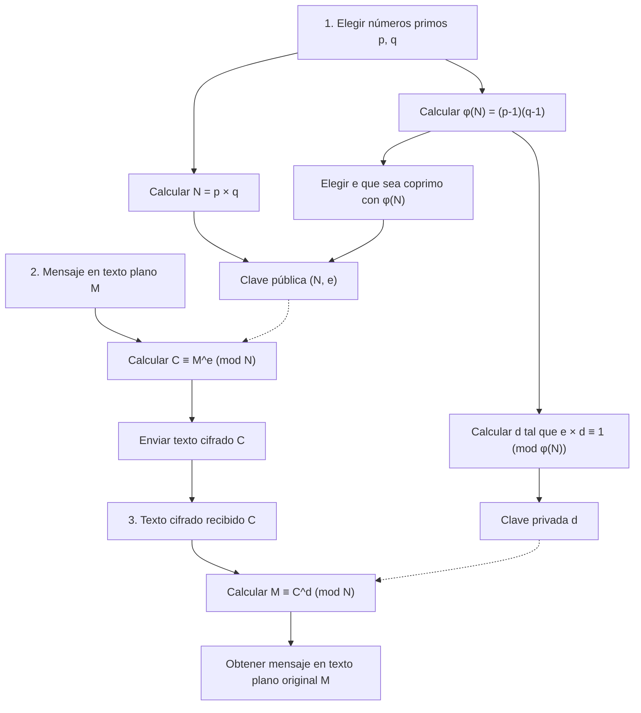
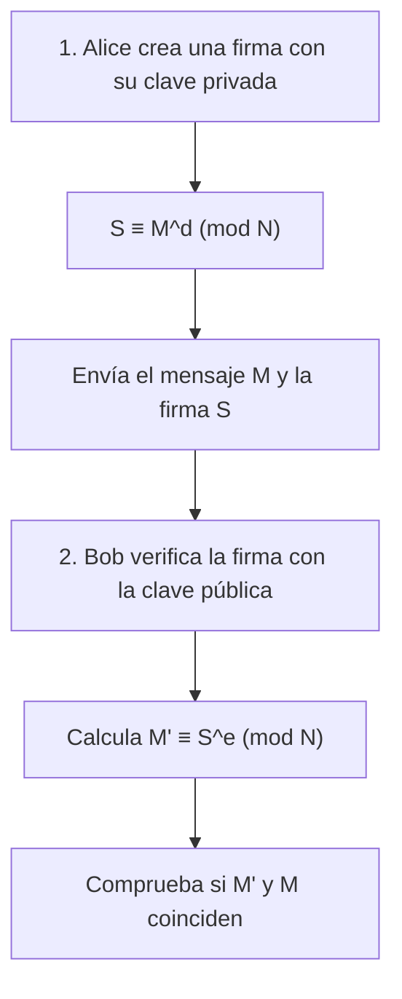

Una de las tecnologías que sustenta la seguridad de la sociedad de internet desde su base es el "cifrado RSA". Gran parte de las comunicaciones que usamos casualmente todos los días, como los pagos con tarjeta de crédito en compras en línea, los intercambios de mensajes en redes sociales con amigos y el envío o recepción de información confidencial de las empresas, están protegidas por este cifrado RSA o sus tecnologías sucesoras.

Sin embargo, al escuchar "cifrado", podrías imaginar máquinas de cifrado complejas como las que aparecen en las películas de espías, o matemáticas súper avanzadas que solo un puñado de genios puede entender. Es cierto que la teoría criptográfica moderna se basa en matemáticas avanzadas, pero **el mecanismo fundamental del cifrado RSA se puede entender perfectamente si tienes conocimientos de las matemáticas que se aprenden en la escuela secundaria (propiedades de los números enteros, números primos, congruencias, etc.)**.

En este artículo, tomando como punto de partida los conocimientos de matemáticas de secundaria, explicaremos exhaustivamente y paso a paso en qué principios matemáticos opera el cifrado RSA y por qué es tan difícil de descifrar. Explicaremos cuidadosamente con ejemplos concretos para que incluso aquellos a los que no se les dan muy bien las matemáticas puedan entenderlo.

---

## 1. Cifrado de clave simétrica y cifrado de clave pública

Antes de entrar en el mecanismo matemático del cifrado RSA, primero organicemos el concepto básico de la criptografía. Los sistemas criptográficos se dividen a grandes rasgos en dos tipos: "cifrado de clave simétrica" y "cifrado de clave pública".

### 1.1 Limitaciones del cifrado de clave simétrica

Muchos de los cifrados que se han utilizado desde la antigüedad son lo que se llama "sistemas de cifrado de clave simétrica". Este es un sistema donde **se usa la misma clave para "cifrar (convertir un mensaje en un texto cifrado secreto)" y para "descifrar (devolver el texto cifrado al mensaje original)"**.

Por ejemplo, supongamos que Alice envía una carta secreta a Bob. Alice pone la carta en una caja y la cierra usando un candado (clave simétrica). Para que Bob pueda abrir esa caja, necesita tener la misma clave que usó Alice.

Este sistema tiene un gran problema: "El problema de la distribución de claves". Cuando Alice y Bob, que están muy lejos, se comunican por primera vez, ¿cómo pueden compartir la clave sin que sea interceptada? Si la clave es robada por un tercero mientras se envía por correo, todas las comunicaciones cifradas posteriores quedarán completamente expuestas.

### 1.2 Un invento revolucionario: "Sistema de cifrado de clave pública"

Para resolver este problema de distribución de claves, se ideó el "sistema de cifrado de clave pública". El cifrado RSA también es un tipo de este sistema.

En el sistema de cifrado de clave pública, **se utilizan dos claves diferentes: "una clave para cifrar (clave pública)" y "una clave para descifrar (clave privada)"**.

1. El receptor, Bob, crea un par de "clave pública" y "clave privada".
2. Bob publica la "clave pública" al mundo entero (no importa quién la obtenga).
3. La remitente, Alice, cifra el mensaje usando la "clave pública" de Bob y lo envía.
4. El mensaje cifrado solo puede ser descifrado con la "clave privada" que únicamente Bob posee.

Usando la analogía del candado, Bob fabrica muchos "candados abiertos (clave pública)" y los esparce por todo el mundo. Alice pone el mensaje dirigido a Bob en una caja y la cierra usando uno de los candados que encontró de Bob. Una vez que el candado se cierra, solo se puede abrir con la "llave maestra (clave privada)" que tiene Bob. Aunque alguien robe la caja en el camino, no podrá abrirla sin la llave maestra.



Para hacer realidad este revolucionario sistema, se necesita una especie de **"función unidireccional (un rompecabezas matemático de un solo sentido)"** que signifique "es fácil cifrar con la clave pública, pero es absolutamente imposible descifrar sin la clave privada". Las piezas del rompecabezas elegidas para esto fueron los conocidos "números primos".

---

## 2. Fundamento matemático 1 que sustenta el cifrado RSA: Números primos y factorización en números primos

La seguridad del cifrado RSA se basa en el hecho matemático de que **"la factorización en números primos de números gigantescos es extremadamente difícil"**.

### 2.1 Qué son los números primos

Los números primos son "números naturales mayores que 1 que solo se pueden dividir exactamente por 1 y por sí mismos".
Ejemplo: $2, 3, 5, 7, 11, 13, 17, 19, 23...$

Los números primos son como los "átomos" de todos los números enteros. Cualquier número natural se puede descomponer en forma de multiplicación de números primos. A esto se le llama **factorización en números primos**. Por ejemplo, ignorando el orden, se sabe que cualquier número se puede factorizar de una sola manera, como $60 = 2^2 \times 3 \times 5$; esto se conoce como el "Teorema fundamental de la aritmética".

### 2.2 La dificultad de la factorización en números primos (Función unidireccional)

Lo importante aquí es la asimetría: **"multiplicar es fácil, pero factorizar es difícil"**.

Por ejemplo, intenta calcular mentalmente la siguiente multiplicación de dos números primos:
$11 \times 13 = ?$
Es fácil, ¿verdad? La respuesta es $143$.

Ahora, ¿qué tal el siguiente número?
Factoriza $323$ en números primos.
¿Cómo te va? Seguramente te tomará un poco de tiempo. (La respuesta es $17 \times 19$).

Si los números son pequeños, un humano puede calcularlos de alguna manera, pero cuando los números se vuelven grandes, calcularlos se vuelve explosivamente difícil, incluso usando computadoras. En el cifrado RSA dominante actual, se utiliza un número $N = p \times q$ que es el resultado de multiplicar dos números primos colosales de 2048 bits (aproximadamente 600 dígitos en base 10), $p$ y $q$.

Cuando se dan dos números primos gigantes $p$ y $q$, calcular $N$ toma solo un instante (menos de un milisegundo) para una computadora. Sin embargo, a la inversa, si solo se da $N$, encontrar los $p$ y $q$ originales tomaría tanto tiempo que ni siquiera la supercomputadora más rápida actual podría resolverlo en billones de años.

Esta **"asimetría del cálculo (el camino de ida es fácil, el de vuelta es difícil)"** se convierte en la base que crea la relación entre la clave pública y la clave privada.

---

## 3. Fundamento matemático 2 que sustenta el cifrado RSA: Congruencias (Aritmética modular)

Los cálculos del cifrado RSA no se realizan en el mundo de las sumas y multiplicaciones habituales donde los números crecen infinitamente, sino en el mundo del "resto" después de dividir por un número determinado. A esto se le llama **congruencia (aritmética modular)**.

### 3.1 Las matemáticas del reloj

La aritmética modular a menudo se compara con las "matemáticas del reloj". Si ahora son las 10, ¿qué hora será 5 horas después? $10 + 5 = 15$ en punto, pero en un reloj normal de 12 horas, respondemos "las 3". Esto se debe a que el resto de dividir 15 entre 12 es 3.

En el mundo de las matemáticas, esto se escribe de la siguiente manera:
$$ 15 \equiv 3 \pmod{12} $$
Se lee como "15 es congruente con 3 módulo 12 (el resto de dividirlos por 12 es igual)".

### 3.2 Propiedades básicas de las congruencias

Las congruencias tienen propiedades muy útiles y similares a las ecuaciones ($=$). Sea $N$ el módulo (número divisor).
Cuando $a \equiv b \pmod N$ y $c \equiv d \pmod N$, se cumple lo siguiente:

1. **Suma:** $a + c \equiv b + d \pmod N$
2. **Resta:** $a - c \equiv b - d \pmod N$
3. **Multiplicación:** $a \times c \equiv b \times d \pmod N$
4. **Potenciación:** $a^k \equiv b^k \pmod N$ ($k$ es un número natural)

Especialmente importante es la propiedad de la "potenciación". Esto significa que **"el resto de una potencia es igual a la potencia del resto"**.
Por ejemplo, supongamos que queremos encontrar el resto de dividir $7^{100}$ entre $5$. Sería muy difícil multiplicar $7$ cien veces y luego dividirlo entre $5$, pero usando la propiedad de las congruencias, como $7 \equiv 2 \pmod 5$, entonces $7^{100} \equiv 2^{100} \pmod 5$, lo que simplifica drásticamente el cálculo. Dado que en el mundo de la criptografía se manejan potencias de números muy grandes, esta propiedad es indispensable.

---

## 4. Fundamento matemático 3 que sustenta el cifrado RSA: La función de Euler y el Teorema de Euler

A partir de aquí entran las matemáticas mágicas que son el núcleo del cifrado RSA. Aparece el "Teorema de Euler", que es una generalización del "Pequeño teorema de Fermat".

### 4.1 La función indicatriz de Euler $\phi(N)$

La función indicatriz de Euler (función $\phi$) es una función que, para un número natural dado $N$, devuelve **"la cantidad de números naturales desde el 1 hasta $N$ que son coprimos (su máximo común divisor es 1) con $N$"**.

Veamos algunos ejemplos:
- $\phi(5)$: Entre 1, 2, 3, 4, 5, los que son coprimos con 5 son 1, 2, 3 y 4 (son 4 números). Por lo tanto, $\phi(5) = 4$.
- $\phi(6)$: Entre 1, 2, 3, 4, 5, 6, los que son coprimos con 6 son 1 y 5 (son 2 números). Por lo tanto, $\phi(6) = 2$.

**[Propiedad especial en el caso de números primos]**
Si $p$ es un número primo, todos los números del 1 al $p-1$ son coprimos con $p$. Por lo tanto,
$$ \phi(p) = p - 1 $$

**[Propiedad especial en el caso del producto de números primos]**
Para dos números primos diferentes $p$ y $q$, si definimos $N = p \times q$, $\phi(N)$ se puede calcular fácilmente de la siguiente manera:
$$ \phi(N) = \phi(p) \times \phi(q) = (p - 1)(q - 1) $$
Esta propiedad funciona como la "puerta trasera secreta (trapdoor)" del cifrado RSA. Una persona (el creador de la clave) que conoce $p$ y $q$ puede calcular $\phi(N)$ en un instante, pero un tercero que solo conoce $N$ no puede encontrar $\phi(N)$ a menos que factorice $N$ en números primos.

### 4.2 El Teorema de Euler

Leonhard Euler demostró un teorema hermoso usando esta $\phi(N)$.

**Teorema de Euler:**
Cuando dos enteros $a$ y $N$ son coprimos, se cumple la siguiente congruencia:
$$ a^{\phi(N)} \equiv 1 \pmod N $$

Esta es una propiedad sorprendente que dice que "si multiplicas un número $a$ por sí mismo $\phi(N)$ veces y lo divides por $N$, el resto siempre será $1$". (Cuando $N$ es un número primo $p$, se convierte en $a^{p-1} \equiv 1 \pmod p$, lo que se conoce como el Pequeño teorema de Fermat).

Modifiquemos este teorema de Euler. Multiplicamos ambos lados por $a$ una vez más:
$$ a^{\phi(N) + 1} \equiv a \pmod N $$

Además, para cualquier entero $k$, dado que $a^{k \cdot \phi(N)}$ también se convierte en $1^k = 1$, se cumple la siguiente ecuación:
$$ a^{k \cdot \phi(N) + 1} \equiv a \pmod N $$

¡Esta fórmula es precisamente el principio fundamental que hace posible la magia del cifrado RSA de **"volver al estado original al cifrar y descifrar"**!

---

## 5. El algoritmo del cifrado RSA: Pasos de generación de claves, cifrado y descifrado

Ahora que tenemos los conocimientos básicos, veamos los pasos específicos del cifrado RSA. El cifrado RSA se divide a grandes rasgos en tres fases: "1. Generación de claves", "2. Cifrado" y "3. Descifrado".



### 5.1 Generación de claves (Key Generation)

El receptor, Bob, genera su propia "clave pública" y "clave privada".

1. **Selección de números primos:** Elige dos números primos grandes $p$ y $q$ al azar.
2. **Cálculo del módulo $N$:** Calcula $N = p \times q$. Este $N$ se hará público.
3. **Cálculo de $\phi(N)$:** Calcula la función de Euler $\phi(N) = (p - 1)(q - 1)$. Este es un número secreto solo de Bob.
4. **Selección de la clave pública $e$:** Elige un entero $e$ tal que $1 < e < \phi(N)$ y que sea coprimo con $\phi(N)$.
5. **Cálculo de la clave privada $d$:** Encuentra un entero $d$ que cumpla la siguiente condición:
   $$ e \times d \equiv 1 \pmod{\phi(N)} $$
   En otras palabras, es "un número $d$ tal que al dividir $e \times d$ entre $\phi(N)$, el resto es $1$".

Con esto, la preparación de las claves está completa.
- **Clave pública:** El par $(N, e)$. Se hace pública a todo el mundo.
- **Clave privada:** $d$. No se le dice absolutamente a nadie.

### 5.2 Cifrado (Encryption)

Supongamos que Alice quiere enviarle a Bob el mensaje secreto $M$. (Donde $M$ es el texto convertido en un número y $0 \le M < N$). Alice calcula lo siguiente usando la clave pública de Bob $(N, e)$:

$$ C \equiv M^e \pmod N $$

Calcula "el resto $C$ de dividir el mensaje $M$ elevado a la potencia de $e$ entre $N$". Este $C$ es el texto cifrado.

### 5.3 Descifrado (Decryption)

Bob recibe el texto cifrado $C$. Bob calcula lo siguiente usando la clave privada $d$:

$$ M \equiv C^d \pmod N $$

¡Al calcular "el resto de dividir el texto cifrado $C$ elevado a la potencia de $d$ entre $N$", mágicamente se restaura el mensaje original $M$!

---

## 6. ¿Por qué el descifrado devuelve el texto original? (Demostración matemática)

Quizás te preguntes, "¿Por qué al elevar $C$ a la potencia de $d$ se vuelve al $M$ original?". Aquí es donde el "Teorema de Euler" mencionado antes demuestra su poder.

Sustituyamos la fórmula de cifrado $C = M^e$ en la fórmula de cálculo de descifrado $C^d \pmod N$.
$$ C^d \equiv (M^e)^d \equiv M^{ed} \pmod N $$

Aquí, recuerda el paso 5 de la generación de claves. Cuando Bob creó $d$, lo eligió para que $e \times d \equiv 1 \pmod{\phi(N)}$. Esto significa que "$ed$ es un múltiplo de $\phi(N)$ más $1$". Usando un número entero $k$, se puede escribir de la siguiente manera:
$$ ed = k \cdot \phi(N) + 1 $$

Sustituimos esto en la parte del exponente y lo descomponemos usando las leyes de los exponentes:
$$ M^{ed} = M^{k \cdot \phi(N) + 1} = M^{k \cdot \phi(N)} \times M^1 = (M^{\phi(N)})^k \times M $$

Aquí, asumiendo que el mensaje $M$ y $N$ son coprimos, según el **Teorema de Euler**, $M^{\phi(N)} \equiv 1 \pmod N$.
$$ (M^{\phi(N)})^k \times M \equiv 1^k \times M \equiv M \pmod N $$

Por lo tanto, la siguiente fórmula se cumple perfectamente:
$$ C^d \equiv M \pmod N $$

Dado que Alice no conoce $d$ y un espía tampoco conoce $d$, ¡el único que puede extraer $M$ de $C$ es Bob, que tiene $d$!

---

## 7. Ejemplo concreto: Experimentemos el RSA calculando a mano con números primos pequeños

Intentemos comunicarnos de forma cifrada desde Alice a Bob utilizando números pequeños (números primos) reales.

**[Fase de generación de claves de Bob]**
1. Elige dos números primos $p=11$, $q=13$.
2. Calcula $N = 11 \times 13 = 143$.
3. Calcula $\phi(N) = (11 - 1) \times (13 - 1) = 10 \times 12 = 120$.
4. Elige una clave pública $e$ coprima con $\phi(N)=120$. Aquí elegimos $e=7$.
5. Calcula la clave privada $d$. Buscamos $d$ tal que $7 \times d \equiv 1 \pmod{120}$.
   En la ecuación $7d = 120k + 1$, cuando $k=6$, esto es $721$, y $721 \div 7 = 103$.
   Por lo tanto, $d = 103$.

- Clave pública: $(N=143, e=7)$
- Clave privada: $d=103$

**[Fase de cifrado de Alice]**
Supongamos que queremos enviar el mensaje $M = 9$.
Fórmula: $C \equiv 9^7 \pmod{143}$
$9^7 = 4,782,969$. Dividiendo esto por 143, da $33447$ con un resto de $48$.
El texto cifrado resultó ser $C = 48$.

**[Fase de descifrado de Bob]**
Bob recibe el texto cifrado $C = 48$ y lo descifra usando la clave privada $d = 103$.
Fórmula: $M \equiv 48^{103} \pmod{143}$
Si ejecutas `(48 ** 103) % 143` en una calculadora, ¡el resultado es espectacularmente "**9**"! Pudo recibir el mensaje original sin problemas.

---

## 8. Cómo calcular la clave privada $d$: Algoritmo de Euclides extendido

En el ejemplo de cálculo a mano, buscamos $k$ por intuición para encontrar $d=103$, pero cuando los números tienen cientos de dígitos, este método es imposible. En los programas reales, se utiliza un algoritmo llamado **"Algoritmo de Euclides extendido"**.

Resolver $7d \equiv 1 \pmod{120}$ es lo mismo que encontrar enteros $d, y$ que cumplan con $7d + 120y = 1$. Se puede encontrar esto mecánicamente haciendo el proceso inverso del algoritmo de Euclides.

1. $120 \div 7 = 17$ con resto $1$ 
2. Transformando esto, $1 = 120 - 17 \times 7$
3. En otras palabras, $-17 \times 7 \equiv 1 \pmod{120}$

$-17$ significa lo mismo que $120 - 17 = 103$ en el mundo del módulo $120$. Por lo tanto, $d = 103$ se encuentra en un instante. Este método puede calcular muy rápido sin importar cuán gigante sea el número.

---

## 9. Otra cara del cifrado RSA: Firmas digitales

Lo maravilloso del cifrado RSA es que, invirtiendo los roles de la clave pública y la clave privada, también se puede utilizar como **"firma digital"**.

En el cifrado, era "cifrar con clave pública $\Rightarrow$ descifrar con clave privada", pero
en las firmas digitales, se siguen los pasos de "cifrar con clave privada $\Rightarrow$ descifrar con clave pública".



Alice convierte un mensaje utilizando su propia clave privada $d$ (esta es la firma $S$) y lo envía a Bob. Bob utiliza la clave pública de Alice $e$ para calcular la verificación. Si el resultado del cálculo coincide con el mensaje original, se prueba simultáneamente que "son datos que solo se pueden crear con la clave privada de Alice" y que "el mensaje no ha sido alterado en el camino".

---

## 10. Experimentando el cifrado RSA con programación

El cálculo de potencias, que es difícil de hacer a mano, se puede implementar muy fácilmente utilizando Python. El siguiente es un código de Python que permite experimentar la lógica central del cifrado RSA.

```python
def gcd(a, b):
    """Calcular el máximo común divisor"""
    while b != 0:
        a, b = b, a % b
    return a

def mod_inverse(e, phi):
    """Encontrar la clave privada d (Usando la función integrada desde Python 3.8)"""
    return pow(e, -1, phi)

# 1. Generación de claves
p, q = 11, 13
N = p * q
phi = (p - 1) * (q - 1)
e = 7
d = mod_inverse(e, phi)

print(f"Clave pública: (N={N}, e={e}), Clave privada: d={d}")

# 2. Cifrado
message = 9
ciphertext = pow(message, e, N)
print(f"Texto cifrado: {ciphertext}")

# 3. Descifrado
decrypted_message = pow(ciphertext, d, N)
print(f"Mensaje descifrado: {decrypted_message}")
```

La función `pow(base, exp, mod)` de Python utiliza internamente un algoritmo rápido llamado "exponenciación binaria" (repetir cuadrados), por lo que incluso con números de cientos de dígitos, el cálculo finaliza en un instante.

---

## 11. Resumen y futuras tecnologías criptográficas

Hemos desentrañado el mecanismo del cifrado RSA basándonos en los conocimientos de matemáticas de secundaria.

1. **La dificultad de la factorización en números primos:** $p \times q = N$ es fácil, pero encontrar $p, q$ a partir de $N$ es muy difícil.
2. **Congruencias y el Teorema de Euler:** A través de la ley $a^{\phi(N)} \equiv 1 \pmod N$, se completa la puerta trasera mágica que dice "al elevar a una potencia con un número determinado, se vuelve al original".
3. **Clave pública y clave privada:** Cualquiera puede cifrar, pero solo el receptor legítimo puede descifrar.

El $N$ del cifrado RSA utilizado actualmente tiene más de 600 dígitos, y tomaría más tiempo que la edad del universo factorizarlo en números primos, incluso si se movilizaran todas las supercomputadoras del mundo. Sin embargo, si la "computadora cuántica", cuya investigación ha avanzado en los últimos años, se vuelve práctica en el futuro, existe la posibilidad de que esta factorización en números primos se resuelva en un instante mediante el "algoritmo de Shor". Por lo tanto, actualmente se está avanzando a un ritmo acelerado en todo el mundo en el desarrollo de la "criptografía poscuántica" que ni siquiera las computadoras cuánticas puedan descifrar.

Las matemáticas avanzadas, que a menudo se consideran "inútiles", en realidad protegen nuestra vida diaria desde su base. El cifrado RSA es el mejor material de enseñanza que nos enseña esa profundidad y belleza de las matemáticas. Sería genial si pudieras sentir, aunque sea un poco, la diversión de la criptografía y las matemáticas a través de este artículo.
