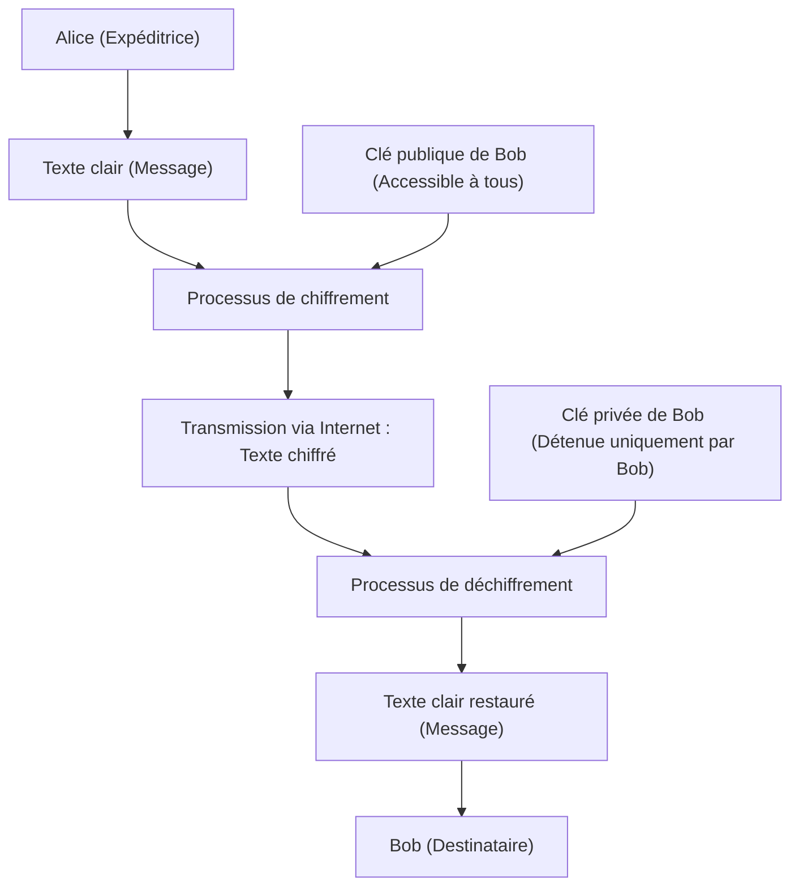
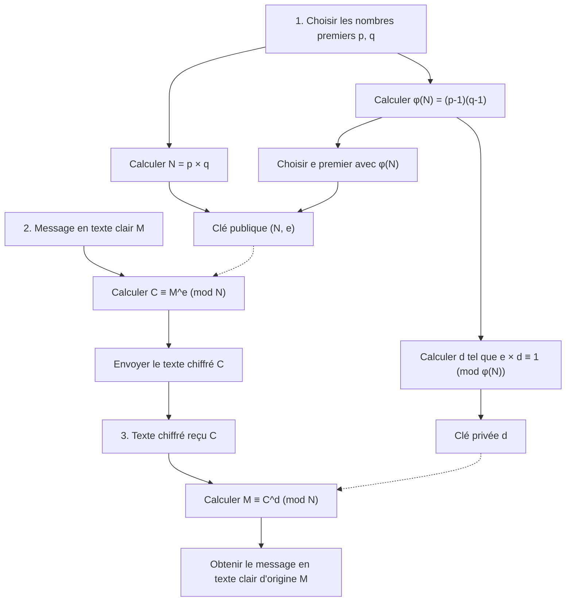
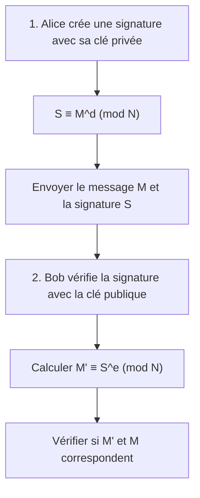

L'une des technologies qui soutient fondamentalement la sécurité de la société Internet est la « cryptographie RSA ». La plupart des communications que nous utilisons négligemment chaque jour, telles que les paiements par carte de crédit lors des achats en ligne, les échanges sur les réseaux sociaux avec des amis, ou l'envoi et la réception d'informations confidentielles d'entreprise, sont protégées par cette cryptographie RSA ou par ses technologies successives.

Cependant, lorsque l'on entend le mot « cryptographie », on peut imaginer des machines de chiffrement complexes comme celles des films d'espionnage, ou des mathématiques super avancées que seuls quelques génies peuvent comprendre. S'il est vrai que la théorie cryptographique moderne repose sur des mathématiques avancées, **le mécanisme fondamental de la cryptographie RSA peut être pleinement compris avec des connaissances mathématiques acquises au lycée (propriétés des entiers, nombres premiers, congruences, etc.)**.

Dans cet article, en partant des connaissances mathématiques du lycée, nous expliquerons étape par étape et de manière exhaustive les principes mathématiques sur lesquels repose la cryptographie RSA et pourquoi son décryptage est si difficile. Nous l'expliquerons soigneusement avec des exemples concrets pour que même ceux qui ne sont pas très à l'aise avec les mathématiques puissent comprendre.

---

## 1. Cryptographie à clé symétrique et cryptographie à clé publique

Avant d'aborder le mécanisme mathématique de la cryptographie RSA, passons d'abord en revue les concepts de base de la cryptographie. Les méthodes de chiffrement sont généralement divisées en deux types : la « cryptographie à clé symétrique » (ou clé secrète) et la « cryptographie à clé publique ».

### 1.1 Les limites de la cryptographie à clé symétrique

La plupart des cryptographies utilisées depuis l'Antiquité sont appelées « cryptographie à clé symétrique ». C'est une méthode où **la même clé est utilisée pour le « chiffrement (conversion du message en un texte chiffré secret) » et le « déchiffrement (restauration du texte chiffré en son message d'origine) »**.

Par exemple, supposons qu'Alice veuille envoyer une lettre secrète à Bob. Alice met la lettre dans une boîte et la verrouille à l'aide d'un cadenas (clé symétrique). Pour que Bob puisse ouvrir cette boîte, il doit posséder la même clé que celle utilisée par Alice.

Cette méthode pose un problème majeur : le « problème de distribution des clés ». Lorsque Alice et Bob, éloignés l'un de l'autre, communiquent pour la première fois, comment peuvent-ils partager la clé sans être sur écoute ? Si la clé est volée par un tiers pendant son envoi par la poste, toutes les communications chiffrées ultérieures seront complètement compromises.

### 1.2 L'invention révolutionnaire : la « Cryptographie à clé publique »

La « cryptographie à clé publique » a été inventée pour résoudre ce problème de distribution des clés. La cryptographie RSA en est un type.

Dans la cryptographie à clé publique, **deux clés différentes sont utilisées : une « clé pour chiffrer (clé publique) » et une « clé pour déchiffrer (clé privée) »**.

1. Le destinataire, Bob, crée une paire composée d'une « clé publique » et d'une « clé privée ».
2. Bob publie la « clé publique » dans le monde entier (peu importe qui l'obtient).
3. L'expéditrice, Alice, utilise la « clé publique » de Bob pour chiffrer son message et l'envoie.
4. Le message chiffré ne peut être déchiffré qu'avec la « clé privée », que seul Bob possède.

Si l'on compare cela à un cadenas, Bob fabrique de nombreux « cadenas ouverts (clés publiques) » et les disperse à travers le monde. Alice place un message destiné à Bob dans une boîte et la verrouille avec un cadenas de Bob qu'elle a trouvé. Une fois fermé, le cadenas ne peut être ouvert qu'avec la « clé passe-partout (clé privée) » détenue par Bob. Même si quelqu'un vole la boîte en cours de route, il ne peut pas l'ouvrir sans la clé passe-partout.



Pour réaliser ce système révolutionnaire, une sorte de **« fonction à sens unique (un puzzle mathématique à sens unique) »** est nécessaire : « un chiffrement facile avec la clé publique, mais un déchiffrement absolument impossible sans la clé privée ». C'est là que les « nombres premiers » que nous connaissons bien ont été choisis comme pièces de ce puzzle.

---

## 2. Base mathématique de la cryptographie RSA 1 : Nombres premiers et décomposition en facteurs premiers

La sécurité de la cryptographie RSA repose sur le fait mathématique que **« la décomposition en facteurs premiers de nombres gigantesques est extrêmement difficile »**.

### 2.1 Qu'est-ce qu'un nombre premier ?

Un nombre premier est « un entier naturel supérieur à 1 qui ne peut être divisé de manière exacte que par 1 et par lui-même ».
Exemples : $2, 3, 5, 7, 11, 13, 17, 19, 23...$

Les nombres premiers sont comme les « atomes » de tous les nombres entiers. Tout entier naturel peut être décomposé sous la forme d'une multiplication de nombres premiers. C'est ce qu'on appelle la **décomposition en facteurs premiers**. Par exemple, $60 = 2^2 \times 3 \times 5$. Le fait que l'on puisse décomposer un nombre en facteurs premiers d'une seule et unique manière (si l'on ignore l'ordre) est connu sous le nom de « Théorème fondamental de l'arithmétique ».

### 2.2 La difficulté de la décomposition en facteurs premiers (Fonction à sens unique)

Ce qui est important ici, c'est l'asymétrie selon laquelle **« la multiplication est facile, mais la décomposition en facteurs premiers est difficile »**.

Par exemple, essayez de calculer mentalement la multiplication des deux nombres premiers suivants.
$11 \times 13 = ?$
C'est facile. La réponse est $143$.

Alors, qu'en est-il du nombre suivant ?
Décomposez $323$ en facteurs premiers.
Qu'en pensez-vous ? Cela devrait prendre un peu plus de temps. (La réponse est $17 \times 19$).

Si les nombres sont petits, les humains peuvent s'en sortir d'une manière ou d'une autre, mais lorsque les nombres deviennent grands, les calculs deviennent explosivement difficiles, même avec des ordinateurs. Dans la cryptographie RSA principalement utilisée aujourd'hui, on utilise un nombre $N = p \times q$, qui est le produit de deux nombres premiers immenses, $p$ et $q$, de 2048 bits (environ 600 chiffres en base 10).

Lorsqu'on donne deux immenses nombres premiers $p$ et $q$, un ordinateur peut calculer $N$ en un instant (moins d'une milliseconde). Cependant, à l'inverse, si l'on ne donne que $N$, trouver les $p$ et $q$ originaux prendrait tellement de temps que même les superordinateurs les plus rapides actuels ne pourraient pas le résoudre en le calculant pendant des milliers de milliards d'années.

Cette **« asymétrie de calcul (l'aller est facile, le retour est difficile) »** devient le fondement qui crée la relation entre la clé publique et la clé privée.

---

## 3. Base mathématique de la cryptographie RSA 2 : Congruence (Arithmétique modulaire)

Les calculs de la cryptographie RSA ne se font pas dans le monde des additions et multiplications où les nombres deviennent infiniment grands comme nous en avons l'habitude, mais dans le monde des « restes » après division par un certain nombre. C'est ce qu'on appelle la **congruence (ou arithmétique modulaire)**.

### 3.1 Les mathématiques de l'horloge

L'arithmétique modulaire est souvent comparée aux « mathématiques de l'horloge ». S'il est 10 heures actuellement, quelle heure sera-t-il dans 5 heures ? $10 + 5 = 15$ heures, mais sur une horloge classique de 12 heures, on répond « 3 heures ». C'est parce que le reste de la division de 15 par 12 est 3.

Dans le monde mathématique, on écrit cela comme suit :
$$ 15 \equiv 3 \pmod{12} $$
Cela se lit « 15 est congru à 3 modulo 12 (le reste de la division par 12 est égal) ».

### 3.2 Propriétés fondamentales des congruences

Les congruences ont des propriétés très pratiques qui ressemblent beaucoup à celles des équations ($=$). Soit $N$ le module (le diviseur).
Lorsque $a \equiv b \pmod N$ et $c \equiv d \pmod N$, ce qui suit est vrai :

1. **Addition :** $a + c \equiv b + d \pmod N$
2. **Soustraction :** $a - c \equiv b - d \pmod N$
3. **Multiplication :** $a \times c \equiv b \times d \pmod N$
4. **Exponentiation (puissance) :** $a^k \equiv b^k \pmod N$ ($k$ est un entier naturel)

La propriété d'« exponentiation » est particulièrement importante. Elle signifie que **« le reste d'une puissance est égal à la puissance du reste »**.
Par exemple, supposons que nous voulions trouver le reste de la division de $7^{100}$ par $5$. Il serait fastidieux de multiplier sérieusement $7$ cent fois avant de diviser par $5$, mais en utilisant la propriété des congruences, puisque $7 \equiv 2 \pmod 5$, on a $7^{100} \equiv 2^{100} \pmod 5$, ce qui permet de simplifier considérablement le calcul. Dans le monde de la cryptographie, on manipule des puissances de très grands nombres, cette propriété est donc indispensable.

---

## 4. Base mathématique de la cryptographie RSA 3 : La fonction d'Euler et le théorème d'Euler

Voici la mathématique magique qui est au cœur de la cryptographie RSA. Le « théorème d'Euler », qui est une généralisation du « petit théorème de Fermat », fait son apparition.

### 4.1 L'indicatrice d'Euler $\phi(N)$

La fonction indicatrice d'Euler (fonction $\phi$) est une fonction qui, pour un entier naturel $N$ donné, renvoie le **« nombre d'entiers naturels compris entre 1 et $N$ qui sont premiers avec $N$ (dont le plus grand commun diviseur est 1) »**.

Regardons quelques exemples.
- $\phi(5)$ : Parmi 1, 2, 3, 4, 5, les nombres premiers avec 5 sont 1, 2, 3, 4, soit 4 nombres. Donc, $\phi(5) = 4$.
- $\phi(6)$ : Parmi 1, 2, 3, 4, 5, 6, les nombres premiers avec 6 sont 1, 5, soit 2 nombres. Donc, $\phi(6) = 2$.

**【Propriété spéciale dans le cas d'un nombre premier】**
Si $p$ est un nombre premier, tous les nombres de 1 à $p-1$ sont premiers avec $p$. Par conséquent,
$$ \phi(p) = p - 1 $$

**【Propriété spéciale dans le cas du produit de deux nombres premiers】**
Pour deux nombres premiers distincts $p$ et $q$, si on pose $N = p \times q$, $\phi(N)$ peut être facilement calculée avec la formule suivante.
$$ \phi(N) = \phi(p) \times \phi(q) = (p - 1)(q - 1) $$
Cette propriété agit comme la « porte dérobée secrète (trapdoor) » de la cryptographie RSA. La personne qui connaît $p$ et $q$ (le créateur de la clé) peut calculer $\phi(N)$ en un instant, mais une tierce personne qui ne connaît que $N$ ne peut pas trouver $\phi(N)$ sans factoriser $N$.

### 4.2 Le théorème d'Euler

Leonhard Euler a prouvé le magnifique théorème suivant en utilisant cette $\phi(N)$.

**Théorème d'Euler :**
Si les entiers $a$ et $N$ sont premiers entre eux, la congruence suivante est vraie :
$$ a^{\phi(N)} \equiv 1 \pmod N $$

C'est une propriété surprenante selon laquelle « si l'on multiplie un certain nombre $a$ par lui-même $\phi(N)$ fois et qu'on le divise par $N$, le reste sera toujours $1$ ». (Si $N$ est un nombre premier $p$, cela devient $a^{p-1} \equiv 1 \pmod p$, ce qui est appelé le petit théorème de Fermat).

Transformons ce théorème d'Euler. Multiplions les deux côtés par $a$ une fois de plus.
$$ a^{\phi(N) + 1} \equiv a \pmod N $$

De plus, pour tout entier $k$, comme $a^{k \cdot \phi(N)}$ sera également égal à $1^k = 1$, l'équation suivante est vraie :
$$ a^{k \cdot \phi(N) + 1} \equiv a \pmod N $$

Cette équation est le principe fondamental qui permet à la magie de la cryptographie RSA de fonctionner : **« chiffrer puis déchiffrer permet de revenir à l'original »**.

---

## 5. Algorithme de la cryptographie RSA : Étapes de génération de clé, de chiffrement et de déchiffrement

Maintenant que nous avons les connaissances de base, examinons les étapes spécifiques de la cryptographie RSA. La cryptographie RSA est globalement divisée en trois phases : « 1. Génération de la clé », « 2. Chiffrement » et « 3. Déchiffrement ».



### 5.1 Génération de clé (Key Generation)

Bob, qui est le destinataire, génère sa « clé publique » et sa « clé privée ».

1. **Sélection des nombres premiers :** Il choisit aléatoirement deux grands nombres premiers $p$ et $q$.
2. **Calcul du module $N$ :** Il calcule $N = p \times q$. Ce $N$ est rendu public.
3. **Calcul de $\phi(N)$ :** Il calcule la fonction d'Euler $\phi(N) = (p - 1)(q - 1)$. C'est le nombre secret de Bob uniquement.
4. **Sélection de la clé publique $e$ :** Il choisit un entier $e$ tel que $1 < e < \phi(N)$ et qui est premier avec $\phi(N)$.
5. **Calcul de la clé privée $d$ :** Il trouve un entier $d$ qui satisfait la condition suivante.
   $$ e \times d \equiv 1 \pmod{\phi(N)} $$
   En d'autres termes, c'est « un nombre $d$ tel que le reste de $e \times d$ divisé par $\phi(N)$ est égal à $1$ ».

La préparation de la clé est maintenant terminée.
- **Clé publique :** La paire $(N, e)$. Elle est publiée dans le monde entier.
- **Clé privée :** $d$. Il ne le dit absolument à personne.

### 5.2 Chiffrement (Encryption)

Supposons qu'Alice veuille envoyer un message secret $M$ à Bob. (On suppose que $M$ est un nombre représentant des caractères et $0 \le M < N$). Alice utilise la clé publique de Bob $(N, e)$ et calcule comme suit :

$$ C \equiv M^e \pmod N $$

Elle calcule « le reste $C$ de la division de la puissance $e$ du message $M$ par $N$ ». Ce $C$ est le texte chiffré.

### 5.3 Déchiffrement (Decryption)

Bob reçoit le texte chiffré $C$. Bob utilise sa clé privée $d$ et calcule comme suit :

$$ M \equiv C^d \pmod N $$

En calculant « le reste de la division de la puissance $d$ du texte chiffré $C$ par $N$ », étonnamment, le message d'origine $M$ est restauré !

---

## 6. Pourquoi le déchiffrement permet-il de revenir à l'original ? (Preuve mathématique)

Vous vous demandez peut-être : « Comment se fait-il que le simple fait d'élever $C$ à la puissance $d$ nous ramène au $M$ d'origine ? ». C'est ici que le « théorème d'Euler » que nous avons vu plus tôt entre en jeu.

Substituons la formule de chiffrement $C = M^e$ dans la formule de déchiffrement $C^d \pmod N$.
$$ C^d \equiv (M^e)^d \equiv M^{ed} \pmod N $$

Rappelez-vous ici de l'étape 5 de la génération de clé. Lors de la création de $d$, Bob l'a choisi de sorte que $e \times d \equiv 1 \pmod{\phi(N)}$. Cela signifie que « $ed$ est un multiple de $\phi(N)$ plus $1$ ». En utilisant un entier $k$, on peut l'écrire comme suit :
$$ ed = k \cdot \phi(N) + 1 $$

Substituons cela dans l'exposant et décomposons-le en utilisant les lois des exposants.
$$ M^{ed} = M^{k \cdot \phi(N) + 1} = M^{k \cdot \phi(N)} \times M^1 = (M^{\phi(N)})^k \times M $$

Ici, en supposant que le message $M$ et $N$ sont premiers entre eux, d'après le **théorème d'Euler**, on a $M^{\phi(N)} \equiv 1 \pmod N$.
$$ (M^{\phi(N)})^k \times M \equiv 1^k \times M \equiv M \pmod N $$

Par conséquent, la formule suivante est magnifiquement vérifiée.
$$ C^d \equiv M \pmod N $$

Alice ne connaît pas $d$, et les personnes sur écoute ne connaissent pas $d$ non plus, donc seul Bob, qui possède $d$, peut extraire $M$ de $C$.

---

## 7. Exemple concret : Faisons l'expérience de RSA par un calcul manuel avec de petits nombres premiers

Faisons une communication chiffrée d'Alice à Bob en utilisant de petits nombres (nombres premiers) en pratique.

**【Phase de génération de la clé de Bob】**
1. Choisir deux nombres premiers $p=11$, $q=13$.
2. Calculer $N = 11 \times 13 = 143$.
3. Calculer $\phi(N) = (11 - 1) \times (13 - 1) = 10 \times 12 = 120$.
4. Choisir une clé publique $e$ première avec $\phi(N)=120$. Prenons ici $e=7$.
5. Trouver la clé privée $d$. Chercher $d$ tel que $7 \times d \equiv 1 \pmod{120}$.
   Dans l'équation $7d = 120k + 1$, pour $k=6$, on obtient $721$, et $721 \div 7 = 103$.
   Donc, $d = 103$.

- Clé publique : $(N=143, e=7)$
- Clé privée : $d=103$

**【Phase de chiffrement d'Alice】**
Supposons que nous voulions envoyer le message $M = 9$.
Formule : $C \equiv 9^7 \pmod{143}$
$9^7 = 4,782,969$. Divisé par 143, cela donne $33447$ avec un reste de $48$.
Le texte chiffré est devenu $C = 48$.

**【Phase de déchiffrement de Bob】**
Bob reçoit le texte chiffré $C = 48$ et le déchiffre à l'aide de sa clé privée $d = 103$.
Formule : $M \equiv 48^{103} \pmod{143}$
Si vous exécutez `(48 ** 103) % 143` sur une calculatrice, le résultat est magnifiquement « **9** » ! Il a pu recevoir avec succès le message d'origine.

---

## 8. Comment trouver la clé privée $d$ : L'algorithme d'Euclide étendu

Dans l'exemple de calcul manuel, nous avons trouvé $k$ par intuition pour découvrir $d=103$, mais cette méthode est impossible lorsque les nombres atteignent des centaines de chiffres. Dans les programmes réels, nous utilisons un algorithme appelé **« algorithme d'Euclide étendu »**.

Résoudre $7d \equiv 1 \pmod{120}$ équivaut à trouver des entiers $d, y$ qui satisfont $7d + 120y = 1$. En calculant à l'envers avec l'algorithme d'Euclide, nous pouvons le trouver mécaniquement.

1. $120 \div 7 = 17$ reste $1$ 
2. En transformant cela, $1 = 120 - 17 \times 7$
3. En d'autres termes, $-17 \times 7 \equiv 1 \pmod{120}$

$-17$ signifie la même chose que $120 - 17 = 103$ dans le monde du modulo $120$. Par conséquent, on trouve $d = 103$ en un instant. Cette méthode permet de calculer très rapidement même pour des nombres extrêmement grands.

---

## 9. L'autre visage de la cryptographie RSA : Les signatures numériques

Ce qui est merveilleux avec la cryptographie RSA, c'est qu'en inversant les rôles de la clé publique et de la clé privée, on peut aussi l'utiliser comme **« signature numérique »**.

Pour le chiffrement, c'était « chiffrement avec la clé publique $\Rightarrow$ déchiffrement avec la clé privée », mais
pour la signature numérique, on suit les étapes : « chiffrement avec la clé privée $\Rightarrow$ déchiffrement avec la clé publique ».



Alice convertit le message en utilisant sa propre clé privée $d$ (c'est la signature $S$) et l'envoie à Bob. Bob effectue le calcul de vérification en utilisant la clé publique $e$ d'Alice. Si le résultat du calcul correspond au message d'origine, cela prouve simultanément que « ce sont des données qui ne peuvent être créées qu'avec la clé privée d'Alice » et que « le message n'a pas été falsifié en cours de route ».

---

## 10. Expérimenter la cryptographie RSA avec la programmation

Même les calculs de puissance qui sont difficiles à faire à la main peuvent être très facilement implémentés avec Python. Voici un code Python qui vous permet d'expérimenter la logique de base de la cryptographie RSA.

```python
def gcd(a, b):
    """Trouver le plus grand commun diviseur"""
    while b != 0:
        a, b = b, a % b
    return a

def mod_inverse(e, phi):
    """Trouver la clé privée d (utilisation de la fonction intégrée à partir de Python 3.8)"""
    return pow(e, -1, phi)

# 1. Génération de clé
p, q = 11, 13
N = p * q
phi = (p - 1) * (q - 1)
e = 7
d = mod_inverse(e, phi)

print(f"Clé publique : (N={N}, e={e}), Clé privée : d={d}")

# 2. Chiffrement
message = 9
ciphertext = pow(message, e, N)
print(f"Texte chiffré : {ciphertext}")

# 3. Déchiffrement
decrypted_message = pow(ciphertext, d, N)
print(f"Message déchiffré : {decrypted_message}")
```

La fonction `pow(base, exp, mod)` de Python utilise un algorithme rapide appelé « exponentiation rapide (par carrés successifs) » en interne, de sorte que même pour des nombres de centaines de chiffres, le calcul se termine en un clin d'œil.

---

## 11. Résumé et avenir des technologies cryptographiques

Nous avons percé les secrets du mécanisme de la cryptographie RSA, en nous basant sur les connaissances mathématiques du lycée.

1. **La difficulté de la décomposition en facteurs premiers :** Il est facile de calculer $p \times q = N$, mais il est très difficile de trouver $p, q$ à partir de $N$.
2. **Congruence et théorème d'Euler :** Grâce à la règle $a^{\phi(N)} \equiv 1 \pmod N$, la porte dérobée magique « revenir à l'original lorsqu'on élève à une certaine puissance » est achevée.
3. **Clé publique et clé privée :** N'importe qui peut chiffrer, mais seul le destinataire légitime peut déchiffrer.

Le $N$ de la cryptographie RSA actuellement utilisé comporte plus de 600 chiffres, et même si on mobilisait tous les superordinateurs du monde, la décomposition en facteurs premiers prendrait plus de temps que l'âge de l'univers. Cependant, si les « ordinateurs quantiques » dont la recherche a progressé ces dernières années deviennent un jour utilisables en pratique, cette décomposition pourrait être résolue en un instant grâce à l'« algorithme de Shor ». Pour cette raison, le développement d'une « cryptographie post-quantique », qui ne pourrait pas être cassée même par des ordinateurs quantiques, avance rapidement partout dans le monde.

Les mathématiques avancées, souvent perçues comme « inutiles », protègent en réalité fondamentalement notre vie quotidienne. La cryptographie RSA est le meilleur matériel pédagogique qui nous enseigne la profondeur et la beauté de telles mathématiques. J'espère qu'à travers cet article, vous avez pu ressentir, ne serait-ce qu'un peu, l'intérêt de la cryptographie et des mathématiques.
