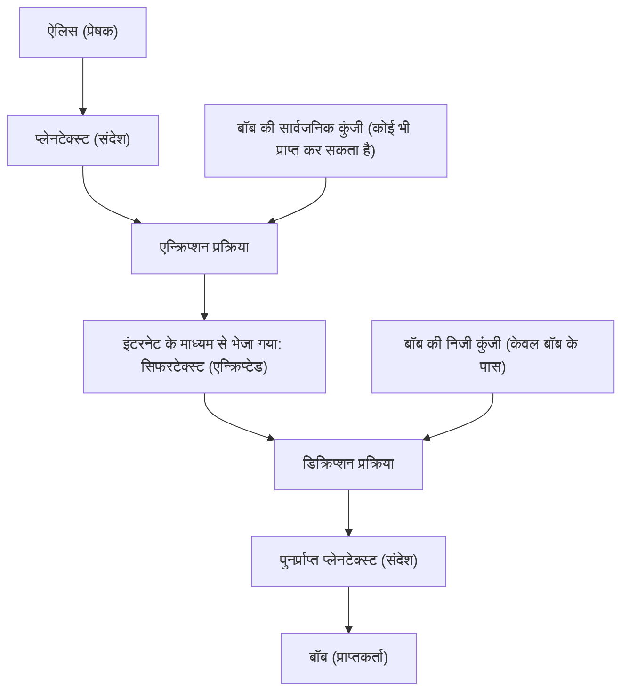
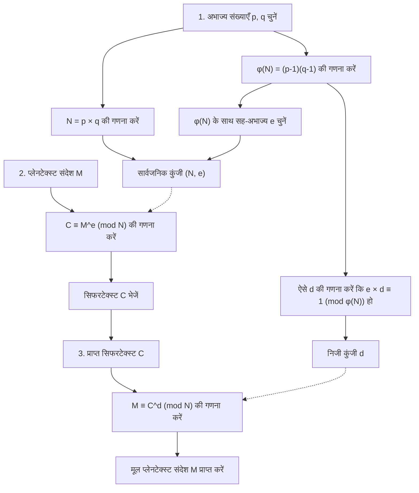
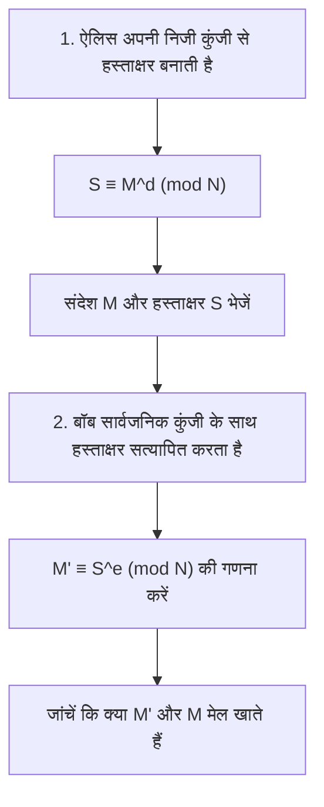

इंटरनेट समाज की सुरक्षा को बुनियादी रूप से समर्थन देने वाली तकनीकों में से एक "RSA एन्क्रिप्शन" है। ऑनलाइन शॉपिंग में क्रेडिट कार्ड से भुगतान, दोस्तों के साथ सोशल मीडिया पर बातचीत, कंपनी की गोपनीय जानकारी का आदान-प्रदान, आदि—जिन संचारों का हम प्रतिदिन जाने-अनजाने उपयोग करते हैं, उनमें से अधिकांश इस RSA एन्क्रिप्शन या इसकी उत्तराधिकारी तकनीकों द्वारा सुरक्षित होते हैं।

हालाँकि, "एन्क्रिप्शन" शब्द सुनकर आप शायद जासूसी फिल्मों में दिखने वाली जटिल एन्क्रिप्शन मशीनों या अति-उन्नत गणित की कल्पना करें जिसे केवल कुछ प्रतिभाशाली लोग ही समझ सकते हैं। यह सच है कि आधुनिक एन्क्रिप्शन सिद्धांत उन्नत गणित पर आधारित है, लेकिन **RSA एन्क्रिप्शन का मूल तंत्र इतना सरल है कि यदि आपको हाई स्कूल के गणित (पूर्णांकों के गुण, अभाज्य संख्याएँ, सर्वांगसमता आदि) का ज्ञान है, तो आप इसे पूरी तरह से समझ सकते हैं।**

इस लेख में, हम हाई स्कूल के गणितीय ज्ञान को शुरुआती बिंदु मानते हुए, चरण-दर-चरण विस्तार से बताएंगे कि RSA एन्क्रिप्शन किस गणितीय सिद्धांत पर काम करता है और इसे डिक्रिप्ट करना इतना कठिन क्यों है। जो लोग गणित में थोड़े कमज़ोर हैं, उन्हें भी समझ में आ सके, इसके लिए हम ठोस उदाहरणों के साथ इसे स्पष्ट रूप से समझाएंगे।

---

## 1. सममित कुंजी एन्क्रिप्शन और सार्वजनिक कुंजी एन्क्रिप्शन

RSA एन्क्रिप्शन के गणितीय तंत्र में जाने से पहले, आइए एन्क्रिप्शन की बुनियादी अवधारणाओं को समझ लें। एन्क्रिप्शन विधियों को मोटे तौर पर दो प्रकारों में बांटा जा सकता है: "सममित कुंजी एन्क्रिप्शन" और "सार्वजनिक कुंजी एन्क्रिप्शन"।

### 1.1 सममित कुंजी एन्क्रिप्शन प्रणाली की सीमाएँ

प्राचीन काल से उपयोग की जाने वाली अधिकांश एन्क्रिप्शन प्रणालियाँ "सममित कुंजी एन्क्रिप्शन प्रणाली" कहलाती हैं। यह एक ऐसी प्रणाली है जिसमें **"एन्क्रिप्शन (संदेश को गुप्त सिफरटेक्स्ट में बदलना)" और "डिक्रिप्शन (सिफरटेक्स्ट को मूल संदेश में वापस लाना)" के लिए एक ही कुंजी का उपयोग किया जाता है।**

उदाहरण के लिए, मान लें कि ऐलिस, बॉब को एक गुप्त पत्र भेजना चाहती है। ऐलिस एक पैडलॉक (सममित कुंजी) का उपयोग करके पत्र को एक बक्से में बंद कर देती है। बॉब को उस बक्से को खोलने के लिए उसी कुंजी की आवश्यकता होगी जिसका ऐलिस ने उपयोग किया था।

इस प्रणाली में एक बड़ी समस्या है: "कुंजी वितरण समस्या"। जब दूर बैठे ऐलिस और बॉब पहली बार संवाद करते हैं, तो वे बिना किसी के द्वारा सुने गए कुंजी को कैसे साझा कर सकते हैं? यदि मेल द्वारा भेजे जाते समय किसी तीसरे पक्ष द्वारा कुंजी चुरा ली जाती है, तो उसके बाद के सभी एन्क्रिप्टेड संचार लीक हो जाएंगे।

### 1.2 एक क्रांतिकारी आविष्कार: "सार्वजनिक कुंजी एन्क्रिप्शन प्रणाली"

कुंजी वितरण की इस समस्या को हल करने के लिए "सार्वजनिक कुंजी एन्क्रिप्शन प्रणाली" का आविष्कार किया गया था। RSA एन्क्रिप्शन भी इसी का एक प्रकार है।

सार्वजनिक कुंजी एन्क्रिप्शन प्रणाली में, **"एन्क्रिप्ट करने के लिए कुंजी (सार्वजनिक कुंजी)" और "डिक्रिप्ट करने के लिए कुंजी (निजी कुंजी)" नामक दो अलग-अलग कुंजियों** का उपयोग किया जाता है।

1. प्राप्तकर्ता बॉब "सार्वजनिक कुंजी" और "निजी कुंजी" का एक जोड़ा बनाता है।
2. बॉब "सार्वजनिक कुंजी" को दुनिया भर में प्रकाशित करता है (कोई भी इसे प्राप्त कर सकता है)।
3. प्रेषक ऐलिस, बॉब की "सार्वजनिक कुंजी" का उपयोग करके संदेश को एन्क्रिप्ट करती है और उसे भेज देती है।
4. एन्क्रिप्टेड संदेश को केवल "निजी कुंजी" से ही डिक्रिप्ट किया जा सकता है जो केवल बॉब के पास है।

यदि इसे पैडलॉक से समझा जाए, तो बॉब बहुत सारे "खुले हुए पैडलॉक (सार्वजनिक कुंजी)" बनाता है और उन्हें दुनिया भर में बाँट देता है। ऐलिस बॉब के लिए संदेश को बक्से में डालती है, और बॉब का जो पैडलॉक उसे मिला है, उससे बक्से को बंद कर देती है। एक बार ताला बंद हो जाने के बाद, इसे केवल "मास्टर कुंजी (निजी कुंजी)" से ही खोला जा सकता है जो बॉब के पास है। भले ही कोई बीच में बक्सा चुरा ले, वह उसे नहीं खोल सकता क्योंकि उसके पास मास्टर कुंजी नहीं है।



इस क्रांतिकारी प्रणाली को साकार करने के लिए, किसी प्रकार के **"एक-तरफ़ा फ़ंक्शन (वन-वे गणितीय पहेली)"** की आवश्यकता होती है, जिसका अर्थ है कि सार्वजनिक कुंजी के साथ एन्क्रिप्ट करना आसान है, लेकिन निजी कुंजी के बिना इसे डिक्रिप्ट करना बिल्कुल असंभव है। उस पहेली के हिस्से के रूप में जिस चीज़ पर ध्यान दिया गया, वह हमारी परिचित "अभाज्य संख्याएँ" थीं।

---

## 2. RSA एन्क्रिप्शन का समर्थन करने वाला गणितीय आधार 1: अभाज्य संख्याएँ और अभाज्य गुणनखंडन

RSA एन्क्रिप्शन की सुरक्षा इस गणितीय तथ्य पर आधारित है कि **"विशाल संख्याओं का अभाज्य गुणनखंडन करना बहुत कठिन है।"**

### 2.1 अभाज्य संख्याएँ क्या हैं?

अभाज्य संख्याएँ वे "1 से बड़ी प्राकृत संख्याएँ हैं जो केवल 1 और स्वयं से विभाज्य हैं।"
उदाहरण: $2, 3, 5, 7, 11, 13, 17, 19, 23...$

अभाज्य संख्याएँ सभी पूर्णांकों के "परमाणुओं" की तरह हैं। किसी भी प्राकृत संख्या को अभाज्य संख्याओं के गुणा के रूप में तोड़ा जा सकता है। इसे **अभाज्य गुणनखंडन** कहा जाता है। उदाहरण के लिए, $60 = 2^2 \times 3 \times 5$, यह सर्वविदित है कि यदि हम क्रम को अनदेखा करें तो गुणनखंडन केवल एक ही अद्वितीय तरीके से किया जा सकता है (अंकगणित का मूलभूत प्रमेय)।

### 2.2 अभाज्य गुणनखंडन की कठिनाई (एक-तरफ़ा फ़ंक्शन)

यहाँ जो बात महत्वपूर्ण है वह है विषमता: **"गुणा करना आसान है, लेकिन अभाज्य गुणनखंडन करना कठिन है।"**

उदाहरण के लिए, निम्नलिखित दो अभाज्य संख्याओं के गुणनफल की गणना अपने दिमाग में करने का प्रयास करें।
$11 \times 13 = ?$
यह आसान है। उत्तर $143$ है।

तो, इस संख्या के बारे में क्या खयाल है?
$323$ का अभाज्य गुणनखंडन करें।
कैसा लगा? इसमें थोड़ा समय लगना चाहिए। (उत्तर $17 \times 19$ है)।

यदि संख्याएँ छोटी हैं, तो मनुष्य भी किसी तरह गणना कर सकते हैं, लेकिन जब संख्याएँ बड़ी हो जाती हैं, Math तो कंप्यूटर का उपयोग करने पर भी गणना अत्यधिक कठिन हो जाती है। वर्तमान में मुख्यधारा के RSA एन्क्रिप्शन में, हम एक संख्या $N = p \times q$ का उपयोग करते हैं, जो दो अविश्वसनीय रूप से विशाल अभाज्य संख्याओं $p$ और $q$ को गुणा करके बनती है, जो 2048 बिट्स (दशमलव में लगभग 600 अंक) की होती हैं।

दिए गए दो विशाल अभाज्य संख्याओं $p$ और $q$ के लिए, $N$ की गणना करना कंप्यूटर के लिए पल भर (मिलीसेकंड से भी कम) का काम है। हालाँकि, यदि केवल $N$ दिया गया हो, तो मूल $p$ और $q$ को वापस खोजना इतना समय लेने वाला है कि इसे वर्तमान के सबसे तेज़ सुपरकंप्यूटरों का उपयोग करके भी खरबों वर्षों में हल नहीं किया जा सकता।

यही **"कम्प्यूटेशनल विषमता (एक तरफा आसान, दूसरी तरफा कठिन)"** सार्वजनिक कुंजी और निजी कुंजी के बीच संबंध बनाने की नींव बनाती है।

---

## 3. RSA एन्क्रिप्शन का समर्थन करने वाला गणितीय आधार 2: सर्वांगसमता (मॉड्यूलर अंकगणित)

RSA एन्क्रिप्शन में गणना साधारण जोड़ या गुणा की तरह नहीं होती जहाँ संख्याएँ अनंत रूप से बड़ी हो जाती हैं, बल्कि यह किसी संख्या से विभाजित करने पर बचे "शेषफल" की दुनिया में होती है। इसे **सर्वांगसमता (मॉड्यूलर अंकगणित)** कहा जाता है।

### 3.1 घड़ी का गणित

मॉड्यूलर अंकगणित की तुलना अक्सर "घड़ी के गणित" से की जाती है। मान लें कि अभी 10 बज रहे हैं, तो 5 घंटे बाद क्या समय होगा? $10 + 5 = 15$ बजे, लेकिन एक सामान्य 12-घंटे की घड़ी में हम उत्तर देते हैं "3 बजे"। ऐसा इसलिए है क्योंकि 15 को 12 से भाग देने पर शेषफल 3 आता है।

गणित की दुनिया में, इसे इस प्रकार लिखा जाता है:
$$ 15 \equiv 3 \pmod{12} $$
इसे ऐसे पढ़ा जाता है: "15 और 3, मॉड्युलो 12 के सर्वांगसम हैं (यानी 12 से भाग देने पर शेषफल समान है)।"

### 3.2 सर्वांगसमता के मूल गुण

सर्वांगसमता में कुछ बहुत ही उपयोगी गुण होते हैं जो समीकरणों ($=$) के समान होते हैं। मान लीजिए कि भाजक $N$ है।
जब $a \equiv b \pmod N$ और $c \equiv d \pmod N$ हो, तो निम्नलिखित सत्य है:

1. **जोड़:** $a + c \equiv b + d \pmod N$
2. **घटाव:** $a - c \equiv b - d \pmod N$
3. **गुणा:** $a \times c \equiv b \times d \pmod N$
4. **घातांक:** $a^k \equiv b^k \pmod N$ ($k$ एक प्राकृत संख्या है)

"घातांक" का गुण विशेष रूप से महत्वपूर्ण है। इसका मतलब है कि **"शेषफल का घातांक, घातांक के शेषफल के बराबर है।"**
उदाहरण के लिए, मान लें कि हम $7^{100}$ को $5$ से विभाजित करने पर शेषफल ज्ञात करना चाहते हैं। 7 को 100 बार गुणा करना और फिर उसे 5 से भाग देना बहुत मुश्किल काम है, लेकिन सर्वांगसमता के गुणों का उपयोग करके, चूँकि $7 \equiv 2 \pmod 5$ है, यह $7^{100} \equiv 2^{100} \pmod 5$ हो जाता है, जिससे गणना को काफी आसान किया जा सकता है। एन्क्रिप्शन की दुनिया में, यह गुण अपरिहार्य है क्योंकि हम बहुत बड़ी संख्याओं के घातांक से निपटते हैं।

---

## 4. RSA एन्क्रिप्शन का समर्थन करने वाला गणितीय आधार 3: यूलर का टॉशेंट फ़ंक्शन और यूलर का प्रमेय

यहाँ से जादुई गणित शुरू होता है जो RSA एन्क्रिप्शन का मूल है। "यूलर का प्रमेय" सामने आता है, जो "फर्मेट के छोटे प्रमेय" का एक सामान्यीकरण है।

### 4.1 यूलर का टॉशेंट फ़ंक्शन $\phi(N)$

यूलर का टॉशेंट फ़ंक्शन ($\phi$ फ़ंक्शन) एक ऐसा फ़ंक्शन है जो किसी भी प्राकृत संख्या $N$ के लिए, **"1 से $N$ तक की उन प्राकृत संख्याओं की गिनती देता है, जो $N$ के साथ सह-अभाज्य (जिनका महत्तम समापवर्तक 1 है) हैं।"**

आइए कुछ उदाहरण देखें:
- $\phi(5)$: 1, 2, 3, 4, 5 में से, 5 के साथ सह-अभाज्य 1, 2, 3, 4 हैं, जो कुल 4 हैं। इसलिए $\phi(5) = 4$।
- $\phi(6)$: 1, 2, 3, 4, 5, 6 में से, 6 के साथ सह-अभाज्य केवल 1, 5 हैं, जो कुल 2 हैं। इसलिए $\phi(6) = 2$।

**【अभाज्य संख्याओं के लिए विशेष गुण】**
जब $p$ एक अभाज्य संख्या है, तो 1 से $p-1$ तक की सभी संख्याएँ $p$ के साथ सह-अभाज्य होती हैं। इसलिए,
$$ \phi(p) = p - 1 $$
होता है।

**【अभाज्य संख्याओं के गुणनफल के लिए विशेष गुण】**
दो अलग-अलग अभाज्य संख्याओं $p$ और $q$ के लिए, यदि हम $N = p \times q$ मान लें, तो $\phi(N)$ को निम्नलिखित गणना द्वारा आसानी से निकाला जा सकता है:
$$ \phi(N) = \phi(p) \times \phi(q) = (p - 1)(q - 1) $$
यह गुण RSA एन्क्रिप्शन के "गुप्त पिछले दरवाजे (ट्रैपडोर)" के रूप में कार्य करता है। एक व्यक्ति जो $p$ और $q$ (कुंजी का निर्माता) जानता है, वह पल भर में $\phi(N)$ की गणना कर सकता है, लेकिन कोई तीसरा पक्ष जो केवल $N$ जानता है, वह $\phi(N)$ नहीं खोज सकता, जब तक कि वह $N$ का अभाज्य गुणनखंडन न कर ले।

### 4.2 यूलर का प्रमेय

लियोनहार्ड यूलर ने इस $\phi(N)$ का उपयोग करके निम्नलिखित सुंदर प्रमेय सिद्ध किया:

**यूलर का प्रमेय:**
जब पूर्णांक $a$ और $N$ सह-अभाज्य होते हैं, तो निम्नलिखित सर्वांगसमता सत्य होती है:
$$ a^{\phi(N)} \equiv 1 \pmod N $$

यह एक आश्चर्यजनक गुण है कि "यदि हम किसी संख्या $a$ को $\phi(N)$ बार गुणा करते हैं और $N$ से विभाजित करते हैं, तो शेषफल हमेशा $1$ होगा।" (जब $N$ एक अभाज्य संख्या $p$ है, तो यह $a^{p-1} \equiv 1 \pmod p$ बन जाता है, जिसे फर्मेट का छोटा प्रमेय कहा जाता है)।

आइए इस यूलर के प्रमेय को थोड़ा संशोधित करें। दोनों पक्षों को फिर से $a$ से गुणा करें:
$$ a^{\phi(N) + 1} \equiv a \pmod N $$

इसके अलावा, किसी भी पूर्णांक $k$ के लिए, $a^{k \cdot \phi(N)}$ भी $1^k = 1$ होगा, इसलिए निम्नलिखित समीकरण सत्य है:
$$ a^{k \cdot \phi(N) + 1} \equiv a \pmod N $$

यह समीकरण ही वह मूल सिद्धांत है जो RSA एन्क्रिप्शन के इस जादू को काम करने देता है: **"जब आप इसे एन्क्रिप्ट करते हैं और फिर डिक्रिप्ट करते हैं, तो यह अपनी मूल अवस्था में वापस आ जाता है।"**

---

## 5. RSA एन्क्रिप्शन एल्गोरिथम: कुंजी निर्माण, एन्क्रिप्शन और डिक्रिप्शन के चरण

अब जब हमारे पास बुनियादी ज्ञान है, तो आइए अंततः RSA एन्क्रिप्शन के विशिष्ट चरणों को देखें। RSA एन्क्रिप्शन मोटे तौर पर तीन चरणों में बंटा हुआ है: "1. कुंजी निर्माण", "2. एन्क्रिप्शन", और "3. डिक्रिप्शन"।



### 5.1 कुंजी निर्माण (Key Generation)

प्राप्तकर्ता बॉब, अपने लिए एक "सार्वजनिक कुंजी" और एक "निजी कुंजी" बनाता है।

1. **अभाज्य संख्याओं का चयन:** दो बड़ी अभाज्य संख्याएँ $p$ और $q$ यादृच्छिक रूप से चुनें।
2. **$N$ की गणना:** $N = p \times q$ की गणना करें। यह $N$ सार्वजनिक किया जाएगा।
3. **$\phi(N)$ की गणना:** यूलर फ़ंक्शन $\phi(N) = (p - 1)(q - 1)$ की गणना करें। यह बॉब का गुप्त नंबर है।
4. **सार्वजनिक कुंजी $e$ का चयन:** एक ऐसा पूर्णांक $e$ चुनें जो $1 < e < \phi(N)$ हो और $\phi(N)$ के साथ सह-अभाज्य हो।
5. **निजी कुंजी $d$ की गणना:** एक ऐसा पूर्णांक $d$ खोजें जो निम्नलिखित शर्त को पूरा करता हो:
   $$ e \times d \equiv 1 \pmod{\phi(N)} $$
   दूसरे शब्दों में, यह एक ऐसी संख्या $d$ है जहाँ "$e \times d$ को $\phi(N)$ से भाग देने पर शेषफल $1$ होता है।"

इसके साथ ही कुंजियों की तैयारी पूरी हो जाती है।
- **सार्वजनिक कुंजी:** $(N, e)$ का जोड़ा। इसे पूरी दुनिया के लिए सार्वजनिक किया जाता है।
- **निजी कुंजी:** $d$। इसे किसी को भी नहीं बताया जाता।

### 5.2 एन्क्रिप्शन (Encryption)

मान लें कि ऐलिस, बॉब को एक गुप्त संदेश $M$ भेजना चाहती है। ($M$ पाठ को संख्यात्मक रूप में परिवर्तित करने से बनता है, और हम मान कर चलते हैं कि $0 \le M < N$ है)। ऐलिस बॉब की सार्वजनिक कुंजी $(N, e)$ का उपयोग करके निम्नानुसार गणना करती है:

$$ C \equiv M^e \pmod N $$

"संदेश $M$ को $e$ की घात तक उठाएँ, और $N$ से भाग देने पर शेषफल $C$ प्राप्त करें।" यह $C$ एन्क्रिप्टेड संदेश (सिफरटेक्स्ट) है।

### 5.3 डिक्रिप्शन (Decryption)

बॉब को सिफरटेक्स्ट $C$ प्राप्त होता है। बॉब अपनी निजी कुंजी $d$ का उपयोग करके निम्नानुसार गणना करता है:

$$ M \equiv C^d \pmod N $$

यदि आप "सिफरटेक्स्ट $C$ को $d$ की घात तक बढ़ाते हैं, और $N$ से भाग देने पर शेषफल" की गणना करते हैं, तो आश्चर्यजनक रूप से मूल संदेश $M$ पुनर्प्राप्त हो जाता है!

---

## 6. डिक्रिप्शन इसे मूल अवस्था में वापस क्यों लाता है? (गणितीय प्रमाण)

आप सोच रहे होंगे, "$C$ की घात $d$ करने से, यह मूल $M$ में कैसे वापस आ जाता है?" यहीं पर पहले वर्णित "यूलर का प्रमेय" अपनी शक्ति दिखाता है।

आइए डिक्रिप्शन के सूत्र $C^d \pmod N$ में एन्क्रिप्शन के सूत्र $C = M^e$ को प्रतिस्थापित करें:
$$ C^d \equiv (M^e)^d \equiv M^{ed} \pmod N $$

यहाँ, कुंजी निर्माण के चरण 5 को याद करें। जब बॉब ने $d$ बनाया, तो उसने इसे इस तरह चुना कि $e \times d \equiv 1 \pmod{\phi(N)}$ हो। इसका मतलब है कि "$ed$, $\phi(N)$ के गुणज में $1$ जोड़ने से बनी संख्या है।" एक पूर्णांक $k$ का उपयोग करके, इसे इस प्रकार लिखा जा सकता है:
$$ ed = k \cdot \phi(N) + 1 $$

इसे घातांक वाले भाग में रखें और घातांक के नियमों का उपयोग करके इसे हल करें:
$$ M^{ed} = M^{k \cdot \phi(N) + 1} = M^{k \cdot \phi(N)} \times M^1 = (M^{\phi(N)})^k \times M $$

यहाँ, यदि हम मान लें कि संदेश $M$ और $N$ सह-अभाज्य हैं, तो **यूलर के प्रमेय** से, $M^{\phi(N)} \equiv 1 \pmod N$ होता है।
$$ (M^{\phi(N)})^k \times M \equiv 1^k \times M \equiv M \pmod N $$

इसलिए, निम्नलिखित समीकरण पूरी तरह से सत्य होता है:
$$ C^d \equiv M \pmod N $$

ऐलिस $d$ को नहीं जानती, और छिपकर बातें सुनने वाला भी $d$ को नहीं जानता, इसलिए केवल बॉब, जिसके पास $d$ है, $C$ से $M$ को निकाल सकता है।

---

## 7. एक ठोस उदाहरण: आइए छोटी अभाज्य संख्याओं का उपयोग करके हाथ से RSA की गणना करें

आइए वास्तव में छोटी संख्याओं (अभाज्य संख्याओं) का उपयोग करके ऐलिस से बॉब तक एन्क्रिप्टेड संचार का प्रयास करें।

**【बॉब का कुंजी निर्माण चरण】**
1. दो अभाज्य संख्याएँ चुनें, $p=11$ और $q=13$।
2. $N = 11 \times 13 = 143$ की गणना करें।
3. $\phi(N) = (11 - 1) \times (13 - 1) = 10 \times 12 = 120$ की गणना करें।
4. एक सार्वजनिक कुंजी $e$ चुनें जो $\phi(N)=120$ के साथ सह-अभाज्य हो। यहाँ हम $e=7$ का उपयोग करेंगे।
5. निजी कुंजी $d$ ज्ञात करें। ऐसा $d$ खोजें कि $7 \times d \equiv 1 \pmod{120}$ हो।
   समीकरण $7d = 120k + 1$ में, जब $k=6$ होता है, तो मान $721$ हो जाता है, और $721 \div 7 = 103$ होता है।
   इसलिए, $d = 103$ हो जाता है।

- सार्वजनिक कुंजी: $(N=143, e=7)$
- निजी कुंजी: $d=103$

**【ऐलिस का एन्क्रिप्शन चरण】**
मान लीजिए कि ऐलिस संदेश $M = 9$ भेजना चाहती है।
सूत्र: $C \equiv 9^7 \pmod{143}$
$9^7 = 4,782,969$। जब इसे 143 से भाग दिया जाता है, तो भागफल 33447 और शेषफल 48 होता है।
तो एन्क्रिप्टेड संदेश $C = 48$ हो गया।

**【बॉब का डिक्रिप्शन चरण】**
बॉब को एन्क्रिप्टेड संदेश $C = 48$ मिलता है और वह इसे डिक्रिप्ट करने के लिए अपनी निजी कुंजी $d = 103$ का उपयोग करता है।
सूत्र: $M \equiv 48^{103} \pmod{143}$
यदि आप कैलकुलेटर पर `(48 ** 103) % 143` चलाते हैं, तो परिणाम आश्चर्यजनक रूप से "**9**" आएगा! बॉब सफलतापूर्वक मूल संदेश प्राप्त करने में सक्षम हो गया।

---

## 8. निजी कुंजी $d$ कैसे ज्ञात करें: विस्तारित यूक्लिडियन एल्गोरिथम

मैन्युअल गणना के उदाहरण में, हमने अनुमान लगाकर $k$ का मान खोजा और $d=103$ प्राप्त किया, लेकिन जब संख्याएँ सैकड़ों अंकों की हो जाती हैं, तो यह विधि असंभव है। वास्तविक प्रोग्रामों में, **"विस्तारित यूक्लिडियन एल्गोरिथम"** नामक एल्गोरिथम का उपयोग किया जाता है।

$7d \equiv 1 \pmod{120}$ को हल करने का मतलब ऐसे पूर्णांक $d, y$ ज्ञात करना है जो $7d + 120y = 1$ को संतुष्ट करते हों। यूक्लिडियन एल्गोरिथम को उल्टे क्रम में लागू करके, इसकी गणना व्यवस्थित तरीके से की जा सकती है।

1. $120 \div 7 = 17$ शेषफल $1$
2. इसे पुनः व्यवस्थित करने पर, $1 = 120 - 17 \times 7$
3. यानी, $-17 \times 7 \equiv 1 \pmod{120}$

मॉड्युलो 120 की दुनिया में $-17$ का अर्थ $120 - 17 = 103$ के समान ही है। इसलिए, $d = 103$ पल भर में मिल जाता है। यह विधि बहुत तेज़ी से गणना कर सकती है, चाहे संख्या कितनी भी विशाल क्यों न हो।

---

## 9. RSA एन्क्रिप्शन का एक और चेहरा: डिजिटल हस्ताक्षर

RSA एन्क्रिप्शन के बारे में सबसे अच्छी बात यह है कि सार्वजनिक और निजी कुंजियों की भूमिकाओं को उलट कर इसे **"डिजिटल हस्ताक्षर"** के रूप में भी इस्तेमाल किया जा सकता है।

एन्क्रिप्शन में, प्रक्रिया थी "सार्वजनिक कुंजी के साथ एन्क्रिप्ट करें $\Rightarrow$ निजी कुंजी के साथ डिक्रिप्ट करें"।
डिजिटल हस्ताक्षर में, प्रक्रिया है "निजी कुंजी के साथ एन्क्रिप्ट करें $\Rightarrow$ सार्वजनिक कुंजी के साथ डिक्रिप्ट करें"।



ऐलिस अपनी निजी कुंजी $d$ का उपयोग करके संदेश को बदलती है (यह हस्ताक्षर $S$ है) और इसे बॉब को भेजती है। बॉब सत्यापन गणना करने के लिए ऐलिस की सार्वजनिक कुंजी $e$ का उपयोग करता है। यदि गणना का परिणाम मूल संदेश से मेल खाता है, तो यह एक साथ साबित करता है कि "यह डेटा केवल ऐलिस की निजी कुंजी से ही बनाया जा सकता था" और "संदेश से रास्ते में छेड़छाड़ नहीं की गई है।"

---

## 10. एक प्रोग्राम के साथ RSA एन्क्रिप्शन का अनुभव करना

हाथ से घातांक की गणना करना कठिन है, लेकिन यदि आप Python का उपयोग करते हैं, तो इसे लागू करना बहुत आसान है। नीचे दिया गया Python कोड आपको RSA एन्क्रिप्शन के मुख्य तर्क का अनुभव करने की अनुमति देता है।

```python
def gcd(a, b):
    """महत्तम समापवर्तक ज्ञात करें"""
    while b != 0:
        a, b = b, a % b
    return a

def mod_inverse(e, phi):
    """निजी कुंजी d ज्ञात करें (Python 3.8+ के बिल्ट-इन फ़ंक्शन का उपयोग करके)"""
    return pow(e, -1, phi)

# 1. कुंजी निर्माण
p, q = 11, 13
N = p * q
phi = (p - 1) * (q - 1)
e = 7
d = mod_inverse(e, phi)

print(f"सार्वजनिक कुंजी: (N={N}, e={e}), निजी कुंजी: d={d}")

# 2. एन्क्रिप्शन
message = 9
ciphertext = pow(message, e, N)
print(f"एन्क्रिप्टेड संदेश: {ciphertext}")

# 3. डिक्रिप्शन
decrypted_message = pow(ciphertext, d, N)
print(f"डिक्रिप्टेड संदेश: {decrypted_message}")
```

चूँकि Python का `pow(base, exp, mod)` फ़ंक्शन आंतरिक रूप से एक तेज़ एल्गोरिथम का उपयोग करता है जिसे "पुनरावृत्त वर्ग विधि (Exponentiation by squaring)" कहा जाता है, यह एक पल में गणना पूरी कर लेता है, भले ही संख्याएँ सैकड़ों अंकों की हों।

---

## 11. निष्कर्ष और भविष्य की एन्क्रिप्शन तकनीक

हमने हाई स्कूल के गणितीय ज्ञान के आधार पर RSA एन्क्रिप्शन के तंत्र का खुलासा किया है।

1. **अभाज्य गुणनखंडन की कठिनाई:** $p \times q = N$ खोजना आसान है, लेकिन $N$ से $p, q$ खोजना बहुत मुश्किल है।
2. **सर्वांगसमता और यूलर का प्रमेय:** $a^{\phi(N)} \equiv 1 \pmod N$ नियम के माध्यम से, "एक निश्चित संख्या की घात तक बढ़ाने पर मूल अवस्था में वापस आने" का जादुई ट्रैपडोर पूरा हो जाता है।
3. **सार्वजनिक और निजी कुंजियाँ:** कोई भी एन्क्रिप्ट कर सकता है, लेकिन केवल वैध प्राप्तकर्ता ही इसे डिक्रिप्ट कर सकता है।

वर्तमान में उपयोग किए जाने वाले RSA एन्क्रिप्शन में 600 से अधिक अंकों का $N$ होता है, और दुनिया के सभी सुपर कंप्यूटरों को एक साथ काम में लगा दिया जाए, तो भी इसके अभाज्य गुणनखंडन में ब्रह्मांड की आयु से अधिक समय लगेगा। हालाँकि, यदि हाल ही में शोध किए जा रहे "क्वांटम कंप्यूटर" भविष्य में व्यावहारिक उपयोग में आते हैं, तो ऐसी संभावना है कि यह अभाज्य गुणनखंडन "शोर के एल्गोरिथम" द्वारा पल भर में हल हो जाएगा। इस कारण से, दुनिया भर में "क्वांटम-प्रतिरोधी एन्क्रिप्शन" विकसित करने के लिए तेज़ गति से काम चल रहा है, जिसे क्वांटम कंप्यूटर भी डिक्रिप्ट नहीं कर सकते।

उन्नत गणित जिसे अक्सर "बेकार" माना जाता है, वास्तव में हमारे दैनिक जीवन को उसकी जड़ों से सुरक्षित रखता है। RSA एन्क्रिप्शन इस तरह के गणित की गहराई और सुंदरता सिखाने वाली सबसे बेहतरीन शिक्षण सामग्री है। हमें उम्मीद है कि इस लेख के माध्यम से आप एन्क्रिप्शन और गणित के आकर्षण को थोड़ा भी महसूस कर पाए होंगे।
