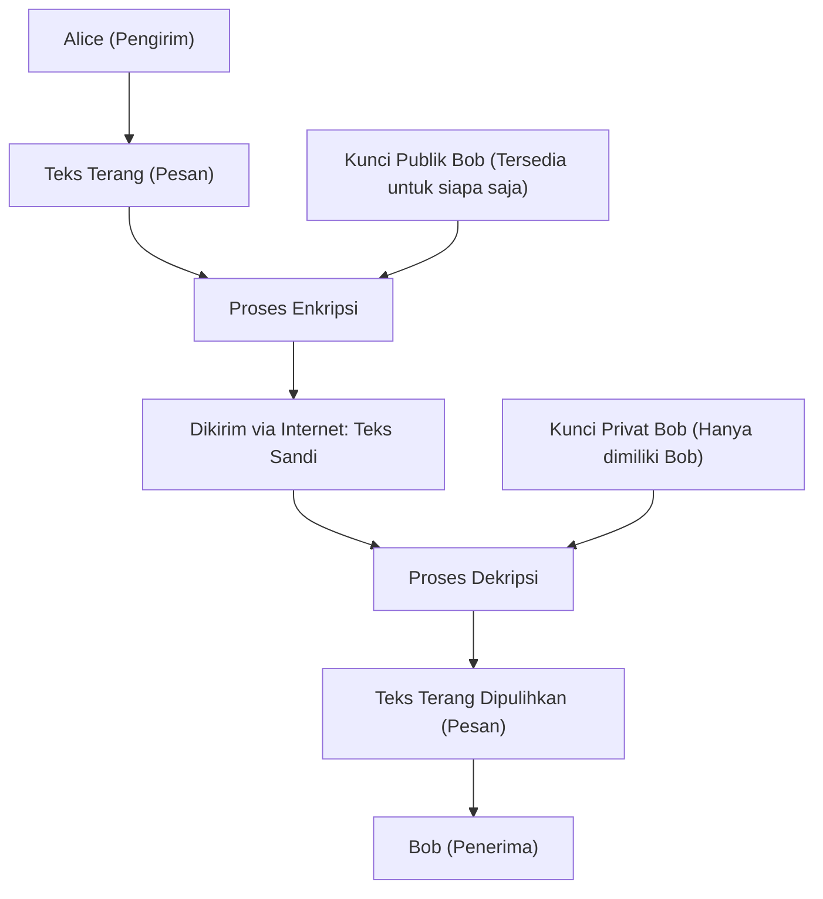
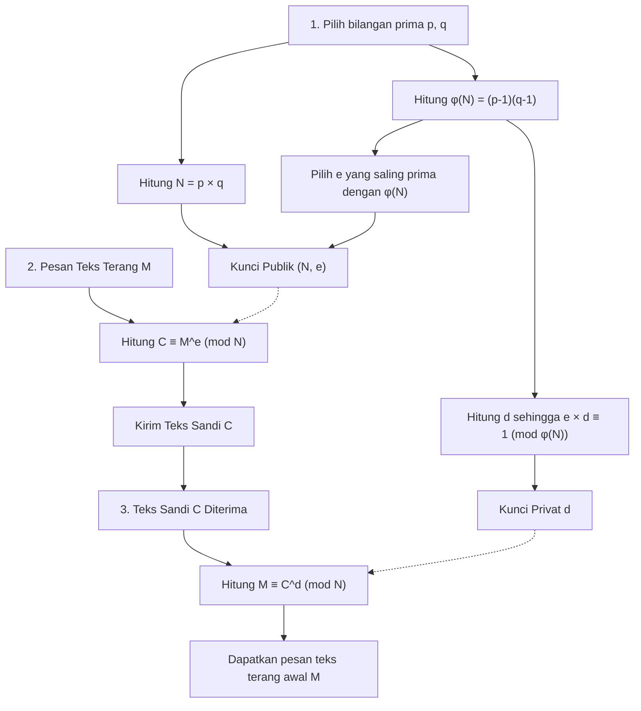
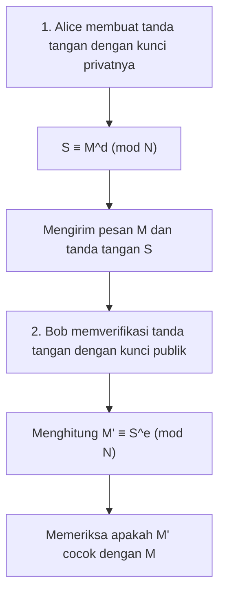

Salah satu teknologi yang mendasari keamanan masyarakat internet adalah "Enkripsi RSA". Sebagian besar komunikasi yang kita gunakan tanpa disadari setiap hari, seperti pembayaran kartu kredit dalam belanja online, interaksi di media sosial dengan teman, dan transmisi serta penerimaan informasi rahasia perusahaan, dilindungi oleh enkripsi RSA ini atau teknologi penerusnya.

Namun, ketika mendengar kata "kriptografi", Anda mungkin membayangkan mesin sandi yang rumit seperti yang ada di film mata-mata, atau matematika tingkat sangat tinggi yang hanya dapat dipahami oleh sebagian kecil orang jenius. Memang benar bahwa teori kriptografi modern didasarkan pada matematika tingkat tinggi, tetapi **mekanisme dasar dari enkripsi RSA dapat dipahami dengan baik jika Anda memiliki pengetahuan matematika yang dipelajari di sekolah menengah atas (sifat bilangan bulat, bilangan prima, aritmetika modular (kongruensi), dll.)**.

Dalam artikel ini, dengan pengetahuan matematika sekolah menengah atas sebagai titik awal, kami akan menjelaskan secara menyeluruh selangkah demi selangkah prinsip matematika apa yang membuat enkripsi RSA bekerja dan mengapa sulit untuk dipecahkan. Kami akan menjelaskannya dengan hati-hati disertai contoh-contoh konkret sehingga bahkan mereka yang kurang ahli dalam matematika dapat memahaminya.

---

## 1. Kriptografi Kunci Simetris dan Kriptografi Kunci Publik

Sebelum masuk ke mekanisme matematis dari enkripsi RSA, mari kita perjelas konsep dasar dari kriptografi terlebih dahulu. Sistem kriptografi secara garis besar dibagi menjadi dua jenis: "kriptografi kunci simetris" dan "kriptografi kunci publik".

### 1.1 Keterbatasan Sistem Kriptografi Kunci Simetris

Banyak kriptografi yang telah digunakan sejak zaman dahulu disebut "sistem kriptografi kunci simetris". Ini adalah sistem yang **menggunakan kunci yang sama untuk "enkripsi (mengubah pesan menjadi teks sandi rahasia)" dan "dekripsi (mengembalikan teks sandi ke pesan aslinya)"**.

Sebagai contoh, misalkan Alice mengirim surat rahasia kepada Bob. Alice memasukkan surat itu ke dalam kotak dan menguncinya menggunakan gembok (kunci simetris). Agar Bob bisa membuka kotak tersebut, ia harus memiliki kunci yang sama dengan yang digunakan Alice.

Ada masalah besar dengan sistem ini. Yakni "masalah distribusi kunci". Ketika Alice dan Bob, yang berjauhan, berkomunikasi untuk pertama kalinya, bagaimana mereka bisa berbagi kunci tanpa disadap? Jika kunci tersebut dicuri oleh pihak ketiga saat dikirim melalui pos, semua komunikasi terenkripsi setelahnya akan sepenuhnya bocor.

### 1.2 Penemuan Revolusioner "Sistem Kriptografi Kunci Publik"

Untuk menyelesaikan masalah distribusi kunci ini, "sistem kriptografi kunci publik" diciptakan. Enkripsi RSA adalah salah satu jenisnya.

Dalam sistem kriptografi kunci publik, **dua kunci yang berbeda digunakan: "kunci untuk enkripsi (kunci publik)" dan "kunci untuk dekripsi (kunci privat/rahasia)"**.

1. Penerima, Bob, membuat sepasang "kunci publik" dan "kunci privat".
2. Bob mempublikasikan "kunci publik"-nya ke seluruh dunia (tidak masalah siapa pun yang mendapatkannya).
3. Pengirim, Alice, menggunakan "kunci publik" Bob untuk mengenkripsi pesan dan mengirimkannya.
4. Pesan yang terenkripsi hanya bisa didekripsi dengan "kunci privat" yang hanya dimiliki oleh Bob.

Jika diibaratkan dengan gembok, Bob membuat banyak "gembok yang terbuka (kunci publik)" dan menyebarkannya ke seluruh dunia. Alice memasukkan pesan yang ditujukan kepada Bob ke dalam kotak, dan menguncinya dengan klik menggunakan gembok Bob yang ia temukan. Begitu gembok ditutup, ia hanya dapat dibuka dengan "kunci master (kunci privat)" yang dimiliki oleh Bob. Bahkan jika seseorang mencuri kotak itu di tengah jalan, mereka tidak bisa membukanya karena tidak memiliki kunci master.



Untuk mewujudkan sistem revolusioner ini, diperlukan semacam **"fungsi satu arah (teka-teki matematika satu arah)"** yang "mudah dienkripsi dengan kunci publik, tetapi sama sekali tidak dapat didekripsi tanpa kunci privat". Yang menjadi perhatian sebagai bagian dari teka-teki itu adalah "bilangan prima" yang sering kita kenal.

---

## 2. Dasar Matematika yang Mendukung Enkripsi RSA 1: Bilangan Prima dan Faktorisasi Prima

Keamanan enkripsi RSA didasarkan pada fakta matematis bahwa **"faktorisasi prima dari bilangan yang sangat besar adalah sangat sulit"**.

### 2.1 Apa itu Bilangan Prima?

Bilangan prima adalah "bilangan asli lebih besar dari 1 yang hanya bisa dibagi habis oleh 1 dan dirinya sendiri".
Contoh: $2, 3, 5, 7, 11, 13, 17, 19, 23...$

Bilangan prima itu seperti "atom" untuk semua bilangan bulat. Bilangan asli apa pun bisa diuraikan ke dalam bentuk perkalian bilangan-bilangan prima. Ini disebut **faktorisasi prima**. Sebagai contoh, $60 = 2^2 \times 3 \times 5$, dapat difaktorisasi prima hanya dalam satu cara dengan mengabaikan urutan, hal ini dikenal sebagai "Teorema Dasar Aritmetika".

### 2.2 Kesulitan Faktorisasi Prima (Fungsi Satu Arah)

Yang penting di sini adalah asimetri di mana **"perkalian itu mudah, tetapi faktorisasi prima itu sulit"**.

Sebagai contoh, coba hitung perkalian dua bilangan prima berikut di luar kepala.
$11 \times 13 = ?$
Ini mudah, bukan? Jawabannya adalah $143$.

Lalu, bagaimana dengan bilangan berikut?
Faktorisasi prima dari $323$.
Bagaimana? Seharusnya butuh sedikit waktu. (Jawabannya adalah $17 \times 19$).

Jika bilangannya kecil, manusia masih bisa menghitungnya entah bagaimana, tetapi ketika bilangannya menjadi besar, penghitungannya akan sangat sulit bahkan dengan menggunakan komputer. Enkripsi RSA mainstream saat ini menggunakan bilangan $N = p \times q$ yang mengalikan bilangan prima yang sangat besar $p$ dan $q$ sebesar 2048 bit (sekitar 600 digit dalam desimal).

Diberikan dua bilangan prima raksasa $p$ dan $q$, menghitung $N$ membutuhkan waktu sekejap (kurang dari milidetik) bagi komputer. Namun sebaliknya, jika hanya diberikan $N$ untuk mencari tahu $p$ dan $q$ yang asli, akan memakan waktu yang sangat lama yang tidak dapat dipecahkan bahkan jika superkomputer tercepat saat ini dijalankan selama triliunan tahun.

Inilah **"asimetri komputasi (mudah satu arah, sulit arah sebaliknya)"** yang menjadi landasan untuk menciptakan hubungan antara kunci publik dan kunci privat.

---

## 3. Dasar Matematika yang Mendukung Enkripsi RSA 2: Kongruensi (Aritmetika Modular)

Perhitungan enkripsi RSA tidak dilakukan dengan penjumlahan atau perkalian bilangan yang menjadi besar tanpa batas seperti yang biasa kita gunakan, melainkan dalam dunia "sisa" setelah dibagi dengan suatu bilangan tertentu. Ini disebut **kongruensi (aritmetika modular)**.

### 3.1 Matematika Jam

Aritmetika modular sering diibaratkan sebagai "matematika jam". Misalkan sekarang jam 10, jam berapakah 5 jam dari sekarang? $10 + 5 = 15$, namun pada jam 12 jam biasa kita akan menjawab "jam 3". Hal ini karena sisa dari 15 dibagi 12 adalah 3.

Dalam dunia matematika, ini ditulis sebagai berikut.
$$ 15 \equiv 3 \pmod{12} $$
Ini dibaca sebagai "15 dan 3 adalah kongruen modulo 12 (sisanya sama jika dibagi 12)".

### 3.2 Sifat Dasar Kongruensi

Kongruensi memiliki sifat-sifat yang sangat berguna yang mirip dengan persamaan ($=$). Misalkan modulo (pembagi)-nya adalah $N$.
Jika $a \equiv b \pmod N$ dan $c \equiv d \pmod N$, maka hal-hal berikut ini berlaku:

1. **Penjumlahan:** $a + c \equiv b + d \pmod N$
2. **Pengurangan:** $a - c \equiv b - d \pmod N$
3. **Perkalian:** $a \times c \equiv b \times d \pmod N$
4. **Perpangkatan:** $a^k \equiv b^k \pmod N$ (di mana $k$ adalah bilangan asli)

Yang paling penting adalah sifat "perpangkatan". Ini berarti **"sisa pembagian suatu perpangkatan sama dengan perpangkatan dari sisa pembagian"**.
Misalnya, misalkan kita ingin mencari sisa dari $7^{100}$ dibagi $5$. Jika kita serius mengalikan $7$ seratus kali dan kemudian membaginya dengan $5$, itu akan sangat sulit, tetapi menggunakan sifat kongruensi, karena $7 \equiv 2 \pmod 5$, maka akan menjadi $7^{100} \equiv 2^{100} \pmod 5$, yang menyederhanakan perhitungan secara drastis. Sifat ini sangat penting dalam dunia kriptografi karena berkaitan dengan perpangkatan angka yang sangat besar.

---

## 4. Dasar Matematika yang Mendukung Enkripsi RSA 3: Fungsi Euler dan Teorema Euler

Mulai dari sini, kita masuk ke inti keajaiban matematika dari enkripsi RSA. Muncullah "Teorema Euler" yang merupakan generalisasi dari "Teorema Kecil Fermat".

### 4.1 Fungsi Totient Euler $\phi(N)$

Fungsi Totient Euler (Fungsi $\phi$) adalah fungsi yang untuk suatu bilangan asli $N$, menghasilkan **"jumlah bilangan dari bilangan asli antara 1 hingga $N$ yang saling prima (faktor persekutuan terbesarnya adalah 1) dengan $N$"**.

Mari kita lihat beberapa contoh.
- $\phi(5)$: Di antara 1, 2, 3, 4, 5, bilangan yang saling prima dengan 5 ada 4 bilangan yaitu 1, 2, 3, 4. Sehingga, $\phi(5) = 4$.
- $\phi(6)$: Di antara 1, 2, 3, 4, 5, 6, bilangan yang saling prima dengan 6 ada 2 bilangan yaitu 1, 5. Sehingga, $\phi(6) = 2$.

**【Sifat Khusus dalam Kasus Bilangan Prima】**
Jika $p$ adalah bilangan prima, semua angka dari 1 hingga $p-1$ akan saling prima dengan $p$. Oleh karena itu,
$$ \phi(p) = p - 1 $$

**【Sifat Khusus dalam Kasus Hasil Kali Bilangan Prima】**
Untuk dua bilangan prima berbeda $p$ dan $q$, jika $N = p \times q$, $\phi(N)$ dapat dengan mudah dicari melalui perhitungan berikut.
$$ \phi(N) = \phi(p) \times \phi(q) = (p - 1)(q - 1) $$
Sifat ini berfungsi sebagai "pintu belakang rahasia (trapdoor)" dari enkripsi RSA. Seseorang yang mengetahui $p$ dan $q$ (pembuat kunci) dapat menghitung $\phi(N)$ dalam sekejap, tetapi pihak ketiga yang hanya tahu $N$ tidak akan bisa mencari $\phi(N)$ kecuali mereka memfaktorkan prima $N$.

### 4.2 Teorema Euler

Leonhard Euler menggunakan $\phi(N)$ ini untuk membuktikan teorema yang indah sebagai berikut.

**Teorema Euler:**
Ketika bilangan bulat $a$ dan $N$ saling prima, persamaan kongruensi berikut berlaku.
$$ a^{\phi(N)} \equiv 1 \pmod N $$

Ini adalah sifat yang luar biasa, yang menyatakan bahwa "jika suatu bilangan $a$ dikalikan $\phi(N)$ kali lalu dibagi $N$, sisanya pasti akan menjadi $1$". (Jika $N$ adalah bilangan prima $p$, ia menjadi $a^{p-1} \equiv 1 \pmod p$ dan disebut Teorema Kecil Fermat).

Mari kita ubah bentuk Teorema Euler ini. Kita kalikan kedua sisi dengan $a$ sekali lagi.
$$ a^{\phi(N) + 1} \equiv a \pmod N $$

Lebih lanjut, untuk sembarang bilangan bulat $k$, $a^{k \cdot \phi(N)}$ juga menjadi $1^k = 1$, sehingga persamaan berikut berlaku.
$$ a^{k \cdot \phi(N) + 1} \equiv a \pmod N $$

Persamaan inilah prinsip fundamental yang mewujudkan keajaiban enkripsi RSA yaitu **"setelah dienkripsi dan kemudian didekripsi akan kembali ke asalnya"**.

---

## 5. Algoritma Enkripsi RSA: Langkah Pembuatan Kunci, Enkripsi, dan Dekripsi

Sekarang setelah kita memiliki pengetahuan dasarnya, mari kita lihat prosedur spesifik dari enkripsi RSA. Enkripsi RSA dibagi menjadi 3 fase utama: "1. Pembuatan Kunci", "2. Enkripsi", dan "3. Dekripsi".



### 5.1 Pembuatan Kunci (Key Generation)

Penerima, Bob, membuat "kunci publik" dan "kunci privat" untuk dirinya sendiri.

1. **Pemilihan Bilangan Prima:** Pilih dua bilangan prima besar $p$ dan $q$ secara acak.
2. **Perhitungan Modulo $N$:** Hitung $N = p \times q$. Nilai $N$ ini akan dipublikasikan.
3. **Perhitungan $\phi(N)$:** Hitung fungsi Euler $\phi(N) = (p - 1)(q - 1)$. Ini adalah angka rahasia milik Bob.
4. **Pemilihan Kunci Publik $e$:** Pilih bilangan bulat $e$ dengan syarat $1 < e < \phi(N)$ dan saling prima dengan $\phi(N)$.
5. **Perhitungan Kunci Privat $d$:** Temukan bilangan bulat $d$ yang memenuhi syarat berikut:
   $$ e \times d \equiv 1 \pmod{\phi(N)} $$
   Artinya, "suatu bilangan $d$ sedemikian rupa sehingga jika $e \times d$ dibagi $\phi(N)$, sisanya adalah $1$".

Kini kunci sudah siap.
- **Kunci Publik:** Pasangan $(N, e)$. Dipublikasikan ke seluruh dunia.
- **Kunci Privat:** $d$. Sama sekali tidak diberitahukan kepada siapa pun.

### 5.2 Enkripsi (Encryption)

Misalkan Alice ingin mengirim pesan rahasia $M$ kepada Bob. (Misalkan $M$ adalah nilai numerik dari teks, dengan $0 \le M < N$). Alice menggunakan kunci publik Bob $(N, e)$ untuk menghitung hal berikut.

$$ C \equiv M^e \pmod N $$

Menghitung "pesan $M$ dipangkatkan dengan $e$, dan sisanya setelah dibagi dengan $N$ adalah $C$". $C$ ini adalah teks sandinya.

### 5.3 Dekripsi (Decryption)

Bob menerima teks sandi $C$. Bob menggunakan kunci privatnya $d$ untuk menghitung hal berikut.

$$ M \equiv C^d \pmod N $$

Jika "teks sandi $C$ dipangkatkan dengan $d$, dan dihitung sisanya setelah dibagi dengan $N$", menakjubkan sekali, pesan asli $M$ berhasil dipulihkan!

---

## 6. Mengapa Bisa Kembali Asal Melalui Dekripsi? (Pembuktian Matematis)

Anda mungkin bertanya-tanya, "Bagaimana mungkin hanya dengan memangkatkan $C$ dengan $d$ bisa mengembalikannya ke $M$ yang asli?". Di sinilah "Teorema Euler" yang sudah dibahas sebelumnya menunjukkan kekuatannya.

Mari kita substitusikan rumus enkripsi $C = M^e$ ke dalam rumus dekripsi $C^d \pmod N$.
$$ C^d \equiv (M^e)^d \equiv M^{ed} \pmod N $$

Sekarang, ingatlah langkah 5 pada pembuatan kunci. Saat Bob membuat $d$, ia memilihnya sedemikian rupa sehingga $e \times d \equiv 1 \pmod{\phi(N)}$. Ini berarti bahwa "$ed$ adalah kelipatan $\phi(N)$ ditambah $1$". Kita bisa menuliskannya menggunakan bilangan bulat $k$ seperti ini:
$$ ed = k \cdot \phi(N) + 1 $$

Kita substitusikan ini ke eksponen, dan menjabarkannya menggunakan hukum eksponen.
$$ M^{ed} = M^{k \cdot \phi(N) + 1} = M^{k \cdot \phi(N)} \times M^1 = (M^{\phi(N)})^k \times M $$

Di sini, jika kita mengasumsikan bahwa pesan $M$ dan $N$ saling prima, menurut **Teorema Euler** maka $M^{\phi(N)} \equiv 1 \pmod N$.
$$ (M^{\phi(N)})^k \times M \equiv 1^k \times M \equiv M \pmod N $$

Sehingga, terbukti bahwa persamaan berikut ini benar.
$$ C^d \equiv M \pmod N $$

Alice tidak tahu $d$, dan penyadap juga tidak tahu $d$, jadi hanya Bob yang memiliki $d$ lah yang bisa mengekstrak $M$ dari $C$.

---

## 7. Contoh Konkret: Mari Mencoba RSA dengan Perhitungan Manual Menggunakan Bilangan Prima Kecil

Mari kita gunakan angka-angka (bilangan prima) kecil untuk mempraktekkan komunikasi terenkripsi dari Alice ke Bob.

**【Fase Pembuatan Kunci oleh Bob】**
1. Pilih dua bilangan prima $p=11$, $q=13$.
2. Hitung $N = 11 \times 13 = 143$.
3. Hitung $\phi(N) = (11 - 1) \times (13 - 1) = 10 \times 12 = 120$.
4. Pilih kunci publik $e$ yang saling prima dengan $\phi(N)=120$. Di sini, kita buat $e=7$.
5. Cari kunci privat $d$. Kita cari $d$ yang mana $7 \times d \equiv 1 \pmod{120}$.
   Dalam persamaan $7d = 120k + 1$, saat $k=6$, hasilnya menjadi $721$, dan $721 \div 7 = 103$.
   Maka, $d = 103$.

- Kunci Publik: $(N=143, e=7)$
- Kunci Privat: $d=103$

**【Fase Enkripsi oleh Alice】**
Misalkan Alice ingin mengirim pesan $M = 9$.
Rumus: $C \equiv 9^7 \pmod{143}$
$9^7 = 4.782.969$. Jika dibagi 143, hasil baginya 33.447 dengan sisa $48$.
Teks sandinya menjadi $C = 48$.

**【Fase Dekripsi oleh Bob】**
Bob menerima teks sandi $C = 48$ dan menggunakan kunci privat $d = 103$ untuk mendekripsinya.
Rumus: $M \equiv 48^{103} \pmod{143}$
Jika Anda mengeksekusi `(48 ** 103) % 143` di kalkulator (atau komputer), hasilnya secara menakjubkan adalah "**9**"! Pesan asli berhasil diterima dengan aman.

---

## 8. Cara Mencari Kunci Privat $d$: Algoritma Euclidean Diperluas (Extended Euclidean Algorithm)

Pada contoh hitung manual, kita menebak nilai $k$ untuk mencari $d=103$, namun saat bilangannya menjadi ratusan digit, cara ini tidak mungkin dilakukan. Dalam program komputer yang nyata, digunakan algoritma yang disebut **"Algoritma Euclidean Diperluas"** (Extended Euclidean Algorithm).

Menyelesaikan $7d \equiv 1 \pmod{120}$ sama artinya dengan mencari bilangan bulat $d, y$ yang memenuhi $7d + 120y = 1$. Dengan menghitung balik Algoritma Euclidean, hal ini bisa didapatkan secara mekanis.

1. $120 \div 7 = 17$ sisa $1$ 
2. Jika kita ubah persamaannya, $1 = 120 - 17 \times 7$
3. Artinya, $-17 \times 7 \equiv 1 \pmod{120}$

$-17$ memiliki makna yang sama dengan $120 - 17 = 103$ dalam dunia modulo $120$. Oleh karena itu, $d = 103$ dapat ditemukan dalam sekejap. Cara ini dapat menghitung bilangan sebesar apa pun dengan sangat cepat.

---

## 9. Wajah Lain dari Enkripsi RSA: Tanda Tangan Digital

Hal hebat dari enkripsi RSA adalah, ia juga bisa digunakan sebagai **"tanda tangan digital"** dengan menukar peran kunci publik dan kunci privat.

Pada enkripsi: "Enkripsi dengan kunci publik $\Rightarrow$ Dekripsi dengan kunci privat".
Pada tanda tangan digital, prosedurnya menjadi: "Enkripsi dengan kunci privat $\Rightarrow$ Dekripsi dengan kunci publik".



Alice menggunakan kunci privatnya sendiri $d$ untuk mengubah pesan (ini adalah tanda tangan $S$) dan mengirimkannya ke Bob. Bob menggunakan kunci publik Alice $e$ untuk melakukan perhitungan verifikasi. Jika hasil perhitungannya cocok dengan pesan asli, ini sekaligus membuktikan "bahwa data itu hanya bisa dibuat dengan kunci privat Alice" dan "pesan itu tidak dimanipulasi di tengah jalan".

---

## 10. Merasakan Enkripsi RSA Melalui Program

Perhitungan perpangkatan yang berat jika dihitung manual dapat diimplementasikan dengan sangat mudah menggunakan Python. Berikut adalah kode Python untuk mengalami logika inti dari enkripsi RSA.

```python
def gcd(a, b):
    """Mencari faktor persekutuan terbesar (FPB)"""
    while b != 0:
        a, b = b, a % b
    return a

def mod_inverse(e, phi):
    """Mencari kunci privat d (Menggunakan fungsi bawaan dari Python 3.8 ke atas)"""
    return pow(e, -1, phi)

# 1. Pembuatan Kunci
p, q = 11, 13
N = p * q
phi = (p - 1) * (q - 1)
e = 7
d = mod_inverse(e, phi)

print(f"Kunci Publik: (N={N}, e={e}), Kunci Privat: d={d}")

# 2. Enkripsi
message = 9
ciphertext = pow(message, e, N)
print(f"Teks Sandi: {ciphertext}")

# 3. Dekripsi
decrypted_message = pow(ciphertext, d, N)
print(f"Pesan yang Didekripsi: {decrypted_message}")
```

Fungsi `pow(base, exp, mod)` pada Python secara internal menggunakan algoritma cepat yang disebut "Exponensiasi Pengkuadratan Berulang" (Repeated Squaring), sehingga perhitungan selesai dalam sekejap bahkan jika angkanya ratusan digit.

---

## 11. Kesimpulan dan Teknologi Kriptografi Masa Depan

Berdasarkan pengetahuan matematika tingkat sekolah menengah atas, kita telah mengungkap cara kerja dari enkripsi RSA.

1. **Kesulitan Faktorisasi Prima:** Mudah untuk menghitung $p \times q = N$, tetapi sangat sulit untuk menemukan $p, q$ dari $N$.
2. **Kongruensi dan Teorema Euler:** Berkat aturan $a^{\phi(N)} \equiv 1 \pmod N$, sebuah trapdoor ajaib "memangkatkan dengan suatu bilangan mengembalikan ke bentuk asli" telah tercipta.
3. **Kunci Publik dan Kunci Privat:** Siapa pun dapat mengenkripsi, tetapi hanya penerima sah yang dapat mendekripsi.

Nilai $N$ pada enkripsi RSA yang digunakan saat ini lebih dari 600 digit, dan butuh waktu lebih lama dari usia alam semesta untuk memfaktorkan primanya meskipun dengan menggerakkan seluruh superkomputer di dunia. Namun, jika "komputer kuantum", yang penelitiannya sedang berkembang dalam beberapa tahun terakhir, berhasil dikomersialkan di masa depan, ada kemungkinan bahwa faktorisasi prima ini akan dipecahkan dalam sekejap oleh algoritma Shor. Oleh karena itu, pengembangan "Kriptografi Pasca Kuantum" (Post-Quantum Cryptography) yang tidak dapat dipecahkan bahkan oleh komputer kuantum saat ini sedang dikembangkan dengan sangat cepat di seluruh dunia.

Matematika tingkat tinggi yang sering dianggap "tidak berguna", nyatanya melindungi kehidupan sehari-hari kita dari fondasinya. Enkripsi RSA merupakan materi pembelajaran terbaik yang mengajarkan kita kedalaman dan keindahan matematika tersebut. Kami harap melalui artikel ini, Anda sedikit banyak dapat merasakan betapa menariknya kriptografi dan matematika.
