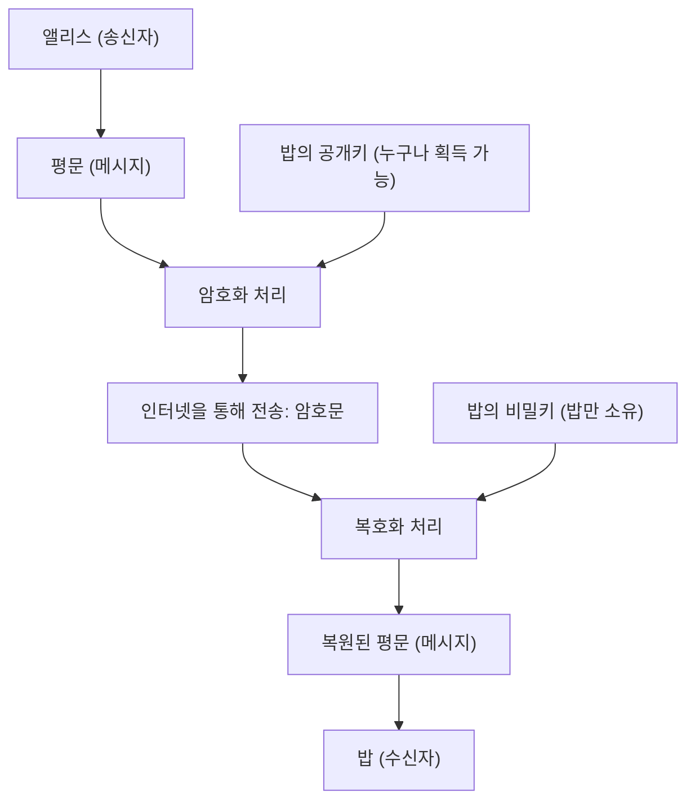
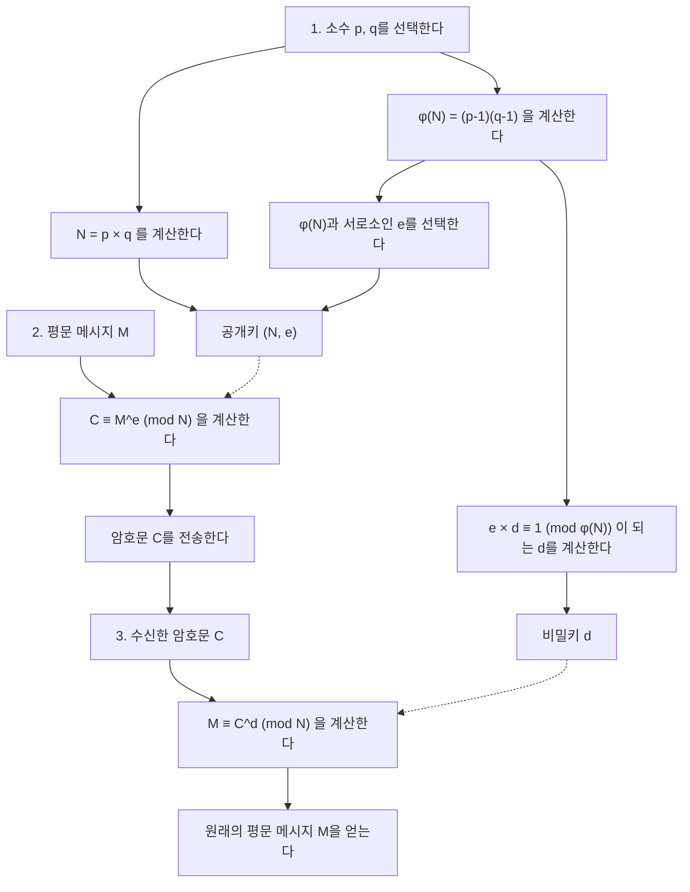
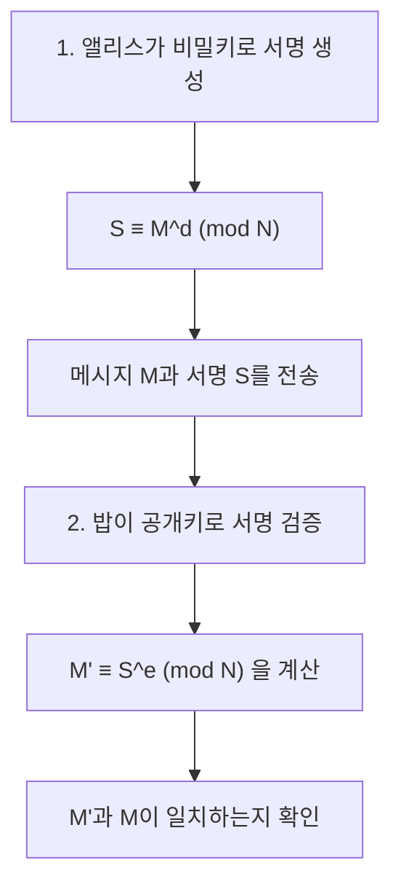

인터넷 사회의 안전을 근본적으로 지탱하고 있는 기술 중 하나가 'RSA 암호'입니다. 온라인 쇼핑에서의 신용카드 결제, 친구와의 SNS 대화, 회사의 기밀 정보 송수신 등 우리가 매일 무심코 사용하는 통신의 대부분은 이 RSA 암호나 그 후속 기술에 의해 보호받고 있습니다.

하지만 '암호'라고 하면 스파이 영화에 나올 법한 복잡한 암호기나 일부 천재만이 이해할 수 있는 초고도 수학을 상상할지도 모릅니다. 현대 암호 이론이 고도화된 수학을 바탕으로 하는 것은 사실이지만, **RSA 암호의 근본적인 원리는 고등학교에서 배우는 수학(정수의 성질, 소수, 합동식 등) 지식만 있다면 충분히 이해할 수 있는** 것입니다.

이 글에서는 고등학교 수학 지식을 출발점으로 삼아, RSA 암호가 어떤 수학적 원리로 작동하는지, 왜 해독하기 어려운지를 단계별로 철저하게 해설합니다. 수학을 조금 어려워하는 분들도 이해할 수 있도록 구체적인 예를 곁들여 자세히 설명하겠습니다.

---

## 1. 공통키 암호와 공개키 암호

RSA 암호의 수학적인 원리에 들어가기 전에, 먼저 암호의 기본적인 개념부터 정리해 보겠습니다. 암호 방식은 크게 나누어 '공통키 암호(대칭키 암호)'와 '공개키 암호' 두 가지로 나뉩니다.

### 1.1 공통키 암호 방식의 한계

예전부터 사용되어 온 암호의 대부분은 '공통키 암호 방식'이라고 불리는 것입니다. 이것은 **'암호화(메시지를 비밀 암호문으로 변환하는 것)'와 '복호화(암호문을 원래 메시지로 되돌리는 것)'에 같은 키를 사용하는** 방식입니다.

예를 들어, 앨리스가 밥에게 비밀 편지를 보낸다고 가정해 보겠습니다. 앨리스는 자물쇠(공통키)를 사용하여 상자에 편지를 넣고 잠급니다. 밥이 그 상자를 열기 위해서는 앨리스가 사용한 것과 똑같은 키를 가지고 있어야 합니다.

이 방식에는 큰 문제가 있습니다. 바로 '키 분배 문제'입니다. 멀리 떨어져 있는 앨리스와 밥이 처음 통신할 경우, 어떻게 도청당하지 않고 키를 공유할 수 있을까요? 만약 키를 우편으로 보내는 도중에 제3자에게 도난당한다면, 그 이후의 암호 통신은 모두 내용이 노출되고 맙니다.

### 1.2 획기적인 발명 '공개키 암호 방식'

이 키 분배 문제를 해결하기 위해 고안된 것이 '공개키 암호 방식'입니다. RSA 암호도 이것의 일종입니다.

공개키 암호 방식에서는 **'암호화하기 위한 키(공개키)'와 '복호화하기 위한 키(비밀키)'라는 서로 다른 두 개의 키**를 사용합니다.

1. 수신자인 밥은 '공개키'와 '비밀키' 쌍을 생성합니다.
2. 밥은 '공개키'를 전 세계에 공개합니다 (누가 가져도 상관없습니다).
3. 송신자인 앨리스는 밥의 '공개키'를 사용하여 메시지를 암호화하고 전송합니다.
4. 암호화된 메시지는 밥만이 가지고 있는 '비밀키'로만 복호화할 수 있습니다.

이것을 자물쇠에 비유하자면, 밥은 '열려 있는 상태의 자물쇠(공개키)'를 많이 만들어서 전 세계에 뿌립니다. 앨리스는 밥에게 보낼 메시지를 상자에 넣고, 주운 밥의 자물쇠로 찰칵하고 잠급니다. 자물쇠는 한 번 닫히면 밥이 가지고 있는 '마스터키(비밀키)'로만 열 수 있습니다. 중간에 누군가 상자를 훔쳐도 마스터키가 없기 때문에 열 수 없는 것입니다.



이 획기적인 시스템을 구현하기 위해서는 '공개키로 쉽게 암호화할 수 있지만, 비밀키가 없으면 절대 복호화할 수 없다'는 일종의 **'일방향 함수(일방통행인 수학적 퍼즐)'**가 필요합니다. 그 퍼즐의 부품으로 주목받은 것이 바로 우리가 잘 아는 '소수'였습니다.

---

## 2. RSA 암호를 지탱하는 수학적 기초 1: 소수와 소인수분해

RSA 암호의 안전성은 **'거대한 수의 소인수분해는 매우 어렵다'**는 수학적 사실에 바탕을 두고 있습니다.

### 2.1 소수란

소수란 '1과 자기 자신으로밖에 나누어떨어지지 않는, 1보다 큰 자연수'를 말합니다.
예: $2, 3, 5, 7, 11, 13, 17, 19, 23...$

소수는 모든 정수의 '원자'와 같은 것입니다. 어떤 자연수라도 소수들의 곱셈 형태로 분해할 수 있습니다. 이것을 **소인수분해**라고 부릅니다. 예를 들어 $60 = 2^2 \times 3 \times 5$ 처럼, 순서를 무시하면 단 한 가지로 소인수분해할 수 있다는 것은 '산술의 기본 정리'로 알려져 있습니다.

### 2.2 소인수분해의 어려움 (일방향 함수)

여기서 중요한 것은 **'곱셈은 쉽지만 소인수분해는 어렵다'**는 비대칭성입니다.

예를 들어, 다음 두 소수의 곱셈을 암산으로 계산해 보세요.
$11 \times 13 = ?$
이것은 쉽네요. 정답은 $143$입니다.

그럼, 다음 수는 어떨까요?
$323$을 소인수분해 해 보세요.
어떠신가요? 시간이 조금 걸릴 것입니다. (정답은 $17 \times 19$입니다).

수가 작으면 사람도 어떻게든 계산할 수 있지만, 수가 커지면 컴퓨터를 사용해도 계산이 폭발적으로 어려워집니다. 현재 주류인 RSA 암호에서는 2048비트(10진수로 약 600자리)라는 터무니없이 거대한 소수 $p$와 $q$를 곱한 수 $N = p \times q$를 사용합니다.

거대한 두 소수 $p$와 $q$가 주어졌을 때, $N$을 계산하는 것은 컴퓨터에게는 순식간(밀리초 이하)입니다. 하지만 반대로 $N$만 주어지고 원래의 $p$와 $q$를 찾아내는 것은 현재 가장 빠른 슈퍼컴퓨터를 수조 년 돌려도 풀지 못할 정도로 오랜 시간이 걸립니다.

이 **'계산의 비대칭성(한쪽 방향은 쉽지만 역방향은 어려움)'**이 공개키와 비밀키의 관계성을 만들어내는 토대가 됩니다.

---

## 3. RSA 암호를 지탱하는 수학적 기초 2: 합동식 (모듈로 연산)

RSA 암호의 계산은 우리가 평소 사용하는 무한히 숫자가 커지는 덧셈이나 곱셈이 아니라, 어떤 수로 나눈 '나머지'의 세계에서 이루어집니다. 이것을 **합동식(모듈로 연산)**이라고 부릅니다.

### 3.1 시계의 수학

모듈로 연산은 종종 '시계의 수학'에 비유됩니다. 현재 10시라고 할 때, 그로부터 5시간 후는 몇 시일까요? $10 + 5 = 15$시이지만, 일반적인 12시간 시계에서는 '3시'라고 대답합니다. 이것은 15를 12로 나눈 나머지가 3이기 때문입니다.

수학의 세계에서는 이것을 다음과 같이 표기합니다.
$$ 15 \equiv 3 \pmod{12} $$
"15와 3은 12를 법으로 하여 합동이다(12로 나눈 나머지가 같다)"라고 읽습니다.

### 3.2 합동식의 기본적인 성질

합동식에는 등식($=$)과 매우 비슷한 유용한 성질이 있습니다. 법(나누는 수)을 $N$이라고 하겠습니다.
$a \equiv b \pmod N$ 이고 $c \equiv d \pmod N$ 일 때, 다음이 성립합니다.

1. **덧셈:** $a + c \equiv b + d \pmod N$
2. **뺄셈:** $a - c \equiv b - d \pmod N$
3. **곱셈:** $a \times c \equiv b \times d \pmod N$
4. **거듭제곱:** $a^k \equiv b^k \pmod N$ ($k$는 자연수)

특히 중요한 것은 '거듭제곱'의 성질입니다. 이것은 **'나머지의 거듭제곱은 거듭제곱의 나머지와 같다'**는 것을 의미합니다.
예를 들어, $7^{100}$을 $5$로 나눈 나머지를 구하고 싶다고 합시다. 정직하게 $7$을 100번 곱한 뒤 $5$로 나누는 것은 힘들지만, 합동식의 성질을 사용하면 $7 \equiv 2 \pmod 5$ 이므로 $7^{100} \equiv 2^{100} \pmod 5$ 가 되어 계산을 비약적으로 단순하게 만들 수 있습니다. 암호의 세계에서는 매우 큰 수의 거듭제곱을 다루기 때문에 이 성질이 필수적입니다.

---

## 4. RSA 암호를 지탱하는 수학적 기초 3: 오일러 함수와 오일러의 정리

여기서부터가 RSA 암호의 핵심이 되는 마법의 수학입니다. '페르마의 소정리'를 일반화한 '오일러의 정리'가 등장합니다.

### 4.1 오일러의 토션트 함수 $\phi(N)$

오일러의 토션트 함수($\phi$ 함수)는 어떤 자연수 $N$에 대하여, **'1부터 $N$까지의 자연수 중 $N$과 서로소(최대공약수가 1)인 수의 개수'**를 반환하는 함수입니다.

몇 가지 예를 살펴보겠습니다.
- $\phi(5)$: 1, 2, 3, 4, 5 중에서 5와 서로소인 것은 1, 2, 3, 4의 4개. 따라서 $\phi(5) = 4$.
- $\phi(6)$: 1, 2, 3, 4, 5, 6 중에서 6과 서로소인 것은 1, 5의 2개. 따라서 $\phi(6) = 2$.

**【소수인 경우의 특별한 성질】**
$p$가 소수인 경우, 1부터 $p-1$까지의 모든 수가 $p$와 서로소가 됩니다. 따라서,
$$ \phi(p) = p - 1 $$
이 됩니다.

**【두 소수의 곱인 경우의 특별한 성질】**
서로 다른 두 소수 $p$와 $q$에 대해 $N = p \times q$ 라고 할 때, $\phi(N)$은 다음 계산으로 쉽게 구할 수 있습니다.
$$ \phi(N) = \phi(p) \times \phi(q) = (p - 1)(q - 1) $$
이 성질이 RSA 암호의 '비밀 뒷문(트랩도어)' 역할을 합니다. $p$와 $q$를 아는 사람(키 생성자)은 $\phi(N)$을 순식간에 계산할 수 있지만, $N$밖에 모르는 제3자는 $N$을 소인수분해하지 않는 한 $\phi(N)$을 구할 수 없는 것입니다.

### 4.2 오일러의 정리

레온하르트 오일러는 이 $\phi(N)$을 사용하여 다음과 같은 아름다운 정리를 증명했습니다.

**오일러의 정리:**
정수 $a$와 $N$이 서로소일 때, 다음 합동식이 성립한다.
$$ a^{\phi(N)} \equiv 1 \pmod N $$

이것은 "어떤 수 $a$를 $\phi(N)$번 곱하여 $N$으로 나누면 나머지가 반드시 $1$이 된다"는 놀라운 성질입니다. ($N$이 소수 $p$인 경우는 $a^{p-1} \equiv 1 \pmod p$ 가 되며, 페르마의 소정리라고 부릅니다).

이 오일러의 정리를 변형해 보겠습니다. 양변에 $a$를 한 번 더 곱합니다.
$$ a^{\phi(N) + 1} \equiv a \pmod N $$

나아가 임의의 정수 $k$에 대하여 $a^{k \cdot \phi(N)}$ 도 $1^k = 1$이 되므로, 다음 식이 성립합니다.
$$ a^{k \cdot \phi(N) + 1} \equiv a \pmod N $$

이 식이야말로 RSA 암호의 **'암호화한 뒤 복호화하면 원래대로 돌아온다'**는 마법을 성립시키는 근본 원리입니다.

---

## 5. RSA 암호 알고리즘: 키 생성・암호화・복호화 단계

기초 지식이 갖춰졌으니, 이제 드디어 RSA 암호의 구체적인 절차를 살펴보겠습니다. RSA 암호는 크게 '1. 키 생성', '2. 암호화', '3. 복호화'의 세 단계로 나뉩니다.



### 5.1 키 생성 (Key Generation)

수신자인 밥은 자신을 위한 '공개키'와 '비밀키'를 생성합니다.

1. **소수 선택:** 임의의 두 큰 소수 $p$와 $q$를 선택합니다.
2. **법 $N$ 계산:** $N = p \times q$ 를 계산합니다. 이 $N$은 공개됩니다.
3. **$\phi(N)$ 계산:** 오일러 함수 $\phi(N) = (p - 1)(q - 1)$ 을 계산합니다. 이것은 밥만의 비밀 숫자입니다.
4. **공개키 $e$ 선택:** $1 < e < \phi(N)$ 이면서 $\phi(N)$과 서로소인 정수 $e$를 선택합니다.
5. **비밀키 $d$ 계산:** 다음 조건을 만족하는 정수 $d$를 찾습니다.
   $$ e \times d \equiv 1 \pmod{\phi(N)} $$
   이것은 즉 '$e \times d$를 $\phi(N)$으로 나눈 나머지가 $1$이 되는 수 $d$'를 뜻합니다.

이것으로 키 준비는 완료되었습니다.
- **공개키:** $(N, e)$ 쌍. 전 세계에 공개합니다.
- **비밀키:** $d$. 절대 누구에게도 알려주지 않습니다.

### 5.2 암호화 (Encryption)

앨리스는 밥에게 비밀 메시지 $M$을 보내고 싶습니다. ($M$은 문자를 수치화한 것으로 $0 \le M < N$ 이라고 가정합니다). 앨리스는 밥의 공개키 $(N, e)$ 를 사용하여 다음과 같이 계산합니다.

$$ C \equiv M^e \pmod N $$

'메시지 $M$을 $e$제곱하고, $N$으로 나눈 나머지 $C$'를 계산합니다. 이 $C$가 암호문입니다.

### 5.3 복호화 (Decryption)

밥은 암호문 $C$를 받습니다. 밥은 비밀키 $d$를 사용하여 다음과 같이 계산합니다.

$$ M \equiv C^d \pmod N $$

'암호문 $C$를 $d$제곱하고, $N$으로 나눈 나머지'를 계산하면, 놀랍게도 원래의 메시지 $M$이 복원되는 것입니다!

---

## 6. 왜 복호화하면 원래대로 돌아가는가? (수학적 증명)

"$C$를 $d$제곱하는 것만으로 어떻게 원래의 $M$으로 돌아가지?"라고 의문이 들 수 있습니다. 여기서 앞서 다룬 '오일러의 정리'가 위력을 발휘합니다.

복호화 계산식 $C^d \pmod N$ 에 암호화 식 $C = M^e$ 를 대입해 보겠습니다.
$$ C^d \equiv (M^e)^d \equiv M^{ed} \pmod N $$

여기서 키 생성의 5단계를 떠올려 보세요. 밥은 $d$를 만들 때, $e \times d \equiv 1 \pmod{\phi(N)}$ 이 되도록 선택했습니다. 이것은 '$ed$는 $\phi(N)$의 배수에 $1$을 더한 수이다'라는 것을 의미합니다. 정수 $k$를 사용하여 다음과 같이 쓸 수 있습니다.
$$ ed = k \cdot \phi(N) + 1 $$

이것을 지수 부분에 대입하고, 지수 법칙을 사용하여 분해합니다.
$$ M^{ed} = M^{k \cdot \phi(N) + 1} = M^{k \cdot \phi(N)} \times M^1 = (M^{\phi(N)})^k \times M $$

여기서 메시지 $M$과 $N$이 서로소라고 가정하면, **오일러의 정리**에 의해 $M^{\phi(N)} \equiv 1 \pmod N$ 이 됩니다.
$$ (M^{\phi(N)})^k \times M \equiv 1^k \times M \equiv M \pmod N $$

따라서 멋지게 다음 식이 성립하게 됩니다.
$$ C^d \equiv M \pmod N $$

앨리스는 $d$를 모르고 도청자도 $d$를 모르기 때문에, $C$에서 $M$을 꺼낼 수 있는 것은 $d$를 가지고 있는 밥뿐인 것입니다.

---

## 7. 구체적인 예: 작은 소수를 사용하여 손으로 직접 RSA를 계산해 보자

실제로 작은 숫자(소수)를 사용하여 앨리스에서 밥으로 암호 통신을 해봅시다.

**【밥의 키 생성 단계】**
1. 두 소수 $p=11$, $q=13$ 을 선택합니다.
2. $N = 11 \times 13 = 143$ 을 계산합니다.
3. $\phi(N) = (11 - 1) \times (13 - 1) = 10 \times 12 = 120$ 을 계산합니다.
4. $\phi(N)=120$ 과 서로소인 공개키 $e$를 선택합니다. 여기서는 $e=7$ 로 하겠습니다.
5. 비밀키 $d$를 구합니다. $7 \times d \equiv 1 \pmod{120}$ 이 되는 $d$를 찾습니다.
   방정식 $7d = 120k + 1$ 에서 $k=6$ 일 때 $721$이 되며, $721 \div 7 = 103$.
   따라서 $d = 103$ 이 됩니다.

- 공개키: $(N=143, e=7)$
- 비밀키: $d=103$

**【앨리스의 암호화 단계】**
메시지 $M = 9$ 를 보내고 싶다고 합시다.
식: $C \equiv 9^7 \pmod{143}$
$9^7 = 4,782,969$. 이것을 143으로 나누면 몫이 $33447$이고 나머지가 $48$.
암호문 $C = 48$ 이 되었습니다.

**【밥의 복호화 단계】**
밥은 암호문 $C = 48$ 을 받고, 비밀키 $d = 103$ 을 사용하여 복호화합니다.
식: $M \equiv 48^{103} \pmod{143}$
계산기에서 `(48 ** 103) % 143` 을 실행하면, 놀랍게도 결과는 '**9**'가 됩니다! 원래 메시지를 무사히 받을 수 있었습니다.

---

## 8. 비밀키 $d$를 구하는 방법: 확장 유클리드 호제법

수작업 계산 예제에서는 감으로 $k$를 찾아 $d=103$ 을 발견했지만, 수가 수백 자리가 되면 이 방법은 불가능합니다. 실제 프로그램에서는 **'확장 유클리드 호제법'**이라는 알고리즘을 사용합니다.

$7d \equiv 1 \pmod{120}$ 을 푼다는 것은 $7d + 120y = 1$ 을 만족하는 정수 $d, y$ 를 찾는 것과 같습니다. 유클리드 호제법을 역산해 나감으로써 이를 기계적으로 구할 수 있습니다.

1. $120 \div 7 = 17$ 나머지 $1$ 
2. 이것을 변형하면 $1 = 120 - 17 \times 7$
3. 즉, $-17 \times 7 \equiv 1 \pmod{120}$

$-17$ 은 법 $120$의 세계에서는 $120 - 17 = 103$ 과 같은 의미가 됩니다. 따라서 $d = 103$ 을 순식간에 구할 수 있습니다. 이 방법은 아무리 큰 수라도 매우 빠르게 계산할 수 있습니다.

---

## 9. RSA 암호의 또 다른 얼굴: 디지털 서명

RSA 암호의 훌륭한 점은 공개키와 비밀키의 역할을 반대로 하여 **'디지털 서명'**으로도 사용할 수 있다는 것입니다.

암호화할 때는 '공개키로 암호화 $\Rightarrow$ 비밀키로 복호화'였지만,
디지털 서명에서는 '비밀키로 암호화 $\Rightarrow$ 공개키로 복호화'라는 절차를 밟습니다.



앨리스가 자신의 비밀키 $d$를 사용하여 메시지를 변환하고(이것이 서명 $S$), 밥에게 보냅니다. 밥은 앨리스의 공개키 $e$를 사용하여 검증 계산을 합니다. 만약 계산 결과가 원래 메시지와 일치한다면, '앨리스의 비밀키로만 만들 수 있는 데이터이다'라는 것과 '메시지가 중간에 위조되지 않았다'는 것이 동시에 증명되는 것입니다.

---

## 10. 프로그램으로 체감하는 RSA 암호

수작업으로는 힘든 거듭제곱 계산도 파이썬을 사용하면 매우 쉽게 구현할 수 있습니다. 다음은 RSA 암호의 핵심 로직을 체험할 수 있는 파이썬 코드입니다.

```python
def gcd(a, b):
    """최대공약수를 구한다"""
    while b != 0:
        a, b = b, a % b
    return a

def mod_inverse(e, phi):
    """비밀키 d를 구한다 (Python 3.8 이후의 내장 기능 활용)"""
    return pow(e, -1, phi)

# 1. 키 생성
p, q = 11, 13
N = p * q
phi = (p - 1) * (q - 1)
e = 7
d = mod_inverse(e, phi)

print(f"공개키: (N={N}, e={e}), 비밀키: d={d}")

# 2. 암호화
message = 9
ciphertext = pow(message, e, N)
print(f"암호문: {ciphertext}")

# 3. 복호화
decrypted_message = pow(ciphertext, d, N)
print(f"복호화된 메시지: {decrypted_message}")
```

파이썬의 `pow(base, exp, mod)` 함수는 내부적으로 '반복 제곱법(거듭제곱법)'이라는 고속 알고리즘을 사용하기 때문에 수백 자리의 숫자라도 순식간에 계산이 끝납니다.

---

## 11. 요약 및 미래의 암호 기술

고등학교 수학 지식을 바탕으로 RSA 암호의 원리를 밝혀 보았습니다.

1. **소인수분해의 어려움:** $p \times q = N$ 은 쉽지만, $N$에서 $p, q$를 찾는 것은 매우 어렵다.
2. **합동식과 오일러의 정리:** $a^{\phi(N)} \equiv 1 \pmod N$ 이라는 법칙에 의해, '어떤 수로 거듭제곱하면 원래대로 돌아가는' 마법의 트랩도어가 완성된다.
3. **공개키와 비밀키:** 누구나 암호화할 수 있지만, 복호화할 수 있는 것은 정당한 수신자뿐이다.

현재 사용되는 RSA 암호의 $N$은 600자리 이상이며, 전 세계의 슈퍼컴퓨터를 총동원해도 소인수분해에는 우주의 나이 이상의 시간이 걸립니다. 하지만 최근 연구가 진행되고 있는 '양자 컴퓨터'가 장래에 실용화되면 '쇼어의 알고리즘(Shor's algorithm)'에 의해 이 소인수분해가 순식간에 풀릴 가능성이 있습니다. 따라서 현재는 양자 컴퓨터로도 해독할 수 없는 '양자 내성 암호(Post-Quantum Cryptography)' 개발이 전 세계적으로 빠른 속도로 진행되고 있습니다.

'쓸모없다'고 여겨지기 쉬운 고도화된 수학이 사실은 우리의 일상생활을 근본적으로 지켜주고 있습니다. RSA 암호는 그런 수학의 깊이와 아름다움을 가르쳐 주는 최고의 교재입니다. 이 글을 통해 암호와 수학의 재미를 조금이라도 느끼셨기를 바랍니다.
