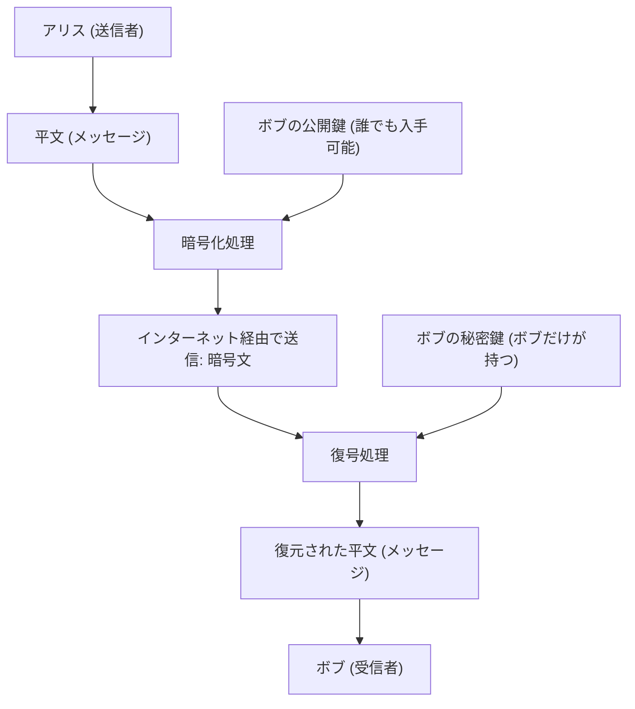
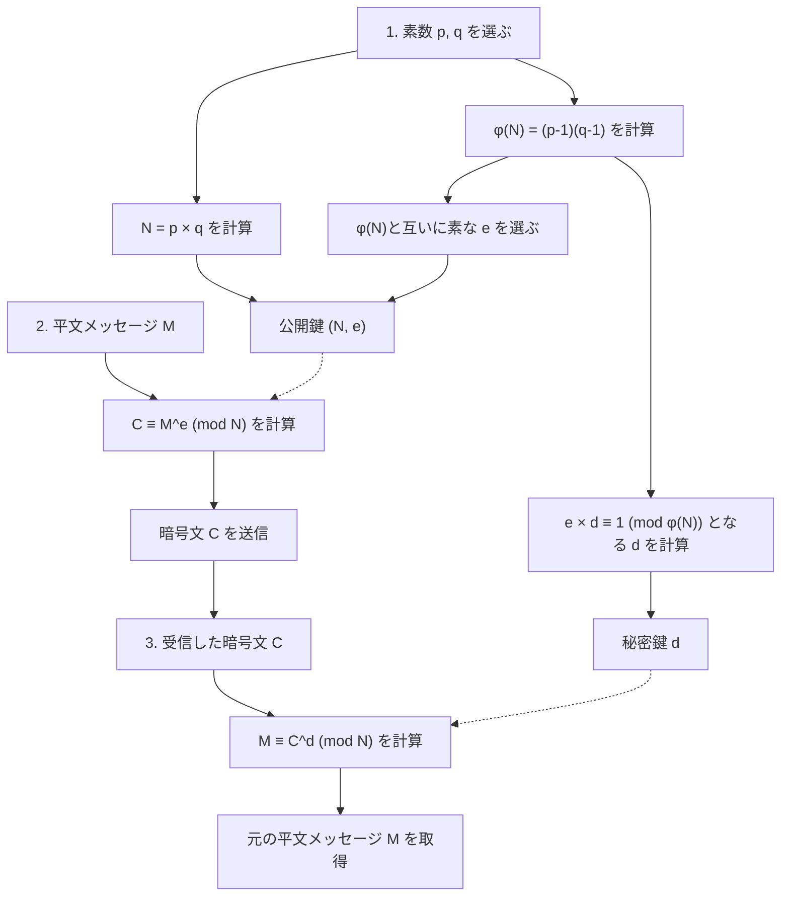
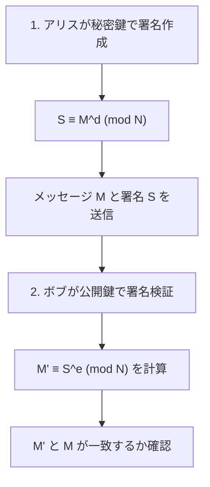

インターネット社会の安全を根底から支えている技術の一つが「RSA暗号」です。オンラインショッピングでのクレジットカード決済、友人とのSNSのやり取り、会社の機密情報の送受信など、私たちが毎日何気なく使っている通信の多くは、このRSA暗号やその後継技術によって守られています。

しかし、「暗号」と聞くと、スパイ映画に出てくるような複雑な暗号機や、一部の天才しか理解できない超高度な数学を想像するかもしれません。確かに現代の暗号理論は高度な数学に基づいていますが、**RSA暗号の根本的な仕組みは、高校で習う数学（整数の性質、素数、合同式など）の知識があれば十分に理解できる**ものです。

この記事では、高校数学の知識を出発点として、RSA暗号がどのような数学的原理で動いているのか、なぜ解読が難しいのかを、ステップバイステップで徹底的に解説します。数学が少し苦手な方でも理解できるように、具体例を交えながら丁寧に説明していきます。

---

## 1. 共通鍵暗号と公開鍵暗号

RSA暗号の数学的な仕組みに入る前に、まず暗号の基本的な考え方について整理しておきましょう。暗号方式は大きく分けて「共通鍵暗号」と「公開鍵暗号」の2種類があります。

### 1.1 共通鍵暗号方式の限界

昔から使われている暗号の多くは「共通鍵暗号方式」と呼ばれるものです。これは、**「暗号化（メッセージを秘密の暗号文に変換すること）」と「復号（暗号文を元のメッセージに戻すこと）」に同じ鍵を使う**方式です。

例えば、アリスがボブに秘密の手紙を送るとします。アリスは南京錠（共通鍵）を使って箱に手紙を入れて鍵をかけます。ボブがその箱を開けるためには、アリスが使ったのと同じ鍵を持っている必要があります。

この方式には大きな問題があります。「鍵の配送問題」です。遠く離れたアリスとボブが初めて通信する場合、どのようにして盗聴されることなく鍵を共有すればよいのでしょうか？もし鍵を郵送している途中で第三者に盗まれたら、その後の暗号通信はすべて筒抜けになってしまいます。

### 1.2 画期的な発明「公開鍵暗号方式」

この鍵の配送問題を解決するために考案されたのが「公開鍵暗号方式」です。RSA暗号もこの一種です。

公開鍵暗号方式では、**「暗号化するための鍵（公開鍵）」と「復号するための鍵（秘密鍵）」という2つの異なる鍵**を使います。

1. 受信者のボブは、「公開鍵」と「秘密鍵」のペアを作成します。
2. ボブは「公開鍵」を世界中に公開します（誰が手に入れても構いません）。
3. 送信者のアリスは、ボブの「公開鍵」を使ってメッセージを暗号化し、送信します。
4. 暗号化されたメッセージは、ボブだけが持っている「秘密鍵」でしか復号できません。

これを南京錠で例えると、ボブは「開いた状態の南京錠（公開鍵）」をたくさん作って世界中にばらまきます。アリスはボブ宛のメッセージを箱に入れ、拾ったボブの南京錠でカチャッと鍵をかけます。南京錠は一度閉まると、ボブが持っている「マスターキー（秘密鍵）」でしか開けられません。途中で誰かが箱を盗んでも、マスターキーがないので開けられないのです。



この画期的なシステムを実現するためには、「公開鍵で簡単に暗号化できるが、秘密鍵がないと絶対に復号できない」という、ある種の**「一方向性関数（一方通行の数学的パズル）」**が必要になります。そのパズルの部品として目をつけられたのが、私たちがよく知る「素数」でした。

---

## 2. RSA暗号を支える数学的基礎1：素数と素因数分解

RSA暗号の安全性は、**「巨大な数の素因数分解は非常に難しい」**という数学的事実に基づいています。

### 2.1 素数とは

素数とは、「1と自分自身でしか割り切れない、1より大きい自然数」のことです。
例：$2, 3, 5, 7, 11, 13, 17, 19, 23...$

素数は、すべての整数の「原子」のようなものです。どんな自然数も、素数の掛け算の形に分解することができます。これを**素因数分解**と呼びます。例えば、$60 = 2^2 \times 3 \times 5$ のように、順番を無視すればただ一通りに素因数分解できることは「算術の基本定理」として知られています。

### 2.2 素因数分解の難しさ（一方向性関数）

ここで重要なのは、**「掛け算は簡単だが、素因数分解は難しい」**という非対称性です。

例えば、次の2つの素数の掛け算を暗算で計算してみてください。
$11 \times 13 = ?$
これは簡単ですね。答えは $143$ です。

では、次の数はどうでしょう？
$323$ を素因数分解してください。
どうでしょうか？少し時間がかかるはずです。（答えは $17 \times 19$ です）。

数が小さければ人間でも何とか計算できますが、数が大きくなるとコンピュータを使っても計算が爆発的に難しくなります。現在主流のRSA暗号では、2048ビット（10進数で約600桁）という途方もなく巨大な素数 $p$ と $q$ を掛け合わせた数 $N = p \times q$ を使います。

2つの巨大な素数 $p$ と $q$ が与えられたとき、$N$ を計算するのはコンピュータにとって一瞬（ミリ秒以下）です。しかし、逆に $N$ だけを与えられて元の $p$ と $q$ を見つけ出すことは、現在の最速のスーパーコンピュータを何兆年回しても解けないほど時間がかかります。

この**「計算の非対称性（片道は簡単、逆道は困難）」**が、公開鍵と秘密鍵の関係性を作り出す土台になります。

---

## 3. RSA暗号を支える数学的基礎2：合同式（モジュロ演算）

RSA暗号の計算は、私たちが普段使っているような無限に数が大きくなる足し算や掛け算ではなく、ある数で割った「余り」の世界で行われます。これを**合同式（モジュロ演算）**と呼びます。

### 3.1 時計の数学

モジュロ演算はよく「時計の数学」に例えられます。現在10時だとして、そこから5時間後は何時でしょうか？ $10 + 5 = 15$ 時ですが、通常の12時間時計では「3時」と答えます。これは、15を12で割った余りが3だからです。

数学の世界では、これを次のように書き表します。
$$ 15 \equiv 3 \pmod{12} $$
「15と3は、12を法として合同である（12で割った余りが等しい）」と読みます。

### 3.2 合同式の基本的な性質

合同式には、等式（$=$）とよく似た非常に便利な性質があります。法（割る数）を $N$ とします。
$a \equiv b \pmod N$ かつ $c \equiv d \pmod N$ のとき、以下が成り立ちます。

1. **足し算:** $a + c \equiv b + d \pmod N$
2. **引き算:** $a - c \equiv b - d \pmod N$
3. **掛け算:** $a \times c \equiv b \times d \pmod N$
4. **べき乗:** $a^k \equiv b^k \pmod N$ （$k$ は自然数）

特に重要なのは「べき乗」の性質です。これは**「余りの累乗は、累乗の余りに等しい」**ことを意味します。
例えば、$7^{100}$ を $5$ で割った余りを求めたいとします。真面目に $7$ を100回掛けてから $5$ で割るのは大変ですが、合同式の性質を使えば、$7 \equiv 2 \pmod 5$ なので、$7^{100} \equiv 2^{100} \pmod 5$ となり、計算を飛躍的に簡単にしていくことができます。暗号の世界では非常に大きな数の累乗を扱うため、この性質が不可欠です。

---

## 4. RSA暗号を支える数学的基礎3：オイラー関数とオイラーの定理

ここからがRSA暗号の核心となる魔法の数学です。「フェルマーの小定理」の一般化である「オイラーの定理」が登場します。

### 4.1 オイラーのトーティエント関数 $\phi(N)$

オイラーのトーティエント関数（$\phi$ 関数）は、ある自然数 $N$ に対して、**「1から $N$ までの自然数のうち、$N$ と互いに素（最大公約数が1）である数の個数」**を返す関数です。

いくつか例を見てみましょう。
- $\phi(5)$: 1, 2, 3, 4, 5 の中で 5 と互いに素なのは 1, 2, 3, 4 の4個。よって $\phi(5) = 4$。
- $\phi(6)$: 1, 2, 3, 4, 5, 6 の中で 6 と互いに素なのは 1, 5 の2個。よって $\phi(6) = 2$。

**【素数の場合の特別な性質】**
$p$ が素数の場合、1から $p-1$ までのすべての数が $p$ と互いに素になります。したがって、
$$ \phi(p) = p - 1 $$
となります。

**【素数の積の場合の特別な性質】**
2つの異なる素数 $p$ と $q$ について、$N = p \times q$ とした場合、$\phi(N)$ は以下の計算で簡単に求めることができます。
$$ \phi(N) = \phi(p) \times \phi(q) = (p - 1)(q - 1) $$
この性質が、RSA暗号の「秘密の裏口（トラップドア）」として機能します。$p$ と $q$ を知っている人（鍵の作成者）は $\phi(N)$ を一瞬で計算できますが、$N$ しか知らない第三者は、$N$ を素因数分解しない限り $\phi(N)$ を求めることができないのです。

### 4.2 オイラーの定理

レオンハルト・オイラーは、この $\phi(N)$ を使って次のような美しい定理を証明しました。

**オイラーの定理：**
整数 $a$ と $N$ が互いに素であるとき、以下の合同式が成り立つ。
$$ a^{\phi(N)} \equiv 1 \pmod N $$

これは、「ある数 $a$ を $\phi(N)$ 回掛け合わせて $N$ で割ると、余りが必ず $1$ になる」という驚くべき性質です。（$N$ が素数 $p$ の場合は $a^{p-1} \equiv 1 \pmod p$ となり、フェルマーの小定理と呼ばれます）。

このオイラーの定理を変形してみましょう。両辺に $a$ をもう一回掛けます。
$$ a^{\phi(N) + 1} \equiv a \pmod N $$

さらに、任意の整数 $k$ に対して、$a^{k \cdot \phi(N)}$ も $1^k = 1$ になるため、次の式が成り立ちます。
$$ a^{k \cdot \phi(N) + 1} \equiv a \pmod N $$

この式こそが、RSA暗号の**「暗号化して復号すると元に戻る」**という魔法を成り立たせている根本原理なのです。

---

## 5. RSA暗号のアルゴリズム：鍵生成・暗号化・復号のステップ

基礎知識が揃ったところで、いよいよRSA暗号の具体的な手順を見ていきましょう。RSA暗号は大きく「1. 鍵の生成」「2. 暗号化」「3. 復号」の3つのフェーズに分かれます。



### 5.1 鍵生成（Key Generation）

受信者であるボブは、自分のための「公開鍵」と「秘密鍵」を生成します。

1. **素数の選択:** 2つの大きな素数 $p$ と $q$ をランダムに選びます。
2. **法 $N$ の計算:** $N = p \times q$ を計算します。この $N$ は公開されます。
3. **$\phi(N)$ の計算:** オイラー関数 $\phi(N) = (p - 1)(q - 1)$ を計算します。これはボブだけの秘密の数です。
4. **公開鍵 $e$ の選択:** $1 < e < \phi(N)$ であり、かつ $\phi(N)$ と互いに素である整数 $e$ を選びます。
5. **秘密鍵 $d$ の計算:** 次の条件を満たす整数 $d$ を見つけます。
   $$ e \times d \equiv 1 \pmod{\phi(N)} $$
   これはつまり、「$e \times d$ を $\phi(N)$ で割った余りが $1$ になるような数 $d$」です。

これで鍵の準備は完了です。
- **公開鍵:** $(N, e)$ のペア。全世界に公開します。
- **秘密鍵:** $d$。絶対に誰にも教えません。

### 5.2 暗号化（Encryption）

アリスはボブに秘密のメッセージ $M$ を送りたいとします。（$M$ は文字を数値化したもので、$0 \le M < N$ とします）。アリスはボブの公開鍵 $(N, e)$ を使って次のように計算します。

$$ C \equiv M^e \pmod N $$

「メッセージ $M$ を $e$ 乗して、$N$ で割った余り $C$」を計算します。この $C$ が暗号文です。

### 5.3 復号（Decryption）

ボブは暗号文 $C$ を受け取ります。ボブは秘密鍵 $d$ を使って次のように計算します。

$$ M \equiv C^d \pmod N $$

「暗号文 $C$ を $d$ 乗して、$N$ で割った余り」を計算すると、なんと元のメッセージ $M$ が復元されるのです！

---

## 6. なぜ復号で元に戻るのか？（数学的証明）

「$C$ を $d$ 乗するだけで、どうして元の $M$ に戻るの？」と疑問に思うかもしれません。ここで、先ほどの「オイラーの定理」が威力を発揮します。

復号の計算式 $C^d \pmod N$ に、暗号化の式 $C = M^e$ を代入してみましょう。
$$ C^d \equiv (M^e)^d \equiv M^{ed} \pmod N $$

ここで、鍵生成のステップ 5 を思い出してください。ボブは $d$ を作るときに、$e \times d \equiv 1 \pmod{\phi(N)}$ となるように選びました。これは「$ed$ は $\phi(N)$ の倍数に $1$ を足した数である」ということを意味します。整数 $k$ を使って次のように書けます。
$$ ed = k \cdot \phi(N) + 1 $$

これを指数部分に代入し、指数法則を使って分解します。
$$ M^{ed} = M^{k \cdot \phi(N) + 1} = M^{k \cdot \phi(N)} \times M^1 = (M^{\phi(N)})^k \times M $$

ここで、メッセージ $M$ と $N$ が互いに素であると仮定すると、**オイラーの定理**より $M^{\phi(N)} \equiv 1 \pmod N$ となります。
$$ (M^{\phi(N)})^k \times M \equiv 1^k \times M \equiv M \pmod N $$

したがって、見事に以下の式が成り立ちます。
$$ C^d \equiv M \pmod N $$

アリスは $d$ を知らず、盗聴者も $d$ を知らないので、$C$ から $M$ を取り出せるのは $d$ を持っているボブだけなのです。

---

## 7. 具体例：小さな素数を使って手計算でRSAを体験してみよう

実際に小さな数字（素数）を使って、アリスからボブへ暗号通信をしてみましょう。

**【ボブの鍵生成フェーズ】**
1. 2つの素数 $p=11$, $q=13$ を選びます。
2. $N = 11 \times 13 = 143$ を計算します。
3. $\phi(N) = (11 - 1) \times (13 - 1) = 10 \times 12 = 120$ を計算します。
4. $\phi(N)=120$ と互いに素な公開鍵 $e$ を選びます。ここでは $e=7$ にします。
5. 秘密鍵 $d$ を求めます。$7 \times d \equiv 1 \pmod{120}$ となる $d$ を探します。
   方程式 $7d = 120k + 1$ において、$k=6$ のとき $721$ となり、$721 \div 7 = 103$。
   したがって、$d = 103$ となります。

- 公開鍵：$(N=143, e=7)$
- 秘密鍵：$d=103$

**【アリスの暗号化フェーズ】**
メッセージ $M = 9$ を送りたいとします。
式：$C \equiv 9^7 \pmod{143}$
$9^7 = 4,782,969$。これを 143 で割ると $33447$ 余り $48$。
暗号文 $C = 48$ となりました。

**【ボブの復号フェーズ】**
ボブは暗号文 $C = 48$ を受け取り、秘密鍵 $d = 103$ を使って復号します。
式：$M \equiv 48^{103} \pmod{143}$
計算機で `(48 ** 103) % 143` を実行すると、見事に結果は「**9**」となります！元のメッセージを無事に受け取ることができました。

---

## 8. 秘密鍵 $d$ の求め方：拡張ユークリッドの互除法

手計算の例では勘で $k$ を探して $d=103$ を見つけましたが、数が何百桁にもなるとこの方法は不可能です。実際のプログラムでは**「拡張ユークリッドの互除法」**というアルゴリズムを使います。

$7d \equiv 1 \pmod{120}$ を解くということは、$7d + 120y = 1$ を満たす整数 $d, y$ を見つけることと同じです。ユークリッドの互除法を逆算していくことで、これを機械的に求めることができます。

1. $120 \div 7 = 17$ 余り $1$ 
2. これを変形すると、$1 = 120 - 17 \times 7$
3. つまり、$-17 \times 7 \equiv 1 \pmod{120}$

$-17$ は、法 $120$ の世界では $120 - 17 = 103$ と同じ意味になります。したがって、$d = 103$ が一瞬で求まるのです。この方法はどんなに巨大な数でも非常に高速に計算できます。

---

## 9. RSA暗号のもう一つの顔：デジタル署名

RSA暗号の素晴らしい点は、公開鍵と秘密鍵の役割を逆にすることで**「デジタル署名」**としても使えることです。

暗号化のときは「公開鍵で暗号化 $\Rightarrow$ 秘密鍵で復号」でしたが、
デジタル署名では「秘密鍵で暗号化 $\Rightarrow$ 公開鍵で復号」という手順を踏みます。



アリスが自身の秘密鍵 $d$ を使ってメッセージを変換し（これが署名 $S$）、ボブに送ります。ボブはアリスの公開鍵 $e$ を使って検証計算をします。もし計算結果が元のメッセージと一致すれば、「アリスの秘密鍵でしか作れないデータである」ことと、「メッセージが途中で改ざんされていないこと」が同時に証明されるのです。

---

## 10. プログラムで実感するRSA暗号

手計算では大変な累乗計算も、Pythonを使えば非常に簡単に実装できます。以下はRSA暗号のコアとなるロジックを体験できるPythonコードです。

```python
def gcd(a, b):
    """最大公約数を求める"""
    while b != 0:
        a, b = b, a % b
    return a

def mod_inverse(e, phi):
    """秘密鍵 d を求める（Python 3.8以降の組み込み機能を利用）"""
    return pow(e, -1, phi)

# 1. 鍵生成
p, q = 11, 13
N = p * q
phi = (p - 1) * (q - 1)
e = 7
d = mod_inverse(e, phi)

print(f"公開鍵: (N={N}, e={e}), 秘密鍵: d={d}")

# 2. 暗号化
message = 9
ciphertext = pow(message, e, N)
print(f"暗号文: {ciphertext}")

# 3. 復号
decrypted_message = pow(ciphertext, d, N)
print(f"復号されたメッセージ: {decrypted_message}")
```

Pythonの `pow(base, exp, mod)` 関数は内部で「繰り返し二乗法」という高速アルゴリズムを使っているため、何百桁の数であっても一瞬で計算が終わります。

---

## 11. まとめと未来の暗号技術

高校数学の知識をベースに、RSA暗号の仕組みを解き明かしてきました。

1. **素因数分解の困難性:** $p \times q = N$ は簡単だが、$N$ から $p, q$ を見つけるのは非常に難しい。
2. **合同式とオイラーの定理:** $a^{\phi(N)} \equiv 1 \pmod N$ という法則により、「ある数で累乗すると元に戻る」魔法のトラップドアが完成する。
3. **公開鍵と秘密鍵:** 誰でも暗号化できるが、復号できるのは正当な受信者だけ。

現在使われているRSA暗号の $N$ は600桁以上あり、世界中のスーパーコンピュータを総動員しても素因数分解には宇宙の年齢以上の時間がかかります。しかし、近年研究が進んでいる「量子コンピュータ」が将来実用化されると、「ショアのアルゴリズム」によってこの素因数分解が一瞬で解かれてしまう可能性があります。そのため、現在は量子コンピュータでも解読できない「耐量子計算機暗号」の開発が世界中で急ピッチで進められています。

「役に立たない」と思われがちな高度な数学が、実は私たちの日常生活を根底から守っている。RSA暗号は、そんな数学の奥深さと美しさを教えてくれる最高の教材です。この記事を通して、暗号と数学の面白さを少しでも感じていただけたなら幸いです。
