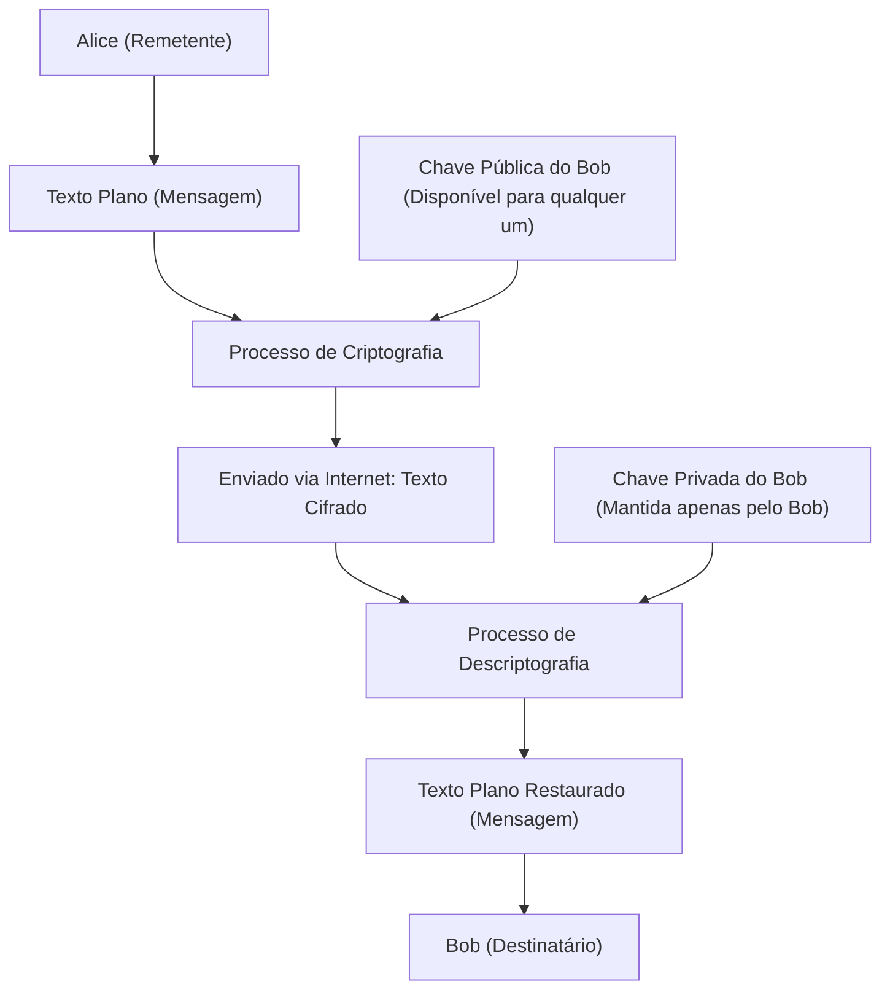
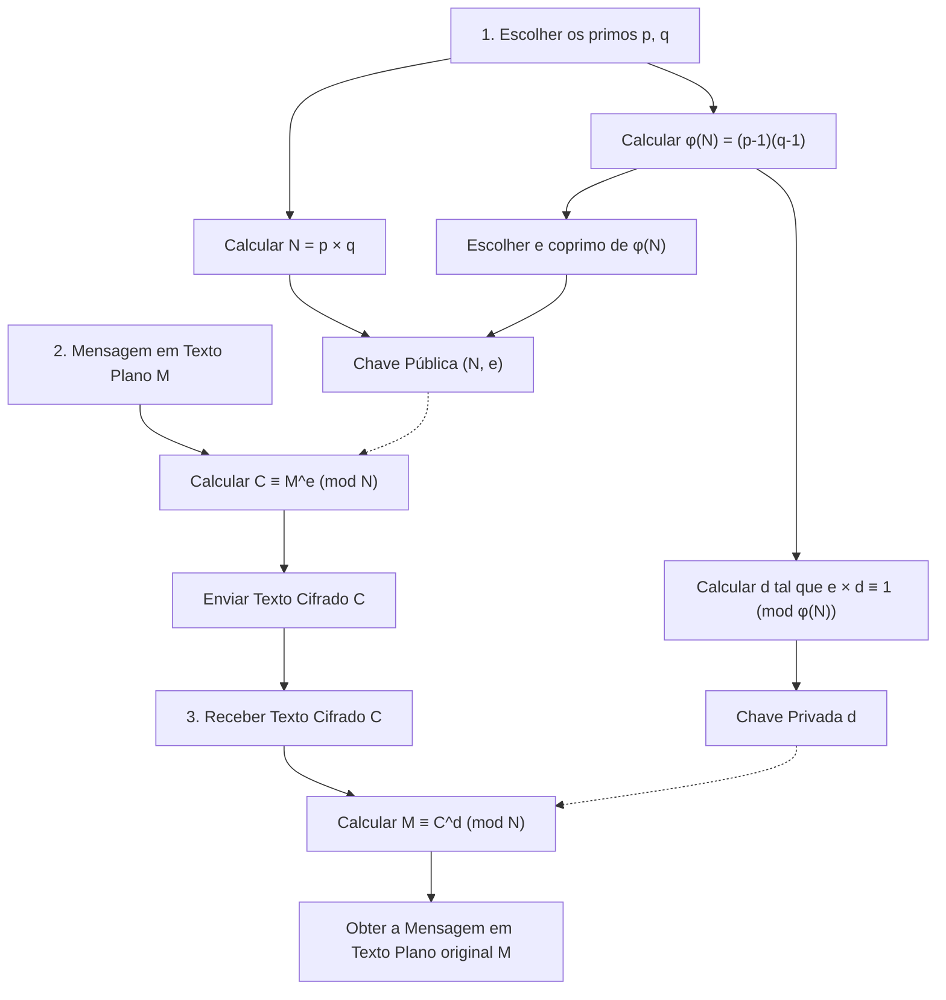
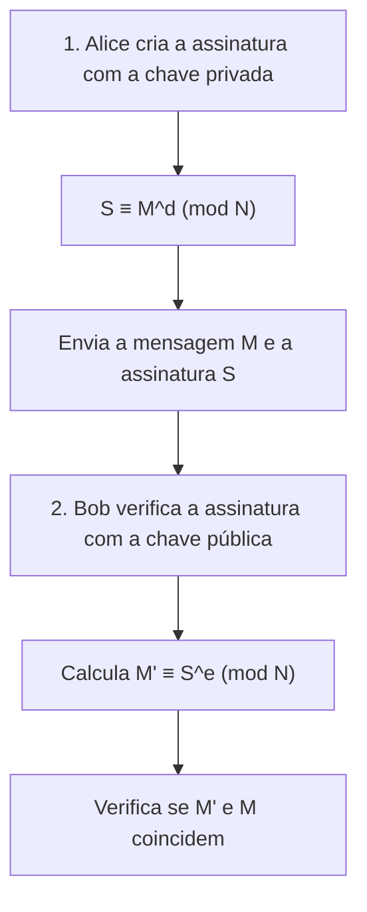

Uma das tecnologias que sustenta a segurança da nossa sociedade baseada na internet desde a sua base é a "Criptografia RSA". Muitas das comunicações que usamos casualmente todos os dias, como pagamentos com cartão de crédito em compras online, troca de mensagens em redes sociais com amigos, ou o envio e recebimento de informações confidenciais de empresas, são protegidas pela criptografia RSA e suas tecnologias sucessoras.

No entanto, ao ouvir a palavra "criptografia", você pode imaginar máquinas de cifra complexas como as que aparecem em filmes de espionagem, ou uma matemática super avançada que apenas alguns gênios conseguem entender. É verdade que a teoria criptográfica moderna é baseada em matemática avançada, mas **o mecanismo fundamental da criptografia RSA pode ser plenamente compreendido com o conhecimento de matemática ensinado no ensino médio (propriedades de números inteiros, números primos, congruências, etc.)**.

Neste artigo, usaremos o conhecimento da matemática do ensino médio como ponto de partida para explicar passo a passo e de forma aprofundada os princípios matemáticos pelos quais a criptografia RSA funciona e por que é tão difícil de quebrar. Explicarei cuidadosamente usando exemplos concretos para que mesmo aqueles que têm um pouco de dificuldade com matemática possam entender.

---

## 1. Criptografia de Chave Simétrica e Criptografia de Chave Pública

Antes de mergulhar no mecanismo matemático da criptografia RSA, vamos primeiro revisar a ideia básica de criptografia. Os métodos criptográficos podem ser amplamente divididos em dois tipos: "Criptografia de chave simétrica" e "Criptografia de chave pública".

### 1.1 Limitações da Criptografia de Chave Simétrica

Muitos dos métodos de criptografia usados há muito tempo são chamados de "Criptografia de chave simétrica". Este é um método em que **a mesma chave é usada tanto para "criptografia" (converter uma mensagem em um texto cifrado secreto) quanto para "descriptografia" (retornar o texto cifrado à mensagem original)**.

Por exemplo, suponha que a Alice vá enviar uma carta secreta ao Bob. A Alice coloca a carta em uma caixa e a tranca usando um cadeado (chave simétrica). Para o Bob abrir essa caixa, ele precisará ter a mesma chave que a Alice usou.

Este método tem um grande problema: o "Problema de distribuição de chaves". Quando Alice e Bob, que estão distantes, se comunicam pela primeira vez, como eles poderiam compartilhar a chave sem serem interceptados? Se a chave for roubada por terceiros enquanto é enviada por correio, toda a comunicação criptografada subsequente ficará totalmente exposta.

### 1.2 Uma Invenção Revolucionária: "Criptografia de Chave Pública"

A "Criptografia de chave pública" foi idealizada para resolver esse problema de distribuição de chaves. A criptografia RSA é um tipo deste sistema.

Na criptografia de chave pública, usamos **duas chaves diferentes: uma "chave para criptografar (chave pública)" e uma "chave para descriptografar (chave privada)"**.

1. O destinatário, Bob, cria um par de "chave pública" e "chave privada".
2. Bob publica a "chave pública" para todo o mundo (não importa quem a obtenha).
3. A remetente, Alice, criptografa a mensagem usando a "chave pública" de Bob e a envia.
4. A mensagem criptografada só pode ser descriptografada com a "chave privada" que apenas Bob possui.

Comparando isso com o exemplo do cadeado: Bob cria vários "cadeados abertos (chaves públicas)" e os distribui pelo mundo. Alice coloca sua mensagem destinada a Bob em uma caixa e a tranca fechando um dos cadeados que encontrou pertencente a Bob. Uma vez que o cadeado é fechado, ele só pode ser aberto com a "chave mestra (chave privada)" que Bob possui. Mesmo que alguém roube a caixa no meio do caminho, essa pessoa não conseguirá abri-la porque não tem a chave mestra.



Para implementar este sistema revolucionário, é necessária algum tipo de **"função unidirecional (um quebra-cabeça matemático de mão única)"**, que significa que "é fácil criptografar com a chave pública, mas é absolutamente impossível descriptografar sem a chave privada". Como peça para esse quebra-cabeça, a atenção se voltou para os "números primos", algo que conhecemos bem.

---

## 2. Base Matemática 1 Sustentando a Criptografia RSA: Números Primos e Fatoração em Números Primos

A segurança da criptografia RSA é baseada no fato matemático de que **"a fatoração de números gigantes em números primos é extremamente difícil"**.

### 2.1 O que são Números Primos?

Os números primos são "números naturais maiores que 1 que só podem ser divididos por 1 e por si mesmos".
Exemplo: $2, 3, 5, 7, 11, 13, 17, 19, 23...$

Os números primos são como "átomos" para todos os números inteiros. Qualquer número natural pode ser decomposto na forma de uma multiplicação de números primos. Isso é chamado de **fatoração em números primos**. Por exemplo, como em $60 = 2^2 \times 3 \times 5$, ignorando a ordem, o fato de que pode ser fatorado em números primos de apenas uma única forma é conhecido como o "Teorema Fundamental da Aritmética".

### 2.2 A Dificuldade da Fatoração em Números Primos (Função Unidirecional)

O importante aqui é a assimetria: **"A multiplicação é fácil, mas a fatoração em números primos é difícil"**.

Por exemplo, tente calcular de cabeça a multiplicação destes dois números primos:
$11 \times 13 = ?$
Isto é fácil. A resposta é $143$.

Então, que tal o próximo número?
Por favor, fatore $323$ em números primos.
E então? Deve demorar um pouco. (A resposta é $17 \times 19$).

Quando os números são pequenos, até humanos conseguem calcular de alguma forma, mas quando os números ficam grandes, o cálculo se torna explosivamente difícil, mesmo usando computadores. Na criptografia RSA moderna, usamos um número $N = p \times q$ obtido pela multiplicação de números primos incrivelmente gigantes $p$ e $q$ de 2048 bits (cerca de 600 dígitos decimais).

Quando fornecidos dois números primos gigantes $p$ e $q$, calcular $N$ leva apenas um instante (menos de um milissegundo) para um computador. No entanto, reversamente, receber apenas $N$ e encontrar os $p$ e $q$ originais leva tanto tempo que não seria resolvido mesmo rodando os supercomputadores mais rápidos da atualidade por trilhões de anos.

Essa **"assimetria computacional (um caminho é fácil, o caminho inverso é difícil)"** é a base que cria o relacionamento entre a chave pública e a chave privada.

---

## 3. Base Matemática 2 Sustentando a Criptografia RSA: Congruência (Aritmética Modular)

Os cálculos da criptografia RSA não são realizados com adição e multiplicação onde os números ficam infinitamente grandes, como costumamos usar, mas sim no mundo dos "restos" quando divididos por um certo número. Isso é chamado de **congruência (aritmética modular)**.

### 3.1 A Matemática do Relógio

A aritmética modular é frequentemente comparada com a "matemática do relógio". Supondo que agora são 10 horas, que horas serão daqui a 5 horas? $10 + 5 = 15$ horas, mas em um relógio normal de 12 horas, respondemos "3 horas". Isso ocorre porque o resto de 15 dividido por 12 é 3.

No mundo da matemática, isso é escrito da seguinte forma:
$$ 15 \equiv 3 \pmod{12} $$
Lê-se "15 e 3 são congruentes módulo 12 (os restos quando divididos por 12 são iguais)".

### 3.2 Propriedades Básicas da Congruência

A congruência possui propriedades muito úteis e semelhantes a equações (igualdades $=$). Vamos assumir que o módulo (número pelo qual dividimos) é $N$.
Quando $a \equiv b \pmod N$ e $c \equiv d \pmod N$, o seguinte é verdadeiro:

1. **Adição:** $a + c \equiv b + d \pmod N$
2. **Subtração:** $a - c \equiv b - d \pmod N$
3. **Multiplicação:** $a \times c \equiv b \times d \pmod N$
4. **Exponenciação:** $a^k \equiv b^k \pmod N$ ($k$ é um número natural)

Particularmente importante é a propriedade da "exponenciação". Isso significa que **"o resto de uma potência é igual à potência do resto"**.
Por exemplo, imagine que você queira encontrar o resto de $7^{100}$ dividido por $5$. Seria muito difícil multiplicar o $7$ por ele mesmo 100 vezes e depois dividir por $5$, mas se usarmos a propriedade da congruência, como $7 \equiv 2 \pmod 5$, então $7^{100} \equiv 2^{100} \pmod 5$, permitindo simplificar drasticamente o cálculo. No mundo da criptografia lidamos com potências de números extremamente grandes, então essa propriedade é indispensável.

---

## 4. Base Matemática 3 Sustentando a Criptografia RSA: Função de Euler e Teorema de Euler

A partir daqui, entra a matemática mágica que forma o núcleo da criptografia RSA. Apresentamos o "Teorema de Euler", que é uma generalização do "Pequeno Teorema de Fermat".

### 4.1 A Função Totiente de Euler $\phi(N)$

A função totiente de Euler (função $\phi$) é uma função que, para um determinado número natural $N$, retorna **"a quantidade de números naturais de 1 até $N$ que são coprimos de $N$ (ou seja, seu máximo divisor comum é 1)"**.

Vamos olhar alguns exemplos.
- $\phi(5)$: Dentre 1, 2, 3, 4, 5, os números coprimos de 5 são 1, 2, 3, 4; ou seja, 4 números. Portanto, $\phi(5) = 4$.
- $\phi(6)$: Dentre 1, 2, 3, 4, 5, 6, os números coprimos de 6 são 1, 5; ou seja, 2 números. Portanto, $\phi(6) = 2$.

**[Propriedade especial no caso de números primos]**
Quando $p$ é um número primo, todos os números de 1 até $p-1$ são coprimos de $p$. Logo,
$$ \phi(p) = p - 1 $$

**[Propriedade especial no caso de um produto de números primos]**
Para dois números primos distintos $p$ e $q$, quando se estabelece que $N = p \times q$, $\phi(N)$ pode ser facilmente obtido pelo seguinte cálculo:
$$ \phi(N) = \phi(p) \times \phi(q) = (p - 1)(q - 1) $$
Essa propriedade funciona como a "porta dos fundos secreta (alçapão)" na criptografia RSA. Alguém que conhece $p$ e $q$ (o criador das chaves) pode calcular $\phi(N)$ em um instante, mas um terceiro que conhece apenas $N$ não pode determinar $\phi(N)$ a menos que fatore $N$ em números primos.

### 4.2 Teorema de Euler

Leonhard Euler usou esse $\phi(N)$ para provar o seguinte belo teorema.

**Teorema de Euler:**
Quando um inteiro $a$ e $N$ são coprimos, a seguinte congruência é verdadeira:
$$ a^{\phi(N)} \equiv 1 \pmod N $$

Isso é uma propriedade surpreendente que diz: "quando você multiplica um certo número $a$ por ele mesmo $\phi(N)$ vezes e divide por $N$, o resto será sempre $1$". (Se $N$ for um número primo $p$, torna-se $a^{p-1} \equiv 1 \pmod p$, que é chamado de Pequeno Teorema de Fermat).

Vamos transformar este Teorema de Euler. Multiplicamos ambos os lados por $a$ mais uma vez.
$$ a^{\phi(N) + 1} \equiv a \pmod N $$

Além disso, para qualquer número inteiro $k$, $a^{k \cdot \phi(N)}$ também será $1^k = 1$, de modo que a seguinte fórmula é válida:
$$ a^{k \cdot \phi(N) + 1} \equiv a \pmod N $$

Esta exata equação é o princípio fundamental que faz com que a mágica da criptografia RSA de **"retornar ao original quando descriptografada após criptografar"** funcione.

---

## 5. Algoritmo da Criptografia RSA: Passos para Geração de Chaves, Criptografia e Descriptografia

Agora que temos o conhecimento básico, vamos olhar para os passos concretos da criptografia RSA. A criptografia RSA é dividida principalmente em três fases: "1. Geração de Chaves", "2. Criptografia" e "3. Descriptografia".



### 5.1 Geração de Chaves (Key Generation)

Bob, o destinatário, gera sua "chave pública" e "chave privada".

1. **Seleção dos primos:** Ele escolhe dois grandes números primos $p$ e $q$ aleatoriamente.
2. **Cálculo do módulo $N$:** Ele calcula $N = p \times q$. Este $N$ é tornado público.
3. **Cálculo de $\phi(N)$:** Ele calcula a função de Euler $\phi(N) = (p - 1)(q - 1)$. Este número é um segredo apenas do Bob.
4. **Seleção da chave pública $e$:** Ele escolhe um inteiro $e$ tal que $1 < e < \phi(N)$ e que $e$ seja coprimo de $\phi(N)$.
5. **Cálculo da chave privada $d$:** Ele encontra um inteiro $d$ que satisfaça a seguinte condição:
   $$ e \times d \equiv 1 \pmod{\phi(N)} $$
   Isso significa "um número $d$ tal que, quando $e \times d$ é dividido por $\phi(N)$, o resto é $1$".

Com isso, as chaves estão prontas.
- **Chave Pública:** O par $(N, e)$. Publicado para todo o mundo.
- **Chave Privada:** $d$. Jamais revelado a ninguém.

### 5.2 Criptografia (Encryption)

Suponha que Alice queira enviar uma mensagem secreta $M$ para Bob. (Assumimos que $M$ é um texto convertido em valor numérico, e que $0 \le M < N$). Alice usa a chave pública do Bob, $(N, e)$, para fazer o seguinte cálculo:

$$ C \equiv M^e \pmod N $$

Ela calcula "o resto $C$ obtido após elevar a mensagem $M$ à potência de $e$, e dividir por $N$". Esse $C$ é o texto cifrado.

### 5.3 Descriptografia (Decryption)

Bob recebe o texto cifrado $C$. Bob usa sua chave privada $d$ para calcular o seguinte:

$$ M \equiv C^d \pmod N $$

Ao calcular "o resto de elevar o texto cifrado $C$ à potência de $d$, e dividir por $N$", incrivelmente a mensagem original $M$ é restaurada!

---

## 6. Por que retorna ao original na descriptografia? (Prova Matemática)

Você pode se perguntar: "Por que simplesmente elevar $C$ à potência de $d$ retorna ao $M$ original?". Aqui, o "Teorema de Euler" mencionado anteriormente mostra o seu poder.

Vamos substituir a equação de criptografia $C = M^e$ na equação de descriptografia $C^d \pmod N$.
$$ C^d \equiv (M^e)^d \equiv M^{ed} \pmod N $$

Aqui, lembre-se do Passo 5 da Geração de Chaves. Ao criar $d$, Bob o escolheu de forma que $e \times d \equiv 1 \pmod{\phi(N)}$. Isso significa que "$ed$ é um múltiplo de $\phi(N)$ somado a $1$". Podemos escrevê-lo da seguinte maneira, utilizando um inteiro $k$:
$$ ed = k \cdot \phi(N) + 1 $$

Substituímos isso no expoente e o decompomos usando as leis dos expoentes:
$$ M^{ed} = M^{k \cdot \phi(N) + 1} = M^{k \cdot \phi(N)} \times M^1 = (M^{\phi(N)})^k \times M $$

Aqui, assumindo que a mensagem $M$ e $N$ são coprimos, a partir do **Teorema de Euler**, temos $M^{\phi(N)} \equiv 1 \pmod N$.
$$ (M^{\phi(N)})^k \times M \equiv 1^k \times M \equiv M \pmod N $$

Portanto, a seguinte equação é perfeitamente estabelecida:
$$ C^d \equiv M \pmod N $$

Como a Alice não conhece $d$, e o espião também não conhece $d$, apenas Bob, que possui $d$, consegue extrair o $M$ a partir de $C$.

---

## 7. Exemplo Concreto: Vamos vivenciar o RSA calculando à mão usando pequenos números primos

Vamos tentar enviar uma comunicação criptografada de Alice para Bob usando números pequenos (números primos) de fato.

**[Fase de Geração de Chaves do Bob]**
1. Escolhe-se dois números primos $p=11$, $q=13$.
2. Calcula-se $N = 11 \times 13 = 143$.
3. Calcula-se $\phi(N) = (11 - 1) \times (13 - 1) = 10 \times 12 = 120$.
4. Escolhe-se uma chave pública $e$ coprima de $\phi(N)=120$. Aqui usaremos $e=7$.
5. Calcula-se a chave privada $d$. Buscamos um $d$ que satisfaça $7 \times d \equiv 1 \pmod{120}$.
   Na equação $7d = 120k + 1$, quando $k=6$, temos $721$, e $721 \div 7 = 103$.
   Portanto, $d = 103$.

- Chave Pública: $(N=143, e=7)$
- Chave Privada: $d=103$

**[Fase de Criptografia da Alice]**
Suponha que ela queira enviar a mensagem $M = 9$.
Fórmula: $C \equiv 9^7 \pmod{143}$
$9^7 = 4.782.969$. Dividindo isso por 143, dá $33447$ com resto $48$.
O texto cifrado se tornou $C = 48$.

**[Fase de Descriptografia do Bob]**
Bob recebe o texto cifrado $C = 48$ e o descriptografa usando a chave privada $d = 103$.
Fórmula: $M \equiv 48^{103} \pmod{143}$
Se executarmos `(48 ** 103) % 143` na calculadora, brilhantemente o resultado será "**9**"! A mensagem original foi recebida com sucesso.

---

## 8. Como encontrar a Chave Privada $d$: Algoritmo de Euclides Estendido

No exemplo calculado à mão, adivinhamos o valor de $k$ para encontrar $d=103$, mas quando o número atinge centenas de dígitos, esse método se torna impossível. Nos programas reais usamos um algoritmo chamado **"Algoritmo de Euclides Estendido"**.

Resolver $7d \equiv 1 \pmod{120}$ é o mesmo que encontrar inteiros $d, y$ que satisfaçam $7d + 120y = 1$. Ao realizar os passos do Algoritmo de Euclides ao reverso, podemos encontrar isso mecanicamente.

1. $120 \div 7 = 17$ com resto $1$
2. Rearranjando isso, temos $1 = 120 - 17 \times 7$
3. Em outras palavras, $-17 \times 7 \equiv 1 \pmod{120}$

No mundo do módulo $120$, $-17$ tem o mesmo significado que $120 - 17 = 103$. Assim, o $d = 103$ pode ser encontrado em um instante. Este método consegue calcular de forma extremamente rápida por mais gigante que o número seja.

---

## 9. Outra Face da Criptografia RSA: Assinatura Digital

A parte fantástica da criptografia RSA é que, se invertermos as funções da chave pública e chave privada, ela também pode ser usada como uma **"Assinatura Digital"**.

Na criptografia os passos eram: "Criptografar com a chave pública $\Rightarrow$ Descriptografar com a chave privada",
Mas na assinatura digital seguimos os passos: "Criptografar com a chave privada $\Rightarrow$ Descriptografar com a chave pública".



A Alice transforma a mensagem usando sua própria chave privada $d$ (essa será a assinatura $S$) e envia ao Bob. O Bob faz o cálculo de verificação usando a chave pública de Alice, $e$. Se o resultado do cálculo for igual à mensagem original, isso prova simultaneamente que "os dados só poderiam ter sido criados pela chave privada da Alice" e que "a mensagem não foi adulterada no meio do caminho".

---

## 10. Sentindo a Criptografia RSA na Prática com Código

O cálculo de potências que seria difícil de fazer à mão pode ser implementado muito facilmente usando Python. A seguir, um código Python para você experienciar a lógica central da criptografia RSA.

```python
def gcd(a, b):
    """Calcular o máximo divisor comum"""
    while b != 0:
        a, b = b, a % b
    return a

def mod_inverse(e, phi):
    """Encontrar a chave privada d (usando a função embutida a partir do Python 3.8)"""
    return pow(e, -1, phi)

# 1. Geração de chaves
p, q = 11, 13
N = p * q
phi = (p - 1) * (q - 1)
e = 7
d = mod_inverse(e, phi)

print(f"Chave Pública: (N={N}, e={e}), Chave Privada: d={d}")

# 2. Criptografia
message = 9
ciphertext = pow(message, e, N)
print(f"Texto Cifrado: {ciphertext}")

# 3. Descriptografia
decrypted_message = pow(ciphertext, d, N)
print(f"Mensagem Descriptografada: {decrypted_message}")
```

Como a função `pow(base, exp, mod)` do Python usa internamente um algoritmo rápido chamado "exponenciação binária (ou método das multiplicações repetidas)", o cálculo termina em um instante mesmo para números com centenas de dígitos.

---

## 11. Conclusão e Futuro das Tecnologias de Criptografia

Nós desvendamos o mecanismo da criptografia RSA tendo como base a matemática do ensino médio.

1. **A dificuldade da fatoração em números primos:** É fácil calcular $p \times q = N$, mas é extremamente difícil encontrar $p, q$ a partir de $N$.
2. **Congruências e Teorema de Euler:** Devido à regra $a^{\phi(N)} \equiv 1 \pmod N$, completa-se o mágico alçapão onde "a exponenciação por um certo número retorna ao estado original".
3. **Chave Pública e Chave Privada:** Qualquer um pode criptografar, mas apenas o destinatário legítimo consegue descriptografar.

O $N$ da criptografia RSA usada atualmente possui mais de 600 dígitos, e mesmo que todos os supercomputadores do mundo se juntassem para faturar esse número em primos, levaria um tempo maior do que a idade do universo. No entanto, se o "computador quântico", que vem sendo pesquisado ativamente nos últimos anos, se tornar prático no futuro, essa fatoração poderá ser resolvida em instantes pelo "Algoritmo de Shor". Por esse motivo, criptografias "resistentes a computadores quânticos", que não poderiam ser quebradas nem mesmo por eles, estão sendo desenvolvidas a um ritmo acelerado pelo mundo todo.

A matemática avançada que costumamos considerar "inútil", na verdade, protege nosso dia a dia na sua essência mais profunda. A criptografia RSA é um excelente material didático que nos ensina essa profundidade e beleza da matemática. Ficaria muito feliz se através deste artigo você pudesse sentir um pouco do fascínio da criptografia e da matemática.
