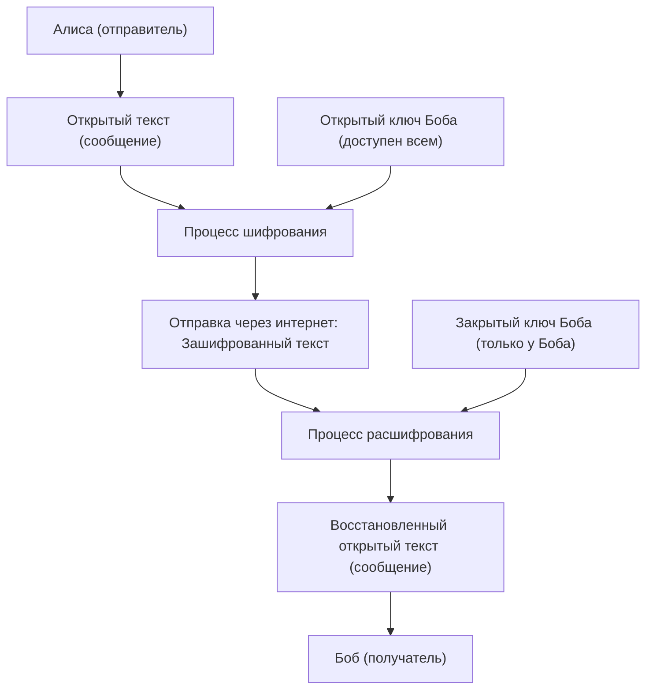
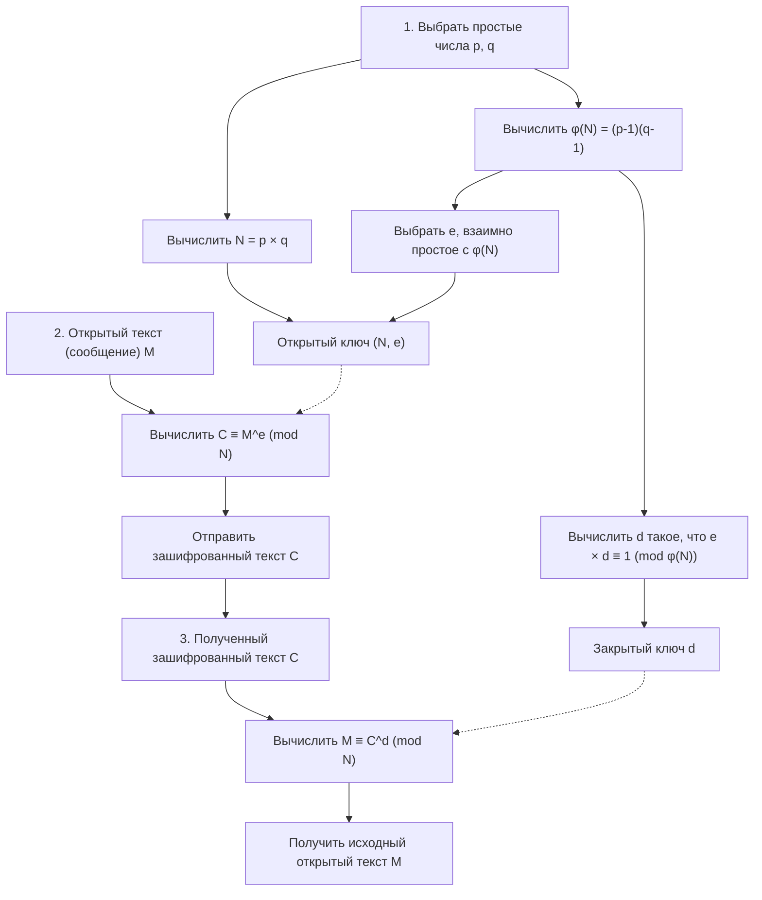
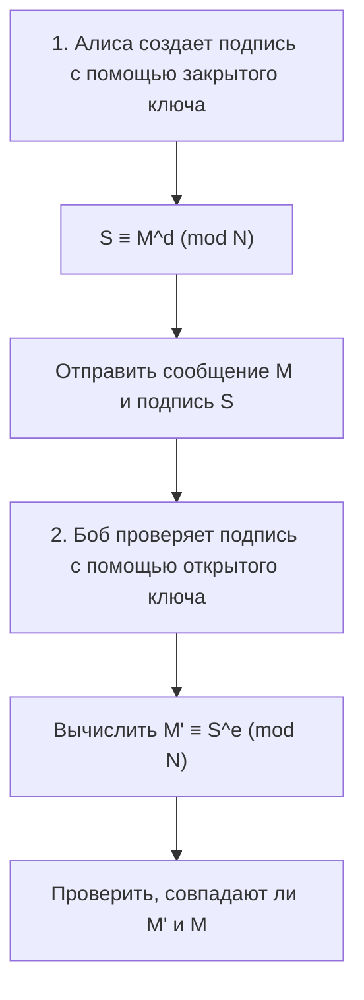

Одной из технологий, фундаментально обеспечивающих безопасность интернет-общества, является алгоритм RSA (шифрование RSA). Оплата кредитными картами в интернет-магазинах, общение с друзьями в соцсетях, отправка и получение конфиденциальной корпоративной информации — большая часть связи, которую мы небрежно используем каждый день, защищена алгоритмом RSA или технологиями-преемниками.

Однако при слове "криптография" (шифрование) вы можете представить себе сложные шифровальные машины из шпионских фильмов или сверхсложную математику, понятную лишь избранным гениям. Безусловно, современная теория криптографии основана на продвинутой математике, но **фундаментальный механизм алгоритма RSA вполне можно понять, обладая знаниями математики на уровне старшей школы (свойства целых чисел, простые числа, сравнения по модулю и т.д.)**.

В этой статье, взяв за отправную точку знания школьной математики, мы шаг за шагом подробно объясним, на каких математических принципах работает алгоритм RSA и почему его так сложно взломать. Мы будем использовать конкретные примеры и объяснять все так тщательно, чтобы даже те, кто немного не в ладах с математикой, смогли во всем разобраться.

---

## 1. Симметричное и асимметричное шифрование (с открытым ключом)

Прежде чем переходить к математическим механизмам алгоритма RSA, давайте проясним базовые концепции криптографии. Методы шифрования в целом делятся на два типа: "шифрование с симметричным ключом" и "шифрование с открытым ключом" (асимметричное).

### 1.1 Ограничения симметричного шифрования

Большинство шифров, используемых с древних времен, называются "системами симметричного шифрования". Это метод, при котором **для "шифрования" (превращения сообщения в секретный шифр) и "расшифрования" (возвращения зашифрованного текста в исходное сообщение) используется один и тот же ключ**.

Например, предположим, что Алиса отправляет Бобу секретное письмо. Алиса кладет письмо в шкатулку и запирает ее на навесной замок (общий ключ). Чтобы Боб мог открыть эту шкатулку, у него должен быть точно такой же ключ, какой использовала Алиса.

У этого метода есть серьезная проблема: "проблема распределения ключей". Если находящиеся далеко друг от друга Алиса и Боб связываются впервые, как им безопасно обменяться ключами, чтобы их никто не перехватил? Если ключ украдет третье лицо во время пересылки, все последующие зашифрованные сообщения станут достоянием гласности.

### 1.2 Революционное изобретение: "Шифрование с открытым ключом"

Для решения этой проблемы с распределением ключей была изобретена "система шифрования с открытым ключом". Алгоритм RSA относится к этому типу.

В системе с открытым ключом используются **два разных ключа: "ключ для шифрования (открытый ключ)" и "ключ для расшифрования (закрытый ключ)"**.

1. Получатель, Боб, создает пару ключей: "открытый ключ" и "закрытый ключ".
2. Боб публикует свой "открытый ключ" на весь мир (неважно, кто его получит).
3. Отправительница, Алиса, использует "открытый ключ" Боба, чтобы зашифровать сообщение и отправить его.
4. Зашифрованное сообщение можно расшифровать только с помощью "закрытого ключа", который есть только у Боба.

Если снова привести аналогию с навесным замком, то Боб создает множество "открытых навесных замков (открытых ключей)" и разбрасывает их по всему миру. Алиса кладет свое сообщение для Боба в шкатулку, берет один из замков Боба и защелкивает его. Как только замок закрыт, его можно открыть только с помощью "мастер-ключа (закрытого ключа)", который есть у Боба. Даже если кто-то украдет шкатулку по дороге, он не сможет ее открыть без мастер-ключа.



Чтобы реализовать эту революционную систему, потребовалась своего рода **"односторонняя функция (математическая головоломка с односторонним движением)"**, которая позволяет "легко зашифровать с помощью открытого ключа, но абсолютно невозможно расшифровать без закрытого". И в качестве деталей для этой головоломки были выбраны хорошо знакомые нам "простые числа".

---

## 2. Математические основы RSA 1: Простые числа и факторизация

Безопасность алгоритма RSA основана на математическом факте: **"факторизация (разложение на простые множители) огромных чисел — чрезвычайно сложная задача"**.

### 2.1 Что такое простые числа?

Простое число — это "натуральное число больше 1, которое делится без остатка только на 1 и на само себя".
Пример: $2, 3, 5, 7, 11, 13, 17, 19, 23...$

Простые числа — это словно "атомы" всех целых чисел. Любое натуральное число можно разложить в виде произведения простых чисел. Это называется **факторизацией (разложением на простые множители)**. Например, $60 = 2^2 \times 3 \times 5$. Тот факт, что любое число можно разложить на простые множители единственным образом (если не учитывать порядок), известен как "основная теорема арифметики".

### 2.2 Сложность факторизации (Односторонняя функция)

Здесь важна асимметрия: **"умножать легко, а раскладывать на множители — сложно"**.

Например, попробуйте вычислить в уме произведение следующих двух простых чисел:
$11 \times 13 = ?$
Это просто. Ответ $143$.

А как насчет следующего числа?
Разложите на простые множители $323$.
Ну как? Это должно занять некоторое время. (Ответ $17 \times 19$).

Если числа небольшие, человек еще может как-то справиться, но по мере увеличения чисел вычисления становятся взрывообразно сложными даже для компьютеров. В распространенном сегодня алгоритме RSA используется число $N = p \times q$, полученное путем перемножения двух невероятно огромных простых чисел $p$ и $q$ размером 2048 бит (около 600 цифр в десятичной системе).

Когда даны два огромных простых числа $p$ и $q$, вычисление $N$ занимает у компьютера долю секунды (меньше миллисекунды). Однако, если дано только $N$, поиск исходных $p$ и $q$ займет столько времени, что даже самые быстрые суперкомпьютеры современности не смогут решить эту задачу и за триллионы лет.

Эта **"вычислительная асимметрия (в одну сторону легко, в обратную — сложно)"** является фундаментом для создания связи между открытым и закрытым ключами.

---

## 3. Математические основы RSA 2: Сравнения (Арифметика остатков / модульная арифметика)

Вычисления в алгоритме RSA выполняются не в виде привычных нам сложений и умножений, где числа могут бесконечно расти, а в мире "остатков" от деления на определенное число. Это называется **сравнением по модулю (модульной арифметикой)**.

### 3.1 Математика часов

Модульную арифметику часто сравнивают с "математикой часов". Предположим, сейчас 10 часов. Который час будет через 5 часов? $10 + 5 = 15$ часов, но на обычных 12-часовых часах мы ответим "3 часа". Это потому, что остаток от деления 15 на 12 равен 3.

В математике это записывается следующим образом:
$$ 15 \equiv 3 \pmod{12} $$
Это читается как "15 сравнимо с 3 по модулю 12 (остатки от деления на 12 равны)".

### 3.2 Основные свойства сравнений

Сравнения обладают очень удобными свойствами, похожими на свойства обычных уравнений ($=$). Пусть модуль (делитель) равен $N$.
Если $a \equiv b \pmod N$ и $c \equiv d \pmod N$, то выполняется следующее:

1. **Сложение:** $a + c \equiv b + d \pmod N$
2. **Вычитание:** $a - c \equiv b - d \pmod N$
3. **Умножение:** $a \times c \equiv b \times d \pmod N$
4. **Возведение в степень:** $a^k \equiv b^k \pmod N$ (где $k$ — натуральное число)

Особенно важным является свойство "возведения в степень". Оно означает, что **"остаток от степени равен степени от остатка"**.
Например, мы хотим найти остаток от деления $7^{100}$ на $5$. Честно умножать $7$ само на себя 100 раз, а затем делить на $5$ было бы очень сложно. Но используя свойства сравнений, поскольку $7 \equiv 2 \pmod 5$, мы получаем $7^{100} \equiv 2^{100} \pmod 5$, что позволяет кардинально упростить вычисления. В мире криптографии мы работаем с возведением в степень очень больших чисел, поэтому это свойство просто необходимо.

---

## 4. Математические основы RSA 3: Функция Эйлера и теорема Эйлера

Здесь начинается магическая математика, составляющая ядро RSA. Появляется "теорема Эйлера", которая является обобщением "малой теоремы Ферма".

### 4.1 Функция Эйлера (тотиент) $\phi(N)$

Функция Эйлера (функция $\phi$) для некоторого натурального числа $N$ — это функция, которая возвращает **"количество натуральных чисел от 1 до $N$, которые взаимно просты с $N$ (наибольший общий делитель равен 1)"**.

Давайте рассмотрим несколько примеров.
- $\phi(5)$: Среди 1, 2, 3, 4, 5 взаимно простыми с 5 являются 1, 2, 3, 4 — всего 4 числа. Следовательно, $\phi(5) = 4$.
- $\phi(6)$: Среди 1, 2, 3, 4, 5, 6 взаимно простыми с 6 являются 1, 5 — всего 2 числа. Следовательно, $\phi(6) = 2$.

**【Особое свойство для простых чисел】**
Если $p$ — простое число, все числа от 1 до $p-1$ взаимно просты с $p$. Следовательно,
$$ \phi(p) = p - 1 $$

**【Особое свойство для произведения простых чисел】**
Для двух различных простых чисел $p$ и $q$, если $N = p \times q$, то $\phi(N)$ можно легко вычислить следующим образом:
$$ \phi(N) = \phi(p) \times \phi(q) = (p - 1)(q - 1) $$
Это свойство служит "потайной дверью" (лазейкой) в алгоритме RSA. Тот, кто знает $p$ и $q$ (создатель ключа), может вычислить $\phi(N)$ за мгновение, но третье лицо, знающее только $N$, не сможет вычислить $\phi(N)$ без разложения $N$ на простые множители.

### 4.2 Теорема Эйлера

Леонард Эйлер, используя функцию $\phi(N)$, доказал следующую красивую теорему.

**Теорема Эйлера:**
Если целое число $a$ и $N$ взаимно просты, то выполняется следующее сравнение:
$$ a^{\phi(N)} \equiv 1 \pmod N $$

Это удивительное свойство: "если умножить некоторое число $a$ само на себя $\phi(N)$ раз и разделить на $N$, остаток всегда будет равен $1$". (Если $N$ — простое число $p$, это принимает вид $a^{p-1} \equiv 1 \pmod p$ и называется малой теоремой Ферма).

Давайте преобразуем эту теорему Эйлера. Умножим обе части на $a$ еще раз.
$$ a^{\phi(N) + 1} \equiv a \pmod N $$

Более того, для любого целого числа $k$, $a^{k \cdot \phi(N)}$ также будет равно $1^k = 1$, поэтому выполняется следующее равенство:
$$ a^{k \cdot \phi(N) + 1} \equiv a \pmod N $$

Именно эта формула является фундаментальным принципом, на котором строится магия RSA: **"после шифрования и расшифрования мы возвращаемся к исходному значению"**.

---

## 5. Алгоритм RSA: Шаги генерации ключей, шифрования и расшифрования

Теперь, когда у нас есть базовые знания, давайте посмотрим на конкретные шаги алгоритма RSA. Алгоритм RSA можно разделить на три основные фазы: "1. Генерация ключей", "2. Шифрование" и "3. Расшифрование".



### 5.1 Генерация ключей (Key Generation)

Получатель, Боб, генерирует для себя "открытый ключ" и "закрытый ключ".

1. **Выбор простых чисел:** Случайным образом выбираются два больших простых числа $p$ и $q$.
2. **Вычисление модуля $N$:** Вычисляется $N = p \times q$. Это $N$ становится публичным.
3. **Вычисление $\phi(N)$:** Вычисляется функция Эйлера $\phi(N) = (p - 1)(q - 1)$. Это секретное число Боба.
4. **Выбор открытого ключа $e$:** Выбирается целое число $e$ такое, что $1 < e < \phi(N)$ и $e$ взаимно просто с $\phi(N)$.
5. **Вычисление закрытого ключа $d$:** Находится целое число $d$, удовлетворяющее следующему условию:
   $$ e \times d \equiv 1 \pmod{\phi(N)} $$
   Иными словами, "$d$ — это такое число, при котором остаток от деления $e \times d$ на $\phi(N)$ равен $1$".

На этом подготовка ключей завершена.
- **Открытый ключ:** Пара $(N, e)$. Публикуется для всего мира.
- **Закрытый ключ:** $d$. Никогда никому не передается.

### 5.2 Шифрование (Encryption)

Допустим, Алиса хочет отправить Бобу секретное сообщение $M$. ($M$ — это числовое представление текста, причем $0 \le M < N$). Алиса использует открытый ключ Боба $(N, e)$ и выполняет следующие вычисления:

$$ C \equiv M^e \pmod N $$

Она вычисляет "остаток $C$ от деления сообщения $M$ в степени $e$ на $N$". Это $C$ и есть зашифрованный текст.

### 5.3 Расшифрование (Decryption)

Боб получает зашифрованный текст $C$. Боб использует закрытый ключ $d$ и выполняет следующие вычисления:

$$ M \equiv C^d \pmod N $$

Если вычислить "остаток от деления зашифрованного текста $C$ в степени $d$ на $N$", то удивительным образом восстанавливается исходное сообщение $M$!

---

## 6. Почему расшифрование возвращает исходное сообщение? (Математическое доказательство)

Вы можете задаться вопросом: "Как так получается, что простое возведение $C$ в степень $d$ возвращает нас к исходному $M$?". Вот тут-то и проявляет свою силу ранее упомянутая "теорема Эйлера".

Давайте подставим формулу шифрования $C = M^e$ в формулу расшифрования $C^d \pmod N$.
$$ C^d \equiv (M^e)^d \equiv M^{ed} \pmod N $$

Здесь вспомните шаг 5 генерации ключей. Боб при создании $d$ выбрал его так, чтобы выполнялось условие $e \times d \equiv 1 \pmod{\phi(N)}$. Это означает, что "$ed$ — это число, кратное $\phi(N)$, плюс $1$". Используя целое число $k$, это можно записать следующим образом:
$$ ed = k \cdot \phi(N) + 1 $$

Подставим это в показатель степени и разложим с помощью правил возведения в степень:
$$ M^{ed} = M^{k \cdot \phi(N) + 1} = M^{k \cdot \phi(N)} \times M^1 = (M^{\phi(N)})^k \times M $$

Если предположить, что сообщение $M$ и $N$ взаимно просты, то согласно **теореме Эйлера** получаем $M^{\phi(N)} \equiv 1 \pmod N$.
$$ (M^{\phi(N)})^k \times M \equiv 1^k \times M \equiv M \pmod N $$

Следовательно, блестяще выполняется следующая формула:
$$ C^d \equiv M \pmod N $$

Алиса не знает $d$, перехватчик тоже не знает $d$, поэтому получить $M$ из $C$ может только Боб, владеющий ключом $d$.

---

## 7. Конкретный пример: давайте испытаем RSA вручную, используя небольшие простые числа

Давайте попробуем выполнить зашифрованную связь от Алисы к Бобу на практике, используя небольшие числа (простые числа).

**【Фаза генерации ключей Боба】**
1. Выбираем два простых числа $p=11$, $q=13$.
2. Вычисляем $N = 11 \times 13 = 143$.
3. Вычисляем $\phi(N) = (11 - 1) \times (13 - 1) = 10 \times 12 = 120$.
4. Выбираем открытый ключ $e$, взаимно простой с $\phi(N)=120$. Пусть $e=7$.
5. Находим закрытый ключ $d$. Ищем такое $d$, чтобы выполнялось $7 \times d \equiv 1 \pmod{120}$.
   В уравнении $7d = 120k + 1$, если $k=6$, получаем $721$, а $721 \div 7 = 103$.
   Следовательно, $d = 103$.

- Открытый ключ: $(N=143, e=7)$
- Закрытый ключ: $d=103$

**【Фаза шифрования Алисы】**
Предположим, мы хотим отправить сообщение $M = 9$.
Формула: $C \equiv 9^7 \pmod{143}$
$9^7 = 4,782,969$. Если разделить это число на 143, получим $33447$ с остатком $48$.
Зашифрованный текст получился $C = 48$.

**【Фаза расшифрования Боба】**
Боб получает зашифрованный текст $C = 48$ и использует закрытый ключ $d = 103$ для его расшифрования.
Формула: $M \equiv 48^{103} \pmod{143}$
Если запустить на калькуляторе или в программе `(48 ** 103) % 143`, результат блестяще окажется равным "**9**"! Исходное сообщение успешно получено.

---

## 8. Как найти закрытый ключ $d$: Расширенный алгоритм Евклида

В примере с ручными вычислениями мы нашли $d=103$, подобрав $k$ интуитивно, но если числа состоят из сотен цифр, этот метод не сработает. В реальных программах используется алгоритм, называемый **"расширенным алгоритмом Евклида"**.

Решить $7d \equiv 1 \pmod{120}$ — это то же самое, что найти целые числа $d$ и $y$, удовлетворяющие уравнению $7d + 120y = 1$. Выполняя алгоритм Евклида в обратном порядке, это можно вычислить механически.

1. $120 \div 7 = 17$, остаток $1$ 
2. Если преобразовать это, получим $1 = 120 - 17 \times 7$
3. То есть, $-17 \times 7 \equiv 1 \pmod{120}$

В мире по модулю $120$, число $-17$ имеет то же значение, что и $120 - 17 = 103$. Следовательно, мы мгновенно находим $d = 103$. Этот метод позволяет выполнять вычисления очень быстро даже для огромных чисел.

---

## 9. Другое лицо RSA: Цифровая подпись

Замечательной особенностью алгоритма RSA является то, что, поменяв ролями открытый и закрытый ключи, его можно использовать как **"цифровую подпись"**.

При шифровании порядок был таким: "шифрование открытым ключом $\Rightarrow$ расшифрование закрытым ключом",
а в цифровой подписи выполняется процедура "шифрование закрытым ключом $\Rightarrow$ расшифрование открытым ключом".



Алиса использует свой закрытый ключ $d$ для преобразования сообщения (это и есть подпись $S$) и отправляет его Бобу. Боб использует открытый ключ Алисы $e$ для выполнения проверочных вычислений. Если результат вычислений совпадает с исходным сообщением, это одновременно доказывает, что "эти данные могли быть созданы только с помощью закрытого ключа Алисы" и что "сообщение не было изменено в пути".

---

## 10. RSA на практике в коде

Возведение в степень, которое сложно сделать вручную, очень легко реализовать с помощью Python. Ниже представлен код на Python, позволяющий опробовать основную логику алгоритма RSA.

```python
def gcd(a, b):
    """Найти наибольший общий делитель"""
    while b != 0:
        a, b = b, a % b
    return a

def mod_inverse(e, phi):
    """Найти закрытый ключ d (используется встроенная функция Python 3.8 и выше)"""
    return pow(e, -1, phi)

# 1. Генерация ключей
p, q = 11, 13
N = p * q
phi = (p - 1) * (q - 1)
e = 7
d = mod_inverse(e, phi)

print(f"Открытый ключ: (N={N}, e={e}), Закрытый ключ: d={d}")

# 2. Шифрование
message = 9
ciphertext = pow(message, e, N)
print(f"Зашифрованный текст: {ciphertext}")

# 3. Расшифрование
decrypted_message = pow(ciphertext, d, N)
print(f"Расшифрованное сообщение: {decrypted_message}")
```

Функция `pow(base, exp, mod)` в Python внутри использует быстрый алгоритм, называемый "алгоритмом возведения в степень справа налево" (быстрое возведение в степень по модулю), поэтому вычисления для чисел из сотен цифр завершаются мгновенно.

---

## 11. Заключение и будущее криптографии

Основываясь на знаниях школьной математики, мы разобрали механизмы работы алгоритма RSA.

1. **Сложность факторизации:** Легко вычислить $p \times q = N$, но очень сложно найти $p, q$ по заданному $N$.
2. **Сравнения и теорема Эйлера:** Благодаря закону $a^{\phi(N)} \equiv 1 \pmod N$ создается волшебная потайная дверь, позволяющая "вернуться к исходному значению при возведении в определенную степень".
3. **Открытый и закрытый ключи:** Зашифровать может кто угодно, но расшифровать способен только законный получатель.

Используемое в настоящее время в алгоритме RSA число $N$ состоит из более чем 600 цифр, и даже если задействовать все суперкомпьютеры в мире, разложение его на множители займет больше времени, чем возраст Вселенной. Однако, когда "квантовые компьютеры", исследования которых ведутся в последние годы, будут введены в практическое использование в будущем, с помощью "алгоритма Шора" эту задачу факторизации можно будет решить за мгновение. По этой причине во всем мире сейчас ускоренными темпами ведется разработка "постквантовой криптографии", которая не может быть взломана даже квантовыми компьютерами.

Продвинутая математика, которая часто считается "бесполезной", на самом деле фундаментально защищает нашу повседневную жизнь. Алгоритм RSA — это прекрасный учебный материал, который демонстрирует глубину и красоту математики. Мы надеемся, что благодаря этой статье вы смогли хотя бы немного почувствовать, насколько интересными могут быть криптография и математика.
