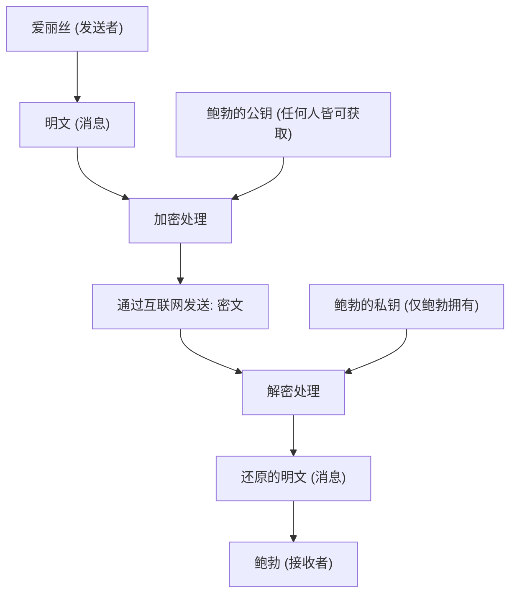
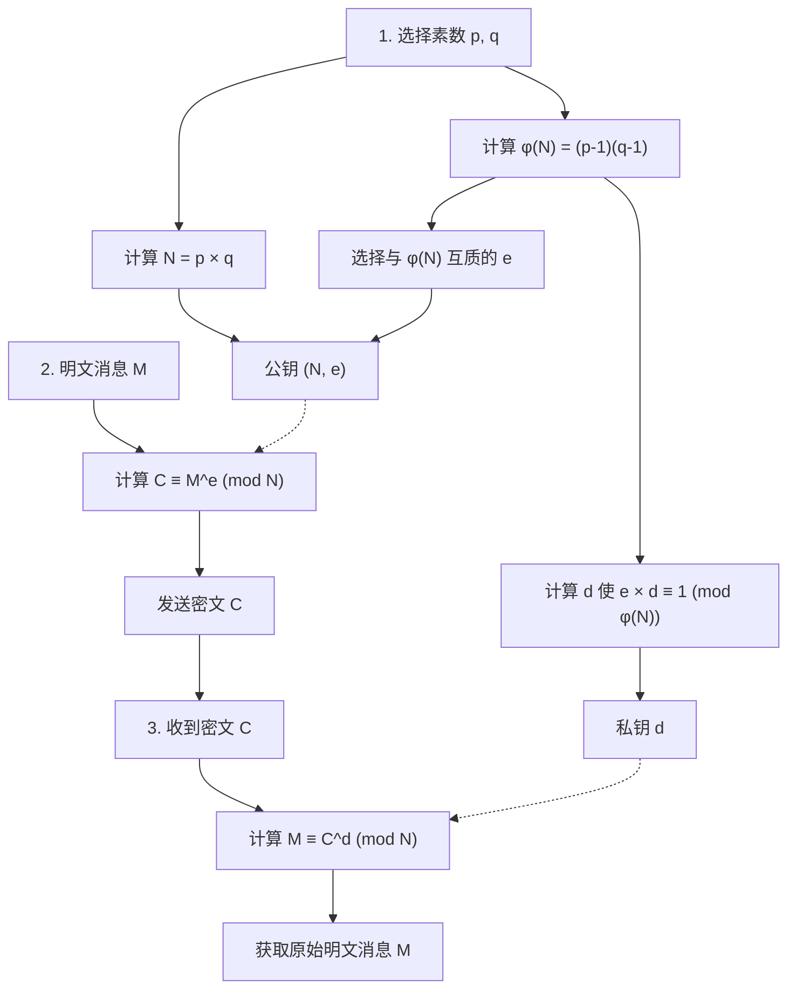
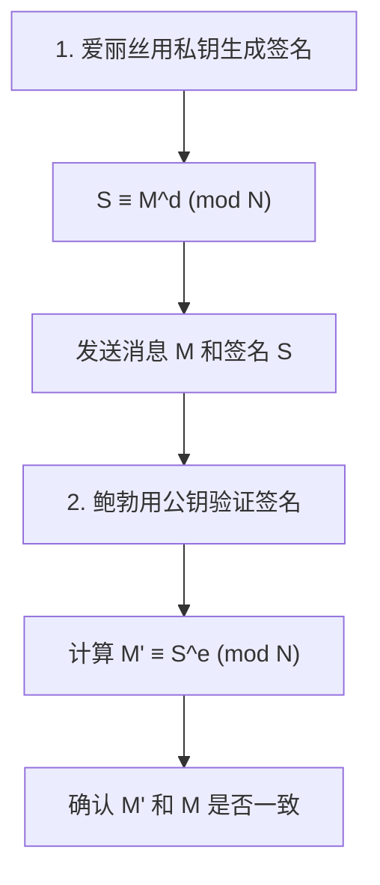

互联网社会安全的基础技术之一是“RSA加密”。在线购物的信用卡支付、与朋友的SNS交流、公司机密信息的收发等，我们每天都在不经意间使用的很多通信，都是由RSA加密或其后继技术保护着的。

然而，一听到“密码（加密）”，你可能会想象出间谍电影中出现的复杂密码机，或者只有少数天才才能理解的超高级数学。确实，现代密码学基于高级数学，但**RSA加密的根本原理，只要有高中学过的数学（整数的性质、素数、同余式等）知识就足以理解**。

本文将以高中数学知识为起点，逐步彻底解说RSA加密是基于怎样的数学原理运行的，以及为什么破解它如此困难。为了让稍微不擅长数学的人也能理解，我们将结合具体例子进行详细说明。

---

## 1. 对称加密与非对称加密（公开密钥加密）

在进入RSA加密的数学原理之前，我们先来整理一下加密的基本概念。加密方式大致分为“对称加密（共享密钥加密）”和“非对称加密（公开密钥加密）”两种。

### 1.1 对称加密方式的局限性

自古以来使用的密码大多被称为“对称加密方式”。这是一种**在“加密（将消息转换为秘密的密文）”和“解密（将密文还原为原始消息）”时使用相同密钥**的方式。

例如，爱丽丝想给鲍勃发送一封秘密信件。爱丽丝用挂锁（对称密钥）把信锁在盒子里。鲍勃要打开那个盒子，就必须拥有与爱丽丝使用的相同的钥匙。

这种方式存在一个大问题，那就是“密钥分发问题”。相隔遥远的爱丽丝和鲍勃在第一次通信时，该如何共享密钥而不被窃听呢？如果在邮寄密钥的途中被第三方窃取，之后的加密通信将全部泄露。

### 1.2 划时代的发明“公开密钥加密方式”

为了解决这个密钥分发问题而发明的就是“公开密钥加密方式”。RSA加密也是其中一种。

在公开密钥加密方式中，使用**“用于加密的密钥（公钥）”和“用于解密的密钥（私钥）”这两个不同的密钥**。

1. 接收者鲍勃创建一对“公钥”和“私钥”。
2. 鲍勃将“公钥”向全世界公开（任何人获取都可以）。
3. 发送者爱丽丝使用鲍勃的“公钥”对消息进行加密并发送。
4. 加密后的消息，只有拥有鲍勃“私钥”的人（即鲍勃自己）才能解密。

如果用挂锁来比喻，鲍勃制作了许多“处于打开状态的挂锁（公钥）”并散布到全世界。爱丽丝把要寄给鲍勃的信放进盒子里，捡起鲍勃的挂锁“咔哒”一声锁上。挂锁一旦锁上，就只能用鲍勃拥有的“万能钥匙（私钥）”才能打开。即使有人中途偷了盒子，因为没有万能钥匙也无法打开。



为了实现这个划时代的系统，需要一种**“单向函数（单向的数学谜题）”**，即“用公钥很容易加密，但如果没有私钥绝对无法解密”。作为这个谜题的部件而被看中的，就是我们熟知的“素数（质数）”。

---

## 2. 支撑RSA加密的数学基础1：素数与素因数分解

RSA加密的安全性基于**“对巨大数字进行素因数分解非常困难”**这一数学事实。

### 2.1 什么是素数

素数是指“只能被1和自身整除的、大于1的自然数”。
例如：$2, 3, 5, 7, 11, 13, 17, 19, 23...$

素数就像是所有整数的“原子”。任何自然数都可以分解成素数相乘的形式。这被称为**素因数分解**。例如，$60 = 2^2 \times 3 \times 5$，如果不考虑顺序，素因数分解的方式只有一种，这就是著名的“算术基本定理”。

### 2.2 素因数分解的困难性（单向函数）

这里重要的是**“乘法很容易，但素因数分解很难”**这种非对称性。

例如，请心算下面两个素数的乘法：
$11 \times 13 = ?$
这很简单吧。答案是 $143$。

那么，下面这个数呢？
请对 $323$ 进行素因数分解。
怎么样？应该会花点时间吧。（答案是 $17 \times 19$）。

如果数字很小，人类还能勉强计算出来，但当数字变大时，即使使用计算机，计算也会呈爆炸式增长。目前主流的RSA加密中，使用了2048位（十进制约600位）这样极其巨大的素数 $p$ 和 $q$ 相乘得到的数 $N = p \times q$。

当给出两个巨大的素数 $p$ 和 $q$ 时，计算机计算 $N$ 只需要一瞬间（不到一毫秒）。然而，反过来如果只给出 $N$，要找出原来的 $p$ 和 $q$，即使让目前最快的超级计算机运行数万亿年也解不出来。

这种**“计算的非对称性（去向容易，逆向困难）”**，构成了公钥和私钥之间关系的基础。

---

## 3. 支撑RSA加密的数学基础2：同余式（模运算）

RSA加密的计算，并不是我们在日常生活中使用的无限变大的加法或乘法，而是在除以某个数后的“余数”世界里进行的。这被称为**同余式（模运算）**。

### 3.1 钟表数学

模运算常被比喻为“钟表数学”。假设现在是10点，那么5小时后是几点？虽然 $10 + 5 = 15$ 点，但在普通的12小时制钟表上，我们会回答“3点”。这是因为15除以12的余数是3。

在数学世界中，这被写成如下形式：
$$ 15 \equiv 3 \pmod{12} $$
读作“15和3在模12下同余（除以12的余数相等）”。

### 3.2 同余式的基本性质

同余式有着与等式（$=$）非常相似且非常方便的性质。设模数（除数）为 $N$。
当 $a \equiv b \pmod N$ 且 $c \equiv d \pmod N$ 时，以下性质成立：

1. **加法:** $a + c \equiv b + d \pmod N$
2. **减法:** $a - c \equiv b - d \pmod N$
3. **乘法:** $a \times c \equiv b \times d \pmod N$
4. **乘方:** $a^k \equiv b^k \pmod N$ （$k$ 为自然数）

特别重要的是“乘方”的性质。这意味着**“余数的乘方，等于乘方的余数”**。
例如，假设我们想求 $7^{100}$ 除以 $5$ 的余数。如果要老老实实地把 $7$ 乘100次再除以 $5$，那简直是场灾难。但如果使用同余式的性质，因为 $7 \equiv 2 \pmod 5$，所以 $7^{100} \equiv 2^{100} \pmod 5$，计算就会变得非常简单。在密码学的世界里，因为要处理非常大的数字的乘方，所以这个性质是必不可少的。

---

## 4. 支撑RSA加密的数学基础3：欧拉函数与欧拉定理

接下来的部分是RSA加密核心的魔法数学。作为“费马小定理”的推广，“欧拉定理”即将登场。

### 4.1 欧拉函数 $\phi(N)$

欧拉函数（$\phi$ 函数）是指，对于某个自然数 $N$，**“返回从1到 $N$ 的自然数中，与 $N$ 互质（最大公约数为1）的数的个数”**的函数。

我们来看几个例子：
- $\phi(5)$: 在 1, 2, 3, 4, 5 中，与 5 互质的数有 1, 2, 3, 4，共4个。因此 $\phi(5) = 4$。
- $\phi(6)$: 在 1, 2, 3, 4, 5, 6 中，与 6 互质的数有 1, 5，共2个。因此 $\phi(6) = 2$。

**【素数时的特殊性质】**
当 $p$ 是素数时，从1到 $p-1$ 的所有数都与 $p$ 互质。因此，
$$ \phi(p) = p - 1 $$

**【素数乘积时的特殊性质】**
对于两个不同的素数 $p$ 和 $q$，如果 $N = p \times q$，那么 $\phi(N)$ 可以通过以下计算轻松求出：
$$ \phi(N) = \phi(p) \times \phi(q) = (p - 1)(q - 1) $$
这个性质起到了RSA加密中“秘密后门（陷门）”的作用。知道 $p$ 和 $q$ 的人（密钥创建者）可以瞬间计算出 $\phi(N)$，而只知道 $N$ 的第三方，除非对 $N$ 进行素因数分解，否则无法求出 $\phi(N)$。

### 4.2 欧拉定理

莱昂哈德·欧拉利用这个 $\phi(N)$，证明了以下这个优美的定理。

**欧拉定理：**
当整数 $a$ 和 $N$ 互质时，以下同余式成立。
$$ a^{\phi(N)} \equiv 1 \pmod N $$

这是一个惊人的性质，意思是“将某个数 $a$ 连续相乘 $\phi(N)$ 次后除以 $N$，余数必定是 $1$”。（当 $N$ 为素数 $p$ 时，变为 $a^{p-1} \equiv 1 \pmod p$，这被称为费马小定理）。

让我们对这个欧拉定理进行变形。在等式两边再乘一次 $a$。
$$ a^{\phi(N) + 1} \equiv a \pmod N $$

进一步地，对于任意整数 $k$，$a^{k \cdot \phi(N)}$ 也等于 $1^k = 1$，因此以下等式成立：
$$ a^{k \cdot \phi(N) + 1} \equiv a \pmod N $$

这个公式正是让RSA加密实现**“加密后再解密就能恢复原状”**这一魔法的根本原理。

---

## 5. RSA加密的算法：密钥生成、加密、解密的步骤

基础知识准备齐全后，终于可以来看RSA加密的具体步骤了。RSA加密大致分为“1. 密钥生成”、“2. 加密”和“3. 解密”三个阶段。



### 5.1 密钥生成（Key Generation）

接收者鲍勃将生成属于自己的“公钥”和“私钥”。

1. **选择素数:** 随机选择两个大素数 $p$ 和 $q$。
2. **计算模数 $N$:** 计算 $N = p \times q$。这个 $N$ 是公开的。
3. **计算 $\phi(N)$:** 计算欧拉函数 $\phi(N) = (p - 1)(q - 1)$。这是只有鲍勃知道的秘密数字。
4. **选择公钥 $e$:** 选择一个满足 $1 < e < \phi(N)$，且与 $\phi(N)$ 互质的整数 $e$。
5. **计算私钥 $d$:** 找到一个满足以下条件的整数 $d$。
   $$ e \times d \equiv 1 \pmod{\phi(N)} $$
   换句话说，就是寻找“一个数 $d$，使得 $e \times d$ 除以 $\phi(N)$ 的余数是 $1$”。

到这里，密钥的准备就完成了。
- **公钥:** $(N, e)$ 的组合。向全世界公开。
- **私钥:** $d$。绝对不能告诉任何人。

### 5.2 加密（Encryption）

假设爱丽丝想给鲍勃发送秘密消息 $M$。（$M$ 是将文字数字化的结果，且 $0 \le M < N$）。爱丽丝使用鲍勃的公钥 $(N, e)$ 进行如下计算：

$$ C \equiv M^e \pmod N $$

计算“消息 $M$ 的 $e$ 次方，除以 $N$ 的余数 $C$”。这个 $C$ 就是密文。

### 5.3 解密（Decryption）

鲍勃收到了密文 $C$。鲍勃使用私钥 $d$ 进行如下计算：

$$ M \equiv C^d \pmod N $$

计算“密文 $C$ 的 $d$ 次方，除以 $N$ 的余数”，结果竟然奇迹般地恢复成了原始消息 $M$！

---

## 6. 为什么解密能恢复原状？（数学证明）

你可能会感到疑惑：“为什么只要对 $C$ 求 $d$ 次方，就能恢复成原来的 $M$ 呢？”这时，刚才提到的“欧拉定理”就要大显身手了。

我们将加密公式 $C = M^e$ 代入解密的计算公式 $C^d \pmod N$ 中看看。
$$ C^d \equiv (M^e)^d \equiv M^{ed} \pmod N $$

这里，请回想一下密钥生成步骤的第5步。鲍勃在生成 $d$ 时，是按照满足 $e \times d \equiv 1 \pmod{\phi(N)}$ 来选择的。这意味着“$ed$ 是 $\phi(N)$ 的倍数加上 $1$”。使用整数 $k$ 可以写成如下形式：
$$ ed = k \cdot \phi(N) + 1 $$

将其代入指数部分，并利用指数法则进行分解：
$$ M^{ed} = M^{k \cdot \phi(N) + 1} = M^{k \cdot \phi(N)} \times M^1 = (M^{\phi(N)})^k \times M $$

假设消息 $M$ 和 $N$ 互质，根据**欧拉定理**，会有 $M^{\phi(N)} \equiv 1 \pmod N$。
$$ (M^{\phi(N)})^k \times M \equiv 1^k \times M \equiv M \pmod N $$

因此，下面这个式子完美成立了：
$$ C^d \equiv M \pmod N $$

爱丽丝不知道 $d$，窃听者也不知道 $d$，所以只有拥有 $d$ 的鲍勃，才能从 $C$ 中提取出 $M$。

---

## 7. 具体例子：用小素数手工计算体验RSA

让我们实际使用小数字（素数），来模拟一次爱丽丝向鲍勃发送加密通信的过程吧。

**【鲍勃的密钥生成阶段】**
1. 选择两个素数 $p=11$, $q=13$。
2. 计算 $N = 11 \times 13 = 143$。
3. 计算 $\phi(N) = (11 - 1) \times (13 - 1) = 10 \times 12 = 120$。
4. 选择与 $\phi(N)=120$ 互质的公钥 $e$。这里我们选 $e=7$。
5. 求解私钥 $d$。寻找满足 $7 \times d \equiv 1 \pmod{120}$ 的 $d$。
   在方程 $7d = 120k + 1$ 中，当 $k=6$ 时右边为 $721$，$721 \div 7 = 103$。
   因此，$d = 103$。

- 公钥：$(N=143, e=7)$
- 私钥：$d=103$

**【爱丽丝的加密阶段】**
假设要发送消息 $M = 9$。
公式：$C \equiv 9^7 \pmod{143}$
$9^7 = 4,782,969$。除以 143 后商是 $33447$，余数为 $48$。
所以密文 $C = 48$。

**【鲍勃的解密阶段】**
鲍勃收到密文 $C = 48$，使用私钥 $d = 103$ 进行解密。
公式：$M \equiv 48^{103} \pmod{143}$
如果在计算器上执行 `(48 ** 103) % 143`，结果精彩地显示为“**9**”！我们成功收到了原来的消息。

---

## 8. 求私钥 $d$ 的方法：扩展欧几里得算法

在手工计算的例子中，我们是靠直觉寻找 $k$ 来得出 $d=103$ 的，但当数字达到几百位时，这种方法就行不通了。实际的程序中会使用名为**“扩展欧几里得算法”**的算法。

求解 $7d \equiv 1 \pmod{120}$，就等同于寻找满足 $7d + 120y = 1$ 的整数 $d$ 和 $y$。通过逆向推导欧几里得算法，就可以机械地求出这个解。

1. $120 \div 7 = 17$ 余 $1$
2. 变形后得到，$1 = 120 - 17 \times 7$
3. 也就是说，$-17 \times 7 \equiv 1 \pmod{120}$

$-17$ 在模 $120$ 的世界里，与 $120 - 17 = 103$ 意义相同。因此，瞬间就能求出 $d = 103$。这种方法无论数字多大，都能非常快速地进行计算。

---

## 9. RSA加密的另一面：数字签名

RSA加密非常棒的一点是，通过反转公钥和私钥的作用，它还可以用作**“数字签名”**。

在加密时，是“用公钥加密 $\Rightarrow$ 用私钥解密”，
而在数字签名中，步骤变成了“用私钥加密 $\Rightarrow$ 用公钥解密”。



爱丽丝使用自己的私钥 $d$ 对消息进行转换（这就是签名 $S$），然后发送给鲍勃。鲍勃使用爱丽丝的公钥 $e$ 进行验证计算。如果计算结果与原始消息一致，就能同时证明“这是只有爱丽丝的私钥才能生成的数据”以及“消息在传输过程中没有被篡改”。

---

## 10. 通过程序感受RSA加密

手工计算非常困难的乘方计算，如果使用Python就能非常轻松地实现。以下是可以体验RSA加密核心逻辑的Python代码。

```python
def gcd(a, b):
    """求最大公约数"""
    while b != 0:
        a, b = b, a % b
    return a

def mod_inverse(e, phi):
    """求私钥 d（利用 Python 3.8 及以上版本的内置功能）"""
    return pow(e, -1, phi)

# 1. 密钥生成
p, q = 11, 13
N = p * q
phi = (p - 1) * (q - 1)
e = 7
d = mod_inverse(e, phi)

print(f"公钥: (N={N}, e={e}), 私钥: d={d}")

# 2. 加密
message = 9
ciphertext = pow(message, e, N)
print(f"密文: {ciphertext}")

# 3. 解密
decrypted_message = pow(ciphertext, d, N)
print(f"解密后的消息: {decrypted_message}")
```

Python 的 `pow(base, exp, mod)` 函数在内部使用了称为“快速幂（反复平方法）”的高效算法，所以即使是几百位的数字，也能在一瞬间完成计算。

---

## 11. 总结与未来的密码技术

我们以高中数学知识为基础，揭开了RSA加密原理的面纱。

1. **素因数分解的困难性:** $p \times q = N$ 很容易计算，但从 $N$ 找出 $p, q$ 却极其困难。
2. **同余式与欧拉定理:** 根据 $a^{\phi(N)} \equiv 1 \pmod N$ 这一法则，完成了“乘方某次后恢复原状”的魔法陷门。
3. **公钥与私钥:** 任何人都可以加密，但只有合法的接收者才能解密。

目前使用的RSA加密中，$N$ 超过600位，即使动员全世界的超级计算机，进行素因数分解也需要花费超过宇宙年龄的时间。然而，随着近年来“量子计算机”研究的推进，如果在未来投入实用，通过“秀尔算法”，这种素因数分解可能会被瞬间破解。因此，目前世界各地正在加紧开发连量子计算机都无法破解的“抗量子计算密码（后量子密码学）”。

那些常被认为“没有用处”的高级数学，实际上正在底层默默保护着我们的日常生活。RSA加密正是向我们展示这种数学深度与美感的最佳教材。希望通过这篇文章，能让您哪怕多感受到一点密码学与数学的乐趣。
