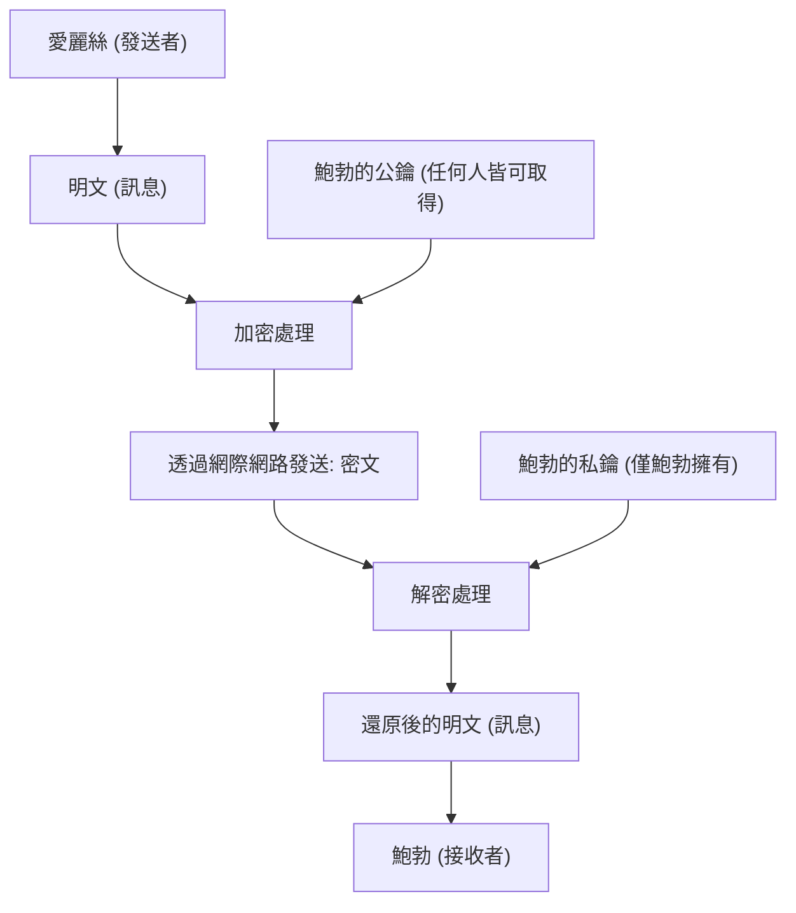
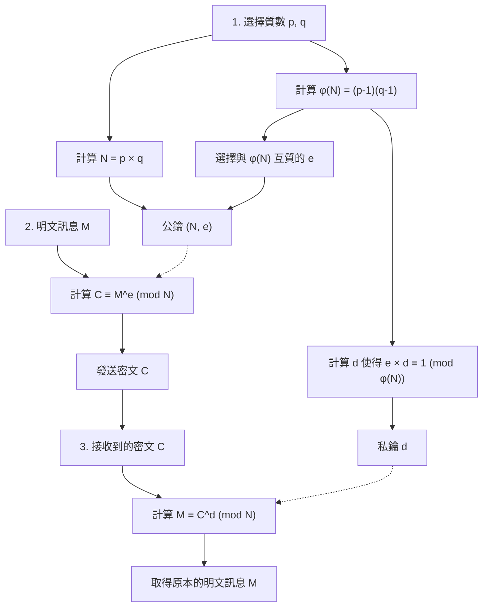
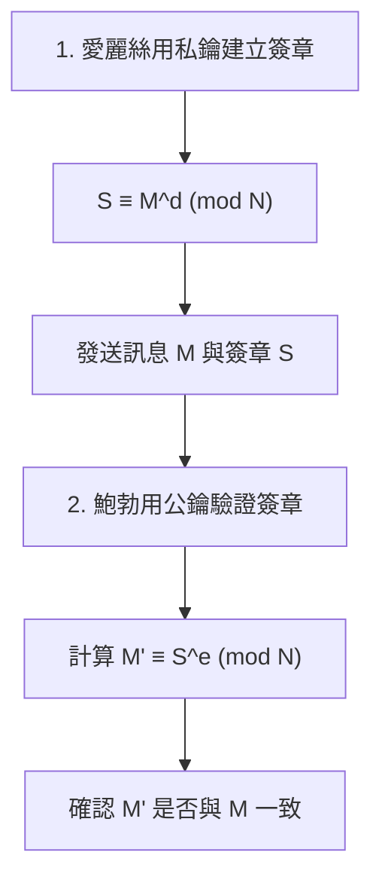

互聯網社會安全的底層支柱技術之一就是「RSA加密」。線上購物的信用卡支付、與朋友在社群網路上的交流、公司機密資訊的收發等，我們每天不經意間使用的通訊，很多都是由RSA加密或其後續技術保護的。

然而，一聽到「加密」，可能會聯想到間諜電影裡那種複雜的密碼機，或是只有少數天才才能理解的超高深數學。雖然現代密碼學確實建立在高等數學的基礎上，但**RSA加密的根本原理，只要具備高中數學（整數性質、質數、同餘等）的知識就足以理解**。

這篇文章將以高中數學知識為起點，逐步深入且徹底地解說RSA加密是基於什麼樣的數學原理運作的，以及為什麼它很難被破解。即使是不太擅長數學的人，我也會透過具體例子來淺顯易懂地解釋。

---

## 1. 對稱密鑰加密與公鑰加密

在進入RSA加密的數學機制之前，我們先整理一下密碼學的基本概念。加密方式大致可分為「對稱密鑰加密」與「公鑰加密」兩種。

### 1.1 對稱密鑰加密方式的極限

自古以來使用的加密方式，大多稱為「對稱密鑰加密方式」。這是一種**在「加密（將訊息轉換成秘密的密文）」與「解密（將密文還原成原本的訊息）」時使用相同密鑰**的方式。

例如，愛麗絲要寄一封秘密信件給鮑勃。愛麗絲用掛鎖（對稱密鑰）將信件鎖在箱子裡。鮑勃要打開那個箱子，就必須擁有與愛麗絲使用的同一把鑰匙。

這種方式有一個很大的問題，就是「密鑰配送問題」。相隔兩地的愛麗絲與鮑勃在首次通訊時，該如何共享鑰匙而不被竊聽呢？如果在郵寄鑰匙的途中被第三者偷走，之後的加密通訊就會全部洩漏。

### 1.2 劃時代的發明「公鑰加密方式」

為了解決這個密鑰配送問題而發明出來的，就是「公鑰加密方式」。RSA加密也是其中一種。

在公鑰加密方式中，會使用**「用來加密的密鑰（公鑰）」與「用來解密的密鑰（私鑰）」這兩把不同的鑰匙**。

1. 接收者鮑勃會建立一對「公鑰」與「私鑰」。
2. 鮑勃將「公鑰」公開給全世界（任何人都可以取得）。
3. 發送者愛麗絲使用鮑勃的「公鑰」來加密訊息並發送。
4. 加密後的訊息，只能用鮑勃獨有的「私鑰」來解密。

如果用掛鎖來比喻，鮑勃製作了許多「打開狀態的掛鎖（公鑰）」並散佈到全世界。愛麗絲將給鮑勃的訊息放入箱子，撿起鮑勃的掛鎖並將它鎖上。掛鎖一旦鎖上，就只有擁有「萬能鑰匙（私鑰）」的鮑勃才能打開。即使途中有人偷走了箱子，因為沒有萬能鑰匙，所以也打不開。



要實現這種劃時代的系統，就需要一種**「單向函數（單向的數學謎題）」**，也就是「用公鑰很容易加密，但沒有私鑰就絕對無法解密」。而成為這個謎題零件的，正是我們熟知的「質數」。

---

## 2. 支撐RSA加密的數學基礎1：質數與質因數分解

RSA加密的安全性，建立在**「巨大數字的質因數分解非常困難」**這個數學事實上。

### 2.1 什麼是質數

質數是指「除了1和自己本身之外，無法被其他數整除，且大於1的自然數」。
例如：$2, 3, 5, 7, 11, 13, 17, 19, 23...$

質數就像是所有整數的「原子」。任何自然數都可以分解成質數相乘的形式。這稱為**質因數分解**。例如 $60 = 2^2 \times 3 \times 5$，如果不考慮順序，就只有一種質因數分解的方法，這被稱為「算術基本定理」。

### 2.2 質因數分解的困難度（單向函數）

這裡的重點在於**「乘法很簡單，但質因數分解很困難」**這種不對稱性。

例如，請試著心算以下兩個質數的乘法：
$11 \times 13 = ?$
這很簡單，答案是 $143$。

那麼，這個數字呢？
請將 $323$ 進行質因數分解。
覺得如何？應該需要花一點時間。（答案是 $17 \times 19$）。

如果數字很小，人類還能勉強算出來；但當數字變大時，即使使用電腦，計算難度也會呈現爆炸性成長。目前主流的RSA加密，會使用將兩個高達2048位元（十進位約600位數）、極其巨大的質數 $p$ 與 $q$ 相乘後的數字 $N = p \times q$。

給定兩個巨大的質數 $p$ 和 $q$ 時，電腦瞬間（毫秒以下）就能計算出 $N$。但反過來，如果只給 $N$，要找出原本的 $p$ 和 $q$，即使讓現在最快的超級電腦運算幾兆年也解不出來。

這種**「計算的不對稱性（去程簡單，回程困難）」**，就是創造出公鑰與私鑰關係的基礎。

---

## 3. 支撐RSA加密的數學基礎2：同餘（模運算）

RSA加密的計算，並不是我們平常用來讓數字無限變大的加法或乘法，而是在除以某個數的「餘數」世界中進行的。這稱為**同餘（模運算）**。

### 3.1 時鐘的數學

模運算常被比喻為「時鐘的數學」。假設現在是10點，5小時後是幾點？ $10 + 5 = 15$ 點，但在一般的12小時制時鐘裡，我們會回答「3點」。這是因為15除以12的餘數是3。

在數學的世界裡，我們會這樣表示：
$$ 15 \equiv 3 \pmod{12} $$
讀作「15與3，在模12之下同餘（除以12的餘數相等）」。

### 3.2 同餘的基本性質

同餘擁有與等式（$=$）非常相似且非常方便的性質。假設模（除數）為 $N$。
當 $a \equiv b \pmod N$ 且 $c \equiv d \pmod N$ 時，以下敘述成立：

1. **加法:** $a + c \equiv b + d \pmod N$
2. **減法:** $a - c \equiv b - d \pmod N$
3. **乘法:** $a \times c \equiv b \times d \pmod N$
4. **冪次方:** $a^k \equiv b^k \pmod N$ （$k$ 為自然數）

其中特別重要的是「冪次方」的性質。這意味著**「餘數的次方，等於次方的餘數」**。
例如，我們想求 $7^{100}$ 除以 $5$ 的餘數。如果真的把 $7$ 乘100次再除以 $5$ 會非常辛苦；但如果使用同餘的性質，因為 $7 \equiv 2 \pmod 5$，所以 $7^{100} \equiv 2^{100} \pmod 5$，這能讓計算變得非常簡單。在密碼學的世界中，由於處理的是非常大數字的次方運算，這個性質是不可或缺的。

---

## 4. 支撐RSA加密的數學基礎3：歐拉函數與歐拉定理

接下來就是RSA加密核心的數學魔法了。作為「費馬小定理」推廣的「歐拉定理」即將登場。

### 4.1 歐拉的總計函數 $\phi(N)$

歐拉總計函數（$\phi$ 函數）是針對某個自然數 $N$，回傳**「從1到 $N$ 的自然數中，與 $N$ 互質（最大公因數為1）的數字個數」**的函數。

我們來看幾個例子：
- $\phi(5)$：在1, 2, 3, 4, 5中，與5互質的有1, 2, 3, 4，共4個。因此 $\phi(5) = 4$。
- $\phi(6)$：在1, 2, 3, 4, 5, 6中，與6互質的有1, 5，共2個。因此 $\phi(6) = 2$。

**【質數時的特殊性質】**
如果 $p$ 是質數，從 1 到 $p-1$ 的所有數字都會與 $p$ 互質。因此：
$$ \phi(p) = p - 1 $$

**【質數相乘時的特殊性質】**
對於兩個不同的質數 $p$ 和 $q$，當 $N = p \times q$ 時，$\phi(N)$ 可以很容易地用以下公式計算：
$$ \phi(N) = \phi(p) \times \phi(q) = (p - 1)(q - 1) $$
這個性質就是RSA加密中的「秘密後門（陷門函數）」。知道 $p$ 和 $q$ 的人（密鑰建立者）可以瞬間計算出 $\phi(N)$，但只知道 $N$ 的第三者，除非對 $N$ 進行質因數分解，否則無法求得 $\phi(N)$。

### 4.2 歐拉定理

萊昂哈德·歐拉（Leonhard Euler）利用這個 $\phi(N)$，證明了以下優美的定理：

**歐拉定理：**
當整數 $a$ 與 $N$ 互質時，以下的同餘式成立：
$$ a^{\phi(N)} \equiv 1 \pmod N $$

這是一個驚人的性質：「將某個數字 $a$ 自乘 $\phi(N)$ 次後除以 $N$，餘數必定會是 $1$」。（當 $N$ 是質數 $p$ 時，公式為 $a^{p-1} \equiv 1 \pmod p$，這被稱為費馬小定理）。

讓我們變形一下這個歐拉定理。兩邊再乘以 $a$：
$$ a^{\phi(N) + 1} \equiv a \pmod N $$

此外，對於任意整數 $k$，$a^{k \cdot \phi(N)}$ 也會是 $1^k = 1$，因此以下公式成立：
$$ a^{k \cdot \phi(N) + 1} \equiv a \pmod N $$

這個公式正是讓RSA加密中**「加密後再解密就能還原」**這種魔法得以成立的根本原理。

---

## 5. RSA加密的演算法：密鑰生成、加密、解密的步驟

基礎知識準備好後，我們終於要來看看RSA加密的具體步驟了。RSA加密主要分為「1. 密鑰生成」、「2. 加密」、「3. 解密」三個階段。



### 5.1 密鑰生成（Key Generation）

作為接收者的鮑勃，要為自己生成「公鑰」與「私鑰」。

1. **選擇質數:** 隨機選擇兩個大質數 $p$ 和 $q$。
2. **計算模 $N$:** 計算 $N = p \times q$。這個 $N$ 會被公開。
3. **計算 $\phi(N)$:** 計算歐拉函數 $\phi(N) = (p - 1)(q - 1)$。這是只有鮑勃知道的秘密數字。
4. **選擇公鑰 $e$:** 選擇一個整數 $e$，滿足 $1 < e < \phi(N)$，且與 $\phi(N)$ 互質。
5. **計算私鑰 $d$:** 找出滿足以下條件的整數 $d$：
   $$ e \times d \equiv 1 \pmod{\phi(N)} $$
   也就是說，「找一個數字 $d$，使得 $e \times d$ 除以 $\phi(N)$ 的餘數為 $1$」。

這樣密鑰就準備完成了。
- **公鑰:** $(N, e)$ 的組合。公開給全世界。
- **私鑰:** $d$。絕對不能告訴任何人。

### 5.2 加密（Encryption）

假設愛麗絲想發送秘密訊息 $M$ 給鮑勃。（將 $M$ 視為文字數值化後的結果，且 $0 \le M < N$）。愛麗絲會使用鮑勃的公鑰 $(N, e)$ 進行以下計算：

$$ C \equiv M^e \pmod N $$

計算「將訊息 $M$ 的 $e$ 次方，除以 $N$ 的餘數 $C$」。這個 $C$ 就是密文。

### 5.3 解密（Decryption）

鮑勃接收到密文 $C$。鮑勃使用私鑰 $d$ 進行以下計算：

$$ M \equiv C^d \pmod N $$

「將密文 $C$ 的 $d$ 次方，除以 $N$ 的餘數」，計算後竟然就能還原出原本的訊息 $M$！

---

## 6. 為什麼解密後能還原？（數學證明）

你可能會覺得疑問：「只是把 $C$ 做了 $d$ 次方，為什麼就能還原成原本的 $M$ 呢？」這時，先前的「歐拉定理」就發揮威力了。

我們把解密的計算式 $C^d \pmod N$ 中，代入加密的式子 $C = M^e$：
$$ C^d \equiv (M^e)^d \equiv M^{ed} \pmod N $$

回想一下密鑰生成的步驟5。鮑勃在製作 $d$ 時，選擇了讓 $e \times d \equiv 1 \pmod{\phi(N)}$ 的數字。這意味著「$ed$ 是 $\phi(N)$ 的倍數加 $1$」。我們可以用整數 $k$ 這樣寫：
$$ ed = k \cdot \phi(N) + 1 $$

將它代入指數部分，並利用指數律來分解：
$$ M^{ed} = M^{k \cdot \phi(N) + 1} = M^{k \cdot \phi(N)} \times M^1 = (M^{\phi(N)})^k \times M $$

這裡假設訊息 $M$ 與 $N$ 互質，根據**歐拉定理**，會有 $M^{\phi(N)} \equiv 1 \pmod N$。
$$ (M^{\phi(N)})^k \times M \equiv 1^k \times M \equiv M \pmod N $$

因此，完美地成立了以下公式：
$$ C^d \equiv M \pmod N $$

愛麗絲不知道 $d$，竊聽者也不知道 $d$，所以能從 $C$ 取出 $M$ 的，只有擁有 $d$ 的鮑勃。

---

## 7. 具體例子：用小質數手動計算體驗RSA

讓我們實際用小數字（質數）來試試看愛麗絲給鮑勃的加密通訊。

**【鮑勃的密鑰生成階段】**
1. 選擇兩個質數 $p=11$, $q=13$。
2. 計算 $N = 11 \times 13 = 143$。
3. 計算 $\phi(N) = (11 - 1) \times (13 - 1) = 10 \times 12 = 120$。
4. 選擇與 $\phi(N)=120$ 互質的公鑰 $e$。這裡我們選擇 $e=7$。
5. 求私鑰 $d$。尋找能讓 $7 \times d \equiv 1 \pmod{120}$ 的 $d$。
   在方程式 $7d = 120k + 1$ 中，當 $k=6$ 時為 $721$，而 $721 \div 7 = 103$。
   因此，$d = 103$。

- 公鑰：$(N=143, e=7)$
- 私鑰：$d=103$

**【愛麗絲的加密階段】**
假設想發送的訊息 $M = 9$。
公式：$C \equiv 9^7 \pmod{143}$
$9^7 = 4,782,969$。把它除以 143，商為 $33447$ 餘數 $48$。
密文 $C = 48$。

**【鮑勃的解密階段】**
鮑勃收到密文 $C = 48$，使用私鑰 $d = 103$ 來解密。
公式：$M \equiv 48^{103} \pmod{143}$
在計算機中執行 `(48 ** 103) % 143`，結果完美地出現「**9**」！順利收到了原本的訊息。

---

## 8. 私鑰 $d$ 的求法：擴展歐幾里得演算法

在手動計算的例子中，我們是靠直覺找 $k$ 才找出 $d=103$，但當數字高達幾百位數時，這種方法就行不通了。在實際的程式中，會使用**「擴展歐幾里得演算法」**。

解開 $7d \equiv 1 \pmod{120}$，就等同於尋找滿足 $7d + 120y = 1$ 的整數 $d, y$。透過逆推歐幾里得演算法，就可以機械化地求出這個值。

1. $120 \div 7 = 17$ 餘 $1$
2. 將其變形後為 $1 = 120 - 17 \times 7$
3. 也就是 $-17 \times 7 \equiv 1 \pmod{120}$

$-17$ 在模 $120$ 的世界裡，與 $120 - 17 = 103$ 意義相同。因此，瞬間就能求得 $d = 103$。無論多麼巨大的數字，用這個方法都能非常快速地計算出來。

---

## 9. RSA加密的另一面：數位簽章

RSA加密最棒的一點在於，如果將公鑰和私鑰的角色反過來，還能當作**「數位簽章」**使用。

加密時是「用公鑰加密 $\Rightarrow$ 用私鑰解密」，
但在數位簽章中，則會採取「用私鑰加密 $\Rightarrow$ 用公鑰解密」的步驟。



愛麗絲使用自己的私鑰 $d$ 來轉換訊息（這就是簽章 $S$），然後發送給鮑勃。鮑勃使用愛麗絲的公鑰 $e$ 來進行驗證計算。如果計算結果與原本的訊息一致，就能同時證明「這是只有愛麗絲的私鑰才能建立的資料」，以及「訊息在途中沒有被篡改」。

---

## 10. 透過程式體驗RSA加密

手動計算很辛苦的次方運算，只要用Python就能非常簡單地實作出來。以下是能體驗RSA加密核心邏輯的Python程式碼。

```python
def gcd(a, b):
    """求最大公因數"""
    while b != 0:
        a, b = b, a % b
    return a

def mod_inverse(e, phi):
    """求私鑰 d（使用 Python 3.8 以後的內建功能）"""
    return pow(e, -1, phi)

# 1. 密鑰生成
p, q = 11, 13
N = p * q
phi = (p - 1) * (q - 1)
e = 7
d = mod_inverse(e, phi)

print(f"公鑰: (N={N}, e={e}), 私鑰: d={d}")

# 2. 加密
message = 9
ciphertext = pow(message, e, N)
print(f"密文: {ciphertext}")

# 3. 解密
decrypted_message = pow(ciphertext, d, N)
print(f"解密後的訊息: {decrypted_message}")
```

Python的 `pow(base, exp, mod)` 函數在內部使用了名為「反覆平方法（快速冪）」的高速演算法，因此即使是幾百位數的數字，也能瞬間完成計算。

---

## 11. 總結與未來的密碼技術

我們以高中數學知識為基礎，解開了RSA加密的原理。

1. **質因數分解的困難度:** $p \times q = N$ 很簡單，但從 $N$ 找出 $p, q$ 非常困難。
2. **同餘與歐拉定理:** 根據 $a^{\phi(N)} \equiv 1 \pmod N$ 這個法則，完成了「用某個數做次方運算就能還原」的魔法陷門函數。
3. **公鑰與私鑰:** 任何人都能加密，但只有合法的接收者才能解密。

現在使用的RSA加密的 $N$ 有600位數以上，即使動用全世界的超級電腦，質因數分解所花的時間也會超過宇宙的年齡。然而，近年來研究不斷進展的「量子電腦」若在未來實用化，透過「秀爾演算法（Shor's algorithm）」，這種質因數分解可能瞬間就被解開。因此，現在全世界都在加速開發連量子電腦也無法破解的「後量子密碼學（抗量子計算機密碼）」。

常被認為「派不上用場」的高等數學，其實在底層保護著我們的日常生活。RSA加密就是能告訴我們數學有多深奧與優美的絕佳教材。希望透過這篇文章，能讓您稍微感受到密碼學與數學的有趣之處。
