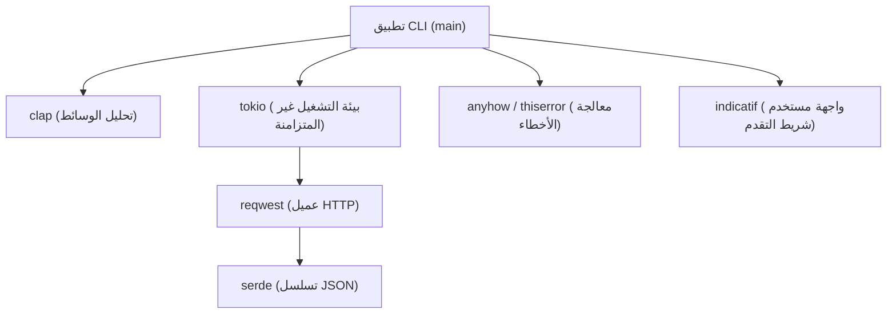
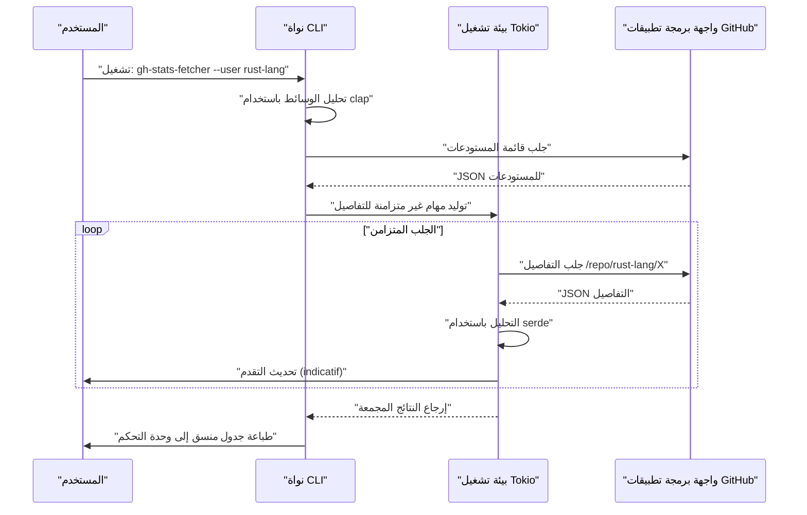
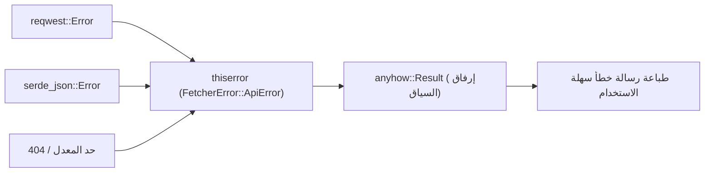

## 1. مقدمة

في تطوير البرمجيات الحديثة، تعتبر أدوات واجهة سطر الأوامر (CLI) ضرورية لتحسين إنتاجية المطورين بشكل كبير. في الماضي، كانت سكربتات الصدفة (Shell scripts) أو Python و Ruby هي السائدة، ولكن في السنوات الأخيرة، رسخت **Rust** مكانتها كمعيار فعلي لتطوير أدوات CLI.

في هذه المقالة، سنشرح بالتفصيل كيفية بناء أدوات CLI عملية "تعمل بسرعة فائقة ويمكن تطويرها بسرعة فائقة" باستخدام Rust، من الأساسيات إلى التطبيقات المتقدمة. لن نكتفي بصنع شيء يعمل فقط، بل سنغطي بشكل شامل معالجة الأخطاء القوية والمناسبة للمستوى التجاري، وطلبات API السريعة باستخدام المعالجة غير المتزامنة، وتنفيذ شريط تقدم (Progress bar) لتحسين تجربة المستخدم (UX).

بحلول نهاية هذه المقالة، ستكون قد أتقنت حزمة تقنيات Rust المتقدمة التالية، وستتمكن من نشر أدوات CLI القوية الخاصة بك للعالم.

---

## 2. لماذا نختار Rust لتطوير أدوات CLI؟

السبب وراء التقييم العالي لـ Rust في تطوير CLI ليس مجرد أنها "شائعة". بل هناك مزايا تقنية ومعمارية واضحة.

### 2.1. ملفات تنفيذية أحادية والترجمة المتقاطعة
عند توزيع أداة مكتوبة بـ Python أو Node.js، يجب أن يكون لدى المستخدم بيئة تشغيل (مفسر Python أو Node.js) مثبتة في بيئته. بالإضافة إلى ذلك، ليس من النادر أن تعاني من تعارضات في إصدارات الحزم التابعة (ما يسمى "جحيم التبعيات").
من ناحية أخرى، تُترجم Rust مسبقًا إلى كود أصلي، مما ينتج **ملفًا تنفيذيًا واحدًا** يتضمن جميع التبعيات. يمكن للمستخدمين استخدام الأداة بمجرد تنزيل الملف الثنائي ووضعه، مما يقلل بشكل كبير من عقبات التثبيت. بالإضافة إلى ذلك، الترجمة المتقاطعة سهلة، ومن الممكن بناء ملفات ثنائية لأنظمة Windows، وmacOS، وLinux في بيئة CI واحدة.

### 2.2. سرعة تنفيذ هائلة واستهلاك منخفض للذاكرة
لا تمتلك Rust جامع قمامة (GC)، ومن خلال التجريد بدون تكلفة تقدم أداءً يعادل C/C++. في أدوات CLI، يرتبط وقت بدء التشغيل القصير بشكل مباشر بتجربة المستخدم. على عكس لغات JVM، لا يوجد وقت إحماء عند بدء التشغيل، وبدء المعالجة في اللحظة التي تضرب فيها الأمر هو ميزة كبيرة.

### 2.3. الأمان بفضل نظام الأنواع القوي ونموذج الملكية
بفضل نموذج الملكية - وهو أقوى سلاح في Rust - ونظام الأنواع القوي، يتم استبعاد الأخطاء مثل تسرب الذاكرة وتعارض البيانات في وقت الترجمة. تجربة "إذا نجحت الترجمة، فمن شبه المؤكد أنها ستعمل كما هو مقصود" تمنح المطورين شعورًا هائلاً بالأمان عند تطوير تطبيقات تتعامل مباشرة مع موارد النظام مثل أدوات CLI.

---

## 3. أقوى الحزم (Crates) المعتمدة في هذا البرنامج التعليمي

يوجد في نظام Rust البيئي العديد من الحزم (المكتبات) الممتازة التي تدعم بقوة تطوير CLI. في هذا البرنامج التعليمي، سنستخدم الحزم التالية، والتي يمكن أن نطلق عليها "الحزمة الذهبية" في تطوير Rust CLI الحديث.

1. **`clap`**: أقوى الحزم وأكثرها شيوعًا في تحليل وسائط سطر الأوامر. بدءًا من الإصدار 4 وما بعده، أصبح التعريف التصريحي باستخدام ماكرو Derive أكثر صقلاً، ويدعم التوليد التلقائي لرسائل المساعدة ونصوص الإكمال التلقائي.
2. **`tokio`**: المعيار الفعلي لبيئة التشغيل غير المتزامنة في Rust. يعالج إدخال/إخراج غير متزامن متعدد الخيوط بكفاءة عالية جدًا.
3. **`reqwest`**: عميل HTTP عالي الأداء يعمل على `tokio`. يمتلك واجهة برمجة تطبيقات سهلة الاستخدام ويجعل من السهل تنفيذ طلبات API غير متزامنة.
4. **`serde` & `serde_json`**: إطار عمل لإجراء عملية التسلسل وإلغاء التسلسل للبيانات. لا غنى عنه لتعيين استجابات JSON الخاصة بـ API إلى هياكل بيانات Rust الآمنة من حيث النوع.
5. **`indicatif`**: يوفر شريط تقدم غنيًا وقابلًا للتخصيص. يعرض التقدم البصري للمعالجة غير المتزامنة، مما يحسن تجربة المستخدم الخاصة بـ CLI بشكل كبير.
6. **`anyhow` & `thiserror`**: مزيج قوي لمعالجة الأخطاء. من أفضل الممارسات استخدام `thiserror` لتعريف أخطاء المجال داخل المكتبة، و `anyhow` لتجميع الأخطاء في الطبقة العليا من التطبيق.

يوضح المخطط التالي بنية كيفية تفاعل هذه الحزم داخل التطبيق:



---

## 4. الخلفية الرياضية للمعالجة غير المتزامنة والأداء

ستقوم الأداة التي نطورها في هذا البرنامج التعليمي بإرسال طلبات بشكل متزامن إلى عدة نقاط نهاية في واجهة برمجة التطبيقات (API). دعونا نراجع الخلفية الرياضية لسبب استخدام بيئة تشغيل غير متزامنة مثل `tokio` يجعلها أسرع بشكل كبير.

### 4.1. قانون أمدال (Amdahl's Law)
يُصاغ معدل تحسين الأداء العام عن طريق التوازي أو اللاتزامن لجزء من النظام بواسطة قانون أمدال كما يلي:

$$
S(N) = \frac{1}{(1 - P) + \frac{P}{N}}
$$

حيث:
- $S(N)$ هو الحد الأقصى النظري لنسبة زيادة السرعة.
- $P$ هي نسبة الجزء الذي يمكن موازنته (جعله غير متزامن) في البرنامج.
- $N$ هي درجة التوازي للمهام التي يمكن تنفيذها في نفس الوقت.

في حالة الأدوات التي تجلب البيانات من API، فإن معظم وقت التنفيذ يتمثل في انتظار استجابة الشبكة (I/O Bound). لذلك، ستكون قيمة $P$ كبيرة جدًا (على سبيل المثال، $0.95$ أو أكثر). في البرنامج المتزامن، $N = 1$، ولكن باستخدام إدخال/إخراج غير متزامن، يمكن رفع $N$ إلى آلاف المستويات، ومن الناحية النظرية، يزداد $S(N)$ بشكل هائل.

### 4.2. قانون ليتل (Little's Law) والإنتاجية
عند معالجة طلبات الشبكة، تنطبق العلاقة التالية على متوسط عدد الطلبات المتزامنة في النظام $L$، ومتوسط الإنتاجية $\lambda$ (عدد العمليات المكتملة لكل وحدة زمنية)، ومتوسط وقت الاستجابة $W$:

$$
L = \lambda W \implies \lambda = \frac{L}{W}
$$

بمعنى آخر، في بيئة لا مفر فيها من تأخير الشبكة $W$، الطريقة الوحيدة لتحسين إنتاجية النظام $\lambda$ هي زيادة عدد الطلبات التي تتم معالجتها في نفس الوقت $L$. نظرًا لأن مهام Rust غير المتزامنة، على عكس خيوط نظام التشغيل، لها حمل ذاكرة صغير جدًا، فمن السهل توسيع $L$.

---

## 5. تصميم الأداة التي سيتم تطويرها: جالب مستودعات GitHub المجمع

كمثال عملي هذه المرة، سنقوم بتطوير أداة **`gh-stats-fetcher`** التي تجلب قائمة المستودعات العامة لمستخدم GitHub أو مؤسسة محددة، وتجلب إحصائيات كل منها (عدد النجوم، عدد التفرعات، اللغة، إلخ) بشكل متزامن، وتقوم بتنسيقها وعرضها في الطرفية.

### تسلسل تنفيذ الأداة



---

## 6. تهيئة المشروع وإعداد التبعيات

أولاً، سنستخدم Cargo لإنشاء مشروع جديد.

```bash
cargo new gh-stats-fetcher
cd gh-stats-fetcher
```

بعد ذلك، أضف التبعيات الضرورية إلى `Cargo.toml`.

```toml
[package]
name = "gh-stats-fetcher"
version = "0.1.0"
edition = "2021"
authors = ["Your Name <your.email@example.com>"]
description = "A blazing fast CLI tool to fetch GitHub repository stats."

[dependencies]
clap = { version = "4.4", features = ["derive"] }
tokio = { version = "1.34", features = ["full"] }
reqwest = { version = "0.11", features = ["json", "rustls-tls"], default-features = false }
serde = { version = "1.0", features = ["derive"] }
serde_json = "1.0"
indicatif = "0.17"
anyhow = "1.0"
thiserror = "1.0"
```

> **نقطة مهمة**: يستخدم `reqwest` خيار `rustls-tls` بدلاً من الخلفية الافتراضية لـ TLS. هذا يلغي الحاجة إلى المكتبات التي تعتمد على النظام مثل OpenSSL، ويسهل بناء ملف تنفيذي أحادي مرتبط بشكل ثابت بالكامل.

---

## 7. مرحلة التنفيذ 1: بناء أساس معالجة الأخطاء

لصنع أداة CLI قوية، يعد تصميم معالجة الأخطاء أمرًا حيويًا. هنا، سنمارس التمييز في استخدام `thiserror` و `anyhow`.

سنقوم بتعريف الأخطاء الخاصة بالمجال في `src/error.rs`.

```rust
// src/error.rs
use thiserror::Error;

#[derive(Error, Debug)]
pub enum FetcherError {
    #[error("API Request failed: {0}")]
    ApiError(#[from] reqwest::Error),
    
    #[error("Failed to parse JSON: {0}")]
    ParseError(#[from] serde_json::Error),
    
    #[error("GitHub API Rate limit exceeded. Try again later.")]
    RateLimitExceeded,
    
    #[error("Target user or organization '{0}' not found.")]
    NotFound(String),
}
```



---

## 8. مرحلة التنفيذ 2: تحليل الوسائط بواسطة clap

بعد ذلك، سنقوم بتعريف وسائط CLI. قم بإنشاء `src/cli.rs` واستخدم ماكرو Derive الخاص بـ `clap`.

```rust
// src/cli.rs
use clap::{Parser, Subcommand};

#[derive(Parser, Debug)]
#[command(name = "gh-stats-fetcher")]
#[command(author, version, about, long_about = None)]
pub struct Cli {
    #[command(subcommand)]
    pub command: Commands,
}

#[derive(Subcommand, Debug)]
pub enum Commands {
    /// Fetch stats for a specific user
    Fetch {
        /// The GitHub username or organization name
        #[arg(short, long)]
        user: String,
        
        /// Number of concurrent requests
        #[arg(short, long, default_value_t = 10)]
        concurrency: usize,
    },
}
```

وبهذا، يتم إنشاء رسالة مساعدة جميلة تلقائيًا كما يلي.

```text
$ gh-stats-fetcher --help
A blazing fast CLI tool to fetch GitHub repository stats.

Usage: gh-stats-fetcher <COMMAND>

Commands:
  fetch  Fetch stats for a specific user
  help   Print this message or the help of the given subcommand(s)
```

---

## 9. مرحلة التنفيذ 3: عميل واجهة برمجة التطبيقات وتعيين البيانات

سنقوم بتعيين بيانات JSON المرجعة من واجهة برمجة تطبيقات GitHub إلى هياكل Rust. سنقوم بتنفيذ `src/models.rs` و `src/api.rs`.

```rust
// src/models.rs
use serde::{Deserialize, Serialize};

#[derive(Debug, Deserialize, Serialize)]
pub struct Repository {
    pub name: String,
    pub html_url: String,
    pub stargazers_count: u32,
    pub forks_count: u32,
    pub language: Option<String>,
}
```

```rust
// src/api.rs
use crate::models::Repository;
use crate::error::FetcherError;
use reqwest::Client;

pub struct GitHubClient {
    client: Client,
}

impl GitHubClient {
    pub fn new() -> Result<Self, FetcherError> {
        let client = Client::builder()
            .user_agent("gh-stats-fetcher/0.1.0")
            .build()?;
        Ok(Self { client })
    }

    pub async fn fetch_repos(&self, user: &str) -> Result<Vec<Repository>, FetcherError> {
        let url = format!("https://api.github.com/users/{}/repos?per_page=100", user);
        let res = self.client.get(&url).send().await?;

        if res.status() == 404 {
            return Err(FetcherError::NotFound(user.to_string()));
        } else if res.status() == 403 {
            return Err(FetcherError::RateLimitExceeded);
        }

        let repos = res.json::<Vec<Repository>>().await?;
        Ok(repos)
    }
}
```

---

## 10. مرحلة التنفيذ 4: المعالجة المتزامنة وشريط التقدم باستخدام tokio و indicatif

هذا هو أبرز جزء في هذه الأداة. سنقوم بتشغيل المعالجة المتزامنة على قائمة المستودعات التي تم الحصول عليها وعرض شريط تقدم جميل.

```rust
// src/main.rs
mod cli;
mod error;
mod models;
mod api;

use clap::Parser;
use cli::{Cli, Commands};
use api::GitHubClient;
use anyhow::{Context, Result};
use indicatif::{ProgressBar, ProgressStyle};
use std::sync::Arc;
use tokio::sync::Semaphore;

#[tokio::main]
async fn main() -> Result<()> {
    let cli = Cli::parse();

    match cli.command {
        Commands::Fetch { user, concurrency } => {
            println!("Fetching repositories for {}...", user);
            
            let client = Arc::new(GitHubClient::new().context("Failed to initialize API client")?);
            let repos = client.fetch_repos(&user).await.context("Failed to fetch repository list")?;
            
            println!("Found {} repositories. Analyzing...", repos.len());

            let pb = ProgressBar::new(repos.len() as u64);
            pb.set_style(ProgressStyle::default_bar()
                .template("{spinner:.green} [{elapsed_precise}] [{wide_bar:.cyan/blue}] {pos}/{len} ({eta})")
                .unwrap()
                .progress_chars("#>-"));

            // إشارة (Semaphore) للحد من التزامن
            let semaphore = Arc::new(Semaphore::new(concurrency));
            let mut tasks = vec![];

            for repo in repos {
                let permit = semaphore.clone().acquire_owned().await.unwrap();
                let pb_clone = pb.clone();
                // في التطبيق الفعلي، يمكنك هنا إجراء معالجة ثقيلة مثل طلب API مفصل
                // هنا كعرض توضيحي نقوم بإدخال نوم غير متزامن
                tasks.push(tokio::spawn(async move {
                    tokio::time::sleep(std::time::Duration::from_millis(100)).await;
                    pb_clone.inc(1);
                    drop(permit);
                    repo
                }));
            }

            let mut results = vec![];
            for task in tasks {
                results.push(task.await.context("Task panicked")?);
            }

            pb.finish_with_message("Done!");

            // الترتيب حسب عدد النجوم وعرض أعلى 5
            results.sort_by(|a, b| b.stargazers_count.cmp(&a.stargazers_count));
            println!("\nTop 5 Repositories:");
            for (i, repo) in results.iter().take(5).enumerate() {
                let lang = repo.language.as_deref().unwrap_or("Unknown");
                println!("{}. {} (⭐ {} | 🍴 {} | 💻 {})", 
                    i + 1, repo.name, repo.stargazers_count, repo.forks_count, lang);
            }
        }
    }

    Ok(())
}
```

في هذا الكود، يتم استخدام `tokio::spawn` لإرسال المهام إلى العمال في الخلفية، وفي نفس الوقت يتم استخدام `tokio::sync::Semaphore` للحد من عدد طلبات API المنفذة في نفس الوقت (التزامن الافتراضي هو 10). من خلال ذلك، نحن نقلل من مخاطر تجاوز حد معدل API بينما نحقق سرعة تفوق بكثير المعالجة المتزامنة.

---

## 11. مواضيع متقدمة: الاختبار والتحسين

### 11.1. اختبار التكامل لأدوات CLI
لاختبار سلوك أداة CLI نفسها، تعتبر حزمة `assert_cmd` مفيدة للغاية. قم بإنشاء `tests/cli_test.rs` وقم باستدعاء الملف التنفيذي الفعلي والتحقق من الإخراج القياسي.

```rust
// tests/cli_test.rs
use assert_cmd::Command;
use predicates::prelude::*;

#[test]
fn test_help_message() {
    let mut cmd = Command::cargo_bin("gh-stats-fetcher").unwrap();
    cmd.arg("--help")
        .assert()
        .success()
        .stdout(predicate::str::contains("Usage: gh-stats-fetcher"));
}
```

### 11.2. التحسين الأقصى لبناء الإصدار (Release Build)
على الرغم من أن بناء الإصدار الافتراضي سريع بما يكفي، لتقليل حجم الملف التنفيذي وتحقيق أقصى سرعة تنفيذ، قم بتكوين `[profile.release]` في `Cargo.toml`.

```toml
[profile.release]
opt-level = 3       # أعلى مستوى للتحسين
lto = true          # تمكين تحسين وقت الربط (Link Time Optimization)
codegen-units = 1   # وحدة الترجمة هي 1 لزيادة التحسين إلى أقصى حد (يطيل وقت البناء)
panic = "abort"     # إحباط فوري دون تفكيك تتبع المكدس عند الذعر (تقليل الحجم)
strip = true        # حذف معلومات الرموز لتقليل حجم الثنائي بشكل كبير
```

بتطبيق هذه الإعدادات، سيكون حجم الملف التنفيذي المُنشأ أصغر بعدة ميغابايت، مما يجعل توزيعه على المستخدمين أسهل.

---

## 12. التكامل المستمر/النشر المستمر (CI/CD) والتوزيع (Publishing)

هذه هي الخطوات لتوزيع أداتك المبنية للعالم.

### النشر على crates.io
باستخدام Cargo، مدير حزم Rust، يمكنك نشرها في السجل الرسمي ببضعة أوامر فقط.

```bash
cargo login <YOUR_TOKEN>
cargo publish
```
بعد النشر، سيتمكن المستخدمون حول العالم من تثبيت أداتك باستخدام أمر واحد `cargo install gh-stats-fetcher`.

### الإصدار التلقائي عبر GitHub Actions
قم بإنشاء مسار CI/CD الذي يقوم بتحميل الملفات التنفيذية المترجمة تلقائيًا إلى إصدارات GitHub. اكتب إعدادات مثل الإعدادات التالية في `.github/workflows/release.yml`. سيؤدي هذا إلى بناء ملفات تنفيذية لأنظمة Linux و macOS و Windows تلقائيًا بمجرد دفع علامة (Tag)، وإرفاقها كأصول إصدار (نحن نحذف وصف YAML التفصيلي هنا لضيق المساحة، ولكن استخدام إجراء مثل `taiki-e/upload-rust-binary-action` هو أفضل الممارسات الحالية).

---

## 13. الخلاصة

في هذه المقالة، شرحنا بالتفصيل سلسلة تدفق تطوير أدوات CLI باستخدام Rust.

1. **نهج التصميم**: أكدنا على أمان وسرعة Rust وميزة الملفات التنفيذية الأحادية.
2. **اختيار الحزم (Crates)**: اكتسبنا أسلحة قوية مثل `clap` و `tokio` و `serde` و `indicatif` و `thiserror` و `anyhow`.
3. **الميزة الرياضية للمعالجة المتزامنة**: بناءً على قانون أمدال وقانون ليتل، فهمنا نظريًا قوة المعالجة غير المتزامنة.
4. **التنفيذ والتحسين**: جمعنا المعرفة العملية، بدءًا من معالجة الأخطاء القوية ووصولاً إلى التحسين الأقصى للملفات التنفيذية.

تطوير CLI بواسطة Rust هو تجربة رائعة حيث يمكنك ضمان جودة البرنامج منذ مرحلة التصميم من خلال التفاعل مع المترجم. بناءً على الكود الأساسي الذي تم إنشاؤه هذه المرة، يرجى تطوير أداة CLI الأصلية الخاصة بك ونشرها للعالم! برمجة Rust سعيدة!
