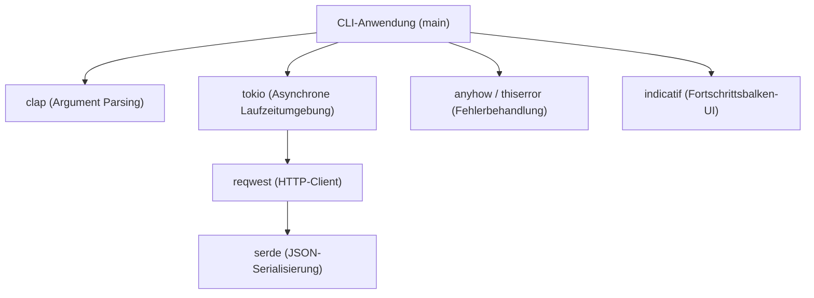
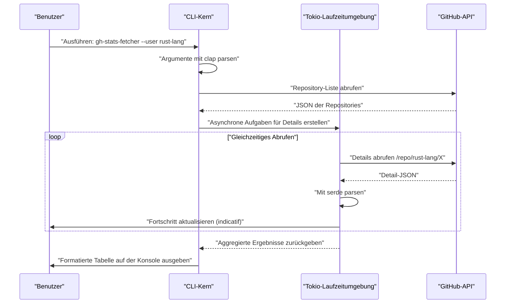
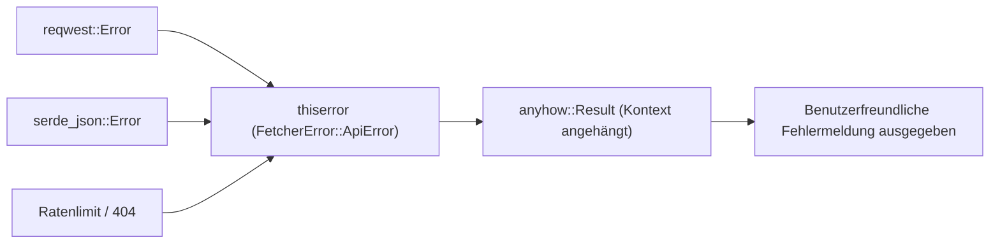

## 1. Einführung

In der modernen Softwareentwicklung sind CLI-Tools (Command Line Interface) unverzichtbar geworden, da sie die Produktivität der Entwickler drastisch steigern. Früher waren Shell-Skripte, Python oder Ruby die Norm, aber in den letzten Jahren hat sich **Rust** fest als De-facto-Standard für die Entwicklung von CLI-Tools etabliert.

In diesem Artikel werden wir ausführlich erklären, wie man von den Grundlagen bis zu fortgeschrittenen Techniken ein praktisches CLI-Tool mit Rust erstellt, das "blitzschnell läuft und blitzschnell entwickelt wird". Wir werden nicht nur etwas bauen, das funktioniert, sondern alles umfassend abdecken: robuste Fehlerbehandlung auf kommerziellem Niveau, schnelle API-Anfragen mithilfe asynchroner Verarbeitung und die Implementierung eines Fortschrittsbalkens zur Verbesserung der Benutzererfahrung (UX).

Wenn Sie diesen Artikel bis zum Ende lesen, werden Sie den folgenden fortgeschrittenen Rust-Technologie-Stack beherrschen und in der Lage sein, Ihre eigenen leistungsstarken CLI-Tools für die Welt zu veröffentlichen.

---

## 2. Warum Rust für die Entwicklung von CLI-Tools wählen?

Der Grund, warum Rust in der CLI-Entwicklung so hoch geschätzt wird, liegt nicht nur daran, dass es "im Trend" ist. Es gibt klare technische und architektonische Vorteile.

### 2.1. Einzelnes Binary und Cross-Kompilierung
Wenn Sie Tools verteilen, die in Python oder Node.js geschrieben sind, muss in der Umgebung des Benutzers eine Laufzeitumgebung (Python-Interpreter oder Node.js) installiert sein. Darüber hinaus hat man oft mit Versionskonflikten bei abhängigen Paketen (der sogenannten "Abhängigkeits-Hölle") zu kämpfen.
Andererseits wird Rust im Voraus in nativen Code kompiliert, wodurch ein **einzelnes ausführbares Binary** generiert wird, das alle Abhängigkeiten enthält. Benutzer können das Tool nutzen, indem sie einfach das Binary herunterladen und platzieren, was die Einstiegshürde extrem niedrig hält. Außerdem ist Cross-Kompilierung einfach, sodass Binaries für Windows, macOS und Linux in einer einzigen CI-Umgebung erstellt werden können.

### 2.2. Überwältigende Ausführungsgeschwindigkeit und Speichereffizienz
Rust hat keinen Garbage Collector (GC) und bietet durch Zero-Cost-Abstraktionen die gleiche Leistung wie C/C++. Bei CLI-Tools steht eine kurze Startzeit in direktem Zusammenhang mit der UX. Es gibt keine Aufwärmzeit beim Start wie bei JVM-Sprachen, und die Verarbeitung beginnt in dem Moment, in dem der Befehl eingegeben wird, was ein großer Vorteil ist.

### 2.3. Sicherheit durch starkes Typsystem und Ownership-Modell
Durch Rusts größte Waffe, das Ownership-Modell und das starke Typsystem, werden Bugs wie Speicherlecks und Datenkonflikte zur Kompilierzeit eliminiert. Die Erfahrung "Wenn es kompiliert, funktioniert es fast sicher wie beabsichtigt" gibt Entwicklern ein enormes Gefühl der Sicherheit bei der Entwicklung von Anwendungen wie CLI-Tools, die direkt auf Systemressourcen zugreifen.

---

## 3. Die stärksten Crates, die in diesem Tutorial verwendet werden

Das Rust-Ökosystem verfügt über viele hervorragende Crates (Bibliotheken), die die CLI-Entwicklung stark unterstützen. In diesem Tutorial werden wir die folgenden Crates verwenden, die man als den "Golden Stack" der modernen Rust-CLI-Entwicklung bezeichnen kann:

1. **`clap`**: Das leistungsstärkste und beliebteste Crate zum Parsen von Kommandozeilenargumenten. Seit Version 4 ist die deklarative Definition mit Derive-Makros noch raffinierter geworden und unterstützt auch die automatische Generierung von Hilfemeldungen sowie Skripten zur Eingabevervollständigung.
2. **`tokio`**: Der De-facto-Standard für die asynchrone Laufzeitumgebung in Rust. Es verarbeitet asynchrone I/O in mehreren Threads äußerst effizient.
3. **`reqwest`**: Ein hochentwickelter HTTP-Client, der auf `tokio` läuft. Er verfügt über eine benutzerfreundliche API und macht die Implementierung asynchroner API-Anfragen einfach.
4. **`serde` & `serde_json`**: Frameworks für die Serialisierung und Deserialisierung von Daten. Unverzichtbar für das Mapping von JSON-Antworten aus APIs in typsichere Rust-Strukturen.
5. **`indicatif`**: Bietet umfangreiche und anpassbare Fortschrittsbalken. Es zeigt den Fortschritt asynchroner Prozesse visuell an und verbessert die UX des CLI drastisch.
6. **`anyhow` & `thiserror`**: Eine leistungsstarke Kombination für die Fehlerbehandlung. Es ist Best Practice, `thiserror` für die Definition von Domänenfehlern innerhalb von Bibliotheken und `anyhow` für die Fehleraggregation in den obersten Schichten der Anwendung zu verwenden.

Das folgende Diagramm zeigt die Architektur, wie diese Crates innerhalb der Anwendung zusammenarbeiten.



---

## 4. Mathematischer Hintergrund asynchroner Verarbeitung und Leistung

Das Tool, das wir in diesem Tutorial entwickeln, sendet parallele Anfragen an mehrere API-Endpunkte. Lassen Sie uns den mathematischen Hintergrund überprüfen, warum die Verwendung einer asynchronen Laufzeitumgebung wie `tokio` es dramatisch schneller macht.

### 4.1. Amdahlsches Gesetz (Amdahl's Law)
Die Rate der Gesamtleistungsverbesserung durch Parallelisierung und Asynchronisierung eines Teils des Systems wird durch das Amdahlsche Gesetz wie folgt formuliert:

$$
S(N) = \frac{1}{(1 - P) + \frac{P}{N}}
$$

Hierbei ist:
- $S(N)$ die theoretisch maximale Beschleunigungsrate
- $P$ der Anteil des Programms, der parallelisiert (asynchronisiert) werden kann
- $N$ der Grad der Parallelität der Aufgaben, die gleichzeitig ausgeführt werden können

Bei Tools, die Daten von APIs abrufen, besteht der Großteil der Ausführungszeit aus dem Warten auf Netzwerkantworten (I/O-gebunden). Daher ist der Wert von $P$ sehr groß (zum Beispiel $0.95$ oder höher). In einem synchronen Programm ist $N = 1$, aber durch die Verwendung von asynchronem I/O kann $N$ auf Tausende skaliert werden, was $S(N)$ theoretisch exponentiell erhöht.

### 4.2. Gesetz von Little (Little's Law) und Durchsatz
Bei der Verarbeitung von Netzwerkanfragen besteht folgende Beziehung zwischen der durchschnittlichen Anzahl gleichzeitiger Anfragen $L$ im System, dem durchschnittlichen Durchsatz $\lambda$ (Anzahl der abgeschlossenen Verarbeitungen pro Zeiteinheit) und der durchschnittlichen Antwortzeit $W$:

$$
L = \lambda W \implies \lambda = \frac{L}{W}
$$

Das heißt, um in einer Umgebung, in der Netzwerkverzögerungen $W$ unvermeidbar sind, den Systemdurchsatz $\lambda$ zu verbessern, kann man nur die Anzahl der gleichzeitig verarbeiteten Anfragen $L$ erhöhen. Im Gegensatz zu nativen OS-Threads haben asynchrone Aufgaben in Rust einen extrem geringen Speicher-Overhead, wodurch sich $L$ leicht skalieren lässt.

---

## 5. Design des zu entwickelnden Tools: GitHub Repository Batch Fetcher

Als praktisches Beispiel entwickeln wir dieses Mal ein Tool namens **`gh-stats-fetcher`**. Es ruft eine Liste öffentlicher Repositories eines angegebenen GitHub-Benutzers oder einer Organisation ab, ruft gleichzeitig statistische Informationen wie die Anzahl der Sterne, Forks und die verwendete Sprache für jedes Repository ab und zeigt sie formatiert im Terminal an.

### Ausführungssequenz des Tools



---

## 6. Projektinitialisierung und Konfiguration der Abhängigkeiten

Erstellen Sie zunächst ein neues Projekt mit Cargo.

```bash
cargo new gh-stats-fetcher
cd gh-stats-fetcher
```

Fügen Sie als Nächstes die erforderlichen Abhängigkeiten in die `Cargo.toml` ein.

```toml
[package]
name = "gh-stats-fetcher"
version = "0.1.0"
edition = "2021"
authors = ["Your Name <your.email@example.com>"]
description = "Ein blitzschnelles CLI-Tool zum Abrufen von GitHub-Repository-Statistiken."

[dependencies]
clap = { version = "4.4", features = ["derive"] }
tokio = { version = "1.34", features = ["full"] }
reqwest = { version = "0.11", features = ["json", "rustls-tls"], default-features = false }
serde = { version = "1.0", features = ["derive"] }
serde_json = "1.0"
indicatif = "0.17"
anyhow = "1.0"
thiserror = "1.0"
```

> **Hinweis**: Bei `reqwest` wird `rustls-tls` anstelle des standardmäßigen TLS-Backends verwendet. Dadurch werden systemabhängige Bibliotheken wie OpenSSL überflüssig, was den Aufbau eines vollständig statisch verlinkten Einzelbinaries erleichtert.

---

## 7. Implementierungsphase 1: Aufbau der Grundlage für die Fehlerbehandlung

Um ein robustes CLI-Tool zu erstellen, ist das Design der Fehlerbehandlung entscheidend. Hier werden wir den praktischen Einsatz von `thiserror` und `anyhow` demonstrieren.

Domänenspezifische Fehler werden in `src/error.rs` definiert.

```rust
// src/error.rs
use thiserror::Error;

#[derive(Error, Debug)]
pub enum FetcherError {
    #[error("API Request failed: {0}")]
    ApiError(#[from] reqwest::Error),
    
    #[error("Failed to parse JSON: {0}")]
    ParseError(#[from] serde_json::Error),
    
    #[error("GitHub API Rate limit exceeded. Try again later.")]
    RateLimitExceeded,
    
    #[error("Target user or organization '{0}' not found.")]
    NotFound(String),
}
```



---

## 8. Implementierungsphase 2: Argument-Parsing mit clap

Als Nächstes definieren wir die CLI-Argumente. Wir erstellen `src/cli.rs` und verwenden das Derive-Makro von `clap`.

```rust
// src/cli.rs
use clap::{Parser, Subcommand};

#[derive(Parser, Debug)]
#[command(name = "gh-stats-fetcher")]
#[command(author, version, about, long_about = None)]
pub struct Cli {
    #[command(subcommand)]
    pub command: Commands,
}

#[derive(Subcommand, Debug)]
pub enum Commands {
    /// Fetch stats for a specific user
    Fetch {
        /// The GitHub username or organization name
        #[arg(short, long)]
        user: String,
        
        /// Number of concurrent requests
        #[arg(short, long, default_value_t = 10)]
        concurrency: usize,
    },
}
```

Dadurch wird automatisch eine schöne Hilfemeldung wie folgt generiert:

```text
$ gh-stats-fetcher --help
A blazing fast CLI tool to fetch GitHub repository stats.

Usage: gh-stats-fetcher <COMMAND>

Commands:
  fetch  Fetch stats for a specific user
  help   Print this message or the help of the given subcommand(s)
```

---

## 9. Implementierungsphase 3: API-Client und Daten-Mapping

Wir mappen die von der GitHub-API zurückgegebenen JSON-Daten in Rust-Strukturen. Wir implementieren `src/models.rs` und `src/api.rs`.

```rust
// src/models.rs
use serde::{Deserialize, Serialize};

#[derive(Debug, Deserialize, Serialize)]
pub struct Repository {
    pub name: String,
    pub html_url: String,
    pub stargazers_count: u32,
    pub forks_count: u32,
    pub language: Option<String>,
}
```

```rust
// src/api.rs
use crate::models::Repository;
use crate::error::FetcherError;
use reqwest::Client;

pub struct GitHubClient {
    client: Client,
}

impl GitHubClient {
    pub fn new() -> Result<Self, FetcherError> {
        let client = Client::builder()
            .user_agent("gh-stats-fetcher/0.1.0")
            .build()?;
        Ok(Self { client })
    }

    pub async fn fetch_repos(&self, user: &str) -> Result<Vec<Repository>, FetcherError> {
        let url = format!("https://api.github.com/users/{}/repos?per_page=100", user);
        let res = self.client.get(&url).send().await?;

        if res.status() == 404 {
            return Err(FetcherError::NotFound(user.to_string()));
        } else if res.status() == 403 {
            return Err(FetcherError::RateLimitExceeded);
        }

        let repos = res.json::<Vec<Repository>>().await?;
        Ok(repos)
    }
}
```

---

## 10. Implementierungsphase 4: Parallele Verarbeitung und Fortschrittsbalken mit tokio und indicatif

Dies ist das Highlight dieses Tools. Wir führen eine parallele Verarbeitung für die abgerufene Liste von Repositories durch und zeigen einen schönen Fortschrittsbalken an.

```rust
// src/main.rs
mod cli;
mod error;
mod models;
mod api;

use clap::Parser;
use cli::{Cli, Commands};
use api::GitHubClient;
use anyhow::{Context, Result};
use indicatif::{ProgressBar, ProgressStyle};
use std::sync::Arc;
use tokio::sync::Semaphore;

#[tokio::main]
async fn main() -> Result<()> {
    let cli = Cli::parse();

    match cli.command {
        Commands::Fetch { user, concurrency } => {
            println!("Fetching repositories for {}...", user);
            
            let client = Arc::new(GitHubClient::new().context("Failed to initialize API client")?);
            let repos = client.fetch_repos(&user).await.context("Failed to fetch repository list")?;
            
            println!("Found {} repositories. Analyzing...", repos.len());

            let pb = ProgressBar::new(repos.len() as u64);
            pb.set_style(ProgressStyle::default_bar()
                .template("{spinner:.green} [{elapsed_precise}] [{wide_bar:.cyan/blue}] {pos}/{len} ({eta})")
                .unwrap()
                .progress_chars("#>-"));

            // Semaphor zur Begrenzung der Nebenläufigkeit
            let semaphore = Arc::new(Semaphore::new(concurrency));
            let mut tasks = vec![];

            for repo in repos {
                let permit = semaphore.clone().acquire_owned().await.unwrap();
                let pb_clone = pb.clone();
                // In einer echten App würden hier schwere Aufgaben wie detaillierte API-Aufrufe stattfinden
                // Für diese Demo fügen wir einen asynchronen Sleep ein
                tasks.push(tokio::spawn(async move {
                    tokio::time::sleep(std::time::Duration::from_millis(100)).await;
                    pb_clone.inc(1);
                    drop(permit);
                    repo
                }));
            }

            let mut results = vec![];
            for task in tasks {
                results.push(task.await.context("Task panicked")?);
            }

            pb.finish_with_message("Done!");

            // Nach Sternen sortieren und die Top 5 anzeigen
            results.sort_by(|a, b| b.stargazers_count.cmp(&a.stargazers_count));
            println!("\nTop 5 Repositories:");
            for (i, repo) in results.iter().take(5).enumerate() {
                let lang = repo.language.as_deref().unwrap_or("Unknown");
                println!("{}. {} (⭐ {} | 🍴 {} | 💻 {})", 
                    i + 1, repo.name, repo.stargazers_count, repo.forks_count, lang);
            }
        }
    }

    Ok(())
}
```

In diesem Code verwenden wir `tokio::spawn`, um Aufgaben an Hintergrund-Worker zu delegieren, und nutzen gleichzeitig `tokio::sync::Semaphore`, um die Anzahl der gleichzeitig ausgeführten API-Anfragen zu begrenzen (Standard ist 10 gleichzeitige Anfragen). Dies verringert das Risiko, das Ratenlimit der API zu überschreiten, während gleichzeitig eine Geschwindigkeit erreicht wird, die der synchronen Verarbeitung weit überlegen ist.

---

## 11. Fortgeschrittene Themen: Tests und Optimierung

### 11.1. Integrationstests für CLI-Tools
Um das Verhalten des CLI-Tools selbst zu testen, ist das Crate `assert_cmd` sehr nützlich. Wir erstellen `tests/cli_test.rs` und rufen das tatsächliche Binary auf, um die Standardausgabe zu überprüfen.

```rust
// tests/cli_test.rs
use assert_cmd::Command;
use predicates::prelude::*;

#[test]
fn test_help_message() {
    let mut cmd = Command::cargo_bin("gh-stats-fetcher").unwrap();
    cmd.arg("--help")
        .assert()
        .success()
        .stdout(predicate::str::contains("Usage: gh-stats-fetcher"));
}
```

### 11.2. Extreme Optimierung von Release-Builds
Auch der standardmäßige Release-Build ist bereits sehr schnell, aber um die Größe des Binaries zu reduzieren und die Ausführungsgeschwindigkeit auf ein Maximum zu steigern, konfigurieren wir `[profile.release]` in der `Cargo.toml`.

```toml
[profile.release]
opt-level = 3       # Höchste Optimierungsstufe
lto = true          # Link Time Optimization (LTO) aktivieren
codegen-units = 1   # Kompilierungseinheiten auf 1 setzen, um die Optimierung zu maximieren (längere Build-Zeit)
panic = "abort"     # Bei Panik sofort abbrechen, ohne den Stack Trace zurückzuspulen (Größenreduzierung)
strip = true        # Symbolinformationen entfernen, um die Binary-Größe drastisch zu reduzieren
```

Durch die Anwendung dieser Einstellungen wird die generierte Binary-Größe um mehrere Megabyte reduziert, was die Verteilung an Benutzer noch einfacher macht.

---

## 12. CI/CD und Verteilung (Publishing)

Dies sind die Schritte, um das erstellte Tool weltweit zu verteilen.

### Veröffentlichung auf crates.io
Mit Cargo, dem Paketmanager von Rust, können Sie es mit nur wenigen Befehlen im offiziellen Register veröffentlichen.

```bash
cargo login <YOUR_TOKEN>
cargo publish
```
Nach der Veröffentlichung können Benutzer auf der ganzen Welt Ihr Tool mit einem einzigen Befehl installieren: `cargo install gh-stats-fetcher`.

### Automatisierte Releases mit GitHub Actions
Wir richten eine CI/CD-Pipeline ein, die automatisch cross-kompilierte Binaries zu GitHub Releases hochlädt. Wir fügen eine Konfiguration wie die folgende in `.github/workflows/release.yml` ein. Dadurch werden automatisch Binaries für Linux, macOS und Windows erstellt und als Release-Assets angehängt, wenn Sie nur einen Tag pushen (aus Platzgründen lassen wir die detaillierte YAML-Konfiguration hier weg, aber die Verwendung von Actions wie `taiki-e/upload-rust-binary-action` ist die aktuelle Best Practice).

---

## 13. Zusammenfassung

In diesem Artikel haben wir den gesamten Ablauf der CLI-Tool-Entwicklung mit Rust im Detail erklärt.

1. **Design-Richtlinien**: Wir haben die Sicherheit und Geschwindigkeit von Rust sowie die Vorteile einzelner Binaries bestätigt.
2. **Auswahl der Crates**: Wir haben uns mit leistungsstarken Werkzeugen wie `clap`, `tokio`, `serde`, `indicatif`, `thiserror` und `anyhow` ausgestattet.
3. **Mathematischer Vorteil paralleler Verarbeitung**: Basierend auf dem Amdahlschen Gesetz und dem Gesetz von Little haben wir die theoretische Kraft asynchroner Verarbeitung verstanden.
4. **Implementierung und Optimierung**: Wir haben praktisches Know-how gesammelt, von robuster Fehlerbehandlung bis hin zu extremer Binary-Optimierung.

Die CLI-Entwicklung in Rust ist eine großartige Erfahrung, bei der die Softwarequalität durch die Interaktion mit dem Compiler bereits in der Designphase sichergestellt werden kann. Basierend auf dem in diesem Tutorial erstellten Basiscode sollten Sie unbedingt Ihr eigenes originelles CLI-Tool entwickeln und es mit der Welt teilen! Happy Rust Coding!
