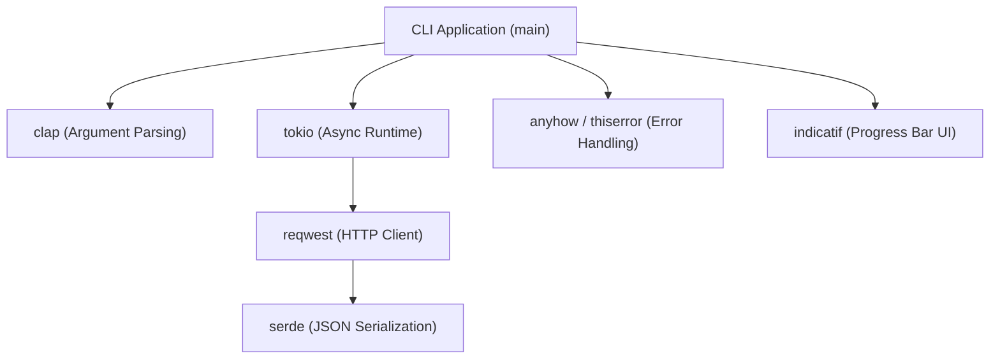
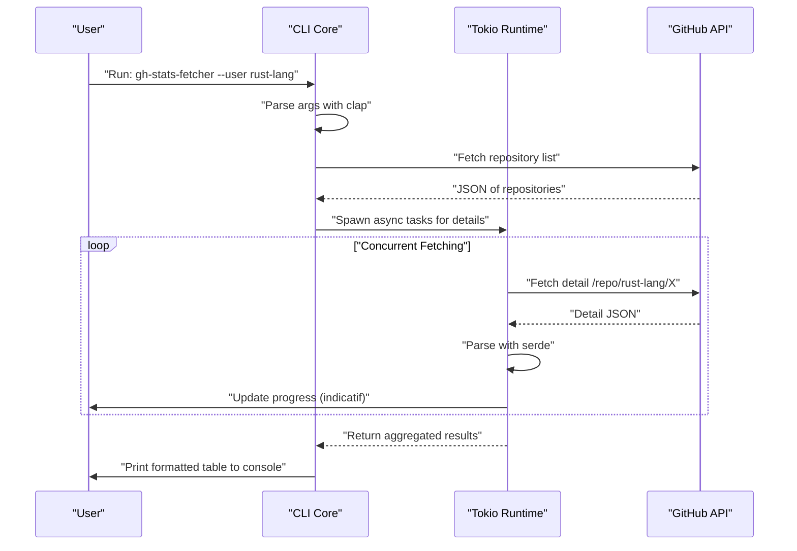
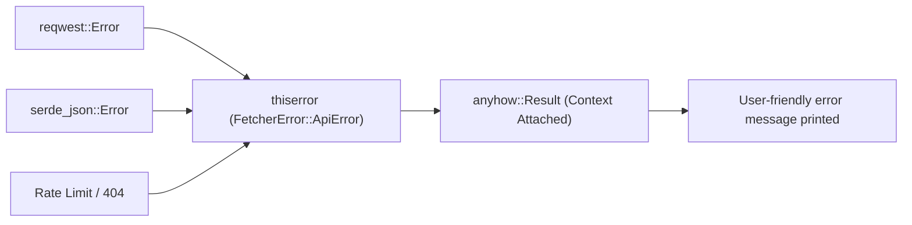

## 1. Introduction

In modern software development, CLI (Command Line Interface) tools are essential for dramatically boosting developer productivity. In the past, shell scripts, Python, or Ruby were the mainstream, but in recent years, **Rust** has established a solid position as the de facto standard for CLI tool development.

In this article, we will thoroughly explain how to build practical CLI tools that "run at blazing speed and can be developed at blazing speed" using Rust, covering everything from the basics to advanced topics. Rather than just building something that works, we will comprehensively cover robust error handling suitable for commercial use, high-speed API requests using asynchronous processing, and implementing progress bars to improve user experience (UX).

By reading this article to the end, you will master the following advanced Rust tech stack and be able to publish your own powerful CLI tools to the world.

---

## 2. Why Choose Rust for CLI Tool Development?

The reason Rust is highly evaluated in CLI development is not simply because "it is trendy." There are clear technical and architectural advantages.

### 2.1. Single Binary and Cross-Compilation
When distributing tools written in Python or Node.js, users must have the runtime (Python interpreter or Node.js) installed in their environment. Furthermore, it is not uncommon to suffer from dependency version conflicts (so-called "dependency hell").
On the other hand, since Rust is compiled into native code beforehand, it generates a **single executable binary** that includes dependencies. Users can use the tool simply by downloading and placing the binary, making the barrier to adoption extremely low. Also, cross-compilation is easy, making it possible to build binaries for Windows, macOS, and Linux in a single CI environment.

### 2.2. Overwhelming Execution Speed and Low Memory Footprint
Rust does not have a garbage collector (GC) and delivers performance comparable to C/C++ through zero-cost abstractions. In CLI tools, short startup time directly translates to better UX. Unlike JVM languages, there is no warm-up time at startup, and processing begins the moment the command is struck, which is a massive advantage.

### 2.3. Safety through a Strong Type System and Ownership Model
Thanks to Rust's greatest weapons—its Ownership model and strong type system—bugs such as memory leaks and data races are eliminated at compile time. The experience that "if it compiles, it will almost certainly work as intended" brings immense peace of mind to developers in the development of applications that directly touch system resources like CLI tools.

---

## 3. The Ultimate Crate Stack Adopted in This Tutorial

In the Rust ecosystem, there are many excellent crates (libraries) that strongly support CLI development. In this tutorial, we will use the following crates, which can be called the "golden stack" in modern Rust CLI development.

1. **`clap`**: The most powerful and popular crate for parsing command-line arguments. Since version 4, declarative definition using the Derive macro has been further refined, supporting automatic generation of help messages and input completion scripts.
2. **`tokio`**: The de facto standard async runtime for Rust. It handles multi-threaded asynchronous I/O extremely efficiently.
3. **`reqwest`**: A high-performance HTTP client that runs on `tokio`. It has an easy-to-use API and makes implementing asynchronous API requests easy.
4. **`serde` & `serde_json`**: A framework for serializing and deserializing data. It is essential for mapping JSON responses from APIs to type-safe Rust structures.
5. **`indicatif`**: Provides rich and customizable progress bars. It visually displays the progress of asynchronous processing and dramatically improves the UX of the CLI.
6. **`anyhow` & `thiserror`**: A powerful combination for error handling. The best practice is to use `thiserror` for defining domain errors inside libraries, and `anyhow` for aggregating errors at the top layer of the application.

The diagram below shows the architecture of how these crates work together within an application.



---

## 4. Mathematical Background of Asynchronous Processing and Performance

The tool we develop in this tutorial will send concurrent requests to multiple API endpoints. Let's look at the mathematical background of why using an asynchronous runtime like `tokio` makes it dramatically faster.

### 4.1. Amdahl's Law
The overall performance improvement rate achieved by parallelizing or making a part of the system asynchronous is formulated by Amdahl's Law as follows.

$$
S(N) = \frac{1}{(1 - P) + \frac{P}{N}}
$$

Here,
- $S(N)$ is the theoretical maximum speedup
- $P$ is the proportion of the program that can be parallelized (made asynchronous)
- $N$ is the degree of concurrency, or the number of tasks that can be executed simultaneously

In the case of a tool that fetches data from an API, the majority of execution time is spent waiting for network responses (I/O bound). Therefore, the value of $P$ is very large (e.g., $0.95$ or more). In a synchronous program, $N = 1$, but by using asynchronous I/O, $N$ can be increased to the scale of thousands, theoretically causing $S(N)$ to increase dramatically.

### 4.2. Little's Law and Throughput
When processing network requests, the following relationship holds among the average number of concurrent requests in the system $L$, the average throughput $\lambda$ (number of completed processes per unit time), and the average response time $W$.

$$
L = \lambda W \implies \lambda = \frac{L}{W}
$$

In other words, in an environment where network latency $W$ is unavoidable, the only way to improve the system's throughput $\lambda$ is to increase the number of requests processed simultaneously $L$. Since asynchronous tasks in Rust have extremely small memory overhead compared to native OS threads, $L$ can be easily scaled.

---

## 5. Designing the Tool to Develop: GitHub Repository Bulk Fetcher

As a practical example this time, we will develop a tool called **`gh-stats-fetcher`**. It fetches a list of public repositories for a specified GitHub user or Organization, concurrently fetches statistical information such as the number of stars, forks, and language for each, and formats and displays it in the terminal.

### Tool Execution Sequence



---

## 6. Project Initialization and Dependency Setup

First, let's create a new project using Cargo.

```bash
cargo new gh-stats-fetcher
cd gh-stats-fetcher
```

Next, add the necessary dependencies to `Cargo.toml`.

```toml
[package]
name = "gh-stats-fetcher"
version = "0.1.0"
edition = "2021"
authors = ["Your Name <your.email@example.com>"]
description = "A blazing fast CLI tool to fetch GitHub repository stats."

[dependencies]
clap = { version = "4.4", features = ["derive"] }
tokio = { version = "1.34", features = ["full"] }
reqwest = { version = "0.11", features = ["json", "rustls-tls"], default-features = false }
serde = { version = "1.0", features = ["derive"] }
serde_json = "1.0"
indicatif = "0.17"
anyhow = "1.0"
thiserror = "1.0"
```

> **Point**: For `reqwest`, we are using `rustls-tls` instead of the default TLS backend. This eliminates the need for system-dependent libraries like OpenSSL and makes it easier to build fully statically linked single binaries.

---

## 7. Implementation Phase 1: Building the Error Handling Foundation

To build a robust CLI tool, the design of error handling is crucial. Here we practice the distinction between `thiserror` and `anyhow`.

Domain-specific errors are defined in `src/error.rs`.

```rust
// src/error.rs
use thiserror::Error;

#[derive(Error, Debug)]
pub enum FetcherError {
    #[error("API Request failed: {0}")]
    ApiError(#[from] reqwest::Error),
    
    #[error("Failed to parse JSON: {0}")]
    ParseError(#[from] serde_json::Error),
    
    #[error("GitHub API Rate limit exceeded. Try again later.")]
    RateLimitExceeded,
    
    #[error("Target user or organization '{0}' not found.")]
    NotFound(String),
}
```



---

## 8. Implementation Phase 2: Argument Parsing with clap

Next, we define the CLI arguments. Create `src/cli.rs` and use `clap`'s Derive macro.

```rust
// src/cli.rs
use clap::{Parser, Subcommand};

#[derive(Parser, Debug)]
#[command(name = "gh-stats-fetcher")]
#[command(author, version, about, long_about = None)]
pub struct Cli {
    #[command(subcommand)]
    pub command: Commands,
}

#[derive(Subcommand, Debug)]
pub enum Commands {
    /// Fetch stats for a specific user
    Fetch {
        /// The GitHub username or organization name
        #[arg(short, long)]
        user: String,
        
        /// Number of concurrent requests
        #[arg(short, long, default_value_t = 10)]
        concurrency: usize,
    },
}
```

By doing this, a beautiful help message is automatically generated as follows.

```text
$ gh-stats-fetcher --help
A blazing fast CLI tool to fetch GitHub repository stats.

Usage: gh-stats-fetcher <COMMAND>

Commands:
  fetch  Fetch stats for a specific user
  help   Print this message or the help of the given subcommand(s)
```

---

## 9. Implementation Phase 3: API Client and Data Mapping

We map the JSON data returned from the GitHub API to Rust structures. Implement `src/models.rs` and `src/api.rs`.

```rust
// src/models.rs
use serde::{Deserialize, Serialize};

#[derive(Debug, Deserialize, Serialize)]
pub struct Repository {
    pub name: String,
    pub html_url: String,
    pub stargazers_count: u32,
    pub forks_count: u32,
    pub language: Option<String>,
}
```

```rust
// src/api.rs
use crate::models::Repository;
use crate::error::FetcherError;
use reqwest::Client;

pub struct GitHubClient {
    client: Client,
}

impl GitHubClient {
    pub fn new() -> Result<Self, FetcherError> {
        let client = Client::builder()
            .user_agent("gh-stats-fetcher/0.1.0")
            .build()?;
        Ok(Self { client })
    }

    pub async fn fetch_repos(&self, user: &str) -> Result<Vec<Repository>, FetcherError> {
        let url = format!("https://api.github.com/users/{}/repos?per_page=100", user);
        let res = self.client.get(&url).send().await?;

        if res.status() == 404 {
            return Err(FetcherError::NotFound(user.to_string()));
        } else if res.status() == 403 {
            return Err(FetcherError::RateLimitExceeded);
        }

        let repos = res.json::<Vec<Repository>>().await?;
        Ok(repos)
    }
}
```

---

## 10. Implementation Phase 4: Concurrency and Progress Bar with tokio and indicatif

This is the highlight of this tool. We run concurrent processing on the fetched repository list and display a beautiful progress bar.

```rust
// src/main.rs
mod cli;
mod error;
mod models;
mod api;

use clap::Parser;
use cli::{Cli, Commands};
use api::GitHubClient;
use anyhow::{Context, Result};
use indicatif::{ProgressBar, ProgressStyle};
use std::sync::Arc;
use tokio::sync::Semaphore;

#[tokio::main]
async fn main() -> Result<()> {
    let cli = Cli::parse();

    match cli.command {
        Commands::Fetch { user, concurrency } => {
            println!("Fetching repositories for {}...", user);
            
            let client = Arc::new(GitHubClient::new().context("Failed to initialize API client")?);
            let repos = client.fetch_repos(&user).await.context("Failed to fetch repository list")?;
            
            println!("Found {} repositories. Analyzing...", repos.len());

            let pb = ProgressBar::new(repos.len() as u64);
            pb.set_style(ProgressStyle::default_bar()
                .template("{spinner:.green} [{elapsed_precise}] [{wide_bar:.cyan/blue}] {pos}/{len} ({eta})")
                .unwrap()
                .progress_chars("#>-"));

            // Semaphore to limit concurrency
            let semaphore = Arc::new(Semaphore::new(concurrency));
            let mut tasks = vec![];

            for repo in repos {
                let permit = semaphore.clone().acquire_owned().await.unwrap();
                let pb_clone = pb.clone();
                // In an actual app, heavy processing such as hitting detailed APIs would be done here
                // For this demo, we insert an asynchronous sleep
                tasks.push(tokio::spawn(async move {
                    tokio::time::sleep(std::time::Duration::from_millis(100)).await;
                    pb_clone.inc(1);
                    drop(permit);
                    repo
                }));
            }

            let mut results = vec![];
            for task in tasks {
                results.push(task.await.context("Task panicked")?);
            }

            pb.finish_with_message("Done!");

            // Sort by number of stars and display the top 5
            results.sort_by(|a, b| b.stargazers_count.cmp(&a.stargazers_count));
            println!("\nTop 5 Repositories:");
            for (i, repo) in results.iter().take(5).enumerate() {
                let lang = repo.language.as_deref().unwrap_or("Unknown");
                println!("{}. {} (⭐ {} | 🍴 {} | 💻 {})", 
                    i + 1, repo.name, repo.stargazers_count, repo.forks_count, lang);
            }
        }
    }

    Ok(())
}
```

In this code, we dispatch tasks to background workers using `tokio::spawn`, while simultaneously limiting the number of API requests executed concurrently (default 10 concurrent) using `tokio::sync::Semaphore`. This achieves an overwhelming speed compared to synchronous processing while reducing the risk of hitting the API rate limit.

---

## 11. Advanced Topics: Testing and Optimization

### 11.1. Integration Testing for CLI Tools
To test the behavior of the CLI tool itself, the `assert_cmd` crate is extremely useful. Create `tests/cli_test.rs` to call the actual binary and verify the standard output.

```rust
// tests/cli_test.rs
use assert_cmd::Command;
use predicates::prelude::*;

#[test]
fn test_help_message() {
    let mut cmd = Command::cargo_bin("gh-stats-fetcher").unwrap();
    cmd.arg("--help")
        .assert()
        .success()
        .stdout(predicate::str::contains("Usage: gh-stats-fetcher"));
}
```

### 11.2. Extreme Optimization for Release Builds
Although the default release build is fast enough, to reduce the binary size and maximize execution speed to the limit, we configure `[profile.release]` in `Cargo.toml`.

```toml
[profile.release]
opt-level = 3       # Highest level of optimization
lto = true          # Enable Link Time Optimization
codegen-units = 1   # Set compilation units to 1 to maximize optimization (increases build time)
panic = "abort"     # Abort immediately without unwinding the stack trace on panic (reduces size)
strip = true        # Strip symbol information to drastically reduce binary size
```

By applying these settings, the generated binary size is reduced by a few megabytes, making distribution to users even easier.

---

## 12. CI/CD and Publishing

These are the steps to distribute your created tool to the world.

### Publishing to crates.io
Using Cargo, Rust's package manager, you can publish to the official registry with just a few commands.

```bash
cargo login <YOUR_TOKEN>
cargo publish
```
Once published, users all over the world will be able to install your tool with a single command: `cargo install gh-stats-fetcher`.

### Automated Releases with GitHub Actions
Build a CI/CD pipeline that automatically uploads cross-compiled binaries to GitHub Releases. Write settings like the following in `.github/workflows/release.yml`. By doing this, binaries for Linux, macOS, and Windows are automatically built and attached as release assets simply by pushing a tag (due to space limitations, detailed YAML description is omitted here, but using an Action like `taiki-e/upload-rust-binary-action` is the current best practice).

---

## 13. Conclusion

In this article, we thoroughly explained the entire flow of CLI tool development using Rust.

1. **Design Policy**: We confirmed the safety and speed of Rust, and the advantages of a single binary.
2. **Crate Selection**: We acquired powerful weapons: `clap`, `tokio`, `serde`, `indicatif`, `thiserror`, and `anyhow`.
3. **Mathematical Advantages of Concurrency**: We theoretically understood the power of asynchronous processing based on Amdahl's Law and Little's Law.
4. **Implementation and Optimization**: We packed practical know-how, from robust error handling to extreme binary optimization.

CLI development in Rust is a wonderful experience where software quality can be guaranteed from the design stage through dialogue with the compiler. Based on the base code we created this time, please develop your own original CLI tool and share it with the world! Happy Rust Coding!
