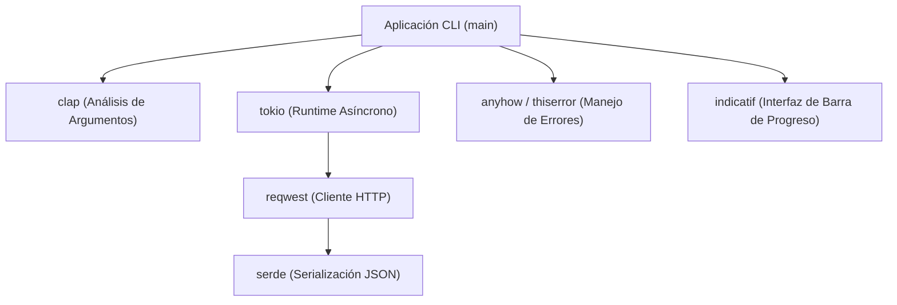
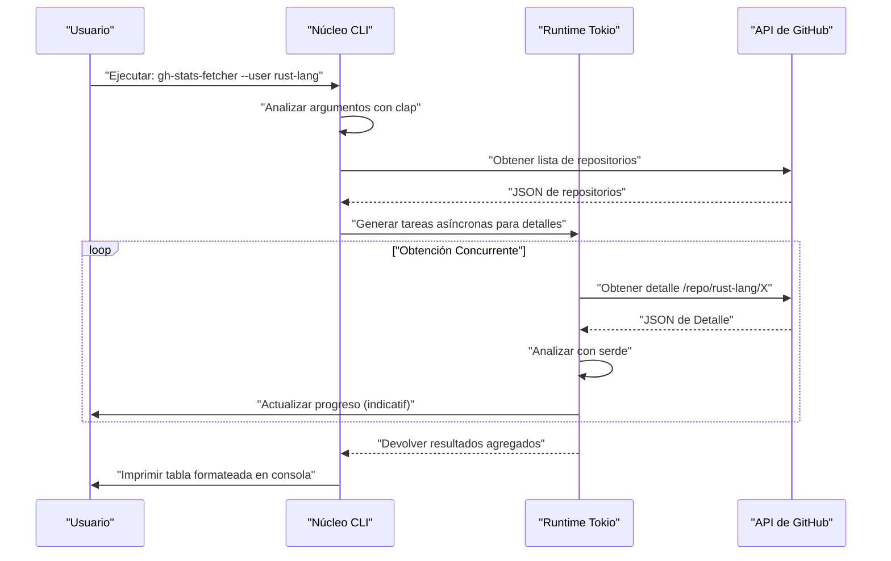
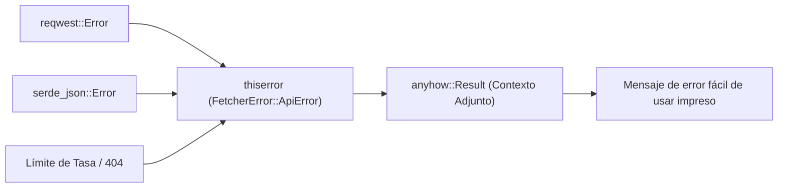

## 1. Introducción

En el desarrollo de software moderno, las herramientas CLI (Interfaz de Línea de Comandos) son indispensables para mejorar drásticamente la productividad de los desarrolladores. En el pasado, los scripts de shell, Python o Ruby eran la norma, pero en los últimos años, **Rust** ha establecido una posición sólida como el estándar de facto para el desarrollo de herramientas CLI.

En este artículo, explicaremos exhaustivamente desde lo básico hasta las aplicaciones avanzadas cómo construir herramientas CLI prácticas que "funcionan extremadamente rápido y se pueden desarrollar a la velocidad de la luz" usando Rust. No solo crearemos algo que funcione, sino que cubriremos de manera integral el manejo de errores robusto a nivel comercial, peticiones a API rápidas usando procesamiento asíncrono, y la implementación de barras de progreso para mejorar la experiencia del usuario (UX).

Al leer este artículo hasta el final, dominarás el siguiente stack tecnológico avanzado de Rust y serás capaz de publicar tus propias y potentes herramientas CLI al mundo.

---

## 2. ¿Por qué elegir Rust para el desarrollo de herramientas CLI?

La razón por la que Rust es altamente valorado en el desarrollo de CLI no es simplemente "porque está de moda". Existen claras ventajas técnicas y arquitectónicas.

### 2.1. Binario único y compilación cruzada
Al distribuir una herramienta escrita en Python o Node.js, el usuario necesita tener instalado el entorno de ejecución (intérprete de Python o Node.js) en su entorno. Además, no es raro sufrir por conflictos de versiones de paquetes de dependencias (el llamado "infierno de las dependencias").
Por otro lado, dado que Rust se compila a código nativo de antemano, genera un **único binario ejecutable** que incluye todas las dependencias. Los usuarios pueden usar la herramienta simplemente descargando y ubicando el binario, lo que reduce enormemente la barrera de entrada. Además, la compilación cruzada es sencilla, lo que permite construir binarios para Windows, macOS y Linux en un solo entorno CI.

### 2.2. Velocidad de ejecución abrumadora y bajo consumo de memoria
Rust no tiene un recolector de basura (GC) y, gracias a la abstracción de coste cero, demuestra un rendimiento equivalente a C/C++. En las herramientas CLI, el tiempo de inicio corto está directamente relacionado con la UX. Es una gran ventaja que el procesamiento comience en el momento en que se ejecuta el comando, sin el tiempo de calentamiento inicial que tienen los lenguajes de la JVM.

### 2.3. Seguridad mediante un sistema de tipos fuerte y el modelo de propiedad
Gracias al modelo de propiedad (Ownership), que es la mayor arma de Rust, y su potente sistema de tipos, errores como las fugas de memoria o las condiciones de carrera de datos se eliminan en tiempo de compilación. La experiencia de que "si compila, casi con seguridad funcionará como se espera" brinda a los desarrolladores una inmensa tranquilidad al desarrollar aplicaciones que interactúan directamente con los recursos del sistema, como las herramientas CLI.

---

## 3. Los mejores crates adoptados en este tutorial

En el ecosistema de Rust, existen excelentes crates (bibliotecas) que apoyan firmemente el desarrollo de CLI. En este tutorial, usaremos los siguientes crates que pueden llamarse el "stack dorado" en el desarrollo moderno de CLI en Rust.

1. **`clap`**: Es el crate más potente y popular para analizar argumentos de línea de comandos. A partir de la versión 4, las definiciones declarativas usando macros Derive se han vuelto más refinadas, soportando la generación automática de mensajes de ayuda y scripts de autocompletado.
2. **`tokio`**: El estándar de facto para el runtime asíncrono de Rust. Maneja el I/O asíncrono en múltiples hilos de manera extremadamente eficiente.
3. **`reqwest`**: Un cliente HTTP de alto rendimiento que se ejecuta sobre `tokio`. Cuenta con una API fácil de usar y facilita la implementación de peticiones a API asíncronas.
4. **`serde` & `serde_json`**: Framework para serializar y deserializar datos. Es indispensable para mapear las respuestas JSON de las APIs a estructuras de Rust seguras en cuanto a tipos.
5. **`indicatif`**: Proporciona barras de progreso ricas y personalizables. Muestra visualmente el progreso del procesamiento asíncrono y mejora drásticamente la UX de la CLI.
6. **`anyhow` & `thiserror`**: Una potente combinación para el manejo de errores. La mejor práctica es usar `thiserror` para la definición de errores de dominio internos en bibliotecas, y `anyhow` para la agregación de errores en la capa más alta de la aplicación.

El siguiente diagrama muestra la arquitectura de cómo estos crates interactúan dentro de la aplicación.



---

## 4. Antecedentes matemáticos del procesamiento asíncrono y el rendimiento

La herramienta que desarrollaremos en este tutorial enviará peticiones en paralelo a múltiples endpoints de API. Revisemos los antecedentes matemáticos de por qué el uso de un runtime asíncrono como `tokio` la hace drásticamente más rápida.

### 4.1. Ley de Amdahl (Amdahl's Law)
La tasa de mejora del rendimiento general al paralelizar o asincronizar una parte del sistema se formula mediante la Ley de Amdahl de la siguiente manera:

$$
S(N) = \frac{1}{(1 - P) + \frac{P}{N}}
$$

Donde,
- $S(N)$ es la tasa máxima de aceleración teórica
- $P$ es la proporción de la parte que se puede paralelizar (o hacer asíncrona) en el programa
- $N$ es el grado de paralelismo de las tareas que se pueden ejecutar simultáneamente

En el caso de una herramienta que obtiene datos de una API, la mayor parte del tiempo de ejecución es la espera de respuesta de la red (limitada por I/O). Por lo tanto, el valor de $P$ es muy grande (por ejemplo, $0.95$ o más). En un programa síncrono, $N = 1$, pero al usar I/O asíncrono, se puede aumentar $N$ a miles, aumentando exponencialmente $S(N)$ en teoría.

### 4.2. Ley de Little (Little's Law) y Rendimiento (Throughput)
Al procesar peticiones de red, existe la siguiente relación entre el número promedio de peticiones concurrentes en el sistema $L$, el rendimiento promedio $\lambda$ (número de procesos completados por unidad de tiempo) y el tiempo promedio de respuesta $W$:

$$
L = \lambda W \implies \lambda = \frac{L}{W}
$$

Es decir, en un entorno donde la latencia de la red $W$ es inevitable, para mejorar el rendimiento del sistema $\lambda$, la única opción es aumentar el número de peticiones procesadas simultáneamente $L$. Dado que las tareas asíncronas de Rust tienen una sobrecarga de memoria extremadamente pequeña en comparación con los hilos nativos del SO, es fácil escalar $L$.

---

## 5. Diseño de la herramienta a desarrollar: Buscador de repositorios de GitHub en lote

Como ejemplo práctico en esta ocasión, desarrollaremos la herramienta **`gh-stats-fetcher`**. Esta herramienta obtiene una lista de repositorios públicos de un usuario u organización de GitHub especificados, obtiene información estadística como el número de estrellas, forks y el lenguaje en paralelo para cada uno, y formatea e imprime los resultados en la terminal.

### Secuencia de ejecución de la herramienta



---

## 6. Inicialización del proyecto y configuración de dependencias

Primero, creamos un nuevo proyecto usando Cargo.

```bash
cargo new gh-stats-fetcher
cd gh-stats-fetcher
```

A continuación, añadimos las dependencias necesarias a `Cargo.toml`.

```toml
[package]
name = "gh-stats-fetcher"
version = "0.1.0"
edition = "2021"
authors = ["Tu Nombre <tu.email@ejemplo.com>"]
description = "Una herramienta CLI rapidísima para obtener estadísticas de repositorios de GitHub."

[dependencies]
clap = { version = "4.4", features = ["derive"] }
tokio = { version = "1.34", features = ["full"] }
reqwest = { version = "0.11", features = ["json", "rustls-tls"], default-features = false }
serde = { version = "1.0", features = ["derive"] }
serde_json = "1.0"
indicatif = "0.17"
anyhow = "1.0"
thiserror = "1.0"
```

> **Punto clave**: En `reqwest`, estamos usando `rustls-tls` en lugar del backend TLS predeterminado. Con esto, bibliotecas dependientes del sistema como OpenSSL se vuelven innecesarias, haciendo más fácil construir un único binario completamente enlazado estáticamente.

---

## 7. Fase de implementación 1: Construcción de la base del manejo de errores

Para hacer una herramienta CLI robusta, el diseño del manejo de errores es crucial. Aquí pondremos en práctica el uso de `thiserror` y `anyhow`.

Los errores específicos del dominio se definen en `src/error.rs`.

```rust
// src/error.rs
use thiserror::Error;

#[derive(Error, Debug)]
pub enum FetcherError {
    #[error("API Request failed: {0}")]
    ApiError(#[from] reqwest::Error),
    
    #[error("Failed to parse JSON: {0}")]
    ParseError(#[from] serde_json::Error),
    
    #[error("GitHub API Rate limit exceeded. Try again later.")]
    RateLimitExceeded,
    
    #[error("Target user or organization '{0}' not found.")]
    NotFound(String),
}
```



---

## 8. Fase de implementación 2: Análisis de argumentos con clap

A continuación, definimos los argumentos de la CLI. Creamos `src/cli.rs` y usamos la macro Derive de `clap`.

```rust
// src/cli.rs
use clap::{Parser, Subcommand};

#[derive(Parser, Debug)]
#[command(name = "gh-stats-fetcher")]
#[command(author, version, about, long_about = None)]
pub struct Cli {
    #[command(subcommand)]
    pub command: Commands,
}

#[derive(Subcommand, Debug)]
pub enum Commands {
    /// Fetch stats for a specific user
    Fetch {
        /// The GitHub username or organization name
        #[arg(short, long)]
        user: String,
        
        /// Number of concurrent requests
        #[arg(short, long, default_value_t = 10)]
        concurrency: usize,
    },
}
```

Con esto, se generará automáticamente un hermoso mensaje de ayuda como el siguiente.

```text
$ gh-stats-fetcher --help
Una herramienta CLI rapidísima para obtener estadísticas de repositorios de GitHub.

Usage: gh-stats-fetcher <COMMAND>

Commands:
  fetch  Fetch stats for a specific user
  help   Print this message or the help of the given subcommand(s)
```

---

## 9. Fase de implementación 3: Cliente de la API y mapeo de datos

Mapeamos los datos JSON devueltos por la API de GitHub a estructuras de Rust. Implementamos `src/models.rs` y `src/api.rs`.

```rust
// src/models.rs
use serde::{Deserialize, Serialize};

#[derive(Debug, Deserialize, Serialize)]
pub struct Repository {
    pub name: String,
    pub html_url: String,
    pub stargazers_count: u32,
    pub forks_count: u32,
    pub language: Option<String>,
}
```

```rust
// src/api.rs
use crate::models::Repository;
use crate::error::FetcherError;
use reqwest::Client;

pub struct GitHubClient {
    client: Client,
}

impl GitHubClient {
    pub fn new() -> Result<Self, FetcherError> {
        let client = Client::builder()
            .user_agent("gh-stats-fetcher/0.1.0")
            .build()?;
        Ok(Self { client })
    }

    pub async fn fetch_repos(&self, user: &str) -> Result<Vec<Repository>, FetcherError> {
        let url = format!("https://api.github.com/users/{}/repos?per_page=100", user);
        let res = self.client.get(&url).send().await?;

        if res.status() == 404 {
            return Err(FetcherError::NotFound(user.to_string()));
        } else if res.status() == 403 {
            return Err(FetcherError::RateLimitExceeded);
        }

        let repos = res.json::<Vec<Repository>>().await?;
        Ok(repos)
    }
}
```

---

## 10. Fase de implementación 4: Procesamiento concurrente y barra de progreso con tokio e indicatif

Este es el punto culminante de la herramienta. Realizamos el procesamiento paralelo sobre la lista de repositorios obtenida y mostramos una hermosa barra de progreso.

```rust
// src/main.rs
mod cli;
mod error;
mod models;
mod api;

use clap::Parser;
use cli::{Cli, Commands};
use api::GitHubClient;
use anyhow::{Context, Result};
use indicatif::{ProgressBar, ProgressStyle};
use std::sync::Arc;
use tokio::sync::Semaphore;

#[tokio::main]
async fn main() -> Result<()> {
    let cli = Cli::parse();

    match cli.command {
        Commands::Fetch { user, concurrency } => {
            println!("Fetching repositories for {}...", user);
            
            let client = Arc::new(GitHubClient::new().context("Failed to initialize API client")?);
            let repos = client.fetch_repos(&user).await.context("Failed to fetch repository list")?;
            
            println!("Found {} repositories. Analyzing...", repos.len());

            let pb = ProgressBar::new(repos.len() as u64);
            pb.set_style(ProgressStyle::default_bar()
                .template("{spinner:.green} [{elapsed_precise}] [{wide_bar:.cyan/blue}] {pos}/{len} ({eta})")
                .unwrap()
                .progress_chars("#>-"));

            // Semáforo para limitar la concurrencia
            let semaphore = Arc::new(Semaphore::new(concurrency));
            let mut tasks = vec![];

            for repo in repos {
                let permit = semaphore.clone().acquire_owned().await.unwrap();
                let pb_clone = pb.clone();
                // En una aplicación real, se harían peticiones API detalladas u otras tareas pesadas aquí
                // Para esta demo, añadimos un sleep asíncrono
                tasks.push(tokio::spawn(async move {
                    tokio::time::sleep(std::time::Duration::from_millis(100)).await;
                    pb_clone.inc(1);
                    drop(permit);
                    repo
                }));
            }

            let mut results = vec![];
            for task in tasks {
                results.push(task.await.context("Task panicked")?);
            }

            pb.finish_with_message("Done!");

            // Ordenar por número de estrellas y mostrar los 5 principales
            results.sort_by(|a, b| b.stargazers_count.cmp(&a.stargazers_count));
            println!("\nTop 5 Repositories:");
            for (i, repo) in results.iter().take(5).enumerate() {
                let lang = repo.language.as_deref().unwrap_or("Unknown");
                println!("{}. {} (⭐ {} | 🍴 {} | 💻 {})", 
                    i + 1, repo.name, repo.stargazers_count, repo.forks_count, lang);
            }
        }
    }

    Ok(())
}
```

En este código, estamos usando `tokio::spawn` para despachar tareas a los workers en segundo plano, y al mismo tiempo usamos `tokio::sync::Semaphore` para limitar el número de peticiones API ejecutadas concurrentemente (por defecto, 10 en paralelo). Esto logra una velocidad abrumadora sobre el procesamiento síncrono mientras reduce el riesgo de alcanzar el límite de tasa de la API.

---

## 11. Temas avanzados: Pruebas y optimización

### 11.1. Pruebas de integración para la herramienta CLI
Para probar el comportamiento de la herramienta CLI en sí, el crate `assert_cmd` es muy útil. Creamos `tests/cli_test.rs`, llamamos al binario real y verificamos su salida estándar.

```rust
// tests/cli_test.rs
use assert_cmd::Command;
use predicates::prelude::*;

#[test]
fn test_help_message() {
    let mut cmd = Command::cargo_bin("gh-stats-fetcher").unwrap();
    cmd.arg("--help")
        .assert()
        .success()
        .stdout(predicate::str::contains("Usage: gh-stats-fetcher"));
}
```

### 11.2. Optimización extrema de la build de release
Aunque la build de release por defecto ya es lo suficientemente rápida, configuraremos la sección `[profile.release]` en `Cargo.toml` para reducir el tamaño del binario y maximizar la velocidad de ejecución al límite.

```toml
[profile.release]
opt-level = 3       # Nivel máximo de optimización
lto = true          # Habilitar la optimización en tiempo de enlace (Link Time Optimization)
codegen-units = 1   # Establecer unidades de compilación a 1 para maximizar la optimización (el tiempo de compilación será mayor)
panic = "abort"     # Abortar inmediatamente en caso de panic sin desenrollar el rastro de la pila (reduce tamaño)
strip = true        # Eliminar información de símbolos para reducir drásticamente el tamaño del binario
```

Al aplicar estas configuraciones, el tamaño del binario generado se reduce en varios MB, lo que facilita aún más la distribución a los usuarios.

---

## 12. CI/CD y Distribución (Publishing)

Estos son los pasos para distribuir la herramienta que hemos creado a todo el mundo.

### Publicar en crates.io
Usando Cargo, el gestor de paquetes de Rust, puedes publicar en el registro oficial con solo unos pocos comandos.

```bash
cargo login <TU_TOKEN>
cargo publish
```
Después de publicar, los usuarios de todo el mundo podrán instalar tu herramienta con el sencillo comando `cargo install gh-stats-fetcher`.

### Lanzamientos automáticos con GitHub Actions
Construiremos una canalización (pipeline) de CI/CD que suba automáticamente los binarios de compilación cruzada a GitHub Releases. Escribimos la siguiente configuración en `.github/workflows/release.yml`. Con esto, con solo subir una etiqueta (tag), los binarios para Linux, macOS y Windows se construirán automáticamente y se adjuntarán como activos de lanzamiento (por razones de espacio, omitiremos la descripción detallada del YAML aquí, pero usar una acción como `taiki-e/upload-rust-binary-action` es la mejor práctica actual).

---

## 13. Conclusión

En este artículo, hemos explicado en detalle una serie de flujos de trabajo para el desarrollo de herramientas CLI usando Rust.

1. **Políticas de diseño**: Confirmamos la seguridad y velocidad de Rust, y las ventajas de un único binario.
2. **Selección de crates**: Obtuvimos potentes armas como `clap`, `tokio`, `serde`, `indicatif`, `thiserror` y `anyhow`.
3. **Ventajas matemáticas del procesamiento concurrente**: Basándonos en la Ley de Amdahl y la Ley de Little, comprendimos teóricamente el poder del procesamiento asíncrono.
4. **Implementación y optimización**: Empaquetamos conocimientos prácticos desde un manejo de errores robusto hasta la optimización extrema de binarios.

El desarrollo de CLI con Rust es una experiencia maravillosa donde se puede garantizar la calidad del software desde la fase de diseño a través del diálogo con el compilador. Basándote en el código base creado en esta ocasión, ¡por favor, desarrolla tu propia herramienta CLI original y compártela con el mundo! ¡Feliz codificación en Rust!
