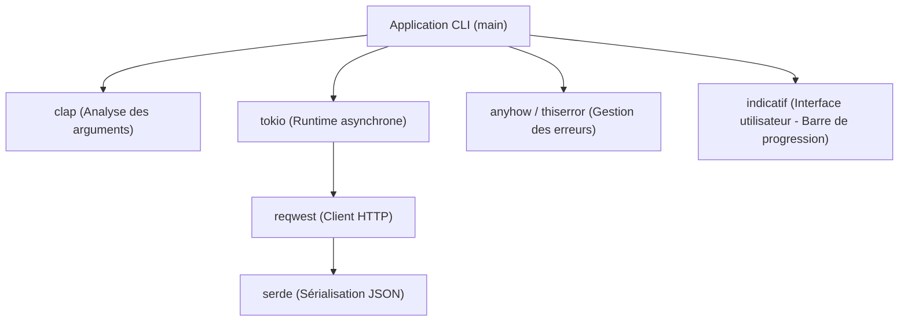
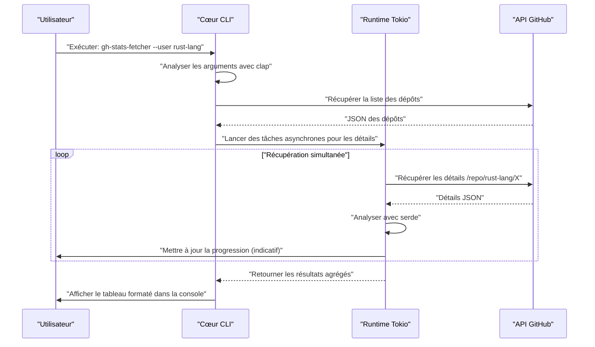
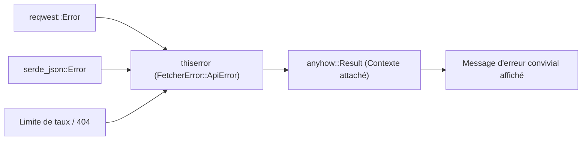

## 1. Introduction

Dans le développement logiciel moderne, les outils CLI (Command Line Interface) sont essentiels pour augmenter considérablement la productivité des développeurs. Autrefois, les scripts shell, Python ou Ruby étaient la norme, mais ces dernières années, **Rust** s'est imposé comme le standard de facto pour le développement d'outils CLI.

Dans cet article, nous expliquerons de manière exhaustive, des bases jusqu'aux concepts avancés, comment construire un outil CLI pratique avec Rust qui "fonctionne à une vitesse fulgurante et se développe à une vitesse fulgurante". Nous ne ferons pas que créer quelque chose qui fonctionne, mais nous couvrirons également la gestion robuste des erreurs au niveau commercial, les requêtes API rapides utilisant le traitement asynchrone, et l'implémentation de barres de progression pour améliorer l'expérience utilisateur (UX).

En lisant cet article jusqu'à la fin, vous maîtriserez la pile technologique avancée de Rust présentée ci-dessous, et vous serez capable de publier vos propres outils CLI puissants dans le monde entier.

---

## 2. Pourquoi choisir Rust pour le développement d'outils CLI ?

La raison pour laquelle Rust est tant apprécié pour le développement CLI n'est pas simplement parce que c'est "à la mode". Il existe des avantages techniques et architecturaux clairs.

### 2.1. Binaire unique et compilation croisée
Lors de la distribution d'outils écrits en Python ou Node.js, l'environnement de l'utilisateur doit avoir un environnement d'exécution (interpréteur Python ou Node.js) installé. De plus, il n'est pas rare de souffrir de conflits de versions de paquets de dépendances (ce qu'on appelle "l'enfer des dépendances").
En revanche, Rust est compilé à l'avance en code natif, générant ainsi un **binaire exécutable unique** incluant toutes les dépendances. Les utilisateurs peuvent utiliser l'outil simplement en téléchargeant et en plaçant le binaire, ce qui rend la barrière d'adoption extrêmement basse. De plus, la compilation croisée est facile, permettant de construire des binaires pour Windows, macOS et Linux dans un seul environnement CI.

### 2.2. Vitesse d'exécution écrasante et faible consommation de mémoire
Rust n'a pas de ramasse-miettes (GC) et offre des performances équivalentes à celles du C/C++ grâce à ses abstractions à coût nul. Pour les outils CLI, le temps de démarrage court est directement lié à l'UX. Il n'y a pas de temps de préchauffage au démarrage comme pour les langages de la JVM, et le fait que le traitement commence dès que la commande est tapée est un grand avantage.

### 2.3. Sécurité grâce à un système de types puissant et au modèle de possession
Grâce au modèle de possession (Ownership), qui est la plus grande arme de Rust, et à son système de types puissant, les bugs tels que les fuites de mémoire et les courses de données sont éliminés lors de la compilation. L'expérience selon laquelle "si ça compile, ça marche presque certainement comme prévu" apporte un sentiment de sécurité immense aux développeurs lorsqu'ils créent des applications qui touchent directement aux ressources système, comme les outils CLI.

---

## 3. Les crates ultimes adoptées dans ce tutoriel

L'écosystème Rust dispose de nombreuses excellentes crates (bibliothèques) qui soutiennent fortement le développement CLI. Dans ce tutoriel, nous utiliserons les crates suivantes, que l'on peut appeler la "pile d'or" dans le développement CLI Rust moderne.

1. **`clap`**: La crate la plus puissante et populaire pour l'analyse des arguments de ligne de commande. Depuis la version 4, la définition déclarative utilisant la macro Derive est devenue plus raffinée, prenant en charge la génération automatique de messages d'aide et de scripts de complétion de saisie.
2. **`tokio`**: Le standard de facto pour le runtime asynchrone de Rust. Il gère les E/S asynchrones multithread de manière extrêmement efficace.
3. **`reqwest`**: Un client HTTP très performant fonctionnant sur `tokio`. Il dispose d'une API facile à utiliser et permet d'implémenter facilement des requêtes API asynchrones.
4. **`serde` & `serde_json`**: Frameworks pour la sérialisation et la désérialisation de données. Indispensables pour mapper les réponses JSON des API vers des structures Rust fortement typées.
5. **`indicatif`**: Fournit des barres de progression riches et personnalisables. Il affiche visuellement la progression du traitement asynchrone, améliorant considérablement l'UX de la CLI.
6. **`anyhow` & `thiserror`**: Une combinaison puissante pour la gestion des erreurs. La meilleure pratique consiste à utiliser `thiserror` pour les définitions d'erreurs de domaine à l'intérieur de la bibliothèque, et `anyhow` pour regrouper les erreurs au niveau supérieur de l'application.

Le diagramme suivant illustre l'architecture montrant comment ces crates interagissent au sein de l'application.



---

## 4. Contexte mathématique du traitement asynchrone et des performances

L'outil que nous développons dans ce tutoriel enverra des requêtes simultanément à plusieurs points de terminaison d'API. Voyons le contexte mathématique expliquant pourquoi l'utilisation d'un runtime asynchrone comme `tokio` le rend considérablement plus rapide.

### 4.1. Loi d'Amdahl (Amdahl's Law)
Le taux global d'amélioration des performances dû à la parallélisation/l'asynchronisation d'une partie du système est formulé par la loi d'Amdahl comme suit :

$$
S(N) = \frac{1}{(1 - P) + \frac{P}{N}}
$$

Ici,
- $S(N)$ est le taux d'accélération théorique maximum
- $P$ est la proportion de la partie qui peut être parallélisée (asynchronisée) dans le programme
- $N$ est le degré de parallélisme des tâches pouvant être exécutées simultanément

Dans le cas d'un outil qui récupère des données d'une API, la majeure partie du temps d'exécution est passée à attendre la réponse du réseau (I/O bound). Par conséquent, la valeur de $P$ sera très grande (par exemple, 0,95 ou plus). Dans un programme synchrone, $N = 1$, mais en utilisant des E/S asynchrones, $N$ peut être augmenté à une échelle de plusieurs milliers, ce qui augmente théoriquement considérablement $S(N)$.

### 4.2. Loi de Little (Little's Law) et débit
Lors du traitement de requêtes réseau, la relation suivante s'établit entre le nombre moyen de requêtes simultanées dans le système $L$, le débit moyen $\lambda$ (nombre de traitements terminés par unité de temps) et le temps de réponse moyen $W$ :

$$
L = \lambda W \implies \lambda = \frac{L}{W}
$$

En d'autres termes, dans un environnement où la latence du réseau $W$ est inévitable, la seule façon d'améliorer le débit du système $\lambda$ est d'augmenter le nombre de requêtes traitées simultanément $L$. Contrairement aux threads natifs de l'OS, les tâches asynchrones de Rust ont une surcharge mémoire extrêmement faible, ce qui permet de faire évoluer facilement $L$.

---

## 5. Conception de l'outil à développer : Récupérateur en bloc de dépôts GitHub

À titre d'exemple pratique, nous allons développer l'outil **`gh-stats-fetcher`**, qui récupère la liste des dépôts publics d'un utilisateur ou d'une organisation GitHub spécifié, récupère en parallèle des informations statistiques telles que le nombre d'étoiles, le nombre de forks et les langages pour chacun, et affiche les résultats formatés dans le terminal.

### Séquence d'exécution de l'outil



---

## 6. Initialisation du projet et configuration des dépendances

Tout d'abord, créons un nouveau projet en utilisant Cargo.

```bash
cargo new gh-stats-fetcher
cd gh-stats-fetcher
```

Ensuite, ajoutons les dépendances nécessaires à `Cargo.toml`.

```toml
[package]
name = "gh-stats-fetcher"
version = "0.1.0"
edition = "2021"
authors = ["Your Name <your.email@example.com>"]
description = "A blazing fast CLI tool to fetch GitHub repository stats."

[dependencies]
clap = { version = "4.4", features = ["derive"] }
tokio = { version = "1.34", features = ["full"] }
reqwest = { version = "0.11", features = ["json", "rustls-tls"], default-features = false }
serde = { version = "1.0", features = ["derive"] }
serde_json = "1.0"
indicatif = "0.17"
anyhow = "1.0"
thiserror = "1.0"
```

> **Point clé** : Pour `reqwest`, nous utilisons `rustls-tls` au lieu du backend TLS par défaut. Cela élimine le besoin de bibliothèques dépendantes du système telles qu'OpenSSL et facilite la création de binaires uniques complètement liés de manière statique.

---

## 7. Phase d'implémentation 1 : Construire la base de la gestion des erreurs

La conception de la gestion des erreurs est cruciale pour créer des outils CLI robustes. Ici, nous mettrons en pratique la distinction entre `thiserror` et `anyhow`.

Les erreurs spécifiques au domaine sont définies dans `src/error.rs`.

```rust
// src/error.rs
use thiserror::Error;

#[derive(Error, Debug)]
pub enum FetcherError {
    #[error("API Request failed: {0}")]
    ApiError(#[from] reqwest::Error),
    
    #[error("Failed to parse JSON: {0}")]
    ParseError(#[from] serde_json::Error),
    
    #[error("GitHub API Rate limit exceeded. Try again later.")]
    RateLimitExceeded,
    
    #[error("Target user or organization '{0}' not found.")]
    NotFound(String),
}
```



---

## 8. Phase d'implémentation 2 : Analyse des arguments avec clap

Ensuite, définissons les arguments de la CLI. Créez `src/cli.rs` et utilisez la macro Derive de `clap`.

```rust
// src/cli.rs
use clap::{Parser, Subcommand};

#[derive(Parser, Debug)]
#[command(name = "gh-stats-fetcher")]
#[command(author, version, about, long_about = None)]
pub struct Cli {
    #[command(subcommand)]
    pub command: Commands,
}

#[derive(Subcommand, Debug)]
pub enum Commands {
    /// Fetch stats for a specific user
    Fetch {
        /// The GitHub username or organization name
        #[arg(short, long)]
        user: String,
        
        /// Number of concurrent requests
        #[arg(short, long, default_value_t = 10)]
        concurrency: usize,
    },
}
```

Cela générera automatiquement un beau message d'aide comme ci-dessous.

```text
$ gh-stats-fetcher --help
A blazing fast CLI tool to fetch GitHub repository stats.

Usage: gh-stats-fetcher <COMMAND>

Commands:
  fetch  Fetch stats for a specific user
  help   Print this message or the help of the given subcommand(s)
```

---

## 9. Phase d'implémentation 3 : Client API et mappage des données

Nous mapperons les données JSON renvoyées par l'API GitHub vers des structures Rust. Nous implémenterons `src/models.rs` et `src/api.rs`.

```rust
// src/models.rs
use serde::{Deserialize, Serialize};

#[derive(Debug, Deserialize, Serialize)]
pub struct Repository {
    pub name: String,
    pub html_url: String,
    pub stargazers_count: u32,
    pub forks_count: u32,
    pub language: Option<String>,
}
```

```rust
// src/api.rs
use crate::models::Repository;
use crate::error::FetcherError;
use reqwest::Client;

pub struct GitHubClient {
    client: Client,
}

impl GitHubClient {
    pub fn new() -> Result<Self, FetcherError> {
        let client = Client::builder()
            .user_agent("gh-stats-fetcher/0.1.0")
            .build()?;
        Ok(Self { client })
    }

    pub async fn fetch_repos(&self, user: &str) -> Result<Vec<Repository>, FetcherError> {
        let url = format!("https://api.github.com/users/{}/repos?per_page=100", user);
        let res = self.client.get(&url).send().await?;

        if res.status() == 404 {
            return Err(FetcherError::NotFound(user.to_string()));
        } else if res.status() == 403 {
            return Err(FetcherError::RateLimitExceeded);
        }

        let repos = res.json::<Vec<Repository>>().await?;
        Ok(repos)
    }
}
```

---

## 10. Phase d'implémentation 4 : Traitement parallèle et barre de progression avec tokio et indicatif

C'est ici le point culminant de cet outil. Nous effectuerons un traitement parallèle sur la liste des dépôts récupérés et afficherons une belle barre de progression.

```rust
// src/main.rs
mod cli;
mod error;
mod models;
mod api;

use clap::Parser;
use cli::{Cli, Commands};
use api::GitHubClient;
use anyhow::{Context, Result};
use indicatif::{ProgressBar, ProgressStyle};
use std::sync::Arc;
use tokio::sync::Semaphore;

#[tokio::main]
async fn main() -> Result<()> {
    let cli = Cli::parse();

    match cli.command {
        Commands::Fetch { user, concurrency } => {
            println!("Fetching repositories for {}...", user);
            
            let client = Arc::new(GitHubClient::new().context("Failed to initialize API client")?);
            let repos = client.fetch_repos(&user).await.context("Failed to fetch repository list")?;
            
            println!("Found {} repositories. Analyzing...", repos.len());

            let pb = ProgressBar::new(repos.len() as u64);
            pb.set_style(ProgressStyle::default_bar()
                .template("{spinner:.green} [{elapsed_precise}] [{wide_bar:.cyan/blue}] {pos}/{len} ({eta})")
                .unwrap()
                .progress_chars("#>-"));

            // Sémaphore pour limiter le niveau de concurrence
            let semaphore = Arc::new(Semaphore::new(concurrency));
            let mut tasks = vec![];

            for repo in repos {
                let permit = semaphore.clone().acquire_owned().await.unwrap();
                let pb_clone = pb.clone();
                // Dans une application réelle, des tâches lourdes telles que l'appel d'une API détaillée seraient effectuées ici
                // Pour cette démonstration, nous insérons un sommeil asynchrone
                tasks.push(tokio::spawn(async move {
                    tokio::time::sleep(std::time::Duration::from_millis(100)).await;
                    pb_clone.inc(1);
                    drop(permit);
                    repo
                }));
            }

            let mut results = vec![];
            for task in tasks {
                results.push(task.await.context("Task panicked")?);
            }

            pb.finish_with_message("Done!");

            // Trier par nombre d'étoiles et afficher les 5 premiers
            results.sort_by(|a, b| b.stargazers_count.cmp(&a.stargazers_count));
            println!("\nTop 5 Repositories:");
            for (i, repo) in results.iter().take(5).enumerate() {
                let lang = repo.language.as_deref().unwrap_or("Unknown");
                println!("{}. {} (⭐ {} | 🍴 {} | 💻 {})", 
                    i + 1, repo.name, repo.stargazers_count, repo.forks_count, lang);
            }
        }
    }

    Ok(())
}
```

Dans ce code, `tokio::spawn` est utilisé pour répartir les tâches vers des workers en arrière-plan, et en même temps, `tokio::sync::Semaphore` est utilisé pour limiter le nombre de requêtes API exécutées simultanément (10 en parallèle par défaut). Cela réduit le risque d'atteindre la limite de taux de l'API tout en offrant une vitesse considérablement plus rapide qu'un traitement synchrone.

---

## 11. Sujets avancés : Tests et optimisation

### 11.1. Tests d'intégration des outils CLI
Pour tester le comportement de l'outil CLI lui-même, la crate `assert_cmd` est très utile. Créez `tests/cli_test.rs`, appelez le binaire réel et vérifiez la sortie standard.

```rust
// tests/cli_test.rs
use assert_cmd::Command;
use predicates::prelude::*;

#[test]
fn test_help_message() {
    let mut cmd = Command::cargo_bin("gh-stats-fetcher").unwrap();
    cmd.arg("--help")
        .assert()
        .success()
        .stdout(predicate::str::contains("Usage: gh-stats-fetcher"));
}
```

### 11.2. Optimisation extrême des builds de release
Bien que le build de release par défaut soit suffisamment rapide, vous pouvez configurer `[profile.release]` dans `Cargo.toml` pour réduire la taille du binaire et maximiser la vitesse d'exécution.

```toml
[profile.release]
opt-level = 3       # Niveau d'optimisation le plus élevé
lto = true          # Activer l'optimisation au moment de l'édition de liens (Link Time Optimization)
codegen-units = 1   # Maximiser l'optimisation en définissant les unités de compilation sur 1 (le temps de build sera plus long)
panic = "abort"     # Avorter immédiatement sans dérouler la trace de la pile en cas de panique (réduction de taille)
strip = true        # Supprimer les informations symboliques pour réduire considérablement la taille du binaire
```

En appliquant ces paramètres, la taille du binaire généré sera réduite de plusieurs mégaoctets, facilitant encore plus la distribution aux utilisateurs.

---

## 12. CI/CD et publication (Publishing)

Ce sont les étapes pour distribuer l'outil que vous avez créé dans le monde entier.

### Publication sur crates.io
Avec Cargo, le gestionnaire de paquets de Rust, vous pouvez publier sur le registre officiel en quelques commandes seulement.

```bash
cargo login <YOUR_TOKEN>
cargo publish
```
Après la publication, les utilisateurs du monde entier pourront installer votre outil avec la simple commande `cargo install gh-stats-fetcher`.

### Publication automatique avec GitHub Actions
Construisez un pipeline CI/CD qui téléverse automatiquement les binaires compilés de manière croisée sur GitHub Releases. Décrivez une configuration comme la suivante dans `.github/workflows/release.yml`. Ainsi, simplement en poussant une étiquette (tag), les binaires pour Linux, macOS et Windows seront automatiquement compilés et joints en tant qu'actifs de publication (bien que la description YAML détaillée soit omise ici par manque de place, l'utilisation d'Actions telles que `taiki-e/upload-rust-binary-action` est la meilleure pratique actuelle).

---

## 13. Conclusion

Dans cet article, nous avons expliqué en détail une série de flux pour développer des outils CLI avec Rust.

1. **Principes de conception** : Nous avons confirmé les avantages de la sécurité et de la vitesse de Rust, ainsi que des binaires uniques.
2. **Sélection de crates** : Nous avons acquis des armes puissantes : `clap`, `tokio`, `serde`, `indicatif`, `thiserror`, `anyhow`.
3. **Avantage mathématique du traitement parallèle** : Sur la base de la loi d'Amdahl et de la loi de Little, nous avons compris de manière théorique la puissance du traitement asynchrone.
4. **Implémentation et optimisation** : Nous l'avons rempli de savoir-faire pratique, de la gestion robuste des erreurs à l'optimisation extrême des binaires.

Le développement de CLI avec Rust est une expérience merveilleuse qui permet de garantir la qualité du logiciel dès la phase de conception par l'interaction avec le compilateur. En utilisant le code de base créé cette fois, n'hésitez pas à développer votre propre outil CLI original et à le partager avec le monde ! Bon codage Rust !
