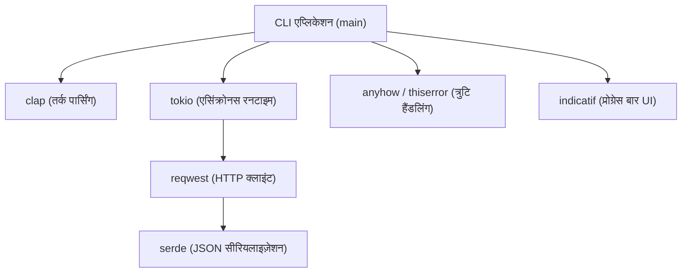
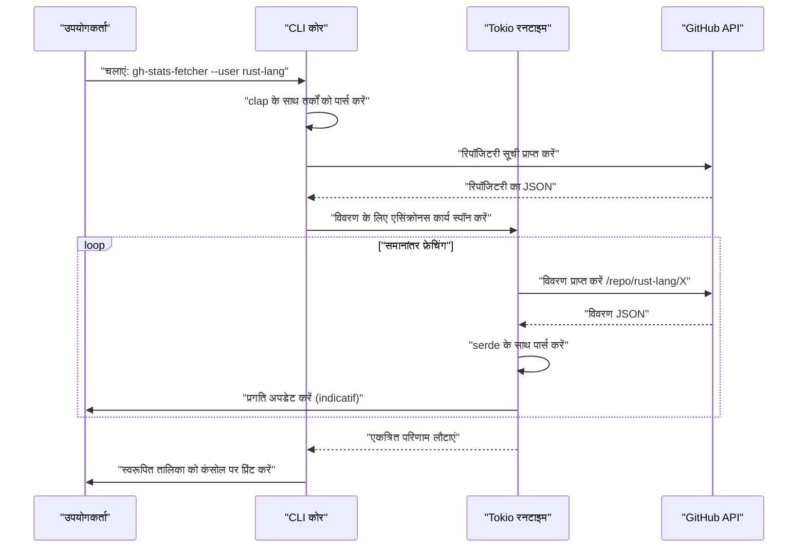
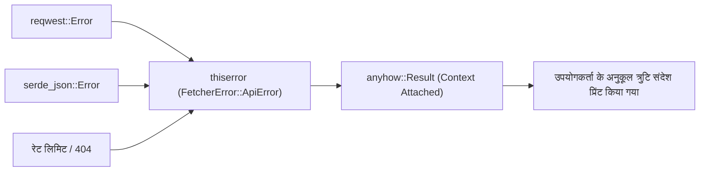

## 1. परिचय

आधुनिक सॉफ्टवेयर विकास में, CLI (कमांड लाइन इंटरफ़ेस) टूल डेवलपर्स की उत्पादकता बढ़ाने के लिए अपरिहार्य हैं। एक समय था जब शेल स्क्रिप्ट, Python, और Ruby मुख्य रूप से उपयोग किए जाते थे, लेकिन हाल के वर्षों में, **Rust** ने CLI टूल विकास के लिए एक वास्तविक मानक (de facto standard) के रूप में अपनी स्थिति मजबूत की है।

इस लेख में, हम आपको मूल बातों से लेकर उन्नत अवधारणाओं तक, Rust का उपयोग करके एक व्यावहारिक CLI टूल बनाने का तरीका सिखाएंगे, जो "बिजली की तेज़ी से काम करता है और बिजली की तेज़ी से विकसित किया जा सकता है"। हम न केवल एक काम करने वाली चीज़ बनाएंगे, बल्कि व्यावसायिक स्तर की मजबूत त्रुटि हैंडलिंग (error handling), एसिंक्रोनस प्रोसेसिंग का उपयोग करके तेज़ API अनुरोध, और उपयोगकर्ता अनुभव (UX) को बेहतर बनाने के लिए प्रोग्रेस बार लागू करने जैसे विषयों को भी व्यापक रूप से कवर करेंगे।

इस लेख को अंत तक पढ़ने पर, आप नीचे दिए गए उन्नत Rust तकनीकी स्टैक (tech stack) में महारत हासिल कर लेंगे, और अपने स्वयं के शक्तिशाली CLI टूल को दुनिया के सामने प्रकाशित करने में सक्षम होंगे।

---

## 2. CLI टूल विकास के लिए Rust को क्यों चुनें?

Rust को CLI विकास में अत्यधिक महत्व दिया जाता है, इसका कारण केवल यह नहीं है कि यह "ट्रेंडिंग" है। इसके स्पष्ट तकनीकी और आर्किटेक्चरल फायदे हैं।

### 2.1. सिंगल बाइनरी और क्रॉस-कंपाइल
जब आप Python या Node.js में लिखे गए टूल वितरित करते हैं, तो उपयोगकर्ता के परिवेश में रनटाइम (Python इंटरप्रेटर या Node.js) स्थापित होना आवश्यक है। इसके अलावा, अक्सर निर्भरता पैकेजों के संस्करणों में टकराव (तथाकथित "डिपेंडेंसी हेल") की समस्या होती है।
दूसरी ओर, Rust को पहले से ही नेटिव कोड में संकलित किया जाता है, इसलिए यह निर्भरता सहित एक **एकल निष्पादन योग्य बाइनरी (single executable binary)** उत्पन्न करता है। उपयोगकर्ता केवल बाइनरी को डाउनलोड करके और उसे रखकर टूल का उपयोग कर सकते हैं, जिससे अपनाने की बाधा काफी कम हो जाती है। इसके अलावा, क्रॉस-कंपाइल भी आसान है, जिससे आप एक ही CI वातावरण में Windows, macOS और Linux के लिए बाइनरी बना सकते हैं।

### 2.2. अत्यधिक निष्पादन गति और कम मेमोरी उपयोग
Rust में गार्बेज कलेक्टर (GC) नहीं होता है, और ज़ीरो-कॉस्ट एब्स्ट्रैक्शन (zero-cost abstraction) के कारण यह C/C++ के समान प्रदर्शन प्रदान करता है। CLI टूल्स के लिए, स्टार्टअप समय की कमी सीधे UX को प्रभावित करती है। JVM भाषाओं की तरह स्टार्टअप के समय कोई वार्म-अप समय नहीं होता है, और कमांड चलाते ही प्रसंस्करण (processing) शुरू हो जाता है, जो एक बड़ा फायदा है।

### 2.3. शक्तिशाली प्रकार प्रणाली (Type System) और ओनरशिप मॉडल के कारण सुरक्षा
Rust का सबसे बड़ा हथियार ओनरशिप (Ownership) मॉडल और शक्तिशाली प्रकार प्रणाली है, जो संकलन (compile) के समय मेमोरी लीक और डेटा रेस जैसे बग को खत्म कर देता है। "यदि यह संकलित होता है, तो यह लगभग निश्चित रूप से अपेक्षा के अनुरूप काम करेगा" का यह अनुभव डेवलपर्स को CLI टूल्स जैसे सिस्टम संसाधनों को सीधे छूने वाले अनुप्रयोगों को विकसित करने में बहुत मन की शांति देता है।

---

## 3. इस ट्यूटोरियल में उपयोग किए जाने वाले बेहतरीन क्रेट्स (Crates)

Rust इकोसिस्टम में कई बेहतरीन क्रेट (लाइब्रेरी) हैं जो CLI विकास का पुरजोर समर्थन करते हैं। इस ट्यूटोरियल में, हम निम्नलिखित क्रेट्स का उपयोग करेंगे जिन्हें आधुनिक Rust CLI विकास में "गोल्डन स्टैक" कहा जा सकता है।

1. **`clap`**: कमांड-लाइन तर्कों (arguments) को पार्स करने के लिए सबसे शक्तिशाली और लोकप्रिय क्रेट। संस्करण 4 के बाद से, Derive मैक्रोज़ का उपयोग करके वर्णनात्मक परिभाषाओं को और अधिक परिष्कृत किया गया है, और यह स्वचालित सहायता संदेशों (help messages) और इनपुट पूरा करने वाली स्क्रिप्ट (completion scripts) उत्पन्न करने का भी समर्थन करता है।
2. **`tokio`**: Rust का वास्तविक (de facto) एसिंक्रोनस रनटाइम मानक। यह मल्टी-थ्रेडेड एसिंक्रोनस I/O को अत्यंत कुशलतापूर्वक संभालता है।
3. **`reqwest`**: `tokio` के ऊपर काम करने वाला एक उच्च-स्तरीय HTTP क्लाइंट। यह उपयोग में आसान API प्रदान करता है और एसिंक्रोनस API अनुरोधों को लागू करना आसान बनाता है।
4. **`serde` & `serde_json`**: डेटा को सीरियलाइज़ और डीसीरियलाइज़ करने का फ्रेमवर्क। API की JSON प्रतिक्रिया को Rust के टाइप-सेफ स्ट्रक्चर (Type-safe structs) में मैप करने के लिए यह आवश्यक है।
5. **`indicatif`**: समृद्ध और अनुकूलन योग्य (customizable) प्रोग्रेस बार प्रदान करता है। एसिंक्रोनस प्रोसेसिंग की प्रगति को दृष्टिगत रूप से प्रदर्शित करता है, जिससे CLI के UX में नाटकीय रूप से सुधार होता है।
6. **`anyhow` & `thiserror`**: त्रुटि हैंडलिंग का शक्तिशाली संयोजन। लाइब्रेरी के भीतर डोमेन त्रुटियों को परिभाषित करने के लिए `thiserror` का उपयोग करना और एप्लिकेशन के शीर्ष स्तर पर त्रुटियों को एकत्र करने के लिए `anyhow` का उपयोग करना सबसे अच्छा अभ्यास है।

नीचे दिया गया चित्र एक आर्किटेक्चर आरेख है जो दिखाता है कि ये क्रेट्स एप्लिकेशन के भीतर कैसे मिलकर काम करते हैं।



---

## 4. एसिंक्रोनस प्रोसेसिंग और प्रदर्शन की गणितीय पृष्ठभूमि

इस ट्यूटोरियल में हम जो टूल विकसित करेंगे, वह एक साथ कई API एंडपॉइंट्स पर अनुरोध (requests) भेजेगा। आइए इसकी गणितीय पृष्ठभूमि को समझते हैं कि `tokio` जैसे एसिंक्रोनस रनटाइम का उपयोग करने से यह इतना तेज़ क्यों हो जाता है।

### 4.1. अमदाल का नियम (Amdahl's Law)
सिस्टम के एक हिस्से को समानांतर (parallel) या एसिंक्रोनस (asynchronous) बनाकर समग्र प्रदर्शन में सुधार की दर को अमदाल के नियम द्वारा निम्नलिखित तरीके से सूत्रबद्ध (formulated) किया गया है:

$$
S(N) = \frac{1}{(1 - P) + \frac{P}{N}}
$$

यहाँ,
- $S(N)$ सैद्धांतिक (theoretical) अधिकतम स्पीडअप दर है
- $P$ प्रोग्राम में उस हिस्से का अनुपात है जिसे समानांतर (एसिंक्रोनस) किया जा सकता है
- $N$ कार्यों (tasks) की समवर्तीता (concurrency) है जिसे एक साथ निष्पादित किया जा सकता है

API से डेटा प्राप्त करने वाले टूल्स के मामले में, अधिकांश निष्पादन समय नेटवर्क प्रतिक्रिया की प्रतीक्षा (I/O बाउंड) में व्यतीत होता है। इसलिए, $P$ का मान बहुत बड़ा (उदाहरण के लिए $0.95$ से अधिक) होगा। एक सिंक्रोनस (synchronous) प्रोग्राम में $N = 1$ होता है, लेकिन एसिंक्रोनस I/O का उपयोग करके, $N$ को हजारों तक बढ़ाया जा सकता है, और सिद्धांत रूप में $S(N)$ नाटकीय रूप से बढ़ जाता है।

### 4.2. लिटिल का नियम (Little's Law) और थ्रूपुट
नेटवर्क अनुरोधों को संसाधित (process) करते समय, सिस्टम में औसत एक साथ अनुरोधों की संख्या $L$, औसत थ्रूपुट $\lambda$ (प्रति इकाई समय में पूरे किए गए कार्यों की संख्या), और औसत प्रतिक्रिया समय $W$ के बीच निम्नलिखित संबंध होता है:

$$
L = \lambda W \implies \lambda = \frac{L}{W}
$$

दूसरे शब्दों में, ऐसे वातावरण में जहां नेटवर्क विलंब (network latency) $W$ अपरिहार्य है, सिस्टम के थ्रूपुट $\lambda$ को बेहतर बनाने का एकमात्र तरीका एक साथ संसाधित किए जाने वाले अनुरोधों की संख्या $L$ को बढ़ाना है। Rust के एसिंक्रोनस कार्य OS के नेटिव थ्रेड्स से भिन्न होते हैं, और चूंकि मेमोरी ओवरहेड बहुत छोटा होता है, इसलिए $L$ को आसानी से बढ़ाया जा सकता है।

---

## 5. विकसित किए जाने वाले टूल का डिज़ाइन: GitHub रिपॉजिटरी बैच फ़ेचर

इस बार एक व्यावहारिक उदाहरण के रूप में, हम एक टूल **`gh-stats-fetcher`** विकसित करेंगे, जो किसी निर्दिष्ट GitHub उपयोगकर्ता या संगठन (Organization) के सार्वजनिक रिपॉजिटरी की सूची प्राप्त करता है, और प्रत्येक के लिए स्टार्स की संख्या, फोर्क्स की संख्या और प्रोग्रामिंग भाषा जैसे सांख्यिकीय डेटा को समानांतर में फ़ेच करता है, और इसे टर्मिनल पर स्वरूपित (formatted) करके प्रदर्शित करता है।

### टूल का निष्पादन क्रम



---

## 6. प्रोजेक्ट आरंभीकरण और निर्भरता (Dependencies) सेटअप

सबसे पहले, हम Cargo का उपयोग करके एक नया प्रोजेक्ट बनाएंगे।

```bash
cargo new gh-stats-fetcher
cd gh-stats-fetcher
```

इसके बाद, आवश्यक निर्भरताओं को `Cargo.toml` में जोड़ें।

```toml
[package]
name = "gh-stats-fetcher"
version = "0.1.0"
edition = "2021"
authors = ["Your Name <your.email@example.com>"]
description = "A blazing fast CLI tool to fetch GitHub repository stats."

[dependencies]
clap = { version = "4.4", features = ["derive"] }
tokio = { version = "1.34", features = ["full"] }
reqwest = { version = "0.11", features = ["json", "rustls-tls"], default-features = false }
serde = { version = "1.0", features = ["derive"] }
serde_json = "1.0"
indicatif = "0.17"
anyhow = "1.0"
thiserror = "1.0"
```

> **महत्वपूर्ण बिंदु**: हम `reqwest` में डिफ़ॉल्ट TLS बैकएंड के बजाय `rustls-tls` का उपयोग कर रहे हैं। इससे OpenSSL जैसी सिस्टम-निर्भर लाइब्रेरी की आवश्यकता समाप्त हो जाती है, जिससे पूर्णतः स्थिर रूप से जुड़े (statically linked) सिंगल बाइनरी को बनाना आसान हो जाता है।

---

## 7. कार्यान्वयन चरण 1: त्रुटि हैंडलिंग का आधार बनाना

एक मजबूत CLI टूल बनाने के लिए त्रुटि हैंडलिंग का डिज़ाइन महत्वपूर्ण है। यहाँ हम अभ्यास करेंगे कि `thiserror` और `anyhow` का उचित उपयोग कैसे करें।

डोमेन-विशिष्ट त्रुटियों को `src/error.rs` में परिभाषित किया गया है।

```rust
// src/error.rs
use thiserror::Error;

#[derive(Error, Debug)]
pub enum FetcherError {
    #[error("API Request failed: {0}")]
    ApiError(#[from] reqwest::Error),
    
    #[error("Failed to parse JSON: {0}")]
    ParseError(#[from] serde_json::Error),
    
    #[error("GitHub API Rate limit exceeded. Try again later.")]
    RateLimitExceeded,
    
    #[error("Target user or organization '{0}' not found.")]
    NotFound(String),
}
```



---

## 8. कार्यान्वयन चरण 2: clap द्वारा तर्क पार्सिंग

इसके बाद, हम CLI के तर्कों को परिभाषित करेंगे। `src/cli.rs` बनाएं, और `clap` के Derive मैक्रो का उपयोग करें।

```rust
// src/cli.rs
use clap::{Parser, Subcommand};

#[derive(Parser, Debug)]
#[command(name = "gh-stats-fetcher")]
#[command(author, version, about, long_about = None)]
pub struct Cli {
    #[command(subcommand)]
    pub command: Commands,
}

#[derive(Subcommand, Debug)]
pub enum Commands {
    /// Fetch stats for a specific user
    Fetch {
        /// The GitHub username or organization name
        #[arg(short, long)]
        user: String,
        
        /// Number of concurrent requests
        #[arg(short, long, default_value_t = 10)]
        concurrency: usize,
    },
}
```

यह स्वचालित रूप से एक सुंदर सहायता संदेश उत्पन्न करेगा, जैसा कि नीचे दिखाया गया है।

```text
$ gh-stats-fetcher --help
A blazing fast CLI tool to fetch GitHub repository stats.

Usage: gh-stats-fetcher <COMMAND>

Commands:
  fetch  Fetch stats for a specific user
  help   Print this message or the help of the given subcommand(s)
```

---

## 9. कार्यान्वयन चरण 3: API क्लाइंट और डेटा मैपिंग

GitHub API द्वारा लौटाए गए JSON डेटा को Rust के स्ट्रक्चर में मैप करें। `src/models.rs` और `src/api.rs` को लागू करें।

```rust
// src/models.rs
use serde::{Deserialize, Serialize};

#[derive(Debug, Deserialize, Serialize)]
pub struct Repository {
    pub name: String,
    pub html_url: String,
    pub stargazers_count: u32,
    pub forks_count: u32,
    pub language: Option<String>,
}
```

```rust
// src/api.rs
use crate::models::Repository;
use crate::error::FetcherError;
use reqwest::Client;

pub struct GitHubClient {
    client: Client,
}

impl GitHubClient {
    pub fn new() -> Result<Self, FetcherError> {
        let client = Client::builder()
            .user_agent("gh-stats-fetcher/0.1.0")
            .build()?;
        Ok(Self { client })
    }

    pub async fn fetch_repos(&self, user: &str) -> Result<Vec<Repository>, FetcherError> {
        let url = format!("https://api.github.com/users/{}/repos?per_page=100", user);
        let res = self.client.get(&url).send().await?;

        if res.status() == 404 {
            return Err(FetcherError::NotFound(user.to_string()));
        } else if res.status() == 403 {
            return Err(FetcherError::RateLimitExceeded);
        }

        let repos = res.json::<Vec<Repository>>().await?;
        Ok(repos)
    }
}
```

---

## 10. कार्यान्वयन चरण 4: tokio और indicatif के साथ समानांतर प्रसंस्करण और प्रोग्रेस बार

यह इस टूल का मुख्य आकर्षण है। हम प्राप्त रिपॉजिटरी सूची पर समानांतर प्रसंस्करण (concurrent processing) लागू करेंगे और एक सुंदर प्रोग्रेस बार प्रदर्शित करेंगे।

```rust
// src/main.rs
mod cli;
mod error;
mod models;
mod api;

use clap::Parser;
use cli::{Cli, Commands};
use api::GitHubClient;
use anyhow::{Context, Result};
use indicatif::{ProgressBar, ProgressStyle};
use std::sync::Arc;
use tokio::sync::Semaphore;

#[tokio::main]
async fn main() -> Result<()> {
    let cli = Cli::parse();

    match cli.command {
        Commands::Fetch { user, concurrency } => {
            println!("Fetching repositories for {}...", user);
            
            let client = Arc::new(GitHubClient::new().context("Failed to initialize API client")?);
            let repos = client.fetch_repos(&user).await.context("Failed to fetch repository list")?;
            
            println!("Found {} repositories. Analyzing...", repos.len());

            let pb = ProgressBar::new(repos.len() as u64);
            pb.set_style(ProgressStyle::default_bar()
                .template("{spinner:.green} [{elapsed_precise}] [{wide_bar:.cyan/blue}] {pos}/{len} ({eta})")
                .unwrap()
                .progress_chars("#>-"));

            // समानांतरता (concurrency) को सीमित करने के लिए सेमाफोर
            let semaphore = Arc::new(Semaphore::new(concurrency));
            let mut tasks = vec![];

            for repo in repos {
                let permit = semaphore.clone().acquire_owned().await.unwrap();
                let pb_clone = pb.clone();
                // एक वास्तविक ऐप में आप यहां विस्तृत API हिट करने जैसे भारी प्रसंस्करण करेंगे
                // इस बार एक डेमो के रूप में, हम एसिंक्रोनस स्लीप शामिल करेंगे
                tasks.push(tokio::spawn(async move {
                    tokio::time::sleep(std::time::Duration::from_millis(100)).await;
                    pb_clone.inc(1);
                    drop(permit);
                    repo
                }));
            }

            let mut results = vec![];
            for task in tasks {
                results.push(task.await.context("Task panicked")?);
            }

            pb.finish_with_message("Done!");

            // स्टार की संख्या के अनुसार क्रमित करें और शीर्ष 5 प्रदर्शित करें
            results.sort_by(|a, b| b.stargazers_count.cmp(&a.stargazers_count));
            println!("\nTop 5 Repositories:");
            for (i, repo) in results.iter().take(5).enumerate() {
                let lang = repo.language.as_deref().unwrap_or("Unknown");
                println!("{}. {} (⭐ {} | 🍴 {} | 💻 {})", 
                    i + 1, repo.name, repo.stargazers_count, repo.forks_count, lang);
            }
        }
    }

    Ok(())
}
```

इस कोड में, हम कार्यों को बैकग्राउंड वर्कर्स को भेजने के लिए `tokio::spawn` का उपयोग करते हैं, जबकि एक ही समय में निष्पादित होने वाले API अनुरोधों की संख्या को सीमित करने के लिए `tokio::sync::Semaphore` का उपयोग करते हैं (डिफ़ॉल्ट 10 समवर्ती)। यह API रेट लिमिट तक पहुंचने के जोखिम को कम करते हुए सिंक्रोनस प्रसंस्करण (synchronous processing) की तुलना में अत्यधिक गति प्राप्त करता है।

---

## 11. उन्नत विषय: परीक्षण और अनुकूलन

### 11.1. CLI टूल का इंटीग्रेशन परीक्षण

स्वयं CLI टूल के व्यवहार का परीक्षण करने के लिए, `assert_cmd` क्रेट अत्यंत उपयोगी है। `tests/cli_test.rs` बनाएं, वास्तविक बाइनरी को कॉल करें और मानक आउटपुट को सत्यापित करें।

```rust
// tests/cli_test.rs
use assert_cmd::Command;
use predicates::prelude::*;

#[test]
fn test_help_message() {
    let mut cmd = Command::cargo_bin("gh-stats-fetcher").unwrap();
    cmd.arg("--help")
        .assert()
        .success()
        .stdout(predicate::str::contains("Usage: gh-stats-fetcher"));
}
```

### 11.2. रिलीज़ बिल्ड का अत्यधिक अनुकूलन

हालाँकि डिफ़ॉल्ट रिलीज़ बिल्ड काफी तेज़ है, लेकिन हम बाइनरी के आकार को कम करने और निष्पादन गति को अधिकतम करने के लिए `Cargo.toml` में `[profile.release]` सेट कर सकते हैं।

```toml
[profile.release]
opt-level = 3       # उच्चतम स्तर का अनुकूलन
lto = true          # लिंक टाइम ऑप्टिमाइज़ेशन (Link Time Optimization) सक्षम करें
codegen-units = 1   # अनुकूलन को अधिकतम करने के लिए संकलन इकाइयों को 1 पर सेट करें (निर्माण समय लंबा होगा)
panic = "abort"     # पैनिक होने पर स्टैक ट्रेस को अनवाइंड किए बिना तुरंत निरस्त (abort) करें (आकार कम करता है)
strip = true        # बाइनरी के आकार को नाटकीय रूप से कम करने के लिए सिंबल जानकारी को हटा दें
```

इन सेटिंग्स को लागू करने से उत्पन्न बाइनरी का आकार कई मेगाबाइट तक कम हो जाएगा, जिससे इसे उपयोगकर्ताओं को वितरित करना और भी आसान हो जाएगा।

---

## 12. CI/CD और वितरण (Publishing)

आपके द्वारा बनाए गए टूल को दुनिया भर में वितरित करने के चरण।

### crates.io पर प्रकाशित करना

Rust के पैकेज मैनेजर Cargo का उपयोग करके, आप इसे केवल कुछ कमांड के साथ आधिकारिक रजिस्ट्री में प्रकाशित कर सकते हैं।

```bash
cargo login <YOUR_TOKEN>
cargo publish
```
प्रकाशन के बाद, दुनिया भर के उपयोगकर्ता केवल एक कमांड `cargo install gh-stats-fetcher` के साथ आपके टूल को स्थापित करने में सक्षम होंगे।

### GitHub Actions द्वारा स्वचालित रिलीज़

एक CI/CD पाइपलाइन बनाएं जो क्रॉस-कंपाइल की गई बाइनरी को स्वचालित रूप से GitHub रिलीज़ पर अपलोड करती है। `.github/workflows/release.yml` में निम्नलिखित कॉन्फ़िगरेशन जोड़ें। इसके साथ, केवल एक टैग को पुश करने से Linux, macOS, और Windows के लिए बाइनरी स्वचालित रूप से बन जाएगी और इसे रिलीज़ एसेट के रूप में संलग्न किया जाएगा (स्थान की कमी के कारण विस्तृत YAML विवरण यहाँ छोड़ दिया गया है, लेकिन वर्तमान में `taiki-e/upload-rust-binary-action` जैसे एक्शन का उपयोग करना सबसे अच्छा अभ्यास है)।

---

## 13. निष्कर्ष

इस लेख में, हमने Rust का उपयोग करके CLI टूल विकसित करने के पूरे प्रवाह को विस्तार से समझाया है।

1. **डिज़ाइन नीति**: हमने Rust की सुरक्षा, गति, और सिंगल बाइनरी के लाभों की पुष्टि की।
2. **क्रेट्स का चयन**: हमें `clap`, `tokio`, `serde`, `indicatif`, `thiserror`, और `anyhow` जैसे शक्तिशाली हथियार मिले हैं।
3. **समानांतर प्रसंस्करण का गणितीय लाभ**: अमदाल के नियम (Amdahl's law) और लिटिल के नियम (Little's law) के आधार पर, हमने सैद्धांतिक रूप से एसिंक्रोनस प्रसंस्करण की शक्ति को समझा।
4. **कार्यान्वयन और अनुकूलन**: मजबूत त्रुटि हैंडलिंग से लेकर अत्यधिक बाइनरी अनुकूलन तक, हमने बहुत सारी व्यावहारिक जानकारी शामिल की है।

Rust के साथ CLI विकास एक शानदार अनुभव है जहाँ आप संकलक के साथ बातचीत के माध्यम से डिज़ाइन चरण से ही सॉफ़्टवेयर की गुणवत्ता सुनिश्चित कर सकते हैं। इस लेख में बनाए गए बेस कोड के आधार पर, कृपया अपना खुद का मूल CLI टूल विकसित करें और इसे दुनिया के साथ साझा करें! हैप्पी रस्ट कोडिंग!
