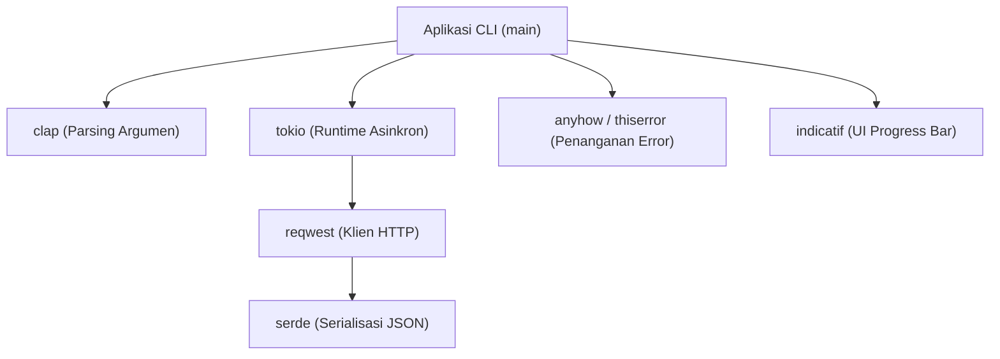
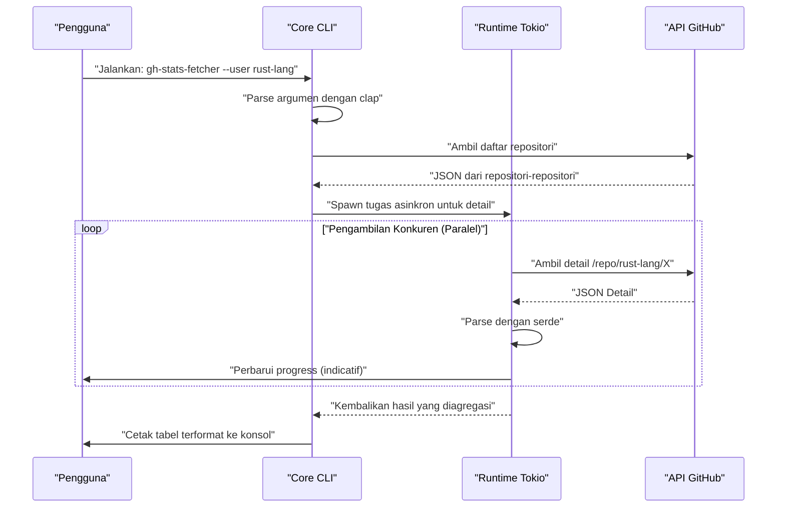
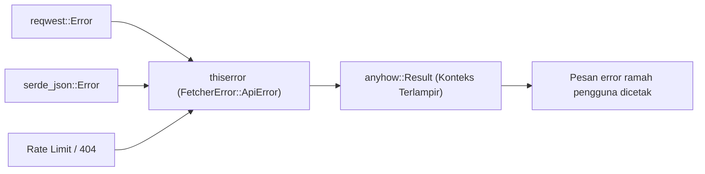

## 1. Pendahuluan

Dalam pengembangan perangkat lunak modern, tool CLI (Command Line Interface) adalah entitas yang tak tergantikan yang secara dramatis meningkatkan produktivitas pengembang. Dulu, shell script, Python, Ruby, dll. adalah arus utama, tetapi dalam beberapa tahun terakhir, **Rust** telah menetapkan posisi yang kuat sebagai standar de facto untuk pengembangan tool CLI.

Artikel ini akan secara menyeluruh menjelaskan cara membangun tool CLI praktis yang "berjalan super cepat dan dapat dikembangkan secara super cepat" menggunakan Rust, dari dasar hingga aplikasi tingkat lanjut. Kita tidak hanya akan membuat sesuatu yang berfungsi, tetapi mencakup secara komprehensif mulai dari penanganan error yang kuat (robust) yang dapat digunakan di level komersial, permintaan API (API request) berkecepatan tinggi menggunakan pemrosesan asinkron (asynchronous), hingga implementasi progress bar yang meningkatkan pengalaman pengguna (UX).

Dengan membaca artikel ini sampai akhir, Anda akan menguasai tumpukan teknologi Rust tingkat lanjut berikut dan dapat mempublikasikan tool CLI kuat Anda sendiri ke dunia.

---

## 2. Mengapa Memilih Rust untuk Pengembangan Tool CLI?

Alasan mengapa Rust sangat dihargai dalam pengembangan CLI bukan sekadar "karena sedang tren". Terdapat keunggulan arsitektural dan teknis yang jelas di sana.

### 2.1. Single Binary dan Cross-compilation
Saat mendistribusikan tool yang ditulis dengan Python atau Node.js, lingkungan pengguna perlu memiliki runtime (interpreter Python atau Node.js) yang terinstal. Selain itu, tidak jarang kita diganggu oleh konflik versi paket dependensi (yang disebut "dependency hell").
Di sisi lain, karena Rust dikompilasi ke kode native sebelumnya, ia menghasilkan **binary (file biner) yang dapat dieksekusi tunggal** yang mencakup dependensinya. Pengguna dapat menggunakan tool hanya dengan mengunduh dan menempatkan binary-nya, membuat hambatan adopsi menjadi sangat rendah. Cross-compilation juga mudah, dan dimungkinkan untuk mem-build binary untuk Windows, macOS, dan Linux dalam satu lingkungan CI tunggal.

### 2.2. Kecepatan Eksekusi yang Mengagumkan dan Hemat Memori
Rust tidak memiliki garbage collector (GC) dan memberikan kinerja yang setara dengan C/C++ melalui zero-cost abstraction. Untuk tool CLI, waktu startup yang singkat secara langsung terkait dengan UX. Tidak adanya waktu pemanasan (warm-up time) saat startup seperti pada bahasa JVM, dan pemrosesan yang dimulai saat perintah dipanggil adalah keuntungan besar.

### 2.3. Keamanan melalui Sistem Tipe (Type System) yang Kuat dan Model Kepemilikan (Ownership)
Dengan model kepemilikan (Ownership) dan sistem tipe yang kuat yang merupakan senjata terbesar Rust, bug seperti kebocoran memori (memory leak) dan data race dihilangkan pada saat kompilasi (compile time). Pengalaman "jika lolos kompilasi, hampir pasti akan berjalan seperti yang diharapkan" membawa rasa aman yang luar biasa bagi pengembang dalam mengembangkan aplikasi yang menyentuh sumber daya sistem secara langsung seperti tool CLI.

---

## 3. Kumpulan Crate Terbaik yang Diadopsi dalam Tutorial Ini

Ekosistem Rust memiliki banyak crate (library) unggulan yang sangat mendukung pengembangan CLI. Dalam tutorial ini, kita akan menggunakan crate berikut yang dapat disebut sebagai "Golden Stack" dalam pengembangan Rust CLI modern.

1. **`clap`**: Crate paling kuat dan populer untuk mengurai (parsing) argumen baris perintah (command line). Sejak versi 4, definisi deklaratif menggunakan makro Derive menjadi lebih elegan, dan juga mendukung pembuatan otomatis pesan bantuan (help message) serta skrip penyelesaian input (input completion script).
2. **`tokio`**: Standar de facto untuk runtime asinkron (asynchronous runtime) Rust. Menangani I/O asinkron secara multi-thread dengan sangat efisien.
3. **`reqwest`**: Klien HTTP berfitur tinggi yang berjalan di atas `tokio`. Memiliki API yang mudah digunakan dan memungkinkan implementasi permintaan API asinkron dengan mudah.
4. **`serde` & `serde_json`**: Framework untuk melakukan serialisasi dan deserialisasi data. Sangat penting untuk memetakan respons JSON dari API ke dalam struct di Rust yang aman dari segi tipe.
5. **`indicatif`**: Menyediakan progress bar yang kaya (rich) dan dapat disesuaikan. Menampilkan kemajuan pemrosesan asinkron secara visual dan secara dramatis meningkatkan UX dari CLI.
6. **`anyhow` & `thiserror`**: Kombinasi kuat untuk penanganan error (error handling). Praktik terbaik adalah menggunakan `thiserror` untuk definisi error domain di dalam library, dan `anyhow` untuk agregasi error di lapisan teratas (top-level) aplikasi.

Diagram berikut menunjukkan arsitektur bagaimana crate ini bekerja sama di dalam aplikasi.



---

## 4. Latar Belakang Matematis untuk Pemrosesan Asinkron dan Performa

Tool yang akan kita kembangkan dalam tutorial ini mengirimkan permintaan (request) ke beberapa endpoint API secara paralel. Mari kita tinjau latar belakang matematis mengapa menggunakan runtime asinkron seperti `tokio` dapat mempercepat secara dramatis.

### 4.1. Hukum Amdahl (Amdahl's Law)
Tingkat peningkatan performa secara keseluruhan dengan memparalelkan atau membuat asinkron sebagian dari sistem dirumuskan oleh Hukum Amdahl sebagai berikut.

$$
S(N) = \frac{1}{(1 - P) + \frac{P}{N}}
$$

Di mana,
- $S(N)$ adalah tingkat percepatan teoritis maksimum
- $P$ adalah proporsi bagian yang dapat diparalelkan (dibuat asinkron) dalam program
- $N$ adalah tingkat paralelisme tugas yang dapat dieksekusi secara bersamaan

Untuk tool yang mengambil (fetch) data dari API, sebagian besar waktu eksekusi adalah menunggu respons jaringan (I/O-bound). Oleh karena itu, nilai $P$ akan sangat besar (misalnya $0.95$ atau lebih). Pada program sinkron $N = 1$, tetapi dengan menggunakan I/O asinkron, $N$ dapat ditingkatkan hingga skala ribuan, dan secara teoritis $S(N)$ akan meningkat secara dramatis.

### 4.2. Hukum Little (Little's Law) dan Throughput
Saat memproses permintaan jaringan, terdapat hubungan berikut antara rata-rata jumlah permintaan simultan (bersamaan) $L$ dalam sistem, rata-rata throughput $\lambda$ (jumlah pemrosesan selesai per satuan waktu), dan rata-rata waktu respons $W$.

$$
L = \lambda W \implies \lambda = \frac{L}{W}
$$

Artinya, dalam lingkungan di mana latensi jaringan $W$ tidak dapat dihindari, untuk meningkatkan throughput sistem $\lambda$, satu-satunya cara adalah meningkatkan jumlah permintaan $L$ yang diproses secara bersamaan. Tugas (task) asinkron Rust berbeda dengan thread native dari OS karena overhead memori yang sangat kecil, sehingga $L$ dapat diukur (scale) dengan mudah.

---

## 5. Desain Tool yang Akan Dikembangkan: Pengambil Masal Repositori GitHub

Sebagai contoh praktis kali ini, kita akan mengembangkan tool **`gh-stats-fetcher`** yang mengambil daftar repositori publik dari pengguna atau organisasi (Organization) GitHub yang ditentukan, secara paralel mengambil (fetch) informasi statistik seperti jumlah bintang (star), jumlah fork, dan bahasa masing-masing repositori, lalu memformat dan menampilkannya di terminal.

### Urutan Eksekusi Tool (Execution Sequence)



---

## 6. Inisialisasi Proyek dan Pengaturan Dependensi

Pertama-tama, kita akan membuat proyek baru menggunakan Cargo.

```bash
cargo new gh-stats-fetcher
cd gh-stats-fetcher
```

Selanjutnya, tambahkan dependensi yang diperlukan ke dalam `Cargo.toml`.

```toml
[package]
name = "gh-stats-fetcher"
version = "0.1.0"
edition = "2021"
authors = ["Nama Anda <email.anda@example.com>"]
description = "A blazing fast CLI tool to fetch GitHub repository stats."

[dependencies]
clap = { version = "4.4", features = ["derive"] }
tokio = { version = "1.34", features = ["full"] }
reqwest = { version = "0.11", features = ["json", "rustls-tls"], default-features = false }
serde = { version = "1.0", features = ["derive"] }
serde_json = "1.0"
indicatif = "0.17"
anyhow = "1.0"
thiserror = "1.0"
```

> **Poin**: Pada `reqwest`, kita menggunakan `rustls-tls` sebagai pengganti backend TLS bawaan (default). Ini meniadakan kebutuhan akan library yang bergantung pada sistem seperti OpenSSL, membuatnya lebih mudah untuk mem-build binary tunggal dengan static linking (tautan statis) secara penuh.

---

## 7. Fase Implementasi 1: Membangun Dasar Penanganan Error

Untuk membuat tool CLI yang tangguh, desain penanganan error sangatlah penting. Di sini, kita akan mempraktikkan cara membedakan penggunaan `thiserror` dan `anyhow`.

Error spesifik domain didefinisikan di `src/error.rs`.

```rust
// src/error.rs
use thiserror::Error;

#[derive(Error, Debug)]
pub enum FetcherError {
    #[error("API Request failed: {0}")]
    ApiError(#[from] reqwest::Error),
    
    #[error("Failed to parse JSON: {0}")]
    ParseError(#[from] serde_json::Error),
    
    #[error("GitHub API Rate limit exceeded. Try again later.")]
    RateLimitExceeded,
    
    #[error("Target user or organization '{0}' not found.")]
    NotFound(String),
}
```



---

## 8. Fase Implementasi 2: Parsing Argumen dengan clap

Selanjutnya, kita definisikan argumen CLI. Buat `src/cli.rs`, dan gunakan makro Derive dari `clap`.

```rust
// src/cli.rs
use clap::{Parser, Subcommand};

#[derive(Parser, Debug)]
#[command(name = "gh-stats-fetcher")]
#[command(author, version, about, long_about = None)]
pub struct Cli {
    #[command(subcommand)]
    pub command: Commands,
}

#[derive(Subcommand, Debug)]
pub enum Commands {
    /// Fetch stats for a specific user
    Fetch {
        /// The GitHub username or organization name
        #[arg(short, long)]
        user: String,
        
        /// Number of concurrent requests
        #[arg(short, long, default_value_t = 10)]
        concurrency: usize,
    },
}
```

Dengan ini, pesan bantuan yang indah akan dihasilkan secara otomatis seperti di bawah ini.

```text
$ gh-stats-fetcher --help
A blazing fast CLI tool to fetch GitHub repository stats.

Usage: gh-stats-fetcher <COMMAND>

Commands:
  fetch  Fetch stats for a specific user
  help   Print this message or the help of the given subcommand(s)
```

---

## 9. Fase Implementasi 3: Klien API dan Pemetaan Data

Kita akan memetakan (mapping) data JSON yang dikembalikan dari API GitHub ke dalam struct Rust. Kita implementasikan `src/models.rs` dan `src/api.rs`.

```rust
// src/models.rs
use serde::{Deserialize, Serialize};

#[derive(Debug, Deserialize, Serialize)]
pub struct Repository {
    pub name: String,
    pub html_url: String,
    pub stargazers_count: u32,
    pub forks_count: u32,
    pub language: Option<String>,
}
```

```rust
// src/api.rs
use crate::models::Repository;
use crate::error::FetcherError;
use reqwest::Client;

pub struct GitHubClient {
    client: Client,
}

impl GitHubClient {
    pub fn new() -> Result<Self, FetcherError> {
        let client = Client::builder()
            .user_agent("gh-stats-fetcher/0.1.0")
            .build()?;
        Ok(Self { client })
    }

    pub async fn fetch_repos(&self, user: &str) -> Result<Vec<Repository>, FetcherError> {
        let url = format!("https://api.github.com/users/{}/repos?per_page=100", user);
        let res = self.client.get(&url).send().await?;

        if res.status() == 404 {
            return Err(FetcherError::NotFound(user.to_string()));
        } else if res.status() == 403 {
            return Err(FetcherError::RateLimitExceeded);
        }

        let repos = res.json::<Vec<Repository>>().await?;
        Ok(repos)
    }
}
```

---

## 10. Fase Implementasi 4: Pemrosesan Paralel dan Progress Bar dengan tokio dan indicatif

Ini adalah sorotan utama dari tool ini. Kita akan melakukan pemrosesan paralel pada daftar repositori yang diambil, dan menampilkan progress bar yang indah.

```rust
// src/main.rs
mod cli;
mod error;
mod models;
mod api;

use clap::Parser;
use cli::{Cli, Commands};
use api::GitHubClient;
use anyhow::{Context, Result};
use indicatif::{ProgressBar, ProgressStyle};
use std::sync::Arc;
use tokio::sync::Semaphore;

#[tokio::main]
async fn main() -> Result<()> {
    let cli = Cli::parse();

    match cli.command {
        Commands::Fetch { user, concurrency } => {
            println!("Fetching repositories for {}...", user);
            
            let client = Arc::new(GitHubClient::new().context("Failed to initialize API client")?);
            let repos = client.fetch_repos(&user).await.context("Failed to fetch repository list")?;
            
            println!("Found {} repositories. Analyzing...", repos.len());

            let pb = ProgressBar::new(repos.len() as u64);
            pb.set_style(ProgressStyle::default_bar()
                .template("{spinner:.green} [{elapsed_precise}] [{wide_bar:.cyan/blue}] {pos}/{len} ({eta})")
                .unwrap()
                .progress_chars("#>-"));

            // Semaphore untuk membatasi jumlah konkurensi (paralelisme)
            let semaphore = Arc::new(Semaphore::new(concurrency));
            let mut tasks = vec![];

            for repo in repos {
                let permit = semaphore.clone().acquire_owned().await.unwrap();
                let pb_clone = pb.clone();
                // Dalam aplikasi sebenarnya, di sini kita memanggil API detail atau proses berat lainnya
                // Untuk demo kali ini, kita akan menyisipkan sleep asinkron
                tasks.push(tokio::spawn(async move {
                    tokio::time::sleep(std::time::Duration::from_millis(100)).await;
                    pb_clone.inc(1);
                    drop(permit);
                    repo
                }));
            }

            let mut results = vec![];
            for task in tasks {
                results.push(task.await.context("Task panicked")?);
            }

            pb.finish_with_message("Done!");

            // Urutkan berdasarkan jumlah bintang (star) dan tampilkan 5 teratas
            results.sort_by(|a, b| b.stargazers_count.cmp(&a.stargazers_count));
            println!("\nTop 5 Repositories:");
            for (i, repo) in results.iter().take(5).enumerate() {
                let lang = repo.language.as_deref().unwrap_or("Unknown");
                println!("{}. {} (⭐ {} | 🍴 {} | 💻 {})", 
                    i + 1, repo.name, repo.stargazers_count, repo.forks_count, lang);
            }
        }
    }

    Ok(())
}
```

Dalam kode ini, kita menggunakan `tokio::spawn` untuk mengirim tugas (task) ke pekerja latar belakang (background worker), dan secara bersamaan menggunakan `tokio::sync::Semaphore` untuk membatasi jumlah permintaan API yang dieksekusi bersamaan (default 10 paralel). Dengan ini, kita mengurangi risiko terkena batas tingkat API (API rate limit) sekaligus mencapai kecepatan yang jauh lebih tinggi daripada pemrosesan sinkron (synchronous).

---

## 11. Topik Lanjutan: Pengujian dan Optimasi

### 11.1. Pengujian Integrasi untuk Tool CLI
Untuk menguji perilaku tool CLI itu sendiri, crate `assert_cmd` sangatlah praktis. Buat `tests/cli_test.rs`, panggil file binary yang sebenarnya, dan verifikasi standar output-nya (standard output).

```rust
// tests/cli_test.rs
use assert_cmd::Command;
use predicates::prelude::*;

#[test]
fn test_help_message() {
    let mut cmd = Command::cargo_bin("gh-stats-fetcher").unwrap();
    cmd.arg("--help")
        .assert()
        .success()
        .stdout(predicate::str::contains("Usage: gh-stats-fetcher"));
}
```

### 11.2. Optimasi Ekstrem untuk Build Rilis
Meskipun build rilis (release build) bawaan sudah cukup cepat, kita akan mengatur `[profile.release]` di `Cargo.toml` untuk mengurangi ukuran binary dan memaksimalkan kecepatan eksekusi.

```toml
[profile.release]
opt-level = 3       # Tingkat optimasi tertinggi
lto = true          # Aktifkan Link Time Optimization (Optimasi Waktu Taut)
codegen-units = 1   # Maksimalkan optimasi dengan mengatur unit kompilasi menjadi 1 (waktu build menjadi lebih lama)
panic = "abort"     # Segera batalkan (abort) tanpa unwinding stack trace saat terjadi panic (mengurangi ukuran)
strip = true        # Secara dramatis mengurangi ukuran binary dengan menghapus informasi simbol (symbol info)
```

Dengan menerapkan pengaturan ini, ukuran binary yang dihasilkan akan berkurang beberapa MB, membuatnya semakin mudah untuk didistribusikan kepada pengguna.

---

## 12. CI/CD dan Distribusi (Publishing)

Ini adalah langkah-langkah untuk mendistribusikan tool yang telah Anda buat ke seluruh dunia.

### Publikasi ke crates.io
Dengan menggunakan Cargo, manajer paket Rust, Anda dapat mempublikasikannya ke registry resmi hanya dengan beberapa perintah.

```bash
cargo login <YOUR_TOKEN>
cargo publish
```
Setelah dipublikasikan, pengguna di seluruh dunia akan dapat menginstal tool Anda dengan satu perintah sederhana `cargo install gh-stats-fetcher`.

### Rilis Otomatis menggunakan GitHub Actions
Kita akan membangun pipeline CI/CD yang mengunggah (upload) binary hasil cross-compile secara otomatis ke GitHub Releases. Tulis konfigurasi berikut di `.github/workflows/release.yml`. Dengan ini, hanya dengan mem-push tag, binary untuk Linux, macOS, dan Windows akan secara otomatis di-build dan dilampirkan sebagai aset rilis (karena keterbatasan ruang, penulisan YAML secara detail akan dilewati di sini, namun memanfaatkan Action seperti `taiki-e/upload-rust-binary-action` adalah praktik terbaik saat ini).

---

## 13. Kesimpulan

Dalam artikel ini, kita telah menjelaskan secara rinci alur pengembangan tool CLI menggunakan Rust.

1. **Kebijakan Desain**: Mengonfirmasi keunggulan kecepatan dan keamanan Rust, serta keuntungan dari single binary.
2. **Pemilihan Crate**: Memperoleh senjata kuat bernama `clap`, `tokio`, `serde`, `indicatif`, `thiserror`, dan `anyhow`.
3. **Keunggulan Matematis Pemrosesan Paralel**: Memahami kehebatan pemrosesan asinkron secara teoritis berdasarkan Hukum Amdahl dan Hukum Little.
4. **Implementasi dan Optimasi**: Mengemas pengetahuan (know-how) praktis, dari penanganan error yang kuat hingga optimasi binary yang ekstrem.

Pengembangan CLI dengan Rust adalah pengalaman luar biasa yang memungkinkan Anda memastikan kualitas perangkat lunak sejak tahap desain melalui dialog dengan compiler (kompiler). Berdasarkan kode dasar yang dibuat kali ini, silakan coba kembangkan tool CLI orisinal Anda sendiri dan publikasikan ke dunia! Selamat Coding Rust!
