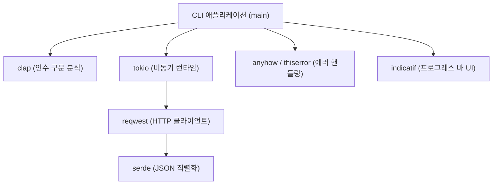
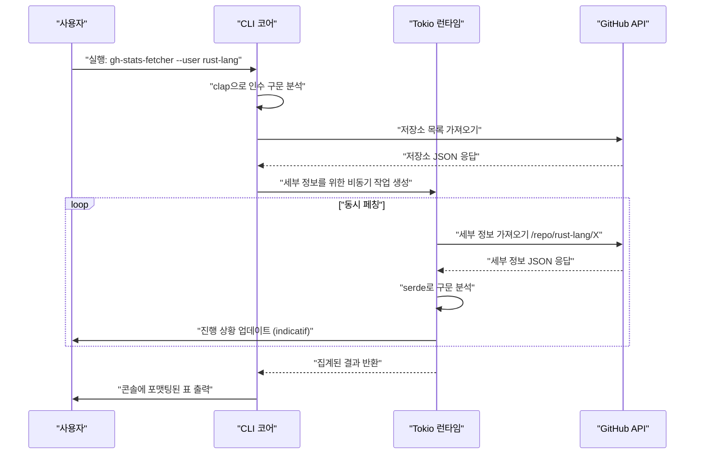
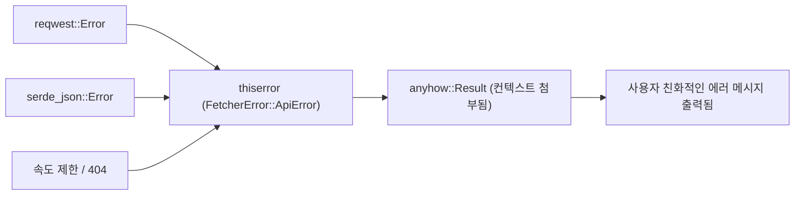

## 1. 시작하며

현대의 소프트웨어 개발에 있어 CLI(명령줄 인터페이스) 도구는 개발자의 생산성을 비약적으로 높여주는 필수불가결한 존재입니다. 예전에는 쉘 스크립트나 Python, Ruby 등이 주류였지만, 최근에는 **Rust**가 CLI 도구 개발의 사실상 표준으로 확고한 지위를 구축해 나가고 있습니다.

본 기사에서는 Rust를 사용하여 '초고속으로 동작하고, 초고속으로 개발할 수 있는' 실용적인 CLI 도구 구축 방법을 기초부터 응용까지 철저하게 해설합니다. 단순히 동작하는 것을 만드는 것에 그치지 않고, 상용 수준에서 통용되는 견고한 에러 핸들링, 비동기 처리를 이용한 고속 API 요청, 그리고 사용자 경험(UX)을 향상시키는 프로그레스 바 구현까지 망라하여 다룹니다.

이 기사를 끝까지 읽음으로써, 여러분은 다음과 같은 고도의 Rust 기술 스택을 마스터하고, 자신만의 강력한 CLI 도구를 세계를 향해 공개할 수 있게 될 것입니다.

---

## 2. 왜 CLI 도구 개발에 Rust를 선택하는가?

Rust가 CLI 개발에서 높게 평가받는 이유는 단순히 '유행하고 있어서'가 아닙니다. 거기에는 명확한 기술적, 아키텍처적 우위성이 존재합니다.

### 2.1. 단일 바이너리와 크로스 컴파일
Python이나 Node.js로 작성된 도구를 배포할 경우, 사용자 환경에 런타임(Python 인터프리터나 Node.js)이 설치되어 있어야 합니다. 게다가 의존성 패키지의 버전 충돌(이른바 '의존성 지옥')로 고민하게 되는 일도 적지 않습니다.
반면 Rust는 사전에 네이티브 코드로 컴파일되기 때문에 의존성을 포함한 **단일 실행 가능한 바이너리**를 생성합니다. 사용자는 바이너리를 다운로드하여 배치하는 것만으로 도구를 이용할 수 있어 도입 장벽이 극히 낮아집니다. 또한, 크로스 컴파일도 쉬워 Windows, macOS, Linux용 바이너리를 단일 CI 환경에서 빌드하는 것이 가능합니다.

### 2.2. 압도적인 실행 속도와 메모리 절약
Rust는 가비지 컬렉터(GC)를 가지지 않으며, 제로 비용 추상화를 통해 C/C++와 동등한 성능을 발휘합니다. CLI 도구에 있어서는 짧은 시작 시간이 UX와 직결됩니다. JVM 언어처럼 시작 시 워밍업 시간이 없으며, 명령을 입력한 순간에 처리가 시작된다는 것은 큰 장점입니다.

### 2.3. 강력한 타입 시스템과 소유권 모델에 의한 안전성
Rust의 최대 무기인 소유권(Ownership) 모델과 강력한 타입 시스템 덕분에, 메모리 누수나 데이터 경합 등의 버그는 컴파일 시점에 배제됩니다. '컴파일이 통과되면 거의 확실하게 의도대로 동작한다'는 경험은, CLI 도구처럼 시스템 리소스에 직접 접근하는 애플리케이션 개발에 있어 개발자에게 절대적인 안도감을 줍니다.

---

## 3. 본 튜토리얼에서 채택할 최강의 크레이트 군

Rust 생태계에는 CLI 개발을 강력하게 지원하는 뛰어난 크레이트(라이브러리)가 다수 존재합니다. 본 튜토리얼에서는 현대 Rust CLI 개발에 있어서 '골든 스택'이라고도 부를 수 있는 다음 크레이트들을 사용합니다.

1. **`clap`**: 명령줄 인수 구문 분석에서 가장 강력하고 인기 있는 크레이트입니다. 버전 4 이후 Derive 매크로를 사용한 선언적 정의가 더욱 세련되어졌으며, 도움말 메시지 자동 생성과 입력 자동 완성 스크립트 생성도 지원합니다.
2. **`tokio`**: Rust 비동기 런타임의 사실상 표준입니다. 멀티 스레드에서의 비동기 I/O를 극히 효율적으로 처리합니다.
3. **`reqwest`**: `tokio` 위에서 동작하는 고기능 HTTP 클라이언트입니다. 사용하기 쉬운 API를 갖추고 있어 비동기 API 요청을 간단히 구현할 수 있습니다.
4. **`serde` & `serde_json`**: 데이터의 직렬화·역직렬화를 수행하는 프레임워크입니다. API의 JSON 응답을 Rust의 타입 안전한 구조체에 매핑하기 위해 필수적입니다.
5. **`indicatif`**: 풍부하고 사용자 정의 가능한 프로그레스 바를 제공합니다. 비동기 처리의 진행 상황을 시각적으로 표시하여 CLI의 UX를 극적으로 향상시킵니다.
6. **`anyhow` & `thiserror`**: 에러 핸들링의 강력한 조합입니다. 라이브러리 내부의 도메인 에러 정의에는 `thiserror`를, 애플리케이션 최상위 계층에서의 에러 집계에는 `anyhow`를 사용하는 것이 모범 사례입니다.

다음 그림은 이러한 크레이트들이 애플리케이션 내에서 어떻게 연계되는지를 보여주는 아키텍처 다이어그램입니다.



---

## 4. 비동기 처리와 성능의 수학적 배경

본 튜토리얼에서 개발할 도구는 여러 API 엔드포인트에 대해 병행하여 요청을 보냅니다. 왜 `tokio`와 같은 비동기 런타임을 사용하면 극적으로 빨라지는지, 그 수학적 배경을 확인해 봅시다.

### 4.1. 암달의 법칙 (Amdahl's Law)
시스템의 일부를 병행화·비동기화함으로써 얻는 전체적인 성능 향상률은 암달의 법칙에 의해 다음과 같이 공식화됩니다.

$$
S(N) = \frac{1}{(1 - P) + \frac{P}{N}}
$$

여기서,
- $S(N)$ 은 이론상 최대 스피드업 비율
- $P$ 는 프로그램 내에서 병행화(비동기화) 가능한 부분의 비율
- $N$ 은 동시에 처리를 실행할 수 있는 작업의 병행도

API로부터 데이터를 가져오는 것과 같은 도구의 경우, 실행 시간의 대부분은 네트워크 응답 대기(I/O 바운드)입니다. 따라서 $P$의 값은 매우 커집니다(예를 들어 $0.95$ 이상). 동기적인 프로그램에서는 $N = 1$이지만, 비동기 I/O를 사용함으로써 $N$을 수천 규모로 끌어올릴 수 있으며, 이론상 $S(N)$은 비약적으로 증대합니다.

### 4.2. 리틀의 법칙 (Little's Law)과 처리량
네트워크 요청을 처리할 때, 시스템 내의 평균 동시 요청 수 $L$, 평균 처리량 $\lambda$(단위 시간당 처리 완료 수), 평균 응답 시간 $W$ 사이에는 다음 관계가 성립합니다.

$$
L = \lambda W \implies \lambda = \frac{L}{W}
$$

즉, 네트워크 지연 $W$를 피할 수 없는 환경 하에서 시스템의 처리량 $\lambda$를 향상시키려면 동시에 처리하는 요청 수 $L$을 늘릴 수밖에 없습니다. Rust의 비동기 작업은 OS의 네이티브 스레드와 달리 메모리 오버헤드가 극히 작기 때문에 $L$을 쉽게 확장(Scale)시킬 수 있습니다.

---

## 5. 개발할 도구의 설계: GitHub 저장소 일괄 페처

이번에는 실용적인 예로, 지정한 GitHub 사용자 또는 조직(Organization)의 공개 저장소 목록을 가져오고, 각각의 스타 수, 포크 수, 언어 등의 통계 정보를 병행하여 페치(fetch)한 뒤, 터미널에 포맷팅하여 표시하는 도구 **`gh-stats-fetcher`**를 개발합니다.

### 도구의 실행 시퀀스



---

## 6. 프로젝트 초기화 및 의존성 설정

먼저 Cargo를 사용하여 새로운 프로젝트를 생성합니다.

```bash
cargo new gh-stats-fetcher
cd gh-stats-fetcher
```

다음으로 `Cargo.toml`에 필요한 의존성을 추가합니다.

```toml
[package]
name = "gh-stats-fetcher"
version = "0.1.0"
edition = "2021"
authors = ["Your Name <your.email@example.com>"]
description = "A blazing fast CLI tool to fetch GitHub repository stats."

[dependencies]
clap = { version = "4.4", features = ["derive"] }
tokio = { version = "1.34", features = ["full"] }
reqwest = { version = "0.11", features = ["json", "rustls-tls"], default-features = false }
serde = { version = "1.0", features = ["derive"] }
serde_json = "1.0"
indicatif = "0.17"
anyhow = "1.0"
thiserror = "1.0"
```

> **포인트**: `reqwest`에서는 기본 TLS 백엔드 대신 `rustls-tls`를 사용하고 있습니다. 이를 통해 OpenSSL과 같은 시스템 의존 라이브러리가 불필요해져, 완전한 정적 링크 단일 바이너리를 구축하기 쉬워집니다.

---

## 7. 구현 단계 1: 에러 핸들링 기반 구축

견고한 CLI 도구를 만들기 위해서는 에러 핸들링 설계가 핵심입니다. 여기서는 `thiserror`와 `anyhow`의 구분 사용을 실천합니다.

도메인 고유의 에러는 `src/error.rs`에 정의합니다.

```rust
// src/error.rs
use thiserror::Error;

#[derive(Error, Debug)]
pub enum FetcherError {
    #[error("API Request failed: {0}")]
    ApiError(#[from] reqwest::Error),
    
    #[error("Failed to parse JSON: {0}")]
    ParseError(#[from] serde_json::Error),
    
    #[error("GitHub API Rate limit exceeded. Try again later.")]
    RateLimitExceeded,
    
    #[error("Target user or organization '{0}' not found.")]
    NotFound(String),
}
```



---

## 8. 구현 단계 2: clap을 이용한 인수 구문 분석

다음으로 CLI 인수를 정의합니다. `src/cli.rs`를 생성하고 `clap`의 Derive 매크로를 사용합니다.

```rust
// src/cli.rs
use clap::{Parser, Subcommand};

#[derive(Parser, Debug)]
#[command(name = "gh-stats-fetcher")]
#[command(author, version, about, long_about = None)]
pub struct Cli {
    #[command(subcommand)]
    pub command: Commands,
}

#[derive(Subcommand, Debug)]
pub enum Commands {
    /// Fetch stats for a specific user
    Fetch {
        /// The GitHub username or organization name
        #[arg(short, long)]
        user: String,
        
        /// Number of concurrent requests
        #[arg(short, long, default_value_t = 10)]
        concurrency: usize,
    },
}
```

이를 통해 다음과 같이 자동으로 아름다운 도움말 메시지가 생성됩니다.

```text
$ gh-stats-fetcher --help
A blazing fast CLI tool to fetch GitHub repository stats.

Usage: gh-stats-fetcher <COMMAND>

Commands:
  fetch  Fetch stats for a specific user
  help   Print this message or the help of the given subcommand(s)
```

---

## 9. 구현 단계 3: API 클라이언트와 데이터 매핑

GitHub API에서 반환되는 JSON 데이터를 Rust의 구조체에 매핑합니다. `src/models.rs`와 `src/api.rs`를 구현합니다.

```rust
// src/models.rs
use serde::{Deserialize, Serialize};

#[derive(Debug, Deserialize, Serialize)]
pub struct Repository {
    pub name: String,
    pub html_url: String,
    pub stargazers_count: u32,
    pub forks_count: u32,
    pub language: Option<String>,
}
```

```rust
// src/api.rs
use crate::models::Repository;
use crate::error::FetcherError;
use reqwest::Client;

pub struct GitHubClient {
    client: Client,
}

impl GitHubClient {
    pub fn new() -> Result<Self, FetcherError> {
        let client = Client::builder()
            .user_agent("gh-stats-fetcher/0.1.0")
            .build()?;
        Ok(Self { client })
    }

    pub async fn fetch_repos(&self, user: &str) -> Result<Vec<Repository>, FetcherError> {
        let url = format!("https://api.github.com/users/{}/repos?per_page=100", user);
        let res = self.client.get(&url).send().await?;

        if res.status() == 404 {
            return Err(FetcherError::NotFound(user.to_string()));
        } else if res.status() == 403 {
            return Err(FetcherError::RateLimitExceeded);
        }

        let repos = res.json::<Vec<Repository>>().await?;
        Ok(repos)
    }
}
```

---

## 10. 구현 단계 4: tokio와 indicatif를 이용한 병행 처리 및 프로그레스 바

이 부분이 본 도구의 하이라이트입니다. 가져온 저장소 목록에 대해 병행 처리를 수행하고, 아름다운 프로그레스 바를 표시합니다.

```rust
// src/main.rs
mod cli;
mod error;
mod models;
mod api;

use clap::Parser;
use cli::{Cli, Commands};
use api::GitHubClient;
use anyhow::{Context, Result};
use indicatif::{ProgressBar, ProgressStyle};
use std::sync::Arc;
use tokio::sync::Semaphore;

#[tokio::main]
async fn main() -> Result<()> {
    let cli = Cli::parse();

    match cli.command {
        Commands::Fetch { user, concurrency } => {
            println!("Fetching repositories for {}...", user);
            
            let client = Arc::new(GitHubClient::new().context("Failed to initialize API client")?);
            let repos = client.fetch_repos(&user).await.context("Failed to fetch repository list")?;
            
            println!("Found {} repositories. Analyzing...", repos.len());

            let pb = ProgressBar::new(repos.len() as u64);
            pb.set_style(ProgressStyle::default_bar()
                .template("{spinner:.green} [{elapsed_precise}] [{wide_bar:.cyan/blue}] {pos}/{len} ({eta})")
                .unwrap()
                .progress_chars("#>-"));

            // 병행 수를 제한하기 위한 세마포어
            let semaphore = Arc::new(Semaphore::new(concurrency));
            let mut tasks = vec![];

            for repo in repos {
                let permit = semaphore.clone().acquire_owned().await.unwrap();
                let pb_clone = pb.clone();
                // 실제 앱에서는 여기서 세부 API를 호출하는 등 무거운 처리를 수행함
                // 이번에는 데모로서 비동기 슬립을 넣음
                tasks.push(tokio::spawn(async move {
                    tokio::time::sleep(std::time::Duration::from_millis(100)).await;
                    pb_clone.inc(1);
                    drop(permit);
                    repo
                }));
            }

            let mut results = vec![];
            for task in tasks {
                results.push(task.await.context("Task panicked")?);
            }

            pb.finish_with_message("Done!");

            // 스타 수로 정렬하여 상위 5건을 표시
            results.sort_by(|a, b| b.stargazers_count.cmp(&a.stargazers_count));
            println!("\nTop 5 Repositories:");
            for (i, repo) in results.iter().take(5).enumerate() {
                let lang = repo.language.as_deref().unwrap_or("Unknown");
                println!("{}. {} (⭐ {} | 🍴 {} | 💻 {})", 
                    i + 1, repo.name, repo.stargazers_count, repo.forks_count, lang);
            }
        }
    }

    Ok(())
}
```

이 코드에서는 `tokio::spawn`을 사용하여 작업을 백그라운드 워커에 디스패치하고, 동시에 `tokio::sync::Semaphore`를 사용하여 동시 실행되는 API 요청의 수를 제한(기본 10 병행)하고 있습니다. 이를 통해 API 속도 제한에 걸릴 위험을 줄이면서 동기 처리보다 압도적인 속도를 실현하고 있습니다.

---

## 11. 고급 주제: 테스트와 최적화

### 11.1. CLI 도구의 통합 테스트
CLI 도구 자체의 동작을 테스트하려면 `assert_cmd` 크레이트가 매우 편리합니다. `tests/cli_test.rs`를 생성하고 실제 바이너리를 호출하여 표준 출력을 검증합니다.

```rust
// tests/cli_test.rs
use assert_cmd::Command;
use predicates::prelude::*;

#[test]
fn test_help_message() {
    let mut cmd = Command::cargo_bin("gh-stats-fetcher").unwrap();
    cmd.arg("--help")
        .assert()
        .success()
        .stdout(predicate::str::contains("Usage: gh-stats-fetcher"));
}
```

### 11.2. 릴리스 빌드의 극한 최적화
기본 릴리스 빌드로도 충분히 빠르지만, 바이너리 크기를 줄이고 실행 속도를 극한까지 높이기 위해 `Cargo.toml`의 `[profile.release]`를 설정합니다.

```toml
[profile.release]
opt-level = 3       # 최고 수준의 최적화
lto = true          # 링크 타임 최적화(Link Time Optimization) 활성화
codegen-units = 1   # 컴파일 단위를 1로 설정하여 최적화 극대화(빌드 시간은 증가)
panic = "abort"     # 패닉 시 스택 트레이스를 되감지 않고 즉시 중단(크기 감소)
strip = true        # 심볼 정보를 삭제하여 바이너리 크기를 극적으로 감소
```

이러한 설정들을 적용함으로써 생성되는 바이너리 크기는 수 MB 단위로 작아지며, 사용자에 대한 배포가 더욱 쉬워집니다.

---

## 12. CI/CD 및 배포 (Publishing)

작성한 도구를 전 세계에 배포하기 위한 단계입니다.

### crates.io에 공개
Rust 패키지 매니저인 Cargo를 사용하면 단 몇 번의 명령어로 공식 레지스트리에 공개할 수 있습니다.

```bash
cargo login <YOUR_TOKEN>
cargo publish
```
공개 후에는 전 세계의 사용자가 `cargo install gh-stats-fetcher` 명령어 하나로 당신의 도구를 설치할 수 있게 됩니다.

### GitHub Actions를 통한 자동 릴리스
크로스 컴파일된 바이너리를 GitHub Releases에 자동으로 업로드하는 CI/CD 파이프라인을 구축합니다. `.github/workflows/release.yml`에 다음과 같은 설정을 작성합니다. 이를 통해 태그를 푸시하는 것만으로 Linux, macOS, Windows용 바이너리가 자동으로 빌드되어 릴리스 자산으로 첨부됩니다(여기서는 지면 관계상 상세한 YAML 작성은 생략하지만, `taiki-e/upload-rust-binary-action` 등의 Action을 이용하는 것이 현재의 모범 사례입니다).

---

## 13. 요약

본 기사에서는 Rust를 이용한 CLI 도구 개발의 일련의 흐름을 상세하게 해설했습니다.

1. **설계 방침**: Rust의 안전성과 고속성, 단일 바이너리의 이점을 확인했습니다.
2. **크레이트 선정**: `clap`, `tokio`, `serde`, `indicatif`, `thiserror`, `anyhow`라는 강력한 무기를 얻었습니다.
3. **병행 처리의 수학적 우위성**: 암달의 법칙과 리틀의 법칙을 바탕으로 비동기 처리의 위력을 이론적으로 이해했습니다.
4. **구현과 최적화**: 견고한 에러 핸들링부터 극한의 바이너리 최적화까지 실용적인 노하우를 담았습니다.

Rust를 활용한 CLI 개발은 컴파일러와의 대화를 통해 소프트웨어의 품질을 설계 단계부터 담보할 수 있는 훌륭한 경험입니다. 이번에 작성한 기본 코드를 바탕으로 부디 여러분만의 오리지널 CLI 도구를 개발하여 전 세계를 향해 공유해 보시기 바랍니다! Happy Rust Coding!
