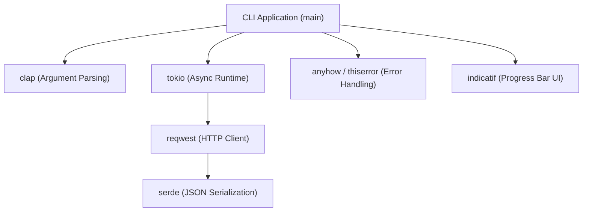
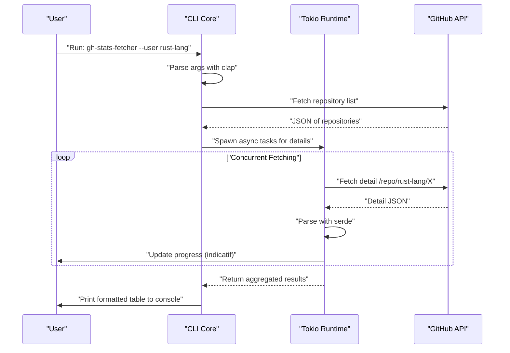
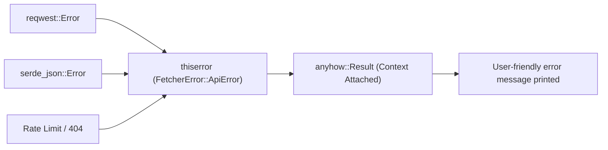

## 1. はじめに

現代のソフトウェア開発において、CLI（コマンドラインインターフェース）ツールは開発者の生産性を飛躍的に高める不可欠な存在です。かつてはシェルスクリプトやPython、Rubyなどが主流でしたが、近年では**Rust**がCLIツール開発のデファクトスタンダードとして確固たる地位を築きつつあります。

本記事では、Rustを用いて「爆速で動作し、爆速で開発できる」実践的なCLIツールの構築方法を、基礎から応用まで徹底的に解説します。単に動くものを作るだけでなく、商用レベルで通用する堅牢なエラーハンドリング、非同期処理を用いた高速なAPIリクエスト、そしてユーザー体験（UX）を向上させるプログレスバーの実装まで、網羅的にカバーします。

この記事を最後まで読むことで、あなたは以下のような高度なRustの技術スタックをマスターし、自分自身の強力なCLIツールを世界に向けて公開できるようになるでしょう。

---

## 2. なぜCLIツール開発にRustを選ぶのか？

RustがCLI開発において高く評価されている理由は、単に「流行っているから」ではありません。そこには明確な技術的、アーキテクチャ上の優位性が存在します。

### 2.1. シングルバイナリとクロスコンパイル
PythonやNode.jsで書かれたツールを配布する場合、ユーザーの環境にランタイム（PythonインタープリタやNode.js）がインストールされている必要があります。さらに、依存パッケージのバージョン競合（いわゆる「依存地獄」）に悩まされることも少なくありません。
一方、Rustは事前にネイティブコードにコンパイルされるため、依存関係を含んだ**単一の実行可能バイナリ**を生成します。ユーザーはバイナリをダウンロードして配置するだけでツールを利用でき、導入のハードルが極めて低くなります。また、クロスコンパイルも容易であり、Windows、macOS、Linux向けのバイナリを単一のCI環境でビルドすることが可能です。

### 2.2. 圧倒的な実行速度と省メモリ
Rustはガベージコレクタ（GC）を持たず、ゼロコスト抽象化によりC/C++と同等のパフォーマンスを発揮します。CLIツールにおいては、起動時間の短さがUXに直結します。JVM言語のように起動時のウォームアップタイムがなく、コマンドを叩いた瞬間に処理が開始されるのは大きなメリットです。

### 2.3. 強力な型システムと所有権モデルによる安全性
Rustの最大の武器である所有権（Ownership）モデルと強力な型システムにより、メモリリークやデータ競合などのバグはコンパイル時に排除されます。「コンパイルが通れば、ほぼ確実に意図通りに動く」という体験は、CLIツールのようなシステムリソースに直接触れるアプリケーションの開発において、開発者に絶大な安心感をもたらします。

---

## 3. 本チュートリアルで採用する最強のクレート群

Rustのエコシステムには、CLI開発を強力にサポートする優れたクレート（ライブラリ）が多数存在します。本チュートリアルでは、現代のRust CLI開発における「ゴールデン・スタック」とも呼べる以下のクレートを使用します。

1. **`clap`**: コマンドライン引数の解析において最も強力で人気のあるクレートです。バージョン4以降、Deriveマクロを用いた宣言的な定義がより洗練され、ヘルプメッセージの自動生成や入力補完スクリプトの生成もサポートしています。
2. **`tokio`**: Rustの非同期ランタイムのデファクトスタンダード。マルチスレッドでの非同期I/Oを極めて効率的に処理します。
3. **`reqwest`**: `tokio` 上で動作する高機能なHTTPクライアント。使いやすいAPIを備え、非同期APIリクエストを簡単に実装できます。
4. **`serde` & `serde_json`**: データのシリアライズ・デシリアライズを行うフレームワーク。APIのJSONレスポンスをRustの型安全な構造体にマッピングするために不可欠です。
5. **`indicatif`**: リッチでカスタマイズ可能なプログレスバーを提供します。非同期処理の進捗を視覚的に表示し、CLIのUXを劇的に向上させます。
6. **`anyhow` & `thiserror`**: エラーハンドリングの強力なコンビネーション。ライブラリ内部のドメインエラー定義には `thiserror` を、アプリケーションの最上位層でのエラー集約には `anyhow` を使用するのがベストプラクティスです。

以下の図は、これらのクレートがアプリケーション内でどのように連携するかを示したアーキテクチャ図です。



---

## 4. 非同期処理とパフォーマンスの数理的背景

本チュートリアルで開発するツールは、複数のAPIエンドポイントに対して並行してリクエストを送信します。なぜ `tokio` のような非同期ランタイムを使用すると劇的に速くなるのか、その数理的背景を確認しておきましょう。

### 4.1. アムダールの法則 (Amdahl's Law)
システムの一部を並行化・非同期化することによる全体的なパフォーマンス向上率は、アムダールの法則によって以下のように定式化されます。

$$
S(N) = \frac{1}{(1 - P) + \frac{P}{N}}
$$

ここで、
- $S(N)$ は理論上の最大スピードアップ率
- $P$ はプログラム内で並行化（非同期化）可能な部分の割合
- $N$ は同時に処理を実行できるタスクの並行度

APIからデータを取得するようなツールの場合、実行時間の大半はネットワークの応答待ち（I/Oバウンド）です。したがって、$P$ の値は非常に大きく（例えば $0.95$ 以上）なります。同期的なプログラムでは $N = 1$ ですが、非同期I/Oを用いることで $N$ を数千規模に引き上げることができ、理論上 $S(N)$ は飛躍的に増大します。

### 4.2. リトルの法則 (Little's Law) とスループット
ネットワークリクエストを処理する際、システム内の平均同時リクエスト数 $L$、平均スループット $\lambda$（単位時間あたりの処理完了数）、平均応答時間 $W$ には以下の関係が成り立ちます。

$$
L = \lambda W \implies \lambda = \frac{L}{W}
$$

つまり、ネットワーク遅延 $W$ が避けられない環境下において、システムのスループット $\lambda$ を向上させるには、同時に処理するリクエスト数 $L$ を増やすしかありません。Rustの非同期タスクはOSのネイティブスレッドと異なり、メモリオーバーヘッドが極めて小さいため、$L$ を容易にスケールさせることができます。

---

## 5. 開発するツールの設計：GitHubリポジトリ一括フェッチャー

今回は実践的な例として、指定したGitHubユーザーまたはOrganizationの公開リポジトリ一覧を取得し、それぞれのスター数、フォーク数、言語などの統計情報を並行してフェッチし、ターミナルに整形して表示するツール **`gh-stats-fetcher`** を開発します。

### ツールの実行シーケンス



---

## 6. プロジェクトの初期化と依存関係の設定

まずはCargoを使って新しいプロジェクトを作成します。

```bash
cargo new gh-stats-fetcher
cd gh-stats-fetcher
```

次に、`Cargo.toml` に必要な依存関係を追加します。

```toml
[package]
name = "gh-stats-fetcher"
version = "0.1.0"
edition = "2021"
authors = ["Your Name <your.email@example.com>"]
description = "A blazing fast CLI tool to fetch GitHub repository stats."

[dependencies]
clap = { version = "4.4", features = ["derive"] }
tokio = { version = "1.34", features = ["full"] }
reqwest = { version = "0.11", features = ["json", "rustls-tls"], default-features = false }
serde = { version = "1.0", features = ["derive"] }
serde_json = "1.0"
indicatif = "0.17"
anyhow = "1.0"
thiserror = "1.0"
```

> **ポイント**: `reqwest` ではデフォルトのTLSバックエンドの代わりに `rustls-tls` を使用しています。これにより、OpenSSLなどのシステム依存ライブラリが不要になり、完全な静的リンクのシングルバイナリを構築しやすくなります。

---

## 7. 実装フェーズ1: エラーハンドリングの基盤構築

堅牢なCLIツールを作るためには、エラーハンドリングの設計が要となります。ここでは `thiserror` と `anyhow` の使い分けを実践します。

ドメイン固有のエラーは `src/error.rs` に定義します。

```rust
// src/error.rs
use thiserror::Error;

#[derive(Error, Debug)]
pub enum FetcherError {
    #[error("API Request failed: {0}")]
    ApiError(#[from] reqwest::Error),
    
    #[error("Failed to parse JSON: {0}")]
    ParseError(#[from] serde_json::Error),
    
    #[error("GitHub API Rate limit exceeded. Try again later.")]
    RateLimitExceeded,
    
    #[error("Target user or organization '{0}' not found.")]
    NotFound(String),
}
```



---

## 8. 実装フェーズ2: clapによる引数解析

次に、CLIの引数を定義します。`src/cli.rs` を作成し、`clap` の Derive マクロを使用します。

```rust
// src/cli.rs
use clap::{Parser, Subcommand};

#[derive(Parser, Debug)]
#[command(name = "gh-stats-fetcher")]
#[command(author, version, about, long_about = None)]
pub struct Cli {
    #[command(subcommand)]
    pub command: Commands,
}

#[derive(Subcommand, Debug)]
pub enum Commands {
    /// Fetch stats for a specific user
    Fetch {
        /// The GitHub username or organization name
        #[arg(short, long)]
        user: String,
        
        /// Number of concurrent requests
        #[arg(short, long, default_value_t = 10)]
        concurrency: usize,
    },
}
```

これにより、以下のように自動で美しいヘルプメッセージが生成されます。

```text
$ gh-stats-fetcher --help
A blazing fast CLI tool to fetch GitHub repository stats.

Usage: gh-stats-fetcher <COMMAND>

Commands:
  fetch  Fetch stats for a specific user
  help   Print this message or the help of the given subcommand(s)
```

---

## 9. 実装フェーズ3: APIクライアントとデータのマッピング

GitHub APIから返されるJSONデータをRustの構造体にマッピングします。`src/models.rs` と `src/api.rs` を実装します。

```rust
// src/models.rs
use serde::{Deserialize, Serialize};

#[derive(Debug, Deserialize, Serialize)]
pub struct Repository {
    pub name: String,
    pub html_url: String,
    pub stargazers_count: u32,
    pub forks_count: u32,
    pub language: Option<String>,
}
```

```rust
// src/api.rs
use crate::models::Repository;
use crate::error::FetcherError;
use reqwest::Client;

pub struct GitHubClient {
    client: Client,
}

impl GitHubClient {
    pub fn new() -> Result<Self, FetcherError> {
        let client = Client::builder()
            .user_agent("gh-stats-fetcher/0.1.0")
            .build()?;
        Ok(Self { client })
    }

    pub async fn fetch_repos(&self, user: &str) -> Result<Vec<Repository>, FetcherError> {
        let url = format!("https://api.github.com/users/{}/repos?per_page=100", user);
        let res = self.client.get(&url).send().await?;

        if res.status() == 404 {
            return Err(FetcherError::NotFound(user.to_string()));
        } else if res.status() == 403 {
            return Err(FetcherError::RateLimitExceeded);
        }

        let repos = res.json::<Vec<Repository>>().await?;
        Ok(repos)
    }
}
```

---

## 10. 実装フェーズ4: tokioとindicatifによる並行処理とプログレスバー

ここが本ツールのハイライトです。取得したリポジトリ一覧に対して並行処理を行い、美しいプログレスバーを表示します。

```rust
// src/main.rs
mod cli;
mod error;
mod models;
mod api;

use clap::Parser;
use cli::{Cli, Commands};
use api::GitHubClient;
use anyhow::{Context, Result};
use indicatif::{ProgressBar, ProgressStyle};
use std::sync::Arc;
use tokio::sync::Semaphore;

#[tokio::main]
async fn main() -> Result<()> {
    let cli = Cli::parse();

    match cli.command {
        Commands::Fetch { user, concurrency } => {
            println!("Fetching repositories for {}...", user);
            
            let client = Arc::new(GitHubClient::new().context("Failed to initialize API client")?);
            let repos = client.fetch_repos(&user).await.context("Failed to fetch repository list")?;
            
            println!("Found {} repositories. Analyzing...", repos.len());

            let pb = ProgressBar::new(repos.len() as u64);
            pb.set_style(ProgressStyle::default_bar()
                .template("{spinner:.green} [{elapsed_precise}] [{wide_bar:.cyan/blue}] {pos}/{len} ({eta})")
                .unwrap()
                .progress_chars("#>-"));

            // 並行数を制限するためのセマフォ
            let semaphore = Arc::new(Semaphore::new(concurrency));
            let mut tasks = vec![];

            for repo in repos {
                let permit = semaphore.clone().acquire_owned().await.unwrap();
                let pb_clone = pb.clone();
                // 実際のアプリではここで詳細APIを叩くなどの重い処理を行う
                // 今回はデモとして非同期スリープを挟む
                tasks.push(tokio::spawn(async move {
                    tokio::time::sleep(std::time::Duration::from_millis(100)).await;
                    pb_clone.inc(1);
                    drop(permit);
                    repo
                }));
            }

            let mut results = vec![];
            for task in tasks {
                results.push(task.await.context("Task panicked")?);
            }

            pb.finish_with_message("Done!");

            // スター数でソートして上位5件を表示
            results.sort_by(|a, b| b.stargazers_count.cmp(&a.stargazers_count));
            println!("\nTop 5 Repositories:");
            for (i, repo) in results.iter().take(5).enumerate() {
                let lang = repo.language.as_deref().unwrap_or("Unknown");
                println!("{}. {} (⭐ {} | 🍴 {} | 💻 {})", 
                    i + 1, repo.name, repo.stargazers_count, repo.forks_count, lang);
            }
        }
    }

    Ok(())
}
```

このコードでは、`tokio::spawn` を用いてタスクをバックグラウンドワーカーにディスパッチし、同時に `tokio::sync::Semaphore` を使って同時に実行されるAPIリクエストの数を制限（デフォルト10並行）しています。これにより、APIのレートリミットに引っかかるリスクを減らしつつ、同期処理よりも圧倒的な速度を実現しています。

---

## 11. 高度なトピック: テストと最適化

### 11.1. CLIツールの統合テスト
CLIツール自体の振る舞いをテストするには、`assert_cmd` クレートが非常に便利です。`tests/cli_test.rs` を作成し、実際のバイナリを呼び出して標準出力を検証します。

```rust
// tests/cli_test.rs
use assert_cmd::Command;
use predicates::prelude::*;

#[test]
fn test_help_message() {
    let mut cmd = Command::cargo_bin("gh-stats-fetcher").unwrap();
    cmd.arg("--help")
        .assert()
        .success()
        .stdout(predicate::str::contains("Usage: gh-stats-fetcher"));
}
```

### 11.2. リリースビルドの極限最適化
デフォルトのリリースビルドでも十分に速いですが、バイナリサイズを削減し、実行速度を極限まで高めるために `Cargo.toml` の `[profile.release]` を設定します。

```toml
[profile.release]
opt-level = 3       # 最高レベルの最適化
lto = true          # リンク時最適化（Link Time Optimization）を有効化
codegen-units = 1   # コンパイル単位を1にして最適化を最大化（ビルド時間は長くなる）
panic = "abort"     # パニック時にスタックトレースを巻き戻さず即座にアボート（サイズ削減）
strip = true        # シンボル情報を削除してバイナリサイズを劇的に削減
```

これらの設定を適用することで、生成されるバイナリサイズは数MB単位で小さくなり、ユーザーへの配布がさらに容易になります。

---

## 12. CI/CDと配布 (Publishing)

作成したツールを世界中に配布するためのステップです。

### crates.io への公開
RustのパッケージマネージャであるCargoを使えば、わずか数コマンドで公式レジストリに公開できます。

```bash
cargo login <YOUR_TOKEN>
cargo publish
```
公開後は、世界中のユーザーが `cargo install gh-stats-fetcher` コマンド一つであなたのツールをインストールできるようになります。

### GitHub Actions による自動リリース
クロスコンパイルされたバイナリをGitHub Releasesに自動アップロードするCI/CDパイプラインを構築します。`.github/workflows/release.yml` に以下のような設定を記述します。これにより、タグをプッシュするだけで、Linux, macOS, Windows用のバイナリが自動的にビルドされ、リリースアセットとして添付されます（ここでは紙面の都合上、詳細なYAMLの記述は割愛しますが、`taiki-e/upload-rust-binary-action` などのActionを利用するのが現在のベストプラクティスです）。

---

## 13. まとめ

本記事では、Rustを用いたCLIツール開発の一連のフローを詳細に解説しました。

1. **設計方針**: Rustの安全性と高速性、シングルバイナリの利点を確認しました。
2. **クレートの選定**: `clap`, `tokio`, `serde`, `indicatif`, `thiserror`, `anyhow` という強力な武器を手に入れました。
3. **並行処理の数理的優位性**: アムダールの法則とリトルの法則に基づき、非同期処理の威力を理論的に理解しました。
4. **実装と最適化**: 堅牢なエラーハンドリングから極限のバイナリ最適化まで、実用的なノウハウを詰め込みました。

RustによるCLI開発は、コンパイラとの対話を通じてソフトウェアの品質を設計段階から担保できる素晴らしい体験です。今回作成したベースコードを元に、ぜひあなただけのオリジナルCLIツールを開発し、世界に向けて発信してみてください！ Happy Rust Coding!
