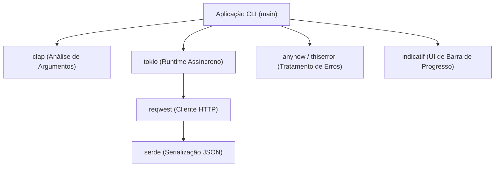
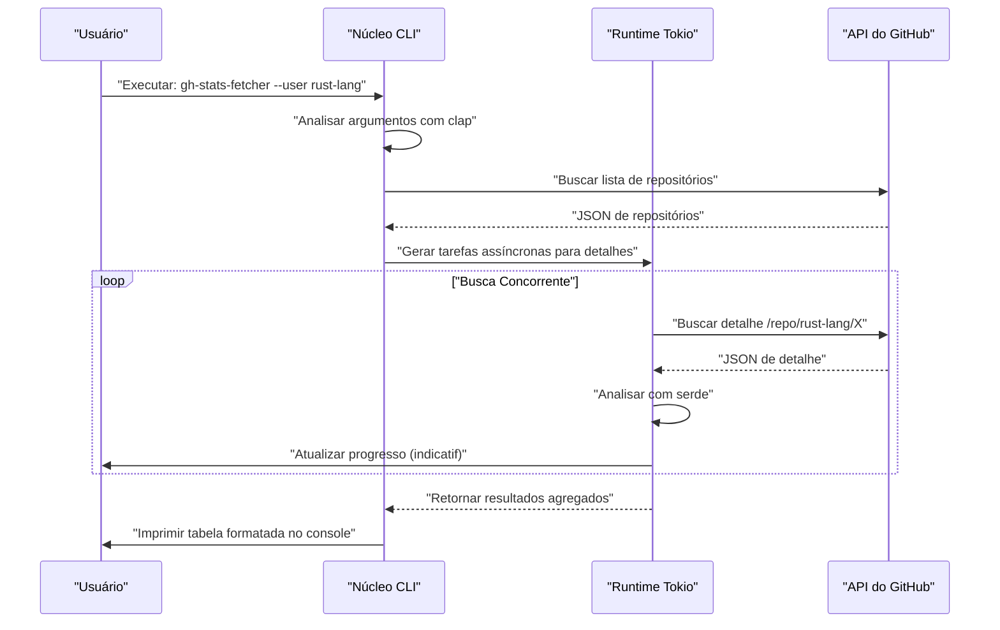
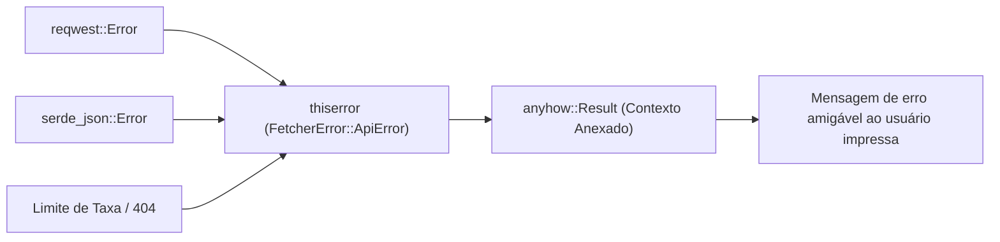

## 1. Introdução

No desenvolvimento de software moderno, as ferramentas CLI (Interface de Linha de Comando) são essenciais para aumentar drasticamente a produtividade dos desenvolvedores. No passado, scripts de shell, Python, Ruby, etc., eram dominantes, mas nos últimos anos, **Rust** estabeleceu firmemente a sua posição como o padrão de fato para o desenvolvimento de ferramentas CLI.

Neste artigo, explicaremos de forma abrangente, do básico ao avançado, como construir uma ferramenta CLI prática usando Rust, que "funciona em uma velocidade explosiva e pode ser desenvolvida em uma velocidade explosiva". Não se trata apenas de construir algo que funcione, mas de cobrir tratamento de erros robusto em nível comercial, solicitações de API rápidas usando processamento assíncrono e implementação de barras de progresso que melhoram a experiência do usuário (UX).

Ao ler este artigo até o fim, você dominará a pilha de tecnologia avançada em Rust apresentada a seguir e será capaz de publicar suas próprias ferramentas CLI poderosas para o mundo.

---

## 2. Por que escolher Rust para o desenvolvimento de ferramentas CLI?

O motivo pelo qual Rust é altamente avaliado no desenvolvimento de CLI não é simplesmente porque "está na moda". Existem claras vantagens técnicas e de arquitetura.

### 2.1. Binário Único e Compilação Cruzada
Quando se distribui ferramentas escritas em Python ou Node.js, é necessário que o ambiente do usuário tenha o runtime (interpretador Python ou Node.js) instalado. Além disso, não é incomum sofrer com conflitos de versão de pacotes de dependência (o chamado "inferno das dependências").
Por outro lado, o Rust é compilado com antecedência em código nativo, gerando um **único binário executável** que inclui suas dependências. Os usuários podem usar a ferramenta simplesmente baixando e colocando o binário, o que torna a barreira de adoção extremamente baixa. Além disso, a compilação cruzada é fácil, e é possível compilar binários para Windows, macOS e Linux em um único ambiente de CI.

### 2.2. Velocidade de Execução Esmagadora e Baixo Consumo de Memória
O Rust não possui coletor de lixo (GC) e, através de abstrações de custo zero, oferece um desempenho equivalente ao C/C++. Em ferramentas CLI, um tempo de inicialização curto está diretamente ligado à UX. Não há tempo de aquecimento na inicialização como nas linguagens da JVM, e o processamento começa no momento em que o comando é executado, o que é uma grande vantagem.

### 2.3. Segurança através de Sistema de Tipos Forte e Modelo de Propriedade
Com o modelo de propriedade (Ownership) e o sistema de tipos forte, que são as maiores armas do Rust, bugs como vazamentos de memória e corridas de dados são eliminados em tempo de compilação. A experiência de "se compilar, quase com certeza funcionará como planejado" traz uma enorme tranquilidade aos desenvolvedores ao construir aplicativos que tocam diretamente em recursos do sistema, como ferramentas CLI.

---

## 3. Os Melhores Crates Adotados Neste Tutorial

No ecossistema Rust, existem muitos crates excelentes (bibliotecas) que suportam fortemente o desenvolvimento de CLI. Neste tutorial, usaremos os seguintes crates, que podem ser chamados de "Pilha de Ouro" no moderno desenvolvimento de CLI em Rust:

1. **`clap`**: O crate mais poderoso e popular para analisar argumentos de linha de comando. A partir da versão 4, as definições declarativas usando macros Derive tornaram-se mais refinadas, suportando a geração automática de mensagens de ajuda e scripts de preenchimento automático (autocompletion).
2. **`tokio`**: O padrão de fato para runtimes assíncronos no Rust. Ele lida com I/O assíncrono em multithreading com extrema eficiência.
3. **`reqwest`**: Um cliente HTTP altamente funcional executado no `tokio`. Possui uma API fácil de usar que torna simples a implementação de solicitações de API assíncronas.
4. **`serde` & `serde_json`**: Um framework para serialização e desserialização de dados. É indispensável para mapear respostas JSON de API em estruturas com segurança de tipos no Rust.
5. **`indicatif`**: Fornece barras de progresso ricas e personalizáveis. Exibe visualmente o progresso do processamento assíncrono e melhora drasticamente a UX do CLI.
6. **`anyhow` & `thiserror`**: Uma poderosa combinação para tratamento de erros. A melhor prática é usar o `thiserror` para definições de erros de domínio dentro das bibliotecas e o `anyhow` para a agregação de erros na camada superior da aplicação.

O diagrama a seguir mostra como esses crates interagem dentro do aplicativo:



---

## 4. O Contexto Matemático do Processamento Assíncrono e Desempenho

A ferramenta desenvolvida neste tutorial envia requisições em paralelo para vários endpoints de API. Vamos rever a base matemática sobre o motivo pelo qual o uso de um runtime assíncrono como o `tokio` aumenta a velocidade drasticamente.

### 4.1. Lei de Amdahl (Amdahl's Law)
A taxa global de melhoria de desempenho ao paralelizar e tornar assíncrona parte de um sistema é formulada pela Lei de Amdahl:

$$
S(N) = \frac{1}{(1 - P) + \frac{P}{N}}
$$

Onde:
- $S(N)$ é o aumento teórico máximo de velocidade
- $P$ é a proporção da parte do programa que pode ser paralelizada (tornada assíncrona)
- $N$ é o grau de concorrência das tarefas que podem ser executadas simultaneamente

No caso de ferramentas que buscam dados de uma API, a maior parte do tempo de execução é gasto aguardando a resposta da rede (limitado por I/O). Portanto, o valor de $P$ é muito alto (por exemplo, $0.95$ ou mais). Em programas síncronos, $N = 1$, mas usando I/O assíncrono, $N$ pode ser elevado a uma escala de milhares, e, teoricamente, $S(N)$ aumenta drasticamente.

### 4.2. Lei de Little (Little's Law) e Throughput (Taxa de Transferência)
Ao processar solicitações de rede, a relação entre o número médio de solicitações simultâneas no sistema $L$, o throughput médio $\lambda$ (número de processos concluídos por unidade de tempo) e o tempo médio de resposta $W$ é estabelecida da seguinte forma:

$$
L = \lambda W \implies \lambda = \frac{L}{W}
$$

Em outras palavras, num ambiente onde o atraso de rede $W$ é inevitável, a única forma de melhorar o throughput $\lambda$ do sistema é aumentar o número de solicitações processadas simultaneamente, $L$. Como as tarefas assíncronas do Rust têm um custo adicional de memória (overhead) extremamente pequeno em comparação com as threads nativas do sistema operacional (OS), é fácil escalar o $L$.

---

## 5. Design da Ferramenta a Ser Desenvolvida: Buscador em Lote de Repositórios GitHub

Como um exemplo prático desta vez, desenvolveremos a ferramenta **`gh-stats-fetcher`**. Esta ferramenta busca a lista de repositórios públicos de um usuário ou Organização especificados no GitHub e, de forma simultânea, obtém dados estatísticos de cada um deles, como número de estrelas, número de forks e linguagem, exibindo os resultados formatados no terminal.

### Sequência de Execução da Ferramenta



---

## 6. Inicialização do Projeto e Configuração de Dependências

Primeiro, crie um novo projeto usando o Cargo.

```bash
cargo new gh-stats-fetcher
cd gh-stats-fetcher
```

Em seguida, adicione as dependências necessárias ao `Cargo.toml`.

```toml
[package]
name = "gh-stats-fetcher"
version = "0.1.0"
edition = "2021"
authors = ["Your Name <your.email@example.com>"]
description = "A blazing fast CLI tool to fetch GitHub repository stats."

[dependencies]
clap = { version = "4.4", features = ["derive"] }
tokio = { version = "1.34", features = ["full"] }
reqwest = { version = "0.11", features = ["json", "rustls-tls"], default-features = false }
serde = { version = "1.0", features = ["derive"] }
serde_json = "1.0"
indicatif = "0.17"
anyhow = "1.0"
thiserror = "1.0"
```

> **Dica**: No `reqwest`, estamos utilizando `rustls-tls` em vez do backend TLS padrão. Isso elimina a necessidade de bibliotecas dependentes do sistema, como OpenSSL, tornando mais fácil criar um único binário totalmente vinculado estaticamente.

---

## 7. Fase de Implementação 1: Construção da Base para Tratamento de Erros

A base do tratamento de erros é o núcleo para a construção de uma ferramenta CLI robusta. Aqui, demonstraremos como diferenciar o uso do `thiserror` e do `anyhow`.

Os erros específicos do domínio devem ser definidos em `src/error.rs`.

```rust
// src/error.rs
use thiserror::Error;

#[derive(Error, Debug)]
pub enum FetcherError {
    #[error("API Request failed: {0}")]
    ApiError(#[from] reqwest::Error),
    
    #[error("Failed to parse JSON: {0}")]
    ParseError(#[from] serde_json::Error),
    
    #[error("GitHub API Rate limit exceeded. Try again later.")]
    RateLimitExceeded,
    
    #[error("Target user or organization '{0}' not found.")]
    NotFound(String),
}
```



---

## 8. Fase de Implementação 2: Análise de Argumentos via clap

A seguir, definimos os argumentos do CLI. Crie `src/cli.rs` e use as macros Derive do `clap`.

```rust
// src/cli.rs
use clap::{Parser, Subcommand};

#[derive(Parser, Debug)]
#[command(name = "gh-stats-fetcher")]
#[command(author, version, about, long_about = None)]
pub struct Cli {
    #[command(subcommand)]
    pub command: Commands,
}

#[derive(Subcommand, Debug)]
pub enum Commands {
    /// Fetch stats for a specific user
    Fetch {
        /// The GitHub username or organization name
        #[arg(short, long)]
        user: String,
        
        /// Number of concurrent requests
        #[arg(short, long, default_value_t = 10)]
        concurrency: usize,
    },
}
```

Isso gera automaticamente uma bela mensagem de ajuda da seguinte forma:

```text
$ gh-stats-fetcher --help
A blazing fast CLI tool to fetch GitHub repository stats.

Usage: gh-stats-fetcher <COMMAND>

Commands:
  fetch  Fetch stats for a specific user
  help   Print this message or the help of the given subcommand(s)
```

---

## 9. Fase de Implementação 3: Cliente API e Mapeamento de Dados

Mapeamos os dados JSON retornados da API do GitHub em estruturas Rust. Implemente `src/models.rs` e `src/api.rs`.

```rust
// src/models.rs
use serde::{Deserialize, Serialize};

#[derive(Debug, Deserialize, Serialize)]
pub struct Repository {
    pub name: String,
    pub html_url: String,
    pub stargazers_count: u32,
    pub forks_count: u32,
    pub language: Option<String>,
}
```

```rust
// src/api.rs
use crate::models::Repository;
use crate::error::FetcherError;
use reqwest::Client;

pub struct GitHubClient {
    client: Client,
}

impl GitHubClient {
    pub fn new() -> Result<Self, FetcherError> {
        let client = Client::builder()
            .user_agent("gh-stats-fetcher/0.1.0")
            .build()?;
        Ok(Self { client })
    }

    pub async fn fetch_repos(&self, user: &str) -> Result<Vec<Repository>, FetcherError> {
        let url = format!("https://api.github.com/users/{}/repos?per_page=100", user);
        let res = self.client.get(&url).send().await?;

        if res.status() == 404 {
            return Err(FetcherError::NotFound(user.to_string()));
        } else if res.status() == 403 {
            return Err(FetcherError::RateLimitExceeded);
        }

        let repos = res.json::<Vec<Repository>>().await?;
        Ok(repos)
    }
}
```

---

## 10. Fase de Implementação 4: Processamento Concorrente e Barra de Progresso com tokio e indicatif

Este é o ponto alto desta ferramenta. Vamos executar processamentos paralelos para a lista de repositórios obtidos e exibir uma bela barra de progresso.

```rust
// src/main.rs
mod cli;
mod error;
mod models;
mod api;

use clap::Parser;
use cli::{Cli, Commands};
use api::GitHubClient;
use anyhow::{Context, Result};
use indicatif::{ProgressBar, ProgressStyle};
use std::sync::Arc;
use tokio::sync::Semaphore;

#[tokio::main]
async fn main() -> Result<()> {
    let cli = Cli::parse();

    match cli.command {
        Commands::Fetch { user, concurrency } => {
            println!("Fetching repositories for {}...", user);
            
            let client = Arc::new(GitHubClient::new().context("Failed to initialize API client")?);
            let repos = client.fetch_repos(&user).await.context("Failed to fetch repository list")?;
            
            println!("Found {} repositories. Analyzing...", repos.len());

            let pb = ProgressBar::new(repos.len() as u64);
            pb.set_style(ProgressStyle::default_bar()
                .template("{spinner:.green} [{elapsed_precise}] [{wide_bar:.cyan/blue}] {pos}/{len} ({eta})")
                .unwrap()
                .progress_chars("#>-"));

            // Semáforo para limitar o nível de concorrência
            let semaphore = Arc::new(Semaphore::new(concurrency));
            let mut tasks = vec![];

            for repo in repos {
                let permit = semaphore.clone().acquire_owned().await.unwrap();
                let pb_clone = pb.clone();
                // Em um aplicativo real, um processamento pesado, como uma chamada de API detalhada, aconteceria aqui
                // Como demonstração, usaremos um sleep assíncrono
                tasks.push(tokio::spawn(async move {
                    tokio::time::sleep(std::time::Duration::from_millis(100)).await;
                    pb_clone.inc(1);
                    drop(permit);
                    repo
                }));
            }

            let mut results = vec![];
            for task in tasks {
                results.push(task.await.context("Task panicked")?);
            }

            pb.finish_with_message("Done!");

            // Ordena pelo número de estrelas e exibe os 5 primeiros
            results.sort_by(|a, b| b.stargazers_count.cmp(&a.stargazers_count));
            println!("\nTop 5 Repositories:");
            for (i, repo) in results.iter().take(5).enumerate() {
                let lang = repo.language.as_deref().unwrap_or("Unknown");
                println!("{}. {} (⭐ {} | 🍴 {} | 💻 {})", 
                    i + 1, repo.name, repo.stargazers_count, repo.forks_count, lang);
            }
        }
    }

    Ok(())
}
```

Neste código, `tokio::spawn` é usado para despachar as tarefas a "workers" em segundo plano, e simultaneamente o `tokio::sync::Semaphore` é usado para limitar o número de requisições API em execução (padrão de 10 simultâneas). Isto reduz o risco de atingir o limite de taxa de requisições (rate limit) da API, ao mesmo tempo em que proporciona velocidades avassaladoras em comparação com o processamento síncrono.

---

## 11. Tópicos Avançados: Testes e Otimização

### 11.1. Testes de Integração para Ferramentas CLI
O crate `assert_cmd` é extremamente conveniente para testar o comportamento da própria ferramenta CLI. Crie o arquivo `tests/cli_test.rs` para invocar o binário real e validar a saída padrão (stdout).

```rust
// tests/cli_test.rs
use assert_cmd::Command;
use predicates::prelude::*;

#[test]
fn test_help_message() {
    let mut cmd = Command::cargo_bin("gh-stats-fetcher").unwrap();
    cmd.arg("--help")
        .assert()
        .success()
        .stdout(predicate::str::contains("Usage: gh-stats-fetcher"));
}
```

### 11.2. Otimização Extrema de Builds de Lançamento (Release)
Embora os builds de release (lançamento) padrões já sejam suficientemente rápidos, ajustaremos a seção `[profile.release]` do `Cargo.toml` para reduzir o tamanho do binário e maximizar ao máximo a velocidade de execução.

```toml
[profile.release]
opt-level = 3       # Nível máximo de otimização
lto = true          # Habilita a Otimização em Tempo de Link (Link Time Optimization)
codegen-units = 1   # Define a unidade de compilação como 1 para maximizar a otimização (aumenta o tempo de compilação)
panic = "abort"     # Cancela imediatamente em caso de panic sem desenrolar a stack trace (reduz o tamanho)
strip = true        # Remove informações de símbolos para reduzir drasticamente o tamanho do binário
```

Aplicando essas configurações, o tamanho do binário gerado é reduzido em vários megabytes, tornando ainda mais fácil a sua distribuição aos usuários.

---

## 12. CI/CD e Publicação (Publishing)

Estas são as etapas para distribuir sua ferramenta criada ao redor do mundo.

### Publicação no crates.io
Usando o Cargo, o gerenciador de pacotes do Rust, é possível publicar sua ferramenta no repositório oficial com apenas alguns comandos.

```bash
cargo login <YOUR_TOKEN>
cargo publish
```
Após a publicação, usuários de todo o mundo poderão instalar a sua ferramenta usando simplesmente o comando `cargo install gh-stats-fetcher`.

### Lançamento Automático via GitHub Actions
Construímos uma pipeline de CI/CD para carregar binários com compilação cruzada (cross-compiled) para o GitHub Releases de forma automática. Escreva o que se segue no `.github/workflows/release.yml`. Como resultado, apenas enviando uma tag, os binários para Linux, macOS e Windows serão automaticamente construídos e anexados aos ativos da liberação (embora devido ao tamanho omita-se as especificações detalhadas do YAML aqui, atualmente a melhor prática é usar uma Ação como `taiki-e/upload-rust-binary-action`).

---

## 13. Conclusão

Neste artigo, explicamos em detalhe um fluxo de trabalho completo para o desenvolvimento de ferramentas CLI em Rust.

1. **Abordagem de Design**: Analisamos os benefícios da segurança e velocidade do Rust e as vantagens de um binário único.
2. **Seleção de Crates**: Armamo-nos com ferramentas poderosas como `clap`, `tokio`, `serde`, `indicatif`, `thiserror` e `anyhow`.
3. **Vantagens Matemáticas do Processamento Paralelo**: Com base na Lei de Amdahl e na Lei de Little, entendemos teoricamente a potência do processamento assíncrono.
4. **Implementação e Otimização**: Apresentamos conhecimento prático, desde tratamento de erros robustos até a otimização extrema do binário.

O desenvolvimento de CLI em Rust é uma experiência maravilhosa que permite garantir a qualidade do software desde a fase de projeto através da interação com o compilador. Com base no código fundamental que criamos desta vez, continue, crie as suas próprias ferramentas CLI originais e lance-as para o mundo! Happy Rust Coding!
