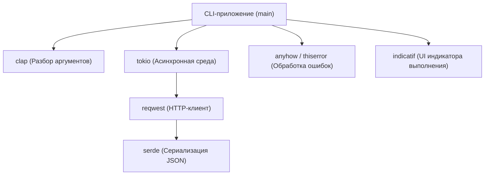
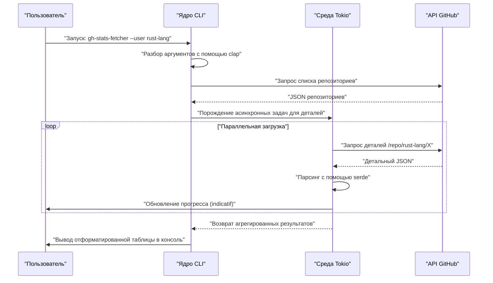
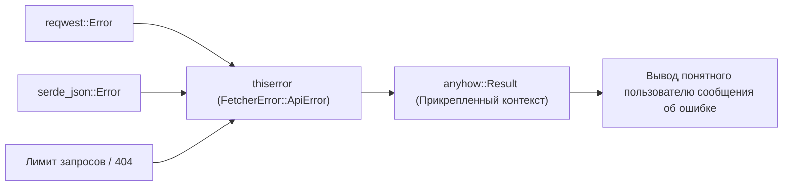

## 1. Введение

В современной разработке программного обеспечения CLI-инструменты (интерфейсы командной строки) являются неотъемлемой частью, которая значительно повышает производительность разработчиков. Раньше доминировали shell-скрипты, Python, Ruby и т. д., но в последние годы **Rust** уверенно занял позицию стандарта де-факто для разработки CLI-инструментов.

В этой статье мы подробно рассмотрим процесс создания практичных CLI-инструментов на Rust, которые «работают молниеносно и разрабатываются сверхбыстро», от основ до продвинутых концепций. Мы охватим всё: от создания просто рабочего продукта до надежной обработки ошибок коммерческого уровня, быстрых запросов к API с использованием асинхронной обработки и реализации индикаторов выполнения (progress bar), улучшающих пользовательский опыт (UX).

Дочитав эту статью до конца, вы освоите следующий продвинутый стек технологий Rust и сможете публиковать собственные мощные CLI-инструменты для всего мира.

---

## 2. Почему стоит выбрать Rust для разработки CLI-инструментов?

Причина, по которой Rust высоко ценится при разработке CLI, кроется не только в том, что это «модно». Существуют явные технические и архитектурные преимущества.

### 2.1. Единый бинарный файл и кросс-компиляция
При распространении инструментов, написанных на Python или Node.js, необходимо, чтобы в среде пользователя была установлена среда выполнения (интерпретатор Python или Node.js). Кроме того, часто возникают проблемы с конфликтами версий зависимостей (так называемый «ад зависимостей»).
С другой стороны, поскольку Rust предварительно компилируется в машинный код, он генерирует **единый исполняемый бинарный файл**, включающий все зависимости. Пользователь может просто загрузить бинарный файл, разместить его и сразу использовать инструмент, что делает порог входа крайне низким. Кроме того, кросс-компиляция выполняется легко: бинарные файлы для Windows, macOS и Linux можно собрать в единой среде CI.

### 2.2. Невероятная скорость выполнения и экономия памяти
Rust не имеет сборщика мусора (GC) и, благодаря абстракциям с нулевой стоимостью, демонстрирует производительность на уровне C/C++. В CLI-инструментах короткое время запуска напрямую влияет на UX. В отличие от языков для JVM, здесь нет времени на «прогрев» при запуске, и огромным преимуществом является то, что процесс начинается в тот момент, когда вы вводите команду.

### 2.3. Безопасность благодаря строгой системе типов и модели владения
Самое сильное оружие Rust — модель владения (Ownership) и строгая система типов, благодаря которым ошибки, такие как утечки памяти и состояния гонки данных, устраняются на этапе компиляции. Опыт, когда «если компилируется, то почти наверняка работает как задумано», дает разработчику колоссальную уверенность при создании приложений, напрямую работающих с системными ресурсами, какими являются CLI-инструменты.

---

## 3. Мощные крейты (crates), используемые в этом руководстве

В экосистеме Rust существует множество отличных крейтов (библиотек), которые мощно поддерживают разработку CLI. В этом руководстве мы будем использовать следующие крейты, которые можно назвать «золотым стеком» современной разработки CLI на Rust.

1. **`clap`**: Самый мощный и популярный крейт для разбора аргументов командной строки. Начиная с 4-й версии, декларативное определение с использованием макросов Derive стало более элегантным, также поддерживается автоматическая генерация сообщений справки и скриптов автодополнения.
2. **`tokio`**: Стандарт де-факто асинхронной среды выполнения Rust. Позволяет чрезвычайно эффективно обрабатывать асинхронный ввод-вывод в многопоточной среде.
3. **`reqwest`**: Продвинутый HTTP-клиент, работающий поверх `tokio`. Имеет простой в использовании API и позволяет легко реализовывать асинхронные API-запросы.
4. **`serde` & `serde_json`**: Фреймворк для сериализации и десериализации данных. Незаменим для отображения JSON-ответов API в типобезопасные структуры Rust.
5. **`indicatif`**: Предоставляет богатые и настраиваемые индикаторы выполнения (progress bars). Визуализирует прогресс асинхронных операций и кардинально улучшает UX командной строки.
6. **`anyhow` & `thiserror`**: Мощная комбинация для обработки ошибок. Лучшая практика — использовать `thiserror` для определения доменных ошибок внутри библиотек и `anyhow` для агрегирования ошибок на верхнем уровне приложения.

На диаграмме ниже показана архитектура взаимодействия этих крейтов в приложении.



---

## 4. Математическая база асинхронной обработки и производительности

Инструмент, который мы разработаем в этом руководстве, будет отправлять запросы к нескольким конечным точкам API параллельно. Давайте рассмотрим математическую базу того, почему использование асинхронной среды выполнения, такой как `tokio`, приводит к резкому увеличению скорости.

### 4.1. Закон Амдала (Amdahl's Law)
Общий показатель улучшения производительности за счет распараллеливания/асинхронизации части системы описывается законом Амдала следующим образом:

$$
S(N) = \frac{1}{(1 - P) + \frac{P}{N}}
$$

Где:
- $S(N)$ — теоретическое максимальное ускорение
- $P$ — доля программы, которую можно распараллелить (сделать асинхронной)
- $N$ — уровень параллелизма задач, которые могут выполняться одновременно

Для инструментов, извлекающих данные из API, большая часть времени выполнения приходится на ожидание ответа сети (задачи, ограниченные вводом-выводом). Следовательно, значение $P$ очень велико (например, $0.95$ и более). В синхронной программе $N = 1$, но, используя асинхронный ввод-вывод, $N$ можно увеличить до нескольких тысяч, и теоретически $S(N)$ резко возрастает.

### 4.2. Закон Литтла (Little's Law) и пропускная способность
При обработке сетевых запросов среднее количество одновременных запросов в системе $L$, средняя пропускная способность $\lambda$ (количество завершенных операций в единицу времени) и среднее время ответа $W$ связаны следующим образом:

$$
L = \lambda W \implies \lambda = \frac{L}{W}
$$

Иными словами, в среде, где невозможно избежать сетевой задержки $W$, для повышения пропускной способности системы $\lambda$ единственный выход — увеличить количество одновременно обрабатываемых запросов $L$. Поскольку асинхронные задачи в Rust имеют крайне низкие накладные расходы по памяти в отличие от собственных потоков ОС, масштабирование $L$ происходит очень легко.

---

## 5. Проектирование разрабатываемого инструмента: Массовый загрузчик репозиториев GitHub

В качестве практического примера мы разработаем инструмент **`gh-stats-fetcher`**, который извлекает список публичных репозиториев указанного пользователя или организации GitHub, параллельно запрашивает статистику по каждому из них (количество звезд, форков, язык программирования и т. д.) и выводит отформатированные данные в терминал.

### Последовательность выполнения инструмента



---

## 6. Инициализация проекта и настройка зависимостей

Сначала давайте создадим новый проект с помощью Cargo.

```bash
cargo new gh-stats-fetcher
cd gh-stats-fetcher
```

Затем добавим необходимые зависимости в `Cargo.toml`.

```toml
[package]
name = "gh-stats-fetcher"
version = "0.1.0"
edition = "2021"
authors = ["Your Name <your.email@example.com>"]
description = "A blazing fast CLI tool to fetch GitHub repository stats."

[dependencies]
clap = { version = "4.4", features = ["derive"] }
tokio = { version = "1.34", features = ["full"] }
reqwest = { version = "0.11", features = ["json", "rustls-tls"], default-features = false }
serde = { version = "1.0", features = ["derive"] }
serde_json = "1.0"
indicatif = "0.17"
anyhow = "1.0"
thiserror = "1.0"
```

> **Примечание**: Для `reqwest` вместо стандартного бэкенда TLS используется `rustls-tls`. Это устраняет необходимость в системно-зависимых библиотеках, таких как OpenSSL, и облегчает создание полностью статически слинкованного единого бинарного файла.

---

## 7. Этап реализации 1: Создание базы обработки ошибок

Для создания надежного CLI-инструмента решающее значение имеет архитектура обработки ошибок. Здесь мы применим на практике правильное использование `thiserror` и `anyhow`.

Специфические для домена ошибки определяются в `src/error.rs`.

```rust
// src/error.rs
use thiserror::Error;

#[derive(Error, Debug)]
pub enum FetcherError {
    #[error("API Request failed: {0}")]
    ApiError(#[from] reqwest::Error),
    
    #[error("Failed to parse JSON: {0}")]
    ParseError(#[from] serde_json::Error),
    
    #[error("GitHub API Rate limit exceeded. Try again later.")]
    RateLimitExceeded,
    
    #[error("Target user or organization '{0}' not found.")]
    NotFound(String),
}
```



---

## 8. Этап реализации 2: Разбор аргументов с помощью clap

Далее определим аргументы CLI. Создадим `src/cli.rs` и используем макрос Derive из `clap`.

```rust
// src/cli.rs
use clap::{Parser, Subcommand};

#[derive(Parser, Debug)]
#[command(name = "gh-stats-fetcher")]
#[command(author, version, about, long_about = None)]
pub struct Cli {
    #[command(subcommand)]
    pub command: Commands,
}

#[derive(Subcommand, Debug)]
pub enum Commands {
    /// Извлекает статистику для конкретного пользователя
    Fetch {
        /// Имя пользователя или организации GitHub
        #[arg(short, long)]
        user: String,
        
        /// Количество одновременных запросов
        #[arg(short, long, default_value_t = 10)]
        concurrency: usize,
    },
}
```

Благодаря этому автоматически будет сгенерировано красивое сообщение справки, как показано ниже:

```text
$ gh-stats-fetcher --help
A blazing fast CLI tool to fetch GitHub repository stats.

Usage: gh-stats-fetcher <COMMAND>

Commands:
  fetch  Fetch stats for a specific user
  help   Print this message or the help of the given subcommand(s)
```

---

## 9. Этап реализации 3: API-клиент и маппинг данных

Отобразим JSON-данные, возвращаемые API GitHub, на структуры Rust. Реализуем `src/models.rs` и `src/api.rs`.

```rust
// src/models.rs
use serde::{Deserialize, Serialize};

#[derive(Debug, Deserialize, Serialize)]
pub struct Repository {
    pub name: String,
    pub html_url: String,
    pub stargazers_count: u32,
    pub forks_count: u32,
    pub language: Option<String>,
}
```

```rust
// src/api.rs
use crate::models::Repository;
use crate::error::FetcherError;
use reqwest::Client;

pub struct GitHubClient {
    client: Client,
}

impl GitHubClient {
    pub fn new() -> Result<Self, FetcherError> {
        let client = Client::builder()
            .user_agent("gh-stats-fetcher/0.1.0")
            .build()?;
        Ok(Self { client })
    }

    pub async fn fetch_repos(&self, user: &str) -> Result<Vec<Repository>, FetcherError> {
        let url = format!("https://api.github.com/users/{}/repos?per_page=100", user);
        let res = self.client.get(&url).send().await?;

        if res.status() == 404 {
            return Err(FetcherError::NotFound(user.to_string()));
        } else if res.status() == 403 {
            return Err(FetcherError::RateLimitExceeded);
        }

        let repos = res.json::<Vec<Repository>>().await?;
        Ok(repos)
    }
}
```

---

## 10. Этап реализации 4: Параллельная обработка и индикатор выполнения с tokio и indicatif

Это самая интересная часть инструмента. Мы выполним параллельную обработку полученного списка репозиториев и отобразим красивый индикатор выполнения.

```rust
// src/main.rs
mod cli;
mod error;
mod models;
mod api;

use clap::Parser;
use cli::{Cli, Commands};
use api::GitHubClient;
use anyhow::{Context, Result};
use indicatif::{ProgressBar, ProgressStyle};
use std::sync::Arc;
use tokio::sync::Semaphore;

#[tokio::main]
async fn main() -> Result<()> {
    let cli = Cli::parse();

    match cli.command {
        Commands::Fetch { user, concurrency } => {
            println!("Fetching repositories for {}...", user);
            
            let client = Arc::new(GitHubClient::new().context("Failed to initialize API client")?);
            let repos = client.fetch_repos(&user).await.context("Failed to fetch repository list")?;
            
            println!("Found {} repositories. Analyzing...", repos.len());

            let pb = ProgressBar::new(repos.len() as u64);
            pb.set_style(ProgressStyle::default_bar()
                .template("{spinner:.green} [{elapsed_precise}] [{wide_bar:.cyan/blue}] {pos}/{len} ({eta})")
                .unwrap()
                .progress_chars("#>-"));

            // Семафор для ограничения параллелизма
            let semaphore = Arc::new(Semaphore::new(concurrency));
            let mut tasks = vec![];

            for repo in repos {
                let permit = semaphore.clone().acquire_owned().await.unwrap();
                let pb_clone = pb.clone();
                // В реальном приложении здесь выполняются тяжелые запросы к детальному API
                // В качестве демонстрации добавим асинхронный сон
                tasks.push(tokio::spawn(async move {
                    tokio::time::sleep(std::time::Duration::from_millis(100)).await;
                    pb_clone.inc(1);
                    drop(permit);
                    repo
                }));
            }

            let mut results = vec![];
            for task in tasks {
                results.push(task.await.context("Task panicked")?);
            }

            pb.finish_with_message("Done!");

            // Сортируем по количеству звезд и показываем топ-5
            results.sort_by(|a, b| b.stargazers_count.cmp(&a.stargazers_count));
            println!("\nTop 5 Repositories:");
            for (i, repo) in results.iter().take(5).enumerate() {
                let lang = repo.language.as_deref().unwrap_or("Unknown");
                println!("{}. {} (⭐ {} | 🍴 {} | 💻 {})", 
                    i + 1, repo.name, repo.stargazers_count, repo.forks_count, lang);
            }
        }
    }

    Ok(())
}
```

В этом коде `tokio::spawn` используется для диспетчеризации задач фоновым воркерам, а `tokio::sync::Semaphore` — для ограничения количества одновременно выполняемых запросов к API (по умолчанию 10). Это снижает риск попадания под лимиты API и в то же время обеспечивает подавляющее преимущество в скорости по сравнению с синхронной обработкой.

---

## 11. Продвинутые темы: Тестирование и оптимизация

### 11.1. Интеграционное тестирование CLI-инструмента
Для тестирования поведения самого CLI-инструмента очень удобен крейт `assert_cmd`. Создадим `tests/cli_test.rs` для вызова бинарного файла и проверки стандартного вывода.

```rust
// tests/cli_test.rs
use assert_cmd::Command;
use predicates::prelude::*;

#[test]
fn test_help_message() {
    let mut cmd = Command::cargo_bin("gh-stats-fetcher").unwrap();
    cmd.arg("--help")
        .assert()
        .success()
        .stdout(predicate::str::contains("Usage: gh-stats-fetcher"));
}
```

### 11.2. Экстремальная оптимизация релизной сборки
Сборка по умолчанию для релиза уже достаточно быстрая, но для уменьшения размера бинарного файла и максимального повышения скорости выполнения мы настроим `[profile.release]` в `Cargo.toml`.

```toml
[profile.release]
opt-level = 3       # Максимальный уровень оптимизации
lto = true          # Включение оптимизации на этапе компоновки (Link Time Optimization)
codegen-units = 1   # Установка единиц кодогенерации на 1 для максимизации оптимизации (увеличивает время сборки)
panic = "abort"     # Немедленное прерывание без разматывания стека при панике (уменьшает размер)
strip = true        # Удаление отладочных символов для радикального уменьшения размера бинарного файла
```

Применение этих настроек уменьшает размер генерируемого бинарного файла на несколько мегабайт, что еще больше упрощает его распространение среди пользователей.

---

## 12. CI/CD и распространение (Publishing)

Это шаги для распространения созданного инструмента по всему миру.

### Публикация на crates.io
С помощью пакетного менеджера Cargo можно опубликовать пакет в официальном реестре всего парой команд.

```bash
cargo login <ВАШ_ТОКЕН>
cargo publish
```
После публикации пользователи со всего мира смогут установить ваш инструмент с помощью простой команды `cargo install gh-stats-fetcher`.

### Автоматические релизы с GitHub Actions
Мы создадим конвейер CI/CD, который будет автоматически загружать кросс-компилированные бинарные файлы в GitHub Releases. Добавьте следующие настройки в `.github/workflows/release.yml`. Благодаря этому при пуше тега бинарные файлы для Linux, macOS и Windows будут собираться автоматически и прикрепляться как релизные ассеты (из-за ограничений формата здесь мы опускаем детальное описание YAML, но использование таких Actions, как `taiki-e/upload-rust-binary-action`, является текущей лучшей практикой).

---

## 13. Заключение

В этой статье мы подробно рассмотрели весь процесс разработки CLI-инструмента на Rust.

1. **Принципы проектирования**: Мы подтвердили безопасность и скорость Rust, а также преимущества единого бинарного файла.
2. **Выбор крейтов**: Мы обзавелись мощным арсеналом из `clap`, `tokio`, `serde`, `indicatif`, `thiserror` и `anyhow`.
3. **Математическое преимущество параллельной обработки**: На основе закона Амдала и закона Литтла мы теоретически обосновали мощь асинхронной обработки.
4. **Реализация и оптимизация**: Мы собрали множество практических ноу-хау, от надежной обработки ошибок до экстремальной оптимизации бинарного файла.

Разработка CLI на Rust — это потрясающий опыт, который позволяет гарантировать качество программного обеспечения еще на этапе проектирования посредством диалога с компилятором. Возьмите созданный нами базовый код и попробуйте разработать свой собственный, оригинальный CLI-инструмент и поделиться им с миром! Happy Rust Coding!
