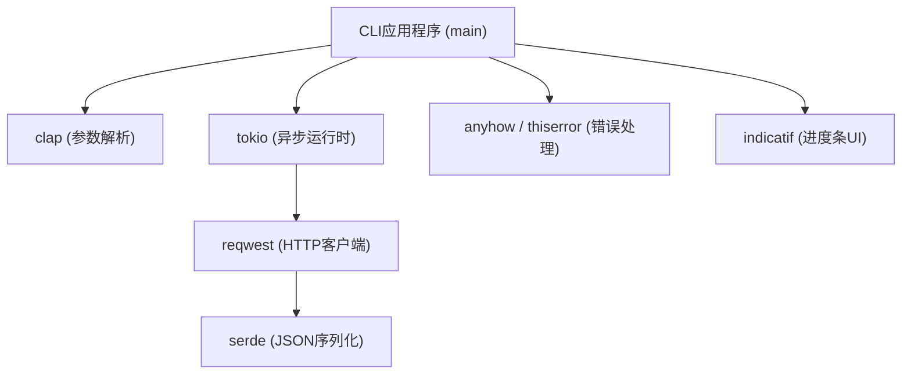
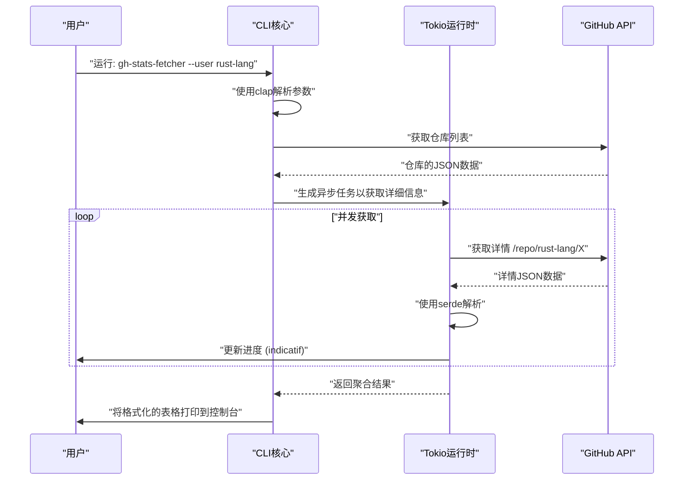
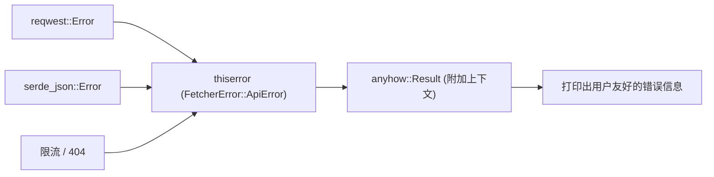

## 1. 简介

在现代软件开发中，CLI（命令行界面）工具是大幅提升开发者生产力不可或缺的存在。过去，Shell 脚本、Python、Ruby 等是主流，但近年来，**Rust** 已经作为 CLI 工具开发的业界标准确立了稳固的地位。

本文将彻底讲解如何从基础到高级，使用 Rust 构建“运行爆速、开发爆速”的实用 CLI 工具。我们不仅仅是做一个能动的东西，还将全面涵盖达到商业级别水准的健壮错误处理、使用异步处理实现的高速 API 请求，以及提升用户体验（UX）的进度条实现。

通过阅读本文直到最后，你将掌握以下高级 Rust 技术栈，并能够向世界发布你自己强大的 CLI 工具。

---

## 2. 为什么选择 Rust 进行 CLI 工具开发？

Rust 在 CLI 开发中获得高度评价的原因，并不仅仅是因为“它很流行”。它具有明确的技术和架构优势。

### 2.1. 单一二进制文件与交叉编译
在分发使用 Python 或 Node.js 编写的工具时，用户的环境中必须安装有运行时（Python 解释器或 Node.js）。此外，经常会为依赖包的版本冲突（所谓的“依赖地狱”）而感到烦恼。
另一方面，由于 Rust 会提前编译为本机代码，因此它会生成一个包含所有依赖关系的**单一可执行二进制文件**。用户只需下载并放置该二进制文件即可使用该工具，引入的门槛极低。此外，交叉编译也很容易，可以在单个 CI 环境中构建面向 Windows、macOS 和 Linux 的二进制文件。

### 2.2. 压倒性的执行速度与省内存
Rust 没有垃圾回收器（GC），通过零成本抽象，它能发挥出与 C/C++ 同等的性能。在 CLI 工具中，启动时间的短暂直接关系到 UX。与 JVM 语言不同，它没有启动时的预热时间，敲下命令的瞬间就开始处理，这是一个巨大的优势。

### 2.3. 强大的类型系统和所有权模型带来的安全性
借助 Rust 最大的武器——所有权（Ownership）模型和强大的类型系统，内存泄漏和数据竞争等 bug 在编译时就会被排除。“只要编译通过，几乎肯定能按预期运行”的体验，在开发像 CLI 工具这样直接接触系统资源的应用程序时，给开发者带来了极大的安心感。

---

## 3. 本教程采用的最强 Crate 群

Rust 的生态系统中存在许多强力支持 CLI 开发的优秀 Crate（库）。在本教程中，我们将使用以下可以称为现代 Rust CLI 开发中“黄金技术栈”的 Crate。

1. **`clap`**: 这是在命令行参数解析方面最强大和最受欢迎的 Crate。自版本 4 以来，使用 Derive 宏的声明式定义变得更加精炼，并且支持自动生成帮助信息和输入补全脚本。
2. **`tokio`**: Rust 异步运行时的业界标准。它极度高效地处理多线程环境下的异步 I/O。
3. **`reqwest`**: 运行在 `tokio` 上的高功能 HTTP 客户端。具备易用的 API，能够轻松实现异步 API 请求。
4. **`serde` & `serde_json`**: 执行数据序列化和反序列化的框架。为了将 API 的 JSON 响应映射到 Rust 的类型安全结构体中，它是必不可少的。
5. **`indicatif`**: 提供丰富且可定制的进度条。直观地显示异步处理的进度，大幅提升 CLI 的 UX。
6. **`anyhow` & `thiserror`**: 错误处理的强大组合。最佳实践是使用 `thiserror` 定义库内部的领域错误，并在应用程序的最顶层使用 `anyhow` 进行错误汇总。

下图显示了这些 Crate 在应用程序中是如何协同工作的架构图。



---

## 4. 异步处理与性能的数学背景

本教程开发的工具将并发地向多个 API 端点发送请求。为什么使用像 `tokio` 这样的异步运行时会使速度发生戏剧性的提升，让我们确认一下其数学背景。

### 4.1. 阿姆达尔定律 (Amdahl's Law)
通过将系统的一部分并发化、异步化所带来的整体性能提升率，由阿姆达尔定律公式化如下：

$$
S(N) = \frac{1}{(1 - P) + \frac{P}{N}}
$$

在这里，
- $S(N)$ 是理论上的最大加速比
- $P$ 是程序中可并发化（异步化）部分的比例
- $N$ 是可同时执行任务的并发度

对于从 API 获取数据这类工具，大部分的执行时间都在等待网络响应（I/O 密集型）。因此，$P$ 的值会非常大（例如 $0.95$ 以上）。在同步程序中 $N = 1$，但是通过使用异步 I/O，可以将 $N$ 提高到数千的规模，理论上 $S(N)$ 会呈飞跃性增长。

### 4.2. 利特尔法则 (Little's Law) 与吞吐量
在处理网络请求时，系统内的平均并发请求数 $L$、平均吞吐量 $\lambda$（单位时间内完成的处理数）以及平均响应时间 $W$ 之间存在以下关系：

$$
L = \lambda W \implies \lambda = \frac{L}{W}
$$

也就是说，在网络延迟 $W$ 无法避免的环境下，要提高系统的吞吐量 $\lambda$，唯一的办法就是增加同时处理的请求数 $L$。Rust 的异步任务与 OS 的原生线程不同，其内存开销极小，因此可以轻松地横向扩展 $L$。

---

## 5. 开发的工具设计：GitHub 仓库批量获取器

这次作为一个实战示例，我们将开发一个名为 **`gh-stats-fetcher`** 的工具。该工具将获取指定的 GitHub 用户或 Organization 的公开仓库列表，并发地拉取各自的星标数、复刻（Fork）数、语言等统计信息，并将它们格式化显示在终端上。

### 工具的执行时序



---

## 6. 项目初始化与依赖设置

首先，使用 Cargo 创建一个新项目。

```bash
cargo new gh-stats-fetcher
cd gh-stats-fetcher
```

接着，将所需的依赖项添加到 `Cargo.toml` 中。

```toml
[package]
name = "gh-stats-fetcher"
version = "0.1.0"
edition = "2021"
authors = ["Your Name <your.email@example.com>"]
description = "A blazing fast CLI tool to fetch GitHub repository stats."

[dependencies]
clap = { version = "4.4", features = ["derive"] }
tokio = { version = "1.34", features = ["full"] }
reqwest = { version = "0.11", features = ["json", "rustls-tls"], default-features = false }
serde = { version = "1.0", features = ["derive"] }
serde_json = "1.0"
indicatif = "0.17"
anyhow = "1.0"
thiserror = "1.0"
```

> **要点**: 在 `reqwest` 中，我们使用了 `rustls-tls` 来代替默认的 TLS 后端。这消除了对 OpenSSL 等系统依赖库的需求，从而更容易构建完全静态链接的单一二进制文件。

---

## 7. 实现阶段 1: 构建错误处理的基础

为了制作健壮的 CLI 工具，错误处理的设计是关键。在这里，我们将实践 `thiserror` 和 `anyhow` 的不同用法。

领域特有的错误定义在 `src/error.rs` 中。

```rust
// src/error.rs
use thiserror::Error;

#[derive(Error, Debug)]
pub enum FetcherError {
    #[error("API Request failed: {0}")]
    ApiError(#[from] reqwest::Error),
    
    #[error("Failed to parse JSON: {0}")]
    ParseError(#[from] serde_json::Error),
    
    #[error("GitHub API Rate limit exceeded. Try again later.")]
    RateLimitExceeded,
    
    #[error("Target user or organization '{0}' not found.")]
    NotFound(String),
}
```



---

## 8. 实现阶段 2: 使用 clap 解析参数

接下来，定义 CLI 的参数。创建 `src/cli.rs`，并使用 `clap` 的 Derive 宏。

```rust
// src/cli.rs
use clap::{Parser, Subcommand};

#[derive(Parser, Debug)]
#[command(name = "gh-stats-fetcher")]
#[command(author, version, about, long_about = None)]
pub struct Cli {
    #[command(subcommand)]
    pub command: Commands,
}

#[derive(Subcommand, Debug)]
pub enum Commands {
    /// Fetch stats for a specific user
    Fetch {
        /// The GitHub username or organization name
        #[arg(short, long)]
        user: String,
        
        /// Number of concurrent requests
        #[arg(short, long, default_value_t = 10)]
        concurrency: usize,
    },
}
```

这样，就能自动生成如下优美的帮助信息。

```text
$ gh-stats-fetcher --help
A blazing fast CLI tool to fetch GitHub repository stats.

Usage: gh-stats-fetcher <COMMAND>

Commands:
  fetch  Fetch stats for a specific user
  help   Print this message or the help of the given subcommand(s)
```

---

## 9. 实现阶段 3: API 客户端与数据映射

将从 GitHub API 返回的 JSON 数据映射到 Rust 的结构体中。实现 `src/models.rs` 和 `src/api.rs`。

```rust
// src/models.rs
use serde::{Deserialize, Serialize};

#[derive(Debug, Deserialize, Serialize)]
pub struct Repository {
    pub name: String,
    pub html_url: String,
    pub stargazers_count: u32,
    pub forks_count: u32,
    pub language: Option<String>,
}
```

```rust
// src/api.rs
use crate::models::Repository;
use crate::error::FetcherError;
use reqwest::Client;

pub struct GitHubClient {
    client: Client,
}

impl GitHubClient {
    pub fn new() -> Result<Self, FetcherError> {
        let client = Client::builder()
            .user_agent("gh-stats-fetcher/0.1.0")
            .build()?;
        Ok(Self { client })
    }

    pub async fn fetch_repos(&self, user: &str) -> Result<Vec<Repository>, FetcherError> {
        let url = format!("https://api.github.com/users/{}/repos?per_page=100", user);
        let res = self.client.get(&url).send().await?;

        if res.status() == 404 {
            return Err(FetcherError::NotFound(user.to_string()));
        } else if res.status() == 403 {
            return Err(FetcherError::RateLimitExceeded);
        }

        let repos = res.json::<Vec<Repository>>().await?;
        Ok(repos)
    }
}
```

---

## 10. 实现阶段 4: 结合 tokio 和 indicatif 的并发处理与进度条

这里是本工具的亮点。对获取到的仓库列表进行并发处理，并显示优美的进度条。

```rust
// src/main.rs
mod cli;
mod error;
mod models;
mod api;

use clap::Parser;
use cli::{Cli, Commands};
use api::GitHubClient;
use anyhow::{Context, Result};
use indicatif::{ProgressBar, ProgressStyle};
use std::sync::Arc;
use tokio::sync::Semaphore;

#[tokio::main]
async fn main() -> Result<()> {
    let cli = Cli::parse();

    match cli.command {
        Commands::Fetch { user, concurrency } => {
            println!("Fetching repositories for {}...", user);
            
            let client = Arc::new(GitHubClient::new().context("Failed to initialize API client")?);
            let repos = client.fetch_repos(&user).await.context("Failed to fetch repository list")?;
            
            println!("Found {} repositories. Analyzing...", repos.len());

            let pb = ProgressBar::new(repos.len() as u64);
            pb.set_style(ProgressStyle::default_bar()
                .template("{spinner:.green} [{elapsed_precise}] [{wide_bar:.cyan/blue}] {pos}/{len} ({eta})")
                .unwrap()
                .progress_chars("#>-"));

            // 用于限制并发数的信号量
            let semaphore = Arc::new(Semaphore::new(concurrency));
            let mut tasks = vec![];

            for repo in repos {
                let permit = semaphore.clone().acquire_owned().await.unwrap();
                let pb_clone = pb.clone();
                // 在实际应用中，这里会调用详细的 API 等繁重的处理
                // 本次作为演示，我们加入了一个异步休眠
                tasks.push(tokio::spawn(async move {
                    tokio::time::sleep(std::time::Duration::from_millis(100)).await;
                    pb_clone.inc(1);
                    drop(permit);
                    repo
                }));
            }

            let mut results = vec![];
            for task in tasks {
                results.push(task.await.context("Task panicked")?);
            }

            pb.finish_with_message("Done!");

            // 按星标数排序并显示前 5 名
            results.sort_by(|a, b| b.stargazers_count.cmp(&a.stargazers_count));
            println!("\nTop 5 Repositories:");
            for (i, repo) in results.iter().take(5).enumerate() {
                let lang = repo.language.as_deref().unwrap_or("Unknown");
                println!("{}. {} (⭐ {} | 🍴 {} | 💻 {})", 
                    i + 1, repo.name, repo.stargazers_count, repo.forks_count, lang);
            }
        }
    }

    Ok(())
}
```

在这段代码中，使用了 `tokio::spawn` 将任务分发给后台工作线程，同时使用 `tokio::sync::Semaphore` 来限制并发执行的 API 请求数量（默认 10 个并发）。借此，我们在降低触发 API 限流风险的同时，实现了超越同步处理的压倒性速度。

---

## 11. 高级主题: 测试与优化

### 11.1. CLI 工具的集成测试
为了测试 CLI 工具本身的行为，`assert_cmd` Crate 非常方便。创建 `tests/cli_test.rs`，并调用实际的二进制文件以验证标准输出。

```rust
// tests/cli_test.rs
use assert_cmd::Command;
use predicates::prelude::*;

#[test]
fn test_help_message() {
    let mut cmd = Command::cargo_bin("gh-stats-fetcher").unwrap();
    cmd.arg("--help")
        .assert()
        .success()
        .stdout(predicate::str::contains("Usage: gh-stats-fetcher"));
}
```

### 11.2. 发布构建的极限优化
虽然默认的发布构建已经足够快，但为了减小二进制文件的大小并将执行速度提升到极限，我们需要设置 `Cargo.toml` 中的 `[profile.release]`。

```toml
[profile.release]
opt-level = 3       # 最高级别的优化
lto = true          # 启用链接时优化（Link Time Optimization）
codegen-units = 1   # 将编译单元设为 1 以最大化优化（构建时间会变长）
panic = "abort"     # 发生恐慌时不回溯堆栈跟踪，而是立即中止（减小体积）
strip = true        # 移除符号信息，极大地减小二进制文件的体积
```

应用这些设置后，生成的二进制文件体积会减小数兆字节，从而使其更容易分发给用户。

---

## 12. CI/CD 与分发 (Publishing)

这是将创建的工具分发到世界各地的步骤。

### 发布到 crates.io
使用 Rust 的包管理器 Cargo，只需几个命令即可将其发布到官方注册表。

```bash
cargo login <YOUR_TOKEN>
cargo publish
```
发布后，世界各地的用户只需通过一条 `cargo install gh-stats-fetcher` 命令就能安装你的工具了。

### 借助 GitHub Actions 自动发布
构建 CI/CD 流水线，将交叉编译后的二进制文件自动上传到 GitHub Releases。在 `.github/workflows/release.yml` 中写入如下设置。这样一来，只需推送标签（tag），就能自动构建适用于 Linux、macOS、Windows 的二进制文件，并作为发布资产附加（受篇幅限制，这里省略了详细的 YAML 描述，但目前最佳实践是使用诸如 `taiki-e/upload-rust-binary-action` 的 Action）。

---

## 13. 总结

本文详细讲解了使用 Rust 开发 CLI 工具的一系列流程。

1. **设计方针**: 确认了 Rust 的安全性与高速度，以及单一二进制文件的优势。
2. **Crate 选型**: 掌握了 `clap`, `tokio`, `serde`, `indicatif`, `thiserror`, `anyhow` 等强大武器。
3. **并发处理的数学优势**: 基于阿姆达尔定律和利特尔法则，从理论上理解了异步处理的威力。
4. **实现与优化**: 从健壮的错误处理到极限的二进制优化，注入了实用的技术诀窍。

使用 Rust 进行 CLI 开发，能通过与编译器的对话，在设计阶段就确保软件质量，是一种绝佳的体验。请务必以本次创建的基础代码为起点，开发出只属于你的原创 CLI 工具，并向全世界发布吧！Happy Rust Coding!
