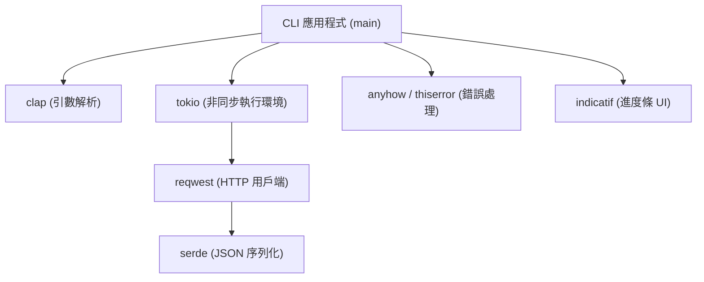
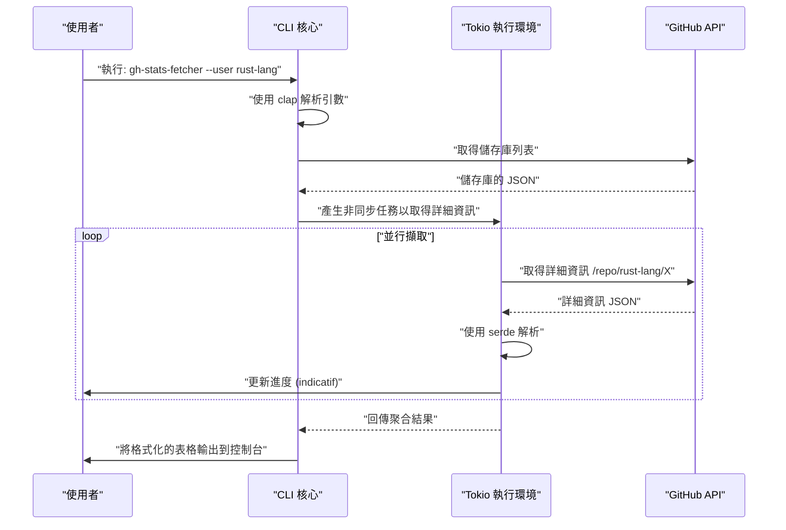
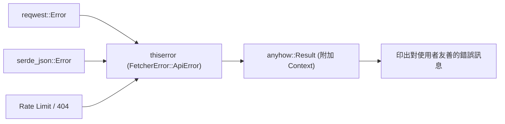

## 1. 簡介

在現代的軟體開發中，CLI（命令列介面）工具是大幅提升開發者生產力不可或缺的存在。過去主要以 Shell 腳本、Python、Ruby 等為主流，但近年來 **Rust** 在 CLI 工具開發領域已經確立了事實標準（De facto standard）的堅固地位。

本文將從基礎到進階，徹底解說如何使用 Rust 建構「爆速執行、爆速開發」的實用 CLI 工具。我們不只是要做出會動的東西，還將全面涵蓋商業級別的穩健錯誤處理（Error Handling）、使用非同步處理的高速 API 請求，以及能夠提升使用者體驗（UX）的進度條實作。

讀完本文後，你將能夠掌握以下的高階 Rust 技術堆疊，並將自己開發的強大 CLI 工具發佈到全世界。

---

## 2. 為什麼選擇 Rust 來開發 CLI 工具？

Rust 在 CLI 開發中受到高度評價的原因，不僅僅是因為「正在流行」。它具備明確的技術與架構上的優勢。

### 2.1. 單一執行檔與交叉編譯
當發佈使用 Python 或 Node.js 編寫的工具時，使用者的環境必須安裝執行環境（Python 直譯器或 Node.js）。此外，還經常會面臨依賴套件的版本衝突（即所謂的「依賴地獄」）。
另一方面，Rust 會事先編譯成原生程式碼，並產生包含依賴關係的**單一執行檔（Binary）**。使用者只需下載並放置該執行檔即可使用工具，導入的門檻極低。此外，交叉編譯也非常容易，可以在單一的 CI 環境中建置 Windows、macOS 和 Linux 的執行檔。

### 2.2. 壓倒性的執行速度與節省記憶體
Rust 沒有垃圾回收機制（GC），並透過零成本抽象化展現出與 C/C++ 同等的效能。在 CLI 工具中，啟動時間的長短直接影響 UX。不像 JVM 語言有啟動時的暖機時間，打出指令的瞬間就能開始處理是一大優勢。

### 2.3. 透過強大的型別系統與所有權模型保證安全性
Rust 最大的武器——所有權（Ownership）模型與強大的型別系統，能夠在編譯時期排除記憶體洩漏與資料競爭等 Bug。「只要編譯通過，就幾乎肯定能如預期般運作」的體驗，對於開發 CLI 工具這種直接接觸系統資源的應用程式來說，帶給開發者極大的安心感。

---

## 3. 本教學採用的最強 Crate 群

在 Rust 的生態圈中，有許多能強力支援 CLI 開發的優秀 Crate（函式庫）。本教學將使用以下堪稱現代 Rust CLI 開發「黃金堆疊」的 Crate：

1. **`clap`**：在命令列引數解析中最強大且最受歡迎的 Crate。從版本 4 開始，使用 Derive 巨集的宣告式定義變得更加洗鍊，並支援自動產生說明訊息與輸入自動完成腳本。
2. **`tokio`**：Rust 非同步執行環境（Runtime）的事實標準。能極為有效率地處理多執行緒中的非同步 I/O。
3. **`reqwest`**：在 `tokio` 上運作的高功能 HTTP 用戶端。具備易於使用的 API，可以輕鬆實作非同步 API 請求。
4. **`serde` & `serde_json`**：執行資料序列化與反序列化的框架。對於將 API 的 JSON 回應對應到 Rust 型別安全的結構體來說不可或缺。
5. **`indicatif`**：提供豐富且可客製化的進度條。能將非同步處理的進度視覺化，大幅提升 CLI 的 UX。
6. **`anyhow` & `thiserror`**：錯誤處理的強大組合。最佳實踐是：在函式庫內部的領域錯誤定義使用 `thiserror`，而在應用程式最上層的錯誤聚合則使用 `anyhow`。

下圖展示了這些 Crate 在應用程式中如何協同運作的架構圖。



---

## 4. 非同步處理與效能的數學背景

本教學中開發的工具將同時對多個 API 端點發送請求。為什麼使用像 `tokio` 這樣的非同步執行環境會讓速度大幅提升？我們來確認一下它的數學背景。

### 4.1. 阿姆達爾定律 (Amdahl's Law)
透過將系統的一部分並行化、非同步化所帶來的整體效能提升率，可以根據阿姆達爾定律公式化如下：

$$
S(N) = \frac{1}{(1 - P) + \frac{P}{N}}
$$

這裡：
- $S(N)$ 是理論上的最大加速率
- $P$ 是程式內可並行化（非同步化）部分的比例
- $N$ 是能同時執行處理的任務並行度

對於從 API 取得資料的工具來說，大部分的執行時間都在等待網路回應（I/O 密集型）。因此，$P$ 的值會非常大（例如 $0.95$ 以上）。在同步程式中 $N = 1$，但透過非同步 I/O，可以將 $N$ 提升到數千的規模，理論上 $S(N)$ 將會飛躍性地增加。

### 4.2. 利特爾法則 (Little's Law) 與吞吐量
處理網路請求時，系統內的平均同時請求數 $L$、平均吞吐量 $\lambda$（單位時間內的處理完成數）與平均回應時間 $W$ 之間存在以下關係：

$$
L = \lambda W \implies \lambda = \frac{L}{W}
$$

也就是說，在無可避免網路延遲 $W$ 的環境下，要提升系統的吞吐量 $\lambda$，唯一的辦法就是增加同時處理的請求數 $L$。Rust 的非同步任務與作業系統的原生執行緒不同，記憶體開銷極小，因此可以輕鬆擴展 $L$。

---

## 5. 開發工具的設計：GitHub 儲存庫批次擷取器

這次作為實用範例，我們將開發一個名為 **`gh-stats-fetcher`** 的工具。它會取得指定 GitHub 使用者或組織的公開儲存庫列表，同時並行擷取各自的 Star 數、Fork 數、語言等統計資訊，最後在終端機中格式化並顯示結果。

### 工具的執行時序



---

## 6. 專案初始化與設定依賴關係

首先使用 Cargo 建立一個新專案。

```bash
cargo new gh-stats-fetcher
cd gh-stats-fetcher
```

接著，在 `Cargo.toml` 中加入必要的依賴關係。

```toml
[package]
name = "gh-stats-fetcher"
version = "0.1.0"
edition = "2021"
authors = ["Your Name <your.email@example.com>"]
description = "A blazing fast CLI tool to fetch GitHub repository stats."

[dependencies]
clap = { version = "4.4", features = ["derive"] }
tokio = { version = "1.34", features = ["full"] }
reqwest = { version = "0.11", features = ["json", "rustls-tls"], default-features = false }
serde = { version = "1.0", features = ["derive"] }
serde_json = "1.0"
indicatif = "0.17"
anyhow = "1.0"
thiserror = "1.0"
```

> **重點**：在 `reqwest` 中，我們使用 `rustls-tls` 取代預設的 TLS 後端。這樣就不需要依賴 OpenSSL 等系統函式庫，能更容易建置出完全靜態連結的單一執行檔。

---

## 7. 實作階段 1：建立錯誤處理的基礎

要做出穩健的 CLI 工具，錯誤處理的設計是關鍵。這裡我們將實踐 `thiserror` 與 `anyhow` 的區分使用。

領域專屬的錯誤將定義在 `src/error.rs`。

```rust
// src/error.rs
use thiserror::Error;

#[derive(Error, Debug)]
pub enum FetcherError {
    #[error("API Request failed: {0}")]
    ApiError(#[from] reqwest::Error),
    
    #[error("Failed to parse JSON: {0}")]
    ParseError(#[from] serde_json::Error),
    
    #[error("GitHub API Rate limit exceeded. Try again later.")]
    RateLimitExceeded,
    
    #[error("Target user or organization '{0}' not found.")]
    NotFound(String),
}
```



---

## 8. 實作階段 2：使用 clap 解析引數

接著，定義 CLI 的引數。建立 `src/cli.rs` 並使用 `clap` 的 Derive 巨集。

```rust
// src/cli.rs
use clap::{Parser, Subcommand};

#[derive(Parser, Debug)]
#[command(name = "gh-stats-fetcher")]
#[command(author, version, about, long_about = None)]
pub struct Cli {
    #[command(subcommand)]
    pub command: Commands,
}

#[derive(Subcommand, Debug)]
pub enum Commands {
    /// Fetch stats for a specific user
    Fetch {
        /// The GitHub username or organization name
        #[arg(short, long)]
        user: String,
        
        /// Number of concurrent requests
        #[arg(short, long, default_value_t = 10)]
        concurrency: usize,
    },
}
```

如此一來，就會自動產生如下美觀的說明訊息：

```text
$ gh-stats-fetcher --help
A blazing fast CLI tool to fetch GitHub repository stats.

Usage: gh-stats-fetcher <COMMAND>

Commands:
  fetch  Fetch stats for a specific user
  help   Print this message or the help of the given subcommand(s)
```

---

## 9. 實作階段 3：API 用戶端與資料的對應

將 GitHub API 回傳的 JSON 資料對應到 Rust 的結構體中。實作 `src/models.rs` 與 `src/api.rs`。

```rust
// src/models.rs
use serde::{Deserialize, Serialize};

#[derive(Debug, Deserialize, Serialize)]
pub struct Repository {
    pub name: String,
    pub html_url: String,
    pub stargazers_count: u32,
    pub forks_count: u32,
    pub language: Option<String>,
}
```

```rust
// src/api.rs
use crate::models::Repository;
use crate::error::FetcherError;
use reqwest::Client;

pub struct GitHubClient {
    client: Client,
}

impl GitHubClient {
    pub fn new() -> Result<Self, FetcherError> {
        let client = Client::builder()
            .user_agent("gh-stats-fetcher/0.1.0")
            .build()?;
        Ok(Self { client })
    }

    pub async fn fetch_repos(&self, user: &str) -> Result<Vec<Repository>, FetcherError> {
        let url = format!("https://api.github.com/users/{}/repos?per_page=100", user);
        let res = self.client.get(&url).send().await?;

        if res.status() == 404 {
            return Err(FetcherError::NotFound(user.to_string()));
        } else if res.status() == 403 {
            return Err(FetcherError::RateLimitExceeded);
        }

        let repos = res.json::<Vec<Repository>>().await?;
        Ok(repos)
    }
}
```

---

## 10. 實作階段 4：透過 tokio 與 indicatif 實現並行處理與進度條

這裡是本工具的亮點。針對取得的儲存庫列表進行並行處理，並顯示美觀的進度條。

```rust
// src/main.rs
mod cli;
mod error;
mod models;
mod api;

use clap::Parser;
use cli::{Cli, Commands};
use api::GitHubClient;
use anyhow::{Context, Result};
use indicatif::{ProgressBar, ProgressStyle};
use std::sync::Arc;
use tokio::sync::Semaphore;

#[tokio::main]
async fn main() -> Result<()> {
    let cli = Cli::parse();

    match cli.command {
        Commands::Fetch { user, concurrency } => {
            println!("Fetching repositories for {}...", user);
            
            let client = Arc::new(GitHubClient::new().context("Failed to initialize API client")?);
            let repos = client.fetch_repos(&user).await.context("Failed to fetch repository list")?;
            
            println!("Found {} repositories. Analyzing...", repos.len());

            let pb = ProgressBar::new(repos.len() as u64);
            pb.set_style(ProgressStyle::default_bar()
                .template("{spinner:.green} [{elapsed_precise}] [{wide_bar:.cyan/blue}] {pos}/{len} ({eta})")
                .unwrap()
                .progress_chars("#>-"));

            // 限制並行數的號誌 (Semaphore)
            let semaphore = Arc::new(Semaphore::new(concurrency));
            let mut tasks = vec![];

            for repo in repos {
                let permit = semaphore.clone().acquire_owned().await.unwrap();
                let pb_clone = pb.clone();
                // 在實際應用中會在這裡發送詳細 API 請求等繁重處理
                // 這次作為示範加入非同步休眠
                tasks.push(tokio::spawn(async move {
                    tokio::time::sleep(std::time::Duration::from_millis(100)).await;
                    pb_clone.inc(1);
                    drop(permit);
                    repo
                }));
            }

            let mut results = vec![];
            for task in tasks {
                results.push(task.await.context("Task panicked")?);
            }

            pb.finish_with_message("Done!");

            // 依 Star 數排序並顯示前 5 名
            results.sort_by(|a, b| b.stargazers_count.cmp(&a.stargazers_count));
            println!("\nTop 5 Repositories:");
            for (i, repo) in results.iter().take(5).enumerate() {
                let lang = repo.language.as_deref().unwrap_or("Unknown");
                println!("{}. {} (⭐ {} | 🍴 {} | 💻 {})", 
                    i + 1, repo.name, repo.stargazers_count, repo.forks_count, lang);
            }
        }
    }

    Ok(())
}
```

這段程式碼中，我們使用 `tokio::spawn` 將任務分發給背景工作執行緒（Worker），同時使用 `tokio::sync::Semaphore` 來限制同時執行的 API 請求數（預設為 10 並行）。這樣可以在降低觸發 API 頻率限制風險的同時，實現比同步處理快上許多的壓倒性速度。

---

## 11. 進階主題：測試與最佳化

### 11.1. CLI 工具的整合測試
要測試 CLI 工具本身的行為，`assert_cmd` 這個 Crate 非常方便。建立 `tests/cli_test.rs`，呼叫實際的執行檔並驗證標準輸出。

```rust
// tests/cli_test.rs
use assert_cmd::Command;
use predicates::prelude::*;

#[test]
fn test_help_message() {
    let mut cmd = Command::cargo_bin("gh-stats-fetcher").unwrap();
    cmd.arg("--help")
        .assert()
        .success()
        .stdout(predicate::str::contains("Usage: gh-stats-fetcher"));
}
```

### 11.2. 釋出版本（Release Build）的極限最佳化
預設的釋出版本已經夠快了，但為了減少執行檔的容量並將執行速度提升到極限，我們可以設定 `Cargo.toml` 的 `[profile.release]`。

```toml
[profile.release]
opt-level = 3       # 最高等級的最佳化
lto = true          # 啟用連結期最佳化 (Link Time Optimization)
codegen-units = 1   # 將編譯單位設為 1 以最大化最佳化 (建置時間會變長)
panic = "abort"     # 發生 Panic 時不回溯堆疊，而是立即中止 (減少容量)
strip = true        # 移除符號資訊，大幅縮減執行檔容量
```

套用這些設定後，產生的執行檔容量可以縮減數 MB，讓發佈給使用者變得更加容易。

---

## 12. CI/CD 與發佈 (Publishing)

這是將製作好的工具發佈到全世界的步驟。

### 發佈到 crates.io
只要使用 Rust 的套件管理器 Cargo，只要短短幾個指令就能發佈到官方登錄檔（Registry）中。

```bash
cargo login <YOUR_TOKEN>
cargo publish
```
發佈後，全世界的使用者都能透過 `cargo install gh-stats-fetcher` 一行指令，輕鬆安裝你的工具。

### 透過 GitHub Actions 自動釋出
建構一個 CI/CD 流程，將交叉編譯的執行檔自動上傳到 GitHub Releases。在 `.github/workflows/release.yml` 寫入以下設定。這樣一來，只要推播 (Push) Tag，就會自動建置 Linux、macOS、Windows 用的執行檔，並作為 Release 附件上傳（由於篇幅限制，這裡省略詳細的 YAML 撰寫方式，不過目前最佳實踐是利用 `taiki-e/upload-rust-binary-action` 等 Action）。

---

## 13. 總結

本文詳細解說了使用 Rust 開發 CLI 工具的一連串流程。

1. **設計方針**：確認了 Rust 的安全性、高速性，以及單一執行檔的優勢。
2. **Crate 的選擇**：掌握了 `clap`、`tokio`、`serde`、`indicatif`、`thiserror`、`anyhow` 等強大的武器。
3. **並行處理的數學優勢**：基於阿姆達爾定律與利特爾法則，在理論上理解了非同步處理的威力。
4. **實作與最佳化**：從穩健的錯誤處理到極限的執行檔最佳化，融入了實用的經驗與技巧（Know-how）。

使用 Rust 進行 CLI 開發，可以透過與編譯器的對話，從設計階段就確保軟體的品質，這是一個非常棒的體驗。請務必以這次完成的基礎程式碼為出發點，開發出專屬於你原創的 CLI 工具，並向全世界發表！Happy Rust Coding！
