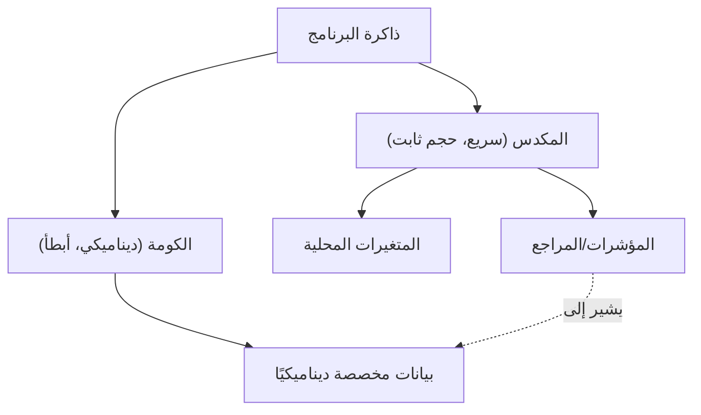

في برمجة الأنظمة الحديثة، يمثل تحقيق التوازن بين الأداء وأمان الذاكرة تحديًا مستمرًا. لفترة طويلة، سيطرت C++ على هذا المجال كملك متوج، ولكن في السنوات الأخيرة، بدأت لغة Rust في تهديد هذه المكانة. تتمثل الميزة الأبرز في Rust في مفهومي "الملكية (Ownership)" و"الاستعارة (Borrowing)"، اللذين يضمنان أمان الذاكرة في وقت الترجمة دون الحاجة إلى جامع قمامة (Garbage Collection).

في هذه المقالة، سنقارن بالتفصيل بين مؤشرات C++ (المؤشرات الخام، `std::unique_ptr`، `std::shared_ptr`) ونموذج الملكية في Rust. سنشرح بشكل شامل كيف يمنع مترجم Rust (مدقق الاستعارة أو Borrow Checker) أخطاء مثل الاستخدام بعد التحرير (Use-After-Free) وسباق البيانات (Data Race)، وذلك مدعومًا بأمثلة برمجية ورسوم توضيحية.

## 1. أساسيات إدارة الذاكرة: المكدس (Stack) والكومة (Heap)

لفهم أساسيات إدارة الذاكرة، دعونا نراجع أولاً كيف يستخدم البرنامج الذاكرة. تنقسم مساحة الذاكرة بشكل رئيسي إلى "المكدس (Stack)" و"الكومة (Heap)".

### المكدس (Stack)
هي المنطقة التي يتم فيها تكديس المتغيرات المحلية وغيرها عند استدعاء الدوال. تتميز بهيكل LIFO (ما يدخل أخيرًا يخرج أولاً)، وتكون عملية تخصيص الذاكرة وتحريرها سريعة جدًا. يتم وضع البيانات التي يمكن تحديد حجمها في وقت الترجمة (Compile time) فقط هنا.

### الكومة (Heap)
يتم فيها وضع البيانات التي يُحدد حجمها ديناميكيًا في وقت التشغيل (Runtime)، أو البيانات التي تحتاج إلى البقاء بعد انتهاء نطاق الدالة (Scope). يتم الوصول إليها عبر المؤشرات (Pointers) أو المراجع (References).

في اللغات التي لا تحتوي على جامع قمامة مثل C++ وRust، يمكن صياغة تكلفة إدارة ذاكرة الكومة بمعادلة رياضية كالتالي. بافتراض أن إجمالي عدد الكائنات هو $N$، ومتوسط الوقت المستغرق في التخصيص هو $T_{alloc}$، ومتوسط الوقت المستغرق في التحرير هو $T_{dealloc}$، فإن إجمالي تكلفة إدارة الذاكرة $C_{memory}$ يكون:

$$ C_{memory} = \sum_{i=1}^{N} (T_{alloc, i} + T_{dealloc, i}) + O_{sync} $$

حيث يمثل $O_{sync}$ النفقات الإضافية (Overhead) للتحكم الحصري (مثل كائنات المزامنة Mutex والعمليات الذرية Atomic operations) في بيئة متعددة الخيوط (Multithreaded). نظرًا لأن Rust تحدد توقيت تحرير الذاكرة في وقت الترجمة، فإنها تقضي على مشكلة انخفاض الإنتاجية (Stop-The-World) الناتجة عن جامع القمامة في وقت التشغيل، وتنفذ $T_{dealloc}$ في وقت آمن ومؤكد.



## 2. مؤشرات C++: مقايضة بين الحرية والخطر

دعونا نلقي نظرة على تطور إدارة الذاكرة في C++.

### عصر المؤشرات الخام (Raw Pointers) ومشاكلها

توفر المؤشرات الخام (`*`)، الموروثة من لغة C، حرية مطلقة، ولكنها في الوقت نفسه تعتبر بيئة خصبة لأخطاء خطيرة مثل:

- **تسرب الذاكرة (Memory Leak)**: نسيان استخدام `delete` للذاكرة المخصصة بواسطة `new`.
- **المؤشرات المتدلية (Dangling Pointer)**: الوصول إلى مؤشر يشير إلى ذاكرة تم تحريرها (بعد `delete`).
- **التحرير المزدوج (Double Free)**: استخدام `delete` لنفس مساحة الذاكرة مرتين.

```cpp
// C++: مثال على المشاكل الناجمة عن المؤشرات الخام
void rawPointerExample() {
    int* ptr = new int(10);
    // ... بعض العمليات ...
    delete ptr; 
    
    // الوصول عن طريق الخطأ مرة أخرى (Use-After-Free / Dangling Pointer)
    // لا يستطيع مترجم C++ تحويل هذا إلى خطأ في وقت الترجمة
    std::cout << *ptr << std::endl; // سلوك غير محدد (Undefined Behavior)
}
```

### ظهور RAII والمؤشرات الذكية (بداية من C++11)

منذ C++11، تم توحيد المؤشرات الذكية المبنية على مفهوم RAII (اكتساب الموارد هو التهيئة)، وأصبح الاستخدام المباشر للمؤشرات الخام غير محبذ.

#### `std::unique_ptr`
مؤشر يمثل ملكية حصرية (فردية). يتم تحرير الذاكرة تلقائيًا بمجرد الخروج من النطاق. لا يمكن نسخه، بل يُسمح فقط بـ "نقل (Move)" الملكية (باستخدام `std::move`).

```cpp
// C++: std::unique_ptr
#include <memory>
#include <iostream>

void uniquePtrExample() {
    std::unique_ptr<int> p1 = std::make_unique<int>(42);
    // std::unique_ptr<int> p2 = p1; // خطأ في وقت الترجمة (النسخ غير مسموح)
    std::unique_ptr<int> p3 = std::move(p1); // نقل الملكية
    
    // نقطة ضعف C++: بعد النقل، يصبح p1 مساويًا لـ nullptr، ولكن الوصول إليه لا يزال قابلاً للترجمة
    // سيؤدي ذلك إلى انهيار (Segmentation fault) في وقت التشغيل
    // std::cout << *p1 << std::endl; 
}
```

#### `std::shared_ptr`
مؤشر يسمح لمؤشرات متعددة بمشاركة نفس الكائن. يستخدم عداد المراجع (Reference Counting)، وبمجرد وصول العداد إلى 0، يتم تحرير الذاكرة. يتطلب عمليات زيادة ونقصان ذرية (Atomic)، مما يسبب نفقات إضافية طفيفة في الأداء (تعادل $O_{sync}$ المذكور سابقًا).

## 3. الملكية (Ownership) في Rust: نقلة نوعية

تضع Rust مفهوم `std::unique_ptr` الخاص بـ C++ كجوهر لمواصفات اللغة، مع تطبيق "نموذج ملكية" أكثر صرامة.

### القواعد الثلاث للملكية

يعتمد نظام الملكية في Rust على ثلاث قواعد بسيطة للغاية:

1. **كل قيمة في Rust تمتلك متغيرًا يُسمى "المالك" (Owner).**
2. **يمكن أن يكون هناك مالك واحد فقط في أي وقت.**
3. **عندما يخرج المالك من النطاق (Scope)، سيتم تدمير القيمة.**

في Rust، يتم "نقل" الموارد افتراضيًا. تنتقل الملكية عن طريق عملية التعيين دون الحاجة إلى تحديد `std::move` صراحة كما في C++.

```rust
// Rust: نقل الملكية (Move)
fn main() {
    let s1 = String::from("hello"); // بيانات مخصصة في الكومة
    let s2 = s1; // تنتقل الملكية من s1 إلى s2 (موف)

    // الفرق الأكبر مع C++: الوصول إلى متغير بعد نقله يؤدي إلى "خطأ في وقت الترجمة"!
    // println!("{}, world!", s1); // خطأ في الترجمة: value borrowed here after move
}
```

ميزة "جعل الوصول إلى المتغيرات بعد النقل مستحيلاً في وقت الترجمة" هي أحد الأسباب التي تجعل Rust أكثر أمانًا من `std::unique_ptr` في C++.

```mermaid
sequenceDiagram
    participant S1 as "المتغير s1"
    participant Heap as "ذاكرة الكومة ('hello')"
    participant S2 as "المتغير s2"
    
    S1->>Heap: "يخصص ويملك"
    Note over S1,S2: "let s2 = s1;"
    S1--xHeap: "يفقد الملكية (مُبطل)"
    S2->>Heap: "يأخذ الملكية"
```

## 4. الاستعارة (Borrowing) والمراجع

إذا كانت الملكية تنتقل باستمرار، فسيتعين إرجاع الملكية في كل مرة يتم فيها تمرير قيمة إلى دالة، وهو أمر غير مريح للغاية. وهنا يأتي دور "الاستعارة (Borrowing)". وهو يعادل المؤشرات أو المراجع في C++.

هناك نوعان من الاستعارة في Rust:
- **المرجع غير القابل للتغيير (Immutable Reference)**: `&T` (مشابه لـ `const T&` في C++)
- **المرجع القابل للتغيير (Mutable Reference)**: `&mut T` (مشابه لـ `T&` في C++)

### القانون الصارم لمدقق الاستعارة (Borrow Checker)

يحتوي مترجم Rust على "مدقق الاستعارة" الذي يتحقق من صحة المراجع. يفرض مدقق الاستعارة القواعد الصارمة التالية:

> في أي نطاق معين، يمكن أن يوجد واحد فقط مما يلي:
> - **مرجع واحد قابل للتغيير (`&mut T`)**
> - **عدة مراجع غير قابلة للتغيير (`&T`)**

يُعرف هذا بمبدأ **"قراء متعددون أو كاتب واحد (MRSW)" (Multiple Readers XOR Single Writer)**. يمكن التعبير عن ذلك بواسطة المعامل الرياضي (XOR) (الاستبعاد المنطقي). بالنسبة للحالة $S$، يجب أن يفي عدد المراجع غير القابلة للتغيير $N_r$ وعدد المراجع القابلة للتغيير $N_w$ بالشرط التالي:

$$ (N_r \ge 0 \land N_w = 0) \oplus (N_r = 0 \land N_w = 1) $$

من خلال هذه القاعدة، يتم **منع سباق البيانات (Data Race) تمامًا في وقت الترجمة**. يحدث سباق البيانات عندما: (1) يصل مؤشران أو أكثر إلى نفس البيانات في وقت واحد، (2) يقوم واحد على الأقل بالكتابة، و (3) لا توجد آلية للمزامنة. تمنع Rust سباق البيانات مسبقًا عن طريق تدمير الشرط (2) في وقت الترجمة.

```rust
// Rust: خطأ في وقت الترجمة بسبب انتهاك قواعد الاستعارة
fn main() {
    let mut s = String::from("hello");

    let r1 = &s; // استعارة غير قابلة للتغيير (موافق)
    let r2 = &s; // استعارة غير قابلة للتغيير (موافق)
    // let r3 = &mut s; // خطأ! لا يمكن إنشاء استعارة قابلة للتغيير بينما توجد استعارة غير قابلة للتغيير

    println!("{}, {}", r1, r2);
}
```

## 5. منع إبطال المكرر (Iterator Invalidation)

كمثال عملي يبرز قوة مدقق الاستعارة بشكل أفضل، دعونا نلقي نظرة على الخلل الكلاسيكي المعروف باسم "إبطال المكرر".

### إبطال المكرر في C++ (انهيار وقت التشغيل)

عند تعديل `std::vector` في C++ داخل حلقة تكرارية، هناك احتمال أن يتم إعادة تخصيص الذاكرة الأساسية (Reallocation)، مما يحول المرجع إلى مؤشر متدلٍ (Dangling Pointer).

```cpp
// C++: خطأ إبطال المكرر
#include <iostream>
#include <vector>

int main() {
    std::vector<int> v = {1, 2, 3};
    
    // الحصول على مرجع لعنصر في المتجه
    int& first = v[0]; 
    
    // إضافة عنصر (إذا كانت السعة غير كافية هنا، فسيتم تخصيص مساحة ذاكرة جديدة،
    // وقد يتم التخلص من المساحة القديمة)
    v.push_back(4); 
    
    // قد يشير first بالفعل إلى ذاكرة تم تحريرها! (سلوك غير محدد)
    std::cout << "The first element is: " << first << std::endl; 
    
    return 0;
}
```

### حماية وقت الترجمة بواسطة Rust

دعونا نكتب نفس المنطق تمامًا باستخدام Rust.

```rust
// Rust: منع إبطال المكرر في وقت الترجمة
fn main() {
    let mut v = vec![1, 2, 3];

    // الحصول على مرجع غير قابل للتغيير (بدء الاستعارة)
    let first = &v[0]; 

    // خطأ! طالما أن `first` يستعير `v` بشكل غير قابل للتغيير،
    // لا يمكنك إجراء استعارة قابلة للتغيير المطلوبة لـ `v.push`.
    // v.push(4); 

    println!("The first element is: {}", first);
}
```

وبهذه الطريقة، تمنع Rust على مستوى المترجم "تعديل القيمة (استعارة قابلة للتغيير) أثناء قراءتها (استعارة غير قابلة للتغيير)"، مما يضمن اكتشاف الأخطاء القاتلة مثل الاستخدام بعد التحرير (Use-After-Free) وإبطال المكرر في وقت الترجمة بشكل مؤكد.

```mermaid
graph LR
    A["المتغير v (المالك)"] --> B["مصفوفة الكومة [1, 2, 3]"]
    C["المرجع 'first' (&v[0])"] -.->|"استعارة غير قابلة للتغيير"| B
    A -->|X "استعارة قابلة للتغيير مرفوضة!"| D["v.push(4)"]
    
    style C stroke:#00FF00,stroke-width:2px
    style D stroke:#FF0000,stroke-width:2px
```

## 6. الملكية المشتركة في Rust: `Rc` و `Arc`

توفر Rust أيضًا ملكية مشتركة تعادل `std::shared_ptr` في C++، ولكن هناك تمييز واضح في الأنواع للاستخدام في خيط واحد (Single Thread) أو عبر خيوط متعددة (Multi-thread).

### للخيط الواحد: `Rc<T>` (Reference Counted)
`Rc<T>` هو مؤشر ذكي يعتمد على عد المراجع ولكنه ليس آمنًا للخيوط (Non-thread-safe). نظرًا لأنه يزيد أو ينقص العداد دون استخدام تعليمات ذرية، فهو سريع جدًا داخل خيط واحد. ومع ذلك، إذا حاولت إرساله إلى خيط آخر، فسيحدث خطأ في الترجمة (لأنه لا ينفذ سمة `Send`).

### للخيوط المتعددة: `Arc<T>` (Atomic Reference Counted)
للمشاركة بين الخيوط، يتم استخدام `Arc<T>` الذي يقوم بعمليات زيادة ونقصان ذرية (Atomic). تتكبد تكلفة تعادل `std::shared_ptr` في C++.

علاوة على ذلك، في C++، إذا حاولت عدة خيوط الكتابة في نفس الوقت إلى متغير مشترك بواسطة `std::shared_ptr`، فسيحدث سباق بيانات. لمنع ذلك، يجب استخدام `std::mutex` بشكل صحيح يدويًا.

من ناحية أخرى في Rust، لا يمكن لـ `Arc<T>` **تغيير البيانات الداخلية بمفرده**. إذا كانت التعديلات ضرورية، يجب دمجه مع كائن مزامنة `Mutex<T>`.

```rust
use std::sync::{Arc, Mutex};
use std::thread;

fn main() {
    // مزيج من المشاركة الآمنة للخيوط والتحكم الحصري
    // مشابه لـ std::shared_ptr<std::mutex> في C++، لكن المتيوتكس (Mutex) هنا يغلف البيانات
    let counter = Arc::new(Mutex::new(0));
    let mut handles = vec![];

    for _ in 0..10 {
        let counter_clone = Arc::clone(&counter);
        let handle = thread::spawn(move || {
            // عن طريق استدعاء lock()، يمكنك الحصول على مرجع قابل للتغيير (&mut i32) داخليًا
            let mut num = counter_clone.lock().unwrap();
            *num += 1;
        }); // يتم تحرير القفل تلقائيا عند الخروج من النطاق بسبب مبدأ RAII
        handles.push(handle);
    }

    for handle in handles {
        handle.join().unwrap();
    }

    println!("Result: {}", *counter.lock().unwrap());
}
```

والجدير بالذكر أن `Mutex<T>` في Rust ليس مجرد آلية قفل فحسب، بل **"يغلف البيانات التي يجب حمايتها كنوع"**. يمنع هذا التصميم بالكامل خطأ "الوصول إلى البيانات ونسيان القفل" على مستوى الترجمة. النظام مبني بحيث لا يمكنك الحصول على حق الوصول (مرجع) للبيانات الداخلية دون الحصول على القفل أولاً (`lock()`).

## الخلاصة: "فحص مسبق" بواسطة المترجم أم "مسؤولية شخصية" للمطور؟

توفر المؤشرات والمؤشرات الذكية في C++ للمطور تحكمًا متقدمًا وأداءً عاليًا، ولكن الاستخدام الصحيح لها يعتمد على انضباط المطور. على الرغم من أن C++ أصبحت أكثر أمانًا بشكل دراماتيكي مع إدخال RAII و `std::unique_ptr`، إلا أنها لا تستطيع منع "السلوك غير المحدد" تمامًا على مستوى اللغة، مثل الوصول بعد النقل أو إبطال المكرر.

من ناحية أخرى، من خلال تضمين قواعد الملكية (Ownership) والاستعارة (Borrowing) في المترجم، تكتشف Rust هذه الأخطاء **في وقت الترجمة** بدلاً من وقت التشغيل. إن الضمان القوي المتمثل في "إذا نجحت عملية الترجمة، فإن الذاكرة آمنة" هو السبب الأكبر الذي جعل Rust تكتسب دعمًا سريعًا في برمجة الأنظمة.

على الرغم من أن القتال ضد مدقق الاستعارة في Rust (Fight the borrow checker) يمثل عقبة كبيرة للمبتدئين، إلا أنه في الواقع قيام المترجم بالنيابة عنك بعملية حسابية معقدة تتمثل في "تتبع مدة بقاء المؤشر"، والتي كان مبرمجو C++ يقومون بها عادة في رؤوسهم.

إذا تعلمت Rust بعد فهم حرية ومخاطر مؤشرات C++، فيجب أن تكون قادرًا على فهم أعمق للفلسفة الكامنة وراء نموذج الملكية و"لماذا تم اعتماده بهذا التصميم".

---
*هذه المقالة هي دراسة مقارنة حول طرق إدارة الذاكرة في C++ و Rust. نأمل أن تكون بمثابة مرجع لاختيار اللغة المناسبة وفقًا لمتطلبات كل مشروع.*
