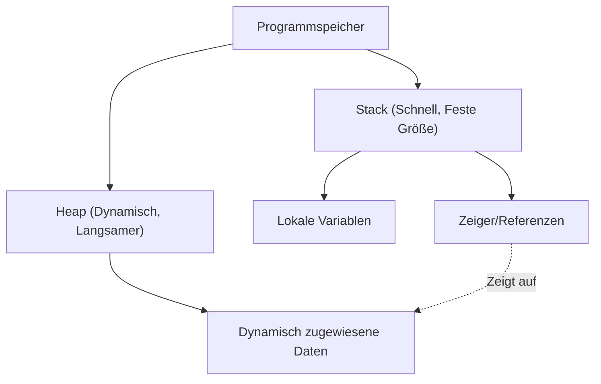

In der modernen Systemprogrammierung ist die Vereinbarkeit von Leistung und Speichersicherheit eine ständige Herausforderung. C++ war lange Zeit der unangefochtene König in diesem Bereich, aber in den letzten Jahren hat Rust begonnen, diese Position zu bedrohen. Das größte Merkmal von Rust ist die Garantie der Speichersicherheit zur Kompilierzeit ohne Garbage Collection (GC), was durch die Konzepte von "Ownership" (Eigentum) und "Borrowing" (Ausleihen) erreicht wird.

In diesem Artikel werden wir C++ Zeiger (rohe Zeiger, `std::unique_ptr`, `std::shared_ptr`) und das Rust-Ownership-Modell detailliert vergleichen. Wir werden anhand von Codebeispielen und Diagrammen ausführlich erklären, wie der Rust-Compiler (Borrow Checker) Use-After-Free (Verwendung nach Freigabe) und Datenrennen (Data Races) verhindert.

## 1. Grundlagen der Speicherverwaltung: Stack und Heap

Um die Grundlagen der Speicherverwaltung zu verstehen, lassen Sie uns zunächst einen Blick darauf werfen, wie Programme den Speicher nutzen. Der Speicherbereich wird grob in "Stack" und "Heap" unterteilt.

### Stack

Dies ist der Bereich, in dem lokale Variablen bei Funktionsaufrufen abgelegt werden. Er hat eine LIFO-Struktur (Last-In-First-Out) und die Speicherzuweisung und -freigabe ist sehr schnell. Hier werden nur Daten platziert, deren Größe zur Kompilierzeit bestimmt werden kann.

### Heap

Hier werden Daten platziert, deren Größe zur Laufzeit dynamisch bestimmt wird, oder Daten, die über den Gültigkeitsbereich einer Funktion hinaus existieren müssen. Auf sie wird über Zeiger (oder Referenzen) zugegriffen.

In C++ und Rust, die keine Garbage Collection haben, kann der Verwaltungsaufwand für den Heapspeicher als Formel wie folgt modelliert werden. Wenn die Gesamtzahl der Objekte $N$ ist, die durchschnittliche Zeit für die Allokation $T_{alloc}$ und die durchschnittliche Zeit für die Deallokation $T_{dealloc}$ ist, dann ist der Gesamtaufwand für die Speicherverwaltung $C_{memory}$:

$$ C_{memory} = \sum_{i=1}^{N} (T_{alloc, i} + T_{dealloc, i}) + O_{sync} $$

Hierbei ist $O_{sync}$ der Overhead für die gegenseitige Ausschließung (Mutex- oder atomare Operationen) in einer Multithread-Umgebung. Da Rust den Zeitpunkt der Speicherfreigabe zur Kompilierzeit bestimmt, führt es $T_{dealloc}$ zu einem zuverlässigen und sicheren Zeitpunkt aus, während die Durchsatzminderung (Stop-The-World) durch die Garbage Collection zur Laufzeit auf null reduziert wird.



## 2. C++ Zeiger: Der Kompromiss zwischen Freiheit und Gefahr

Werfen wir einen Blick auf die Entwicklung der Speicherverwaltung in C++.

### Die Ära der rohen Zeiger (Raw Pointers) und ihre Probleme

Rohe Zeiger (`*`), die von der Sprache C übernommen wurden, bieten ultimative Freiheit, sind aber gleichzeitig eine Brutstätte für die folgenden schwerwiegenden Bugs:

- **Speicherleck (Memory Leak)**: Vergessen, mit `new` zugewiesenen Speicher mit `delete` freizugeben.
- **Hängender Zeiger (Dangling Pointer)**: Zugriff auf einen Zeiger nach der Speicherfreigabe (nach `delete`).
- **Doppelte Freigabe (Double Free)**: Zweimaliges Aufrufen von `delete` für denselben Speicherbereich.

```cpp
// C++: Beispiel für Probleme mit rohen Zeigern
void rawPointerExample() {
    int* ptr = new int(10);
    // ... Irgendeine Verarbeitung ...
    delete ptr; 
    
    // Versehentlicher erneuter Zugriff (Use-After-Free / Dangling Pointer)
    // Der C++-Compiler kann dies nicht als Kompilierfehler erkennen
    std::cout << *ptr << std::endl; // Undefiniertes Verhalten (Undefined Behavior)
}
```

### Die Einführung von RAII und Smart Pointern (ab C++11)

Seit C++11 wurden Smart Pointer, die auf dem RAII-Konzept (Resource Acquisition Is Initialization) basieren, standardisiert, und die direkte Verwendung von rohen Zeigern wird nicht mehr empfohlen.

#### `std::unique_ptr`
Ein Zeiger, der exklusives Eigentum (Ownership) ausdrückt. Der Speicher wird automatisch freigegeben, wenn der Gültigkeitsbereich (Scope) verlassen wird. Er kann nicht kopiert werden; nur das "Verschieben" (Move) des Eigentums ist möglich (unter Verwendung von `std::move`).

```cpp
// C++: std::unique_ptr
#include <memory>
#include <iostream>

void uniquePtrExample() {
    std::unique_ptr<int> p1 = std::make_unique<int>(42);
    // std::unique_ptr<int> p2 = p1; // Kompilierfehler (Kopieren nicht möglich)
    std::unique_ptr<int> p3 = std::move(p1); // Verschieben des Eigentums
    
    // Schwäche von C++: Nach dem Move wird p1 zu nullptr, aber der Zugriff selbst ist kompilierbar
    // Führt zur Laufzeit zu einem Absturz (Segmentation Fault)
    // std::cout << *p1 << std::endl; 
}
```

#### `std::shared_ptr`
Ein Zeiger, der es mehreren Zeigern ermöglicht, dasselbe Objekt zu teilen. Er verwendet Referenzzählung (Reference Counting), um den Speicher freizugeben, wenn der Zähler 0 erreicht. Da atomare Inkrementierungs- und Dekrementierungsoperationen erforderlich sind, entsteht ein gewisser Leistungs-Overhead (entsprechend dem oben genannten $O_{sync}$).

## 3. Rusts Ownership (Eigentum): Ein Paradigmenwechsel

Rust hat das Konzept von `std::unique_ptr` aus C++ als Kern seiner Sprachspezifikation übernommen und verfügt über ein noch strengeres "Ownership-Modell".

### Die 3 Regeln von Ownership

Das Ownership-System von Rust basiert auf den folgenden drei sehr einfachen Regeln:

1. **Jeder Wert in Rust hat eine Variable, die als sein Eigentümer (Owner) bezeichnet wird.**
2. **Es kann immer nur einen Eigentümer zur gleichen Zeit geben.**
3. **Wenn der Eigentümer den Gültigkeitsbereich (Scope) verlässt, wird der Wert verworfen.**

In Rust werden Ressourcen standardmäßig "verschoben" (moved). Das Eigentum wird durch Zuweisungsoperationen verschoben, ohne dass `std::move` wie in C++ explizit angegeben werden muss.

```rust
// Rust: Verschieben des Eigentums (Move)
fn main() {
    let s1 = String::from("hello"); // Daten, die auf dem Heap allokiert werden
    let s2 = s1; // Das Eigentum wird von s1 auf s2 verschoben (moved)

    // Der größte Unterschied zu C++: Der Zugriff auf eine Variable nach dem Move führt zu einem "Kompilierfehler"!
    // println!("{}, world!", s1); // Kompilierfehler: value borrowed here after move
}
```

Diese Funktion, den Zugriff auf Variablen nach einem Move zur Kompilierzeit zu verhindern, ist einer der Gründe, warum Rust sicherer ist als `std::unique_ptr` in C++.

```mermaid
sequenceDiagram
    participant S1 as "Variable s1"
    participant Heap as "Heap-Speicher ('hello')"
    participant S2 as "Variable s2"
    
    S1->>Heap: "Weist zu & Besitzt"
    Note over S1,S2: "let s2 = s1;"
    S1--xHeap: "Verliert Eigentum (Ungültig)"
    S2->>Heap: "Übernimmt Eigentum"
```

## 4. Borrowing (Ausleihen) und Referenzen

Wenn man das Eigentum ständig verschiebt, müsste man es jedes Mal zurückgeben lassen, wenn man einen Wert an eine Funktion übergibt, was sehr unpraktisch ist. Hier kommt das "Borrowing" (Ausleihen) ins Spiel. Es entspricht Zeigern oder Referenzen in C++.

In Rust gibt es zwei Arten von Borrowing:
- **Unveränderliche Referenz (Immutable Reference)**: `&T` (ähnlich wie `const T&` in C++)
- **Veränderliche Referenz (Mutable Reference)**: `&mut T` (ähnlich wie `T&` in C++)

### Die unerbittlichen Regeln des Borrow Checkers

Der Rust-Compiler enthält einen "Borrow Checker", der die Gültigkeit von Referenzen überprüft. Der Borrow Checker erzwingt die folgenden strengen Regeln:

> In jedem beliebigen Gültigkeitsbereich kann nur eine der folgenden Bedingungen existieren:
> - **Genau eine veränderliche Referenz (`&mut T`)**
> - **Mehrere unveränderliche Referenzen (`&T`)**

Dies wird als das Prinzip **"Multiple Readers XOR Single Writer (MRSW)"** bezeichnet. Es kann durch ein mathematisches exklusives ODER (XOR) ausgedrückt werden. Für einen Zustand $S$ müssen die Anzahl der unveränderlichen Referenzen $N_r$ und die Anzahl der veränderlichen Referenzen $N_w$ die folgende Einschränkung erfüllen:

$$ (N_r \ge 0 \land N_w = 0) \oplus (N_r = 0 \land N_w = 1) $$

Diese Regel eliminiert **Datenrennen (Data Races) zur Kompilierzeit vollständig**. Ein Datenrennen tritt auf, wenn ① zwei oder mehr Zeiger gleichzeitig auf dieselben Daten zugreifen, ② mindestens einer davon schreibt und ③ kein Synchronisationsmechanismus vorhanden ist. Rust verhindert Datenrennen im Vorfeld, indem es die Bedingung ② zur Kompilierzeit bricht.

```rust
// Rust: Kompilierfehler durch Verletzung der Borrowing-Regeln
fn main() {
    let mut s = String::from("hello");

    let r1 = &s; // Unveränderliches Ausleihen (OK)
    let r2 = &s; // Unveränderliches Ausleihen (OK)
    // let r3 = &mut s; // Fehler! Es kann keine veränderliche Referenz erstellt werden, solange unveränderliche Referenzen existieren

    println!("{}, {}", r1, r2);
}
```

## 5. Verhinderung der Iterator-Ungültigmachung (Iterator Invalidation)

Als konkretes Beispiel, bei dem die Leistungsfähigkeit des Borrow Checkers am deutlichsten wird, betrachten wir den klassischen Bug der "Iterator-Ungültigmachung".

### Iterator-Ungültigmachung in C++ (Laufzeitabsturz)

Wenn ein `std::vector` in C++ innerhalb einer Schleife geändert wird, besteht die Möglichkeit, dass der dahinterliegende Speicher neu zugewiesen (reallocated) wird, wodurch Referenzen zu hängenden Zeigern (Dangling Pointers) werden.

```cpp
// C++: Bug der Iterator-Ungültigmachung
#include <iostream>
#include <vector>

int main() {
    std::vector<int> v = {1, 2, 3};
    
    // Referenz auf das Element des Vektors abrufen
    int& first = v[0]; 
    
    // Element hinzufügen (Wenn die Kapazität hier nicht ausreicht, wird ein neuer Speicherbereich zugewiesen,
    // und der alte Bereich könnte verworfen werden)
    v.push_back(4); 
    
    // first könnte auf bereits freigegebenen Speicher zeigen! (Undefiniertes Verhalten)
    std::cout << "The first element is: " << first << std::endl; 
    
    return 0;
}
```

### Schutz zur Kompilierzeit durch Rust

Lassen Sie uns genau dieselbe Logik in Rust schreiben.

```rust
// Rust: Iterator-Ungültigmachung zur Kompilierzeit verhindern
fn main() {
    let mut v = vec![1, 2, 3];

    // Unveränderliche Referenz abrufen (Beginn des Ausleihens)
    let first = &v[0]; 

    // Fehler! Solange `first` `v` unveränderlich ausleiht,
    // kann die für `v.push` erforderliche veränderliche Referenz nicht erstellt werden.
    // v.push(4); 

    println!("The first element is: {}", first);
}
```

Da Rust auf Compiler-Ebene verbietet, "einen Wert zu ändern (veränderlich auszuleihen), während er gelesen wird (unveränderlich ausgeliehen ist)", werden fatale Bugs wie Use-After-Free oder Iterator-Ungültigmachung zur Kompilierzeit zuverlässig abgefangen.

```mermaid
graph LR
    A["Variable v (Eigentümer)"] --> B["Heap Array [1, 2, 3]"]
    C["Referenz 'first' (&v[0])"] -.->|"Unveränderliches Ausleihen"| B
    A -->|X "Veränderliches Ausleihen verweigert!"| D["v.push(4)"]
    
    style C stroke:#00FF00,stroke-width:2px
    style D stroke:#FF0000,stroke-width:2px
```

## 6. Geteiltes Eigentum (Shared Ownership) in Rust: `Rc` und `Arc`

Geteiltes Eigentum, das dem `std::shared_ptr` in C++ entspricht, ist auch in Rust verfügbar, jedoch gibt es eine klare Typentrennung für Single-Threaded- und Multi-Threaded-Anwendungen.

### Für Single-Thread: `Rc<T>` (Reference Counted)
`Rc<T>` ist ein nicht-thread-sicherer Smart Pointer mit Referenzzählung. Da er Inkrementierungs- und Dekrementierungsoperationen ohne atomare Befehle durchführt, ist er innerhalb eines einzelnen Threads sehr schnell. Wenn Sie jedoch versuchen, ihn an einen anderen Thread zu senden, führt dies zu einem Kompilierfehler (da er das `Send`-Trait nicht implementiert).

### Für Multi-Thread: `Arc<T>` (Atomic Reference Counted)
Wenn Daten zwischen Threads geteilt werden sollen, wird `Arc<T>` verwendet, das atomare Inkrementierungen und Dekrementierungen durchführt. Es verursacht vergleichbare Kosten wie `std::shared_ptr` in C++.

Darüber hinaus tritt in C++ ein Datenrennen auf, wenn mehrere Threads gleichzeitig in eine von `std::shared_ptr` gemeinsam genutzte Variable schreiben. Um dies zu verhindern, muss `std::mutex` manuell und korrekt verwendet werden.

Im Gegensatz dazu kann in Rust **die innere Struktur von `Arc<T>` allein nicht geändert werden**. Wenn Änderungen erforderlich sind, muss es mit einem Mutex, d. h. `Mutex<T>`, kombiniert werden.

```rust
use std::sync::{Arc, Mutex};
use std::thread;

fn main() {
    // Kombination aus thread-sicherem Teilen und gegenseitigem Ausschluss
    // Ähnlich wie std::shared_ptr<std::mutex> in C++, aber der Mutex kapselt die Daten
    let counter = Arc::new(Mutex::new(0));
    let mut handles = vec![];

    for _ in 0..10 {
        let counter_clone = Arc::clone(&counter);
        let handle = thread::spawn(move || {
            // Erst durch den Aufruf von lock() erhält man die veränderliche Referenz (&mut i32) auf das Innere
            let mut num = counter_clone.lock().unwrap();
            *num += 1;
        }); // Die Freigabe der Sperre (Lock) erfolgt automatisch durch RAII beim Verlassen des Gültigkeitsbereichs
        handles.push(handle);
    }

    for handle in handles {
        handle.join().unwrap();
    }

    println!("Result: {}", *counter.lock().unwrap());
}
```

Bemerkenswert ist, dass `Mutex<T>` in Rust nicht nur ein einfacher Sperrmechanismus ist, sondern **"die zu schützenden Daten als Typ kapselt"**. Dies verhindert auf Compiler-Ebene vollständig den Fehler, "auf Daten zuzugreifen und dabei zu vergessen, die Sperre zu erlangen". Es ist so konzipiert, dass man ohne das Erlangen der Sperre (`lock()`) keine Zugriffsrechte (Referenz) auf die darin enthaltenen Daten erhält.

## Fazit: "Vorabprüfung" durch den Compiler oder "Eigenverantwortung" durch den Entwickler

Zeiger und Smart Pointer in C++ bieten Entwicklern ein hohes Maß an Kontrolle und Leistung, aber ihre korrekte Verwendung hängt von der Disziplin des Entwicklers ab. Obwohl C++ durch die Einführung von RAII und `std::unique_ptr` drastisch sicherer geworden ist, kann es "undefiniertes Verhalten" wie den Zugriff nach einem Move oder die Iterator-Ungültigmachung auf Sprachebene nicht vollständig verhindern.

Auf der anderen Seite erkennt Rust diese Fehler zur **Kompilierzeit** anstatt zur Laufzeit, indem es die Regeln von "Ownership" und "Borrowing" in den Compiler integriert. Die starke Garantie, dass "wenn es kompiliert, speichersicher ist", ist der Hauptgrund, warum Rust in der Systemprogrammierung schnell an Popularität gewinnt.

Der Kampf mit dem Borrow Checker von Rust ("Fighting the borrow checker") ist für Anfänger eine große Hürde, aber letztendlich übernimmt der Compiler nur streng die komplexe Berechnung der "Verfolgung der Lebensdauer von Zeigern", die C++ Programmierer ursprünglich in ihren Köpfen durchführten.

Wenn man Rust lernt, nachdem man die Freiheit und die Gefahren von C++ Zeigern verstanden hat, wird man die Philosophie hinter dem Ownership-Modell und das "Warum es so entworfen wurde" tiefgründiger verstehen können.

---
*Dieser Artikel ist eine vergleichende Betrachtung der Speicherverwaltungsmethoden in C++ und Rust. Wir hoffen, dass er als Referenz für die Auswahl der geeigneten Sprache entsprechend den Anforderungen des jeweiligen Projekts dient.*
