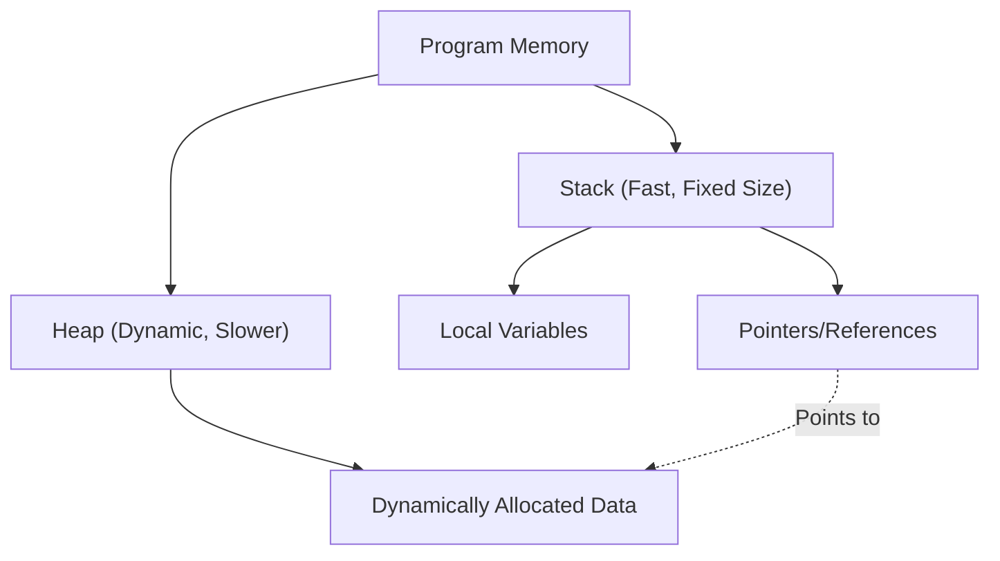

Modern system programming constantly faces the challenge of balancing performance and memory safety. While C++ has reigned as the king of this domain for many years, Rust has recently emerged to threaten its position. The most prominent feature of Rust lies in its concepts of "Ownership" and "Borrowing", which guarantee memory safety at compile time without relying on Garbage Collection (GC).

In this article, we will thoroughly compare C++ pointers (raw pointers, `std::unique_ptr`, `std::shared_ptr`) with the Rust ownership model. We will use code examples and diagrams to explain how the Rust compiler (Borrow Checker) prevents Use-After-Free (using memory after it has been freed) and Data Races.

## 1. Basics of Memory Management: Stack and Heap

To understand the basics of memory management, let's first review how a program utilizes memory. Memory regions are broadly categorized into the "Stack" and the "Heap".

### Stack
This is the region where local variables during function calls are placed. It has a LIFO (Last-In, First-Out) structure, making memory allocation and deallocation extremely fast. Only data with a size determinable at compile time is placed here.

### Heap
This region holds data whose size is determined dynamically at runtime, or data that needs to outlive the scope of a function. It is accessed via pointers (or references).

In languages without garbage collection like C++ and Rust, the management cost of heap memory can be mathematically modeled as follows. Assuming the total number of objects is $N$, the average allocation time is $T_{alloc}$, and the average deallocation time is $T_{dealloc}$, the total memory management cost $C_{memory}$ is:

$$ C_{memory} = \sum_{i=1}^{N} (T_{alloc, i} + T_{dealloc, i}) + O_{sync} $$

Here, $O_{sync}$ is the overhead for mutual exclusion (such as mutexes or atomic operations) in a multi-threaded environment. Because Rust determines the timing of memory deallocation at compile time, it eliminates the throughput degradation (Stop-The-World) caused by runtime garbage collection, while executing $T_{dealloc}$ at a reliable and safe timing.



## 2. C++ Pointers: The Trade-off Between Freedom and Danger

Let's look at the evolution of memory management in C++.

### The Era of Raw Pointers and Their Problems

Raw pointers (`*`) inherited from C provide ultimate freedom, but simultaneously become a hotbed for critical bugs such as:

- **Memory Leak**: Forgetting to `delete` memory allocated with `new`.
- **Dangling Pointer**: Accessing a pointer after the memory has been freed (after `delete`).
- **Double Free**: Freeing the same memory region twice with `delete`.

```cpp
// C++: Example of problems with raw pointers
void rawPointerExample() {
    int* ptr = new int(10);
    // ... some processing ...
    delete ptr; 
    
    // Accidentally accessing it again (Use-After-Free / Dangling Pointer)
    // The C++ compiler cannot make this a compile error
    std::cout << *ptr << std::endl; // Undefined Behavior
}
```

### The Advent of RAII and Smart Pointers (C++11 and Later)

Since C++11, smart pointers based on the concept of RAII (Resource Acquisition Is Initialization) have been standardized, and the direct use of raw pointers is deprecated.

#### `std::unique_ptr`
A pointer that expresses single ownership. When it goes out of scope, the memory is automatically freed. It cannot be copied; ownership can only be "moved" (using `std::move`).

```cpp
// C++: std::unique_ptr
#include <memory>
#include <iostream>

void uniquePtrExample() {
    std::unique_ptr<int> p1 = std::make_unique<int>(42);
    // std::unique_ptr<int> p2 = p1; // Compile error (cannot be copied)
    std::unique_ptr<int> p3 = std::move(p1); // Moving ownership
    
    // The weakness of C++: p1 becomes nullptr after the move, but accessing it is still compilable
    // This causes a crash (segmentation fault) at runtime
    // std::cout << *p1 << std::endl; 
}
```

#### `std::shared_ptr`
A pointer that allows multiple pointers to share the same object. It uses Reference Counting, freeing the memory when the count reaches zero. Since it requires atomic increment/decrement operations, it incurs a slight performance overhead (corresponding to $O_{sync}$ mentioned earlier).

## 3. Rust's Ownership: A Paradigm Shift

Rust places the concept of C++'s `std::unique_ptr` at the core of its language specifications, adopting a much stricter "Ownership Model".

### The 3 Rules of Ownership

The Rust ownership system is based on the following three extremely simple rules:

1. **Each value in Rust has a variable that's called its owner.**
2. **There can only be one owner at a time.**
3. **When the owner goes out of scope, the value will be dropped.**

In Rust, resources are "moved" by default. Even without explicitly using something like `std::move` in C++, an assignment operation transfers ownership.

```rust
// Rust: Moving ownership
fn main() {
    let s1 = String::from("hello"); // Data allocated on the heap
    let s2 = s1; // Ownership moves from s1 to s2

    // The biggest difference from C++: Accessing a variable after a move results in a "compile error"!
    // println!("{}, world!", s1); // Compile error: value borrowed here after move
}
```

This feature of "making variables inaccessible at compile time after a move" is one of the reasons why Rust is safer than C++'s `std::unique_ptr`.

```mermaid
sequenceDiagram
    participant S1 as "Variable s1"
    participant Heap as "Heap Memory ('hello')"
    participant S2 as "Variable s2"
    
    S1->>Heap: "Allocates & Owns"
    Note over S1,S2: "let s2 = s1;"
    S1--xHeap: "Loses Ownership (Invalidated)"
    S2->>Heap: "Takes Ownership"
```

## 4. Borrowing and References

If ownership is constantly moved, it would be extremely inconvenient to have to return ownership every time a value is passed to a function. This is where "Borrowing" comes in. It corresponds to C++ pointers and references.

There are two types of borrowing in Rust:
- **Immutable Reference**: `&T` (Similar to `const T&` in C++)
- **Mutable Reference**: `&mut T` (Similar to `T&` in C++)

### The Ruthless Laws of the Borrow Checker

The Rust compiler has a built-in "Borrow Checker" that verifies the validity of references. The borrow checker enforces the following strict rules:

> In any given scope, you may have either one of the following:
> - **Exactly one mutable reference (`&mut T`)**
> - **Any number of immutable references (`&T`)**

This principle is known as **"Multiple Readers XOR Single Writer (MRSW)"**. It can be expressed with a mathematical XOR; for a given state $S$, the number of immutable references $N_r$ and the number of mutable references $N_w$ must satisfy the following constraint:

$$ (N_r \ge 0 \land N_w = 0) \oplus (N_r = 0 \land N_w = 1) $$

This rule **completely eliminates data races at compile time**. A data race occurs when: (1) two or more pointers access the same data simultaneously, (2) at least one is writing, and (3) there is no synchronization mechanism. Rust proactively prevents data races by destroying condition (2) at compile time.

```rust
// Rust: Compile error due to violating borrowing rules
fn main() {
    let mut s = String::from("hello");

    let r1 = &s; // Immutable borrow (OK)
    let r2 = &s; // Immutable borrow (OK)
    // let r3 = &mut s; // Error! Cannot create a mutable borrow when immutable borrows exist

    println!("{}, {}", r1, r2);
}
```

## 5. Prevention of Iterator Invalidation

As a concrete example where the power of the borrow checker shines the most, let's look at a classic bug known as "Iterator Invalidation".

### Iterator Invalidation in C++ (Runtime Crash)

If you modify a `std::vector` in C++ during a loop, the underlying memory might be reallocated, turning existing references into dangling pointers.

```cpp
// C++: Iterator invalidation bug
#include <iostream>
#include <vector>

int main() {
    std::vector<int> v = {1, 2, 3};
    
    // Get a reference to an element in the vector
    int& first = v[0]; 
    
    // Add an element (if capacity is insufficient here, a new memory region is allocated,
    // and the old region might be destroyed)
    v.push_back(4); 
    
    // first might now be pointing to freed memory! (Undefined Behavior)
    std::cout << "The first element is: " << first << std::endl; 
    
    return 0;
}
```

### Compile-Time Defense by Rust

Let's write the exact same logic in Rust.

```rust
// Rust: Preventing iterator invalidation at compile time
fn main() {
    let mut v = vec![1, 2, 3];

    // Get an immutable reference (Borrowing starts)
    let first = &v[0]; 

    // Error! While `first` immutably borrows `v`,
    // you cannot perform the mutable borrow required by `v.push`.
    // v.push(4); 

    println!("The first element is: {}", first);
}
```

In this way, Rust prohibits at the compiler level "modifying a value (mutable borrowing) while it is being read (immutable borrowing)", ensuring that fatal bugs like Use-After-Free and iterator invalidation are reliably caught at compile time.

```mermaid
graph LR
    A["Variable v (Owner)"] --> B["Heap Array [1, 2, 3]"]
    C["Reference 'first' (&v[0])"] -.->|"Immutable Borrow"| B
    A -->|X "Mutable Borrow Denied!"| D["v.push(4)"]
    
    style C stroke:#00FF00,stroke-width:2px
    style D stroke:#FF0000,stroke-width:2px
```

## 6. Shared Ownership in Rust: `Rc` and `Arc`

Rust also provides shared ownership corresponding to C++'s `std::shared_ptr`, but the types are clearly separated for single-threaded and multi-threaded use.

### For Single-Threaded: `Rc<T>` (Reference Counted)
`Rc<T>` is a non-thread-safe reference-counting smart pointer. It increments and decrements the count without using atomic instructions, making it extremely fast within a single thread. However, attempting to send this to another thread results in a compile error (because it does not implement the `Send` trait).

### For Multi-Threaded: `Arc<T>` (Atomic Reference Counted)
When sharing across threads, `Arc<T>`, which performs atomic increments and decrements, is used. It incurs a cost equivalent to C++'s `std::shared_ptr`.

Furthermore, in C++, simultaneously writing to a variable shared via `std::shared_ptr` from multiple threads causes a data race. To prevent this, you must manually use `std::mutex` correctly.

On the other hand, in Rust, **you cannot mutate the internal data** of `Arc<T>` alone. If modification is necessary, it must be combined with a mutex, such as `Mutex<T>`.

```rust
use std::sync::{Arc, Mutex};
use std::thread;

fn main() {
    // A combination of thread-safe sharing and mutual exclusion
    // Similar to C++'s std::shared_ptr<std::mutex>, but the Mutex contains the data
    let counter = Arc::new(Mutex::new(0));
    let mut handles = vec![];

    for _ in 0..10 {
        let counter_clone = Arc::clone(&counter);
        let handle = thread::spawn(move || {
            // Only by calling lock() can you obtain an internal mutable reference (&mut i32)
            let mut num = counter_clone.lock().unwrap();
            *num += 1;
        }); // The lock is automatically released by RAII when going out of scope
        handles.push(handle);
    }

    for handle in handles {
        handle.join().unwrap();
    }

    println!("Result: {}", *counter.lock().unwrap());
}
```

What is especially noteworthy is that Rust's `Mutex<T>` is not just a locking mechanism; **"it encapsulates the data it protects as its type."** This completely prevents the mistake of "accessing data while forgetting to take the lock" at the compile level. Unless you acquire the lock (`lock()`), you are mechanically unable to obtain access rights (a reference) to the data inside.

## Conclusion: "Pre-check" by the Compiler vs. "Self-responsibility" of the Developer

C++ pointers and smart pointers offer developers a high degree of control and performance, but their correct usage relies entirely on developer discipline. The introduction of RAII and `std::unique_ptr` dramatically increased the safety of C++, but it still cannot completely prevent "undefined behaviors" like use-after-free or iterator invalidation at the language level.

On the other hand, Rust embeds the rules of Ownership and Borrowing into the compiler, detecting these errors at **compile time** rather than at runtime. The strong guarantee that "if it compiles, it is memory safe" is the biggest reason why Rust is rapidly gaining support in system programming.

"Fighting the borrow checker" presents a significant hurdle for beginners, but it simply means the compiler is strictly taking over the complex calculation of "tracking pointer lifetimes" that C++ programmers originally had to perform in their heads.

If you learn Rust while understanding the freedom and dangers of C++ pointers, you will gain a much deeper understanding of the philosophy behind the design of the ownership model: "Why was it designed this way?"

---
*This article is a comparative analysis of memory management techniques in C++ and Rust. We hope it serves as a helpful reference for choosing the appropriate language depending on the requirements of your project.*
