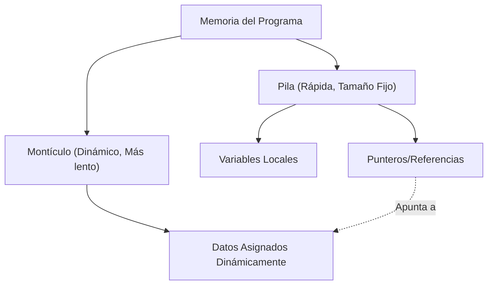

En la programación de sistemas moderna, equilibrar el rendimiento y la seguridad de la memoria es un desafío eterno. C++ ha reinado como el rey en este campo durante muchos años, pero recientemente, Rust ha estado amenazando su posición. La mayor característica de Rust radica en los conceptos de "Propiedad" (Ownership) y "Préstamo" (Borrowing), que garantizan la seguridad de la memoria en tiempo de compilación sin tener un recolector de basura (GC).

En este artículo, compararemos en detalle los punteros de C++ (punteros en crudo, `std::unique_ptr`, `std::shared_ptr`) y el modelo de propiedad de Rust, y explicaremos de manera exhaustiva mediante ejemplos de código y diagramas cómo el compilador de Rust (comprobador de préstamos o borrow checker) evita el uso después de la liberación (Use-After-Free) y las condiciones de carrera de datos (Data Race).

## 1. Fundamentos de la gestión de memoria: Pila y Montículo (Stack and Heap)

Para entender los conceptos básicos de la gestión de memoria, primero repasemos cómo los programas utilizan la memoria. El espacio de memoria se divide a grandes rasgos en "Pila" (Stack) y "Montículo" (Heap).

### Pila (Stack)
Es el área donde se apilan las variables locales, etc., cuando se llama a una función. Tiene una estructura LIFO (el último en entrar es el primero en salir), y la asignación y liberación de memoria es extremadamente rápida. Aquí solo se colocan los datos cuyo tamaño se puede determinar en tiempo de compilación.

### Montículo (Heap)
Aquí se colocan los datos cuyo tamaño se determina dinámicamente en tiempo de ejecución, o los datos que necesitan sobrevivir más allá del alcance (scope) de una función. Se accede a través de punteros (o referencias).

En C++ o Rust, que no tienen recolección de basura, el costo de gestión de la memoria del montículo puede modelarse mediante una fórmula matemática. Si el número total de objetos es $N$, el tiempo promedio de asignación es $T_{alloc}$, y el tiempo promedio de liberación es $T_{dealloc}$, entonces el costo total de gestión de memoria $C_{memory}$ es:

$$ C_{memory} = \sum_{i=1}^{N} (T_{alloc, i} + T_{dealloc, i}) + O_{sync} $$

Donde $O_{sync}$ es la sobrecarga del control de exclusión (mutexes u operaciones atómicas) en un entorno de múltiples hilos. Como Rust determina el momento de la liberación de memoria en tiempo de compilación, elimina por completo la reducción de rendimiento (Stop-The-World) debido a la recolección de basura en tiempo de ejecución, al tiempo que ejecuta $T_{dealloc}$ en un momento seguro y confiable.



## 2. Punteros en C++: El compromiso entre libertad y peligro

Echemos un vistazo a la evolución de la gestión de memoria en C++.

### La era de los Punteros en Crudo (Raw Pointers) y sus problemas

Los punteros en crudo (`*`) heredados de C ofrecen la máxima libertad, pero al mismo tiempo son un caldo de cultivo para errores graves como los siguientes:

- **Fuga de memoria (Memory Leak)**: Olvidar usar `delete` en la memoria asignada con `new`.
- **Puntero colgante (Dangling Pointer)**: Acceder a un puntero después de que la memoria ha sido liberada (después de `delete`).
- **Doble liberación (Double Free)**: Usar `delete` dos veces en la misma área de memoria.

```cpp
// C++: Ejemplo de problemas con punteros en crudo
void rawPointerExample() {
    int* ptr = new int(10);
    // ... algún procesamiento ...
    delete ptr; 
    
    // Acceso erróneo por segunda vez (Use-After-Free / Dangling Pointer)
    // El compilador de C++ no puede hacer que esto sea un error de compilación
    std::cout << *ptr << std::endl; // Comportamiento indefinido (Undefined Behavior)
}
```

### La llegada de RAII y los Punteros Inteligentes (Desde C++11)

A partir de C++11, se estandarizaron los punteros inteligentes basados en el concepto de RAII (Resource Acquisition Is Initialization), y se desaconsejó el uso directo de punteros en crudo.

#### `std::unique_ptr`
Es un puntero que expresa la propiedad única. Cuando sale de su ámbito, la memoria se libera automáticamente. No se puede copiar, solo es posible el "movimiento" (move) de la propiedad (usando `std::move`).

```cpp
// C++: std::unique_ptr
#include <memory>
#include <iostream>

void uniquePtrExample() {
    std::unique_ptr<int> p1 = std::make_unique<int>(42);
    // std::unique_ptr<int> p2 = p1; // Error de compilación (no se puede copiar)
    std::unique_ptr<int> p3 = std::move(p1); // Movimiento de la propiedad
    
    // La debilidad de C++: Después del movimiento, p1 se vuelve nullptr, pero el acceso en sí se puede compilar
    // Causará un bloqueo (segmentation fault) en tiempo de ejecución
    // std::cout << *p1 << std::endl; 
}
```

#### `std::shared_ptr`
Es un puntero que permite que múltiples punteros compartan el mismo objeto. Utiliza el conteo de referencias (Reference Counting) para liberar la memoria cuando el conteo llega a 0. Dado que requiere operaciones de incremento/decremento atómicas, se produce una ligera sobrecarga de rendimiento (equivalente al $O_{sync}$ mencionado anteriormente).

## 3. Propiedad (Ownership) de Rust: Un cambio de paradigma

Rust ha situado el concepto de `std::unique_ptr` de C++ en el núcleo de la especificación del lenguaje, creando un "modelo de propiedad" mucho más estricto.

### Las 3 reglas de la Propiedad

El sistema de propiedad de Rust se basa en tres reglas extremadamente simples:

1. **Cada valor en Rust tiene una variable que se llama su propietario (owner).**
2. **Solo puede haber un propietario a la vez.**
3. **Cuando el propietario sale del ámbito, el valor se descarta.**

En Rust, los recursos se "mueven" por defecto. A diferencia de C++, donde se debe especificar `std::move`, la propiedad se transfiere simplemente mediante la operación de asignación.

```rust
// Rust: Movimiento (move) de la propiedad
fn main() {
    let s1 = String::from("hello"); // Datos asignados en el montículo
    let s2 = s1; // La propiedad se mueve de s1 a s2

    // La mayor diferencia con C++: ¡El acceso a la variable después del movimiento es un "error de compilación"!
    // println!("{}, world!", s1); // Error de compilación: value borrowed here after move
}
```

Esta característica de "hacer que las variables sean inaccesibles en tiempo de compilación después de un movimiento" es una de las razones por las que Rust es más seguro que `std::unique_ptr` de C++.

```mermaid
sequenceDiagram
    participant S1 as "Variable s1"
    participant Heap as "Memoria del Montículo ('hello')"
    participant S2 as "Variable s2"
    
    S1->>Heap: "Asigna y Posee"
    Note over S1,S2: "let s2 = s1;"
    S1--xHeap: "Pierde la Propiedad (Invalidado)"
    S2->>Heap: "Toma la Propiedad"
```

## 4. Préstamo (Borrowing) y Referencias

Si la propiedad se mueve constantemente, tendríamos que devolver la propiedad cada vez que pasamos un valor a una función, lo cual es muy inconveniente. Aquí es donde entra el "Préstamo" (Borrowing). Equivale a los punteros y referencias de C++.

Hay dos tipos de préstamos en Rust:
- **Referencia inmutable (Immutable Reference)**: `&T` (Similar a `const T&` en C++)
- **Referencia mutable (Mutable Reference)**: `&mut T` (Similar a `T&` en C++)

### La regla despiadada del comprobador de préstamos (Borrow Checker)

El compilador de Rust lleva incorporado un "comprobador de préstamos" que verifica la validez de las referencias. El comprobador de préstamos impone las siguientes reglas estrictas:

> En cualquier ámbito dado, solo puede existir uno de los siguientes:
> - **Una referencia mutable (`&mut T`)**
> - **Múltiples referencias inmutables (`&T`)**

Este es un principio llamado **"Múltiple Lectores O un solo Escritor" (Multiple Readers XOR Single Writer, MRSW)**. Puede expresarse matemáticamente usando el O exclusivo (XOR); para un estado $S$, el número de referencias inmutables $N_r$ y el número de referencias mutables $N_w$ deben cumplir con la siguiente restricción:

$$ (N_r \ge 0 \land N_w = 0) \oplus (N_r = 0 \land N_w = 1) $$

Gracias a esta regla, **se eliminan completamente las condiciones de carrera de datos en tiempo de compilación**. Una condición de carrera de datos ocurre cuando ① dos o más punteros acceden a los mismos datos simultáneamente, ② al menos uno de ellos realiza una escritura, y ③ no hay un mecanismo de sincronización. Rust previene esto destruyendo la condición ② en tiempo de compilación.

```rust
// Rust: Error de compilación por violación de la regla de préstamo
fn main() {
    let mut s = String::from("hello");

    let r1 = &s; // Préstamo inmutable (OK)
    let r2 = &s; // Préstamo inmutable (OK)
    // let r3 = &mut s; // ¡Error! No se puede crear un préstamo mutable si ya existe un préstamo inmutable

    println!("{}, {}", r1, r2);
}
```

## 5. Prevención de la invalidación de iteradores (Iterator Invalidation)

Veamos un error clásico, la "invalidación de iteradores", como un ejemplo concreto donde el poder del comprobador de préstamos brilla más.

### Invalidación de iteradores en C++ (Bloqueo en tiempo de ejecución)

Si se modifica un `std::vector` de C++ durante un bucle, es posible que la memoria subyacente se reasigne, convirtiendo las referencias en punteros colgantes.

```cpp
// C++: El error de la invalidación de iteradores
#include <iostream>
#include <vector>

int main() {
    std::vector<int> v = {1, 2, 3};
    
    // Obtener una referencia a un elemento del vector
    int& first = v[0]; 
    
    // Agregar un elemento (Si no hay capacidad suficiente aquí, se asigna una nueva área de memoria,
    // y la antigua área puede ser descartada)
    v.push_back(4); 
    
    // ¡first podría estar apuntando a memoria ya liberada! (Comportamiento indefinido)
    std::cout << "The first element is: " << first << std::endl; 
    
    return 0;
}
```

### Defensa en tiempo de compilación por Rust

Escribamos exactamente la misma lógica en Rust.

```rust
// Rust: Prevención de la invalidación de iteradores en tiempo de compilación
fn main() {
    let mut v = vec![1, 2, 3];

    // Obtener una referencia inmutable (Inicio del préstamo)
    let first = &v[0]; 

    // ¡Error! Mientras `first` tenga un préstamo inmutable de `v`,
    // no se puede realizar el préstamo mutable requerido por `v.push`.
    // v.push(4); 

    println!("The first element is: {}", first);
}
```

De esta manera, en Rust, "modificar un valor (préstamo mutable) mientras se está leyendo (préstamo inmutable)" está prohibido a nivel del compilador, por lo que errores fatales como el uso después de la liberación (Use-After-Free) y la invalidación de iteradores se capturan de forma fiable en tiempo de compilación.

```mermaid
graph LR
    A["Variable v (Propietario)"] --> B["Matriz en el Montículo [1, 2, 3]"]
    C["Referencia 'first' (&v[0])"] -.->|"Préstamo Inmutable"| B
    A -->|X "¡Préstamo Mutable Denegado!"| D["v.push(4)"]
    
    style C stroke:#00FF00,stroke-width:2px
    style D stroke:#FF0000,stroke-width:2px
```

## 6. Propiedad Compartida en Rust: `Rc` y `Arc`

Rust también proporciona una propiedad compartida equivalente a `std::shared_ptr` de C++, pero separa claramente los tipos para uso en un solo hilo y para uso en múltiples hilos.

### Para un solo hilo: `Rc<T>` (Reference Counted)
`Rc<T>` es un puntero inteligente de conteo de referencias no seguro para hilos (non-thread-safe). Ya que incrementa y decrementa el conteo sin utilizar instrucciones atómicas, es extremadamente rápido dentro de un solo hilo. Sin embargo, si intentas enviarlo a otro hilo, resultará en un error de compilación (porque no implementa el rasgo `Send`).

### Para múltiples hilos: `Arc<T>` (Atomic Reference Counted)
Cuando se comparte entre hilos, se usa `Arc<T>`, que realiza incrementos y decrementos de manera atómica. Tiene un costo equivalente a `std::shared_ptr` de C++.

Además, en C++, si varios hilos escriben simultáneamente en una variable compartida mediante `std::shared_ptr`, se producirá una condición de carrera de datos. Para prevenir esto, es necesario usar `std::mutex` manualmente de forma correcta.

Por otro lado, en Rust, **no se pueden modificar los datos internos** solo con `Arc<T>`. Si se necesita modificar, debe combinarse con `Mutex<T>`, que es un mutex.

```rust
use std::sync::{Arc, Mutex};
use std::thread;

fn main() {
    // Combinación de recursos compartidos seguros para hilos y control de exclusión
    // Similar a std::shared_ptr<std::mutex> de C++, pero el Mutex encierra los datos
    let counter = Arc::new(Mutex::new(0));
    let mut handles = vec![];

    for _ in 0..10 {
        let counter_clone = Arc::clone(&counter);
        let handle = thread::spawn(move || {
            // Solo puedes obtener la referencia mutable interna (&mut i32) llamando a lock()
            let mut num = counter_clone.lock().unwrap();
            *num += 1;
        }); // El bloqueo se libera automáticamente mediante RAII cuando sale del ámbito
        handles.push(handle);
    }

    for handle in handles {
        handle.join().unwrap();
    }

    println!("Result: {}", *counter.lock().unwrap());
}
```

Lo que cabe destacar es que el `Mutex<T>` de Rust no es solo un mecanismo de bloqueo, sino que **"encapsula los datos a proteger como un tipo"**. Esto evita completamente a nivel de compilación el error de "acceder a los datos olvidando tomar el bloqueo". El sistema está diseñado para que no puedas obtener el derecho de acceso (referencia) a los datos internos a menos que adquieras el bloqueo (`lock()`).

## Conclusión: ¿"Inspección previa" por parte del compilador o "responsabilidad propia" por parte del desarrollador?

Los punteros y los punteros inteligentes de C++ proporcionan un alto grado de control y rendimiento a los desarrolladores, pero su uso correcto depende de la disciplina del desarrollador. Aunque la introducción de RAII y `std::unique_ptr` hizo que C++ fuera drásticamente más seguro, aún no puede prevenir por completo comportamientos indefinidos como el acceso después del movimiento y la invalidación de iteradores a nivel del lenguaje.

Por otro lado, Rust detecta estos errores en **tiempo de compilación** en lugar de en tiempo de ejecución, incorporando las reglas de Propiedad (Ownership) y Préstamo (Borrowing) en el compilador. Esta fuerte garantía de que "si compila, es seguro para la memoria" es la razón principal por la que Rust está ganando apoyo rápidamente en la programación de sistemas.

Luchar contra el comprobador de préstamos de Rust (Fight the borrow checker) puede ser un gran obstáculo para los principiantes, pero no es más que el compilador asumiendo estrictamente el cálculo complejo de "rastrear la vida útil del puntero" que los programadores de C++ tradicionalmente hacían en sus cabezas.

Si aprendes Rust después de entender la libertad y el peligro de los punteros en C++, deberías poder comprender más profundamente la filosofía detrás del modelo de propiedad: "por qué se diseñó de esta manera".

---
*Este artículo es un estudio comparativo sobre los métodos de gestión de memoria en C++ y Rust. Esperamos que te sirva de referencia para elegir el lenguaje adecuado según los requisitos de tu proyecto.*
