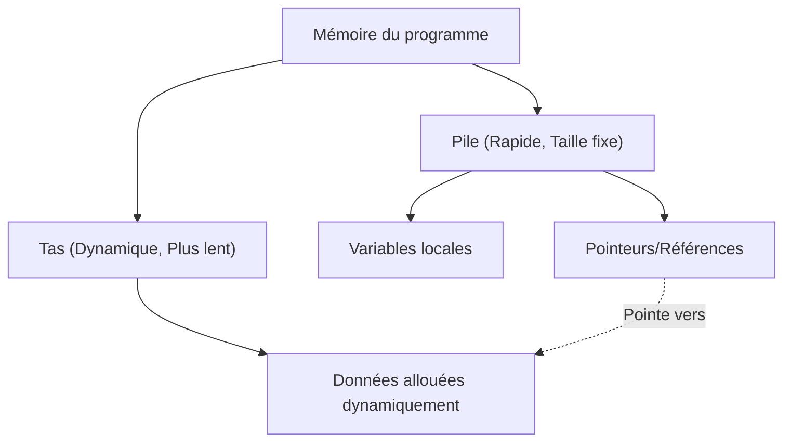

Dans la programmation système moderne, concilier performances et sécurité de la mémoire est un défi éternel. C++ règne en maître dans ce domaine depuis de nombreuses années, mais Rust menace récemment cette position. La principale caractéristique de Rust réside dans les concepts de « Possession » (Ownership) et d'« Emprunt » (Borrowing), qui garantissent la sécurité de la mémoire à la compilation sans avoir recours à un ramasse-miettes (Garbage Collection - GC).

Dans cet article, nous comparerons en détail les pointeurs C++ (pointeurs bruts, `std::unique_ptr`, `std::shared_ptr`) avec le modèle de possession de Rust, et nous expliquerons de manière approfondie comment le compilateur de Rust (le Borrow Checker ou vérificateur d'emprunts) prévient les problèmes de type Use-After-Free (utilisation après libération) et de Data Race (accès concurrent aux données), à l'aide d'exemples de code et de diagrammes.

## 1. Les bases de la gestion de la mémoire : Pile (Stack) et Tas (Heap)

Pour comprendre les bases de la gestion de la mémoire, revoyons d'abord comment un programme utilise la mémoire. L'espace mémoire est principalement divisé en « Pile » (Stack) et « Tas » (Heap).

### Pile (Stack)
C'est la zone où sont stockées les variables locales lors des appels de fonctions. Elle possède une structure LIFO (Dernier Entré, Premier Sorti), et l'allocation ainsi que la libération de la mémoire sont extrêmement rapides. Seules les données dont la taille peut être déterminée à la compilation y sont placées.

### Tas (Heap)
C'est là que sont placées les données dont la taille est déterminée dynamiquement à l'exécution, ou les données qui doivent survivre au-delà de la portée d'une fonction. L'accès s'y fait par le biais de pointeurs (ou références).

Dans les langages sans ramasse-miettes comme C++ et Rust, le coût de gestion de la mémoire du tas peut être modélisé par l'équation suivante. Si le nombre total d'objets est $N$, le temps moyen d'allocation est $T_{alloc}$, et le temps moyen de libération est $T_{dealloc}$, alors le coût total de la gestion de la mémoire $C_{memory}$ est :

$$ C_{memory} = \sum_{i=1}^{N} (T_{alloc, i} + T_{dealloc, i}) + O_{sync} $$

Ici, $O_{sync}$ représente le surcoût de l'exclusion mutuelle (mutex ou opérations atomiques) dans un environnement multithread. Comme Rust détermine le moment de la libération de la mémoire à la compilation, il élimine la baisse de débit (Stop-The-World) due au ramasse-miettes à l'exécution, tout en exécutant $T_{dealloc}$ à un moment sûr et certain.



## 2. Les pointeurs C++ : Le compromis entre liberté et danger

Examinons l'évolution de la gestion de la mémoire en C++.

### L'ère des pointeurs bruts (Raw Pointers) et leurs problèmes

Les pointeurs bruts (`*`) hérités du langage C offrent une liberté ultime, mais sont en même temps un nid à bugs graves :

- **Fuite de mémoire (Memory Leak)** : Oublier de faire un `delete` sur une mémoire allouée avec `new`.
- **Pointeur fantôme (Dangling Pointer)** : Accéder à un pointeur après que la mémoire a été libérée (après `delete`).
- **Double libération (Double Free)** : Faire un `delete` deux fois sur la même zone mémoire.

```cpp
// C++ : Exemple de problèmes avec les pointeurs bruts
void rawPointerExample() {
    int* ptr = new int(10);
    // ... divers traitements ...
    delete ptr; 
    
    // Accès accidentel par la suite (Use-After-Free / Dangling Pointer)
    // Le compilateur C++ ne peut pas faire de ceci une erreur de compilation
    std::cout << *ptr << std::endl; // Comportement indéfini (Undefined Behavior)
}
```

### L'apparition de RAII et des pointeurs intelligents (Depuis C++11)

Depuis C++11, les pointeurs intelligents basés sur le concept RAII (Resource Acquisition Is Initialization) ont été standardisés, et l'utilisation directe de pointeurs bruts est devenue obsolète.

#### `std::unique_ptr`
C'est un pointeur qui exprime une possession unique. Lorsque le pointeur sort de la portée, la mémoire est automatiquement libérée. Il ne peut pas être copié, seule la « possession » peut être déplacée (en utilisant `std::move`).

```cpp
// C++ : std::unique_ptr
#include <memory>
#include <iostream>

void uniquePtrExample() {
    std::unique_ptr<int> p1 = std::make_unique<int>(42);
    // std::unique_ptr<int> p2 = p1; // Erreur de compilation (copie impossible)
    std::unique_ptr<int> p3 = std::move(p1); // Déplacement de la possession
    
    // Le point faible de C++ : p1 devient nullptr après le déplacement, mais l'accès lui-même est compilable
    // Provoque un plantage (erreur de segmentation) à l'exécution
    // std::cout << *p1 << std::endl; 
}
```

#### `std::shared_ptr`
C'est un pointeur qui permet à plusieurs pointeurs de partager le même objet. Il utilise un compteur de références (Reference Counting) et libère la mémoire lorsque le compteur atteint 0. Les opérations d'incrémentation et de décrémentation devant être atomiques, cela entraîne un léger surcoût de performance (équivalent à $O_{sync}$ mentionné précédemment).

## 3. La possession (Ownership) dans Rust : Un changement de paradigme

Rust a intégré le concept de `std::unique_ptr` du C++ au cœur des spécifications de son langage et l'a rendu plus strict avec le « modèle de possession ».

### Les 3 règles de la possession

Le système de possession de Rust repose sur les 3 règles extrêmement simples suivantes :

1. **Chaque valeur en Rust possède une variable qui en est le propriétaire (owner).**
2. **Il ne peut y avoir qu'un seul propriétaire à la fois.**
3. **Lorsque le propriétaire sort de la portée, la valeur est détruite.**

Dans Rust, par défaut, les ressources sont « déplacées » (moved). Même sans spécifier explicitement quelque chose comme `std::move` en C++, la possession est déplacée par l'opération d'affectation.

```rust
// Rust : Déplacement (move) de la possession
fn main() {
    let s1 = String::from("hello"); // Données allouées sur le tas
    let s2 = s1; // La possession est déplacée de s1 vers s2 (move)

    // La plus grande différence avec C++ : accéder à une variable après son déplacement devient une « erreur de compilation » !
    // println!("{}, world!", s1); // Erreur de compilation : value borrowed here after move
}
```

Cette fonctionnalité rendant « impossible à la compilation d'accéder à une variable après son déplacement » est l'une des raisons pour lesquelles Rust est plus sûr que le `std::unique_ptr` du C++.

```mermaid
sequenceDiagram
    participant S1 as "Variable s1"
    participant Heap as "Mémoire du tas ('hello')"
    participant S2 as "Variable s2"
    
    S1->>Heap: "Alloue et Possède"
    Note over S1,S2: "let s2 = s1;"
    S1--xHeap: "Perd la possession (Invalidé)"
    S2->>Heap: "Prend la possession"
```

## 4. Emprunt (Borrowing) et Références

Déplacer la possession en permanence est très peu pratique, car il faudrait restituer la possession à chaque fois que l'on passe une valeur à une fonction. C'est là qu'intervient l'« Emprunt » (Borrowing). C'est l'équivalent des pointeurs et des références en C++.

Il existe deux types d'emprunt en Rust :
- **Référence immuable (Immutable Reference)** : `&T` (Proche de `const T&` en C++)
- **Référence mutable (Mutable Reference)** : `&mut T` (Proche de `T&` en C++)

### La règle impitoyable du Borrow Checker

Le compilateur de Rust intègre un « Borrow Checker » qui vérifie la validité des références. Le Borrow Checker impose la règle stricte suivante :

> Dans n'importe quelle portée, seule l'une des conditions suivantes peut exister à la fois :
> - **Une seule référence mutable (`&mut T`)**
> - **Plusieurs références immuables (`&T`)**

C'est ce qu'on appelle le principe **« Multiple Readers XOR Single Writer (MRSW) »**. Cela peut s'exprimer par le OU exclusif logique (XOR) en mathématiques. Pour un état $S$, le nombre de références immuables $N_r$ et le nombre de références mutables $N_w$ doivent satisfaire la contrainte suivante :

$$ (N_r \ge 0 \land N_w = 0) \oplus (N_r = 0 \land N_w = 1) $$

Grâce à cette règle, **les accès concurrents aux données (Data Race) sont complètement éliminés à la compilation**. Une data race se produit lorsque : ① deux pointeurs ou plus accèdent à la même donnée simultanément, ② au moins un d'entre eux effectue une écriture, et ③ il n'y a pas de mécanisme de synchronisation. Rust détruit la condition ② à la compilation, prévenant ainsi les data races avant même qu'elles ne se produisent.

```rust
// Rust : Erreur de compilation due à une violation des règles d'emprunt
fn main() {
    let mut s = String::from("hello");

    let r1 = &s; // Emprunt immuable (OK)
    let r2 = &s; // Emprunt immuable (OK)
    // let r3 = &mut s; // Erreur ! Impossible de créer un emprunt mutable alors que des emprunts immuables existent

    println!("{}, {}", r1, r2);
}
```

## 5. Prévention de l'invalidation d'itérateur (Iterator Invalidation)

Pour illustrer concrètement la puissance du Borrow Checker, examinons un bug classique appelé « invalidation d'itérateur ».

### Invalidation d'itérateur en C++ (Plantage à l'exécution)

Si vous modifiez un `std::vector` en C++ au sein d'une boucle, la mémoire sous-jacente peut être réallouée (Reallocation), transformant les références en pointeurs fantômes (dangling pointers).

```cpp
// C++ : Bug d'invalidation d'itérateur
#include <iostream>
#include <vector>

int main() {
    std::vector<int> v = {1, 2, 3};
    
    // Obtient une référence au premier élément du vecteur
    int& first = v[0]; 
    
    // Ajoute un élément (si la capacité est insuffisante ici, un nouvel espace mémoire est alloué,
    // et l'ancien espace peut être détruit)
    v.push_back(4); 
    
    // first peut maintenant pointer vers une mémoire déjà libérée ! (Comportement indéfini)
    std::cout << "Le premier élément est : " << first << std::endl; 
    
    return 0;
}
```

### Défense à la compilation par Rust

Écrivons exactement la même logique en Rust.

```rust
// Rust : Prévenir l'invalidation d'itérateur à la compilation
fn main() {
    let mut v = vec![1, 2, 3];

    // Obtient une référence immuable (Début de l'emprunt)
    let first = &v[0]; 

    // Erreur ! Tant que `first` emprunte `v` de manière immuable,
    // l'emprunt mutable nécessaire pour `v.push` ne peut pas être effectué.
    // v.push(4); 

    println!("Le premier élément est : {}", first);
}
```

Ainsi, en Rust, « modifier une valeur (emprunt mutable) pendant qu'elle est en cours de lecture (emprunt immuable) » est interdit au niveau du compilateur. Par conséquent, les bugs fatals tels que Use-After-Free et l'invalidation d'itérateurs sont attrapés à coup sûr lors de la compilation.

```mermaid
graph LR
    A["Variable v (Propriétaire)"] --> B["Tableau sur le tas [1, 2, 3]"]
    C["Référence 'first' (&v[0])"] -.->|"Emprunt immuable"| B
    A -->|X "Emprunt mutable refusé !"| D["v.push(4)"]
    
    style C stroke:#00FF00,stroke-width:2px
    style D stroke:#FF0000,stroke-width:2px
```

## 6. Possession partagée dans Rust : `Rc` et `Arc`

Rust propose également des modèles de possession partagée équivalents au `std::shared_ptr` de C++, mais les types sont clairement séparés pour une utilisation sur un seul thread (monothread) ou sur plusieurs threads (multithread).

### Pour monothread : `Rc<T>` (Reference Counted)
`Rc<T>` est un pointeur intelligent à compteur de références qui n'est pas thread-safe. Comme il incrémente et décrémente le compteur sans utiliser d'instructions atomiques, il est extrêmement rapide au sein d'un seul thread. Cependant, si vous essayez de l'envoyer vers un autre thread, vous obtiendrez une erreur de compilation (car il n'implémente pas le trait `Send`).

### Pour multithread : `Arc<T>` (Atomic Reference Counted)
Lors du partage entre plusieurs threads, on utilise `Arc<T>`, qui effectue des incrémentations et décrémentations atomiques. Son coût est équivalent à celui de `std::shared_ptr` en C++.

De plus, en C++, si vous écrivez simultanément à partir de plusieurs threads dans une variable partagée par `std::shared_ptr`, une Data Race se produit. Pour éviter cela, vous devez utiliser correctement et manuellement un `std::mutex`.

En revanche, en Rust, **il est impossible de modifier les données internes** d'un `Arc<T>` seul. Si des modifications sont nécessaires, il faut le combiner avec un mutex, `Mutex<T>`.

```rust
use std::sync::{Arc, Mutex};
use std::thread;

fn main() {
    // Combinaison d'un partage thread-safe et d'une exclusion mutuelle
    // Semblable à std::shared_ptr<std::mutex> en C++, mais Mutex englobe les données
    let counter = Arc::new(Mutex::new(0));
    let mut handles = vec![];

    for _ in 0..10 {
        let counter_clone = Arc::clone(&counter);
        let handle = thread::spawn(move || {
            // Ce n'est qu'en appelant lock() que l'on obtient une référence mutable (&mut i32) sur l'intérieur
            let mut num = counter_clone.lock().unwrap();
            *num += 1;
        }); // Le verrou est automatiquement libéré à la sortie de la portée grâce à RAII
        handles.push(handle);
    }

    for handle in handles {
        handle.join().unwrap();
    }

    println!("Résultat : {}", *counter.lock().unwrap());
}
```

Ce qui est remarquable, c'est que le `Mutex<T>` de Rust n'est pas qu'un simple mécanisme de verrouillage, il **« englobe les données à protéger en tant que type »**. Cela permet d'empêcher totalement au niveau de la compilation l'erreur classique d'« oublier de prendre le verrou avant d'accéder aux données ». À moins d'obtenir le verrou (`lock()`), il est structurellement impossible d'obtenir un droit d'accès (une référence) au contenu des données.

## Conclusion : « Inspection préalable » par le compilateur ou « Responsabilité personnelle » des développeurs

Les pointeurs C++ et les pointeurs intelligents offrent aux développeurs un contrôle avancé et d'excellentes performances, mais leur utilisation correcte dépend de la discipline du développeur. L'introduction de RAII et de `std::unique_ptr` a rendu C++ considérablement plus sûr, mais il est toujours impossible de prévenir totalement au niveau du langage des « comportements indéfinis » tels que l'accès après un déplacement (move) ou l'invalidation d'itérateur.

D'un autre côté, Rust intègre les règles de possession (Ownership) et d'emprunt (Borrowing) au compilateur, ce qui permet de détecter ces erreurs au moment de la **compilation** plutôt qu'à l'exécution. La garantie forte qui dit que « si cela compile, c'est que la mémoire est sûre » est la principale raison pour laquelle Rust gagne rapidement le soutien du monde de la programmation système.

Le fait de lutter contre le Borrow Checker de Rust (Fight the borrow checker) représente un mur important pour les débutants, mais ce n'est rien de plus que le compilateur effectuant strictement à votre place le calcul complexe du « suivi de la durée de vie des pointeurs » que les programmeurs C++ faisaient traditionnellement dans leur tête.

Si vous apprenez Rust après avoir compris la liberté et les dangers des pointeurs C++, vous pourrez comprendre bien plus en profondeur la philosophie qui se cache derrière la conception du modèle de possession, à savoir « pourquoi cela a-t-il été conçu ainsi ? ».

---
*Cet article est une comparaison et une réflexion sur les méthodes de gestion de la mémoire en C++ et Rust. Nous espérons qu'il vous sera utile pour choisir le langage approprié en fonction des exigences de votre projet.*
