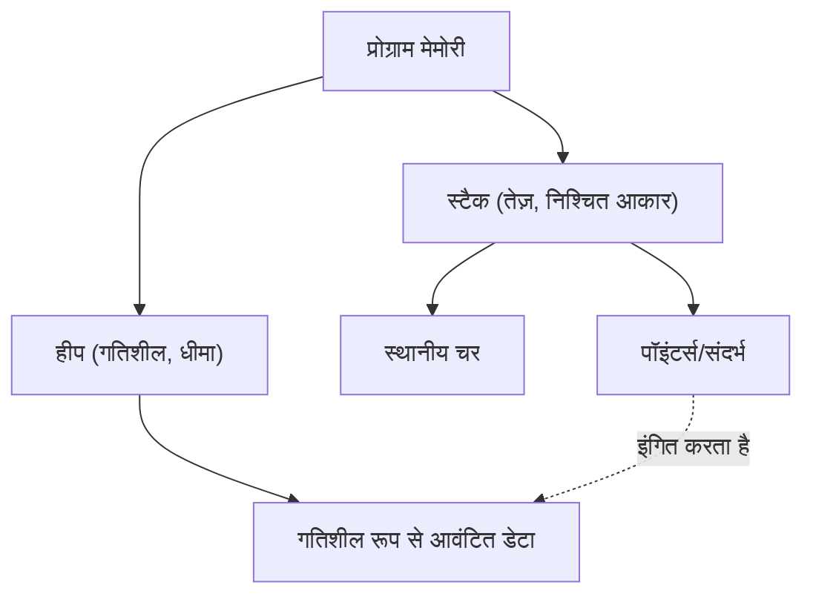

आधुनिक सिस्टम प्रोग्रामिंग में, प्रदर्शन और मेमोरी सुरक्षा को संतुलित करना एक शाश्वत चुनौती है। C++ लंबे समय से इस क्षेत्र का राजा रहा है, लेकिन हाल के वर्षों में Rust इसकी स्थिति के लिए खतरा बन रहा है। Rust की सबसे बड़ी विशेषता "स्वामित्व" (Ownership) और "उधार" (Borrowing) की अवधारणा है, जो बिना कचरा संग्रहण (Garbage Collection या GC) के संकलन के समय (compile time) मेमोरी सुरक्षा की गारंटी देती है।

इस लेख में, हम C++ के पॉइंटर्स (raw pointers, `std::unique_ptr`, `std::shared_ptr`) और Rust के स्वामित्व मॉडल की विस्तार से तुलना करेंगे। हम कोड उदाहरणों और आरेखों के साथ गहराई से बताएंगे कि Rust का कंपाइलर (बरो चेकर) यूज़-आफ्टर-फ्री (Use-After-Free) और डेटा रेस (Data Race) को कैसे रोकता है।

## 1. मेमोरी प्रबंधन के मूल तत्व: स्टैक और हीप

मेमोरी प्रबंधन की मूल बातें समझने के लिए, आइए पहले देखें कि कोई प्रोग्राम मेमोरी का उपयोग कैसे करता है। मेमोरी क्षेत्र को मोटे तौर पर "स्टैक" (Stack) और "हीप" (Heap) में वर्गीकृत किया जाता है।

### स्टैक (Stack)
यह वह क्षेत्र है जहाँ फ़ंक्शन कॉल के दौरान स्थानीय चर आदि जमा किए जाते हैं। इसकी LIFO (लास्ट-इन, फर्स्ट-आउट) संरचना है, और मेमोरी आवंटन/मुक्ति (allocation/deallocation) बहुत तेज़ है। इसमें केवल वह डेटा रखा जाता है जिसका आकार संकलन के समय (compile time) निर्धारित किया जा सकता है।

### हीप (Heap)
इसमें वह डेटा रखा जाता है जिसका आकार रनटाइम पर गतिशील रूप से निर्धारित होता है, या वह डेटा जिसे फ़ंक्शन के दायरे (scope) से परे जीवित रहने की आवश्यकता होती है। इसे पॉइंटर्स (या संदर्भों) के माध्यम से एक्सेस किया जाता है।

बिना कचरा संग्रहण वाले C++ और Rust में, हीप मेमोरी प्रबंधन की लागत को निम्न सूत्र के रूप में मॉडल किया जा सकता है। मान लीजिए कि वस्तुओं की कुल संख्या $N$ है, आवंटन के लिए औसत समय $T_{alloc}$ है, और मुक्ति के लिए औसत समय $T_{dealloc}$ है। तब कुल मेमोरी प्रबंधन लागत $C_{memory}$ होगी:

$$ C_{memory} = \sum_{i=1}^{N} (T_{alloc, i} + T_{dealloc, i}) + O_{sync} $$

यहाँ, $O_{sync}$ मल्टी-थ्रेडेड वातावरण में पारस्परिक अपवर्जन (mutual exclusion जैसे कि म्यूटेक्स या परमाणु संचालन) का ओवरहेड है। चूंकि Rust संकलन के समय मेमोरी मुक्ति का समय निर्धारित करता है, यह रनटाइम पर कचरा संग्रहण के कारण थ्रूपुट में कमी (Stop-The-World) को शून्य कर देता है, और $T_{dealloc}$ को विश्वसनीय और सुरक्षित समय पर निष्पादित करता है।



## 2. C++ पॉइंटर्स: स्वतंत्रता और खतरे के बीच का व्यापार

आइए C++ में मेमोरी प्रबंधन के विकास पर एक नज़र डालें।

### रॉ पॉइंटर्स (Raw Pointers) का युग और समस्याएं

C भाषा से विरासत में मिले रॉ पॉइंटर्स (`*`) परम स्वतंत्रता प्रदान करते हैं, लेकिन साथ ही वे निम्नलिखित गंभीर बग्स का कारण भी बनते हैं:

- **मेमोरी लीक (Memory Leak)**: `new` के साथ आवंटित मेमोरी को `delete` करना भूल जाना।
- **डैंगलिंग पॉइंटर (Dangling Pointer)**: मेमोरी मुक्त होने (`delete`) के बाद पॉइंटर को एक्सेस करना।
- **डबल फ्री (Double Free)**: एक ही मेमोरी क्षेत्र को दो बार `delete` करना।

```cpp
// C++: रॉ पॉइंटर के कारण होने वाली समस्या का उदाहरण
void rawPointerExample() {
    int* ptr = new int(10);
    // ... कुछ कार्य ...
    delete ptr; 
    
    // गलती से फिर से एक्सेस करना (Use-After-Free / Dangling Pointer)
    // C++ कंपाइलर इसे संकलन त्रुटि (compile error) नहीं बना सकता
    std::cout << *ptr << std::endl; // अपरिभाषित व्यवहार (Undefined Behavior)
}
```

### RAII और स्मार्ट पॉइंटर्स का उदय (C++11 और उसके बाद)

C++11 के बाद से, RAII (Resource Acquisition Is Initialization) अवधारणा पर आधारित स्मार्ट पॉइंटर्स को मानकीकृत किया गया, और रॉ पॉइंटर्स के सीधे उपयोग को हतोत्साहित किया गया।

#### `std::unique_ptr`
यह एक पॉइंटर है जो व्यक्त करता है कि स्वामित्व एकल है। जब यह दायरे (scope) से बाहर हो जाता है, तो मेमोरी स्वचालित रूप से मुक्त हो जाती है। इसे कॉपी नहीं किया जा सकता है; स्वामित्व को केवल "स्थानांतरित" (move) किया जा सकता है (`std::move` का उपयोग करके)।

```cpp
// C++: std::unique_ptr
#include <memory>
#include <iostream>

void uniquePtrExample() {
    std::unique_ptr<int> p1 = std::make_unique<int>(42);
    // std::unique_ptr<int> p2 = p1; // संकलन त्रुटि (कॉपी नहीं किया जा सकता)
    std::unique_ptr<int> p3 = std::move(p1); // स्वामित्व का स्थानांतरण
    
    // C++ की कमजोरी: स्थानांतरित होने के बाद p1 nullptr हो जाता है, लेकिन एक्सेस स्वयं संकलित हो सकता है
    // जो रनटाइम पर क्रैश (segmentation fault) का कारण बनेगा
    // std::cout << *p1 << std::endl; 
}
```

#### `std::shared_ptr`
यह एक पॉइंटर है जो कई पॉइंटर्स को एक ही ऑब्जेक्ट साझा करने की अनुमति देता है। यह संदर्भ गणना (Reference Counting) का उपयोग करता है, और गिनती शून्य होने पर मेमोरी को मुक्त करता है। चूंकि इसके लिए परमाणु वृद्धि/कमी संचालन की आवश्यकता होती है, इसलिए इसमें थोड़ा प्रदर्शन ओवरहेड (पहले उल्लेखित $O_{sync}$ के समतुल्य) होता है।

## 3. Rust का स्वामित्व (Ownership): एक आदर्श बदलाव (Paradigm Shift)

Rust ने C++ के `std::unique_ptr` की अवधारणा को अपनी भाषा विनिर्देशन के मूल में रखा है और इसका एक सख्त "स्वामित्व मॉडल" है।

### स्वामित्व के 3 नियम

Rust का स्वामित्व सिस्टम निम्नलिखित तीन अत्यंत सरल नियमों पर आधारित है:

1. **Rust में प्रत्येक मूल्य (value) का एक चर (variable) होता है जिसे उसका स्वामी (owner) कहा जाता है।**
2. **एक समय में केवल एक ही स्वामी हो सकता है।**
3. **जब स्वामी दायरे (scope) से बाहर हो जाता है, मूल्य नष्ट हो जाता है।**

Rust में डिफ़ॉल्ट रूप से संसाधनों को "स्थानांतरित" (move) किया जाता है। C++ के `std::move` को स्पष्ट रूप से निर्दिष्ट किए बिना, असाइनमेंट ऑपरेशन से स्वामित्व स्थानांतरित हो जाता है।

```rust
// Rust: स्वामित्व का स्थानांतरण (Move)
fn main() {
    let s1 = String::from("hello"); // हीप में आवंटित डेटा
    let s2 = s1; // स्वामित्व s1 से s2 में स्थानांतरित (move) हो जाता है

    // C++ के साथ सबसे बड़ा अंतर: स्थानांतरित चर तक पहुंच "संकलन त्रुटि" (compile error) बन जाती है!
    // println!("{}, world!", s1); // संकलन त्रुटि: value borrowed here after move
}
```

यह सुविधा जो "स्थानांतरित चर तक पहुंच को संकलन समय पर अक्षम कर देती है", उन कारणों में से एक है कि Rust C++ के `std::unique_ptr` से अधिक सुरक्षित क्यों है।

```mermaid
sequenceDiagram
    participant S1 as "चर s1"
    participant Heap as "हीप मेमोरी ('hello')"
    participant S2 as "चर s2"
    
    S1->>Heap: "आवंटित करता है और स्वामित्व रखता है"
    Note over S1,S2: "let s2 = s1;"
    S1--xHeap: "स्वामित्व खो देता है (अमान्य)"
    S2->>Heap: "स्वामित्व ले लेता है"
```

## 4. उधार (Borrowing) और संदर्भ (References)

यदि स्वामित्व हमेशा स्थानांतरित किया जाता है, तो हर बार फ़ंक्शन में मूल्य पास करने पर आपको स्वामित्व वापस लेना होगा, जो बहुत असुविधाजनक है। यहीं पर "उधार" (Borrowing) खेल में आता है। यह C++ पॉइंटर्स या संदर्भों के समतुल्य है।

Rust में उधार दो प्रकार के होते हैं:
- **अपरिवर्तनीय संदर्भ (Immutable Reference)**: `&T` (C++ के `const T&` के समान)
- **परिवर्तनीय संदर्भ (Mutable Reference)**: `&mut T` (C++ के `T&` के समान)

### बरो चेकर (Borrow Checker) के कठोर नियम

Rust के कंपाइलर में एक अंतर्निहित "बरो चेकर" होता है जो संदर्भों की वैधता की पुष्टि करता है। बरो चेकर निम्नलिखित सख्त नियमों को लागू करता है:

> किसी भी दायरे (scope) में, किसी भी समय, केवल निम्नलिखित में से एक मौजूद हो सकता है:
> - **एक परिवर्तनीय संदर्भ (`&mut T`)**
> - **कई अपरिवर्तनीय संदर्भ (`&T`)**

इसे **"मल्टीपल रीडर्स एक्सओआर सिंगल राइटर (MRSW)"** सिद्धांत कहा जाता है। इसे गणितीय अनन्य OR (XOR) द्वारा दर्शाया जा सकता है। एक स्थिति $S$ के लिए, अपरिवर्तनीय संदर्भों की संख्या $N_r$ और परिवर्तनीय संदर्भों की संख्या $N_w$ को निम्नलिखित बाधा को पूरा करना होगा:

$$ (N_r \ge 0 \land N_w = 0) \oplus (N_r = 0 \land N_w = 1) $$

इस नियम के माध्यम से, **डेटा रेस (Data Race) संकलन समय (compile time) पर पूरी तरह से समाप्त हो जाता है**। डेटा रेस तब होता है जब: ① दो या दो से अधिक पॉइंटर्स एक ही डेटा तक एक साथ पहुंचते हैं, ② कम से कम एक लिख रहा होता है (write operation), और ③ कोई सिंक्रनाइज़ेशन तंत्र नहीं होता है। Rust संकलन समय पर स्थिति ② को नष्ट करके डेटा रेस को रोकता है।

```rust
// Rust: उधार नियम के उल्लंघन के कारण संकलन त्रुटि
fn main() {
    let mut s = String::from("hello");

    let r1 = &s; // अपरिवर्तनीय उधार (OK)
    let r2 = &s; // अपरिवर्तनीय उधार (OK)
    // let r3 = &mut s; // त्रुटि! अपरिवर्तनीय उधार मौजूद होने पर परिवर्तनीय उधार नहीं बनाया जा सकता

    println!("{}, {}", r1, r2);
}
```

## 5. इटरेटर अमान्यकरण (Iterator Invalidation) की रोकथाम

बरो चेकर की शक्ति के सबसे ठोस उदाहरण के रूप में, आइए "इटरेटर अमान्यकरण" (Iterator Invalidation) नामक एक क्लासिक बग देखें।

### C++ में इटरेटर अमान्यकरण (रनटाइम क्रैश)

यदि आप लूप के दौरान C++ `std::vector` को संशोधित करते हैं, तो इसके पीछे की मेमोरी फिर से आवंटित (Reallocation) हो सकती है, और संदर्भ एक डैंगलिंग पॉइंटर बन जाएगा।

```cpp
// C++: इटरेटर अमान्यकरण बग
#include <iostream>
#include <vector>

int main() {
    std::vector<int> v = {1, 2, 3};
    
    // वेक्टर के तत्व का संदर्भ प्राप्त करें
    int& first = v[0]; 
    
    // तत्व जोड़ें (यदि यहाँ क्षमता अपर्याप्त है, तो एक नया मेमोरी क्षेत्र आवंटित किया जाएगा,
    // और पुराना क्षेत्र नष्ट हो सकता है)
    v.push_back(4); 
    
    // first पहले से ही मुक्त मेमोरी को इंगित कर रहा हो सकता है! (अपरिभाषित व्यवहार)
    std::cout << "The first element is: " << first << std::endl; 
    
    return 0;
}
```

### Rust का संकलन-समय बचाव

आइए ठीक इसी तर्क को Rust में लिखें।

```rust
// Rust: संकलन समय पर इटरेटर अमान्यकरण को रोकना
fn main() {
    let mut v = vec![1, 2, 3];

    // अपरिवर्तनीय संदर्भ प्राप्त करें (उधार शुरू)
    let first = &v[0]; 

    // त्रुटि! जबकि `first` `v` को अपरिवर्तनीय रूप से उधार ले रहा है,
    // हम `v.push` के लिए आवश्यक परिवर्तनीय उधार नहीं ले सकते।
    // v.push(4); 

    println!("The first element is: {}", first);
}
```

इस तरह, चूँकि Rust कंपाइलर स्तर पर "किसी मान को पढ़ते समय (अपरिवर्तनीय उधार) उसे बदलना (परिवर्तनीय उधार)" सख्त मना करता है, यूज़-आफ्टर-फ्री और इटरेटर अमान्यकरण जैसे घातक बग संकलन समय पर निश्चित रूप से पकड़े जाते हैं।

```mermaid
graph LR
    A["चर v (स्वामी)"] --> B["हीप ऐरे [1, 2, 3]"]
    C["संदर्भ 'first' (&v[0])"] -.->|"अपरिवर्तनीय उधार"| B
    A -->|X "परिवर्तनीय उधार अस्वीकृत!"| D["v.push(4)"]
    
    style C stroke:#00FF00,stroke-width:2px
    style D stroke:#FF0000,stroke-width:2px
```

## 6. Rust में साझा स्वामित्व: `Rc` और `Arc`

Rust साझा स्वामित्व (Shared Ownership) भी प्रदान करता है जो C++ के `std::shared_ptr` के बराबर है, लेकिन प्रकारों को सिंगल-थ्रेडेड और मल्टी-थ्रेडेड उपयोग के लिए स्पष्ट रूप से अलग किया गया है।

### सिंगल-थ्रेडेड उपयोग के लिए: `Rc<T>` (Reference Counted)
`Rc<T>` एक गैर-थ्रेड-सुरक्षित संदर्भ-गिने जाने वाला स्मार्ट पॉइंटर है। यह परमाणु (atomic) निर्देशों का उपयोग किए बिना गिनती बढ़ाता/घटाता है, जिससे यह एक थ्रेड के भीतर बहुत तेज़ हो जाता है। हालाँकि, यदि आप इसे दूसरे थ्रेड में भेजने का प्रयास करते हैं, तो एक संकलन त्रुटि होगी (क्योंकि यह `Send` ट्रेट को लागू नहीं करता है)।

### मल्टी-थ्रेडेड उपयोग के लिए: `Arc<T>` (Atomic Reference Counted)
थ्रेड्स के बीच साझा करते समय, हम `Arc<T>` का उपयोग करते हैं, जो परमाणु वृद्धि/कमी करता है। इसमें C++ के `std::shared_ptr` के समान लागत होती है।

इसके अलावा, C++ में, यदि कई थ्रेड एक साथ `std::shared_ptr` द्वारा साझा किए गए चर में लिखते हैं, तो डेटा रेस होता है। इसे रोकने के लिए, आपको `std::mutex` का सही ढंग से उपयोग करना होगा।

दूसरी ओर, Rust में, आप अकेले `Arc<T>` के साथ **आंतरिक डेटा को संशोधित नहीं कर सकते** हैं। यदि संशोधन की आवश्यकता है, तो इसे म्यूटेक्स `Mutex<T>` के साथ जोड़ा जाना चाहिए।

```rust
use std::sync::{Arc, Mutex};
use std::thread;

fn main() {
    // थ्रेड-सुरक्षित साझाकरण और पारस्परिक अपवर्जन का संयोजन
    // C++ के std::shared_ptr<std::mutex> के समान है, लेकिन Mutex डेटा को समाहित करता है
    let counter = Arc::new(Mutex::new(0));
    let mut handles = vec![];

    for _ in 0..10 {
        let counter_clone = Arc::clone(&counter);
        let handle = thread::spawn(move || {
            // lock() को कॉल करने पर ही आप आंतरिक परिवर्तनीय संदर्भ (&mut i32) प्राप्त कर सकते हैं
            let mut num = counter_clone.lock().unwrap();
            *num += 1;
        }); // RAII के कारण दायरे (scope) से बाहर निकलते ही लॉक स्वचालित रूप से जारी हो जाता है
        handles.push(handle);
    }

    for handle in handles {
        handle.join().unwrap();
    }

    println!("Result: {}", *counter.lock().unwrap());
}
```

उल्लेखनीय बात यह है कि Rust का `Mutex<T>` केवल एक लॉकिंग तंत्र नहीं है, बल्कि **"सुरक्षित किए जाने वाले डेटा को एक प्रकार (type) के रूप में समाहित करता है"**। यह संकलन स्तर पर "लॉक प्राप्त करना भूल जाना और डेटा तक पहुंचना" जैसी गलतियों को पूरी तरह से रोकता है। जब तक आप लॉक (`lock()`) प्राप्त नहीं करते हैं, तब तक आप आंतरिक डेटा तक पहुंचने के अधिकार (संदर्भ) प्राप्त नहीं कर सकते हैं।

## निष्कर्ष: कंपाइलर द्वारा "पूर्व-निरीक्षण" या डेवलपर द्वारा "स्वयं की जिम्मेदारी"?

C++ पॉइंटर्स और स्मार्ट पॉइंटर्स डेवलपर्स को उच्च स्तर का नियंत्रण और प्रदर्शन प्रदान करते हैं, लेकिन उनका सही उपयोग डेवलपर्स के अनुशासन पर निर्भर करता है। RAII और `std::unique_ptr` की शुरुआत ने C++ को नाटकीय रूप से सुरक्षित बना दिया है, लेकिन यह अभी भी "अपरिभाषित व्यवहार" (undefined behavior) जैसे कि मूव के बाद एक्सेस या इटरेटर अमान्यकरण को भाषा स्तर पर पूरी तरह से नहीं रोक सकता है।

दूसरी ओर, Rust कंपाइलर में स्वामित्व (Ownership) और उधार (Borrowing) के नियमों को शामिल करके रनटाइम के बजाय **संकलन समय (compile time)** पर इन त्रुटियों का पता लगाता है। "यदि यह संकलित होता है, तो यह मेमोरी सुरक्षित है" की यह मजबूत गारंटी सबसे बड़ा कारण है कि Rust सिस्टम प्रोग्रामिंग में तेजी से समर्थन प्राप्त कर रहा है।

Rust के बरो चेकर से लड़ना (Fight the borrow checker) शुरुआती लोगों के लिए एक बड़ी बाधा हो सकती है, लेकिन यह केवल कंपाइलर द्वारा "पॉइंटर के जीवनकाल को ट्रैक करने" की जटिल गणना को सख्ती से करने के लिए है, जो मूल रूप से C++ प्रोग्रामर्स को अपने दिमाग में करना पड़ता था।

C++ पॉइंटर्स की स्वतंत्रता और खतरों को समझने के बाद Rust सीखने से आपको स्वामित्व मॉडल के पीछे "यह डिज़ाइन क्यों चुना गया" के दर्शन को अधिक गहराई से समझने में मदद मिलेगी।

---
*यह लेख C++ और Rust के बीच मेमोरी प्रबंधन तकनीकों का तुलनात्मक अध्ययन है। हमें उम्मीद है कि यह प्रत्येक परियोजना की आवश्यकताओं के अनुसार उपयुक्त भाषा चुनने के लिए एक संदर्भ के रूप में कार्य करेगा।*
