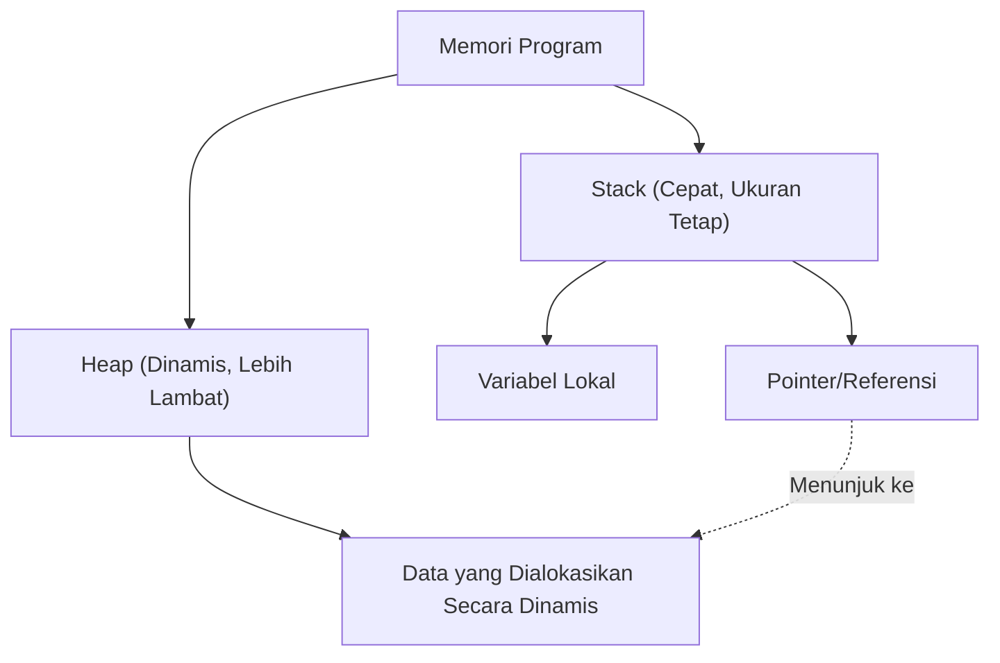

Dalam pemrograman sistem modern, menyeimbangkan kinerja dan keamanan memori adalah tantangan abadi. C++ telah berkuasa sebagai raja di bidang ini selama bertahun-tahun, tetapi dalam beberapa tahun terakhir, posisinya mulai terancam oleh Rust. Fitur terbesar Rust terletak pada konsep "Kepemilikan" (Ownership) dan "Peminjaman" (Borrowing), yang menjamin keamanan memori pada saat kompilasi tanpa memiliki garbage collection (GC).

Pada artikel ini, kita akan membandingkan secara rinci pointer C++ (pointer mentah, `std::unique_ptr`, `std::shared_ptr`) dan model kepemilikan Rust, serta menjelaskan secara menyeluruh bagaimana kompiler Rust (borrow checker) mencegah Use-After-Free (penggunaan setelah pembebasan) dan data race (perlombaan data), disertai dengan contoh kode dan diagram.

## 1. Dasar-dasar Manajemen Memori: Stack dan Heap

Untuk memahami dasar-dasar manajemen memori, mari kita tinjau kembali bagaimana sebuah program menggunakan memori. Area memori secara umum dibagi menjadi "Stack" dan "Heap".

### Stack
Ini adalah area di mana variabel lokal saat pemanggilan fungsi dan sejenisnya ditumpuk. Ini memiliki struktur LIFO (Last-In-First-Out) dan alokasi/de-alokasi memorinya sangat cepat. Hanya data yang ukurannya dapat ditentukan pada saat kompilasi yang ditempatkan di sini.

### Heap
Data yang ukurannya ditentukan secara dinamis pada saat runtime, atau data yang perlu bertahan melampaui ruang lingkup (scope) fungsi ditempatkan di sini. Data ini diakses melalui pointer (atau referensi).

Dalam C++ atau Rust yang tidak memiliki garbage collection, biaya manajemen memori heap dapat dimodelkan dalam rumus matematika sebagai berikut. Misalkan jumlah total objek adalah $N$, waktu rata-rata yang diperlukan untuk alokasi adalah $T_{alloc}$, dan waktu rata-rata yang diperlukan untuk de-alokasi adalah $T_{dealloc}$, maka total biaya manajemen memori $C_{memory}$ adalah:

$$ C_{memory} = \sum_{i=1}^{N} (T_{alloc, i} + T_{dealloc, i}) + O_{sync} $$

Di sini, $O_{sync}$ adalah overhead untuk kontrol eksklusif (seperti mutex atau operasi atomik) di bawah lingkungan multi-thread. Karena Rust menentukan waktu pembebasan memori pada saat kompilasi, penurunan throughput akibat garbage collection (Stop-The-World) pada saat runtime menjadi nol, sementara $T_{dealloc}$ dieksekusi pada waktu yang pasti dan aman.



## 2. Pointer C++: Pertukaran antara Kebebasan dan Bahaya

Mari kita lihat evolusi manajemen memori di C++.

### Era Pointer Mentah (Raw Pointers) dan Masalahnya

Pointer mentah (`*`) yang diwarisi dari bahasa C menawarkan kebebasan tertinggi, tetapi pada saat yang sama menjadi sarang bagi bug serius seperti berikut.

- **Kebocoran Memori (Memory Leak)**: Lupa menggunakan `delete` pada memori yang dialokasikan dengan `new`.
- **Dangling Pointer**: Mengakses pointer setelah memorinya dibebaskan (setelah `delete`).
- **Double Free**: Menggunakan `delete` dua kali pada area memori yang sama.

```cpp
// C++: Contoh masalah dengan pointer mentah
void rawPointerExample() {
    int* ptr = new int(10);
    // ... beberapa proses ...
    delete ptr; 
    
    // Mengakses kembali secara tidak sengaja (Use-After-Free / Dangling Pointer)
    // Kompiler C++ tidak dapat membuat ini menjadi kesalahan kompilasi
    std::cout << *ptr << std::endl; // Perilaku Tidak Terdefinisi (Undefined Behavior)
}
```

### Kemunculan RAII dan Smart Pointer (Sejak C++11)

Sejak C++11, smart pointer berdasarkan konsep RAII (Resource Acquisition Is Initialization) telah distandardisasi, dan penggunaan langsung pointer mentah sudah tidak disarankan.

#### `std::unique_ptr`
Ini adalah pointer yang mengekspresikan bahwa kepemilikannya tunggal. Memori secara otomatis dibebaskan saat keluar dari scope. Itu tidak dapat disalin, dan hanya kepemilikan yang dapat "dipindahkan" (move) (menggunakan `std::move`).

```cpp
// C++: std::unique_ptr
#include <memory>
#include <iostream>

void uniquePtrExample() {
    std::unique_ptr<int> p1 = std::make_unique<int>(42);
    // std::unique_ptr<int> p2 = p1; // Kesalahan kompilasi (tidak dapat disalin)
    std::unique_ptr<int> p3 = std::move(p1); // Perpindahan kepemilikan
    
    // Kelemahan C++: p1 menjadi nullptr setelah pemindahan, tetapi aksesnya sendiri dapat dikompilasi
    // Ini akan menyebabkan crash saat runtime (segmentation fault)
    // std::cout << *p1 << std::endl; 
}
```

#### `std::shared_ptr`
Ini adalah pointer yang memungkinkan beberapa pointer untuk berbagi objek yang sama. Ia menggunakan penghitungan referensi (Reference Counting), dan membebaskan memori ketika hitungannya mencapai 0. Karena operasi penambahan/pengurangan atomik diperlukan, ini menyebabkan sedikit overhead kinerja (setara dengan $O_{sync}$ yang disebutkan sebelumnya).

## 3. Kepemilikan (Ownership) Rust: Perubahan Paradigma

Rust menjadikan konsep `std::unique_ptr` dari C++ sebagai inti dari spesifikasi bahasanya, dan memiliki "model kepemilikan" yang bahkan lebih ketat.

### 3 Aturan Kepemilikan

Sistem kepemilikan Rust didasarkan pada tiga aturan yang sangat sederhana berikut:

1. **Setiap nilai dalam Rust memiliki variabel yang disebut pemiliknya (owner).**
2. **Hanya boleh ada satu pemilik pada satu waktu.**
3. **Ketika pemilik keluar dari scope, nilai tersebut akan dibuang.**

Di Rust, sumber daya "dipindahkan" secara default. Bahkan tanpa menyebutkan `std::move` secara eksplisit seperti di C++, operasi penugasan memindahkan kepemilikan.

```rust
// Rust: Perpindahan kepemilikan (Move)
fn main() {
    let s1 = String::from("hello"); // Data yang dialokasikan di heap
    let s2 = s1; // Kepemilikan berpindah (move) dari s1 ke s2

    // Perbedaan terbesar dengan C++: Akses ke variabel setelah perpindahan menjadi "kesalahan kompilasi"!
    // println!("{}, world!", s1); // Kesalahan kompilasi: value borrowed here after move
}
```

Fungsi "membuat variabel yang dipindahkan tidak dapat diakses pada saat kompilasi" ini adalah salah satu alasan mengapa Rust lebih aman daripada `std::unique_ptr` di C++.

```mermaid
sequenceDiagram
    participant S1 as "Variabel s1"
    participant Heap as "Memori Heap ('hello')"
    participant S2 as "Variabel s2"
    
    S1->>Heap: "Mengalokasikan & Memiliki"
    Note over S1,S2: "let s2 = s1;"
    S1--xHeap: "Kehilangan Kepemilikan (Tidak Valid)"
    S2->>Heap: "Mengambil Kepemilikan"
```

## 4. Peminjaman (Borrowing) dan Referensi

Jika kepemilikan selalu dipindahkan, kita harus mengembalikan kepemilikan setiap kali kita meneruskan nilai ke suatu fungsi, yang mana itu sangat tidak nyaman. Di sinilah "Peminjaman" (Borrowing) berperan. Ini setara dengan pointer atau referensi dalam C++.

Ada dua jenis peminjaman di Rust:
- **Referensi Imutabel (Immutable Reference)**: `&T` (Mirip dengan `const T&` dalam C++)
- **Referensi Mutabel (Mutable Reference)**: `&mut T` (Mirip dengan `T&` dalam C++)

### Aturan Kejam dari Borrow Checker

Kompiler Rust memiliki mekanisme bawaan bernama "borrow checker" yang memvalidasi kebenaran referensi. Borrow checker memaksakan aturan ketat berikut:

> Dalam suatu scope tertentu, hanya salah satu dari berikut ini yang dapat ada:
> - **Satu referensi mutabel (`&mut T`)**
> - **Beberapa referensi imutabel (`&T`)**

Ini disebut sebagai prinsip **"Multiple Readers XOR Single Writer (MRSW)"**. Ini dapat diekspresikan dengan matematika XOR (Exclusive OR). Untuk status $S$, jumlah referensi imutabel $N_r$ dan jumlah referensi mutabel $N_w$ harus memenuhi batasan berikut:

$$ (N_r \ge 0 \land N_w = 0) \oplus (N_r = 0 \land N_w = 1) $$

Melalui aturan ini, **data race sepenuhnya dihilangkan pada saat kompilasi**. Data race terjadi ketika: (1) dua atau lebih pointer mengakses data yang sama secara bersamaan, (2) setidaknya satu darinya melakukan penulisan, dan (3) tidak ada mekanisme sinkronisasi. Rust mencegah data race agar tidak terjadi dengan menghancurkan kondisi (2) pada saat kompilasi.

```rust
// Rust: Kesalahan kompilasi karena pelanggaran aturan peminjaman
fn main() {
    let mut s = String::from("hello");

    let r1 = &s; // Peminjaman imutabel (OK)
    let r2 = &s; // Peminjaman imutabel (OK)
    // let r3 = &mut s; // Error! Tidak dapat membuat peminjaman mutabel jika ada peminjaman imutabel

    println!("{}, {}", r1, r2);
}
```

## 5. Mencegah Inisialisasi Iterator yang Tidak Valid (Iterator Invalidation)

Sebagai contoh konkret di mana kekuatan borrow checker paling terlihat, mari kita lihat bug klasik yang disebut "pembatalan iterator" (iterator invalidation).

### Iterator Invalidation di C++ (Crash saat Runtime)

Jika kita memodifikasi `std::vector` dalam C++ di dalam loop, memori di belakangnya dapat dialokasikan ulang (Reallocation), mengubah referensi menjadi dangling pointer.

```cpp
// C++: Bug invalidasi iterator
#include <iostream>
#include <vector>

int main() {
    std::vector<int> v = {1, 2, 3};
    
    // Mendapatkan referensi ke elemen vektor
    int& first = v[0]; 
    
    // Menambahkan elemen (Jika kapasitas tidak cukup di sini, area memori baru akan dialokasikan,
    // dan area lama mungkin dibuang)
    v.push_back(4); 
    
    // first mungkin menunjuk ke memori yang sudah dibebaskan! (Perilaku Tidak Terdefinisi)
    std::cout << "The first element is: " << first << std::endl; 
    
    return 0;
}
```

### Pertahanan saat Kompilasi oleh Rust

Mari kita tulis logika yang sama persis di Rust.

```rust
// Rust: Mencegah invalidasi iterator pada saat kompilasi
fn main() {
    let mut v = vec![1, 2, 3];

    // Mendapatkan referensi imutabel (Peminjaman dimulai)
    let first = &v[0]; 

    // Error! Selama `first` meminjam `v` secara imutabel,
    // peminjaman mutabel yang diperlukan untuk `v.push` tidak dapat dilakukan.
    // v.push(4); 

    println!("The first element is: {}", first);
}
```

Seperti ini, di Rust, "mengubah suatu nilai (meminjam mutabel) saat nilai tersebut sedang dibaca (dipinjam imutabel)" dilarang pada tingkat kompiler, sehingga bug fatal seperti Use-After-Free atau pembatalan iterator pasti ditangkap pada saat kompilasi.

```mermaid
graph LR
    A["Variabel v (Pemilik)"] --> B["Array Heap [1, 2, 3]"]
    C["Referensi 'first' (&v[0])"] -.->|"Peminjaman Imutabel"| B
    A -->|X "Peminjaman Mutabel Ditolak!"| D["v.push(4)"]
    
    style C stroke:#00FF00,stroke-width:2px
    style D stroke:#FF0000,stroke-width:2px
```

## 6. Kepemilikan Bersama di Rust: `Rc` dan `Arc`

Kepemilikan bersama yang setara dengan `std::shared_ptr` di C++ juga tersedia di Rust, namun tipenya dipisahkan dengan jelas untuk thread tunggal dan multi-thread.

### Untuk Thread Tunggal: `Rc<T>` (Reference Counted)
`Rc<T>` adalah smart pointer penghitung referensi yang tidak thread-safe. Ia sangat cepat di dalam satu thread tunggal karena menambah dan mengurangi hitungan tanpa menggunakan instruksi atomik. Namun, jika Anda mencoba mengirimnya ke thread lain, itu akan menyebabkan kesalahan kompilasi (karena tidak mengimplementasikan trait `Send`).

### Untuk Multi-thread: `Arc<T>` (Atomic Reference Counted)
Saat berbagi antar thread, kita menggunakan `Arc<T>` yang melakukan penambahan dan pengurangan secara atomik. Biayanya setara dengan `std::shared_ptr` di C++.

Lebih jauh lagi, di C++, jika Anda melakukan penulisan secara bersamaan dari beberapa thread ke variabel yang dibagikan dengan `std::shared_ptr`, data race akan terjadi. Untuk mencegah hal ini, Anda harus menggunakan `std::mutex` dengan benar secara manual.

Di sisi lain, dalam Rust, **data di dalam tidak dapat diubah** hanya dengan `Arc<T>` saja. Jika perubahan diperlukan, ia harus digabungkan dengan `Mutex<T>`, yang merupakan sebuah mutex.

```rust
use std::sync::{Arc, Mutex};
use std::thread;

fn main() {
    // Kombinasi dari pembagian thread-safe dan kontrol eksklusif
    // Mirip dengan std::shared_ptr<std::mutex> di C++, tetapi Mutex membungkus data
    let counter = Arc::new(Mutex::new(0));
    let mut handles = vec![];

    for _ in 0..10 {
        let counter_clone = Arc::clone(&counter);
        let handle = thread::spawn(move || {
            // Referensi mutabel internal (&mut i32) hanya dapat diperoleh dengan memanggil lock()
            let mut num = counter_clone.lock().unwrap();
            *num += 1;
        }); // Pembebasan kunci secara otomatis dilakukan oleh RAII saat keluar dari scope
        handles.push(handle);
    }

    for handle in handles {
        handle.join().unwrap();
    }

    println!("Result: {}", *counter.lock().unwrap());
}
```

Yang perlu diperhatikan adalah `Mutex<T>` di Rust bukan sekadar mekanisme penguncian, tetapi **"membungkus data yang harus dilindungi sebagai sebuah tipe"**. Dengan ini, kesalahan seperti "mengakses data karena lupa mengambil kunci" dapat sepenuhnya dicegah pada tingkat kompilasi. Sistem dirancang sedemikian rupa sehingga hak akses (referensi) ke data di dalamnya tidak dapat diperoleh kecuali kunci (`lock()`) telah didapatkan.

## Kesimpulan: "Pemeriksaan Sebelumnya" oleh Kompiler, atau "Tanggung Jawab Sendiri" oleh Pengembang?

Pointer dan smart pointer C++ menawarkan kontrol tingkat tinggi dan kinerja kepada para pengembang, tetapi penggunaannya yang benar bergantung pada disiplin pengembang. Meskipun C++ menjadi jauh lebih aman dengan diperkenalkannya RAII dan `std::unique_ptr`, "perilaku tidak terdefinisi" seperti akses setelah perpindahan atau pembatalan iterator masih tidak dapat dicegah sepenuhnya pada tingkat bahasa.

Di sisi lain, Rust mendeteksi kesalahan-kesalahan ini **pada saat kompilasi** dan bukan saat runtime, dengan memasukkan aturan Kepemilikan (Ownership) dan Peminjaman (Borrowing) ke dalam kompiler. Jaminan kuat bahwa "jika dapat dikompilasi, maka memori aman" adalah alasan terbesar mengapa Rust dengan cepat mendapatkan dukungan dalam pemrograman sistem.

Bertarung dengan borrow checker Rust (Fight the borrow checker) adalah rintangan besar bagi pemula, namun itu hanya kompiler yang dengan ketat mengambil alih perhitungan kompleks tentang "melacak masa pakai pointer" yang awalnya dilakukan di kepala oleh pemrogram C++.

Mempelajari Rust setelah memahami kebebasan dan bahaya pointer C++ akan membantu Anda untuk lebih memahami secara mendalam filosofi "mengapa dirancang seperti ini" di balik model kepemilikan.

---
*Artikel ini adalah studi perbandingan metode manajemen memori di C++ dan Rust. Kami harap ini berfungsi sebagai referensi untuk memilih bahasa yang tepat berdasarkan persyaratan masing-masing proyek.*
