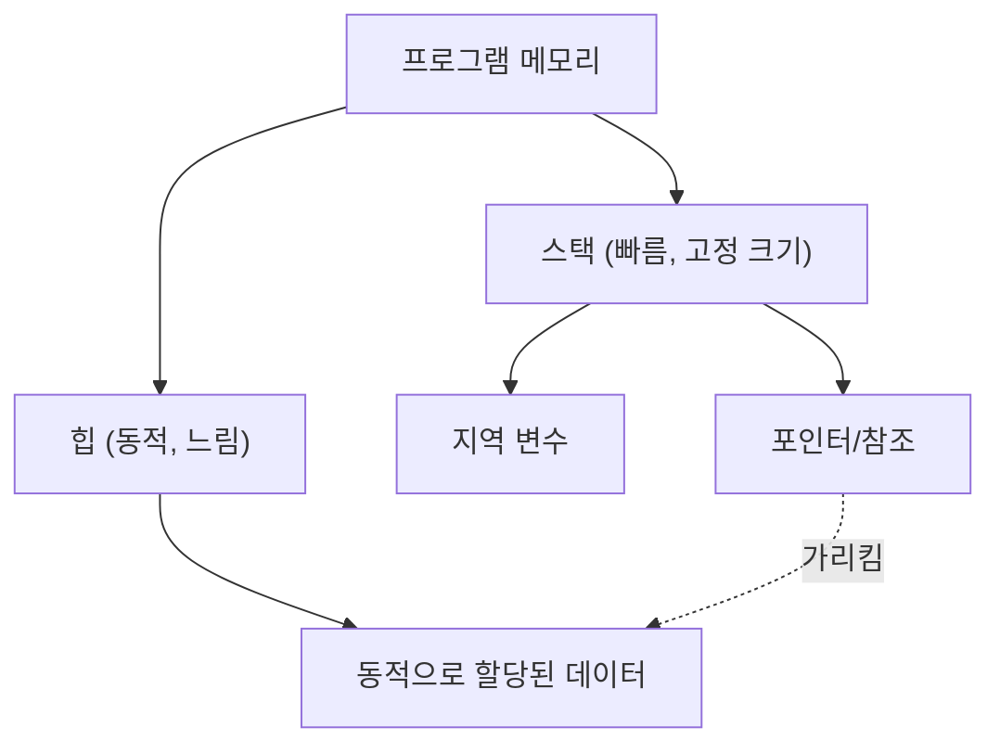

현대 시스템 프로그래밍에서 성능과 메모리 안전성의 양립은 영원한 과제입니다. C++는 오랫동안 이 분야의 제왕으로 군림해 왔지만, 최근 그 위상을 위협하고 있는 것이 바로 Rust입니다. Rust의 가장 큰 특징은 가비지 컬렉션(GC) 없이 컴파일 타임에 메모리 안전성을 보장하는 '소유권(Ownership)'과 '차용(Borrowing)'이라는 개념에 있습니다.

이 글에서는 C++의 포인터(원시 포인터, `std::unique_ptr`, `std::shared_ptr`)와 Rust의 소유권 모델을 자세히 비교하고, Rust의 컴파일러(보로우 체커)가 어떻게 Use-After-Free(해제 후 사용)나 데이터 경합(Data Race)을 방지하는지 코드 예제와 다이어그램을 통해 철저하게 해설합니다.

## 1. 메모리 관리의 기초: 스택과 힙

메모리 관리의 기본을 이해하기 위해, 먼저 프로그램이 메모리를 어떻게 활용하는지 되짚어 보겠습니다. 메모리 영역은 크게 '스택(Stack)'과 '힙(Heap)'으로 분류됩니다.

### 스택(Stack)
함수 호출 시 지역 변수 등이 쌓이는 영역입니다. LIFO(후입선출) 구조를 가지며 메모리 할당 및 해제가 매우 빠릅니다. 컴파일 타임에 크기를 결정할 수 있는 데이터만 배치됩니다.

### 힙(Heap)
실행 시 동적으로 크기가 결정되는 데이터나, 함수의 스코프를 넘어 생존해야 하는 데이터가 배치됩니다. 포인터(또는 참조)를 통해 접근됩니다.

가비지 컬렉션을 갖지 않는 C++나 Rust에서는 힙 메모리 관리 비용을 수식으로 다음과 같이 모델링할 수 있습니다. 객체의 총 개수를 $N$, 할당에 걸리는 평균 시간을 $T_{alloc}$, 해제에 걸리는 평균 시간을 $T_{dealloc}$이라고 할 때, 메모리 관리 총 비용 $C_{memory}$는:

$$ C_{memory} = \sum_{i=1}^{N} (T_{alloc, i} + T_{dealloc, i}) + O_{sync} $$

여기서 $O_{sync}$는 멀티스레드 환경에서의 상호 배제(뮤텍스나 원자적 연산)에 드는 오버헤드입니다. Rust는 컴파일 시점에 메모리 해제 타이밍을 결정하므로, 실행 시 가비지 컬렉션으로 인한 처리량 저하(Stop-The-World)를 0으로 만들면서 $T_{dealloc}$을 확실하고 안전한 타이밍에 실행합니다.



## 2. C++의 포인터: 자유와 위험의 트레이드오프

C++에서의 메모리 관리 변천사를 살펴보겠습니다.

### 원시 포인터(Raw Pointers)의 시대와 문제점

C 언어에서 물려받은 원시 포인터(`*`)는 궁극의 자유를 제공하지만, 동시에 다음과 같은 심각한 버그의 온상이 됩니다.

- **메모리 누수(Memory Leak)**: `new`한 메모리를 `delete`하는 것을 잊어버림.
- **댕글링 포인터(Dangling Pointer)**: 메모리 해제 후(`delete` 후)의 포인터에 접근함.
- **이중 해제(Double Free)**: 동일한 메모리 영역을 2번 `delete`해버림.

```cpp
// C++: 원시 포인터에 의한 문제의 예
void rawPointerExample() {
    int* ptr = new int(10);
    // ... 어떤 처리 ...
    delete ptr; 
    
    // 실수로 다시 접근 (Use-After-Free / Dangling Pointer)
    // C++ 컴파일러는 이를 컴파일 에러로 만들지 못함
    std::cout << *ptr << std::endl; // 미정의 동작(Undefined Behavior)
}
```

### RAII와 스마트 포인터의 등장 (C++11 이후)

C++11 이후, RAII (Resource Acquisition Is Initialization) 개념에 기반한 스마트 포인터가 표준화되어, 원시 포인터의 직접 사용은 권장되지 않습니다.

#### `std::unique_ptr`
소유권이 단일함을 표현하는 포인터입니다. 스코프를 벗어나면 자동으로 메모리가 해제됩니다. 복사는 불가능하며 소유권의 '이동(Move)'만 가능합니다(`std::move` 사용).

```cpp
// C++: std::unique_ptr
#include <memory>
#include <iostream>

void uniquePtrExample() {
    std::unique_ptr<int> p1 = std::make_unique<int>(42);
    // std::unique_ptr<int> p2 = p1; // 컴파일 에러 (복사 불가)
    std::unique_ptr<int> p3 = std::move(p1); // 소유권 이동
    
    // C++의 약점: 이동 후의 p1은 nullptr이 되지만, 접근 자체는 컴파일 가능
    // 실행 시 크래시(세그멘테이션 폴트)를 일으킴
    // std::cout << *p1 << std::endl; 
}
```

#### `std::shared_ptr`
여러 포인터가 같은 객체를 공유할 수 있는 포인터입니다. 참조 카운트(Reference Counting)를 사용하여, 카운트가 0이 된 시점에 메모리를 해제합니다. 원자적(atomic)인 증감 연산이 필요하므로 약간의 성능 오버헤드(앞서 언급한 $O_{sync}$에 해당)가 발생합니다.

## 3. Rust의 소유권(Ownership): 패러다임 시프트

Rust는 C++의 `std::unique_ptr` 개념을 언어 사양의 근간에 두고, 이를 더욱 엄격하게 만든 '소유권 모델'을 가지고 있습니다.

### 소유권의 3가지 규칙

Rust의 소유권 시스템은 다음 3가지의 매우 단순한 규칙을 바탕으로 합니다.

1. **Rust의 각각의 값은 소유자(owner)라고 불리는 변수를 가진다.**
2. **어느 때든 소유자는 단 하나뿐이다.**
3. **소유자가 스코프를 벗어나면 값은 파기된다.**

Rust에서는 기본적으로 리소스가 '이동(Move)'됩니다. C++처럼 `std::move`를 명시하지 않아도 대입 연산을 통해 소유권이 이동합니다.

```rust
// Rust: 소유권의 이동(무브)
fn main() {
    let s1 = String::from("hello"); // 힙에 할당되는 데이터
    let s2 = s1; // 소유권이 s1에서 s2로 이동(무브)함

    // C++과 다른 가장 큰 점: 이동 후의 변수에 대한 접근은 '컴파일 에러'가 됨!
    // println!("{}, world!", s1); // 컴파일 에러: value borrowed here after move
}
```

이 '이동 후의 변수를 컴파일 시점에 접근 불가능하게 만드는' 기능이야말로 Rust가 C++의 `std::unique_ptr`보다 안전한 이유 중 하나입니다.

```mermaid
sequenceDiagram
    participant S1 as "변수 s1"
    participant Heap as "힙 메모리 ('hello')"
    participant S2 as "변수 s2"
    
    S1->>Heap: "할당 및 소유"
    Note over S1,S2: "let s2 = s1;"
    S1--xHeap: "소유권 상실 (무효화됨)"
    S2->>Heap: "소유권 획득"
```

## 4. 차용(Borrowing)과 참조

소유권을 항상 이동시키다 보면 함수에 값을 넘길 때마다 소유권을 돌려받아야 하므로 매우 불편합니다. 여기서 등장하는 것이 '차용(Borrowing)'입니다. C++의 포인터나 참조에 해당합니다.

Rust의 차용에는 2가지 종류가 있습니다.
- **불변 참조(Immutable Reference)**: `&T` (C++의 `const T&`와 유사)
- **가변 참조(Mutable Reference)**: `&mut T` (C++의 `T&`와 유사)

### 보로우 체커(Borrow Checker)의 냉혹한 규칙

Rust 컴파일러에는 참조의 정당성을 검증하는 '보로우 체커'가 내장되어 있습니다. 보로우 체커는 다음의 엄격한 규칙을 강제합니다.

> 임의의 스코프에서 다음 중 어느 하나만 존재할 수 있다.
> - **하나의 가변 참조(`&mut T`)**
> - **여러 개의 불변 참조(`&T`)**

이것은 **"Multiple Readers XOR Single Writer (MRSW)"**라고 불리는 원칙입니다. 수학의 배타적 논리합(XOR)으로 표현할 수 있으며, 상태 $S$에 대해 불변 참조의 수 $N_r$과 가변 참조의 수 $N_w$는 다음 제약을 만족해야 합니다.

$$ (N_r \ge 0 \land N_w = 0) \oplus (N_r = 0 \land N_w = 1) $$

이 규칙을 통해, **데이터 경합(Data Race)을 컴파일 시점에 완전히 배제**합니다. 데이터 경합은 ① 2개 이상의 포인터가 동일한 데이터에 동시 접근하고, ② 그중 적어도 하나가 쓰기를 수행하며, ③ 동기화 메커니즘이 없는 경우에 발생합니다. Rust는 ②의 조건을 컴파일 시점에 파괴함으로써 데이터 경합을 미연에 방지합니다.

```rust
// Rust: 차용 규칙 위반으로 인한 컴파일 에러
fn main() {
    let mut s = String::from("hello");

    let r1 = &s; // 불변 차용 (OK)
    let r2 = &s; // 불변 차용 (OK)
    // let r3 = &mut s; // 에러! 불변 차용이 존재하는데 가변 차용을 만들 수 없음

    println!("{}, {}", r1, r2);
}
```

## 5. 이터레이터 무효화(Iterator Invalidation) 방지

보로우 체커의 위력이 가장 잘 발휘되는 구체적인 예로, '이터레이터 무효화'라는 고전적인 버그를 살펴보겠습니다.

### C++에서의 이터레이터 무효화 (실행 시 크래시)

C++의 `std::vector`를 루프 중에 변경하면 이면의 메모리가 재할당(Reallocation)될 가능성이 있으며, 이로 인해 참조가 댕글링 포인터로 변하게 됩니다.

```cpp
// C++: 이터레이터 무효화 버그
#include <iostream>
#include <vector>

int main() {
    std::vector<int> v = {1, 2, 3};
    
    // 벡터 요소에 대한 참조 획득
    int& first = v[0]; 
    
    // 요소 추가 (여기서 용량이 부족해지면 새로운 메모리 영역이 할당되고,
    // 이전 영역은 파기될 가능성이 있음)
    v.push_back(4); 
    
    // first는 이미 해제된 메모리를 가리키고 있을 수 있음! (미정의 동작)
    std::cout << "The first element is: " << first << std::endl; 
    
    return 0;
}
```

### Rust에 의한 컴파일 타임 방어

완전히 동일한 로직을 Rust로 작성해 보겠습니다.

```rust
// Rust: 이터레이터 무효화를 컴파일 시점에 방지
fn main() {
    let mut v = vec![1, 2, 3];

    // 불변 참조 획득 (차용 시작)
    let first = &v[0]; 

    // 에러! `first`가 `v`를 불변 차용하고 있는 동안에는,
    // `v.push`에 필요한 가변 차용을 수행할 수 없음.
    // v.push(4); 

    println!("The first element is: {}", first);
}
```

이처럼 Rust에서는 '값을 읽고 있는 도중(불변 차용 중)에 그 값을 변경하는(가변 차용하는) 것'이 컴파일러 레벨에서 금지되어 있기 때문에, Use-After-Free나 이터레이터 무효화와 같은 치명적인 버그가 컴파일 시점에 확실하게 포착됩니다.

```mermaid
graph LR
    A["변수 v (소유자)"] --> B["힙 배열 [1, 2, 3]"]
    C["참조 'first' (&v[0])"] -.->|"불변 차용"| B
    A -->|X "가변 차용 거부됨!"| D["v.push(4)"]
    
    style C stroke:#00FF00,stroke-width:2px
    style D stroke:#FF0000,stroke-width:2px
```

## 6. Rust에서의 공유 소유권: `Rc` 와 `Arc`

C++의 `std::shared_ptr`에 해당하는 공유 소유권도 Rust에 마련되어 있지만, 싱글 스레드용과 멀티 스레드용으로 명확하게 타입이 나뉘어 있습니다.

### 싱글 스레드용: `Rc<T>` (Reference Counted)
`Rc<T>`는 스레드 안전성(thread-safe)이 없는 참조 카운트 스마트 포인터입니다. 원자적 명령을 사용하지 않고 카운트를 증감시키기 때문에 단일 스레드 내에서는 매우 빠릅니다. 하지만 이를 다른 스레드로 보내려고 하면 컴파일 에러가 발생합니다(`Send` 트레이트를 구현하지 않았기 때문입니다).

### 멀티 스레드용: `Arc<T>` (Atomic Reference Counted)
스레드 간에 공유할 경우에는 원자적 증감을 수행하는 `Arc<T>`를 사용합니다. C++의 `std::shared_ptr`와 동등한 비용이 듭니다.

또한, C++에서는 `std::shared_ptr`로 공유하고 있는 변수에 대해 여러 스레드에서 동시에 쓰기를 수행하면 데이터 경합이 발생합니다. 이를 방지하려면 `std::mutex`를 수동으로 올바르게 사용해야 합니다.

반면 Rust에서는 `Arc<T>` 단독으로는 **내부의 데이터를 변경할 수 없습니다**. 변경이 필요한 경우에는 뮤텍스인 `Mutex<T>`와 조합해야 합니다.

```rust
use std::sync::{Arc, Mutex};
use std::thread;

fn main() {
    // 스레드 안전한 공유와 상호 배제의 조합
    // C++의 std::shared_ptr<std::mutex>와 유사하지만, Mutex가 데이터를 내포하고 있음
    let counter = Arc::new(Mutex::new(0));
    let mut handles = vec![];

    for _ in 0..10 {
        let counter_clone = Arc::clone(&counter);
        let handle = thread::spawn(move || {
            // lock()을 호출해야만 비로소 내부의 가변 참조(&mut i32)를 얻을 수 있음
            let mut num = counter_clone.lock().unwrap();
            *num += 1;
        }); // 락의 해제는 RAII에 의해 스코프를 벗어나면 자동으로 이루어짐
        handles.push(handle);
    }

    for handle in handles {
        handle.join().unwrap();
    }

    println!("Result: {}", *counter.lock().unwrap());
}
```

특기할 만한 점은, Rust의 `Mutex<T>`는 단순한 락 메커니즘이 아니라 **"보호해야 할 데이터를 타입으로서 내포하고 있다"**는 것입니다. 이를 통해 '락을 거는 것을 잊고 데이터에 접근하는' 실수를 컴파일 레벨에서 완벽하게 방지할 수 있습니다. 락(`lock()`)을 획득하지 않는 한 내부 데이터에 대한 접근 권한(참조)을 얻을 수 없는 구조로 되어 있습니다.

## 요약: 컴파일러에 의한 '사전 검사'인가, 개발자에 의한 '자기 책임'인가

C++의 포인터나 스마트 포인터는 개발자에게 고도의 제어와 성능을 제공하지만, 그 올바른 사용은 개발자의 규율에 의존하고 있습니다. RAII나 `std::unique_ptr`의 도입으로 C++는 극적으로 안전해졌지만, 여전히 이동 후 접근이나 이터레이터 무효화와 같은 '미정의 동작'을 언어 레벨에서 완벽하게 방지할 수는 없습니다.

반면 Rust는 소유권(Ownership)과 차용(Borrowing)이라는 규칙을 컴파일러에 내장함으로써, 이러한 에러들을 실행 시점이 아닌 **컴파일 시점**에 검출합니다. "컴파일이 통과되면 메모리 안전하다"라는 강력한 보장이야말로 Rust가 시스템 프로그래밍 분야에서 급속히 지지를 얻고 있는 가장 큰 이유입니다.

Rust의 보로우 체커와 싸우는 것(Fight the borrow checker)은 초학자에게 큰 장벽이 되지만, 이는 본래 C++ 프로그래머가 머릿속에서 수행하던 '포인터의 생존 기간 추적'이라는 복잡한 계산을 컴파일러가 엄밀하게 대행해 주고 있는 것에 불과합니다.

C++ 포인터의 자유로움과 위험성을 이해한 뒤에 Rust를 배우면, 소유권 모델의 배후에 있는 "왜 이런 설계가 되었는가"라는 철학을 더욱 깊이 이해할 수 있을 것입니다.

---
*본 글은 C++과 Rust의 메모리 관리 기법에 대한 비교 고찰입니다. 각 프로젝트의 요구 사항에 따라 적절한 언어를 선택하는 데 참고가 되길 바랍니다.*
