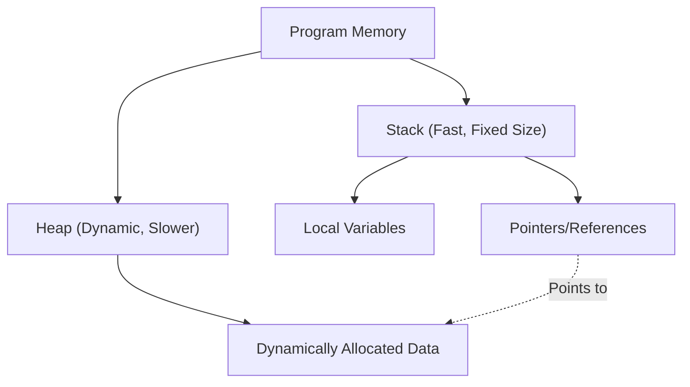

現代のシステムプログラミングにおいて、パフォーマンスとメモリ安全性の両立は永遠の課題です。C++は長年この分野の王者として君臨してきましたが、近年その地位を脅かしつつあるのがRustです。Rustの最大の特徴は、ガベージコレクション（GC）を持たずにメモリ安全性をコンパイル時に保証する「所有権（Ownership）」と「借用（Borrowing）」という概念にあります。

本記事では、C++のポインタ（生ポインタ、`std::unique_ptr`、`std::shared_ptr`）とRustの所有権モデルを詳細に比較し、Rustのコンパイラ（ボローチェッカー）がどのようにしてUse-After-Free（解放後使用）やデータ競合（Data Race）を防いでいるのかを、コード例や図式を交えて徹底的に解説します。

## 1. メモリ管理の基礎：スタックとヒープ

メモリ管理の基本を理解するために、まずはプログラムがメモリをどのように利用するかを振り返りましょう。メモリ領域は大きく分けて「スタック（Stack）」と「ヒープ（Heap）」に分類されます。

### スタック（Stack）
関数呼び出し時のローカル変数などが積まれる領域です。LIFO（後入れ先出し）の構造を持ち、メモリの確保・解放が非常に高速です。コンパイル時にサイズが決定できるデータのみが配置されます。

### ヒープ（Heap）
実行時に動的にサイズが決まるデータや、関数のスコープを超えて生存する必要があるデータが配置されます。ポインタ（または参照）を通じてアクセスされます。

ガベージコレクションを持たないC++やRustでは、ヒープメモリの管理コストを数式として以下のようにモデル化できます。オブジェクトの総数を $N$、アロケーションにかかる平均時間を $T_{alloc}$、デアロケーションにかかる平均時間を $T_{dealloc}$ とすると、メモリ管理の総コスト $C_{memory}$ は：

$$ C_{memory} = \sum_{i=1}^{N} (T_{alloc, i} + T_{dealloc, i}) + O_{sync} $$

ここで $O_{sync}$ はマルチスレッド環境下での排他制御（ミューテックスやアトミック操作）にかかるオーバーヘッドです。Rustはコンパイル時にメモリ解放のタイミングを決定するため、実行時のガベージコレクションによるスループット低下（Stop-The-World）をゼロにしつつ、$T_{dealloc}$ を確実かつ安全なタイミングで実行します。



## 2. C++のポインタ：自由と危険のトレードオフ

C++におけるメモリ管理の変遷を見てみましょう。

### 生ポインタ（Raw Pointers）の時代と問題点

C言語から引き継がれた生ポインタ（`*`）は、究極の自由を提供しますが、同時に以下のような深刻なバグの温床となります。

- **メモリリーク（Memory Leak）**: `new`したメモリを`delete`し忘れる。
- **Dangling Pointer（ダングリングポインタ）**: メモリ解放後（`delete`後）のポインタにアクセスする。
- **Double Free（二重解放）**: 同じメモリ領域を2回`delete`してしまう。

```cpp
// C++: 生ポインタによる問題の例
void rawPointerExample() {
    int* ptr = new int(10);
    // ... 何らかの処理 ...
    delete ptr; 
    
    // 誤って再度アクセス (Use-After-Free / Dangling Pointer)
    // C++コンパイラはこれをコンパイルエラーにできない
    std::cout << *ptr << std::endl; // 未定義動作（Undefined Behavior）
}
```

### RAIIとスマートポインタの登場 (C++11以降)

C++11以降、RAII (Resource Acquisition Is Initialization) の概念に基づくスマートポインタが標準化され、生ポインタの直接利用は非推奨となりました。

#### `std::unique_ptr`
所有権が単一であることを表現するポインタです。スコープを抜けると自動的にメモリが解放されます。コピーはできず、所有権の「移動（ムーブ）」のみが可能です（`std::move`を使用）。

```cpp
// C++: std::unique_ptr
#include <memory>
#include <iostream>

void uniquePtrExample() {
    std::unique_ptr<int> p1 = std::make_unique<int>(42);
    // std::unique_ptr<int> p2 = p1; // コンパイルエラー（コピー不可）
    std::unique_ptr<int> p3 = std::move(p1); // 所有権の移動
    
    // C++の弱点：ムーブ後のp1はnullptrになるが、アクセス自体はコンパイル可能
    // 実行時にクラッシュ（セグメンテーションフォールト）を引き起こす
    // std::cout << *p1 << std::endl; 
}
```

#### `std::shared_ptr`
複数のポインタが同じオブジェクトを共有できるポインタです。参照カウント（Reference Counting）を用いて、カウントが0になった時点でメモリを解放します。アトミックな増減操作が必要なため、若干のパフォーマンスオーバーヘッド（前述の $O_{sync}$ に相当）が生じます。

## 3. Rustの所有権（Ownership）：パラダイムシフト

Rustは、C++の`std::unique_ptr`の概念を言語仕様の根幹に据え、さらに厳密にした「所有権モデル」を持っています。

### 所有権の3つのルール

Rustの所有権システムは、以下の3つの極めてシンプルなルールに基づいています。

1. **Rustの個々の値は、所有者（owner）と呼ばれる変数を持つ。**
2. **いかなる時も所有者は一つである。**
3. **所有者がスコープから外れたら、値は破棄される。**

Rustではデフォルトでリソースは「ムーブ」されます。C++のように`std::move`を明示しなくても、代入操作によって所有権が移動します。

```rust
// Rust: 所有権の移動（ムーブ）
fn main() {
    let s1 = String::from("hello"); // ヒープに確保されるデータ
    let s2 = s1; // 所有権がs1からs2に移動（ムーブ）する

    // C++と異なる最大の点：ムーブ後の変数へのアクセスは「コンパイルエラー」になる！
    // println!("{}, world!", s1); // コンパイルエラー: value borrowed here after move
}
```

この「ムーブ後の変数をコンパイル時にアクセス不可にする」機能こそが、RustがC++の`std::unique_ptr`よりも安全である理由の一つです。

```mermaid
sequenceDiagram
    participant S1 as "Variable s1"
    participant Heap as "Heap Memory ('hello')"
    participant S2 as "Variable s2"
    
    S1->>Heap: "Allocates & Owns"
    Note over S1,S2: "let s2 = s1;"
    S1--xHeap: "Loses Ownership (Invalidated)"
    S2->>Heap: "Takes Ownership"
```

## 4. 借用（Borrowing）と参照

所有権を常に移動させていると、関数に値を渡すたびに所有権を返しもらわなければならず、非常に不便です。そこで登場するのが「借用（Borrowing）」です。C++のポインタや参照に相当します。

Rustにおける借用には2つの種類があります。
- **不変参照（Immutable Reference）**: `&T` （C++の `const T&` に近い）
- **可変参照（Mutable Reference）**: `&mut T` （C++の `T&` に近い）

### ボローチェッカー（Borrow Checker）の冷酷なる掟

Rustのコンパイラには、参照の正当性を検証する「ボローチェッカー」が内蔵されています。ボローチェッカーは以下の厳格なルールを強制します。

> 任意のスコープにおいて、以下のいずれか一方のみが存在可能である。
> - **1つの可変参照（`&mut T`）**
> - **複数の不変参照（`&T`）**

これは **「Multiple Readers XOR Single Writer (MRSW)」** と呼ばれる原則です。数学の排他的論理和（XOR）で表現でき、状態 $S$ に対して、不変参照の数 $N_r$ と可変参照の数 $N_w$ は以下の制約を満たさなければなりません。

$$ (N_r \ge 0 \land N_w = 0) \oplus (N_r = 0 \land N_w = 1) $$

このルールにより、**データ競合（Data Race）をコンパイル時に完全に排除**します。データ競合は、①2つ以上のポインタが同じデータに同時アクセスし、②少なくとも1つが書き込みを行い、③同期メカニズムがない場合に発生します。Rustは②の条件をコンパイル時に破壊することでデータ競合を未然に防ぎます。

```rust
// Rust: 借用のルール違反によるコンパイルエラー
fn main() {
    let mut s = String::from("hello");

    let r1 = &s; // 不変借用 (OK)
    let r2 = &s; // 不変借用 (OK)
    // let r3 = &mut s; // エラー！不変借用が存在するのに可変借用は作れない

    println!("{}, {}", r1, r2);
}
```

## 5. イテレータ無効化（Iterator Invalidation）の防止

ボローチェッカーの威力が最も発揮される具体的な例として、「イテレータ無効化」という古典的なバグを見てみましょう。

### C++におけるイテレータ無効化（実行時クラッシュ）

C++の`std::vector`をループ中に変更すると、背後のメモリが再確保（Reallocation）される可能性があり、参照がダングリングポインタと化します。

```cpp
// C++: イテレータ無効化のバグ
#include <iostream>
#include <vector>

int main() {
    std::vector<int> v = {1, 2, 3};
    
    // ベクタの要素への参照を取得
    int& first = v[0]; 
    
    // 要素を追加（ここで容量が不足すると新しいメモリ領域が確保され、
    // 古い領域は破棄される可能性がある）
    v.push_back(4); 
    
    // firstはすでに解放されたメモリを指している可能性がある！（未定義動作）
    std::cout << "The first element is: " << first << std::endl; 
    
    return 0;
}
```

### Rustによるコンパイル時防御

全く同じロジックをRustで記述してみましょう。

```rust
// Rust: イテレータ無効化をコンパイル時に防ぐ
fn main() {
    let mut v = vec![1, 2, 3];

    // 不変参照を取得 (借用開始)
    let first = &v[0]; 

    // エラー！ `first`が`v`を不変借用している間は、
    // `v.push`に必要な可変借用を行うことはできない。
    // v.push(4); 

    println!("The first element is: {}", first);
}
```

このように、Rustでは「値を読み取っている最中（不変借用中）に、その値を変更する（可変借用する）こと」がコンパイラレベルで禁止されているため、Use-After-Freeやイテレータ無効化といった致命的なバグがコンパイル時に確実に捕捉されます。

```mermaid
graph LR
    A["Variable v (Owner)"] --> B["Heap Array [1, 2, 3]"]
    C["Reference 'first' (&v[0])"] -.->|"Immutable Borrow"| B
    A -->|X "Mutable Borrow Denied!"| D["v.push(4)"]
    
    style C stroke:#00FF00,stroke-width:2px
    style D stroke:#FF0000,stroke-width:2px
```

## 6. Rustにおける共有所有権：`Rc` と `Arc`

C++の`std::shared_ptr`に相当する共有所有権もRustには用意されていますが、シングルスレッド用とマルチスレッド用に明確に型が分かれています。

### シングルスレッド用：`Rc<T>` (Reference Counted)
`Rc<T>`は、非スレッドセーフな参照カウントスマートポインタです。アトミックな命令を使わずにカウントを増減させるため、単一スレッド内では非常に高速です。しかし、これを別スレッドに送ろうとすると、コンパイルエラーになります（`Send`トレイトを実装していないため）。

### マルチスレッド用：`Arc<T>` (Atomic Reference Counted)
スレッド間で共有する場合は、アトミックな増減を行う`Arc<T>`を使用します。C++の`std::shared_ptr`と同等のコストがかかります。

さらに、C++では`std::shared_ptr`で共有している変数に対して、複数のスレッドから同時に書き込みを行うとデータ競合が発生します。これを防ぐためには`std::mutex`を手動で正しく使う必要があります。

一方Rustでは、`Arc<T>`単体では**内部のデータを変更することができません**。変更が必要な場合は、ミューテックスである`Mutex<T>`と組み合わせる必要があります。

```rust
use std::sync::{Arc, Mutex};
use std::thread;

fn main() {
    // スレッドセーフな共有と排他制御の組み合わせ
    // C++の std::shared_ptr<std::mutex> に近いが、Mutexがデータを内包している
    let counter = Arc::new(Mutex::new(0));
    let mut handles = vec![];

    for _ in 0..10 {
        let counter_clone = Arc::clone(&counter);
        let handle = thread::spawn(move || {
            // lock()を呼び出して初めて内部の可変参照(&mut i32)を得られる
            let mut num = counter_clone.lock().unwrap();
            *num += 1;
        }); // ロックの解放はRAIIによりスコープを抜けると自動で行われる
        handles.push(handle);
    }

    for handle in handles {
        handle.join().unwrap();
    }

    println!("Result: {}", *counter.lock().unwrap());
}
```

特筆すべきは、Rustの`Mutex<T>`は単なるロック機構ではなく、**「守るべきデータを型として内包している」**点です。これにより、「ロックを取り忘れてデータにアクセスする」というミスをコンパイルレベルで完全に防ぐことができます。ロック（`lock()`）を取得しない限り、中身のデータへのアクセス権（参照）を得られない仕組みになっているのです。

## まとめ：コンパイラによる「事前検査」か、開発者による「自己責任」か

C++のポインタやスマートポインタは、開発者に高度な制御とパフォーマンスを提供しますが、その正しい利用は開発者の規律に依存しています。RAIIや`std::unique_ptr`の導入によりC++は劇的に安全になりましたが、それでもムーブ後のアクセスやイテレータ無効化といった「未定義動作」を言語レベルで完全に防ぐことはできません。

一方Rustは、所有権（Ownership）と借用（Borrowing）というルールをコンパイラに組み込むことで、これらのエラーを実行時ではなく**コンパイル時**に検出します。「コンパイルが通るなら、メモリ安全である」という強い保証こそが、Rustがシステムプログラミングにおいて急速に支持を集めている最大の理由です。

Rustのボローチェッカーと戦う（Fight the borrow checker）ことは、初学者にとって大きな壁となりますが、それは本来C++プログラマが頭の中で行っていた「ポインタの生存期間の追跡」という複雑な計算を、コンパイラが厳密に代行してくれているに過ぎません。

C++のポインタの自由さと危険性を理解した上でRustを学ぶと、所有権モデルの背後にある「なぜこの設計になったのか」という哲学がより深く理解できるはずです。

---
*本記事は、C++とRustのメモリ管理手法についての比較考察です。各プロジェクトの要件に応じて適切な言語を選択するための参考になれば幸いです。*
