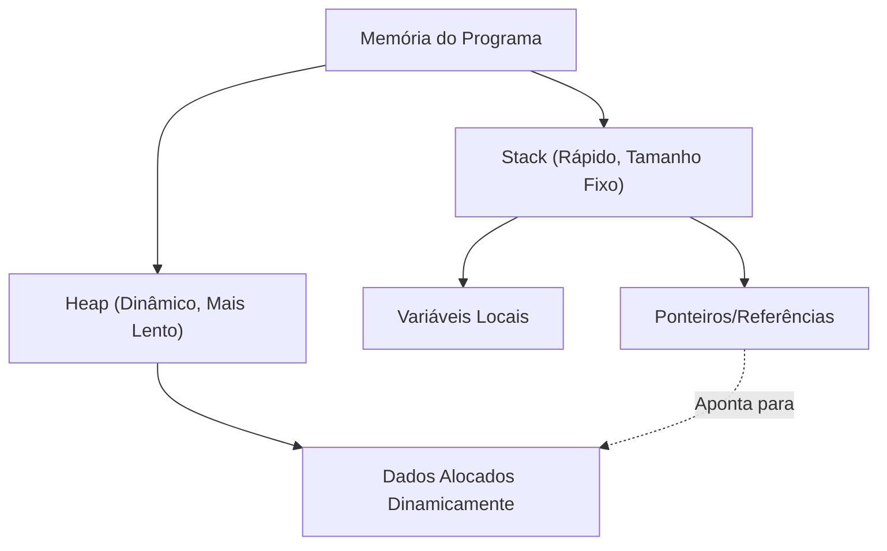

Na programação de sistemas moderna, conciliar desempenho e segurança de memória é um desafio eterno. O C++ reina como líder absoluto nessa área há muitos anos, mas o Rust vem ameaçando essa posição ultimamente. A principal característica do Rust reside nos conceitos de "Propriedade" (Ownership) e "Empréstimo" (Borrowing), que garantem a segurança da memória em tempo de compilação sem a necessidade de um coletor de lixo (Garbage Collection).

Neste artigo, vamos comparar detalhadamente os ponteiros do C++ (ponteiros brutos, `std::unique_ptr`, `std::shared_ptr`) e o modelo de propriedade do Rust, e explicaremos minuciosamente, com exemplos de código e diagramas, como o compilador do Rust (borrow checker) previne o Use-After-Free (uso após liberação) e as corridas de dados (Data Race).

## 1. Fundamentos da Gestão de Memória: Stack e Heap

Para entender os fundamentos da gestão de memória, primeiro vamos revisar como os programas utilizam a memória. As regiões de memória são divididas principalmente em "Stack" (Pilha) e "Heap" (Monte).

### Stack (Pilha)
É a área onde as variáveis locais das chamadas de função são empilhadas. Possui uma estrutura LIFO (Último a Entrar, Primeiro a Sair) e a alocação e liberação de memória é extremamente rápida. Apenas dados cujo tamanho pode ser determinado em tempo de compilação são colocados aqui.

### Heap (Monte)
É onde são colocados dados cujo tamanho é determinado dinamicamente em tempo de execução ou dados que precisam sobreviver além do escopo de uma função. O acesso é feito através de ponteiros (ou referências).

No C++ e Rust, que não possuem coletor de lixo, o custo de gestão da memória heap pode ser modelado matematicamente da seguinte forma. Considerando o número total de objetos como $N$, o tempo médio de alocação como $T_{alloc}$, e o tempo médio de desalocação como $T_{dealloc}$, o custo total de gestão de memória $C_{memory}$ é:

$$ C_{memory} = \sum_{i=1}^{N} (T_{alloc, i} + T_{dealloc, i}) + O_{sync} $$

Onde $O_{sync}$ é a sobrecarga de controle de exclusão mútua (mutexes ou operações atômicas) em um ambiente multithread. Como o Rust determina o momento da liberação de memória em tempo de compilação, ele executa o $T_{dealloc}$ em um momento seguro e definitivo, reduzindo a zero a queda de rendimento (Stop-The-World) causada pelo coletor de lixo em tempo de execução.



## 2. Ponteiros do C++: O Paradoxo da Liberdade e do Perigo

Vamos dar uma olhada na evolução da gestão de memória no C++.

### A Era dos Ponteiros Brutos (Raw Pointers) e Seus Problemas

Os ponteiros brutos (`*`) herdados da linguagem C oferecem liberdade máxima, mas, ao mesmo tempo, são a fonte de bugs graves, como os seguintes:

- **Vazamento de Memória (Memory Leak)**: Esquecer de usar `delete` na memória alocada com `new`.
- **Ponteiro Solto (Dangling Pointer)**: Acessar um ponteiro depois que a memória foi liberada (após o `delete`).
- **Liberação Dupla (Double Free)**: Usar `delete` duas vezes na mesma região de memória.

```cpp
// C++: Exemplo de problemas com ponteiros brutos
void rawPointerExample() {
    int* ptr = new int(10);
    // ... algum processamento ...
    delete ptr; 
    
    // Acesso acidental novamente (Use-After-Free / Dangling Pointer)
    // O compilador C++ não consegue transformar isso em um erro de compilação
    std::cout << *ptr << std::endl; // Comportamento Indefinido (Undefined Behavior)
}
```

### Surgimento do RAII e dos Ponteiros Inteligentes (C++11 em diante)

A partir do C++11, os ponteiros inteligentes baseados no conceito de RAII (Resource Acquisition Is Initialization) foram padronizados, e o uso direto de ponteiros brutos passou a ser desencorajado.

#### `std::unique_ptr`
É um ponteiro que expressa propriedade exclusiva. A memória é liberada automaticamente ao sair do escopo. Não pode ser copiado, permitindo apenas a "movimentação" (move) da propriedade (usando `std::move`).

```cpp
// C++: std::unique_ptr
#include <memory>
#include <iostream>

void uniquePtrExample() {
    std::unique_ptr<int> p1 = std::make_unique<int>(42);
    // std::unique_ptr<int> p2 = p1; // Erro de compilação (cópia não permitida)
    std::unique_ptr<int> p3 = std::move(p1); // Movimentação da propriedade
    
    // O ponto fraco do C++: Após o move, p1 se torna nullptr, mas o acesso em si pode ser compilado
    // Causa travamento (segmentation fault) em tempo de execução
    // std::cout << *p1 << std::endl; 
}
```

#### `std::shared_ptr`
É um ponteiro que permite que vários ponteiros compartilhem o mesmo objeto. Ele usa Contagem de Referência (Reference Counting) e libera a memória no momento em que a contagem chega a 0. Devido à necessidade de operações atômicas de incremento e decremento, ocorre uma leve sobrecarga de desempenho (equivalente ao $O_{sync}$ mencionado anteriormente).

## 3. A Propriedade (Ownership) do Rust: Uma Mudança de Paradigma

O Rust adotou o conceito do `std::unique_ptr` do C++ no núcleo das especificações da linguagem e criou um "modelo de propriedade" ainda mais rigoroso.

### As 3 Regras da Propriedade

O sistema de propriedade do Rust baseia-se em três regras extremamente simples:

1. **Cada valor no Rust tem uma variável que é chamada de seu proprietário (owner).**
2. **Só pode haver um proprietário de cada vez.**
3. **Quando o proprietário sai de escopo, o valor é descartado.**

No Rust, os recursos são "movidos" por padrão. A propriedade é transferida por operações de atribuição sem a necessidade de especificar explicitamente como o `std::move` do C++.

```rust
// Rust: Movimentação (Move) da Propriedade
fn main() {
    let s1 = String::from("hello"); // Dados alocados no Heap
    let s2 = s1; // A propriedade é movida de s1 para s2

    // A maior diferença em relação ao C++: O acesso à variável após o move se torna um "erro de compilação"!
    // println!("{}, world!", s1); // Erro de compilação: value borrowed here after move
}
```

Essa funcionalidade de "tornar variáveis inacessíveis em tempo de compilação após o move" é um dos motivos pelos quais o Rust é mais seguro que o `std::unique_ptr` do C++.

```mermaid
sequenceDiagram
    participant S1 as "Variável s1"
    participant Heap as "Memória Heap ('hello')"
    participant S2 as "Variável s2"
    
    S1->>Heap: "Aloca & Possui"
    Note over S1,S2: "let s2 = s1;"
    S1--xHeap: "Perde Propriedade (Invalidado)"
    S2->>Heap: "Assume Propriedade"
```

## 4. Empréstimo (Borrowing) e Referências

Se a propriedade estiver sempre sendo movida, seria extremamente inconveniente ter que retornar a propriedade a cada vez que passamos um valor para uma função. É aí que entra o "Empréstimo" (Borrowing). Ele equivale aos ponteiros e referências do C++.

Existem dois tipos de empréstimos no Rust:
- **Referência Imutável (Immutable Reference)**: `&T` (Semelhante ao `const T&` do C++)
- **Referência Mutável (Mutable Reference)**: `&mut T` (Semelhante ao `T&` do C++)

### As Regras Implacáveis do Borrow Checker

O compilador do Rust possui um "Borrow Checker" integrado que verifica a validade das referências. O borrow checker impõe a seguinte regra rigorosa:

> Em qualquer escopo, apenas um dos seguintes pode existir:
> - **Uma referência mutável (`&mut T`)**
> - **Múltiplas referências imutáveis (`&T`)**

Este é o princípio conhecido como **"Múltiplos Leitores OU Um Único Escritor (MRSW)"**. Isso pode ser expresso através da operação matemática de Ou Exclusivo (XOR), onde, para um estado $S$, o número de referências imutáveis $N_r$ e referências mutáveis $N_w$ devem satisfazer a seguinte restrição:

$$ (N_r \ge 0 \land N_w = 0) \oplus (N_r = 0 \land N_w = 1) $$

Através dessa regra, **as corridas de dados (Data Race) são completamente eliminadas em tempo de compilação**. Uma corrida de dados ocorre quando: ① dois ou mais ponteiros acessam os mesmos dados simultaneamente, ② pelo menos um deles realiza uma escrita, e ③ não há nenhum mecanismo de sincronização. O Rust previne preventivamente as corridas de dados destruindo a condição ② em tempo de compilação.

```rust
// Rust: Erro de compilação devido a violação da regra de empréstimo
fn main() {
    let mut s = String::from("hello");

    let r1 = &s; // Empréstimo imutável (OK)
    let r2 = &s; // Empréstimo imutável (OK)
    // let r3 = &mut s; // Erro! Não é possível criar um empréstimo mutável enquanto existirem empréstimos imutáveis

    println!("{}, {}", r1, r2);
}
```

## 5. Prevenção da Invalidação de Iteradores (Iterator Invalidation)

Como um exemplo prático onde o poder do borrow checker é mais evidente, vamos examinar o clássico bug de "invalidação de iterador".

### Invalidação de Iterador no C++ (Travamento em Tempo de Execução)

Modificar um `std::vector` no C++ durante um loop pode causar a realocação de memória subjacente (Reallocation), transformando referências em ponteiros soltos (dangling pointers).

```cpp
// C++: Bug de invalidação de iterador
#include <iostream>
#include <vector>

int main() {
    std::vector<int> v = {1, 2, 3};
    
    // Obtém uma referência ao elemento do vetor
    int& first = v[0]; 
    
    // Adiciona um elemento (Se a capacidade for insuficiente aqui,
    // uma nova área de memória será alocada e a antiga poderá ser descartada)
    v.push_back(4); 
    
    // O first já pode estar apontando para uma memória liberada! (Comportamento indefinido)
    std::cout << "The first element is: " << first << std::endl; 
    
    return 0;
}
```

### Defesa em Tempo de Compilação no Rust

Vamos escrever a exata mesma lógica em Rust.

```rust
// Rust: Prevenindo a invalidação de iteradores em tempo de compilação
fn main() {
    let mut v = vec![1, 2, 3];

    // Obtém uma referência imutável (Início do empréstimo)
    let first = &v[0]; 

    // Erro! Enquanto `first` possuir um empréstimo imutável de `v`,
    // o empréstimo mutável exigido pelo `v.push` não pode ser feito.
    // v.push(4); 

    println!("The first element is: {}", first);
}
```

Dessa forma, como o Rust proíbe a nível de compilação "modificar um valor (empréstimo mutável) enquanto ele está sendo lido (empréstimo imutável)", bugs fatais como o Use-After-Free e a invalidação de iteradores são garantidamente interceptados durante a compilação.

```mermaid
graph LR
    A["Variável v (Proprietário)"] --> B["Array Heap [1, 2, 3]"]
    C["Referência 'first' (&v[0])"] -.->|"Empréstimo Imutável"| B
    A -->|X "Empréstimo Mutável Negado!"| D["v.push(4)"]
    
    style C stroke:#00FF00,stroke-width:2px
    style D stroke:#FF0000,stroke-width:2px
```

## 6. Propriedade Compartilhada no Rust: `Rc` e `Arc`

Embora o Rust possua propriedade compartilhada, equivalente ao `std::shared_ptr` do C++, há uma distinção clara de tipos para uso em thread única (single-thread) e em múltiplas threads (multi-thread).

### Para Thread Única: `Rc<T>` (Reference Counted)
`Rc<T>` é um ponteiro inteligente de contagem de referência que não é thread-safe. Como ele incrementa e decrementa a contagem sem usar instruções atômicas, é extremamente rápido dentro de uma única thread. No entanto, tentar enviá-lo para outra thread resultará num erro de compilação (porque não implementa o trait `Send`).

### Para Múltiplas Threads: `Arc<T>` (Atomic Reference Counted)
Para o compartilhamento entre threads, é usado o `Arc<T>`, que realiza incrementos e decrementos atômicos. Ele tem um custo equivalente ao do `std::shared_ptr` do C++.

Além disso, no C++, a escrita simultânea de várias threads numa variável compartilhada via `std::shared_ptr` causará uma corrida de dados. Para evitar isso, deve-se usar `std::mutex` corretamente de forma manual.

Por outro lado, no Rust, o **`Arc<T>` por si só não permite que os dados internos sejam modificados**. Quando modificações são necessárias, é preciso combiná-lo com um `Mutex<T>`, que é o mecanismo de exclusão mútua.

```rust
use std::sync::{Arc, Mutex};
use std::thread;

fn main() {
    // A combinação de compartilhamento thread-safe e controle de exclusão mútua
    // Semelhante a std::shared_ptr<std::mutex> do C++, mas o Mutex envolve os dados
    let counter = Arc::new(Mutex::new(0));
    let mut handles = vec![];

    for _ in 0..10 {
        let counter_clone = Arc::clone(&counter);
        let handle = thread::spawn(move || {
            // A referência mutável interna (&mut i32) só pode ser obtida chamando lock()
            let mut num = counter_clone.lock().unwrap();
            *num += 1;
        }); // A liberação do lock é feita automaticamente pelo RAII ao sair do escopo
        handles.push(handle);
    }

    for handle in handles {
        handle.join().unwrap();
    }

    println!("Result: {}", *counter.lock().unwrap());
}
```

O mais notável é que o `Mutex<T>` do Rust não é um mero mecanismo de bloqueio; ele **"envolve os dados que precisam ser protegidos em forma de tipo"**. Graças a isso, é possível evitar completamente, em nível de compilação, o erro de "esquecer de pegar o lock e acessar os dados". O sistema é projetado de forma que direitos de acesso (referência) aos dados internos não possam ser obtidos a menos que o lock (`lock()`) seja adquirido.

## Conclusão: "Verificação Prévia" do Compilador ou "Responsabilidade Própria" do Desenvolvedor

Embora os ponteiros do C++ e os ponteiros inteligentes forneçam ao desenvolvedor alto desempenho e controle avançado, o uso correto depende da disciplina do desenvolvedor. A introdução do RAII e do `std::unique_ptr` tornou o C++ drasticamente mais seguro, mas isso não evita completamente que "comportamentos indefinidos", como acesso após a movimentação (move) ou a invalidação de iteradores, ocorram a nível de linguagem.

Por outro lado, o Rust, ao embutir as regras de Propriedade (Ownership) e Empréstimo (Borrowing) no compilador, detecta esses erros **em tempo de compilação** em vez de tempo de execução. A forte garantia de que "se compilar, é seguro na memória" é a principal razão pela qual o Rust vem ganhando cada vez mais suporte na programação de sistemas.

Lutar contra o borrow checker do Rust (Fight the borrow checker) pode ser uma barreira considerável para os iniciantes, mas é simplesmente o compilador que rigorosamente executa os complicados cálculos de "rastreamento da vida útil do ponteiro", algo que os programadores C++ originalmente faziam em suas cabeças.

Ao aprender Rust tendo uma compreensão da liberdade e do perigo dos ponteiros do C++, você será capaz de entender mais profundamente a filosofia de "por que foi projetado desta maneira", que está por trás do modelo de propriedade.

---
*Este artigo é uma análise comparativa de abordagens de gestão de memória entre o C++ e o Rust. Esperamos que seja útil como uma referência ao escolher a linguagem apropriada para os requisitos do seu projeto.*
