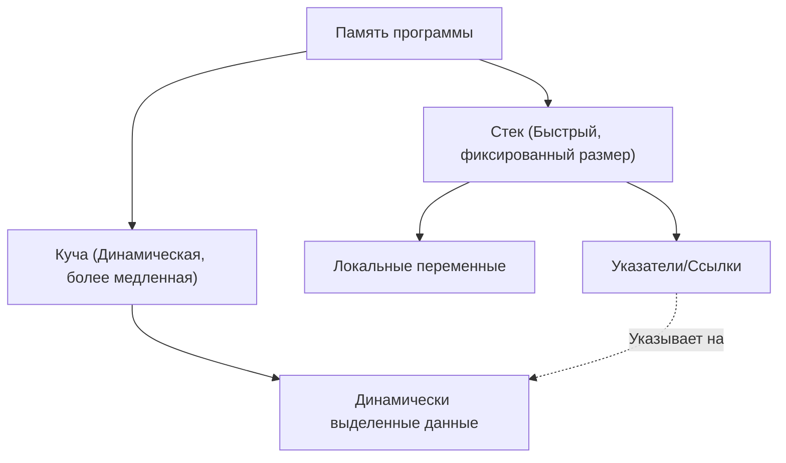

В современном системном программировании баланс между производительностью и безопасностью памяти является вечной проблемой. C++ долгие годы господствовал в этой области как король, но в последние годы Rust начинает угрожать его позициям. Главная особенность Rust заключается в концепциях «владения» (Ownership) и «заимствования» (Borrowing), которые гарантируют безопасность памяти во время компиляции без использования сборщика мусора (GC).

В этой статье мы подробно сравним указатели C++ (сырые указатели, `std::unique_ptr`, `std::shared_ptr`) с моделью владения Rust, и с помощью примеров кода и диаграмм детально разберем, как компилятор Rust (borrow checker) предотвращает такие ошибки, как использование после освобождения (Use-After-Free) и состояние гонки данных (Data Race).

## 1. Основы управления памятью: Стек и Куча

Чтобы понять основы управления памятью, давайте сначала вспомним, как программа использует память. Области памяти в основном делятся на «стек» (Stack) и «кучу» (Heap).

### Стек (Stack)
Область, куда помещаются локальные переменные при вызовах функций. Она имеет структуру LIFO (последним пришел — первым ушел), и выделение/освобождение памяти происходит очень быстро. Здесь размещаются только те данные, размер которых можно определить во время компиляции.

### Куча (Heap)
Здесь размещаются данные, размер которых определяется динамически во время выполнения, а также данные, которые должны существовать за пределами области видимости функции. Доступ к ним осуществляется через указатели (или ссылки).

В языках без сборщика мусора, таких как C++ и Rust, стоимость управления динамической памятью можно смоделировать следующей формулой. Если общее количество объектов равно $N$, среднее время, затрачиваемое на выделение памяти, равно $T_{alloc}$, а среднее время на освобождение — $T_{dealloc}$, то общая стоимость управления памятью $C_{memory}$ составляет:

$$ C_{memory} = \sum_{i=1}^{N} (T_{alloc, i} + T_{dealloc, i}) + O_{sync} $$

Где $O_{sync}$ — это накладные расходы на эксклюзивный контроль (мьютексы или атомарные операции) в многопоточной среде. Поскольку Rust определяет время освобождения памяти на этапе компиляции, он выполняет $T_{dealloc}$ в надежное и безопасное время, сводя к нулю снижение пропускной способности из-за пауз сборщика мусора (Stop-The-World) во время выполнения.



## 2. Указатели C++: Компромисс между свободой и опасностью

Давайте рассмотрим эволюцию управления памятью в C++.

### Эпоха сырых указателей (Raw Pointers) и их проблемы

Сырые указатели (`*`), унаследованные от языка C, предоставляют максимальную свободу, но в то же время становятся рассадником следующих серьезных ошибок:

- **Утечка памяти (Memory Leak)**: Забытый `delete` для памяти, выделенной через `new`.
- **Висячий указатель (Dangling Pointer)**: Обращение к указателю после освобождения памяти (после `delete`).
- **Двойное освобождение (Double Free)**: Повторный вызов `delete` для одной и той же области памяти.

```cpp
// C++: Пример проблем с сырыми указателями
void rawPointerExample() {
    int* ptr = new int(10);
    // ... какая-то обработка ...
    delete ptr; 
    
    // Ошибочный повторный доступ (Use-After-Free / Dangling Pointer)
    // Компилятор C++ не может выдать ошибку компиляции для этого
    std::cout << *ptr << std::endl; // Неопределенное поведение (Undefined Behavior)
}
```

### Появление RAII и умных указателей (начиная с C++11)

Начиная с C++11, умные указатели, основанные на концепции RAII (Resource Acquisition Is Initialization), были стандартизированы, а прямое использование сырых указателей стало нерекомендованным.

#### `std::unique_ptr`
Указатель, выражающий уникальное владение. Память автоматически освобождается при выходе из области видимости. Копирование невозможно, возможно только «перемещение» (move) владения (с использованием `std::move`).

```cpp
// C++: std::unique_ptr
#include <memory>
#include <iostream>

void uniquePtrExample() {
    std::unique_ptr<int> p1 = std::make_unique<int>(42);
    // std::unique_ptr<int> p2 = p1; // Ошибка компиляции (копирование запрещено)
    std::unique_ptr<int> p3 = std::move(p1); // Перемещение владения
    
    // Слабое место C++: после перемещения p1 становится nullptr, но сам доступ компилируется
    // Вызывает сбой во время выполнения (ошибка сегментации)
    // std::cout << *p1 << std::endl; 
}
```

#### `std::shared_ptr`
Указатель, позволяющий нескольким указателям совместно владеть одним и тем же объектом. Он использует подсчет ссылок (Reference Counting) и освобождает память, когда счетчик достигает нуля. Поскольку требуются атомарные операции увеличения/уменьшения, возникают небольшие накладные расходы на производительность (эквивалентные упомянутому ранее $O_{sync}$).

## 3. Владение (Ownership) в Rust: Смена парадигмы

Rust берет концепцию `std::unique_ptr` из C++ за основу спецификации языка и обладает еще более строгой «моделью владения».

### Три правила владения

Система владения в Rust основана на трех предельно простых правилах:

1. **Каждое значение в Rust имеет переменную, которая называется его владельцем (owner).**
2. **В любой момент времени может быть только один владелец.**
3. **Когда владелец выходит за пределы области видимости, значение уничтожается.**

По умолчанию ресурсы в Rust «перемещаются» (move). Даже без явного указания `std::move`, как в C++, владение передается при операции присваивания.

```rust
// Rust: Перемещение владения (move)
fn main() {
    let s1 = String::from("hello"); // Данные, выделяемые в куче
    let s2 = s1; // Владение перемещается от s1 к s2

    // Главное отличие от C++: доступ к переменной после перемещения приводит к «ошибке компиляции»!
    // println!("{}, world!", s1); // Ошибка компиляции: value borrowed here after move
}
```

Именно эта функция, «делающая переменную недоступной на этапе компиляции после перемещения», является одной из причин, почему Rust безопаснее, чем `std::unique_ptr` в C++.

```mermaid
sequenceDiagram
    participant S1 as "Переменная s1"
    participant Heap as "Память в куче ('hello')"
    participant S2 as "Переменная s2"
    
    S1->>Heap: "Выделяет и владеет"
    Note over S1,S2: "let s2 = s1;"
    S1--xHeap: "Теряет владение (Инвалидируется)"
    S2->>Heap: "Принимает владение"
```

## 4. Заимствование (Borrowing) и ссылки

Если постоянно передавать владение, то при каждой передаче значения в функцию придется возвращать владение обратно, что крайне неудобно. Для решения этой проблемы появилось «заимствование» (Borrowing). Оно эквивалентно указателям и ссылкам в C++.

В Rust существует два типа заимствования:
- **Неизменяемая ссылка (Immutable Reference)**: `&T` (похоже на `const T&` в C++)
- **Изменяемая ссылка (Mutable Reference)**: `&mut T` (похоже на `T&` в C++)

### Безжалостные правила Borrow Checker'а

В компилятор Rust встроен «borrow checker» (проверщик заимствований), который проверяет корректность ссылок. Borrow checker принудительно применяет следующие строгие правила:

> В любой области видимости может существовать только одно из следующих условий:
> - **Одна изменяемая ссылка (`&mut T`)**
> - **Несколько неизменяемых ссылок (`&T`)**

Это принцип, известный как **«Множество читателей ИЛИ Один писатель» (Multiple Readers XOR Single Writer, MRSW)**. Его можно выразить с помощью математического исключающего ИЛИ (XOR). Для состояния $S$, количество неизменяемых ссылок $N_r$ и изменяемых ссылок $N_w$ должно удовлетворять следующему ограничению:

$$ (N_r \ge 0 \land N_w = 0) \oplus (N_r = 0 \land N_w = 1) $$

Благодаря этому правилу, **состояние гонки данных (Data Race) полностью исключается на этапе компиляции**. Состояние гонки данных возникает, когда: ① два или более указателя одновременно обращаются к одним и тем же данным, ② по крайней мере один из них выполняет запись, и ③ отсутствует механизм синхронизации. Rust предотвращает состояние гонки данных, разрушая условие ② на этапе компиляции.

```rust
// Rust: Ошибка компиляции из-за нарушения правил заимствования
fn main() {
    let mut s = String::from("hello");

    let r1 = &s; // Неизменяемое заимствование (OK)
    let r2 = &s; // Неизменяемое заимствование (OK)
    // let r3 = &mut s; // Ошибка! Нельзя создать изменяемое заимствование, пока существуют неизменяемые

    println!("{}, {}", r1, r2);
}
```

## 5. Предотвращение инвалидации итераторов (Iterator Invalidation)

В качестве конкретного примера, демонстрирующего мощь borrow checker'а, давайте рассмотрим классический баг, известный как «инвалидация итератора».

### Инвалидация итераторов в C++ (сбой во время выполнения)

Если изменить `std::vector` в C++ внутри цикла, фоновая память может быть перераспределена (Reallocation), в результате чего ссылки превратятся в висячие указатели.

```cpp
// C++: Баг инвалидации итератора
#include <iostream>
#include <vector>

int main() {
    std::vector<int> v = {1, 2, 3};
    
    // Получение ссылки на элемент вектора
    int& first = v[0]; 
    
    // Добавление элемента (если емкости недостаточно, выделяется новая область памяти, 
    // а старая может быть уничтожена)
    v.push_back(4); 
    
    // first уже может указывать на освобожденную память! (Неопределенное поведение)
    std::cout << "The first element is: " << first << std::endl; 
    
    return 0;
}
```

### Защита на этапе компиляции в Rust

Давайте напишем точно такую же логику на Rust.

```rust
// Rust: Предотвращение инвалидации итератора на этапе компиляции
fn main() {
    let mut v = vec![1, 2, 3];

    // Получение неизменяемой ссылки (начало заимствования)
    let first = &v[0]; 

    // Ошибка! Пока `first` имеет неизменяемое заимствование `v`,
    // невозможно сделать изменяемое заимствование, необходимое для `v.push`.
    // v.push(4); 

    println!("The first element is: {}", first);
}
```

Таким образом, в Rust на уровне компилятора запрещено «изменять значение (делать изменяемое заимствование) во время его чтения (неизменяемого заимствования)». Благодаря этому фатальные баги, такие как Use-After-Free или инвалидация итератора, гарантированно перехватываются на этапе компиляции.

```mermaid
graph LR
    A["Переменная v (Владелец)"] --> B["Массив в куче [1, 2, 3]"]
    C["Ссылка 'first' (&v[0])"] -.->|"Неизменяемое заимствование"| B
    A -->|X "Изменяемое заимствование запрещено!"| D["v.push(4)"]
    
    style C stroke:#00FF00,stroke-width:2px
    style D stroke:#FF0000,stroke-width:2px
```

## 6. Совместное владение в Rust: `Rc` и `Arc`

В Rust также предусмотрено совместное владение, эквивалентное `std::shared_ptr` в C++, но оно четко разделено на типы для однопоточного и многопоточного использования.

### Для одного потока: `Rc<T>` (Reference Counted)
`Rc<T>` — это потоконебезопасный умный указатель с подсчетом ссылок. Поскольку он увеличивает и уменьшает счетчик без использования атомарных инструкций, он очень быстр в рамках одного потока. Однако попытка передать его в другой поток приведет к ошибке компиляции (поскольку он не реализует типаж `Send`).

### Для нескольких потоков: `Arc<T>` (Atomic Reference Counted)
Для совместного использования между потоками применяется `Arc<T>`, который выполняет атомарные операции. Его накладные расходы сопоставимы с `std::shared_ptr` из C++.

Кроме того, в C++ при одновременной записи из нескольких потоков в переменную, разделяемую с помощью `std::shared_ptr`, возникает состояние гонки данных. Чтобы предотвратить это, необходимо правильно вручную использовать `std::mutex`.

С другой стороны, в Rust **невозможно изменить внутренние данные** с помощью одного лишь `Arc<T>`. Если необходимо внести изменения, его нужно комбинировать с мьютексом `Mutex<T>`.

```rust
use std::sync::{Arc, Mutex};
use std::thread;

fn main() {
    // Комбинация потокобезопасного совместного доступа и эксклюзивного контроля
    // Похоже на std::shared_ptr<std::mutex> в C++, но Mutex инкапсулирует данные
    let counter = Arc::new(Mutex::new(0));
    let mut handles = vec![];

    for _ in 0..10 {
        let counter_clone = Arc::clone(&counter);
        let handle = thread::spawn(move || {
            // Только после вызова lock() мы получаем изменяемую ссылку (&mut i32) на внутренние данные
            let mut num = counter_clone.lock().unwrap();
            *num += 1;
        }); // Освобождение блокировки происходит автоматически при выходе из области видимости благодаря RAII
        handles.push(handle);
    }

    for handle in handles {
        handle.join().unwrap();
    }

    println!("Result: {}", *counter.lock().unwrap());
}
```

Особо стоит отметить, что `Mutex<T>` в Rust — это не просто механизм блокировки, он **«инкапсулирует защищаемые данные как тип»**. Это позволяет на уровне компиляции полностью предотвратить такую ошибку, как «доступ к данным без предварительной блокировки». Без получения блокировки (`lock()`) просто невозможно получить права доступа (ссылку) к внутренним данным.

## Заключение: «Предварительная проверка» компилятором или «Личная ответственность» разработчика

Указатели и умные указатели в C++ предоставляют разработчикам высокий уровень контроля и производительности, но их правильное использование зависит от дисциплины программиста. Благодаря внедрению RAII и `std::unique_ptr`, C++ стал значительно безопаснее, однако «неопределенное поведение», такое как доступ после перемещения или инвалидация итераторов, все еще нельзя полностью предотвратить на уровне языка.

В то же время Rust, встраивая в компилятор правила владения (Ownership) и заимствования (Borrowing), обнаруживает подобные ошибки **на этапе компиляции**, а не во время выполнения. Твердая гарантия того, что «если код компилируется, то он безопасен для памяти», является главной причиной стремительного роста популярности Rust в системном программировании.

«Борьба с borrow checker'ом» (Fight the borrow checker) в Rust становится серьезным препятствием для новичков, но на самом деле это всего лишь процесс, в котором компилятор строго берет на себя сложные вычисления по «отслеживанию времени жизни указателей», которые программисты на C++ обычно делают в уме.

Если вы изучаете Rust, понимая свободу и опасности указателей C++, вы сможете гораздо глубже осознать философию «почему это было спроектировано именно так», лежащую в основе модели владения.

---
*Эта статья представляет собой сравнительное исследование методов управления памятью в C++ и Rust. Надеемся, что она послужит полезным справочным материалом при выборе подходящего языка в зависимости от требований каждого конкретного проекта.*
